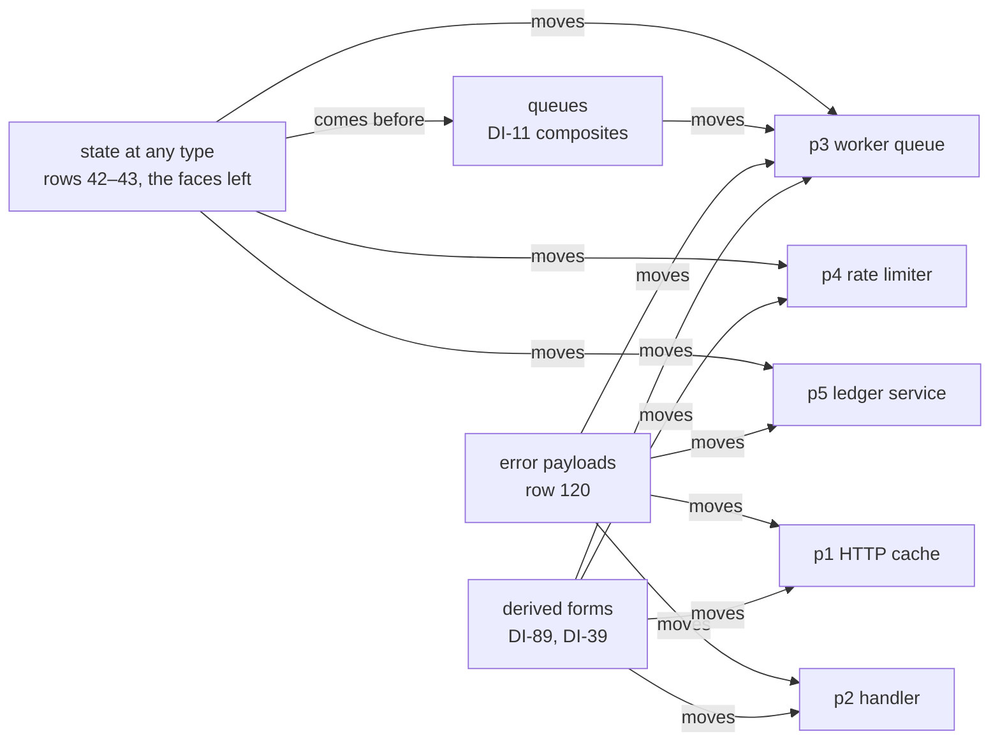

# Dogfood: the rc.112 programs as acceptance tests

Decisions row 206 (ruled 2026-10-04) makes the five model-probe programs tracked acceptance
tests. This folder holds them. Each program has one plan row below. The row names the stage its
battery measures today, what the program waits on, and the slice expected to move it. Each slice
of row 204 moves at least one program forward.

## The folder

- `rc112/` holds the reference texts: the five rc.112 programs, their run scripts, three
  controls, the recorded runs and the checksums. No gate runs them.
- `Stage.lean` holds the words the five batteries share: `verdict`, `Reach`, `Answer` and
  `formAdmits`.
- `P1HttpCache.lean` to `P5LedgerService.lean` hold one battery per program. `Test/All.lean`
  imports each one, so the module-closure gate and the axiom gate cover them.
- Each battery declares two literals that the semantics report reads (`make gen-semantics`):
  - `stage`, the stage the program reaches;
  - `waitsOn`, the requirements of the system map's §8 that its row below explains.
  `generated/semantics.md` prints them in its section "Acceptance programs", with the programs
  each requirement keeps waiting.
- `Scenario.lean` holds what the scenarios share: the script alphabet, the driver, the readers of a
  run's session part, the driver's laws and the gate `#scenario_gate`.
- `Scenario/` holds one battery per scenario. `Scenario/Tape.lean` holds the text of their lowered
  runs, and `Scenario/Lowered.lean` binds the engine's fixtures to it. `Scenario/Faces.lean` pins
  that each scenario's program prints and reads back. `Test/All.lean` imports each one.

## The reference texts

The model probe's programs seat wrote the five programs on 2026-09-30, and its verifier reran
them with identical lines (`docs/research/2026-09-30-model-probe/synthesis.md` §2.4). Commit
`ce2ece4f` recorded them
(`git:ce2ece4f:docs/research/2026-09-30-model-probe/programs/ts/hostruns.log`), and `f7ccf52e`
dropped them from the research tree. Every file of `rc112/` is byte-identical to its blob at
`ce2ece4f`.

| Fact | Value | Source |
| --- | --- | --- |
| Effect | 4.0.0-rc.112, the pinned package under `ts/eff/node_modules` | `rc112/hostruns.log`, first line |
| Runtime | bun 1.4.2 | `rc112/hostruns.log`, first line |
| Type check | tsgo 7.0.0-dev.20260629.1: exit 0 on the five programs and two controls; exit 1 on `rc112/red-control.ts` with its three errors | `rc112/typecheck.log` |
| Checksums | SHA-256 of the fourteen TypeScript files | `rc112/sha256.txt` |

The `tsconfig` files resolve `effect` by absolute paths into the main checkout's
`ts/eff/node_modules`. To rerun the recorded checks, follow these steps.

1. Change to `Test/Dogfood/rc112`.
2. Run `shasum -a 256 -c sha256.txt`. Every line reads `OK`.
3. Run tsgo with `tsconfig.json`, then with `tsconfig.red.json`, as `rc112/typecheck.log` records.
4. Run bun on each `run-p*.ts` file with `--tsconfig-override=./tsconfig.bun.json`.
5. Run `run-p2-noenv.ts` without `ADMIN_TOKEN` in the environment.

## The plan rows

Each stage below is the `stage` declaration of the program's battery. A guard in the battery ties
that declaration to the measurement, so the row and the battery cannot disagree while
`Test/All.lean` builds.

| Program | What it does | Stage today | Waits on | Slice of row 204 that moves it |
| --- | --- | --- | --- | --- |
| p1: `rc112/p1-http-cache.ts`, battery `P1HttpCache.lean` | Fetches a quote over HTTP. A 2 s timeout bounds each attempt, failures retry on an exponential schedule, a 404 is a typed `HttpError`, and a `Cache` serves the second lookup. | `Api.Author.build` admits the program, and it runs under a scripted host. It answers the body text where rc.112 answers `42`. It prints as TypeScript and reads back: the retry loop states its cursor's type, and the checked type reader reads it (DI-91; the state plan's T5, part B). Refused: a `Quote` record in the key-value cache (`requestNotSubtype`). The payload part `HttpError{status, url}` builds as a typed failure, runs to `Err.payload` with rc.112's recorded 404 error, prints as a module that declares its `Data.TaggedError` class and fails with `new HttpError({ … })`, and reads back (row 120, part E2). A signed `status` is refused at admission (row 121). | R10: DI-89 (`retry`, `catchTag`), DI-39, post-Phase C's W6 (`timeout`), DI-91. R3: row 121 (`status: number`). R7: row 82 (`Cache` keeps code). R6, parked: the retirement notice. | Error payloads (row 120), with the derived forms beside them |
| p2: `rc112/p2-handler-layers.ts`, battery `P2HandlerLayers.lean` | Handles a request over layered services: `UserRepo` runs SQL through a captured client, `AppConfig` reads `Config`, and a middleware provides `CurrentUser`. | `Api.Author.build` admits the handler program at `Response`, bounded as seat W10's brief bounds it. It runs to rc.112's three answers, prints as TypeScript and reads back. Refused: a string or record service carrier (`serviceCarrier: signature none`); a number in a template string (`typing: term`). The payload parts `NotFound{id}` and `Unauthorized{reason}` build as typed failures and run to `Err.payload`, and `tagIs` catches a payload by its `_tag`; each prints as a module that declares its `Data.TaggedError` class and fails with `new`, and reads back (row 120, part E2). | R3: row 130 (`catchTag`'s residual over records). R5 and R7: rows 21, 82, 118 (code-valued services, structured carriers). R13: rows 51, 83 (`Config` at load). Row 131 (number to text); row 123 (decoding inside a program). R10: DI-39, DI-89, row 130 (`catchTag`). | Error payloads (row 120), with the derived forms beside them |
| p3: `rc112/p3-worker-queue.ts`, battery `P3WorkerQueue.lean` | Drains a bounded queue with three workers. Each worker holds a connection that it releases on any exit. A `Deferred<void>` gate ends the run, and the program interrupts the pool. | `Api.Author.build` admits the program, with the queue as two host rows, and it runs under a scripted host. It answers `[3, 5]` (closes, jobs) where rc.112 answers its log. It prints as TypeScript and reads back. Refused: the log's first append at `Ref<never[]>`, at the term's result (`resultNotSubtype`). The gate as `Deferred<void>` builds and runs since T3a. Since the state plan's T5, part B, it prints as `Deferred.make<void, never>()` and reads back. Since the state plan's T3b the log's append is rc.112's `Ref.update` with a binder term: at a cell ascribed `ReadonlyArray<string>` it builds and runs to its lines. rc.112's `finish`, one `Ref.modify` that counts and decides "last", builds and answers a boolean over a number cell. Since the state plan's T5, part A, both rows print as functions of the current value, and each module reads back. The payload part `JobFailed{id, reason}` builds as a typed failure, runs to `Err.payload`, prints as a module that declares its `Data.TaggedError` class and fails with `new JobFailed({ … })`, and reads back (row 120, part E2). | R4: rows 42–43 step 5, the faces (the log's element type as a type argument, `Ref.make<A>`). R10: DI-11 (the queue composite), DI-89 (`forEach`). R3: row 130 (`catchTag`'s residual over records). Row 131. R11. | State at any type: its step 5, the faces. Then queues |
| p4: `rc112/p4-rate-limiter.ts`, battery `P4RateLimiter.lean` | Dogfood 1's fixed-window rate limiter: three requests per window, a refill daemon, five concurrent requests and a shutdown. | Since the state plan's T3b the measured program is rc.112's: one `Window` cell, and each request one `Ref.modify` whose term decides and rewrites the record in one store step. `Api.Author.build` admits it, and it runs to rc.112's `[3, 2, 3]`, with or without a yield before a request's step. Since the state plan's T5, part A, its terms print as functions of the window, so it is printed and read back. The printed request does not type-check under tsgo 7 yet: `pair` keeps a boolean literal's type on the target (seat T5's measure; the repair is the owner's to rule). The race control is the earlier three-cell program, which prints and reads back: with a yield between its read and its write it answers `[5, 0, 5]`. | R4: rows 42–43 step 5, the faces (the printed request's typing on the target). R10: DI-89 (`all`). | State at any type: its step 5, the faces. Then the derived forms |
| p5: `rc112/p5-ledger-service.ts`, battery `P5LedgerService.lean` | A `Ledger` service over an `Account` record with a list of variants. It fails with `InsufficientFunds`, keeps listeners and removes them by identity, and wraps a host timer with `Effect.callback`. | `Api.Author.build` admits no program for it. The `Account` record in one `Ref` builds, written and read, since the state plan's T3a. Since T3b the pure part of a deposit is one atomic `Ref.modify` over the record, whose term captures the amount: it builds and runs, and since the state plan's T5, part A, it prints as a function of the account and reads back. Refused: a signed number (table admission refuses an `int` column as uninhabited). The payload part `InsufficientFunds{needed, available}` with natural fields builds as a typed failure, runs to `Err.payload`, prints as a module that declares its `Data.TaggedError` class and fails with `new InsufficientFunds({ … })`, and reads back (row 120, part E2); signed fields are refused at admission. `settle` alone runs on the logical clock to `"settled"`. | R4: rows 42–43 step 5, the faces (the state plan's T5). R3: row 121 (`int`). R7: row 82 (listeners, effect-valued answers, the cancel effect). R10: DI-89, DI-39. R6, parked, or the logical clock. | State at any type, and error payloads |

The diagram below shows which slice of row 204 each program waits on. It claims no order among
the programs.

## How to read a stage

A battery measures one `Reach` value (`Stage.lean`) and pins it to its `stage` declaration. The
fields have these meanings:

| Field | Meaning |
| --- | --- |
| `refused` | Each part of the rc.112 program that the language refuses today, with the build's `verdict` |
| `admitted` | `Api.Author.build` elaborates the battery's program from its authoring source, types it and admits it with its row table |
| `answer` | The run's root exit against rc.112's recorded answer: `rc112`, `differs`, `unfinished` or `notRun` |
| `printed` | `Api.print` answers TypeScript syntax for the program. A read-modify-write row prints its binder term as a function of the current value (the state plan's T5, part A) |
| `readBack` | `Api.readable` holds: reading the program's printing gives the program back |

A battery also pins each error payload part apart from the program's stage (`PartReach`,
`Stage.lean`; decisions row 120). The fields are the build's verdict, whether the part's run
fails with its record as the first typed failure, the module printer's answer (`Api.emitModule`:
`printed`, or a payload class refused by name with its tag) and whether the printed module reads
back (`Api.readModule`). Since part E2 the module declares one `Data.TaggedError` class per tagged
payload type and constructs the payload with `new`.

Each run is a finite probe: one scripted host and one decision tape per run. A stage is not a
theorem. An equal answer is a test on one recorded run, and the battery claims no simulation.

## How a slice moves a program

1. Build the program's battery after the slice lands.
2. If a pin turns red, read what moved: a refused part builds, or a run reaches rc.112's answer.
3. Rewrite the battery's program with the spelling the slice lands.
4. Update the battery's `stage`, then the program's row in this file.
5. Name the moved program in the slice's receipt.

## The scenarios

Decisions row 254 (owner, 2026-10-05) adds scenarios to the acceptance programs. A scenario tests
the semantics where features compose. It is one unit with six parts.

| Part | Content |
| --- | --- |
| Program | One program through `Api.Author.build`, built on the consumer of a battery above |
| Script | A `List Move` (`Scenario.lean`): control decisions, held calls, reply receipts and reply applications |
| Observation | One named structure read from the run. Every control compares it |
| Claim | One theorem whose proof assembles the clauses. Each clause is a theorem or a planned goal with its placement |
| Controls | For each clause, and for each associated law, a green control and at least one red control |
| Lowered runs | The same observation on the generated OCaml engine and on the printed TypeScript module, or the stage that run waits on |

The driver plays a script into the run's own journal. It keeps the reply receipt and the reply
application apart, and it selects a live call by its key. The run a script reaches is the run its
journal reaches (`replays`, `Scenario.lean`), so a replay calls no fixture.

A scenario's record names its program, its observation and its claims as declarations
(`Scenario`, `Scenario.lean`). It lists two kinds of entry.

- An **assembled clause** is a claim that the scenario's claim uses in its proof.
- An **associated law** has controls only. The record claims no dependency of the claim on it.

`#scenario_gate` stands at the foot of each scenario's battery. It checks the record against the
environment and runs the controls once. It refuses:

- a program or an observation that does not resolve to a declaration;
- a claim that is no theorem and no planned goal;
- a claim with no placement (decisions row 207);
- a claim whose proof does not reach one of its assembled clauses;
- a claim that rests on a planned goal which no clause names;
- a clause or a law with no green control, or with no red control;
- a control that names no clause and no law, or that fails.

A battery's declaration carries its own placement at a requirement. Any other declaration carries
`@[semantics]`, or the semantics registry places it: as a requirement's top node, as a claim's
pointer, or by its module.

The gate measures the two dependency findings on the planning graph (`ProofGraph.buildPlan`,
`tools/ProofGraph/Plan.lean`). A planned goal is reached when the claim rests on it. A theorem is
reached when the walk from the claim's proof reaches it through the batteries' declarations.

So no control stands outside a scenario, and no scenario stands without a placed claim. Each
control is a finite probe: one script on the Lean machine. A claim's standing is derived from its
proof: `#plan_status` prints it, with the planned goals the claim rests on.

The gate has controls of its own: `Scenario/Gate.lean` runs it over nine fixture records. Seven
stand on a planned goal of that battery, which states nothing of a program.

| Scenario | Program | Observation | Claim, assembled clauses and associated laws | Lowered runs |
| --- | --- | --- | --- | --- |
| workers: `Scenario/Workers.lean`, on p3's consumer | `crew`: two workers with identities. Each holds a connection that its scope releases, takes jobs from the host and notes each assignment in a shared cell. | `Observation`, seven fields: the assignment of jobs to workers, the accepted reply receipts, the reply applications, the retired calls, the cleanup identities, the root's exit and the work left. | `workers` assembles four clauses: `receipt_inert`, `applied_selects` and `control_retires` (theorems of `Scenario.lean`), and the planned goal `releases_once`. That goal says: under every script the crew releases no connection twice. Associated law: `replays`. | Engine: `workers.txt`, five runs of the machine clause. Host: waiting on the keyed lane. The program prints and reads back since the state plan's T5, part A (`Scenario/Faces.lean`). |
| routing: `Scenario/Routing.lean`, on p2's consumer | `request`: p2's handler on its two host rows. `handleOn` writes it over any repository row and any two handler tests. | `Observation`, three fields: the exact response or the failure that escapes, the repository's calls, and the refused rows with the session's reason. | `routing` assembles three clauses: `tagIs_pair` (a theorem: the handler's test is exact on the pair spelling), and the planned goals `infrastructure_escapes` and `unauthorized_calls_nothing`. Associated law: `submit_success_prepared_fits`, a theorem of the law graph. | Engine: `routing.txt`, four runs of the machine clause. Host: waiting on the keyed lane. The program prints and reads back (`Scenario/Faces.lean`). |
| atomic: `Scenario/Atomic.lean`, on p4's and p5's consumers | `shop`: a rate-limited ledger. Each request decides over the window in one store step, and an admitted request deposits its number in one store step. Request 2 fails behind both commits. Each request's finalizer notes what it sees. | `Observation`, five fields: each request's outcome, the whole window, the whole account, the count of completed requests and the cleanup log. | `atomic` assembles five clauses. Four are planned goals over every script: `bounded`, `counted`, `committed` and `cleans_once`. One is a theorem on the straight fragment: `unsuspended_runs`. Associated law: `syncRow_typed`, a theorem of the law graph. | Engine: `atomic.txt`, three runs of the machine clause. Host: waiting on the keyed lane. The program prints and reads back since the state plan's T5, part A (`Scenario/Faces.lean`). |
| timeout: `Scenario/Timeout.lean`, on p1's consumer | `fetch`: p1's quote fetch, with a 2000 ms timeout around each attempt and three retries. Each attempt counts itself before its host call, and its finalizer notes how it ended. | `Observation`, nine fields: what became of each held call, the accepted reply receipts, the reply applications, the retired calls and the stored replies. Then the attempts started, the cleanup log, the root's ending and the timer work. | `timeout` assembles three clauses, each a planned goal: `retries_declared`, `stale_never_applies` and `cleanup_keeps`. Associated laws: `applyReply_zero` and `advance_answer_refuses`, theorems of the law graph, and `replays`. | Engine: `timeout.txt`, six runs of the machine clause, and p1's own program as the handle case. Host: waiting on the keyed lane. The program prints since the state plan's T5, part A, and reads back since part B's second step: the checked type reader reads the retry loop's stated cursor type (`Scenario/Faces.lean`). |

Two cases have no control, and each battery's header states its case.

- A cleanup replayed under one registration (atomic). The cleanup log counts writes by identity,
  and it does not count a finalizer's invocations.
- A timer that fires inside a masked region (timeout). That cut waits for the mask's contract
  (decisions rows 244 to 246).

### The lowered runs

The generated OCaml engine holds no session: no stored reply, no retired call, no consumed call.
So a scenario's observation lands as two clauses.

- **The session clause** is the whole observation. Each scenario's battery checks it on the Lean
  machine. The host run checks it on the printed TypeScript module, on the keyed lane.
- **The machine clause** is `machineView` (`Scenario.lean`). It holds six readings: the root's
  exit, the cells, the calls the machine waits on, the armed owners, the runnable fibers and the
  timers.

`Scenario/Tape.lean` holds what Lean writes for the machine clause: each scenario's lowered runs,
their machine tapes and the fixture text. It has no control, so it builds whatever the committed
files hold. A fixture holds the canonical bytes of the admitted program and of each row, and the
budgets. It also holds the machine tape: each decision that moved the session machine, with the
view after it.

`Scenario/Lowered.lean` binds each committed fixture under `ocaml/engine/test/scenarios/` to that
text. `ocaml/engine/test/scenarios/test_scenarios.ml` replays each prefix of each tape through the
generated `api_replay`, with the row table read from its wire bytes, on both instances. It compares
the engine's view with Lean's at every position.

A fixture's line `table differs` or `table same` records one comparison, in one projection. It
says whether the raw replay with the empty table shows another machine view at some position.
`table same` does not say that the replay reads no row of the table. The run `handle/cache` of
`timeout.txt` is p1's own program, whose first host row answers a handle. It is the one run that
says `table differs`.

The theorem `tape_replays` (`Scenario.lean`) is the Lean half: a journal's machine is the raw
replay of its tape, for every run and every journal whose tape reads to its end. The tape holds
the decision that the session hands the machine: for a reply application, the reply's own answer
decision. The battery also checks it at every position of every fixture, as finite runs.
The engine's session clause waits: the engine has no session to compare.

To write the fixtures again, follow these steps from the repository's root.

1. Build `Test.Dogfood.Scenario.Tape`.
2. Run `lake env lean --run ocaml/engine/test/scenarios/write.lean`.
3. Build `Test.Dogfood.Scenario.Lowered`, which binds the files.
4. Run `dune test --force engine/test/scenarios` in `ocaml/`, through `opam exec --switch=effect4`.

Lake does not see a fixture as an input of the battery. So after a change of a fixture alone,
`lake build` takes the battery from its cache and binds nothing. To bind the files then, run
`lake env lean Test/Dogfood/Scenario/Lowered.lean`: it elaborates the battery afresh.

## The earlier dogfood programs

The dogfood notes of 2026-09-15 and 2026-09-16 record findings F1 to F30 over four applications.
Their source files were never committed, so this folder tracks none of them. Program p4 is
dogfood 1's rate limiter, written as an rc.112 user writes it.
