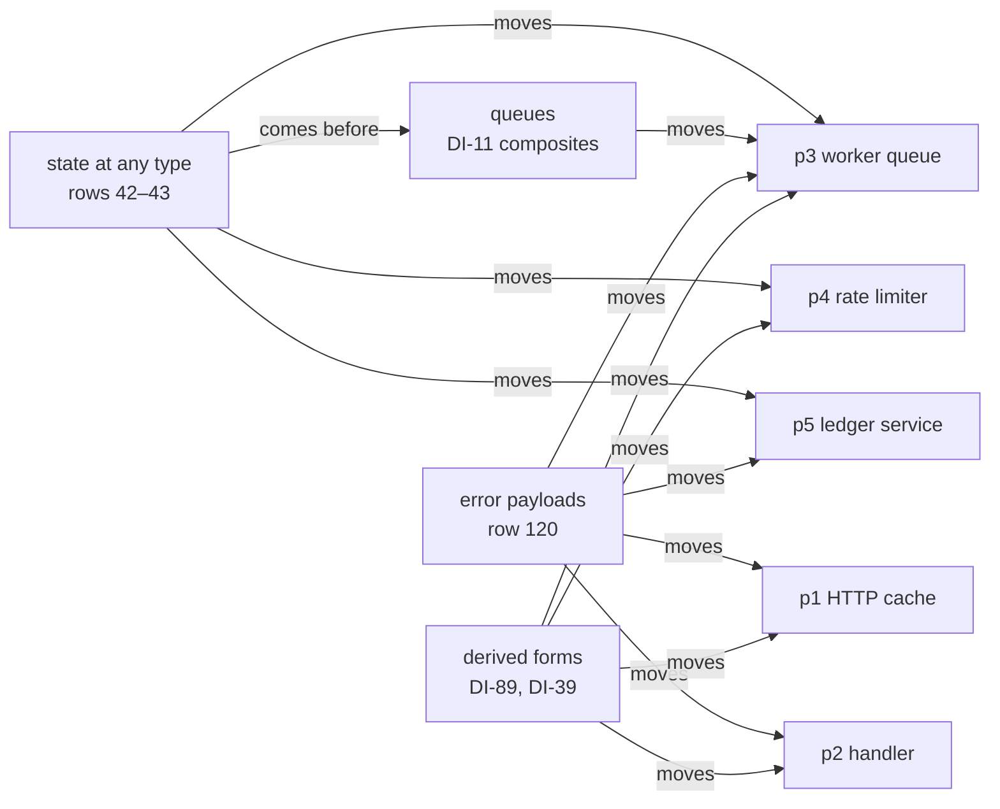

# Dogfood: the rc.112 programs as acceptance tests

Decisions row 206 (ruled 2026-10-04) makes the five model-probe programs tracked acceptance
tests. This folder holds them. Each program has one plan row below. The row names the stage its
battery measures today, what the program waits on, and the slice expected to move it. Each slice
of row 204 moves at least one program forward.

## The folder

- `rc112/` holds the reference texts: the five rc.112 programs, their run scripts, three
  controls, the recorded runs and the checksums. No gate runs them.
- `Stage.lean` holds the words the five batteries share: `verdict`, `Reach`, `Answer` and
  `formAdmits`.
- `P1HttpCache.lean` to `P5LedgerService.lean` hold one battery per program. `Test/All.lean`
  imports each one, so the module-closure gate and the axiom gate cover them.
- Each battery declares two literals that the semantics report reads (`make gen-semantics`):
  - `stage`, the stage the program reaches;
  - `waitsOn`, the requirements of the system map's §8 that its row below explains.
  `generated/semantics.md` prints them in its section "Acceptance programs", with the programs
  each requirement keeps waiting.

## The reference texts

The model probe's programs seat wrote the five programs on 2026-09-30, and its verifier reran
them with identical lines (`docs/research/2026-09-30-model-probe/synthesis.md` §2.4). Commit
`ce2ece4f` recorded them
(`git:ce2ece4f:docs/research/2026-09-30-model-probe/programs/ts/hostruns.log`), and `f7ccf52e`
dropped them from the research tree. Every file of `rc112/` is byte-identical to its blob at
`ce2ece4f`.

| Fact | Value | Source |
| --- | --- | --- |
| Effect | 4.0.0-rc.112, the pinned package under `ts/eff/node_modules` | `rc112/hostruns.log`, first line |
| Runtime | bun 1.4.2 | `rc112/hostruns.log`, first line |
| Type check | tsgo 7.0.0-dev.20260629.1: exit 0 on the five programs and two controls; exit 1 on `rc112/red-control.ts` with its three errors | `rc112/typecheck.log` |
| Checksums | SHA-256 of the fourteen TypeScript files | `rc112/sha256.txt` |

The `tsconfig` files resolve `effect` by absolute paths into the main checkout's
`ts/eff/node_modules`. To rerun the recorded checks, follow these steps.

1. Change to `Test/Dogfood/rc112`.
2. Run `shasum -a 256 -c sha256.txt`. Every line reads `OK`.
3. Run tsgo with `tsconfig.json`, then with `tsconfig.red.json`, as `rc112/typecheck.log` records.
4. Run bun on each `run-p*.ts` file with `--tsconfig-override=./tsconfig.bun.json`.
5. Run `run-p2-noenv.ts` without `ADMIN_TOKEN` in the environment.

## The plan rows

Each stage below is the `stage` declaration of the program's battery. A guard in the battery ties
that declaration to the measurement, so the row and the battery cannot disagree while
`Test/All.lean` builds.

| Program | What it does | Stage today | Waits on | Slice of row 204 that moves it |
| --- | --- | --- | --- | --- |
| p1: `rc112/p1-http-cache.ts`, battery `P1HttpCache.lean` | Fetches a quote over HTTP. A 2 s timeout bounds each attempt, failures retry on an exponential schedule, a 404 is a typed `HttpError`, and a `Cache` serves the second lookup. | `Api.Author.build` admits the program, and it runs under a scripted host. It answers the body text where rc.112 answers `42`. It prints as TypeScript and does not read back (the retry loop's annotation, DI-91). Refused: a `Quote` record in the key-value cache (`requestNotSubtype`). The payload part `HttpError{status, url}` builds as a typed failure, runs to `Err.payload` with rc.112's recorded 404 error, prints as a module that declares its `Data.TaggedError` class and fails with `new HttpError({ … })`, and reads back (row 120, part E2). A signed `status` is refused at admission (row 121). | R10: DI-89 (`retry`, `catchTag`), DI-39, post-Phase C's W6 (`timeout`), DI-91. R3: row 121 (`status: number`). R7: row 82 (`Cache` keeps code). R6, parked: the retirement notice. | Error payloads (row 120), with the derived forms beside them |
| p2: `rc112/p2-handler-layers.ts`, battery `P2HandlerLayers.lean` | Handles a request over layered services: `UserRepo` runs SQL through a captured client, `AppConfig` reads `Config`, and a middleware provides `CurrentUser`. | `Api.Author.build` admits the handler program at `Response`, bounded as seat W10's brief bounds it. It runs to rc.112's three answers, prints as TypeScript and reads back. Refused: a string or record service carrier (`serviceCarrier: signature none`); a number in a template string (`typing: term`). The payload parts `NotFound{id}` and `Unauthorized{reason}` build as typed failures and run to `Err.payload`, and `tagIs` catches a payload by its `_tag`; each prints as a module that declares its `Data.TaggedError` class and fails with `new`, and reads back (row 120, part E2). | R3: row 130 (`catchTag`'s residual over records). R5 and R7: rows 21, 82, 118 (code-valued services, structured carriers). R13: rows 51, 83 (`Config` at load). Row 131 (number to text); row 123 (decoding inside a program). R10: DI-39, DI-89, row 130 (`catchTag`). | Error payloads (row 120), with the derived forms beside them |
| p3: `rc112/p3-worker-queue.ts`, battery `P3WorkerQueue.lean` | Drains a bounded queue with three workers. Each worker holds a connection that it releases on any exit. A `Deferred<void>` gate ends the run, and the program interrupts the pool. | `Api.Author.build` admits the program, with the queue as two host rows, and it runs under a scripted host. It answers `[3, 5]` (closes, jobs) where rc.112 answers its log. It prints as TypeScript and reads back. Refused: the log's first append at `Ref<never[]>` (`requestNotSubtype`; the log builds since the state plan's T3a); the gate as `Deferred<void>` in TypeScript (the printer refuses `Deferred.make` by name; the gate builds and runs since T3a). The payload part `JobFailed{id, reason}` builds as a typed failure, runs to `Err.payload`, prints as a module that declares its `Data.TaggedError` class and fails with `new JobFailed({ … })`, and reads back (row 120, part E2). | R4: rows 42–43 steps 3–5 (the log's element type, the gate's printing, `Ref.modify` with a binder). R10: DI-11 (the queue composite), DI-89 (`forEach`). R3: row 130 (`catchTag`'s residual over records). Row 131. R11. | State at any type, then queues |
| p4: `rc112/p4-rate-limiter.ts`, battery `P4RateLimiter.lean` | Dogfood 1's fixed-window rate limiter: three requests per window, a refill daemon, five concurrent requests and a shutdown. | `Api.Author.build` admits the program over three number cells, and it runs to rc.112's `[3, 2, 3]`. It prints as TypeScript and reads back. With a yield inside a request it answers `[5, 0, 5]`, the race the atomic `Ref.modify` avoids. The `Window` record in one `Ref` builds, written and read, since the state plan's T3a; the program keeps its three number cells until the atomic decision lands. | R4: rows 42–43 steps 3–5 (an update with a binder term, T3b). R10: DI-89 (`all`). | State at any type |
| p5: `rc112/p5-ledger-service.ts`, battery `P5LedgerService.lean` | A `Ledger` service over an `Account` record with a list of variants. It fails with `InsufficientFunds`, keeps listeners and removes them by identity, and wraps a host timer with `Effect.callback`. | `Api.Author.build` admits no program for it. The `Account` record in one `Ref` builds, written and read, since the state plan's T3a. Refused: a signed number (table admission refuses an `int` column as uninhabited). The payload part `InsufficientFunds{needed, available}` with natural fields builds as a typed failure, runs to `Err.payload`, prints as a module that declares its `Data.TaggedError` class and fails with `new InsufficientFunds({ … })`, and reads back (row 120, part E2); signed fields are refused at admission. `settle` alone runs on the logical clock to `"settled"`. | R4: rows 42–43 steps 3–5. R3: row 121 (`int`). R7: row 82 (listeners, effect-valued answers, the cancel effect). R10: DI-89, DI-39. R6, parked, or the logical clock. | State at any type, and error payloads |

The diagram below shows which slice of row 204 each program waits on. It claims no order among
the programs.

## How to read a stage

A battery measures one `Reach` value (`Stage.lean`) and pins it to its `stage` declaration. The
fields have these meanings:

| Field | Meaning |
| --- | --- |
| `refused` | Each part of the rc.112 program that the language refuses today, with the build's `verdict` |
| `admitted` | `Api.Author.build` elaborates the battery's program from its authoring source, types it and admits it with its row table |
| `answer` | The run's root exit against rc.112's recorded answer: `rc112`, `differs`, `unfinished` or `notRun` |
| `printed` | `Api.print` answers TypeScript syntax for the program |
| `readBack` | `Api.readable` holds: reading the program's printing gives the program back |

A battery also pins each error payload part apart from the program's stage (`PartReach`,
`Stage.lean`; decisions row 120). The fields are the build's verdict, whether the part's run
fails with its record as the first typed failure, the module printer's answer (`Api.emitModule`:
`printed`, or a payload class refused by name with its tag) and whether the printed module reads
back (`Api.readModule`). Since part E2 the module declares one `Data.TaggedError` class per tagged
payload type and constructs the payload with `new`.

Each run is a finite probe: one scripted host and one decision tape per run. A stage is not a
theorem. An equal answer is a test on one recorded run, and the battery claims no simulation.

## How a slice moves a program

1. Build the program's battery after the slice lands.
2. If a pin turns red, read what moved: a refused part builds, or a run reaches rc.112's answer.
3. Rewrite the battery's program with the spelling the slice lands.
4. Update the battery's `stage`, then the program's row in this file.
5. Name the moved program in the slice's receipt.

## The earlier dogfood programs

The dogfood notes of 2026-09-15 and 2026-09-16 record findings F1 to F30 over four applications.
Their source files were never committed, so this folder tracks none of them. Program p4 is
dogfood 1's rate limiter, written as an rc.112 user writes it.
