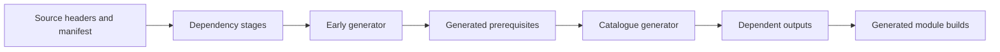

# Generated files

This map names the generated groups, their producers, their inputs, their consumers and
the check that covers each. It owns the generation rule; `docs/ARCHITECTURE.md` owns the
surrounding module boundaries.

## The rule

Every generated file is produced by one `make gen-<group>` rule and listed in the
Makefile's `GENERATED_PATHS`. `make check-gen` regenerates the stale Lean-only groups and
refuses any change to a committed file (`git diff --exit-code` over exactly those paths);
`make check-gen-full` re-cuts every group, the host-cut ones included, without trusting
file times. A generated file carries one header line, `GENERATED by <producer>; do not
edit`, and nothing else about its provenance: whether it is up to date is the build
graph's question, answered from the generator's sources and the Lake trace of the
compiled core it reads, and drift is the diff. (Until 2026-09-13 every generated file
carried a git revision and a fingerprint of the producer's import closure, in its header
or in a `.cut-from` sidecar beside it, checked by a separate stamp gate. Any edit to the
core rewrote about three hundred of those labels per commit, and four families sat
outside the one generation command, so a Lean edit turned the hermetic checks red until a
host command was run by hand in the right order. Wave 1 of the checking refactor removed
the labels, the sidecars, the stamp gate and the per-script result caches; the Makefile
is the graph.)

The three tiers are:

- **build artifact**: produced by the build system or build setup and never committed;
- **committed projection**: generated output kept in Git and checked byte for byte
  against a fresh run;
- **vendored input**: copied from an identified source, with provenance recorded.

`make gen` runs every stale group in the producers' dependency order, which is the Makefile's
`GEN_GROUPS` (this file does not restate it). Each group's marker depends on the previous one, so
a regenerated upstream group re-cuts everything downstream of it. The semantics group reads no
preceding group's output: it is a hermetic group of its own, regenerated by `make check-gen` like
the Lean-only groups, and its committed projection is `generated/semantics.md` alone (the JSON
form stays under `.lake/gen/semantics-report`). Its refusal controls are `make check-semantics`.
The fixtures group is hermetic in the same way. Its marker also depends on its own outputs,
because Lake does not take a file read by `include_str` as an input. A fixture that changes
alone is written again from Lean, and a committed fixture that Lean does not write is drift.
Its marker depends on every Lean source, and it does not wait for `build`. When a program
changes, the binding battery refuses the old fixture, and the default build is red until
`make gen-fixtures` writes the fixture again.
The group lcnf is another deliberate exception: it sits in the order between
derived and eff, because eff cuts the engine's layout mirror from the api_engine.ml lcnf
writes, but its marker is not a link of the chain, so `check-gen` — which runs inside `make
check`, on every core change — does not reach a group whose engine cut is minutes. lcnf used
to run last, after readme, which made `make gen` a non-fixpoint: a changed row needed a second
pass before the mirror agreed with the face (tooling plan 4.2). `make gen-<group>` regenerates
one group; `make clean-gen` forgets the markers. The recipes hold the Lean lane one at a time.

## Generator bootstrap

`make gen-derived` can run before the Effect4 library builds.
Its freshness inputs include Lean source files and directories, package pins and declared producer inputs.
A missing derived output also triggers its producer.
The variance producer uses its own narrow build.
Neither producer first builds the whole library.

`Effect4Gen.Driver.sourceGraph` parses ordinary source imports with Lean's parser.
The manifest declares imports for generated modules, including missing outputs.
The scheduler includes each generator executable's imports and each manifest row's runtime imports.
It refuses missing import evidence, repeated output paths, self-dependencies and dependency cycles.
Each stage builds its prerequisites, generates temporary files, then compares or installs them.
A failed stage installs none of its outputs.
A difference in check mode stops generation before dependent stages build.
The final narrow build checks every generated Lean module.

## Declarations generated during elaboration

The typed-state group has no generated source file or committed table. `#typed_state`
constructs the skeleton inside `Laws/Program/Typed/State.lean` from its roots and the
`Typed/Sources.lean` declaration. `#frame_rules` constructs checked theorems in
`Typed/Frames.lean`. Lake owns the dependencies and rebuilds both with the input changes;
the normal Laws/Test roots include them and their controls (`Test/Audit/`). A `Source.owner` row receives the entire structure
or every constructor argument. Its descendants are covered; a redundant row is refused. A
`Source.each` row on a containment edge with one child type states a hand predicate at each child
the field holds, beside the child's own clause, and covers nothing (decisions row 151 (a″): the
scope store's registered finalizers).
A shared nested type still needs rows where another path reaches it outside that owner.
`TypedSources.lean` supplies the same ownership accounting to the source gate and the emitter.
Whole-owner frame rules require a new premise for every field update. The old
`TypedStateEmit.lean` file writer is retired.

The proof-ledger command reads obligation theorems and placeholder definitions, searches with
the supplied tactic, and checks the resulting theorem terms through `ProofGraph`.
`#obligation_proved X := term` supplies a proof of the exact statement directly; both routes
share the dependency checks and reject a remaining placeholder for a proved statement.
`#obligation_audit NS` compares complete binder lists and propositions against namesake laws;
argument adapters must already have checked evidence. Rendered counts are a report, not an input. Its missing/stale/wrong-proposition/ceiling controls are
in `Test/Audit/{ProofGraph,Obligations}.lean`. The concrete transition-preservation obligation
set still requires the typing-world instantiation; frame premises are not that proof count.

## The groups

| Group | Producer (`make gen-<group>`) | Inputs | Consumers | Check | Evidence (DI-32) |
| --- | --- | --- | --- | --- | --- |
| variances | `tools/Tools/Variances.lean` (`scripts/generate.py --only variances`): declaration-site variance read off the vendored rc.112 sources | the vendored `vendor/effect-4.0.0-rc.112/src` modules the file pins, the driver's head list | `tools/Effect4Gen/variances.json`, an input of `derived` (the TyView group reads it) | `make check-gen` (in `HERMETIC_GROUPS` and `GENERATED_PATHS`) | reproduced |
| derived | `tools/Effect4Gen/Driver.lean` reads the manifest and parses source imports. `scripts/generate.py` orders dependent outputs before their consumers. `Effect4Gen.Exe` builds without Effect4; `Effect4Gen.CatalogueExe` builds after its generated prerequisites | `tools/Effect4Gen/manifest.json`, source imports, generator and guard sources, package pins, `variances.json`, `wire-tags.json`, `binders.json` | Each manifest group's `Out`; Lean modules and `harness/truth/prelude-atoms.gen.ts` | `make check-gen`; focused module builds after generation | reproduced; tested |
| eff | `src/OCaml5/Tools/EffGen.lean`, then `scripts/generate-engine-structure.py` | `Effect4.Program.Native`, `OCaml5.Eff.*` | `ocaml/eff/eff_{types,wire,json,native,layout}.ml`, `eff_manifest.txt`, `program-structure.json`, the 48-program goldens under `ocaml/eff/goldens/`, `ocaml/engine/e4_program_layout.{ml,json}` | `make check-gen`; `make check-ocaml` (the goldens decode, re-encode and print in OCaml; the `.ty` goldens and `corpus.txt` are Lean's typing verdicts, held by the drift check alone since the OCaml checker was retired on 2026-09-13) | reproduced; tested |
| wire | `src/OCaml5/Tools/EffWire.lean` | `Effect4.Program.Wire` and its corpus | `ocaml/goldens/eff/*.hex`, `manifest.txt`, `same-programs.txt` | `make check-gen`; `make check-ocaml` (`test_lean_wire`) | reproduced; tested |
| cas | `src/OCaml5/Tools/CasGoldens.lean` | the store word, genesis and machine stores | `ocaml/engine/cas/goldens/` (119 files) | `make check-gen`; `make check-ocaml` (`engine-tests`) | reproduced; tested |
| ts | `tools/Drivers/TsGen.lean` (`scripts/generate.py --only ts`) | the closed world `OCaml5.Eff.World` reads, `Effect4.Codegen.Templates` (the table of printed clauses) and `Effect4.Codegen.PrintLeaf`, `Ty.normalize`, `Codegen.Types.ofTy`, the variance data, three pinned vendor sources for package tables | `ts/eff/{eff,json,wire,profile,taxonomy,forms,packages,templates}.gen.ts`, `ts/eff/test/type-projection.gen.json` | `make check-gen`; `make check-ts-reader` | reproduced; tested |
| readme | `bun ts/eff/ingest/render-readme.ts` (a host producer; writes in place) | `profile.gen.ts`, `forms.gen.ts`, `taxonomy.gen.ts` | `ts/eff/ingest/README.md` | `make check-gen`; the renderer's own `--check` inside `make check-ingest-smoke` | reproduced |
| lcnf | `src/OCaml5/Tools/LcnfGen.lean`; each output's header carries its exact command | `Effect4.Machine.Fibers`, `Effect4.Api`, `ocaml/engine/externs.txt`, `ocaml/engine/tools/api_engine_prelude.ml` | `ocaml/gen/{fibers_gen,machine_gen,api_gen}.ml`, `ocaml/engine/api_engine.ml` | `make check-gen` holds these four against a hand edit only — the lcnf group is not in `HERMETIC_GROUPS`, so `check-gen` diffs them without re-cutting them and a *stale* output is invisible to it. What re-cuts them is the `check-ocaml` CI job, which runs `make gen-lcnf` and refuses a difference from the committed files, and the nightly `check-gen-full`. `make check-ocaml` (`api_check`, the engine seam in `gen-check.sh`) compiles and runs what is committed | reproduced; tested |
| truth | `harness/truth/Truth.lean` writes the corpus from the committed tapes; `harness/truth/run-truth.ts` runs rc.112, prints the modules, re-records the tapes, writes the result | the Eff corpus, `prelude.ts`, the tapes, the pinned `effect` and `@effect/sql-sqlite-bun` | `harness/truth/corpus.json`, `generated/*.ts`, `result.{json,md}`, `tapes/*.jsonl` | `make check-truth` (a fresh run must equal the committed artefacts; the printed modules type-check first, DI-49) | reproduced (corpus, tapes); tested (the host run) |
| host-protocol | `tools/Tools/HostProtocol.lean` (the `gen-host-protocol` recipe) | `Effect4.Api.HostProtocol` | `harness/truth/session/protocol.gen.ts`, `tape.schema.json` | `make check-host-protocol` | reproduced; tested |
| schema-ts | `harness/schema-generation/Emit{Fixture,CoverageFixture,MultiFixture}.lean`, stdout redirected | `Effect4.Codegen.Schema`, the fixture declarations | the three `.generated.ts` beside them | `make check-schema-ts` | reproduced; tested |
| census | `scripts/generate-effect-runtime-census.sh` (stdout) | the twelve vendored rc.112 sources it names | `generated/effect-runtime-census.tsv`, joined by `Test/Audit/RuntimeCoverage.lean` | `make check-census` | reproduced; proved where a row's witness theorem is joined |
| semantics | `tools/Drivers/Semantics.lean` over `tools/Tools/Semantics.lean` (`make gen-semantics`; hermetic) | `tools/ProofGraph/Registry.lean` (concepts, claims, cuts, defaults, roots, requirements, plan scope), the loaded roots and `semantics` tags, the plan (`tools/ProofGraph/Plan.lean`) and the planned goals (`tools/ProofGraph/Goal.lean`), the acceptance batteries' `stage` and `waitsOn` (`Test/Dogfood`, decisions row 206), the scenario batteries' placed claims and planned goals (`Test/Dogfood/Scenario.lean` and four modules of `Test/Dogfood/Scenario/`, decisions row 254), the counterexample register and the decisions register | `generated/semantics.md` (the JSON form is a build artifact) | `make check-gen` (drift); `make check-semantics` (the refusal controls, `tools/Drivers/SemanticsControls.lean`) | reproduced; checked against the loaded roots |
| fixtures | each lane's writer, `ocaml/engine/test/<lane>/write.lean`, run by `scripts/generate.py --only fixtures` (`make gen-fixtures`; hermetic). The writer is the one hand input: the producer finds a lane by its writer and builds the modules that the writer imports | the writers' imports: `Test.Dogfood.Scenario.Tape` for the scenarios, `Test.Program.QueueScenarios`, `Test.Program.QueueDefs` and `Effect4.Store.Domain.ProgramWire` for the Queue, `Test.Program.MaskContract` for the mask, `Test.Program.SemaphoreScenarios` for Semaphore, `Test.Program.PoolScenarios` for Pool. The marker also depends on the fixtures themselves and on every Lean source under `src` and `Test` | `ocaml/engine/test/scenarios/*.txt`, `ocaml/engine/test/queue/queue.txt` and `queue-defs.txt`, `ocaml/engine/test/mask/mask.txt`, `ocaml/engine/test/semaphore/semaphore.txt` and `ocaml/engine/test/pool/pool.txt`. Each lane's dune test reads them. `Test/Dogfood/Scenario/Lowered.lean`, `Test/Program/QueueEngine.lean`, `Test/Program/MaskEngine.lean`, `Test/Program/SemaphoreEngine.lean` and `Test/Program/PoolEngine.lean` bind them by `include_str` | `make check-gen` (drift, and a committed `*.txt` that no writer writes); `make check-ocaml` runs after the group. The producer refuses a fixture folder that has no writer, and an output folder that is a lane's own folder, before it touches a file. The marker also depends on the inventory of fixtures and writers, so a path that leaves is seen | reproduced; tested |
| architecture | `tools/Tools/Architecture.lean` (`make gen-architecture`) | every `.lean` under `src/`, `tools/` and `Test/` (import headers through `Lean.Elab.parseImports`), the roots `Tools.Architecture.roots` loaded for declaration counts, the estates by file walk, the Makefile's `GEN_GROUPS`, the manifest, this table and `lakefile.toml`; the role register `tools/Tools/ArchitectureRoles.lean` is its one hand input; the proof graph is drawn from the semantics report's JSON (`make gen-semantics`) with d3-dag (`tools/Tools/ProofGraphView.js`) | `.lake/gen/architecture-map.html` (a report, never committed) | none: a report | measured |

Retired 2026-09-13 (the scripts ledger): `git:c67ff096:generated/schema-structural-assurance.tsv`, a
2,682-row projection whose 446-line producer carried the SHA-256 of every Schema source
inside itself and refused to run once any of them changed (the owner had deferred its
stamp on 2026-09-08). The Lean module it projected, and the three other hand-frozen
declaration censuses of the test tree, were retired the same day (stage 2 of the checking
refactor): what they froze by hand — constructor order and arity, owned names, receipts —
is held by the derived projection guard (`tools/Effect4Gen/Check.lean`) and the axiom gate. The retained Schema checks run on their inputs as
`make check-schema-pins` and `check-schema-ts`. Row 39 retires the annotation and
effectful-field harnesses and their `check-schema-host` gate; the pinned
`harness/schema-host` installation remains the host used by `schema-ts`.

The **evidence** column is the word, or words, a group's claim carries, ruled 2026-09-09
(DI-32): *proved* for a theorem, *reproduced* for a byte comparison against a fresh producer
run, *tested* for a finite checker or host run over named inputs. The former fourth word,
*stamped* (a verifying trace over the producer's inputs, with no claim about the committed
bytes), has no carrier since the labels went; every committed group is *reproduced*.

## Fragment predicates

The derived group includes `Fragments`, `FragmentLooped`, `FragmentRows`, and `FragmentLoopedRows` from `tools/Effect4Gen/Fragments.lean`.
They generate the existing fragment predicates from one classification table and the program family metadata.
The outputs are `src/Effect4/Program/Fragment.lean` and `src/Effect4/Laws/Program/Fragment{Looped,Rows,LoopedRows}.lean`.
The existing fold connectors remain in the Laws graph.
`docs/core/traversal-census.md` owns the classification rules and their limits.

## Build artifacts that are not committed

**Promoted projections.** Five committed tables are not cut by `make gen`; each has its own
producer, and a check reads it. `generated/corpus-index.tsv` (`make corpus`, below);
`generated/row-types.tsv` (`tools/Tools/RowTypes.lean`, run by hand: `lake env lean -M4096 --run
tools/Tools/RowTypes.lean generated/row-types.tsv`; `make check-target` refuses a stale one with
`--check`); `generated/assignability.tsv` (`make gen-assignability`) and
`generated/row-citations.tsv` (`make gen-row-citations`), both promoted from `make check-target`'s
lanes; `generated/tsdiag-agreement.tsv` (`make gen-tsdiag`, read by `make check-tsdiag`). The
first four are in `GENERATED_PATHS`, so `make check-gen` refuses a hand edit to them; the fifth
is not, and `check-tsdiag` alone holds it.

**The printed corpus.** `make corpus` runs `tools/Drivers/Corpus.lean` into `.lake/corpus`:
400 programs of Lean's seeded generator (`Test/Program/Gen.lean`) and the wire corpus, each
as `.ts` (the printer's bytes), `.json` (the program Lean's own reader kept) and `.eff` (its
canonical wire bytes), with Lean's `wellTyped` and `readable` verdicts per program in
`index.tsv`. Three checks read it: `make check-ts-reader`, `make check-ingest-smoke` and the
OCaml engine differential inside `make check-ocaml`. It is re-cut when Lake's trace of
`Tools.Corpus` changes; nothing under `.lake/corpus` is committed except its index, which
`make corpus` installs as `generated/corpus-index.tsv` and `make check-gen` holds: one row
per program with Lean's `wellTyped` and `readable` verdicts, so a typing or printer change
shows as a diff that names the programs it moved (DI-60), where the generator once pinned
counts.

**The corpus on rc.112 and under `tsc`.** `make check-corpus` (`scripts/check-corpus.py`) writes
the same 400 programs' manifest with `harness/truth/Truth.lean --corpus`, emits every
printable program's module with the truth runner (the shipped block and the same block with
no annotations), type-checks every shipped module, runs each admitted program on the pinned
runtime in its own process, and compares Lean's answer, error and requirement types with the
types the compiler infers for the unannotated module (`tools/target/corpus.ts`), all under
`harness/truth/corpus-check/` (ignored). What is committed is one row per program,
`harness/truth/corpus-results.tsv`: whether the program is in the straight-line fragment the
machine agreement theorem covers, which module exists and whether it compiles, the run, sync
and type outcomes, both exits and both compared schedules in full. A fresh run must equal it
(`make gen-corpus-results` promotes), and a row that records a disagreement must be listed by
program, dimension and outcome with its reason in `harness/truth/corpus-known-differences.md`,
which may list nothing that no longer occurs.

**Schema codec comparisons.** `make check-schema-codec` produces a temporary TypeScript
data module from the public `Ty.encode` results for
`Test/Codegen/SchemaGenerationContract.lean`'s representative cases
(`harness/truth/schema-codec/Emit.lean`); `check.ts` compares them with pinned rc.112
`Schema.toCodecJson`, decodes and re-encodes them on the host, and checks the rejected
legacy Result/Cause shapes. No codec golden is committed. Finite host evidence, separate
from the universal checked-boundary laws in `Laws/Schema/Codec`.

**Conform outputs.** Source descriptions and conformance reports are build artifacts under
`.lake/conform/`; `scripts/check-conform.py` produces them freshly. The compiler profile's
OCaml is an inspected execution artifact, not a replacement for `ocaml/gen`.

**The keyed session's working receipt** lives under the ignored `.work/` folder beneath
`harness/truth/session/`; it is not a committed projection or an oracle. The v1 serial
adapter in `harness/truth/session/Session.lean` is explicit and separately version checked;
v2 never fills in missing keys from a replay's expected request.

## Host protocol projections

`harness/truth/session/protocol.gen.ts` and `tape.schema.json` are deterministic committed
projections of `src/Effect4/Api/HostProtocol.lean`. The TypeScript adapter and the Lean JSON
driver both use the datum's record fields and transition table. The schema describes record
structure; `Envelope` remains responsible for the actual machine's row/request/completion
judgment. This schema is a tape schema, not a published content-address encoding
(DI-01/04). `make check-host-protocol` regenerates and compares both files, emits admitted
Eff fixtures and binding plans, runs the printed expressions on rc.112, type-checks those
same generated expressions, and replays the recorded tapes in Lean with its finite
controls (missing, stale and duplicate keys; wrong row, request or value; receipt and
application reordering; zero application fuel; empty public chunks).

The same check performs the dogfood scenarios' scripts on their printed TypeScript modules
(decisions row 254). Lean writes each script's fixture afresh into the work folder, and no
fixture of a scenario is committed. `Test/Dogfood/README.md`, section "The host runs", owns
what a host run compares. The check pins the digest of the four fixture families' recordings
(`scripts/check-host-protocol.py`, `CASES_SHA256`).

## Engine boundary

`ocaml/engine/api_engine.ml` is the LCNF projection of `Effect4.Api.run`/`replay` with the
extern table `ocaml/engine/externs.txt` and the hand-written prelude
`ocaml/engine/tools/api_engine_prelude.ml`; `ocaml/engine/tools/gen-check.sh` checks the
seam (no fiber is ever removed from the fiber table; the generated modules build and their
smoke passes; the engine type-checks on its own; the generated file carries the current
prelude). `ocaml/engine/e4_program_layout.{ml,json}` is the selected structural mirror of
`ocaml/eff/program-structure.json` against the engine's declarations, cut by
`scripts/generate-engine-structure.py` inside the `eff` group.
