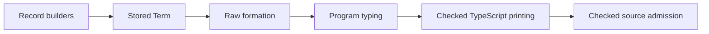

# The application surface: what an agent calls, and the open decisions

The live surface (§1) and the decisions still open on it (§2). The 2026-09-17 consolidation
assessment this document grew from, with its dated action lists, is kept as history in
[`docs/research/history/api-surface-assessment-2026-09-17.md`](../research/history/api-surface-assessment-2026-09-17.md);
rulings live in [decisions.md](decisions.md). The additions of 2026-10-03 (editing, session work,
composition) are §1.1.

## 1. The surface as it stands

| module | file | what an agent calls | laws |
| --- | --- | --- | --- |
| `Author` | `src/Effect4/Api/Author.lean`, `Program/Authoring*.lean` | `Module` (rows, services, layers, definitions, main) → `Author.build : Except BuildRefusal Built`; `Row.host`, `Row.call` by spelling; `ServiceDef.{use,give,layer,constant}`; `Package.install`; `Layer.{value,empty,mergeAll}`, `provide`, `provideAll`, `provideFresh`; `fork`, `daemon p`, `daemon p in s`, `await`, `join`; `Node.{at_,replaceAt,replaceLayerAt}`; `Built.{rebuild,typed,ty,requires,closed,positionOf,runSync,print,bytes}` | `build_table_lawful`, `build_rows_resolve`, `Row.call_scoped`, `carrier_unique`, `var_reserved`, `rebuild_spec`, `rebuild_self` |
| `Run` | `src/Effect4/Run.lean` | `Run.open` (cannot refuse), `Rows.{start,flush,clock,receive,answer,control,tape}` into `List Command`, `Run.{play,step,answer,receive,control}`, `Run.observe : Observation` (first-order, with `fibers`), `Run.inspect : Inspection` (holds the machine), `Run.{work,nextControl,controlOnce}`, `Reactor σ`, `Run.drive`, `runPure`/`runClock`/`runWith` | `open_total`, `journal_replays`, `drive_eq_play`, `drive_envelope`, `runPure_eq_run`, `answer_once`, `answer_accepted`, `bindCall_at`, `nextControl_spec`, `controlOnce_journal`, `play_controls_eq_replay`, `runClock_eq_run` |
| `Run`, the tape | `src/Effect4/Run/Tape.lean` | What a tool reads off a run. The raw replay: `machineOf`, `replayFrom`, `enoughFor`. The machine's view: `MachineView`, `machineViewOf`, `machineView`. The tape of a journal: `Position`, `replyDecision`, `decisionOf`, `receiptRow`, `openedOf`, `readsOn`, `tapeFrom`, `tapeOf`. A run's budget premise and rest: `funded`, `atRest`. Reachable from the `Effect4` root; `Effect4.Api` does not export them yet | `tape_replays`, `funded_replays`, `tapeFrom_cut_replays`, `tapeFrom_position_replays` (`src/Effect4/Laws/Run/Tape.lean`); `applied_selects`, `control_retires` (`src/Effect4/Laws/Run/Rows.lean`) |
| `Supervision` | `src/Effect4/Api/Supervision.lean` | `supervision : Eff Op → List ForkSite`, `ForkSite.parent`, `fiberStatuses`, `daemonsQuiet`, `Supervised`, `Inspection.{fibers,forked,daemonsQuiet}` | `supervision_static`, `supervision_child_flag`, `status_persists`, `spawn_status_fresh`, `daemonsQuiet_iff` |
| `Api` (the older face) | `src/Effect4/Api.lean`, `Api/*.lean` | `check`, `explain`, `blame`, `author`, `Typed.*`, `TypedLayer`/`checkLayer`, `Inspection`, `replay`/`run`/`runSync`, `print`/`read`/`bytesOf`/`ofBytes`, `schemaOf`, `HostSession`, `Runner`, `RunnerBytes` | the DI-85/86 laws, `replay_unique`, the codec laws |

Imports are clean (no surface module imports `Laws`, `Test` or `Aesop`); the package root imports
all four. What the integration already unified: one size fold, `Api.Run` → `Inspection`, the
`Built` face through `Built.typed`, `Layer.all`/`printLayer`/`Built.run`/`authorModule` cut,
`with_` → `provide`.

### 1.1 Editing, session work and composition (2026-10-03)

**Edit, then check the complete candidate.** `Node.replaceAt` replaces an existing node with
another of the same sort. Paths follow structural children: `[]` names the root; for
`bind p q`, `[0]` names `p` and `[1]` names `q`. A missing path or wrong sort returns `none`.
This path language covers the seven program-node sorts; it does not descend into `Term`.
`replaceLayerAt` uses the same operation, so existing layer hoisting and restoration retain
one update mechanism. The lookup, overwrite, restoration and disjoint-path laws are in
[`Laws.Program.References`](../../src/Effect4/Laws/Program/References.lean).

`Built.rebuild` checks a candidate against the original table and retains its row names. A
successful result supplies the newly admitted program and type; the type may differ from the
old one. It reuses the final admission step of `Author.build`, including located typing
refusals. It does not relocate variables or references, or establish unchanged behavior.
Here the outer result reports a structural failure and the inner result reports admission:

```lean
open Effect4

def editProgram (b : Api.Built) (path : List Nat)
    (replacement : Api.Program) :
    Option (Except Api.BuildRefusal Api.Built) := do
  let node ← (Program.Node.eff b.program).replaceAt path (.eff replacement)
  let candidate ← node.eff?
  pure (b.rebuild candidate)
```

[`AuthorContract`](../../Test/Program/AuthorContract.lean) exercises a changed result type
with a nonempty host table, retains table/names, and refuses an unbound variable or a removed
reference target. Whole-program checking matters: even a layer replacement with the same
local type can invalidate references from elsewhere in the program.

**Read recorded work before choosing a control.** `Run.work` exposes runnable fiber IDs,
queued dispatcher owners, outstanding host calls, received reply keys and timer waits.
Queued work is visible even while another fiber is waiting for the host. `nextControl`
selects a queued flush first, otherwise evaluation of the first runnable fiber in machine
order; it selects nothing for a stuck machine. `controlOnce` executes at most that one
control through the existing checked session and journal, or returns the run unchanged.
Inspect the resulting phases and observation: a selected command may refuse or exhaust its
fuel. Host replies, applying received replies and advancing the clock remain caller choices.
An empty work view does not certify completion or deadlock.

[`RunContract`](../../Test/Run/RunContract.lean) demonstrates a yielded continuation, internal
work alongside a host wait, pending receipts, timer waits and insufficient fuel. The selection
and journal laws live in [`Laws.Run`](../../src/Effect4/Laws/Run.lean). For a control sequence,
`play_controls_eq_replay` compares its resulting machine with raw replay when every newly
recorded phase is `.progressed`; the existing history may contain other phases. That premise
is accepted execution at the supplied budgets, not a general progress or termination theorem.

For successful host replies, `HostSession.preflight_success_prepared_fits` and its
`submit_success_prepared_fits` consumer connect actual acceptance on a non-stuck machine to the prepared value at
the selected external row. Membership requires that row's answer type to satisfy
`Typed.shapeDecides`. The result retains the selected call and decision; it does not apply
the receipt, cover failed replies, or establish full T4 token/world correspondence. The
concrete session fixture is in [`HostSessionContract`](../../Test/Api/HostSessionContract.lean).

**Compose a semantic comparison within its proved fragment.**
[`Denote.StraightEq`](../../src/Effect4/Laws/Program/MeaningEq.lean) relates existing straight
programs by equality of exit and complete stores for every environment and initial store.
Its composition laws cover binding, selection, cause handling and finalization; removing a
suspension is one concrete use. `run_agrees_at_bound` supplies sufficient budgets for both
programs and concludes equal exits/stores from the existing empty initial machine setup.
[`MeaningEqContract`](../../Test/Program/MeaningEqContract.lean) checks a rewrite under failure
and cleanup, including retained state. This comparison does not cover traces, arbitrary
finite-fuel frontiers, loops, scheduling, host tables or target execution; it is a contribution
to T5, not the general relation. Typing an edited program still uses admission separately.

### 1.2 Named records

The record builders live in [`Program.Authoring.Records`](../../src/Effect4/Program/Authoring/Records.lean).
They produce the existing `Term` language and use the ordinary program checker.

| Builder | Result |
| --- | --- |
| `record fields present` | A record with its full declaration and explicitly supplied fields. |
| `field target name` | The value of a declared required field. |
| `optionalField target name` | An outer option that reports own-field presence. |
| `recordSet target name value` | A new record with that field required at the replacement type. |
| `ascribe ty e` | A term at a declared type: a record with one field declared at `ty` that holds `e`, and a read of that field. The record's check decides it, so it is no cast. |

`ascribe` lives in [`Program.Authoring.Ascribe`](../../src/Effect4/Program/Authoring/Ascribe.lean).
`Effect4.Api` does not export it yet: a client imports the module by name (decisions row 284).

An absent field differs from a present field containing `undefined` or an empty option.
Updating a field can change its type.
Every alternative of a union must support the requested read or update.
Records retain all field names, including names that need TypeScript bracket access.
The key spelling follows decisions row 196.



Checked declaration production and source admission check stored annotations as well as the final result type.
Raw TypeScript printing and reading retain unsupported metadata for exact structural reconstruction.
Source admission also requires permitted lexical bindings, including the host's record helper imports.
A successful source reading establishes no target execution claim.

The structural reader laws live in [`Laws.Codegen.ReadLeaf`](../../src/Effect4/Laws/Codegen/ReadLeaf.lean).
The focused boundary controls live in [`RecordEmission`](../../Test/Codegen/RecordEmission.lean).
The source and runtime controls remain finite checks.

### 1.3 Declared operation modules

`eff_module` lives in [`Program.Authoring.Module`](../../src/Effect4/Program/Authoring/Module.lean).
It generates authoring declarations from one operation list.
Each entry gives its runtime parameters, answer, optional error, optional service requirements and body.
Semicolons separate entries.
Header parameters are explicit typed Lean binders, fixed when the instance is constructed.

```lean
import Effect4.Api.Author
import Effect4.Modules.Queue.Defs

open Effect4 Effect4.Program Effect4.Program.Authoring

def numbers := Queue.Definitions.make "numbers" .nat

def main : Src NativeOp := eff do
  let queue ← Queue.bounded .nat 2
  let _ ← numbers.offer queue (nat 7)
  numbers.take queue

def checked := Api.Author.build (numbers.module main)
```

`Queue.Definitions` lives in [`Modules.Queue.Defs`](../../src/Effect4/Modules/Queue/Defs.lean).
`Semaphore.Definitions` uses the same command in [`Modules.Semaphore.Defs`](../../src/Effect4/Modules/Semaphore/Defs.lean).
The operation bodies remain their existing library builders.

```lean
eff_module Counter using self where
  start : .nat := self.count (nat 3);
  count (n : .nat) : .nat :=
    ifElse (app "eq" [n, nat 0]) (succeed n)
      (self.count (app "sub" [n, nat 1]))
```

The optional `using self` header gives each body the group's invocations before constructing any body.
Forward invocations and recursive invocations need no Lean recursive definition.
Execution remains subject to the existing fuel frontier.

| Generated member | Use |
| --- | --- |
| `Name.make instanceName parameters` | Construct one instance with its names, invocations and definitions. |
| `instance.operation arguments` | Invoke that instance's operation. |
| `instance.defs` | Inspect or explicitly assemble its source definitions. |
| `instance.install module` | Prepend its definitions and retain every other module field. |
| `instance.module main` | Construct a module with those definitions and that main program. |
| `Name.definition.operation name parameters` | Construct one definition under an exact spelling. With `using self`, supply the generated call record last. |
| `Name.calls instanceName` | With `using self`, construct the group's invocation record. |

`Def.of` in [`Program.Authoring.Defs`](../../src/Effect4/Program/Authoring/Defs.lean) checks declared parameter count against the curried operation type.
`Def.qualifiedName` gives each generated invocation a printable TypeScript binding name.
ASCII letters and digits stay readable. Other UTF-8 bytes receive decimal escapes.
The instance and operation components have a separate delimiter.

Install dependencies explicitly through their instances.
Use distinct instance names for distinct specializations.
Repeated installation retains the existing duplicate-definition refusal.
`Package` remains a host library's rows and services.

The defaults are `error .never` and `requires []`.
The body checker checks these columns through ordinary program admission.
The command accepts term parameters of the program, not stored Lean functions or program bodies.
Higher-order builders remain expanded under decisions row 328.

The commands produce the existing root `Eff.defs` block through `elaborateModule`.
They add no stored program representation or semantic theorem.
The general inlining observation remains open under decisions row 329.
Queue and Semaphore definition headers remain outside `DefDecl.readable` because their handle request types do not read back.
Their programs print to TypeScript. The existing reader refuses those headers with `ReadRefusal.shape "definition"`.
The older Queue definitions have the same refusal.

## 2. The open decisions (2026-09-17)

Ten, deduplicated from the 2026-09-17 receipts and scouts, ordered by what depends on what, each
with the recommendation and the reason. A ruling is made only when written into `decisions.md`.

**D-A — records at the boundary.** Decisions rows 165, 178, 195 and 196 settle the record representation and its TypeScript spelling.
Section 1.2 describes the authoring surface.
The decisions register owns the rulings.

**D-B — what a handle publishes, and whether a described handle crosses.** (D's D-2, C's D8.)
*Recommend:* a host reviver mints the index (rc.112's `SchemaRepresentation.ts:574`, the same
mechanism the six `effect/schema/*` declarations need for D-E); the MCP face refuses a row whose
request or completion describes a handle when it arrives from another process, admits it
in-process. Not a schema check — the schema accepts it either way.

**D-C — the table travels by digest.** (C's D3 + D7.) *Recommend yes now:* `Built.digest`,
`(digest, Run.id)` as the wire identity, the `Call`/`Header` carrying the digest. Changes the
wire shape of `Header` and `Call` (compat policy), which is why it is a decision and not §4.

**D-D — the consumer that makes D12 a claim.** (D's D-5.) *Recommend:* the S-5 truth-lane gate
first — every corpus program's recorded exit decodes under its own `Schema.Exit(…)` — then the
printer's `Effect.Effect<A,E,R>` annotation (F5). The gate is the only one of the three that can
fail.

**D-E — where the `Schema.*` text comes from.** (D's D-6.) *Recommend:* rc.112's own
`toCodeDocument` plus a reviver table, not a second emitter beside `printAlgebra`. One owner for
the spelling; the reviver table is D-B's work anyway.

**D-F — the MCP server.** (C's D1, D2, D4, D9, D10, D11 — one choice.) *Recommend:* a Lean
`--run` driver `Tools.McpRun` over a `ToolSpec` table inside the gate
(`Effect4.Tooling.ToolSpec`), fourteen tools with `run.play` withheld, the server holding
the journal (`journal_replays` makes the cached `Run` an optimisation), no reactor over the wire,
the run protocol before R12's inspection protocol (four of its nine commands are buildable; five
need a `Doc` that does not exist). The decisive reason is `Built`: a `Module` is a Lean function
and a certificate is a `Prop` record, so only a Lean host gets `open_total`.

**D-G — the three root modules and the daemon words.** (D-I2, daemons D4.) *Recommend:*
`Effect4.Author` / `Effect4.Run` / `Effect4.Face` as the imports an agent writes, `Api.*` the deep
source underneath (a file-move wave); `fork` / `daemon p in s` / `detach p` as the three fiber
words, no author-written flag at a pin.

**D-H — one machine edit.** (Daemons D3 + §2.11.) *Recommend yes:* a path on `RunEvent.forked`
(closes "at those paths") and the race-entrant options named once, in the same rebuild.

**D-I — `nativeSignatureWith` and `gen`.** (D-I3, §2.9.) *Recommend:* keep the custom-carrier
check at the declaration site until an application needs a seventh carrier (threading it changes
`Built`, `HostSession.start`, `Run.open` and the soundness statements); and confirm that `gen`
stays a printer spelling with no authoring lift, so authored programs never contain `Stmt` —
or say that the statement family is to be retired from `Eff` after all.

**D-J — how canonical TypeScript is generated** (owner, later on 2026-09-17: "the semantics
of how we generate canonical TypeScript representations might need to be refined", and "refactor
the lowering with LCNF so we can author canonical parts for Effect in TypeScript — the session
APIs — and prove API correctness, robustness, version handling, data structures"). Three rules,
each one a gate can hold: (1) every TypeScript artefact names the canonical object it is a fold
of — `Eff` for programs (the template table, laws 11/12), `Document` for types and schemas (the
rc.112 mirror, the retraction, the pins), the LCNF closure for code (the session transitions,
the codecs, the atoms; the Conform rungs as the differential) — and a fold from anything else
(the Lean environment, as `TsGen` reads today; a hand transcription, as `prelude.ts` is) fails
`check-gen`; (2) the TypeScript side holds no second representation of a schema — static types
come from the same `Document` the runtime schema does, so `eff.gen.ts`'s `TaggedUnion` and
`Ty.schema`'s `anyOf` become one encoding; (3) code that has a law in Lean crosses only by
lowering, never by mirror — `runner.gen.ts` and `prelude.ts` lowered from LCNF beside
`ocaml/gen`, so `advance_step` is a sentence about the TypeScript host too. *Recommend:* adopt
the three rules now (they decide D-E and D-F the same way); build the LCNF-to-TypeScript backend
after D-C/D-F land the Lean driver, so it inherits a settled `ToolSpec` table. Diagrams and the
kv walk-through are in the session of 2026-09-17 (three inline diagrams: where a schema lives
today, the proposed pipeline, the kv module's crossings).

Not decisions, recorded as such: the error column stays wide (D's D-4 — sound, not tight; D-H
was rejected); `FiberStatus.root` stays (daemons D1); the six `rfl` proofs stay `rfl` (daemons
D2); `Repr` is not derived (C D12).
