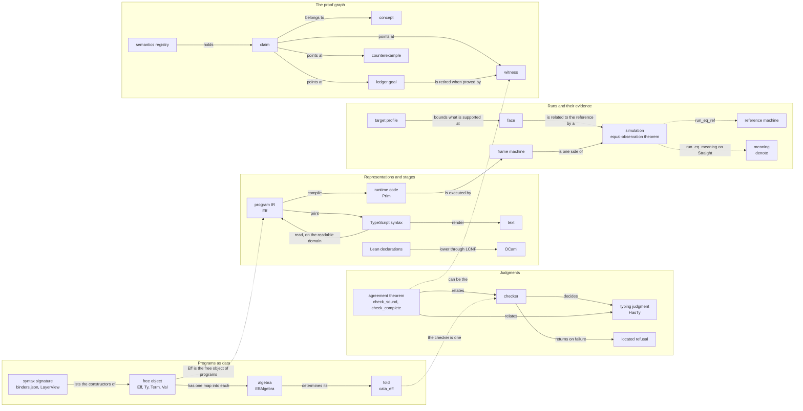

# Controlled English: the writing rules and the dictionary

This document owns two things. The writing rules (§2) say how to write every Markdown artifact in
this repository. The dictionary (§3) gives each word one meaning, a tree anchor, the
literature term it adapts and the words not to use instead.

The approach adapts ASD-STE100, the controlled language of aerospace maintenance documents, at
about 80% of its strictness. This document copies no text and no word list from that
specification. Its rules are written for this repository: a compiler, a type system, a machine
semantics and a proof graph, all in Lean.

## 1. Scope and use

What this document does not own, and who does:

- the judgments, their literature and their required properties: `docs/core/semantics.md`;
- the frame (the goal, the layers, the sorts, the arrow kinds, the requirements R1–R13):
  `docs/core/system-map.md`;
- statuses, counts and dates of a run: the tools that measure them (§2.6);
- open decisions: `docs/core/decisions.md` and `docs/DESIGN-ISSUES.md`.

How to use it:

1. Before you name a concept, find its word in the dictionary.
2. Use the word in its dictionary meaning only.
3. If the word is missing, add an entry with its anchor in the same commit.
4. If two entries seem to name one concept, stop and repair the dictionary.
5. Run `make check-language` before you commit a change to this file or to `AGENTS.md`.

The checker of these rules is `scripts/check-language.py` (§7). It reads its rules and its words
from this file, so this file is the one source. The checker measures each rule that §2 marks
"checked". The writer and the reviewer apply the other rules.

## 2. Writing rules

The rules apply to every Markdown artifact that an agent or a person writes here. That includes
authorities, receipts, briefs, research notes, the prose of docstrings and commit messages.

### 2.1 Sentences

- **W1.** Write one idea per sentence.
- **W2.** Keep sentences short (checked: `length`). The limits are in the line below. A sentence
  that opens with a procedure verb (§7) is procedural.
- **W3.** Use the active voice. Name the actor: the checker refuses, the gate fails, the producer
  writes.
- **W4.** Use the present tense for facts and the imperative for procedures. Use the past tense
  only for a dated event, with its date.
- **W5.** Write a procedure as numbered steps, one action per step, in the order of execution.
  Put a condition before its action: "If the gate fails, read its first finding."
- **W6.** Use a semicolon only between list items that contain commas. Do not join two sentences
  with a semicolon to dodge W2.
- **W7.** Shorter must not mean stronger. When you shorten a sentence, keep every hypothesis, the
  observation, the fragment and the evidence kind.

Sentence limits: 25 words for a descriptive sentence, 20 words for a procedural sentence.

The checker counts a code span, a link, a number and a hyphenated compound as one word each.
Table cells are exempt from the limits. A cell holds a phrase or one short sentence.

### 2.2 Words

- **W8.** Use a dictionary word only in its dictionary meaning. A word with a technical meaning
  here does not also take its everyday meaning. For work that is done, write "finished", not
  "complete".
- **W9.** Do not use a synonym for a dictionary word (checked: `avoid`). The entry's "Do not use"
  column lists the known synonyms.
- **W10.** Define a word before you use it. At its first use in a document, give its meaning or
  point to its dictionary entry.
- **W11.** Qualify a word that has several senses (checked: `qualifier`). The entry's "Qualifier"
  column says when (every use, or the first use in a document) and with what.
- **W12.** Do not use filler words (checked: `filler`, with the list in §2.7).
- **W13.** Write a tree name in code, with its path the first time a document cites it. A code
  span is a name, never prose.
- **W14.** Prefer the plain word: "use", not "utilize"; "to", not "in order to".

### 2.3 Paragraphs, lists and tables

- **W15.** Give a paragraph one topic, and state it in the first sentence.
- **W16.** Use a list for parallel items, and keep the items grammatically parallel.
- **W17.** Use a table when items share attributes. Keep a cell to a phrase or one short sentence.
- **W18.** Use a diagram (§5) for a dependency order, a state machine, a pipeline or a relation
  between concepts. Use it when prose would need more than three sentences for the same content.

### 2.4 Claims and evidence

- **W19.** Name the evidence of every claim with an evidence word (§3.8). Report a finite probe
  as a finite probe, never as a theorem.
- **W20.** The trust words (from `AGENTS.md`): name the exact judgment, observation, theorem or
  gate before you write "sound", "complete", "equivalent", "preserves" or "fully reified". Name
  the assumptions and the remaining host boundary too (checked: `qualifier`).
- **W21.** State what a claim does not establish. A conditional theorem leaves its premises open.
  An invariant is not progress, and safety is not liveness. An equal-observation theorem holds
  only on its fragment. The host boundary stays where `docs/core/host-boundary.md` puts it.
- **W22.** Keep proof role, evidence status and scope as separate labels. Never use one word for
  two of them.
- **W23.** No open ledger goal does not mean the semantics is finished. Never write or imply it.
- **W24.** Keep the seven judgments of §4 distinct: formation, canonical form, membership,
  inhabitance, profile support, codec admission and reply admission. Never merge two, and never
  use one word for another. Use only the implications that a definition or a named theorem
  establishes.

### 2.5 Citations

- **W25.** Cite a declaration by its name and its file path, without a line number (checked:
  `line-cite`). Example: `fits_mono` (`src/Effect4/Laws/Program/Typed/Membership.lean`).
- **W26.** Cite a line number only where the file cannot move under it. That means the
  pinned vendored source (`vendor/effect-4.0.0-rc.112/src/…`, whose lines `AGENTS.md` requires),
  the pinned toolchain and packages, and history.
- **W27.** Cite a past state as `git:<rev>:<path>`. Cite a decisions row as "row N" and a design
  issue as DI-N. Cite a basis decision as DB-N and a counterexample by its register ID.
- **W28.** Cite literature by work: author, year and title. Take a locator only from the
  citations audit (`docs/research/2026-10-01-semantics/citations-audit.md`). Never write a
  locator from memory.

A measurement on 2026-10-03 found 50 of 126 citations of the form `name (file:line)` stale in
the tracked documents. Of the 50, 39 had moved and 11 were not declared in the cited file.

### 2.6 Measured, not written

- **W29.** Take counts, statuses and dates of a run from a tool. Do not type them into prose by
  hand. Point to the tool instead: `make status`, `generated/semantics.md`,
  `scripts/report-effect-runtime-coverage.sh`.
- **W30.** A dated sentence records an event. It does not state a current status.

### 2.7 Filler

The checker reports every word in the left column. Write the right column instead.

| Filler | Write instead |
| --- | --- |
| "in order to" | to |
| "basically", "essentially", "obviously", "of course", "needless to say", "it should be noted" | — |
| "very", "really" | — |
| "utilize", "utilise", "utilizes", "utilized", "leverage", "leverages" | use |

### 2.8 What the checker reads

The checker reads prose only. It skips fenced blocks, code spans, HTML comments and
blockquotes. A word in double quotes is a mention, not a use: "sound" names the word. A bold
label that opens a list item is a mention too, and so is an italic title in title case. Do not
nest double quotes: write an inner mention in code.

An identifier outside code is never read as a word. An identifier holds `_`, `/`, `#`, an inner
dot or inner capitals. The dictionary tables of this file are exempt from the word rules, and
the checker verifies their anchors instead.

## 3. The dictionary

### 3.0 How to read an entry

Each entry is one row of six columns:

- **Term**: the word in bold, with its other forms in parentheses.
- **Meaning here**: its one meaning in this repository.
- **Tree anchor**: a declaration in code with its path in parentheses. The checker verifies that
  the file contains the name. A dash means the word names no declaration.
- **Literature**: the term the word adapts, with its mark (§3.8). A locator comes only from the
  citations audit, named by its row.
- **Do not use**: words in double quotes that must not replace the term. The checker reports
  each use.
- **Qualifier**: "Every use:" or "First use:", then what must stand in the same sentence. "In
  code" means a code span; the quoted words are the other qualifiers.

### 3.1 Compilers and intermediate representations

| Term | Meaning here | Tree anchor | Literature | Do not use | Qualifier |
| --- | --- | --- | --- | --- | --- |
| **IR** (intermediate representation) | The one program representation, `Eff`: first-order data with a digest, stored by content. Lean's compiler IR is LCNF, an external sort. | `Eff` (`src/Effect4/Program/Eff.lean`) | standard | — | First use: write "program IR" or "Lean's compiler IR", or name it in code, or write "Eff", "LCNF". |
| **program** | An `Eff` term over a signature. With its signature and row table it is a program source. | `Eff` (`src/Effect4/Program/Eff.lean`); `ProgramSource` (`src/Effect4/Laws/Program/Typed/Admission.lean`) | closed term over a signature (system map §1.1) | — | — |
| **compile** (compiler, compilation) | Turn an `Eff` at a source point into runtime code that refers back to the program. This is not lowering. | `compileEff`, `Point` (`src/Effect4/Program/Compile.lean`) | — | — | — |
| **runtime code** | The frame alphabet `Prim` that the frame machine evaluates: data, never a Lean function. | `Prim`, `PrimInterp` (`src/Effect4/Machine/Frames.lean`) | defunctionalized code (Danvy and Nielsen 2001, audit C3) | — | — |
| **lowering** (lowers, lowered) | A translation into a lower representation by a named stage, with that stage's evidence. Today: the LCNF route from Lean declarations to OCaml. | `translateClosure` (`src/OCaml5/Lcnf/Translate.lean`) | the LLVM code generator document, by name (`docs/core/lcnf-route.md` §7) | "verified lowering" | First use: name the stage: "LCNF", "OCaml", "stage", "route", "TypeScript", or in code. |
| **stage** (named connection) | One translation of a pipeline, with what it owes and its evidence (`docs/core/lcnf-route.md` §8). | — | semantic preservation (Leroy 2009, audit C10) | — | — |
| **pass** | One transformation in a compiler pipeline. A review of the work is a review, not a pass. | — | standard | — | — |
| **target** | An output language of a stage: Effect TypeScript, OCaml. | `Target` (`src/Effect4/Codegen/Target.lean`) | standard | — | — |
| **profile** (target profile) | Data that says which constructs, values and ranges a target or route supports. Outside it, the route refuses. Effect TypeScript rc.112 is one target profile (DB-09). | `ProfileData`, `rc112`, `admitsNat` (`src/Effect4/Program/Profile.lean`) | the LLVM target description, by name (`docs/core/lcnf-route.md` §7) | — | — |
| **face** | An outward presentation of `Eff`: the application API, a target language, an engine or the truth harness. Named evidence relates each face to the reference. | the module `src/Effect4/Api.lean`; the packet `Test/contracts/faces.contract.md` | — | — | — |
| **print** (prints, printed, printer, printing) | Build target syntax (a TypeScript syntax tree) from a program. A printer never produces text; rendering is a separate operation. `printT` returns `Except PrintRefusal Expr`, with TypeScript's `Expr`; `printModule` returns `Except PrintRefusal (List TypeScript.ConstDecl)`. | `printT` (`src/Effect4/Codegen/Templates.lean`); `printModule` (`src/Effect4/Codegen/Print.lean`) | invertible syntax description (Rendel and Ostermann 2010, audit P32); Lean's pretty printer (`Lean.PrettyPrinter.ppCategory`, `Lean.Widget.InteractiveCode`) is a different operation | — | First use: "TypeScript", "target", "program", "Lean", or in code. |
| **read** (reader, read back) | Rebuild a program from target syntax, with laws on the readable domain. A reader is not a parser of text. The raw module reader ignores declaration annotations, export flags and the main declaration's name, so it is not exact source-module admission. For a fixed signature and spelling, `readModule` has type `List TypeScript.Decl → Except ReadRefusal (Eff Op)`. | `readEff`, `readModule` (`src/Effect4/Codegen/Read.lean`); `read_print` (`src/Effect4/Laws/Codegen/ReadPrint.lean`); `read_exact` (`src/Effect4/Laws/Codegen/Read.lean`) | partial isomorphism (Rendel and Ostermann 2010, audit P32); Lean's parser (`Lean.Parser.runParserCategory`) is a different operation | — | — |
| **readable domain** | The programs on which `read_print` and `read_exact` hold. It excludes annotated loops (DI-91). | `read_print` (`src/Effect4/Laws/Codegen/ReadPrint.lean`) | — | — | — |
| **render** | Produce text from syntax or data: the one crossing from syntax to bytes. A renderer is a deterministic fold into target string templates. The axiom gate exempts each rendering declaration by exact name. | `render` (`src/Effect4/Codegen/Target.lean`); `Ty.render` (`src/Effect4/Program/Ty.lean`); `renderAll` (`tools/Effect4Gen/Atoms.lean`) | — | — | — |
| **emit** | Print a module and return its production receipt. For other outputs write print, render or generate. | `emitModule` (`src/Effect4/Codegen/Checked.lean`) | — | — | — |
| **artifact** | A produced file, or the codegen value whose code name is `Artefact`. Prose spells it artifact. | `Artefact` (`src/Effect4/Codegen/Target.lean`) | — | "artefact", "artefacts" | — |
| **generated file** | A committed file that one producer writes, listed in the Makefile's `GENERATED_PATHS`. It carries the header line `GENERATED by <producer>; do not edit` and is never edited by hand. | `note` (`tools/Tools/GeneratedStamp.lean`) | committed projection (`docs/GENERATED.md`) | — | — |
| **producer** | The program that writes one generated group, run by `make gen-<group>`. | `scripts/generate.py` | — | — | — |
| **group** (generated group) | The generated files that one producer writes, with one marker rule. | `docs/GENERATED.md` | — | — | — |
| **tier** (generated tier) | The kind of a produced file: a build artifact (never committed), a committed projection (checked byte for byte) or a vendored input (copied with its provenance). | `docs/GENERATED.md` | — | — | — |
| **drift** | A committed generated file that differs from its producer's fresh output (`make check-gen`). A document reference that no longer resolves is stale, not drift. | `Makefile` | — | — | — |
| **refusal** (refuses, refused) | A located failure of a check or translation: an `Except` value that names a path and a reason. A refusal is never a typed failure of the program and never a frontier. | `TypeRefusal` (`src/Effect4/Program/Typing/Blame.lean`); `PrintRefusal` (`src/Effect4/Codegen/PrintLeaf.lean`); `ReadRefusal` (`src/Effect4/Codegen/Read.lean`); `TableRefusal` (`src/Effect4/Program/Native.lean`) | — | — | — |
| **template table** | The printer's table: one template per constructor and native row. The printer laws hold over it. | `printT` (`src/Effect4/Codegen/Templates.lean`) | — | — | — |
| **LCNF** | Lean's compiler IR in its mono phase, read from compiled modules. OCaml is made only from LCNF. | `translateClosure` (`src/OCaml5/Lcnf/Translate.lean`) | the Lean compiler, by name | — | — |
| **legalization** | What a profile does to a construct its target lacks: promote, expand or custom. Each legalization rule owes a semantic preservation obligation. | — | the LLVM code generator's legalization, by name (`docs/core/lcnf-route.md` §7) | — | — |
| **differential** | A finite comparison of two implementations on the same named inputs. Its evidence word is tested. | `scripts/check-truth.py` | — | — | — |
| **oracle** | The outside implementation a differential or check compares against: the rc.112 runtime for the truth lane, tsgo 7 for `make check-target`. | `harness/truth` | — | — | — |
| **corpus** | The generated set of programs that `make corpus` prints. | `Test/Program/Gen.lean` | — | — | — |
| **ingest** | Reading foreign TypeScript source into `Eff` under the strict-foreign contract. It is a different contract from reading the printed image (DI-37). | `ts/eff/ingest/oxc.ts` | — | — | — |
| **round trip** | Print, then read, gives the program back: the retraction law on a named domain. | `read_print` (`src/Effect4/Laws/Codegen/ReadPrint.lean`) | — | — | — |

### 3.2 Programming languages and type theory

| Term | Meaning here | Tree anchor | Literature | Do not use | Qualifier |
| --- | --- | --- | --- | --- | --- |
| **object language** | A language that Effect4 defines: `Eff`, `Ty`, `Term`, `Val`, `Representation`. | `Eff` (`src/Effect4/Program/Eff.lean`); `Ty` (`src/Effect4/Program/TyCore.lean`) | standard | — | — |
| **metalanguage** | Lean, the language in which the object languages are defined. | — | standard | "host language", "host syntax", "host metatheory", "host Lean" | — |
| **syntax** (object-language syntax) | First-order data of an object language: a free object. Lean's `Syntax` is Lean's parsed source tree, and TypeScript syntax is the target's. | `Eff` (`src/Effect4/Program/Eff.lean`); `Ty` (`src/Effect4/Program/TyCore.lean`); `Term` (`src/Effect4/Machine/Term.lean`); `Store.Val` (`src/Effect4/Store/Carrier/Val.lean`); `Representation` (`src/Effect4/Schema/Representation.lean`) | abstract syntax (standard) | — | First use: "object-language", "object language", "Lean", "TypeScript", "target", "program", "authoring", "surface", "OCaml", "stored", or in code. |
| **judgment** | A formally defined relation that says when a statement holds: an inductive predicate (`HasTy`, `TypedProg`) or a recursive definition (`Fits`). | `HasTy` (`src/Effect4/Laws/Program/Typing/HasTy.lean`); `Fits` (`src/Effect4/Laws/Program/Typed/Membership.lean`); `TypedProg` (`src/Effect4/Laws/Program/Typed/Residual.lean`) | TAPL §8.2 "The Typing Relation" (audit §1b) | — | — |
| **typing rule** | One constructor of a typing judgment. | `HasTy` (`src/Effect4/Laws/Program/Typing/HasTy.lean`) | TAPL §8.2 (audit §1b) | — | — |
| **declarative judgment** (algorithmic) | A declarative judgment states rules (`HasTy`); an algorithmic one computes (the checker). Soundness and completeness relate the two. | `HasTy` (`src/Effect4/Laws/Program/Typing/HasTy.lean`) | TAPL §16.1 "Algorithmic Subtyping" and §16.2 "Algorithmic Typing" (audit §1b) | — | — |
| **checker** | The one typing decision procedure: a fold that returns a type or a located refusal. | `explain` (`src/Effect4/Program/Checker.lean`); `typeOfProgram` (`src/Effect4/Program/Typing.lean`) | algorithmic typing, TAPL §16.2 (audit §1b); Dunfield and Krishnaswami 2021, by name | — | — |
| **decision procedure** | A total function that answers a judgment: yes with a certificate, or no with a located refusal. | `explain` (`src/Effect4/Program/Checker.lean`) | standard | — | — |
| **soundness** (sound, soundly, unsound) | Relative to a named judgment: everything the procedure accepts satisfies the judgment. | `check_sound` (`src/Effect4/Laws/Program/Typing/CheckSound.lean`) | PLF `Typechecking.v` `type_checking_sound` (audit F16) | — | Every use: name the judgment in code, or write "against", "relative to". |
| **completeness** (complete, completely, incomplete) | Relative to a named judgment: every instance of the judgment is accepted. For finished work write finished, done or landed. | `check_complete` (`src/Effect4/Laws/Program/Typing/CheckSound.lean`) | PLF `Typechecking.v` `type_checking_complete` (audit F16) | — | Every use: name the judgment in code, or write "against", "relative to". |
| **certificate** | Evidence that a checker produced and the kernel checks: a program has a type. | `TypedProgram` (`src/Effect4/Program/CheckedTyping.lean`) | — | — | — |
| **located refusal** | A total-by-refusal map `Src → Except Refusal F` whose refusal names a path and a reason, with no refusal exactly when the judgment holds (`explain = none ↔ wellTyped`). | `explain_none_iff` (`src/Effect4/Program/Typing/Agreement.lean`); `wellTyped` (`src/Effect4/Api.lean`) | a decision procedure with its counterexample path | — | — |
| **admission** (admit, admits, admitted, admitting) | A decision that one input may enter one stage, or a located refusal. Always say what is admitted: a program, a table, a reply, a codec value. | `admitProgram_certificate` (`src/Effect4/Laws/Run.lean`); `checkTable` (`src/Effect4/Program/Native.lean`); `admit` (`src/Effect4/Program/Admit.lean`); `isCodecValue` (`src/Effect4/Schema/Codec.lean`) | — | — | Every use: "program", "programs", "table", "reply", "replies", "codec", "value", "values", "answer", "answers", "source", "module", "signature", "row", "rows", "field", "load", "ghost", "host", "decision", "decisions", "tape", or in code. |
| **formation** (well formed, well-formed) | One of the seven judgments (§4): is this declaration valid under its names, parameters and structural rules? | `checkTable` (`src/Effect4/Program/Native.lean`); `firstRepeated` (`src/Effect4/Data/FieldOrder.lean`); `LawfulSig` (`src/Effect4/Laws/Program/Signature.lean`) | well-formedness (standard) | — | — |
| **canonical** (canonical form) | One of the seven judgments (§4): is this the chosen normalized spelling? Canonical program content is the stored first-order form. | `normalize` (`src/Effect4/Program/Ty.lean`); `CTy` (`src/Effect4/Program/Ty.lean`); `canonBy` (`src/Effect4/Data/FieldOrder.lean`) | normal form (standard) | — | — |
| **normal form** (normalize, normalization) | The result of `Ty.normalize`. Types with equal normal forms (`≡N`) are one type for the checker. | `normalize`, `normalize_idem` (`src/Effect4/Program/Ty.lean`); `subN_equiv_iff` (`src/Effect4/Laws/Program/TypeAlgebra.lean`) | standard | — | — |
| **membership** (fits, member) | One of the seven judgments (§4): does this value fit this type in this typed world? The proof side is `Fits`, the runtime check `Val.hasTy`, joined by `fits_hasTy`. | `Fits`, `fits_hasTy` (`src/Effect4/Laws/Program/Typed/Membership.lean`); `hasTy` (`src/Effect4/Program/Typed.lean`) | store typings, TAPL §13.4 (audit §1b); Ahmed 2004 (audit P1) | — | — |
| **inhabitance** (inhabited) | One of the seven judgments (§4): can a fitting value exist? | `inhabited` (`src/Effect4/Program/Admission.lean`); `inhabited_iff_fits` (`src/Effect4/Laws/Program/Typed/Membership.lean`) | the emptiness test of tree automata (TATA), by name | — | — |
| **subtyping** (subtype, supertype) | The order on `Ty`: raw `sub`, and the checker's `subN`, which is `sub` after normalization. Applications of one name and arity compare argument by argument, each by its declared variance. Records with equal canonical names and optionality compare field by field, covariantly, with no width rule. | `subN` (`src/Effect4/Laws/Program/TypeAlgebra.lean`); `sub_refl` (`src/Effect4/Program/Ty.lean`); `argVariance` (`src/Effect4/Program/TyVariance.lean`) | TAPL §15.2 "The Subtype Relation" (audit §1b) | — | — |
| **subsumption** | Using a value at a supertype of its type. Membership is closed under the order. | `fits_sub`, `fits_subN` (`src/Effect4/Laws/Program/Typed/Membership.lean`) | TAPL §15.1 "Subsumption" (audit §1b) | — | — |
| **join** | The least upper bound of two canonical types: their normalized union (`CTy.join a b` is `ofRaw (.union a.val b.val)`). | `join` (`src/Effect4/Program/Ty.lean`); `instLawfulOrderSup` (`src/Effect4/Laws/Program/TypeAlgebra.lean`) | TAPL §16.3 "Joins and Meets" (audit §1b) | — | — |
| **invariant** | A predicate on states that holds at the start and that every covered step keeps. An invariant is not progress. | `MachineTyped`, `ConfigTyped` (`src/Effect4/Laws/Program/Typed/Assembly.lean`); `driveState_lift` (`src/Effect4/Laws/Machine/Lift.lean`) | Owicki and Gries; Manna and Pnueli, as cited (audit C22) | — | — |
| **preservation** (preserve, preserves, preserved, preserving) | A named property kept by a named step or translation: type preservation (a step keeps the typed state) or semantic preservation (a translation keeps behaviour). For the everyday sense write keep. | `StepPreserves` (`src/Effect4/Laws/Program/Typed/Assembly.lean`) | TAPL §8.3 "Safety = Progress + Preservation" (audit §1b); PFPL §6.1 "Preservation" (audit §1c); Leroy 2009 (audit C10) | — | Every use: name the step relation or theorem in code, or write "against", "relative to". |
| **progress** | For a named step relation: every typed state is finished, takes a step, or waits at a live frontier. `machineTyped_not_halted` is an invariant consequence, not progress. | `machineTyped_not_halted` (`src/Effect4/Laws/Program/Typed/Assembly.lean`) | TAPL §8.3 (audit §1b); PFPL §6.2 "Progress" (audit §1c) | — | — |
| **safety** | Nothing bad happens on any finite run: an invariant or a trace inclusion. Safety is not liveness. | `driveState_lift` (`src/Effect4/Laws/Machine/Lift.lean`) | Lynch and Vaandrager 1995 (audit C4) | — | — |
| **liveness** | Something good eventually happens. It needs a fairness assumption. | `FairTape`, `flush_fair` (`src/Effect4/Laws/Machine/Scheduling.lean`) | Manna and Pnueli, as cited (audit C22) | — | — |
| **type safety** (never goes wrong) | R9: every typed exit position satisfies `ExitOk`, and the typed machine never halts (M7c). | `ExitOk`, `NoShapeDefect` (`src/Effect4/Laws/Program/Typed/Admission.lean`); `machineTyped_not_halted` (`src/Effect4/Laws/Program/Typed/Assembly.lean`) | Milner 1978, as cited (audit C26); Wright and Felleisen 1994, as cited (audit P36) | — | — |
| **halt** (halted, stuck) | The machine refuses to step: malformed code. A frontier waits; a halt does not. | `machineTyped_not_halted` (`src/Effect4/Laws/Program/Typed/Assembly.lean`) | stuck state (TAPL §8.3, audit §1b) | — | — |
| **simulation** | Two behaviours related on one observation over a named fragment. Its statement is an equal-observation theorem, proved through a simulation relation. | `run_eq_meaning` (`src/Effect4/Laws/Program/Agreement/Machine.lean`); `loopAgreement` (`src/Effect4/Laws/Program/Agreement/Loop.lean`); `run_eq_ref` (`src/Effect4/Laws/Program/RuntimeR.lean`) | forward simulation (Lynch and Vaandrager 1995, audit C4) | — | — |
| **equal-observation theorem** | A theorem that two runs give equal observations on a fragment: the statement form of a simulation. The Conform rungs and the truth lane are finite checks of one. | `run_eq_meaning` (`src/Effect4/Laws/Program/Agreement/Machine.lean`) | — | — | — |
| **simulation relation** | The relation that every step keeps, through which an equal-observation theorem is proved. | `ReplayRel`, `BookMeans` (`src/Effect4/Laws/Machine/Book.lean`); `replay_rel` (`src/Effect4/Laws/Program/RuntimeR.lean`); `BMeans` (`src/Effect4/Laws/Program/Simulation/Fibers.lean`) | Lynch and Vaandrager 1995 (audit C4) | — | — |
| **equivalent** (equivalence, equivalently, equivalences) | Equal on a named observation. Never write it without the observation and the fragment. | — | — | — | Every use: name the observation in code, or write "observation", "modulo", "under". |
| **observation** | The part of a run that a theorem compares. It is not injective: equal observations do not imply equal runs. | `obs`, `Obs` (`src/Effect4/Laws/Machine/Behaviour.lean`) | — | — | — |
| **fragment** | A named set of programs or tapes on which a theorem holds, named by exclusion or by policy. | `Straight` (`src/Effect4/Program/Fragment.lean`); `Looped` (`src/Effect4/Laws/Program/DenoteB.lean`); `M7Fragment` (`src/Effect4/Laws/Program/Typed/Assembly.lean`) | — | — | — |
| **adequacy** | An equal-observation theorem between an operational semantics and a denotation: `run_eq_meaning` on `Straight` against `meaning`. Handler adequacy is a different term (§3.6). | `run_eq_meaning` (`src/Effect4/Laws/Program/Agreement/Machine.lean`) | computational adequacy (Plotkin 1977, as cited, audit C23) | — | — |
| **denotation** (denote, meaning) | The map from a program to its meaning: `denote` into the free monad on the store signature, run by `meaning`; `denoteR` into residual programs with bracket markers (`NativeEff → NativeEff → Point → RProgram`). | `denote`, `meaning` (`src/Effect4/Laws/Program/Denote.lean`); `denoteR` (`src/Effect4/Laws/Program/DenoteR.lean`) | initial-algebra semantics (Plotkin and Pretnar 2009, audit P29) | "residualize" | — |
| **reference machine** | The term machine used for proofs. `run_eq_ref` relates it to the frame machine at the empty row table. | `run_eq_ref` (`src/Effect4/Laws/Program/RuntimeR.lean`); `RState` (`src/Effect4/Laws/Program/InterpR.lean`) | — | — | — |
| **frame machine** | The machine that executes runtime code: the fiber machine over frames. | `RunMachine`, `driveStep` (`src/Effect4/Machine/Fibers.lean`) | an abstract machine with a defunctionalized continuation (Danvy and Nielsen 2001, audit C3) | "native machine" | — |
| **configuration** | A machine state with its command queue. `ConfigTyped` (I) types it. | `ConfigTyped` (`src/Effect4/Laws/Program/Typed/Assembly.lean`) | configuration typing (Wright and Felleisen 1994, as cited, audit P36) | — | — |
| **residual program** | What `denoteR` produces (`RProgram`): a free-monad program whose continuations are Lean functions of the proof model, never stored. | `TypedProg` (`src/Effect4/Laws/Program/Typed/Residual.lean`); `FiberOp` (`src/Effect4/Laws/Program/Sched.lean`) | interaction trees (Xia et al. 2020, audit P37), by analogy | — | — |
| **protocol typing** | The pre and post conditions a row's operation must meet. `TypedProg` meets them at every later world. The host protocol is a different term (§3.7). | `TypedProg`, `typedProg_mono` (`src/Effect4/Laws/Program/Typed/Residual.lean`); `Typed` (`src/Effect4/Laws/Effects/Protocol.lean`) | de Vilhena and Pottier 2021 (audit P8), an analogy until a correspondence is stated | — | — |
| **compatibility lemma** | A lemma that a typing rule's shape holds in a semantic judgment. For sequencing: `seq_typed` and `guardBind_typed`. | `seq_typed`, `guardBind_typed` (`src/Effect4/Laws/Program/Typed/Seq.lean`) | logical relations, ATTAPL ch. 6 (audit §1a), by analogy | — | — |
| **fundamental property** | Every checked program is in the semantic judgment: M5's `denotesTyped`. | `denotesTyped` (`src/Effect4/Laws/Program/Typed/LayerArm.lean`) | ATTAPL §6.9 "The Fundamental Theorem" (audit §1a) | — | — |
| **inversion** | Reading a judgment's premises off its conclusion, from the only rules that derive it. | `fits_scope_inv` (`src/Effect4/Laws/Program/Typed/Membership.lean`) | standard | — | — |
| **canonical forms** | A value of a given type has one of the listed shapes. | — | PLF `Types.v` `bool_canonical` (audit F9) | — | — |
| **weakening** | A judgment stays true when its context grows. | `hasTy_weaken` (`src/Effect4/Laws/Program/Typing/Sound.lean`) | PLF `StlcProp.v` `weakening` (audit F14) | — | — |
| **substitution** | A judgment stays true when a variable is replaced by a term of its type. | — | PLF `StlcProp.v` `substitution_preserves_typing` (audit F15) | — | — |
| **decidability** | A judgment has a decision procedure, sound and complete against it. | `explain_none_iff` (`src/Effect4/Program/Typing/Agreement.lean`) | standard | — | — |
| **monotonicity** (monotone) | A predicate on worlds stays true at every later world. | `fits_mono` (`src/Effect4/Laws/Program/Typed/Membership.lean`); `stackAccepts_mono` (`src/Effect4/Laws/Program/Typed/Contracts.lean`) | PLF `References.v` `store_weakening` (audit F17); ATTAPL §6.7 "A Monotone Logical Relation" (audit §1a) | — | — |
| **world** (typed world) | A store typing: declared types for fibers (Γ), deferreds (Π), cells (Ρ) and tokens (Θ), ordered by extension. It extends the machine world. | `World` (`src/Effect4/Laws/Program/Typed/World.lean`); `World` (`src/Effect4/Laws/Machine/Handles.lean`) | Kripke world; store typing, TAPL §13.4 (audit §1b) | — | — |
| **determinism** (deterministic) | Claimed only after fixing a compatible decision tape that answers every decision, or after proving a fragment has no decision source. | `DeterministicHostSpec` (`src/Effect4/Program/Profile.lean`) | — | — | — |
| **behaviour** | The function from tape words to the observations of a run. | `Beh`, `Beh_fuel_irrelevant` (`src/Effect4/Laws/Machine/Behaviour.lean`) | Moore machine, Jacobs ch. 2 "Coalgebras of Polynomial Functors" (audit C23) | — | — |
| **refinement mapping** | A map from one machine's states to another's that every step respects (`Projects`), and the forward simulation that also matches frontiers (`Refines`). | `Projects`, `Refines` (`src/Effect4/Laws/Machine/Refinement.lean`) | Abadi and Lamport 1991, by name | — | — |
| **trace** | The machine's list of run events, which only grows. A Lake `.trace` file is a build record, not a trace. | `RunMachine` (`src/Effect4/Machine/Fibers.lean`) | — | — | — |

### 3.3 Lean metaprogramming

| Term | Meaning here | Tree anchor | Literature | Do not use | Qualifier |
| --- | --- | --- | --- | --- | --- |
| **Lean `Syntax`** | Lean's parsed source tree of terms, commands and tactics, with positions and hygiene (`Lean.Syntax`). It is never stored program content. | — | the Lean 4 metaprogramming book, by name | — | — |
| **`Expr`** | Lean's kernel expression type, never stored program content. `TypeScript.Expr` is the target's expression syntax: say which. | — | the Lean 4 metaprogramming book, by name | — | — |
| **elaboration** (elaborate, elaborates, elaborated, elaborating, elaborator) | Three senses; qualify each. Lean elaboration turns Lean syntax into kernel expressions and declarations. Authoring elaboration (`elaborate : Src Op → Except Refusal (Eff Op)`) turns authoring input into `Eff` or a located refusal. For `denoteR` write denote. The proposed words surfaceElaborate and residualize were not adopted. | `elaborate`, `elaborateModule` (`src/Effect4/Program/Authoring.lean`) | the Lean 4 metaprogramming book, by name; Lean: `Lean.Elab.TermElabM`, `Lean.Elab.CommandElabM`, `Lean.Elab.Term.elabTerm` | — | First use: "Lean", "authoring", "surface", "command", "tactic", "macro", or in code. |
| **macro** | A rewrite of Lean syntax into Lean syntax (`MacroM`). A macro claims no typing judgment. | `eff` (`src/Effect4/Program/Authoring/Sugar.lean`) | Lean: `Lean.Macro`, `Lean.MacroM`, `syntax` and `macro_rules` | — | — |
| **authoring lift** | A generated function that lifts one `Eff` constructor into authoring source (`Src Op`): it resolves its children, then builds the constructor. It denotes embedding into the initial algebra. The lifts are functions; the macro over them is the sugar. | `succeed` (`src/Effect4/Program/Authoring/Lifts.lean`) | — | — | — |
| **sugar** | The `eff { ... }` and `eff do ...` blocks: a Lean macro that expands a do-block into calls of the authoring lifts, an authored `Src Op` program. | `eff`, `expandDoElems` (`src/Effect4/Program/Authoring/Sugar.lean`) | — | — | — |
| **tactic** | A proof-search program over a tactic goal: `simp only`, `aesop`, `decide`, or a project tactic. | `authoring_scoped` (`src/Effect4/Laws/Program/Authoring/Tactic.lean`) | — | — | — |
| **tactic goal** | The proof state a tactic works on. A ledger goal is a different thing (§3.4). | — | — | — | — |
| **Lean command** (command elaborator) | A `#name` instruction that runs during Lean elaboration (`CommandElabM`). A run command is a different thing (§3.6). | `#traversal_census` (`src/Effect4/Laws/Auto/Traversals.lean`); `#proof_wanted` (`src/Effect4/Laws/Auto/Obligations.lean`) | Lean: `Lean.Elab.Command.elabCommand` | — | — |
| **Lean environment** | The declarations a module sees after its imports. A typing environment is a different thing. | — | — | — | — |
| **declaration** | A named constant of the Lean environment: a definition, theorem, inductive type, structure or instance. | — | — | — | — |
| **module** (Lean module) | One Lean file, named by its path. An Effect module is a module of rc.112. | — | — | — | — |
| **import closure** | The modules that a root reaches by its imports. | `#effect4_axiom_gate` (`Test/Audit/AxiomGate.lean`) | — | — | — |
| **library root** | `Effect4` or `Effect4.Laws`. Every library source is reachable from one of them, and `Effect4` never reaches the proof graph. | `#effect4_axiom_gate` (`Test/Audit/AxiomGate.lean`) | — | — | — |
| **kernel** | Lean's type checker for declarations. A theorem is proved when the kernel accepts it. For the equivalence of normal forms write `≡N`, not kernel. | — | — | — | — |
| **axiom** | A constant assumed without proof. The trust ceiling allows two. | — | — | — | — |
| **trust ceiling** | `[propext, Quot.sound]`: the axioms that a declaration of `Effect4.*` or `Test.*` may reach. | `#effect4_axiom_gate` (`Test/Audit/AxiomGate.lean`) | — | — | — |
| **axiom gate** | The check over every compiled `Effect4` and `Test` declaration: no `unsafe`, `partial`, declared axiom, `extern`, `implemented_by` or bodyless `opaque`, and nothing beyond the trust ceiling. | `#effect4_axiom_gate` (`Test/Audit/AxiomGate.lean`) | Lean: `#print axioms` gives one declaration's axioms | "trust gate", "axiom audit", "trust audit" | — |
| **module-closure gate** | The check that every audited source is reachable from the audit root, `Test/All.lean` or `Test/Slow.lean`. | `#effect4_axiom_gate` (`Test/Audit/AxiomGate.lean`) | — | — | — |
| **library-root gate** | The check that both library roots are imported, that every library source reaches one, and that `Effect4` never reaches `Effect4.Laws`. | `#effect4_axiom_gate` (`Test/Audit/AxiomGate.lean`) | — | — | — |
| **trust token** | `sorry`, `partial`, `unsafe`, `native_decide`, `axiom`, `extern` or `implemented_by`: never written in the tree. | `#effect4_axiom_gate` (`Test/Audit/AxiomGate.lean`) | — | — | — |
| **`#guard`** | A check that a battery runs during Lean elaboration. Rendered bytes stay inside it. | — | — | — | — |
| **definitional equality** | Equality by the kernel's reduction (`rfl`). Fold uniqueness is a theorem, not a definitional equality. | `hom_eq_cata_eff` (`src/Effect4/Program/Fold.lean`) | — | — | — |
| **aesop bank** (bank) | A named aesop rule set of the law graph. | `src/Effect4/Laws/Auto/RuleSets.lean` | aesop, by name | — | — |
| **`#proof_wanted`** | The command that declares a ledger goal: an open obligation with its statement. | `#proof_wanted` (`src/Effect4/Laws/Auto/Obligations.lean`) | — | — | — |
| **delaboration** | Lean's display of an expression as syntax for people. It is not our printer, and it keeps no inverse. | — | the Lean 4 metaprogramming book, by name; Lean: `Lean.PrettyPrinter.delab` | — | — |
| **generated declaration** | A declaration that a command or a generator writes. | `fold_of` (`src/Effect4/Program/FoldOf.lean`) | — | — | — |
| **Lake trace** | Lake's `.trace` record that a module or one of its imports changed. The Makefile judges staleness by it. | `Makefile` | — | — | — |

### 3.4 Proofs, the proof graph and the work

| Term | Meaning here | Tree anchor | Literature | Do not use | Qualifier |
| --- | --- | --- | --- | --- | --- |
| **theorem** | A declaration whose type is a proposition, accepted by the kernel within the trust ceiling. | `#effect4_axiom_gate` (`Test/Audit/AxiomGate.lean`) | — | — | — |
| **lemma** (helper) | A theorem used as a step of another. It names the claim it serves and its consumer. | — | — | — | — |
| **witness** | A theorem that is the evidence for a registry claim, a census row or a refutation. | `Pointer` (`tools/Tools/SemanticsRegistry.lean`) | — | — | — |
| **registry** (semantics registry) | The authored claims, concepts and cuts that `generated/semantics.md` reports. The handle registry is a different term (§3.7). | `registry`, `Claim` (`tools/Tools/SemanticsRegistry.lean`) | — | — | Every use: "semantics", "handle", "claim", "claims", or in code. |
| **claim** (registry claim) | An entry of the semantics registry: a question with a concept, a role, a title and a pointer. | `Claim` (`tools/Tools/SemanticsRegistry.lean`) | — | — | — |
| **role** | The proof role of a claim, one of `Role`'s words. A role is never a status and never a scope. | `Role` (`tools/Tools/SemanticsRegistry.lean`) | — | — | — |
| **pointer** | What a claim points at: a witness, a ledger goal, a refutation, an absence with its reason, or an assumption with its source. | `Pointer` (`tools/Tools/SemanticsRegistry.lean`) | — | — | — |
| **concept** | One of the ten semantic concepts of `docs/core/semantics.md`, by its id. | `Concept` (`tools/Tools/SemanticsRegistry.lean`) | — | — | — |
| **cut** | An applicability decision: what a concept's claims exclude, by decisions row. | `Cut` (`tools/Tools/SemanticsRegistry.lean`) | — | — | — |
| **literature relation** | How a claim uses a source: definition used, proof technique, adapted result, analogy, excluded feature. | `LiteratureRef` (`tools/Tools/SemanticsRegistry.lean`) | — | — | — |
| **ledger** (proof ledger) | The ProofGraph record of goals per scope, each wanted or checked. The fork ledger is a different term (§3.6). | `Obligation`, `check` (`tools/ProofGraph/Ledger.lean`) | — | — | — |
| **ledger goal** | An obligation declared by `#proof_wanted` and retired when its proof lands. No open ledger goal does not mean the semantics is finished. | `readGoal` (`tools/ProofGraph/Ledger.lean`); `#proof_wanted` (`src/Effect4/Laws/Auto/Obligations.lean`) | — | — | — |
| **obligation** | A statement owed for a named purpose: a ledger goal, a claim or a contract item. | `Obligation` (`tools/ProofGraph/Ledger.lean`) | proof obligation (standard) | — | — |
| **placement** (obligation placement) | The five things written before an obligation is worked (§6.5). The registry's declaration placement, tagged or inherited, is a different term. | — | — | — | — |
| **consumer** | The declaration or claim that uses a lemma. | — | — | — | — |
| **premise** (hypothesis) | An assumption of a theorem. A conditional theorem leaves its premises open. | — | — | — | — |
| **conditional theorem** | A theorem whose premises imply its conclusion. It does not prove its premises. | `m7_of_ledger` (`src/Effect4/Laws/Program/Typed/Assembly.lean`) | — | — | — |
| **route theorem** | `m7_of_ledger`: M5 and M6 imply M7. | `m7_of_ledger` (`src/Effect4/Laws/Program/Typed/Assembly.lean`) | — | — | — |
| **milestone** (M5, M6, M7) | M5: a checked program loads into the typed state. M6: every command keeps it. M7: at the empty row table, on answer-free tapes, with observation `obs`, every exit and store fits and the run never halts. | `loadsTyped`, `denotesTyped` (`src/Effect4/Laws/Program/Typed/LayerArm.lean`); `m7_proved` (`src/Effect4/Laws/Program/Typed/Commands/Clauses/All.lean`) | — | "capstone" | — |
| **requirement R<n>** | A theorem shape that a full program must satisfy, R1 to R13 (system map §8). A requirement row is a different term (§3.6). | `docs/core/system-map.md` | — | — | — |
| **counterexample** | A checked witness that a stated proposition is false, registered with an ID `E4-<domain>-CE-<n>`. An attack is an attempt to refute; a successful one yields a counterexample. | `Test/Counterexamples/REGISTER.md` | — | — | — |
| **refutation** | A counterexample that refutes a registry claim. | `Pointer` (`tools/Tools/SemanticsRegistry.lean`) | — | — | — |
| **control** (red control, green control) | A fixture that shows a check refuses what it must (red) or accepts what it must (green). Every check keeps its red control. | — | — | — | — |
| **fixture** | Input data for a test, under `Test/fixtures/`. | — | — | — | — |
| **battery** | A `Test` module of checks, reachable from `Test/All.lean`, or from `Test/Slow.lean` for the slow lane. | `slowLane` (`Test/Audit/AxiomGate.lean`) | — | — | — |
| **census** | A measurement over an explicit universe, with its exclusions, roots and freshness recorded. A census is not a proof that a list is whole. A census command inspects Lean's `Environment`. | `#traversal_census` (`src/Effect4/Laws/Auto/Traversals.lean`); `#auto_census` (`src/Effect4/Laws/Auto/Census.lean`); `#semantics_census` (`src/Effect4/Laws/Auto/Semantics.lean`) | — | — | — |
| **gate** | A check that refuses a build or a merge under a stated policy. A passing gate is a verdict of its policy, not a proof. The axiom ceiling, runtime coverage and evidence validation are distinct gates. | `#effect4_axiom_gate` (`Test/Audit/AxiomGate.lean`) | — | — | — |
| **check** (make check) | A `make check-<name>` target: a marker rule, skipped while its inputs are unchanged. | `Makefile` | — | — | — |
| **receipt** | A record of what was done and its evidence: a seat's handoff note, or a named theorem that a document cites as evidence. A reply receipt is a different term (§3.7). | — | — | — | — |
| **brief** | The coordinator's written assignment to a seat. | — | — | — | — |
| **seat** | One agent's assignment, on its own branch in its own worktree. | — | — | — | — |
| **finite probe** | A bounded experiment: a probe module or a script run over named inputs. Its result is reported as a finite probe, never as a theorem. | — | — | — | — |
| **contract packet** | A frozen contract under `Test/contracts/` with its executable falsifiers. | `Test/contracts/README.md` | — | — | — |
| **falsifier** | An executable check that fails if a contract's statement is false. | — | — | — | — |
| **decisions row** (row N) | An entry of `docs/core/decisions.md`, cited as row N. | `docs/core/decisions.md` | — | — | — |
| **register line** | An entry of the counterexample register, cited by its ID. | `Test/Counterexamples/REGISTER.md` | — | — | — |
| **ruling** | An owner decision, made only when written into a tracked file. | — | — | — | — |
| **statement defect** | A theorem statement found false. It is repaired at the contract, never weakened. | — | — | — | — |
| **slice** | A bounded change, landed as commits by explicit paths. | — | — | — | — |
| **wave** | A set of slices that run in parallel. | — | — | — | — |
| **sweep** | The whole battery with `make check` and `make check-full`, run when the owner asks. | — | — | — | — |
| **lane** | One check pipeline: the truth lane, the corpus lane, the OCaml lane, the slow lane. | — | — | — | — |

### 3.5 Algebra and category theory

| Term | Meaning here | Tree anchor | Literature | Do not use | Qualifier |
| --- | --- | --- | --- | --- | --- |
| **signature** (signatures) | Three senses, each with its qualifier. The syntax signature is `binders.json` with `LayerView`. The language signature is Σ = Σ_core ⊕ Σ_app (system map §1.1). The typing signature is `Signature Op`. | `Signature` (`src/Effect4/Program/Typing/Rules.lean`); `nativeSignature` (`src/Effect4/Program/Native.lean`); `cataFam` (`src/Effect4/Program/LayerView.lean`) | operation signatures (Plotkin and Pretnar 2009, audit P29) | — | First use: "syntax", "language", "typing", "Σ", "type", or in code. |
| **sort** | A kind of syntax with one representation: program, type, term, value, schema carrier, run (system map §4). | — | many-sorted algebra (standard) | — | — |
| **free object** | The one representation of a sort: an inductive family whose signature is data. There is one per sort. | `Eff` (`src/Effect4/Program/Eff.lean`); `Ty` (`src/Effect4/Program/TyCore.lean`); `Term` (`src/Effect4/Machine/Term.lean`); `Store.Val` (`src/Effect4/Store/Carrier/Val.lean`); `Representation` (`src/Effect4/Schema/Representation.lean`); `Command` (`src/Effect4/Api/Runner.lean`) | initial algebra semantics (Goguen, Thatcher, Wagner, Wright 1977, as cited, audit C14) | — | — |
| **initial algebra** | A free object with its unique map into every algebra of its signature. | `hom_eq_cata_eff` (`src/Effect4/Program/Fold.lean`) | audit C14; Meijer, Fokkinga, Paterson 1991 (audit P24) | — | — |
| **algebra** (carrier) | A carrier type with one field per constructor of a signature. The algebras are generated. | `EffAlgebra`, `TyAlgebra` (`src/Effect4/Program/Fold.lean`) | standard | — | — |
| **fold** (catamorphism) | The unique algebra map out of a free object. Every traversal is a fold or generated from the signature; a hand `match` is an exemption that `#traversal_census` lists by name (`docs/core/traversal-census.md`). Two folds agree when their algebras do. | `cata_eff`, `cata_ty` (`src/Effect4/Program/Fold.lean`); `cataFam` (`src/Effect4/Program/LayerView.lean`); `cata_val` (`src/Effect4/Store/Carrier/Fold.lean`) | catamorphism (Meijer, Fokkinga, Paterson 1991, audit P24; Gibbons 2002, audit P12) | — | — |
| **homomorphism** | A map between algebras that commutes with every operation. | `EffHom`, `hom_eq_cata_eff` (`src/Effect4/Program/Fold.lean`) | standard | — | — |
| **paramorphism** | A fold that also sees each child's original subtree: the pairing `fold_of` builds. | `fold_of` (`src/Effect4/Program/FoldOf.lean`) | Meertens 1992, by name | — | — |
| **free monad** | Programs over a signature with continuations: the `effects` package's `Program`. | — | Plotkin and Pretnar 2009 (audit P29) | — | — |
| **monoid action** (free monoid) | The journal, a word of run commands, acting on the run by replay. A run is data because its journal is. | `replay` (`src/Effect4/Api/Runner.lean`); `replay_unique` (`src/Effect4/Laws/Api/Runner.lean`); `journal_replays` (`src/Effect4/Laws/Run.lean`) | standard | — | — |
| **coproduct** | The sum of two signatures, whose programs form a coproduct of free monads, not a tensor. | `sum_is_coproduct` (`src/Effect4/Laws/Effects/Sum.lean`); `sum_not_tensor` (`Test/Program/SignatureSum.lean`) | signature sums (Swierstra 2008, audit P34) | — | — |
| **exact embedding** | A write/read pair `write : A → F`, `read : F → Option A` with three laws: total on its domain, retraction and exactness modulo a named normaliser. Same endpoint types do not make a pair exact. The instances: `Canonical`; the printer and reader on the readable domain; the store, node and program byte codecs; `Config.Val`; the JSON codec modulo `normJ`; `Bridge.schema` with `ofSchema` modulo `normS`, stated at the bridge because `Ty.schema` normalizes first (row 128). The bridge's retraction holds on closed types whose handles avoid `effect/schema/TypeParameter` (`reservedFree`). | `Canonical` (`src/Effect4/Store/Domain/Canonical.lean`); `decode_iff` (`src/Effect4/Laws/Schema/Codec.lean`); `ofSchema_exact` (`src/Effect4/Schema/Bridge.lean`) | lawful prism (Pickering, Gibbons, Wu 2017, audit C18) | — | — |
| **retraction** | `read (write a) = some a` on the domain. For the JSON codec, every successful encoding decodes back (`decode_of_encode`), because the public encoder refuses a value whose image would not. | `ofVal_toVal` (`src/Effect4/Store/Domain/Canonical.lean`); `decode_encode`, `decode_of_encode` (`src/Effect4/Laws/Schema/Codec.lean`); `ofSchema_schema` (`src/Effect4/Schema/Bridge.lean`) | standard | — | — |
| **exactness** (exact) | `read v = some a → v ≡ write a` modulo the normaliser: everything read is a written image. | `ofVal_exact` (`src/Effect4/Store/Domain/Canonical.lean`); `decode_iff` (`src/Effect4/Laws/Schema/Codec.lean`); `ofSchema_exact` (`src/Effect4/Schema/Bridge.lean`) | — | — | — |
| **normaliser** | The named function under which exactness holds. `normJ` sorts JSON object keys. `normS` erases the annotation keys that change no decoding, the nine that `erasedKeys` lists (row 179), and keeps every other key. | `normJ` (`src/Effect4/Schema/Codec.lean`); `normS`, `erasedKeys` (`src/Effect4/Schema/Bridge.lean`) | — | — | — |
| **widening** | A read without exactness. A widening is not an embedding. | — | — | — | — |
| **quotient** | Types up to equal normal forms: `Ty/≡N`, isomorphic to `CTy`. | `CTy` (`src/Effect4/Program/Ty.lean`) | standard | — | — |
| **prism** (lawful prism) | A partial isomorphism with a total forward map: the shape of an exact embedding. | `Canonical` (`src/Effect4/Store/Domain/Canonical.lean`) | Pickering, Gibbons, Wu 2017 (audit C18) | — | — |
| **lens** | A get and put pair with the GetPut and PutGet laws. | `Lens`, `Lawful` (`src/Effect4/Data/Optic.lean`) | Foster et al. (audit P11) | — | — |
| **optic** | A lens, prism or traversal with its laws. A decoder and an encoder do not by themselves form a lawful optic. | `Lens`, `Optional`, `Traversal` (`src/Effect4/Data/Optic.lean`) | profunctor optics (Pickering, Gibbons, Wu 2017, audit C18) | — | — |
| **partial isomorphism** | Two partial maps that invert each other where both are defined: the printer and the reader on the readable domain. | `read_print` (`src/Effect4/Laws/Codegen/ReadPrint.lean`) | Rendel and Ostermann 2010 (audit P32) | — | — |
| **section** | A map with a partial left inverse: `Bridge.schema` with `ofSchema`. It is not an ornament, whose forgetful map is total. | `schema`, `ofSchema` (`src/Effect4/Schema/Bridge.lean`) | ornaments (McBride 2011), by name, as the contrast | — | — |
| **comodel** | A state model that answers store operations: `storeHandler`, lawful on live cells only. | `storeHandler` (`src/Effect4/Laws/Program/Denote.lean`); `put_get` (`src/Effect4/Laws/Program/StoreComodel.lean`) | Plotkin and Power 2008; Ahman and Bauer 2020, by name | — | — |
| **coalgebraic view** (Moore machine) | At a fixed input and budget policy, stepping a state gives `S → Ω × S^Command`. The view does not make a state stored data. | `Beh` (`src/Effect4/Laws/Machine/Behaviour.lean`) | Jacobs ch. 2 (audit C23) | — | — |
| **bounded join-semilattice** | A partial order with a least element and a least upper bound for every pair. `CTy` is one; meets are not claimed. | `instIsPartialOrder`, `instLawfulOrderSup` (`src/Effect4/Laws/Program/TypeAlgebra.lean`) | TAPL §16.3 (audit §1b) | — | — |
| **free category** (typed path) | Stacks as paths of frame typings: `FramePath`, with identity, append, split and a functorial map. | `FramePath` (`src/Effect4/Laws/Program/Typed/Contracts.lean`) | standard | — | — |
| **coeffect** (grading) | A requirement row grades a program by what its context must provide: a flat coeffect. Satisfaction is inclusion, not an adjunction. | `Satisfies` (`src/Effect4/Machine/Context.lean`); `satisfies_iff_subset_keysRow` (`src/Effect4/Program/Provision.lean`) | Petricek, Orchard, Mycroft 2014 (audit C8) | — | — |
| **Freyd category** | A proposed organization of programs as arrows, not a theorem (system map §6). | — | Power and Robinson 1997, by name | — | — |

### 3.6 Effects and runtime

| Term | Meaning here | Tree anchor | Literature | Do not use | Qualifier |
| --- | --- | --- | --- | --- | --- |
| **Effect** | The TypeScript library, pinned at rc.112 under `vendor/effect-4.0.0-rc.112/`. It is one target profile, not the semantic owner. | — | — | — | — |
| **operation** (effect) | What a program performs through a row. A handler or the host answers it. | `NativeOp` (`src/Effect4/Program/Native.lean`); `SyncOp` (`src/Effect4/Machine/Stores.lean`); `FiberOp` (`src/Effect4/Laws/Program/Sched.lean`) | algebraic effects (Plotkin and Pretnar 2009, audit P29) | — | — |
| **row** (operation row) | The typing and printing data of one operation position: name, spelling, shape, kind, request, answer and error. Row N, with a number, is decisions row N. | `Row` (`src/Effect4/Program/Eff.lean`); `nativeRowOf` (`src/Effect4/Program/Native.lean`) | — | — | — |
| **host row** (external row) | A row that the host answers: an `external` position of the row table. | `NativeOp` (`src/Effect4/Program/Native.lean`); `Registration` (`src/Effect4/Program/Eff.lean`) | — | — | — |
| **native row** | The row of a built-in operation. | `nativeRowOf` (`src/Effect4/Program/Native.lean`) | — | — | — |
| **row table** | The application's host rows, supplied beside the program. With the service table it is Σ_app. | `RowTable`, `checkTable` (`src/Effect4/Program/Native.lean`) | — | "host table", "host tables" | — |
| **service** (service key, service table) | A value that a program requires from its context, keyed by a service key. The service table holds them in Σ_app. | `ServiceKey` (`src/Effect4/Machine/Key.lean`) | — | — | — |
| **requirement row** | The set of service keys that a program needs. Write requirement R<n> for the frame's requirements. | `Row` (`src/Effect4/Data/Row.lean`); `Requirement`, `Satisfies` (`src/Effect4/Machine/Context.lean`) | effect rows (Leijen 2014, audit P22) | — | — |
| **service context** | A map from service keys to services. A typing context Γ is a different thing. | `Context` (`src/Effect4/Machine/ContextMap.lean`) | — | — | — |
| **layer** | A `LayerTerm` that builds services into a context, typed by `LayerTy`. | `LayerTerm` (`src/Effect4/Program/Eff.lean`); `LayerTy` (`src/Effect4/Program/Typing/Rules.lean`); `build` (`src/Effect4/Program/Provision.lean`) | — | — | — |
| **provision** (provide) | Discharging a requirement row with layers. | `provide_discharges`, `provide_closed` (`src/Effect4/Program/Provision.lean`) | — | — | — |
| **handler adequacy** | Each row's handler answers inside the row's post, over a store that stays typed. | `storeStep_typed` (`src/Effect4/Laws/Program/Typed/Adequacy.lean`) | — | — | — |
| **fiber** | A thread of the machine, named by a `FiberId`. | `FiberId` (`src/Effect4/Machine/Fiber.lean`) | — | — | — |
| **root fiber** | The first fiber of a run, typed by the program's certified type. A run has one root. | — | — | — | — |
| **fork ledger** | The append-only history of forks, written by `spawn` only. | `ForkRecord` (`src/Effect4/Machine/Fibers.lean`); `step_agrees` (`Test/Api/TraceOrigin.lean`) | history variable (Abadi and Lamport 1991), by name | — | — |
| **scope** (Effect scope) | A resource container with a finalizer table. It closes once, runs its finalizers in reverse order, and sets its closed bit before cleanup. A ledger scope and a lexical scope are different things. | `Scope`, `closeOrder_eq` (`src/Effect4/Machine/Scope.lean`) | regions (ATTAPL ch. 3, audit §1a), by analogy | — | — |
| **finalizer** | A cleanup registered in a scope. | `closeOrder_eq` (`src/Effect4/Machine/Scope.lean`) | — | — | — |
| **cause** | The ordered list of reasons a run failed: typed failures, defects and interrupts. | `Cause` (`src/Effect4/Machine/Cause.lean`) | — | — | — |
| **exit** | How a fiber ended: success with a value, or failure with a cause. | `Exit` (`src/Effect4/Machine/Exit.lean`) | — | — | — |
| **typed failure** (typed error) | A failure that carries a value of the program's error type. | `Err` (`src/Effect4/Machine/Alphabets.lean`) | — | — | — |
| **defect** | A failure outside the error type. `badName` and `notImplemented` are reserved for malformed code. | `Defect` (`src/Effect4/Machine/Alphabets.lean`); `reservedDie` (`src/Effect4/Program/Typed.lean`) | — | — | — |
| **interrupt** | A request to stop a fiber, recorded in its cause. | `Cause` (`src/Effect4/Machine/Cause.lean`) | — | — | — |
| **frontier** | A state where a run waits for what it does not have: fuel, or an answer to a choice. A frontier is live: never a typed failure, a cause or a refusal. | `FrontierReason`, `frontierReasons` (`src/Effect4/Api/Frontier.lean`); `Exhaustion` (`src/Effect4/Machine/Fibers.lean`) | — | — | — |
| **decision** | A choice that a run needs (scheduling, timing, a host answer), given as data. A value-decided fork (`Program.Decision`) and a decisions row are different things. | `Decision` (`src/Effect4/Api.lean`); `RunDecision` (`src/Effect4/Machine/Fibers.lean`) | — | — | — |
| **tape** (decision tape) | The list of decisions a run consumes. Full meaning is relational over tapes. | `Decision` (`src/Effect4/Api.lean`) | — | — | — |
| **journal** | The list of run commands a run keeps. Replaying it rebuilds the run. | `Command` (`src/Effect4/Api/Runner.lean`); `journal_replays` (`src/Effect4/Laws/Run.lean`) | event-sourced log (standard) | — | — |
| **run command** | One step of a run journal. A Lean command is a different thing. | `Command` (`src/Effect4/Api/Runner.lean`) | — | — | — |
| **replay** | Running again from a journal or a tape. | `replay` (`src/Effect4/Api/Runner.lean`); `replayChecked` (`src/Effect4/Api.lean`) | — | — | — |
| **budget** (fuel) | A bound on steps. Running out is a frontier, not a failure. The execution budget and the compile budget are separate. | `Exhaustion` (`src/Effect4/Machine/Fibers.lean`) | an approximant of a least fixed point (DB-04) | — | — |
| **run** | One execution of a program from its load inputs and one root fiber, under a tape. | — | — | — | — |
| **load inputs** | The environment snapshot and the seed. The clock is a tape decision (DB-14). | — | — | — | — |
| **source point** (point) | A position in a program where code is compiled. | `Point` (`src/Effect4/Program/Compile.lean`) | — | — | — |
| **cell** | A mutable reference of the machine, typed by `Ty.refOf`. | `refOf` (`src/Effect4/Program/TyCore.lean`) | references, TAPL ch. 13 (audit §1b) | — | — |
| **deferred** | A one-shot completion that fibers can await, typed by `Ty.deferredOf`. | `deferredOf` (`src/Effect4/Program/TyCore.lean`) | — | — | — |
| **handle** | A value that names an internal object (a fiber, cell, deferred, scope or context) or an external resource. Its declared type comes from creation evidence, not from the value. | `HandleKind` (`src/Effect4/Machine/Value.lean`) | — | — | — |
| **token** (park, resume) | A fiber parks at a token to wait for an answer, and resumes once. | `GuardState` (`src/Effect4/Laws/Program/Guard/Core.lean`) | — | — | — |
| **wake** | Moving a deferred's waiters to due when it completes. | `WakeList` (`src/Effect4/Machine/Wake.lean`) | — | — | — |
| **guard marker** | A bracket marker of a residual program: `.guard`, `.unguard`, `.finishFinalizer`, `.scopedGuard`. | `guardR` (`src/Effect4/Laws/Program/DenoteR.lean`); `scopedGuard` (`src/Effect4/Laws/Program/Typed/Residual.lean`) | — | — | — |
| **guard invariant** | The frame machine's invariant about who owns resume keys and tokens. | `Reachable`, `GuardState` (`src/Effect4/Laws/Program/Guard/Core.lean`) | — | — | — |
| **handler** | A function that answers a row's operations. | `storeHandler` (`src/Effect4/Laws/Program/Denote.lean`) | effect handlers (Plotkin and Pretnar 2009, audit P29) | — | — |
| **typed state** (J, I) | `MachineTyped` (J, the machine alone) inside `ConfigTyped` (I, with the queue). | `MachineTyped`, `ConfigTyped`, `TypedState` (`src/Effect4/Laws/Program/Typed/Assembly.lean`) | configuration typing (Wright and Felleisen 1994, as cited, audit P36) | — | — |

### 3.7 The host boundary

| Term | Meaning here | Tree anchor | Literature | Do not use | Qualifier |
| --- | --- | --- | --- | --- | --- |
| **host** | The environment outside the machine that answers a program's external calls. The host is never Lean. | `HostSpec`, `LawfulHostSpec` (`src/Effect4/Program/Profile.lean`) | external functions (Leroy 2009, audit C10), by name | — | — |
| **host session** (session) | The one keyed route by which host answers enter a run. | `Session`, `submit`, `applyReply` (`src/Effect4/Api/HostSession.lean`) | — | — | — |
| **host protocol** | The session's state automaton: idle, awaitingAsync, parked, terminated. Protocol typing is a different term (§3.2). | `Protocol`, `allows` (`src/Effect4/Api/HostProtocol.lean`) | session types (Wadler 2012, audit P35), by analogy | — | — |
| **call** | A program's external operation. It parks a fiber at a token. | — | — | — | — |
| **host answer** | The completion that a host gives for a call: a success, a failure, or a delayed cell read. | `admitAnswer` (`src/Effect4/Program/Admit.lean`) | — | — | — |
| **reply** | A message that carries a host answer for one recorded call. | `submit` (`src/Effect4/Api/HostSession.lean`) | — | — | — |
| **envelope** | The reply fields that must match the recorded call: version, session, binding, raw table, call id, key, row, request and category. Envelope matching is not answer typing. | — | — | — | — |
| **call correlation** | Matching a reply to its recorded call by the envelope fields. | `preflight` (`src/Effect4/Api/HostSession.lean`) | — | "linear nonce correlation", "nonce" | — |
| **at-most-once reply application** | A selected reply is prepared and resumed once, and its guard is consumed at most once. It is not exactly-once external work. | `applyReply` (`src/Effect4/Api/HostSession.lean`) | — | "exactly-once reply application", "exactly-once application" | — |
| **reply admission** | One of the seven judgments (§4): is this completion permitted at this particular waiting continuation? | `admit`, `admitAnswer` (`src/Effect4/Program/Admit.lean`); `preflight` (`src/Effect4/Api/HostSession.lean`) | — | — | — |
| **codec admission** | One of the seven judgments (§4): can this particular value cross this boundary without losing the promised information? It includes the shape check `Val.hasTy`, which gives world-indexed membership only on the shape-decided fragment. | `isCodecValue`, `decode` (`src/Effect4/Schema/Codec.lean`); `decode_iff` (`src/Effect4/Laws/Schema/Codec.lean`); `fits_of_hasTy_shapeDecides` (`src/Effect4/Laws/Program/Typed/Membership.lean`) | — | — | — |
| **profile support** | One of the seven judgments (§4): does this execution or representation profile support the construct? | `ProfileData`, `admitsNat` (`src/Effect4/Program/Profile.lean`) | — | — | — |
| **preflight** | The session's check of a reply before its receipt. | `preflight` (`src/Effect4/Api/HostSession.lean`) | — | — | — |
| **reply receipt** (receive) | Storing a checked reply once for its key. Receiving runs nothing. | `submit` (`src/Effect4/Api/HostSession.lean`) | — | — | — |
| **preparation** (prepare) | Turning an accepted reply into the code its fiber resumes with. | `prepareExternalAnswer` (`src/Effect4/Program/Compile.lean`) | — | — | — |
| **reply application** (apply) | Selecting one key, preparing its reply and resuming its fiber. | `applyReply` (`src/Effect4/Api/HostSession.lean`) | — | — | — |
| **interim rule** | Row 97: a host row whose answer or error type carries an internal handle kind is refused at table admission. | `externalValue` (`src/Effect4/Program/Compile.lean`) | — | — | — |
| **internal handle** (external handle) | Internal: a fiber, cell, deferred, scope or context. External: a host resource, allocated when its reply is applied. | `mintedIn` (`src/Effect4/Program/Admit.lean`) | — | — | — |
| **handle registry** | The owed executable record of handle declarations that agrees with the allocations (`docs/core/host-boundary.md` §4.1). | — | — | — | — |
| **capability** | A handle that a reply carries, checked with an exact kind. | — | — | — | — |
| **boundary** | A place where a type is declared on one side and observed on the other: B-print, B-accept, B-row, B-tape (`docs/core/host-boundary.md` §7). | — | — | — | — |
| **Decision 12** | The owner ruling that every boundary value carries an Effect Schema. Cite it as Decision 12. | `schema` (`src/Effect4/Schema/Bridge.lean`) | — | — | — |
| **Route A** | The one boundary decode route: host data enters as a host answer, checked by membership at the reply. | `admitAnswer` (`src/Effect4/Program/Admit.lean`) | — | — | — |
| **answer-free tape** | A tape with no host answer: M7's premise. | `NoHostAnswer` (`src/Effect4/Laws/Program/Typed/Assembly.lean`) | — | — | — |
| **ghost admission** | Admission of host answers at the proof's ghost token table. | `reachable_typed` (`src/Effect4/Laws/Program/Typed/Commands/Clauses/All.lean`) | — | — | — |
| **host progress** | That a host eventually answers: an external assumption, not an internal obligation (registry claim `host-progress`). | — | — | — | — |
| **empty row table** | No host rows: the fragment of `run_eq_ref` and of M7. | `M7Fragment` (`src/Effect4/Laws/Program/Typed/Assembly.lean`) | — | — | — |

### 3.8 Evidence and status words

The evidence words were ruled with DI-32 and apply to every claim. Each status word belongs to
the artifact that reports it, and one word means one thing in all of them.

| Term | Meaning here | Tree anchor | Literature | Do not use | Qualifier |
| --- | --- | --- | --- | --- | --- |
| **proved** | A theorem that the kernel accepted within the trust ceiling, cited by name and path. Never said of a paper; a declared ledger goal is not proved. | `#effect4_axiom_gate` (`Test/Audit/AxiomGate.lean`) | — | — | — |
| **reproduced** | A byte comparison against a fresh producer run (`make check-gen`). | `Makefile` | constructive check (Mokhov, Mitchell, Peyton Jones, by name, DI-32) | — | — |
| **tested** | A finite checker or host run over named inputs passed. | — | — | — | — |
| **stamped** | A verifying trace over a producer's inputs, with no claim about the committed bytes. No group carries it since 2026-09-13. | — | verifying trace (DI-32) | — | — |
| **assumed** | Stated and not checked: an external assumption, with its source and its bounds. | `Pointer` (`tools/Tools/SemanticsRegistry.lean`) | — | — | — |
| **reading** | Established by reading the named source or text, with no run and no proof. | — | — | — | — |
| **declared** (wanted) | A ledger goal that is declared and not yet proved. | `readGoal` (`tools/ProofGraph/Ledger.lean`) | — | — | — |
| **refuted** | A registry claim that a counterexample refutes. | `Pointer` (`tools/Tools/SemanticsRegistry.lean`) | — | — | — |
| **absent** | A registry claim with no witness, goal or refutation, and a stated reason. | `Pointer` (`tools/Tools/SemanticsRegistry.lean`) | — | — | — |
| **exists** (status) | Code without the theorem that its claim needs (the system map's status word). | — | — | — | — |
| **open** (status) | Planned, with its decisions row (the system map's status word). | — | — | — | — |
| **literature mark** (read, by name, standard) | How a document knows a literature claim: read in the note named beside it; named without being read; or standard textbook material. | — | — | — | — |
| **audit status** (verified, corrected, unverifiable) | The citations audit's verdict on a locator: read at the cited line; replaced by the locator read; or not reachable in a vendored text. | — | — | — | — |
| **register status** (SEEDED, PINNED, RESERVED, MOVED, REPAIRED, RETIRED) | The status of a counterexample register line. The register's header defines each word; this entry only points there. | `Test/Counterexamples/REGISTER.md` | — | — | — |
| **decision status** (open, ruled, landed, closed) | The status word that opens a decisions row's status column. Each row's status column owns its status. | `docs/core/decisions.md` | — | — | — |

### 3.9 The tree's names in the literature's terms

Each row is one named object, with five fields:

- its site in the tree;
- the literature's name for it;
- the mark of the note that read the literature;
- the law that makes it that thing;
- the correction that the formal pass applied.

The rows moved here from the system map's §9 on 2026-10-03, with each site cited by name and
path. The checker verifies that each named file contains each site name.

The marks and corrections are the formal pass's (`docs/research/2026-10-01-formal-pass/synthesis.md`
§5), recorded at `6b3f2c92`. A status word in this table is a dated record, not a current status.
A locator in the mark column is the reading note's. The citations audit verified three of them:
TAPL §13.4, TAPL §16.3 and PFPL ch. 28.

| Tree name (site) | Literature name | Mark | The law that makes it that thing | Correction applied |
| --- | --- | --- | --- | --- |
| `Eff` (`src/Effect4/Program/Eff.lean`) | initial algebra (term algebra) of a binding signature; variables are positions | by name (coherence principle: GTWW 1977; Fiore, Plotkin, Turi 1999) | `hom_eq_cata_eff` (`src/Effect4/Program/Fold.lean`); `cata_build`, `build_view` (`src/Effect4/Program/LayerView.lean`) | — |
| `cataFam` (`src/Effect4/Program/LayerView.lean`); `cata_eff` (`src/Effect4/Program/Fold.lean`) | catamorphism, the unique algebra map out | by name (MFP 1991; Hutton 1999) | `hom_eq_cata_eff` | `fold_of`'s pairing is a paramorphism (Meertens 1992, by name) |
| `Program S`, in the `effects` package's `Effects/Algebra/Program.lean` | free monad on a signature | read (Plotkin and Pretnar §1, §5; lit-papers Q11) | `program_is_free`, in the package's `Effects/Algebra/Universal.lean` | — |
| `Signature` (`src/Effect4/Program/Typing/Rules.lean`) | the typed presentation of an effect signature: arities and coarities, atom types, service carriers, domain | by name (operation signatures, Plotkin and Pretnar, read via Q11) | `check_sound`, `check_complete` over every signature (`src/Effect4/Laws/Program/Typing/CheckSound.lean`) | "signature" names three things (§3.5); `nativeSignature` (`src/Effect4/Program/Native.lean`) builds this typing view |
| Σ_app: `RowTable` (`src/Effect4/Program/Native.lean`) | the application's signature as data: operations by position, service constants sorted by their code | by name | rows 111–116 landed: `SigApp`, `SigExtends`, `check_ext`, `check_restrict`, `LawfulSig` (`src/Effect4/Laws/Program/Signature.lean`); C2, C7, C8 open | C1 is the identity for Σ_app; the typed state and the M5–M7 premises read the source's signature (row 112) |
| `Ty` (`src/Effect4/Program/TyCore.lean`) | initial algebra of a ground signature: first-order types with unions, literals, records, maps, tuples, applications, a top and a bottom | by name (TAPL ch. 15–16) | `sub_refl`, `normalize_idem` (`src/Effect4/Program/Ty.lean`); `sub_trans`, `sub_antisymm_canonical` (`src/Effect4/Laws/Program/TypeAlgebra.lean`); `sub_not_complete` (`src/Effect4/Laws/Program/Template.lean`) | — |
| `Ty.subN` (`src/Effect4/Laws/Program/TypeAlgebra.lean`) | the checker's order: `sub` after `normalize`; two types are one for it exactly when their normal forms are equal, so `Ty/≡N ≅ CTy` | standard | `Ty.subN_equiv_iff` (`src/Effect4/Laws/Program/TypeAlgebra.lean`; row 137); `HasTy`'s rules compare `sub` after `normalize` (`src/Effect4/Laws/Program/Typing/HasTy.lean`) | named and landed (row 137): `Fits`'s handle arms and the protocol entries compare in it; atom arguments use raw `sub` (TY-02 partly) |
| `CTy` (`src/Effect4/Program/Ty.lean`) | bounded join-semilattice; `join` is the least upper bound | by name (TAPL §16.3) | `instIsPartialOrder`, `instLawfulOrderSup` and the join laws (`src/Effect4/Laws/Program/TypeAlgebra.lean`) | meets are not claimed; "not a lattice" dropped (TY-17 partly) |
| `inhabited` (`src/Effect4/Program/Admission.lean`; row 127) | the emptiness test of a regular tree type, a fold | by name (TATA) | `inhabited_of_fits`, `inhabited_of_hasTy`, `inhabited_iff_fits` (`src/Effect4/Laws/Program/Typed/Membership.lean`) | landed (seat A, pass I2): program admission refuses an empty column as `emptyColumn at` (rows 127, 149) |
| `Fits` (`src/Effect4/Laws/Program/Typed/Membership.lean`) | the world-indexed value interpretation `V⟦τ⟧(W)` of a Kripke model for first-order references, indexed by a store typing | by name (TAPL §13.4; Ahmed 2004; Ahmed, Dreyer, Rossberg 2009) | `Fits.eq_cata`, `fits_mono`, `fits_sub`, `fits_hasTy` (type erasure to `Val.hasTy`), `fits_live` | a unary Kripke logical predicate, not a binary contextual-equivalence relation; finite structural types and declaration lookups avoid a recursive semantic-store definition here; `Effect4.Program.Fits` (`src/Effect4/Laws/Program/Typed.lean`) is a different judgment (an environment fits pointwise): rename it `EnvFits`; since row 152, membership at an exit type reads part one's exclusion (`ShapeFree`) on the encoded cause, so an exit carried as a value keeps it |
| `World` (`src/Effect4/Laws/Program/Typed/World.lean`) | a Kripke world, here a store typing: Γ fibers, Π deferreds, Ρ cells, Θ tokens, ordered by extension | read (de Vilhena §4.3, Jacobs Prop. 6.2.4, papers review A3) | `World.le` order laws; `Typed.mono` (`src/Effect4/Laws/Effects/Protocol.lean`) | `Typed.World` extends `Machine.World` (`src/Effect4/Laws/Machine/Handles.lean`): a parent and its extension, not two names for one thing; row 141 renames the parent `HandleWorld` in wave 3, and the dictionary states the extension either way |
| `TypedProg` (`src/Effect4/Laws/Program/Typed/Residual.lean`) | protocol-typed weakest precondition on free-monad programs at a world, as an analogy: identifying the two needs a named execution interpretation and a stated correspondence (`docs/core/semantics.md` §1.1) | read (de Vilhena Def. 2.2, 2.4–2.8, papers review §1.3; Xia et al. §3.2, §7, lit-papers Q7, Q10) | `guard_inv`; `typedProg_mono` (`src/Effect4/Laws/Program/Typed/Residual.lean`; R5) | its own inductive since slice 5, sharing the protocol shape of the generic `Typed`, not an instance of it; not closed under bind (`typedProg_not_bind_closed`, `E4-TYPED-CE-030`); the typed state reads a program node through the rounds of its expansion (`Eff.expandIn`, `src/Effect4/Laws/Program/ExpandFix.lean`, row 153): the checker's object is the expansion, the run is the program's, redirected |
| `ExitOk`, `NoShapeDefect` (`src/Effect4/Laws/Program/Typed/Admission.lean`) | exit typing with the "does not go wrong" clause over the closed `Defect` alphabet | by name (Milner 1978) | part one landed (`abc7b124`); part two is row 117 | the meaning-level judgment is `Denote.ExitHasTy` (`src/Effect4/Laws/Program/MeaningSound.lean`, renamed from `Denote.ExitOk` on 2026-10-01, row 141, seat F); the connector `Typed.exitHasTy_of_fitsExit` (`src/Effect4/Laws/Program/Typed/ExitConnector.lean`) holds under two premises, each necessary (`Test/Program/ExitConnector.lean`) |
| `FrameAccepts`, `StackAccepts`, `SavedOk` (`src/Effect4/Laws/Program/Typed/Contracts.lean`) | the typing of a K-machine state `k ▷ e`; stacks are the free category on frame typings | by name (Harper, PFPL ch. 28) | `popR_typed` (`src/Effect4/Laws/Program/Typed/Stack.lean`; its ledger goal is retired); `stackAccepts_append`, `stackAccepts_split` (`src/Effect4/Laws/Program/Typed/Contracts.lean`) | closed under later worlds since row 135 (`stackAccepts_mono`, `savedOk_mono`; seat B) |
| `TypedState`, `MachineTyped`, `ConfigTyped` (`src/Effect4/Laws/Program/Typed/Assembly.lean`; row 134's split: `J = MachineTyped`, `I = ConfigTyped`) | configuration typing: the invariant of a type-safety proof by initiation, consecution and transfer | by name (Wright and Felleisen 1994) | owed at `6b3f2c92`: M5, M6 and M7's goals; proved by 2026-10-03 (`loadsTyped`, `m7_proved`) | not upward closed (exact support); since row 134 `TypedState` reads no queue and no current code: the code clauses are `LiveCode` and `ReadCode`; "Kripke" applies to `Fits`, `TypedProg` and the closed stacks |
| `LiveCode`, `ReadCode` (`src/Effect4/Laws/Program/Typed/Assembly.lean`; formerly `CodeInert`) | a position is typed by what it will deliver: a fiber neither exited nor running by its saved code, a running fiber by the queued command that continues it | — (rows 133, 134) | `m9_root_inert`, `running_exempt_at_m6` (`Test/Counterexamples/Machine/Semantics/StaleCode.lean`) | `CodeInert` is gone: row 134's split keyed on `running` replaced its halt disjunct (a halted machine is outside J, `machineTyped_not_halted`) |
| `denote` (`src/Effect4/Laws/Program/Denote.lean`) | initial-algebra semantics into the free monad on the store signature | read (Plotkin and Pretnar §1, §5) | `denote.eq_cata`; `meaning_never_wrong` (`src/Effect4/Laws/Program/MeaningSound.lean`) | — |
| `storeHandler`, `meaning` (`src/Effect4/Laws/Program/Denote.lean`) | a comodel of state; `meaning` runs the free model against it | by name (Plotkin and Power 2008; Ahman and Bauer 2020) | `put_get`, `get_get`, `put_put` on live cells (`src/Effect4/Laws/Program/StoreComodel.lean`, seat E); `put_get_dead_fails`, red (`Test/Program/StoreComodel.lean`) | lawful on live cells only (`E4-DEN-CE-002`) |
| `denoteR` (`src/Effect4/Laws/Program/DenoteR.lean`) | elaboration of scoped syntax into first-order effects with bracket markers (the literature's word; our prose says denote) | read (Wu, Schrijvers, Hinze §9–10; Bach Poulsen and van der Rest, lit-papers Q2) | `denoteR_straight` (`src/Effect4/Laws/Program/DenoteR.lean`); `guardR_bind` (`src/Effect4/Laws/Program/Intro/Prepare.lean`); `eraseControl_guardR_bind` (`src/Effect4/Laws/Program/ScopeMarkers.lean`, seat E) | not "a defunctionalized continuation semantics": the defunctionalized continuations are `Cmd` (`src/Effect4/Machine/Fibers.lean`) and `ScopeFrame` (`src/Effect4/Laws/Program/InterpR.lean`) |
| `iter` (`src/Effect4/Laws/Program/Iter.lean`); `denoteB` (`src/Effect4/Laws/Program/DenoteB.lean`) | the Kleene chain of the least fixed point; a budget is an approximant | by name (Capretta 2005; Elgot 1975); read (Jacobs Thm 5.3.4) | `denoteB_mono`, `meaningB_unique`; `conv_fixpoint`, `conv_least`, `conv_unique` (`src/Effect4/Laws/Program/IterLimit.lean`, seat E) | Elgot's laws hold at the limit only; the "Elgot iteration cut at a budget" of `Iter.lean` is the approximant, not the law |
| `RunMachine`, `Cmd`, `driveStep` (`src/Effect4/Machine/Fibers.lean`) | an abstract machine with a defunctionalized continuation (rc.112's synchronous call stack) | by name (Felleisen and Friedman 1986); read (Danvy and Nielsen 2001, lit-papers Q12) | `driveState_lift` (`src/Effect4/Laws/Machine/Lift.lean`); `run_eq_ref` (`src/Effect4/Laws/Program/RuntimeR.lean`) | not a runner past the first fiber operation |
| `Beh`, `Obs` (`src/Effect4/Laws/Machine/Behaviour.lean`) | behaviour of a deterministic Moore machine on a tape word | read (Jacobs ch. 2, papers review §1.4) | `Beh_fuel_irrelevant`; `behaviour_unique` for the Runner (`src/Effect4/Laws/Api/Runner.lean`, seat E); `replayEval_append` (`src/Effect4/Laws/Machine/Approximation.lean`) | "equal observations imply equal runs" is injectivity of the behaviour map: not claimed, not needed (the coherence principle's census row 38 says "finality") |
| `replay`, `Command` (`src/Effect4/Api/Runner.lean`): the journal is a `List Command` | the free monoid action; a journal is a word, an event-sourced log | standard; by name | `replay_unique`, `replay_append` (`src/Effect4/Laws/Api/Runner.lean`); `journal_replays` (`src/Effect4/Laws/Run.lean`) | four functions are named `replay`; row 98 owns the public typed route |
| `FairTape` (`src/Effect4/Laws/Machine/Scheduling.lean`) | the finite restriction of weak fairness | by name (Lee et al. 2023, core math §9) | `flush_fair_prefix` | no consuming theorem; liveness owed (R12) |
| the lifts: `FoldLift`, `DecisionLift` (`src/Effect4/Laws/Machine/Lift.lean`) | the invariance rule for a transition system, with a monotone ghost world and relative induction | by name (Manna and Pnueli; Owicki and Gries) | `driveState_lift`, `stepDecisionState_lift`, `replayEval_lift`, `driveStep_append` (a frame law) | `FoldLift` stands beside `DecisionLift` since row 150 |
| the book: `BookMeans`, `ReplayRel` (`src/Effect4/Laws/Machine/Book.lean`) | a lock-step forward simulation lifted to tapes | by name (Lynch and Vaandrager 1995) | `book_replayEval`, `bookMeans_obs`; `replay_rel` (`src/Effect4/Laws/Program/RuntimeR.lean`) | this, not `run_eq_meaning`, is what the dictionary's simulation relation names |
| `Projects`, `Refines` (`src/Effect4/Laws/Machine/Refinement.lean`) | a refinement mapping, and a forward simulation that also matches frontiers | by name (Abadi and Lamport 1991; Hoare 1972) | `projects_compose`, `projects_induces_refines` | — |
| the guard: `Guard.Reachable` (`src/Effect4/Laws/Program/Guard/Core.lean`) | an inductive invariant of the frame machine about who owns resume keys and tokens | by name | `driverContract` (`src/Effect4/Laws/Program/Guard/Driver.lean`); `parkHandshake_of_reachable` (`src/Effect4/Laws/Program/Guard/Handshake.lean`), owed at `6b3f2c92` and a theorem since | "exclusive ghost tokens" is an analogy: the tokens are machine state |
| the fork ledger: `ForkRecord` (`src/Effect4/Machine/Fibers.lean`) | an append-only history variable written by one transition | by name (Abadi and Lamport 1991) | `step_agrees`, `reachable_agrees` (`Test/Api/TraceOrigin.lean`) | one observation reads it (`originOf`, used by `src/Effect4/Api/Supervision.lean`); no transition does |
| `Canonical` (`src/Effect4/Store/Domain/Canonical.lean`) | a lawful prism into the value sort | by name (Pickering, Gibbons, Wu 2017) | class fields `ofVal_toVal`, `ofVal_exact`; `decode_exact` | `Ty.Canonical` (`src/Effect4/Program/Ty.lean`) is the normal-form predicate: write `Ty.Normal` there |
| `printT` (`src/Effect4/Codegen/Templates.lean`); `readEff` (`src/Effect4/Codegen/Read.lean`) | a partial isomorphism (invertible syntax description) on the readable domain | by name (Rendel and Ostermann 2010) | `read_print` (`src/Effect4/Laws/Codegen/ReadPrint.lean`); `read_exact` (`src/Effect4/Laws/Codegen/Read.lean`) | the readable domain excludes annotated loops (DI-91) |
| `Representation` (`src/Effect4/Schema/Representation.lean`); `schema`, `ofSchema` (`src/Effect4/Schema/Bridge.lean`) | the free algebra of rc.112's Schema AST signature; `Ty` reaches it by a section with a partial left inverse | by name (Rendel and Ostermann) | `ofSchema_schema`, `ofSchema_exact` (`src/Effect4/Schema/Bridge.lean`) | not an ornament (McBride 2011): an ornament's forgetful map is total; a partial isomorphism onto the image modulo `normS` (row 128); the public `Ty.schema` normalizes first, so the exactness is stated at the bridge; the bridge describes types and the JSON codec encodes values; the bridge refuses `record` by name, so record support is open |
| the JSON codec: `encode`, `decode` (`src/Effect4/Schema/Codec.lean`) | an exact embedding on the codec domain modulo key order | by name (Foster et al. 2007) | `decode_of_encode`, `encode_of_decode`, `decode_iff` (`src/Effect4/Laws/Schema/Codec.lean`) | row 128; the normaliser `normJ` is key order, not identity; `decode_iff` holds at every `Ty`. Overlapping JSON images can defeat unchecked left-biased recovery (`E4-SCHEMA-CE-059`); the public encoder refuses those values, so every successful encoding round-trips (`decode_of_encode`). `decode_encode` needs a canonical type, the shape check (`Val.hasTy`) and a codec-admitted value (`Ty.isCodecValue`). The codec encodes values and the Schema bridge describes types; record support is open in both (the bridge refuses `record` by name, and the codec has no record arm) |
| provision and layers: `LayerTerm` (`src/Effect4/Program/Eff.lean`); `build` (`src/Effect4/Program/Provision.lean`) | a requirement row calculus; requirement rows grade programs (a flat coeffect: what the context must provide) | by name (Katsumata 2014; Petricek, Orchard, Mycroft 2014) | `provide_closed`, `merge_rows_comm`, `satisfies_iff_subset_keysRow` (`src/Effect4/Program/Provision.lean`) | satisfaction is inclusion into the key row, not an adjunction; grading soundness is row 117; `build_total`'s restoration and `lower_refines_build` owed (R5) |
| `HostSpec`, `LawfulHostSpec` (`src/Effect4/Program/Profile.lean`) | an environment specification for external calls | by name (CompCert's external functions; CakeML's oracle, model-probe synthesis §3.1) | the `LawfulHostSpec` fields; the rest parked (R6) | — |
| `Session` (`src/Effect4/Api/HostSession.lean`) | a protocol automaton with capability ledgers (call ids, tokens) | by name | `advance_step` (`src/Effect4/Laws/Run.lean`) | `open_total` (`src/Effect4/Laws/Run.lean`) is a totality fact, not a K4 law |
| `HasTy` (`src/Effect4/Laws/Program/Typing/HasTy.lean`) | the declarative typing judgment; the checker is its decision procedure, sound and complete against it | by name (TAPL ch. 16; Dunfield and Krishnaswami 2021) | `check_sound`, `check_complete` (`src/Effect4/Laws/Program/Typing/CheckSound.lean`); `hasTy_unique` (`src/Effect4/Laws/Program/Typing/Sound.lean`) | its namespace `Conform.Effect4.Typing` is a tool root's (legacy) |
| `Straight` (`src/Effect4/Program/Fragment.lean`); `Looped` (`src/Effect4/Laws/Program/DenoteB.lean`) | fragments named by exclusion: a simulation's domain | — | `Straight.eq_cata`, `Looped.eq_cata` | — |
| `ScopeLive` (`src/Effect4/Laws/Program/Typed/World.lean`; row 156, pass I2) | the presence predicate of a world-indexed (Kripke) invariant: a proposition on the world, monotone along its order, here by scope persistence | standard (possible-worlds models; by name) | `scopeLive_mono`; read by name by `HandleFits`' scope arm, the five scope-handle posts, the protocols' scope arms and `TypedProg.scopeExit` | one name for scope presence at the world (Codex's second-eyes review and seat I's refutation, `E4-TYPED-CE-018`, `E4-SCHED-CE-020`); the machine-store spelling at three clauses is owed one definition (seat D3) |
| K1–K5 (system map §5) | catamorphism; lawful prism; an equal-observation statement (adequacy, semantic preservation) proved through a simulation relation; a decision procedure with a located refusal, sound and complete against its judgment; a free monoid action | by name (as above; Plotkin 1977 for adequacy) | as in system map §5 | the K1–K6 of `docs/DESIGN-ISSUES.md` are obligation kinds: rename them O1–O6 |
| "Schema and program" (`AGENTS.md`) | data descriptions as objects, programs as arrows, graded by error and requirement columns | by name (Power and Robinson 1997; Levy, Power, Thielecke 2003; Katsumata 2014) | — | an analogy (system map §6: "a proposed organization"); no carrier holds a refused foreign name (data probe NS0) |

## 4. The seven judgments and the four boundary behaviours

The seven judgments answer different questions, and no word names two of them (W24). Use only
the implications that a definition or a named theorem establishes:

- membership implies inhabitance (`inhabited_of_fits`,
  `src/Effect4/Laws/Program/Typed/Membership.lean`);
- codec admission includes the shape check `Val.hasTy`, which gives membership only on the
  shape-decided fragment (`fits_of_hasTy_shapeDecides`, in the same file).

| Term | What it answers | What it does not imply |
| --- | --- | --- |
| Well formed (formation) | Is this declaration valid under its names, parameters and structural rules? | That it has a value or that a particular target supports it |
| Canonical | Is this the chosen normalized spelling? | That the original declaration was valid |
| Membership | Does this value fit this type in this machine world? | That it can cross JSON |
| Inhabitance | Can a fitting value exist? | That one exists in the current machine |
| Profile support | Does this execution or representation profile support the construct? | That every value of its type is representable |
| Codec admission | Can this particular value cross this boundary without losing the promised information? | That a host reply belongs to the current waiting call; world-indexed membership outside the shape-decided fragment |
| Reply admission | Is this completion permitted at this particular waiting continuation? | That the host will answer, or that external work happens exactly once |

A value crosses a boundary by one or more of four behaviours, and each behaviour owes its own
claim.

| Boundary behaviour | Example | Required claim |
| --- | --- | --- |
| Exact representation | A natural number and its canonical decimal text | Accepted values round-trip; accepted text belongs to the declared image |
| Refinement | Accept a number only when it is positive | Successful validation establishes the predicate |
| Conversion | Trim whitespace or lowercase a string | The result satisfies a specified relationship to the input |
| Effectful validation | Check an identifier against a service | A typed program performs the check under explicit service and failure assumptions |

One boundary may combine behaviours: an exact representation can also be a refinement. The
tree's carriers for the four behaviours stand as follows:

- exact representation: the exact embeddings (§3.5), for example the JSON codec;
- refinement: the Schema check nodes `Filter` and `FilterGroup` (`CheckTag`,
  `src/Effect4/Schema/Representation.lean`);
- conversion: an ordinary `Eff` program can implement one. A foreign transformation can name one:
  a name with a type signature that any meaning-needing operation refuses;
- effectful validation: proposed, with no carrier yet. The proposal is a hole in a schema, filled
  by an `Eff` program with a typing certificate (`AGENTS.md`, "Schema and program").

Three wording rules come with these tables:

- Write "call correlation" and "at-most-once reply application", never "linear nonce
  correlation".
- The same types and no effects do not establish exactness.
- A decoder and an encoder do not by themselves form a lawful optic.

## 5. Diagrams

A diagram replaces prose when it shows an order, a state machine, a pipeline or a relation
between concepts (W18). The convention:

1. Draw the diagram in Mermaid, in a fenced block that opens with `mermaid`.
2. Label every node with a dictionary word, and add its tree name when it has one.
3. Label every edge with a verb from the dictionary meaning of the relation.
4. Keep a diagram under about thirty nodes. Split a larger one.
5. Write one sentence before the diagram: what it shows and what it does not claim.
6. State a claim and its evidence in prose. A diagram never carries a claim alone.

The concept map below shows how the core words relate. It shows the dictionary's relations, not
proofs; each solid edge names a definition or a tree function, and each dashed edge an instance.



## 6. Artifact skeletons

Each skeleton lists the required fields in order. Fill every field; write "none" when a field is
empty.

### 6.1 A receipt

`docs/research/<date>-seat-<X>-receipt.md`, force-added:

```text
# <date> seat <X> receipt: <slice>

**The one thing to know before merging:** <one or two sentences>.

## Base and head
Branch, base commit, head commit.

## Changed files
One line per file, with what changed.

## Commands and results
Each command exactly as run, with its result line.

## Axiom output
The axiom gate's result, or "no Lean declaration changed".

## Evidence
Each claim with its evidence word (§3.8); bounded or host-only evidence marked as such.

## Landed theorems and their placement
For each theorem, the placement block (§6.5).

## Open obligations
## Proposed decisions rows (proposals only)
```

### 6.2 A brief

```text
# Brief: <seat> — <slice>

Base commit, branch and worktree.
Files the seat may edit; files it must not edit.
Goal: one sentence.
For each assigned obligation, the placement block (§6.5).
Done when: the exact commands that must pass.
Report: the receipt skeleton (§6.1).
```

### 6.3 A research note

```text
# <date> <topic>

Status: research note (history, not authority). Base: <commit>.

## Question
## What was read or run (each with its evidence word)
## Findings (each with its evidence)
## Proposals (not rulings)
## What this does not establish
```

### 6.4 A concept section of `docs/core/semantics.md`

```text
### Concept N: <name> (`<concept-id>`)

#### 1. What the literature defines
Work, mark, and a locator from the citations audit only.

#### 2. Our adaptation, assumptions and cuts
Each cut with its decisions row.

#### 3. The definition in the tree
Names with paths, no line numbers.

#### 4. Required properties
Each: registry claim id, role and pointer. Status is generated, never written here.
```

### 6.5 The placement block

`AGENTS.md` requires five fields before an obligation is worked:

```text
- Concept: <one of the ten in docs/core/semantics.md>; property: <the required property>.
- Question: registry claim <id> (role <role>), or ledger goal <name>; consumer: <name>.
- Reach: the judgment, observation, fragment and hypotheses; the decisions rows and register lines.
- Does not establish: the open premises, invariant versus progress, safety versus liveness,
  the fragment, the host boundary.
- Unlocks: the step on the M5 → M6 → M7 spine, or the requirement R<n> it serves.
```

## 7. The checker

`scripts/check-language.py` and its library `scripts/lib/language.py` read this file and report,
per document, the findings they can measure. Each finding has one rule:

| Rule | What it measures |
| --- | --- |
| `length` | a sentence over its limit (W2); tables are exempt |
| `qualifier` | a word with a qualifier rule, used without its qualifier in the same sentence (W11, W20) |
| `avoid` | a word from a "Do not use" column (W9) |
| `filler` | a word from the filler table (W12) |
| `line-cite` | a line number in a citation of a file of this repository (W25) |
| `anchor` | a tree anchor of this file whose name its file does not contain |

A sentence is procedural when its first word is one of these procedure verbs, or when it opens
with "Do not", "Never" or "Always":

| Procedure verbs |
| --- |
| add, build, check, cite, commit, copy, count, define, delete, do, draw, edit, fill, find, fix, follow, give, introduce, keep, label, land, link, list, make, mark, measure, merge, move, name, open, point, prefer, propose, put, qualify, quote, read, record, register, remove, repair, replace, report, run, say, show, split, start, stop, take, tell, use, verify, wait, write |

How to run it:

1. Run `make check-language`. It runs the checker in strict mode on this file and on `AGENTS.md`,
   and fails on any finding there.
2. Run `python3 scripts/check-language.py` for the report: the findings per document, by rule.
3. Run `python3 scripts/check-language.py --show FILE` to list one document's findings.
4. Run `python3 scripts/check-language.py --fix FILE` to repair the file's line citations (W25).
   A citation loses its line number only where the text names the cited declaration. The fixer
   lists every other citation with its reason, and a candidate name where history gives one.

The checker does not measure five rules, which are for the writer and the reviewer:

- the active voice (W3);
- one idea per sentence (W1);
- define before use (W10);
- counts typed by hand (W29);
- the merging of two of the seven judgments (W24).
