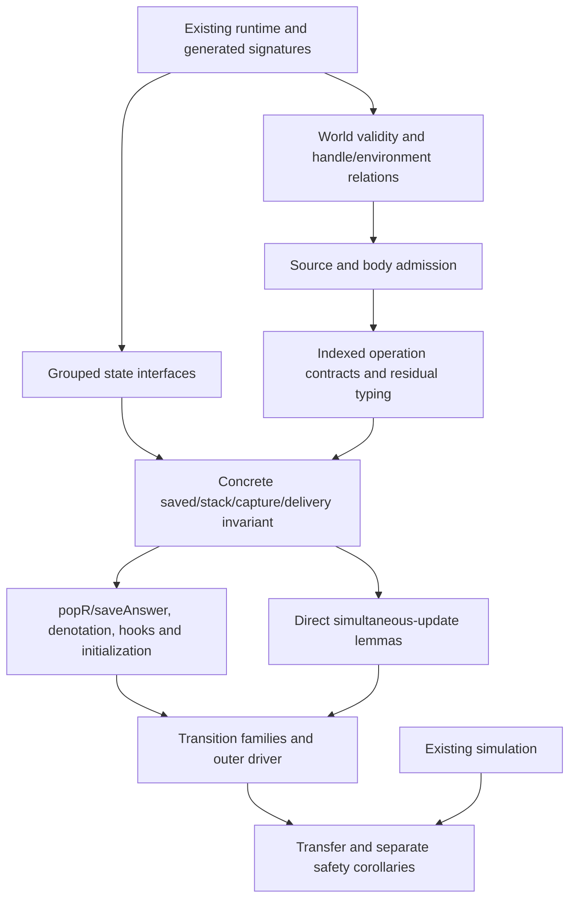

# Post-Phase C review and implementation plan

Date: 2026-09-20. Reviewed HEAD: `10d5c009` on `refactor/phase1-phase3`.
Status: reviewed proposal and evidence snapshot; **not an owner ruling or implementation receipt**.

The landed foundations are useful, but the supplied synthesis is not an executable plan as
written. A fresh Lean counterexample refutes the pending `M1Origin.actionAt_raceAll` statement:
it omits the source-location premise present in its backing theorem. It remains open; no false
theorem has been accepted. Before the main preservation proof, repair the shape of the state predicates, make
world transport precise, and compare every proposed theorem reference with its actual frozen
statement. The existing generated skeleton accounts for fields; it does not yet express all
relationships between them. Closing its current ledger would not establish typed execution.

`docs/core/decisions.md` remains the sole numbered decision register. This document owns this
review and the proposed execution sequence. `docs/STATE.md` owns current status;
`docs/ARCHITECTURE.md` owns placement; `docs/GENERATED.md` owns generation commands. Earlier
research notes remain historical evidence, with this review identifying the corrections to
carry forward. The input is preserved in
[the evidence folder](../research/2026-09-20-foundation-review-evidence/synthesis-as-received.md).
No owner choice is inferred from an implementation, a reported conversation, or this review.

## 1. Scope, method and finishing criteria

Reviewed the attachment, its core synthesis, the research copy, the Phase C receipt and
look-ahead, the typed-state plan and its amended refinement sequence, relevant decisions,
and the source changes from `15cb510e` through `10d5c009`. The broader range provides context
for the final proof pass; `b2bf4cca` and `16090306` are the final connector/bank/World closure
commits, followed by the documentation-only look-ahead. This is a focused foundations review,
not an independent audit of every generated byte or every change in that large range.

Done for this review means: reconcile material factual claims against live declarations;
check concrete counterexamples in Lean; distinguish implementation from theorem from proposal;
name the unresolved contracts; specify dependent slices, file ownership, negative controls and
acceptance criteria; retain the probes and exact results. Done does not mean implementing M3–M7
or ratifying open decisions.

**Development priority (owner, this review): organization and the semantic proof graph first.**
Use existing proof checking and a narrow build for changed semantic content. Run a new
counterexample only when it settles a live design question or protects a demonstrated failure.
Do not create a CI lane, snapshot format, baseline or general-purpose gate for every planned
relation. Reuse known test needs and unchanged evidence with its scope stated. Documentation
changes do not trigger a proof sweep. Full checks belong at an agreed integration/release
boundary or an explicit request, not after every small edit.

F5/F6 below describe coverage and simultaneous-update responsibilities. Implement the smallest
useful support at actual proof sites; promote repeated patterns into tools only after they pay
for themselves. A direct checked theorem plus an explicit graph edge is preferable to a new
gate that merely checks the same fact again. Never relax statement correctness, admitted
axioms, or visibility of missing semantics to make the workflow faster.

Evidence and reproducible commands are in §10. Research probes are outside the Test root and
are not a replacement for production batteries. No runtime, library, generator, or theorem
statement is changed by this review. No commit or push is made.

## 2. What the last slice actually landed

| Change | Commit evidence | What it establishes and what remains |
| --- | --- | --- |
| Completion data, fiber origins, exact clock | `8b64039f`, following `97e75781` | Cells/due work carry Completion; origin sites are data; ClockMillis/protocol v3 exist. This does not settle every observation/clock policy or prove typed resume ownership. |
| Placement | `05417cc6` | Store Carrier/Domain split, nine fold connectors under Laws, typed-state tools colocated, drivers above OCaml5. Do not repeat these moves. |
| Stated obligations | `3f893074` | Checkable proof targets, not evidence that every target matches its backing theorem. |
| Deferred mapping | `6977cfd9`, `b2bf4cca` | Mapping/naturality and representation connector laws. This is not an unrestricted old/new memo-store semantics theorem. |
| Arena | `8cb639b4` is OCaml tests; `c786d23c`, `6c6f7545`, `b2bf4cca`, `16090306` supply Lean laws/connectors/controls | List refinement plus finite OCaml evidence. Do not attribute all Lean proofs to the OCaml test commit. |
| Searched proof replacement | `60520379` through `7eac8578`; receipt `ac4a0fe5` | Proof bodies and supporting lemmas changed. Existing checks and retained open markers are evidence within their actual scopes. |
| Phase C closure | `b2bf4cca`, `16090306` | Split banks, World preorder/columns/allocation lemmas, origin lemmas, portable proof search and residue reporting. M3–M7 are not delivered. |
| Look-ahead | `10d5c009` | A plan and reported historical counts, with no additional semantic proof. |

Keep the existing kernel validation, bank-specific controls, completion functor, Arena seam,
and arbitrary-world preorder proofs. The findings below require targeted amendments, not a
replacement of Eff or a new proof framework. `Effects.Program` is a semantic proof carrier;
its continuations are not a second stored program representation.

The supplied "exactly six free objects" list is a summary of selected sorts, not an exhaustive
signature census. Use the ontology's per-sort declarations and generated signatures; do not
infer that six listed fold names establish every required uniqueness or simulation theorem.

## 3. Findings that change the plan

### F1. Predicate argument loss blocks the intended relational invariant

Fresh kernel inspection confirms twelve fields in `Typed.Preds`, but also confirms it is an
ordinary structure, not a typeclass. Concrete assembly is `def preds … : Preds World`, unless
an independent reason warrants changing that interface. The number twelve is a current
measurement, not a constraint on the repaired generator.

The critical facts are the generated argument lists:

- `RSavedOk` independently requires `P.program w e current` and `P.StackOk w e stack`.
  Neither clause shares an intermediate exit type with the other.
- `TaskOk (.resume target token code)` and `CmdOk (.resume target token code)` reduce to
  `P.ResumeOk w e code`. Target and token are discarded.
- Generated `CaptureOk` checks the environment and context separately. Path and source root
  are absent from those checks.

[FoundationProbe](../research/2026-09-20-foundation-review-evidence/Effect4FoundationProbe.lean)
proves the resume predicates unchanged by arbitrary target/token substitution and capture
checks unchanged by path/root substitution. These are universal facts about the generated
predicates, checked within the allowed axiom ceiling. They do not allege a runtime defect.

The consumer needs exactly those correlations. `EvaluateR.lean:174–176,207–229` saves an
answer continuation while installing an intermediate body/completion; `popR` at lines 79–94
feeds an exit into that particular continuation. Separate existential choices for the code's
type and stack input type cannot establish their agreement. A context-wide service predicate
likewise does not establish the lexical type environment of an addressed capture.

**Required repair, before concrete assembly:** explicit owner/constructor-level relations,
with occurrence accounting in the source table. Candidate semantic shape, not yet a compiled
replacement declaration:

```lean
SavedOk root w final saved :=
  ∃ intermediate,
    TypedProg root w intermediate saved.current ∧
    StackAccepts root w intermediate final saved.stack ∧
    InterruptProvenance saved
```

Resume typing must relate target, token, code and the receiving saved continuation. Capture
admission must receive the complete capture and its addressed source-typing derivation. Keep
mutable continuation ownership in the machine relation; do not put the entire live machine in
an allocation preorder or add runtime type tags. Generate grouped clauses from declared
sources; do not bypass the source totality check with a handwritten shadow skeleton.

Keep `ResumeOk` and `InterruptOnly` as distinct semantic responsibilities. The earlier proposed
deletions were explicitly withdrawn in deep-dive §9. Whether each remains a separate Preds
field depends on the grouped interface; its responsibility may not disappear.

### F2. The proposed M2b-first order reverses an accepted correction

The accepted sequence in `2026-09-19-state-refinement-plan.md:697–699` and deep-dive §9 is:
world/order/columns, then protocols and TypedProg/HandlesFit, then concrete predicate/stack
assembly. The later look-ahead and supplied synthesis regress to assembly before semantics.
Use M3a/M3b below. M2's data work is substantially landed; final assembly is not seven
independent missing definitions.

### F3. Weakening needs explicit validity and transport premises

`Protocol.Typed.mono` requires both monotone operation preconditions and monotone result
predicates (`Laws/Effects/Protocol.lean:55–61`). Future-world quantification does not prove
those premises. `World.le` preserves old cell judgments, but does not assert validity of either
world, exact table domains, or newly allocated cell typing (`Typed/World.lean:8–33,120–129`).

External spelling transport is also absent from its current definition. The proposed
`TableExtends w.state.externals.allocated …` is ill-typed: TableExtends takes functions to
Option, while allocations are lists. Reuse the existing allocation `Extends` relation, or
prove allocation equality in the empty-host slice. If a stricter order is introduced, keep
World.le and prove the projection to it; do not silently reinterpret the landed order.

A second fresh probe refutes the general claim that conditional lookup in universal form is
monotone merely because tables extend: an empty table satisfies a conditional predicate
vacuously; adding an incompatible declaration violates it. Thus neither "use forall" nor
"use exists" is a variance proof by itself. State support/coverage assumptions and prove the
actual transport lemmas. Existing conditional cell leaves plus coverage are useful precisely
because these responsibilities are separate.

The new invariant also needs freshness of ghost domains. Actual-cell coverage alone permits
a ghost declaration at the next allocation index, whereas `refMake_extension` and
`deferredMake_extension` explicitly assume that index has no declaration. State either exact
domain correspondence or a proved allocation-exclusion invariant, and maintain it at every
allocator. `CellCompatible` is an obligation for the step proof, not a substitute for it.

**Allocation contract indexing is still unsettled.** The generic Protocol.post receives only
the resulting world, the untyped operation and its answer. It has neither the source world
nor a typing derivation; `.deferredMake` carries no selected answer/error types. Therefore the
proposed allocation post cannot yet directly state the intended tableInsert relation or
ensure the continuation uses the same chosen cell type. Before expanding protocol clauses,
elaborate one ref allocation and one polymorphic deferred allocation end to end. Decide between
a proof-side indexed operation contract/shared witness and a justified generic protocol
interface amendment. One candidate is `Request oldWorld operation` selected at the visible
node, with `Post request newWorld answer` sharing that certificate. Independent existential
choices in pre and post do not correlate the allocated type. This changes the transport proof:
certificate weakening and postcondition compatibility must be established before reusing
the existing mono argument. Retain the existing generic laws where their interfaces still
apply; no runtime type annotation follows from this proof-side design question.

**Protocol construction must not be circular.** Defining a fork precondition as
`TypedProg (bodyR child)` while defining TypedProg through that precondition does not supply
a Lean construction. Start with source admission `PointTyped root w point type`, using
Node.at_, source/checker derivations, lexical environment/handle fit and service requirements.
Then classify the existing Body constructors through that evidence or lower store/capture/race
contracts, define operation contracts from those certificates, and construct residual typing.
Only then prove denoteAt/bodyR/denoteAction produce typed residuals. `Sched.lean:97–159`
already supplies Body/Point operation data; `Intro.lean:27–55` supplies the existing source
weight-induction route. Synthetic bodies, finalizers and generator hooks still need their own
decrease/closure arguments. An alternative mutual semantic construction must explicitly prove
well-foundedness or strict positivity. Settle one addressed fork/mask case alongside allocation
before treating the protocol interface as frozen.

### F4. The residue is not "31 namesakes and 11 missing proofs"

**Confirmed false pending statement:** `Laws/Program/Intro/Weight.lean:177–179` declares
`M1Origin.actionAt_raceAll` without the section's source-location hypothesis `h`.
The theorem at line 182 includes `h`; `include h` did not insert it into the `def` obligation.
Take `root = .withFiber (.raceAll .nil)`, `p = rootPoint 0`, and the unconstrained `a = .getId`.
The decoding premise holds, but the demanded equality `a = .raceAll es` is impossible.
[RaceObligationProbe](../research/2026-09-20-foundation-review-evidence/Effect4RaceObligationProbe.lean)
proves the negation of the actual instantiated obligation's `.statement`, at `[propext]`.
This is a landed specification defect, not merely a search-normalization miss.

The smallest proposed amendment explicitly binds
`Node.at_ (.eff root) p.path = some (.eff (.withFiber a))` in the obligation at the same
position as the theorem. Preserve the counterexample, register the amendment and compare the
adjacent three action obligations too. This review leaves all production statements and
markers unchanged; declaration changes require the separate amendment slice.

There are 41 source `#proof_wanted` commands. The retained Phase C trace reports total 65 gate
invocations / 393 counted statements / 351 closed / 42 open. Repeated scopes are counted more
than once, so 393 is not a unique-goal count. These are historical report totals; the fresh
reflection inventory in §10 is a different measurement.

The synthesis's list contains 32 purported theorem-related names, not 31. Its memo deletion
is not a ledger row. The additional open test row in the retained 42 is
`Test.IndexedColumnDraft.duplicate_position`, not the two guarded controls in
`Test/Audit/Obligations.lean`. Nine source items are separately identified as substantive work:
five static-site bridges, two trace agreements, observation erasure, and the handshake.
Do not derive an exact closing forecast by subtracting these counts.

The proposed namespace-strip shortcut fails for renamed and differently nested proofs, and
exact type matching also distinguishes binder order and missing hypotheses. For example,
`source_fork_extension` is backed by `fork_source_extension`; supervision has `_flags`,
`_origins` and `_holds` names; Pending's statements order some binders differently.
The correct route is explicit checked references and, where needed, explicit adapter theorems.

The proposed early `continue` also bypasses the current proved-plus-wanted rejection and
unconditionally recreates `.checked`. Both behaviors contradict the current ledger contract.
All success routes must share stale-marker handling and repeat-check validation. A proof
search failure is not evidence that the proposition is correct but inconveniently normalized.

The actual binder audit and any refuted frozen statement are recorded in §10. A refutation
blocks closure of that statement until an explicit amendment is recorded; never weaken it
silently or accept a nearby theorem by name.

### F5. Memo uniqueness is not an inductive invariant on its own

The identity write in `memoComplete` changes duplicate-ID stores by copying the first matching
map over subsequent matches; it does not remove list entries. Under unique map IDs it should
be a no-op. However, uniqueness alone is not preserved by `memoFork`: one map numbered zero
with `nextName = 0` acquires another zero map. A supply bound alone also permits duplicates.
The checked finite counterexamples are in
[MemoProbe](../research/2026-09-20-foundation-review-evidence/Effect4MemoProbe.lean).

Proposed sufficient invariant:

```lean
MemoIdsOk s :=
  (s.memo.map MemoMap.id).Nodup ∧
  ∀ m ∈ s.memo, m.id.index < s.nextName
```

Prove initialization, all relevant store-writer preservation, propagation to reachable states,
and the local identity lemma before deleting the write. Keep this distinct from
`Stores.MemoKeysNodup`, which concerns layer keys inside each map. `memoEntry_keys` already
exists; it is not a missing proof discharged by this cleanup.

The public store carrier admits malformed duplicate-ID values, so the edit is an equality
only on a named invariant domain. Decide how that domain applies to imported/restored stores.
The current completion functor connector does not supply this old/new transition theorem.

### F6. Trace freedom and static-site membership still need proofs

`Laws/Api/TraceOrigin.lean` (moved from `Laws/Program/Guard/` on 2026-09-23, so the guard laws no longer import the API layer) holds `step_agrees` and `reachable_agrees` open on the actual
`Guard.Reachable` decision-prefix domain. A sole event-emission site does not prove invariance
under record replacement, evaluation and scheduling. Preserve reachable-state hypotheses and
prove spawn/update/driver lemmas before composing the result.

The five source-site obligations in `Laws/Api/Supervision.lean` have no implemented generic
`mem_supervision_of_node_at` theorem. Prove one node-to-fold membership connector using the
generated signature/path equations, then derive the corollaries.

`Machine.obs` is a direct projection; `Run.observe` passes through `HostSession.inspect` and
zero-budget replay. The latter's trace replacement is not the claimed `rfl` proof: the Phase C
receipt explicitly reports that attempt failed. Supply reader/projection lemmas and retain the
frozen statement until it checks. Runtime field independence, equality of observations, and
reachability of an erased state are three distinct claims.

### F7. The structural census is conservative and not a semantic coverage theorem

`Positions.writeSites` can omit copied fields when given a source record, but `#write_census`
currently calls it without that argument (`Positions.lean:233–257,378`). It conservatively
counts reconstructed fields as potential writes. Do not assume it already produces exact
changed-field sets. Either recover the source expression with checked controls, or accept
conservative sets and their larger obligations. Matcher numbering is diagnostic, not a stable
obligation ID.

Multi-field frame rules must reconstruct the final simultaneous update. Coverage must then
join reachable write holders to exact propositions through named transition-shape adapters.
A name-only join that accepts `Obligation True` is insufficient. The totality of the source
position table and the completeness of semantic transition premises are separate checks.

### F8. Architecture advice is partly stale and partly underspecified

The nine connector moves, Carrier/Domain split, driver split and typed-state tooling placement
already landed in `05417cc6`. The retained architecture report says zero unaccepted direction
violations and zero mutual area pairs; this review did not regenerate it. Historical directory
cycles are not Lean module import cycles. Role heights also permit same-height imports, so
the role register does not by itself prove a strict dependency order.

Row 39 still needs the authorized deletion sequence and a careful rendering split. The live
file is `Store/Domain/Shape.lean`. `Store.Domain` intentionally sits above Schema; moving the
renderer cannot make all of Store a leaf. `Canonical.document`, schema addresses in Node,
and generated schema instances also depend on Schema. Name three owners before dispatch:
pure shape/canonical foundations, the Schema rendering bridge, and domain persistence above
Schema. Move the convenience `Canonical.document` with an appropriate downstream owner if it
would otherwise create a Canonical/OfShape cycle. Keep textual `Shape.render` distinct from
schema-producing `Store.render`.

## 4. Decision reconciliation

These recommendations amend the proposed plan, not the owner's rulings.

| Register row | Current evidence | Required treatment |
| --- | --- | --- |
| 20 | Origin/site data landed; static-site and trace connectors remain | Record implementation separately from formal ratification. Do not schedule the origin field again. |
| 39 | Schema deletion series is ruled; placement changed underneath the old paths | Preserve its order, update file ownership before the renderer slice, include row 8's key deduplication. |
| 44–45 | Typed handles/per-cell tables are approved | Retain coarse Val.hasTy, prove nested HandlesFit and reference-completion liveness; no runtime tags. |
| 48 | Existential stack types are recommended; prior approval is reported in the look-ahead | Use shared intermediate types in the whole saved-state relation. Reconcile the approval record without inventing a new owner decision. |
| 51 | Context-wide service typing is recommended | Also state that required services exist; "every present service is well typed" alone allows an empty context. Choose empty requirements at load or supplied typed context. |
| 52 | No-halting/no-bad-shape are proposed corollaries | Prove separate statements with decoder/identity/decision premises. They are not verified by construction or by exit-shape typing alone. |
| 78 | Completion migration landed; memo cleanup remains | Add MemoIdsOk, reachability, malformed-store policy, and a restricted old/new connector to the remaining slice. |
| 79 | Origin view/representation machinery landed; holder factorization and trace laws incomplete | Keep semantic, holder and diagnostic observations distinct; attach each claim to its actual theorem/domain. |
| 80/84 | TxBody ∩ Straight is a proposal | The existing sufficient budget is for a loaded single-root run. Outer continuation/store, entry/exit work, reserved budget and isolation connector still block embedded transactions. |
| 81 | WakeList exists; Latch does not | Keep cancellation, captured-batch, coalescing, traversal and dispatcher questions open. Latch is not evidence for all higher-level wake behavior. |
| 82 | No host closure/second IR is an existing rule | Registry resolution, captures, lifetime, recursive admission, portability and code-identity evidence remain open. |
| 83 | ClockMillis/protocol v3 landed | Separate representation from custom-clock policy and the still-proposed Random profile. Do not ratify the whole row from the clock commit. |
| 85 | Arena/list laws and OCaml controls landed | Record that fact without upgrading finite OCaml tests to a Lean instance or silently ratifying the wider storage roadmap. |

Three additional foundation questions are proposed in register rows 86–88: relational owner
clauses, valid-world transport/domain discipline, and exact declaration/coverage evidence.
They are technical design obligations to settle with probes before broad proof dispatch.
The malformed-store, services, scope/refusal and transaction questions refine the existing
rows above instead of creating duplicate decision owners.

## 5. Contract to freeze before M3

### 5.1 The final claim and exclusions

The target is safety at every reachable step and every recorded fiber exit on the reference
machine, then transfer through the existing simulation to the compiled machine. State:

1. The exact checker certificate, source root, result/requirement rows, starting context and
   starting stores. For the present loadR API, use its actual empty store/context and separately
   require the program's service needs to be provided or empty.
2. The decision domain. Arbitrary host-injected completions and malformed commands cannot be
   silently covered by "any tape". Either prove they are irrelevant/rejected in the empty-table
   profile or require a named admissible/typed-decision relation and show it covers intended
   public runs. A proposed restriction to the owner's universal wording needs explicit review.
3. Independent compile budget, command/driver budget and finite decision prefix. Safety includes
   live fuel/choice frontiers and does not imply termination or fairness.
4. The observation for each conclusion: reference full-state invariant, every fiber's exit,
   holder state, diagnostic erasure, or host execution. Do not conflate them.
5. External rows are still the DI-57 boundary; closed-scope exits remain an explicitly refused
   source position today. Either discharge their consumer relation or carry a visible
   restriction. A generated `True` from a refusal is not an established semantic clause.

### 5.2 World validity distinct from world order

Keep landed World as data: existence world, stores, Γ, Π, Ρ. Add a separately named validity
relation and an explicit relation between the world and the machine it describes. Minimum
contents to resolve:

- Fiber table coverage and no invented future allocation keys; retained exited fibers keep
  their declarations. Heap/promise table domains agree with actual live cells, or an equivalent
  proved freshness discipline covers every allocator.
- Stores WF, typed existing cells, nested handle agreement and existence, legal covariance for
  fiber results/errors, and invariance for writable Ref/Deferred handles.
- Delayed `Completion.ofRefGet` reads a live heap cell whose declared type fits the promise
  answer column. Its actual later value comes from the preserved heap invariant, not an
  allocation-time snapshot or just coarse ValueOk.
- Allocation spelling transport through the existing Extends relation, or the proved invariant
  that the empty-host profile leaves the external allocation table unchanged.
- A root typing environment carried as a fixed parameter or an explicit ghost descriptor;
  source paths, lexical captures and service-key types must resolve against it. `Expect.root`
  and `.hook name` need defined resolution rules. Three constructors alone do not prove
  enough information reaches every consumer.

Prove reflexivity/transitivity for any strengthened order, its projection to World.le, and
transport of each precondition/result/cell/handle clause under its precise validity premises.
Supply a well-formed positive witness and negative witnesses for fresh ghost-key collision,
changed allocated spelling, wrong nested handle type and dangling deferred-reference completion.

### 5.3 Protocol, saved context and delivery contracts

Reuse Protocol.Typed and its sum/bind/widen/inversion laws. Define pre/post clauses for every
SyncOp and FiberOp, including internal store operations rather than just public NativeOp rows.
A postcondition must relate the actual operation to the actual answer and resulting world;
allocation clauses expose the fresh key and table update. Do not make an impossible postcondition
a vacuous way to type a computation whose real handler returns an answer.

Define TypedProg at a named intermediate effect/result contract. Define StackAccepts from that
contract to the fiber's final contract, including success/error transforms, restore/mask,
finalizer, iterator and loop cases. Define saved-state typing with one shared witness.
Keep the proof carrier functional where it already is; no change to stored Eff syntax follows.

Delivery must distinguish active and stale tokens. For an active delivery, prove the code fits
the input of the saved receiver; for a stale delivery, prove the machine's actual inertness
property. Cover pending waiters, due work, already captured batches, timer returns, dispatcher
tasks and explicit resume commands. Existing ParkHandshake covers only pending waiters and
neither supplies typed answers nor replaces the other phase-specific relations.

Race typing must correlate entrants, winner/failure/accepted accumulators, registration state
and the host continuation. Capture typing must connect a path and root to its lexical and
service environments, rather than type the same value list independently of where it is used.
Interrupt provenance must distinguish scheduler interruption from arbitrary typed failure.

### 5.6 The FR-08 ruling (2026-09-21)

The delivery-state correlation this section asked for cannot be a frame-level fact. A typed
failure escapes an interruptible catch whenever an interrupt was recorded while the fiber was
masked and the masked region then fails; that is rc.112's own rule (`internal/core.ts:540-545`),
the reference machine models it, and it is reachable from checker-typed source
(`E4-SCHED-CE-008`). The owner ruled that the machine does not adopt it: at a preempted skip
both walks pass on the failure stripped of its `Fail` reasons and combined with the recorded
interrupt (Effect 3's rule), a signed divergence (`U-01`). The typed-state theorem is
unconditional; `FrameAccepts.resume.skip` is guard-miss-only; the hook contracts are filled
under `HookLaws`. The ruling and its amendment, the evidence and the exact statements are in
`docs/research/2026-09-21-foundations-slices-3-4-review-and-fr08-ruling.md` (§2, §4).

## 6. Staged implementation plan

Each slice starts with an exact path brief and frozen declarations, uses its own worktree if
parallel implementation is useful, and takes the Lean lane exclusively in that checkout.
The scope below is proposed; root import anchors and final file lists are fixed in the dispatch.
Do not manufacture uniform proof rewrites or a new abstraction without a consumer.

### A. Immediate statement audit; optional residue convenience

**A0:** owns the false/mismatched obligation declarations, their evidence and explicit adapters
next to backing laws. First compare frozen binders/propositions and quarantine
any refuted statement; repair requires a named counterexample and explicit amendment.

**A1, only when useful:** direct-reference convenience owns `Laws/Auto/Obligations.lean`,
relevant ProofGraph support and its existing focused controls. This instrument does not block
B–F. Direct checked theorem applications already provide evidence; add registration only if
repeated use shows that it saves work.

Use an explicit obligation-to-theorem reference, validated by the existing closed-proposition,
universe and transitive-axiom policy. Add an adapter for reordered binders or legitimate
specialization; no unification trick may erase a missing premise. Both search and direct
reference route through stale-marker rejection. Repeated gates validate existing evidence.
Remove a wanted marker only in the same slice as its checked evidence.

Reuse current wrong-type/axiom/universe/missing/stale controls. Add only checks reached by the
new code, especially the missing-premise case, an explicit binder adapter and the direct-proof
stale-marker path. List unique goal IDs directly from declarations when reporting; no new
inventory format or recurring job is required. No fixed forecast of 31 closures.

Acceptance: `lake build Test.Audit.ProofGraph Test.Audit.ProofGraphSearch Test.Audit.Obligations`
and the law modules whose markers/adapters changed. Their exact declared propositions remain
checked at `[propext, Quot.sound]` or below. The false-statement amendment is a separate review
event, not an incidental tooling change.

### B. Predicate adequacy and generation contract

Owns `Typed/{Vocabulary,Sources,TypedSources,TypedStateDecl,State,Frames}.lean`, only affected
position/frame tooling, and focused audit/control modules. Design owner/group syntax before
editing the generator. It must pass the actual owner or constructor fields needed by the
relation and account for each occurrence it covers exactly once; no silent field drop.

Prototype SavedOk/StackAccepts, whole-capture typing and target/token-aware delivery interfaces
against the existing evaluator. Initially parameterize unfinished semantics; mark the result
structural until C–E supply concrete predicates. Replace the old generated interface through
explicit connectors where meaningful; do not claim the old independent clauses already imply
the stronger relation.

Controls: incompatible current/stack witnesses; different resume targets/tokens; identical
capture values at different source paths; omitted owner clause; duplicate coverage; missing
new field; declaration/bank omission. The three erasure probes in this review become regression
controls that the new meaningful relation must distinguish, while the historical old relation
can retain its proved erasure properties.

Acceptance: `make check-typed-state`; fresh kernel print of the new public declarations;
positive nontrivial examples and negative controls. Do not pin an arbitrary Preds field count.

### C. World validity and transport (M2 completion)

Owns `Typed/World.lean` and a narrowly scoped validity/handle module, plus controls. Preserve
existing order and allocation lemmas. Add §5.2's world/machine agreement, support/freshness,
handle and completion obligations; choose the actual transport relation and prove its laws.

Acceptance: focused World/validity module build; checked fresh allocations for fiber, ref,
deferred and memo cases; changed-spelling, vacant-table and dangling-reference negatives;
axiom printouts. This slice establishes assumptions at use sites rather than merely adding
premises to downstream theorem statements.

### D. Operation protocols and residual typing (M3a)

Owns `Typed/Residual.lean`, protocol/answer inventory tooling and its tests. Depends on C;
B's interface experiments can run alongside C. Derive the operation inventory from actual
constructors, with dependent answer types intact. Each authored protocol clause names the
consumer/evaluator equation and its source typing rule. Internal operations get their own
clauses; the existing progress theorem is a public-row adapter, not universal SyncOp evidence.

Freeze source/body admission before OpOk, AnswerOk and TypedProg; keep the construction
non-circular as specified in F3. Freeze handle/environment fit and all weakening hypotheses.
Reuse the existing pure/bind/sum/widen laws where their interfaces apply and prove only new
certificate/transport/handler adapters. Settle the allocation-indexing issue on a polymorphic
allocation followed by read/await, and the source-admission issue on addressed fork/mask,
before expanding the alphabet. An interface with no inhabiting operation witness is unfinished.
Controls reject a missing constructor, wrong answer carrier, weakened clause and a protocol
that types a real answering operation solely because its postcondition is impossible.

Acceptance: focused residual/inventory builds, axiom receipts, and a complete constructor-to-
clause table. This is statement/protocol completion, not scheduler preservation.

### E. Relational assembly and first difficult proof (M3b/M4)

Owns concrete predicate assembly, `Typed/Stack.lean`, typed delivery support and
`Laws/Machine/Keeps.lean`. Depends on B, C and D. Instantiate an explicit predicate value and
state the actual top invariant with world validity, machine agreement, saved-state correlation,
command residue, queue/dispatcher ownership, races, scopes and store columns.

State the loaded-program goal with the certificate, root type, requirements and initial-world
witness; do not treat a well-typed statement as a proved initialization theorem. First prove
saveAnswerR and popR together on an intermediate type different from the final type, including
error-changing handlers and finalizers. Prove active/stale-token delivery and addressed capture
lookup. Then prove the unary Keeps composition required by actual transitions.

Acceptance: these first difficult lemmas check at the trust ceiling; negative examples fail
for the intended semantic reason; each refused source edge is discharged or explicitly visible.
If the interfaces cannot support these proofs, repair B–D before authoring the rest of S2.

### F. Denotation, hooks and initialization (M5/S1)

Owns `Typed/Denotation.lean` and hook typing. Use the existing addressed-source weight induction
with Node.at_ and checker inversions, not a guessed plain structural induction. Register
reusable combinator lemmas in their named banks. The capture/root/environment relation from E
supplies interpreter hook obligations; all real hook readers are inventoried.

Finish initialization from the actual loadR constructor, including freshness, context
requirements, empty queue, root declaration and the chosen external-table boundary. Preserve
frontiers as live states, including unsupported compiled cases named by the current contract.
Acceptance: focused denotation/hooks/init builds and positive programs exercising type-changing
continuations, fork, await, races, scopes and cleanup. Finite programs accompany the universal
lemmas; they do not replace them.

### G. Simultaneous state reasoning and semantic coverage (F6/F5)

Owns `Laws/Auto/{Frames,Positions,Obligations}.lean`, `Typed/Frames.lean`, the future ledger and
controls. Design alongside D–F; final statement adapters depend on E's invariant. Start with
the first real coupled update and its direct theorem. Extend the existing frame tool only
where this removes repeated proof work. A new coverage command is not a prerequisite for
starting a transition proof; explicit declaration-backed inventory is sufficient during design.

A reusable frame specification records owner, canonical written-field set, source-record policy,
reused clauses and the new premises required by the final simultaneous update. A coverage
record joins stable holder ID, named transition-shape adapter, exact proposition and evidence.
The census independently enumerates reachable holders; diagnostic compiler arm names are not
identifiers. Missing, duplicated, unclassified and weakened obligations fail.

The decisive examples are a coupled update whose intermediate state violates the invariant,
a hidden helper write, and a same-holder `True` substitution. The other missing/stale/refusal
cases reuse existing ledger controls where possible. These are the known verification needs,
not a requirement to build a separate permanent test framework before using the relations.
Acceptance: the actual coupled-update proof checks, all known transition holders have an
explicit graph disposition, and exact declarations are checked when referenced. Pin a numeric
ceiling only for the concrete stabilized scope, not speculative future abstraction shapes.
Keep source-position, frame-premise and semantic-goal counts separate when reporting them.

### H. Transition preservation (M6/S2)

Owns `Typed/Ledger.lean` and `Typed/Step/*`. Dependencies: F and G's semantic responsibilities
(not necessarily a new tool); authorized binder-term
row work before refUpdate and related store families. Freeze the main statement schematically
as `TypedState root w m → LegalDecision … d → ∃ w', Transport w w' ∧ TypedState root w' (step …)`
only after deciding whether LegalDecision is needed by the actual API domain in §5.1.
Do not silently introduce that premise into the owner's universal claim.

Land families in dependency order: shared frame/bookkeeping lemmas; saved-frame delivery and
interruption; store allocation/read/write/completion; fork/join/race; scopes/finalization;
async/timer/due/captured-batch dispatch; outer driver/decision composition. Follow the measured
call graph rather than historical estimates of 40 or 65 arms. Every family consumes declared
hooks and produces the new world/validity evidence it needs.

Acceptance per family: one focused module/dependent check after substantive changes, explicit
proof-graph progress and no missing/stale rows. Reuse the existing trust mechanism and run only
the negative controls reached by the change. A family cannot disappear
from coverage because its proof is difficult. All live/frontier outcomes remain classified.

### I. Transfer and separate safety corollaries (M7/S3)

Owns `Typed/Transfer.lean`, `TypedRun.lean` corollaries and the contract battery. Reuse replay_rel
and BMeans.exitOf to transfer each recorded fiber exit, including detached fibers; do not use a
root-only theorem to claim all-fiber safety. State empty host table, initial context, budgets,
decision domain and simulation assumptions in the exported theorem.

Prove no wrong-shape internal decoder failure and no unknownFiber/unknownScope/unknownRace
halting as distinct consequences of the required stronger state properties. Coarse failure
admission can admit defects, so an exit-typing theorem alone is insufficient. Frontiers and
waiting remain possible; no termination, fairness or universal host equivalence is inferred.
Acceptance: focused transfer/contract build and exact theorem/axiom receipt. Full Test, trust
and repository sweep occur when requested for milestone acceptance under current AGENTS rules.

## 7. Independent work and dependency boundaries

**Residue source/trace/holder proofs:** may proceed beside B–F. Use F6's three separate claims:
source-site membership, trace/origin agreement on reachable states, and holder observation
factorization/erasure. Required builds are the touched Supervision/TraceOrigin/Run laws and
direct controls. Do not block the protocol design on every diagnostic proof unless it is an
actual import or theorem dependency.

**Memo cleanup:** after F5's invariant and domain contract. Own the memo store branch, its
invariant laws, affected simulation/guard statements and census witnesses, and generated outputs
reached by the runtime edit. Prove exact equality of returned answer and resulting store under
MemoIdsOk before the deletion. Carry the invariant through both relevant machine paths, or
state which one the connector covers. Keep the malformed-store counterexamples explicit.

Generation order is derived → lcnf → eff → wire → cas, then any affected downstream groups.
After narrow Lean checks, `LEAN_NUM_THREADS=1 make gen-lcnf`, then `make gen-cas` (whose
prerequisites include eff/wire), then `make check-ocaml` with the same thread restriction.
Use the effect4 opam switch through the maintained recipe. Inspect all output/closure-manifest
diffs. `check-gen` alone does not freshly regenerate LCNF. Host differentials are finite evidence.

**Row 39:** retain EffectfulField removal first, then Check/Accepts/Image/schemaOf, annotation
trim, rendering split and row 8 key fixes. Re-inventory live consumers and imports at each
slice because the old paths/counts predate placement. Preserve the printer's used fold and the
kept schema codec/TypeScript checks; do not delete by historical line count.

**P3 identities:** independent only after checking wire/CAS/LCNF exposure for each identifier;
not automatically a no-regeneration cleanup. **P4 transactions:** after M7 and row 84's
embedded-attempt connector/approval. **P5 Latch:** after its cancellation and dispatcher
contract; no blanket agreement claim for Pool, Queue, Semaphore or STM. The wider target,
server and runtime-module roadmap remains in STATE/decisions; it is not silently canceled here.

## 8. Proposed module and proof graph



These are construction/proof dependencies, not a promised exact import graph. The transition
inventory accompanies the proofs; a new frame or coverage tool is not a node they must await.
Keep semantic typing below the simulation/transfer layer where practical. The current
World imports Handles, so do not promise an entirely Book-free closure without measurement.
Extract a shared lower lemma only when a real dependency forces it; do not undertake another
placement wave for appearance. Preserve declaration namespaces and root ownership when moving
an actually needed helper. No change to the stored Eff carrier is implied by this graph.

## 9. Dispatch rules and stop conditions

Each dispatch lists base/head, exact source/test/doc/generated paths, root anchors, intended
deletions, frozen theorem statements, known refusals, commands and finish criteria. Separate
specification amendment, proof, runtime deletion and generated-output changes when their
review obligations differ. Receipts report bounded versus universal evidence and host limits.

Stop that slice on a checked counterexample, missing semantic information in the interface,
a new reachable refused case, or an unsupported ownership assumption. Record the smallest
proposed amendment and its downstream impact. Other independent review or proof work may
continue. Never change a frozen proposition solely to meet a ceiling or leave a marker paired
with evidence while calling the ledger closed.

## 10. Verification receipt

Reviewed tree: `10d5c009`; initial changes were an edited STATE pointer and an untracked core
synthesis. This review changes planning documentation only and retains standalone evidence.
The exact newly checked probes and the final statement-audit result are recorded in
[the verification receipt](../research/2026-09-20-foundation-review-evidence/receipt.md).

Fresh focused dependency build:

```sh
lake build Effect4.Laws.Program.Typed.World Effect4.Laws.Run Effect4.Laws.Program.Guard.TraceOrigin
```

Result: exit 0, 345 jobs; the warm build replayed cached module diagnostics. This validates
current dependency freshness, not a fresh execution of every historical ledger search.
Standalone `lake env lean` runs provide the fresh kernel evidence cited in this document.
No OCaml build, generator run, runtime-coverage report, full trust audit or full repository sweep
was performed for this documentation review. Historical receipts remain labeled historical.

## 11. Whole-core semantic coverage and the remaining design program

The owner's additional requirement is broader than typed-state safety: account for the pinned
Effect TypeScript semantics as a whole, place every open core issue in a workstream, and leave
usable contracts for unsettled modules. The milestone is the shared foundation for that work,
not a substitute for it. The separate inventories linked below are review snapshots, not new
sources of implementation truth or mandatory CI outputs.

### 11.1 Define totality over a finite pinned surface

A fresh filesystem and TypeScript syntax inventory finds 452 `.ts` sources under
`vendor/effect-4.0.0-rc.112/src`: 137 public root modules and their barrel, 41 internal files,
268 unstable files in 18 groups, and five testing files. The 137 public modules have a disjoint
13-family disposition below. The syntax parser reported zero syntax errors. Its counts are
not type-checking or semantic evidence.

The [source inventory and reproducible script](../research/2026-09-20-foundation-review-evidence/semantic-inventory/README.md)
retain all paths, exported names and source hashes. The snapshot counts 4,281 directly exported top-level names in root files including the barrel,
704 internal, 3,479 unstable, and 20 testing. It includes types/aliases, merges overload names
within a file, and does not resolve inherited export-star names, namespace members or overload
arms. Those are explicit work in the symbol-resolution pass, not silently counted as mapped.
The current runtime mechanism census anchors only twelve source files; the existing stateful
catalogue has twenty family rows. Neither is the whole exported semantics denominator.

Use `(pinned module, exported entry/overload, admitted profile)` for semantic disposition.
Every item ultimately names one of: core primitive; pure operation; Eff composition/authoring
form; host capability with a relational contract; type-only/alias/metadata; explicitly refused
profile with reason; or unreviewed work. Internal helpers link to the owning public behavior;
module initialization, globals and retained callbacks also receive an owner. A refusal is an
accounted-for limitation, not implemented semantics; unreviewed is not a refusal.

For this review the all-file/all-root-family inventory is complete at its stated granularity.
Per-export/overload semantic analysis, alias-star resolution and implementation are planned,
not claimed finished. No claim of "fully reified Effect" is justified until the admitted
profile, every behavior-bearing slot and every required relation are accounted for. Arbitrary
TypeScript closures and ambient host state remain outside the stored first-order language
unless translated through a named admitted mechanism.

### 11.2 Semantic workstreams and real dependency order

| Workstream | Families and responsibilities | Existing base; next concrete deliverable | Dependencies and closure claim |
| --- | --- | --- | --- |
| W0 Core control and typing | Effect/Effectable/Runtime/Fiber/Scheduler/Cause/Exit/Scope; evaluation order, errors, interruption, races, scopes, finalizers and live frontiers | Eff, Machine, reference semantics and existing simulation; execute §§5–6, then classify the remaining Effect exports as primitive, composition, type surface or refused profile | Value/handle/context contracts first. Close per-step safety and named compiled/reference observation under explicit decision/host premises; no automatic host or liveness claim. |
| W1 Values, types, atoms and user data | Scalars, structured errors/defects, records/variants, collections, equality/hash/order, mutation, exact embeddings, generic cell types and atomic binder terms | Val/Ty/Term and existing algebras/atom rows; finish authorized generic Ref/Deferred and binder-term work, then the selected record/collection/numeric families | Required before the corresponding W0 store proof arms and all compositions. Preserve Ref/Deferred invariance; fix numeric/key/duplicate domains before each family. Arbitrary error payloads need the existing basis ruling amended, not silently enabled. |
| W2 Context, configuration and layers | Context/References, service identity and presence, Config/ConfigProvider, memoized Layer, LayerMap/LayerRef, ManagedRuntime/ScopedRef/Resource | Context and layer semantics; Config algebra/laws already exist, despite the older language-cut's "absent" label; finish service/environment relations and memo identity contract | W0/W1 for typing; W4 for retained behavior where needed. Close construction, sharing/freshness, captured/invocation context, lifecycle and disposal separately. Layer existence is not proof of all resource wrappers. |
| W3 Observations, identity and storage | Public versus private fibers/cells, holder state, trace, commands/journal, typed IDs and lawful container refinements | Existing Obs/Book, origin data, Projects/Refines, list Arena; finish §7 observation laws and named projections for compositions | Comes before claiming agreement for helper-fiber/private-cell implementations. Preserve current full-Stores Obs and add a connector. No blanket hiding/renaming of ordinary numbers or arbitrary store differences. |
| W4 Retained behavior and ownership | Typed Eff entry resolution, lexical captures, invocation/captured services, FiberHandle/Set/Map, Cache/ScopedCache/RcMap/RcRef/Pool, Request/Resolver | Existing Eff/Point/Capture and scope lifecycle; design the typed code-entry/capture contract, then implement concrete compositions | W1/W2/W3 plus wake/time contracts. Freeze resolver identity, batch/precheck/collect boundaries, miss coalescing, replacement, expiry, refcount and finalizer ownership per module. A content digest alone proves neither code type nor identity. |
| W5 Coordination and waking | Ref/MutableRef/Deferred, Latch, Semaphore/PartitionedSemaphore, Queue/PubSub, SynchronizedRef/SubscriptionRef | Generic cells plus existing WakeList/Scope/dispatcher; implement selected Eff compositions with declared wake policies | W0/W1/W3. Respect DI-11. Specify queue maker-dispatcher capture, semaphore selection at task time, retained losers, counted wakes, backpressure, close/shutdown, cancellation and captured batches. Different policies require different relations. |
| W6 Time, schedules and randomness | Clock/Duration/DateTime/Cron/Schedule/ExecutionPlan/Random; retry/repeat/timeout composition | ClockMillis/timers exist; reuse iteration, sleep and races; specify schedule descriptor/output/state and the versioned random/context profile | W0/W2/W3, W5 where wakes matter. Fix logical/custom clock contract, rounding/infinity, numeric overflow, calendar/timezone assumptions, random seed/inheritance and timeout loser cleanup. Do not call a seeded generator equivalent to arbitrary host randomness. |
| W7 Transactions | TxRef plus TxChunk/Deferred/HashMap/HashSet/PriorityQueue/PubSub/Queue/ReentrantLock/Semaphore/SubscriptionRef | Existing evaluator and cells; freeze admitted transaction behavior, then implement one complete TxRef attempt/retry path before derived modules | W0/W1/W3/W5; rows 80/84 and embedded budget/isolation connector. Own-write reads, ordered accesses, flat nesting, selective rollback, per-access wakes, cancellation and allocation visibility must be explicit. No version erasure before isolation. |
| W8 Streaming | Stream/Channel/ChannelSchema/Pull/Sink/Take, scoped pull/push, terminal results, leftovers and bidirectional demand | Program.Stream already has scoped bounded external open/pull/close; it lacks a dedicated stream law module. Relate that restricted kernel to the chosen richer protocol | W0/W2/W3/W5 and table-aware host contract. Pin Pull Done, Channel's input/output/error/done/environment columns and Sink leftovers; current Option(nonempty chunk) is only one profile. Preserve backpressure, early close, failure state and resource release. No new Eff constructor merely to name a library. |
| W9 Schema and codecs | Schema/AST/Getter/Issue/Parser/Representation/Transformation, JsonSchema/StandardSchema | Representation/Document, exact carriers and type-directed JSON codec; execute row 39, then admit needed parsing/transform behavior through typed Eff holes | W1/W4/W8 as needed. Separate shape, parsing directions, issue paths, options, recursion and whole-parser middleware. A pure value conversion does not model an effect-intercepting middleware. Foreign transformations remain named and refused where meaning is required. |
| W10 Host capabilities and table-aware semantics | FileSystem/Path/Stdio/Terminal/Crypto/PlatformError and unstable integrations | HostSpec/RowTable/HostBoundary/Admit/keyed sessions; close DI-57's table-aware reference relation, then instantiate selected service contracts | W0/W1/W2/W3; typed requests/answers, capability identity/lifetime, retained state on failure, cancellation and execution assumptions. Existing empty-table run_eq_ref and selected package tests do not prove session or all-service agreement. |
| W11 Source and target translations | TypeScript imports/readers/authoring, target profiles, LCNF/OCaml and future backends | Existing reader/printer, source binding, generated descriptions and lowering; execute Group D with explicit recognition and target contracts | Relevant W0/W1 semantics first. Separate source admission, model compilation, storage refinement, IR lowering and compiler/runtime/ABI evidence. Reproducible generation or parsed layouts are not semantic lowering proofs. Preserve deliberate finite-host evidence. |
| W12 Publication and application surfaces | Bytes/key-table unit, CAS/content identity, replay-relative jobs/tapes, compatibility, digest, API/Run/MCP and observability | Existing codecs/store/journal/Api.Author; settle publication and name/identity questions before publishing; expose only stable semantic capabilities | W1/W3/W9/W10/W11 as reached. Logging/metrics/tracing remain optional consumers but have explicit diagnostic-versus-program-visible contracts. Server work follows Group D and the milestone to avoid freezing changing wire shapes. |

The critical order is W1's already authorized value/cell work and W3's observation contracts
alongside W0; W2 and W10's typed-world/host seams feed the milestone where required. Then W4/W5
provide the reusable behavior/wake basis for resource/cache/request modules; W6/W7/W8/W9 add
their own contracts over it. W11 advances as each source/profile stabilizes; W12 publication
waits on the contracts it would freeze. This is a dependency graph, not a mandate to finish all
137 modules before proving or using one vertical slice.

### 11.3 Every public module has a planning owner

| Family | Modules | Workstream |
| --- | --- | --- |
| Control (8) | Effect, Effectable, Runtime, Fiber, Scheduler, Cause, Exit, Scope | W0 |
| Context/resources (10) | Context, References, Layer, LayerMap, LayerRef, ManagedRuntime, Config, ConfigProvider, ScopedRef, Resource | W2, with retained-behavior contracts in W4 |
| Cells/coordination (10) | Ref, MutableRef, Deferred, Latch, Semaphore, PartitionedSemaphore, Queue, PubSub, SynchronizedRef, SubscriptionRef | W1 primitives, W5 compositions |
| Ownership/behaviors (10) | FiberHandle, FiberMap, FiberSet, Cache, ScopedCache, RcMap, RcRef, Pool, Request, RequestResolver | W4 |
| Transactions (11) | TxRef, TxChunk, TxDeferred, TxHashMap, TxHashSet, TxPriorityQueue, TxPubSub, TxQueue, TxReentrantLock, TxSemaphore, TxSubscriptionRef | W7 |
| Time/retry/random (7) | Clock, Duration, DateTime, Cron, Schedule, ExecutionPlan, Random | W6 |
| Streams (6) | Stream, Channel, ChannelSchema, Pull, Sink, Take | W8 |
| Schema (9) | Schema, SchemaAST, SchemaGetter, SchemaIssue, SchemaParser, SchemaRepresentation, SchemaTransformation, JsonSchema, StandardSchema | W9 |
| Observability (6) | Console, Logger, LogLevel, Metric, Tracer, ErrorReporter | W12, host/behavior effects through W10/W4 |
| Host services (6) | FileSystem, Path, Stdio, Terminal, Crypto, PlatformError | W10 |
| Collections (15) | Array, Chunk, Record, Struct, Tuple, Iterable, NonEmptyIterable, HashMap, HashSet, MutableHashMap, MutableHashSet, MutableList, Trie, Graph, HashRing | W1; mutable ownership through W3/W5 |
| Scalars/structural values (16) | BigDecimal, BigInt, Boolean, Data, Encoding, JsonPatch, JsonPointer, Number, Option, Result, String, Symbol, UndefinedOr, Redacted, Redactable, RegExp | W1, schema/codecs through W9 |
| Pure protocols/utilities (23) | Brand, Combiner, Differ, Equal, Equivalence, Filter, Formatter, Function, HKT, Hash, Inspectable, Match, Newtype, Optic, Order, Ordering, Pipeable, Predicate, PrimaryKey, Reducer, Types, Unify, Utils | W1 runtime/data laws, W11 type/source mappings |

Internal files inherit the semantic owners of their callers; overlapping uses are explicit
shared lemmas, not duplicated stored syntax. For unstable groups, keep these scopes visible:

| Group | Files | Planning route |
| --- | ---: | --- |
| ai | 32 | W10 host contracts with W8/W9/W2 composition |
| cli | 25 | W10/W9/W2; terminal and process behavior explicit |
| cluster | 47 | W10/W12 plus composed distributed/persistent state; no automatic identification with the local machine journal |
| devtools | 5 | W12 diagnostics, W10 transport |
| encoding | 8 | W1/W9 |
| eventlog | 16 | W12 persistence/replay, W10 transport; distinct from diagnostic trace |
| http | 41 | W10/W8/W9 resources and transport |
| httpapi | 18 | W10/W9/W8 |
| observability | 12 | W12/W10 |
| persistence | 8 | W12/W10 |
| process | 3 | W10 scoped capability lifecycle |
| reactivity | 9 | W5/W8/W12 composition and observation |
| rpc | 13 | W10/W9/W8 cancellation and transport |
| schema | 3 | W9 |
| socket | 3 | W10/W8 |
| sql | 10 | W10/W7/W9; current package rows cover selected operations only |
| workers | 5 | W10/W3; explicit distributed identity and scheduling relation |
| workflow | 10 | W12/W7/W10; persisted behavior and retry contract |

Testing's FastCheck, TestClock, TestConsole and TestSchema belong to oracle/model support, with
admitted behaviors linked to the corresponding family. The existing Timer header's scheduled-
wake wording is stale: pinned TestClock uses openUnsafe's inline flush. The already recorded
catalogue correction must be applied when that source is next touched; do not change current
inline behavior to a scheduled Latch policy in pursuit of uniformity.

### 11.4 Useful structure while exact semantics are still open

For each active module, write a short contract in its existing owner, containing:

- The first-order signature and admitted source/value profile, with a located refusal for each
  deliberate exclusion. Type-only entries have a mapping obligation, not fabricated transitions.
- Logical state, transition/delivery relation, selected observations and the typing/lifetime
  invariants. Name existing carriers and folds rather than introduce a parallel representation.
- Open semantic parameters: equality/order/duplicates, wake selection/timing, context capture,
  cancellation, ownership, fairness, clock, numeric domain or host behavior. State how each
  choice changes the relation and which downstream proof needs it.
- The implementation-to-contract relation, its initialization/step/observation obligations,
  and required source/printer/reader/host connectors. Reuse Projects/Refines and existing
  module interfaces where they fit.
- A concrete inhabitant or satisfiability witness for a claimed interface, plus the one
  discriminating counterexample that settles a live ambiguity. A law-parameterized theorem
  is useful before implementation, but does not establish that an implementation exists.
- Next deliverable, dependencies and missing declarations/proofs. Use existing wanted
  declarations where meaningful; a planning hole is never an executable default, `True`
  semantic clause, or new Eff constructor standing in for an unexplained library.

This is the minimum robust structure for deferred sub-abstractions. It keeps modules composable
without inventing finished denotations. Do not build a universal module-contract framework,
registry service or recurring gate merely to hold these six pieces of information. Start with
the current Lean records/relations and ordinary documentation; extract shared structure when
two real implementations require it.

### 11.5 All design issues are in the plan

The [all-row planning map](../research/2026-09-20-foundation-review-evidence/design-issue-map.md)
contains 194 records: all 88 numbered decision rows, DI-00 through DI-100 (101 rows), and the
five Config packet questions. It preserves both decision registers' own status and source
anchors and routes each row to a workstream, contract prerequisite and proposed next action.
Ruled does not mean implemented; open does not mean no code exists. Rows already implemented
but still described as open get reconciliation work, not an automatic new implementation.
Closed historical rows are retained as constraints, including signed target exceptions.

Within a workstream the next deliverable is determined by the graph above and the row's
specific contract. If an issue is a genuine owner choice, prepare the concrete alternatives,
source evidence, consequence for downstream declarations and recommended choice before asking.
Unsettled implementation details that the existing policy already decides are resolved locally.
Do not make all later module approvals prerequisites of the core proof.

The inventory is deliberately a snapshot for this review, not a second decision register.
Landings update the owning row and live module contract; regeneration of this snapshot is
optional when it helps planning. The publication boundary requires no unassigned open core
issue and no unexplained admitted operation, not a high count of green CI jobs.
