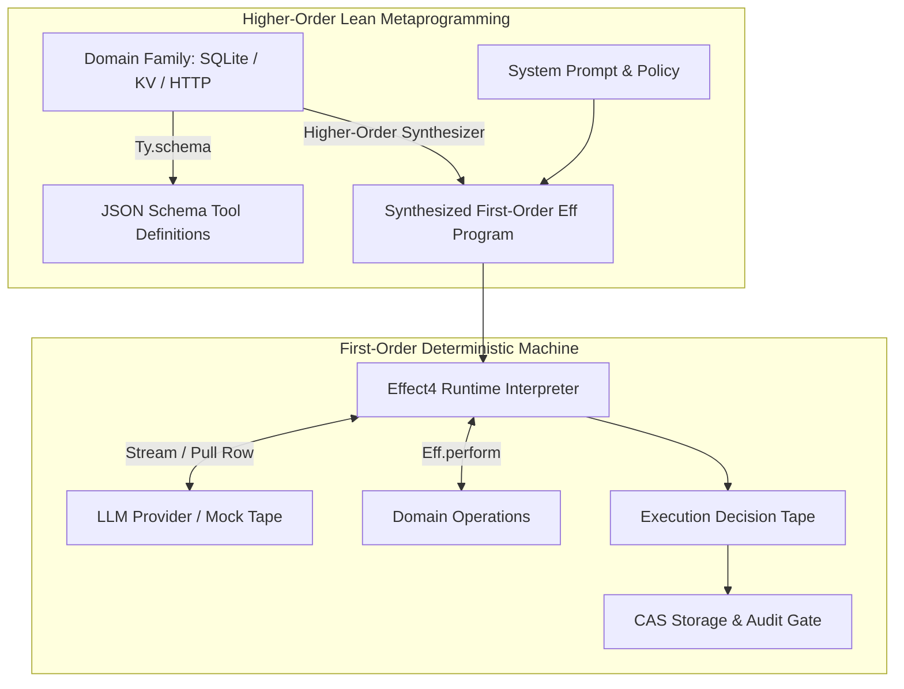
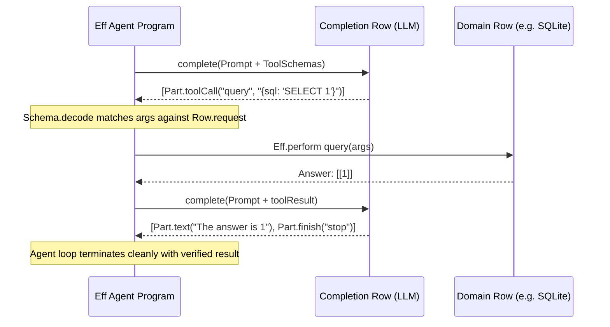

# Stream Semantics, LLM Completions, and Higher-Order Agent Synthesis
## Architectural Specification and Formalization Contract

**Status:** Proposed Specification · **Date:** 2026-09-10  
**Authority Reference:** `AGENTS.md`, `docs/ARCHITECTURE.md`, `docs/DESIGN-BASIS.md` (DB-01–DB-15), `docs/DESIGN-ISSUES.md` (DI-11, DI-15, DI-65)  
**Related Documents:** `docs/research/2026-09-10-completion-stream-handoff.md`, `docs/research/2026-09-09-foundation-stream-boundary.md`, `docs/research/2026-09-10-schema-at-boundaries.md`

---

## 1. Executive Context & Foundational Principles

This specification establishes the formal representation of **Stream semantics**, **LLM completions**, and **higher-order Agent synthesis** in `lean4-effect4`.

Modern software architecture relies ubiquitously on reactive streams, concurrent queues, and LLM completions. Rather than treating these as ad-hoc, untyped runtime shims, this specification provides a sound mathematical embedding that directly yields an **executable, deterministic, CAS-verifiable agent harness** from foundational Effect principles.

### The Three Separation Laws
1. **Canonical Programs Are First-Order Data (`AGENTS.md`):**
   Lean functions, host closures, JavaScript promises, and runtime state objects are **never** stored program syntax. All stored ASTs (`Eff`, `Ty`, `Val`, `Row`) are first-order inductive data.
2. **The Completion is an External Row, Not an AST Constructor:**
   An LLM completion is an asynchronous, non-deterministic observation. It is modeled as an **external `Row`** in a provider-agnostic `Family`. Non-deterministic responses are captured onto execution decision tapes (`RunDecision.answerAsync`) for deterministic CAS replay.
3. **Higher-Order Metaprograms Are Synthesizers, Not Runtime Closures:**
   Higher-order Lean functions operate at elaboration/compile time. They act as **verified compilers** that mechanically project domain service specifications (`Family`) into LLM tool schemas (via `Ty.schema`) and emit first-order `Eff` agent loops.



---

## 2. Stream & Pull Protocol Specification

### 2.1 The Pull Contract: Coalgebraic Iteration (DI-11)

In `vendor/effect-4.0.0-rc.112/src/Pull.ts:40-42`, a pull is defined as:
```ts
type Pull<A, E = never, Done = void, R = never> = Effect<A, E | Cause.Done<Done>, R>
```
Effect's runtime carries the `Done` signal through the error channel to allow low-level stream combinators to distinguish terminal stream completion from failures.

In Effect4's first-order algebra, we do **not** pollute `Err` with a `Done` constructor. Instead, a stream pull is modeled coalgebraically:
$$\text{pull} : \text{Handle} \to \text{Effect} \, (\text{Option} \, (\text{List } \alpha))$$
where:
- `some (head :: tail)`: Yields a non-empty chunk of emitted elements.
- `none`: Signals clean, normal termination of the stream.
- `fail e`: Represents a typed domain error.
- `die defect`: Represents an unhandled runtime defect.

### 2.2 Scope Lifecycle & Resource Guarantees

A stream pull is an **opened cursor**, not an immutable stream description. Opening a stream requires acquiring a capability inside an active `Scope` (`Stream.ts:19223-19225`):
1. **Acquisition:** Calling the `stream` row allocates a typed `external` handle (`HandleKind.external`) within the current fiber's `Scope`.
2. **Pulling:** The consumer performs `pull` operations against the handle.
3. **Teardown:** When the enclosing `Scope` closes (whether by completion, early termination, timeout, or fiber interruption), the scope's registered finalizers execute, closing underlying network connections or OS handles.

```lean
def pullRow (name : String) (elemTy : Ty) (errTy : Ty) : Row :=
  { name := s!"{name}.pull"
  , spelling := "pull"
  , shape := .method
  , kind := .async
  , registration := .external
  , request := .handle s!"{name}-pull"
  , answer := .option (.list elemTy)
  , error := errTy
  , requires := []
  , cite := "vendor/effect-4.0.0-rc.112/src/Pull.ts:40-42; Stream.ts:122-123" }
```

### 2.3 The Queue Boundary: Mechanism vs. Specification

In rc.112 (`Queue.ts:345-360`), queues manage internal concurrency buffering (rendezvous, sliding, dropping, capacity backpressure).
- **Rule:** Queues are an **internal handler mechanism**, never an exposed AST primitive or protocol invariant.
- A sequential stream pipeline does **not** allocate queues or background fibers.
- When explicit concurrent buffering is required (e.g., decoupling a fast network producer from a slow LLM consumer), the handler or adapter introduces a queue without altering the `pull` protocol seen by the program.

---

## 3. The Completion Family Specification

### 3.1 The Part Alphabet

The completion stream decomposes into an eighteen-tag streaming alphabet (`Response.ts:308-330`) assembled into a ten-tag non-streaming alphabet (`Response.ts:227-240`).

```lean
namespace Effect4.Program.Packages.Completion

/-- The eighteen stream part constructors from rc.112 Response.ts. -/
inductive PartTag where
  | textStart | textDelta | textEnd
  | reasoningStart | reasoningDelta | reasoningEnd
  | toolParamsStart | toolParamsDelta | toolParamsEnd
  | toolCall | toolResult | toolApprovalRequest
  | file | sourceDocument | sourceUrl
  | responseMetadata | finish | error
deriving DecidableEq, Repr

/-- The eight finish reasons from rc.112 Response.ts:2341-2350. -/
inductive FinishReason where
  | stop | length | contentFilter | toolCalls
  | error | pause | other | unknown
deriving DecidableEq, Repr
```

### 3.2 First-Order Representation via `Ty.lit` and `Ty.prod`

Using Ticket T-02's literal types (`Ty.lit`) and DB-15 pairs (`Ty.prod`), each part maps to a precise canonical `Ty`:

```lean
def finishReasonTy : Ty :=
  Ty.unionOf [ .lit "stop", .lit "length", .lit "contentFilter"
             , .lit "toolCalls", .lit "error", .lit "pause"
             , .lit "other", .lit "unknown" ]

def textDeltaTy : Ty :=
  .prod (.lit "text-delta") (.prod .string .string) -- (id, delta)

def toolCallTy : Ty :=
  .prod (.lit "tool-call") (.prod .string (.prod .string .string)) -- (id, name, paramsJson)

def finishTy : Ty :=
  .prod (.lit "finish") (.prod finishReasonTy .string) -- (reason, usageJson)

def streamPartTy : Ty :=
  Ty.unionOf [ textDeltaTy, toolCallTy, finishTy, ... ]
```

### 3.3 The Completion `RowTable`

The completion package exposes three primitive operations:

| Row | Spelling | Kind | Request | Answer | Error | Purpose |
|---|---|---|---|---|---|---|
| `complete` | `generateText` | `.async` | `providerOptionsTy` | `.list partTy` | `aiErrorTy` | One-shot text/object completion |
| `stream` | `streamText` | `.async` | `providerOptionsTy` | `.handle "completion-pull"` | `aiErrorTy` | Open a streaming pull cursor |
| `pull` | `pull` | `.async` | `.handle "completion-pull"` | `.option (.list streamPartTy)` | `aiErrorTy` | Pull next stream chunk |

---

## 4. Higher-Order Agent Synthesis: Compiling Algebra to `Eff`

A core architectural strength of Lean 4 is the ability to write **constructive metaprograms** that synthesize first-order `Eff` programs.

### 4.1 Automatic Tool Schema Reflection

Every capability exposed to an LLM is an Effect `Row`. Because Ticket T-03 introduces `Ty.schema : Ty → Representation`, Lean can mechanically derive the tool's JSON Schema from the row's request type:

```lean
/-- Extract a tool definition for an LLM from an Effect4 Row. -/
def Row.toToolDefinition (row : Row) : ToolDefinition :=
  { name := row.name
  , description := s!"Operation {row.spelling} ({row.cite})"
  , parametersSchema := Ty.schema row.request }
```

### 4.2 The Synthesized Agent Loop

An Agent Harness is an `Eff` fixed-point program generated by a Lean function:
```lean
def mkAgentLoop (tools : RowTable) (maxTurns : Nat) : Eff Op
```

The synthesized program performs the following cycle entirely within the certified `Eff` semantics:
1. **Prompt & Completion:** Performs `complete` (or `stream` + `pull`) with the current history and tool schemas.
2. **Part Inspection:** Recursively pattern matches the returned `List Part`:
   - If `text`: Appends content to the assistant message accumulator.
   - If `tool-call(id, name, argsJson)`:
     1. Dispatches `name` against `tools`.
     2. Validates `argsJson` against `row.request` using `Ty.decode`.
     3. If validation fails, synthesizes a `toolResult(id, "Validation Error: ...")` and continues loop.
     4. If validation succeeds, executes `Eff.perform row`, captures exit (handling errors gracefully), and packages result into `toolResult(id, resultJson)`.
3. **Termination Check:** If `Part.finish` matches `FinishReason.stop` with no pending tool calls, returns final text. If `maxTurns` is reached, gracefully parks with a frontier reason.



---

## 5. Verification, Testing & Conformance Strategy

### 5.1 Protocol LTS Formalization
In `Effect4.Program.Packages.Completion`, we formalize a finite labeled transition system (LTS) modeling chunk sequence legality:
```lean
inductive StreamState where
  | initial
  | inText (id : String)
  | inReasoning (id : String)
  | inTool (id : String)
  | completed
  | faulted

def StreamState.step : StreamState → PartTag → Option StreamState
```
- **Theorem (`assemble_total`):** For any sequence of `StreamPart` accepted by `StreamState.step`, `assemble : List StreamPart → List Part` is total and terminating.
- **Law (`stream_complete_equiv`):** Replaying a complete tape yields the same final values as assembling the pulled stream tape:
  $$\text{assemble} \, (\text{drain} \, (\text{stream } p)) \equiv \text{complete } p$$

### 5.2 Deterministic Replay Batteries
To test stream and completion semantics without live API keys:
1. **Mock Tapes (`Test/fixtures/tapes/completion-*.jsonl`):** Record exact stream part sequences.
2. **Replay Gate (`Api.replay`):** Execute the agent loop against the taped completion row and assert byte-for-byte agreement on final values, fiber schedules, and generated tool calls.

---

## 6. Phased Implementation Roadmap

```
+-------------------------------------------------------------------------------+
| PHASE A: Foundation Pre-requisites (Ticket T-03)                              |
| 1. Implement S-1: `Ty.schema : Ty → Representation`                           |
| 2. Implement S-2: `EffTy.document` and `Row.document`                         |
| 3. Prove retraction law: `ofSchema (schema t) = some t`                       |
+-------------------------------------------------------------------------------+
                                       │
                                       ▼
+-------------------------------------------------------------------------------+
| PHASE B: Completion Family & Stream Protocol                                  |
| 1. Create `src/Effect4/Program/Packages/Completion.lean`                      |
| 2. Define `PartTag`, `FinishReason`, `streamPartTy`, and `completion` table   |
| 3. Formalize `StreamState.step` LTS and prove `assemble_total`                |
+-------------------------------------------------------------------------------+
                                       │
                                       ▼
+-------------------------------------------------------------------------------+
| PHASE C: Higher-Order Agent Synthesizer                                       |
| 1. Implement `Row.toToolDefinition` using `Ty.schema`                         |
| 2. Implement `mkAgentLoop : RowTable → Nat → Eff Op`                          |
| 3. Add replay battery with taped tool-calling traces                          |
| 4. Extend `check-truth.sh` differential against rc.112                        |
+-------------------------------------------------------------------------------+
```

### Concluding Invariant
Under this specification, an "AI Agent" is neither magic nor an external framework. It is **an ordinary, verified, content-addressed `Eff` program** whose inputs, outputs, and side-effects are governed by the same mathematical laws that audit the rest of the Effect4 estate.
