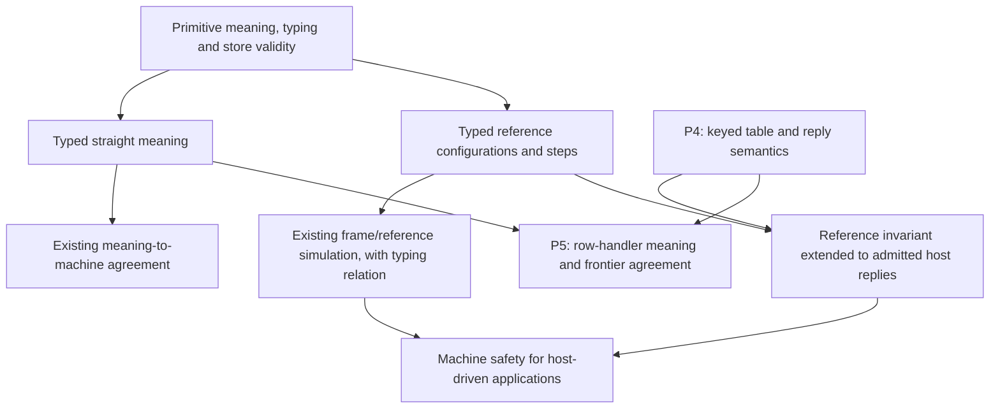

# Dogfood conclusions: corrections and the next core repair contract

Reviewed 2026-09-16 at `bc47ec580db21810db766094d78a9532ed625489`, with the three dogfood batteries and their lane changes present but unintegrated. This reviews the [applied-findings note](/Users/pooks/Dev/lean4-effect4/docs/research/2026-09-16-dogfood-findings-applied.md) and the three underlying reviews. It refines the [core repair specification](/Users/pooks/Dev/lean4-effect4/docs/research/2026-09-15-core-algebra-repair-spec.md), without ratifying new decisions, freezing theorem statements or implementing repairs. The tracked registers and contracts retain authority.

## 1. Verdict

The exercise justifies the direction: simplify invocation, make identities distinct from numbers, repair layer execution, provide usable option operations, and connect proofs to host-driven concurrent applications. It also exposes repeated fixture definitions and gaps in the verification workflow. Those are useful findings.

Its framing is wrong. The finite agreements do not establish that “the language's meaning was never wrong,” and a fresh counterexample shows a real program-result disagreement with the pinned target. A distinction between core, representation and observation is useful for assigning ownership; it cannot exempt observable behavior from the semantic contract.

The right objective is **one stated meaning for each admitted operation and construct, with checked connections between representations and execution routes**. Tests discover missing premises and incorrect rules. Proofs then cover the selected classes of programs. Neither a larger corpus nor a larger list of theorem names substitutes for those connections.

## 2. The layer discrepancy changes an answer

I built a small, well-typed program using existing constructors:

1. Build one service through a singleton `mergeAll`. Its builder returns its current fiber identity.
2. In the provided body, read that service and the body's current fiber identity.
3. Return whether the two identities are equal.

| Execution | Answer |
| --- | --- |
| Current Lean machine | `false` |
| Exact printer output, run on Effect 4.0.0-rc.112 | `true` |

The program passes the core type checker and exact print/read control. Its printed TypeScript passes strict checking. The host expression was generated directly by `Api.printDecl`; it was not rewritten into an easier host program. The host run bypasses the schedule recorder. The [source, generated module and logs](/Users/pooks/Dev/lean4-effect4/docs/research/2026-09-16-dogfood-conclusions-review-evidence/README.md) retain the reproduction.

This is stronger than comparing allocation numbers. Consistent renaming preserves equality: it cannot turn two distinct identities into one. Giving identities an opaque type is still necessary, but does not repair this result. Nor can a schedule reducer repair it.

The machine [forks the singleton builder](/Users/pooks/Dev/lean4-effect4/src/Effect4/Program/Compile.lean:1177). The host's `forEach` [uses sequential execution at concurrency one](/Users/pooks/Dev/lean4-effect4/vendor/effect-4.0.0-rc.112/src/internal/effect.ts:4680). Repair the layer execution rule against the selected target profile and its stated observations. Effect remains a target profile, not the semantic owner of every possible Eff interpretation.

The repair contract must cover empty, singleton and multiple merges; pure, effectful and mixed children; nested merges; shared versus fresh builds; failures; cancellation; and cleanup. At minimum, assert identity relationships, returned service values, build multiplicity and cleanup multiplicity, not merely a fiber-count snapshot. The identity witness must remain after the identity type changes. The previously known scope-close and loop-reentry questions remain open; the two unrun briefs supply no evidence about them.

This also explains why a supposedly harmless trace difference deserves investigation: a program can observe the changed scheduling context through identity, cancellation or resource lifetime. A proposed normalization must justify why it preserves the declared observations; it cannot simply erase the red column.

## 3. Correct the evidence boundary

The counts describe different populations and different checks.

| Claim | Supported conclusion |
| --- | --- |
| 20 programs through the host lane | The retained manifest grew from 34 to 54 programs. All 20 added cases agree on exits and synchronous exits; only 8 agree on schedules. Twelve schedule disagreements remain. |
| Every store agrees on the host | The host comparison reports exits, schedules and synchronous results. It has no whole-store comparison column. A returned counter is evidence about that counter, not every internal store. |
| 61 engine programs with no divergences | The retained engine log covers 61 total golden programs, including 13 additions. It reports 488 total program/tape executions and 24,156 projection comparisons. The printed multiplication sign does not mean 61 times 488 executions. |
| The engine exercised the cache's host interaction | Twelve new row-free cases complete; the row-using cache golden reaches a frontier. The engine API does not supply the row table and keyed external replies needed for that application run. |
| 37 application programs form the release inventory | There is no mechanically joined inventory establishing that number across batteries, variants, inputs and lanes. A program definition, a parameter instantiation and a run under a particular tape are different units. |
| All three briefs received the same verification | The first two reviews explicitly correct missing formal host/type/engine lanes. Their selected probes are useful but do not replace those lanes. The third retained substantially stronger evidence. |

I independently recomputed the truth-lane counts from the current result and the committed manifest; the [summary](/Users/pooks/Dev/lean4-effect4/docs/research/2026-09-16-dogfood-conclusions-review-evidence/truth-evidence-summary.json) labels them as retained evidence, not a fresh lane run. The [retained engine log](/Users/pooks/Dev/lean4-effect4/docs/research/2026-09-15-dogfood-3-evidence/log-dune-test-engine.txt:1247) supplies its totals; the [counter](/Users/pooks/Dev/lean4-effect4/ocaml/engine/test/test_diff.ml:187) increments once per program/tape execution. Its projection is a defined comparison surface, not every possible property of the engines or an external-host equivalence proof. The same log records a failing inventory-count assertion, so zero divergences must not be reported as an entirely green engine command.

The queue's frontier control is valuable but narrower than “P5 confirmed.” It constructs the early state through the legacy answer route, then supplies a later answer through the keyed session. Several refusal guards compare the reference store, not the entire session. Rebuild this example entirely through keyed calls under P4, and check refused submissions leave the complete session unchanged. P5 still needs its handler meaning, state-retaining frontier carrier, tape-consumption relation and sufficient-budget premises.

## 4. Simplify invocation, with an actual migration

Retiring `callback` is a good simplification. Its justification needs correction: it is **currently produced by the reader**, not unreachable from printed trees. Lean's [row reader](/Users/pooks/Dev/lean4-effect4/src/Effect4/Codegen/Read.lean:175) chooses `callback` for asynchronous rows; the [readable predicate](/Users/pooks/Dev/lean4-effect4/src/Effect4/Codegen/Read.lean:753) excludes asynchronous `perform` and accepts asynchronous `callback`. The TypeScript reader makes the same choice.

The existing [invocation theorem](/Users/pooks/Dev/lean4-effect4/src/Effect4/Laws/Program/Invocation.lean:45) establishes identical compiled code at the same point and fuel for external operations or asynchronous rows. That is a strong local reason to remove the spelling. It is not a theorem that every arbitrary callback, recursive migration, target text and wire representation is interchangeable.

The finite controls in this review show that a printed `callback sleep` reads back as `callback`, a printed `perform sleep` also reads back as `callback`, and their stored bytes differ. Therefore:

- Change the canonical reader result, readable-domain rule, generated consumers and round-trip proofs together.
- Use the existing local equality to justify recursive migration over the admitted domain. Account for rejected synchronous callbacks explicitly; do not silently broaden the theorem premise.
- Retire `callback` and `yieldError` under the proposed compatibility change. Reserve their retired tags. No replacement constructor is needed.
- Preserve exact old fixtures before migration. For trees containing retired constructors, require old-format refusal and behavior checks of the migrated tree. New bytes and digests are expected.
- Promise byte stability only for retained trees whose encoding remains unchanged. Schema-qualified addresses have the additional boundary already identified in the core specification.

The applied note's promise that all application bytes stay fixed under these retirements is impossible: all three batteries contain callbacks. Length checks, round trips and hash values written in comments are not an independently retained byte baseline. They can all remain green while encoder and decoder change together.

## 5. Add the smallest useful option interface

The cache demonstrates a concrete expressiveness gap: it cannot use the optional value from `get` to decide a branch. The actual [cache program](/Users/pooks/Dev/lean4-effect4/Test/Dogfood/SessionCache.lean:100) substitutes `has` and never consumes a fetched value; it does not execute `get` followed by `has`. Its retained shared tape contains one creation, three existence queries and two writes. Adding option operations would allow a value-consuming lookup in one request. It does not establish a request-count saving over that existing six-request workload. The fifth brief did not run, so “needed three times” should distinguish exercised evidence from predicted reuse.

Two pure atoms are a reasonable first extension, with a contract before implementation:

| Operation | Equations and typing obligation |
| --- | --- |
| `isSome : option A → bool` | `isSome none = false`; `isSome (some v) = true`. |
| Defaulting, initially `option A × A → A` | `getOrElse none d = d`; `getOrElse (some v) d = v`. The selected result is typed and valid in the current store. |

The same-type default is the smallest proposal; if mixed defaults are needed, explicitly select `A ∪ B` and prove its membership relation. Do not leave inference behavior implicit.

There is a target boundary: core [term arguments evaluate eagerly](/Users/pooks/Dev/lean4-effect4/src/Effect4/Program/Native.lean:83), while Effect's `Option.getOrElse` accepts a lazy fallback. The fresh host probe confirms that `Some` does not call the fallback and `None` calls it once. Printing a thunk is sufficient only for the admitted pure, total term fragment with a checked value correspondence. It does not justify reading an arbitrary effectful, throwing or diverging host callback as a core term.

State that limitation in the reader's admission rule. `isSome` also does not automatically refine the variable's type inside a branch. These two atoms are not a general option case construct with a bound payload and an effectful fallback. Add that larger feature only if a concrete use case requires it.

Acceptance should include a cache hit and miss using one lookup each, consuming the returned value without a second existence query. Compare equivalent value-consuming programs and inputs before claiming a request-count improvement. A `get` plus `has` workaround would introduce both another request and a race between the answers, but that is a prospective comparison, not the measured dogfood workload. Add nested option/unit/handle cases so the new atoms respect the existing representation and validity rules.

## 6. Keep two connected proof tracks

Moving attention toward running concurrent applications is right. Treating the current reference theorem as if it already covered their supplied host rows is wrong. [run_eq_ref](/Users/pooks/Dev/lean4-effect4/src/Effect4/Laws/Program/RuntimeR.lean:197) explicitly fixes the empty table and no external answers. Its source names the missing registration, conversion/allocation, prepared-answer and evaluator-selection work. Quantifying over every syntax tree does not supply those missing execution inputs.

Also correct “no sub-program is straight.” No whole application is in `Straight`; the queue's [job finalizer](/Users/pooks/Dev/lean4-effect4/Test/Dogfood/JobQueue.lean:80) uses only straight constructors. Its separate `qStraight` replaces the host call and is a surrogate control, not a proof of the application. Constructor occurrence counts do not measure proof coverage.

The dependency plan should have two connected tracks:

This is an obligation graph, not a report that the new edges are proved.

### 6.1 Primitive and algebraic meaning

Retain the straight meaning proof. It establishes that composing correctly typed primitive operations produces correctly typed, valid values, retains state through failure, and never relies on an internal malformed-value fallback. Store growth is part of the induction. Its result can transfer through the existing meaning agreement for that fragment.

This is how the algebra gains substance: `interpret_pinned` fixes an interpreter once all primitive meanings are fixed, and the typing/validity theorem constrains those meanings under composition. Deleting this track because whole applications contain forks would discard the foundation the broader invariant needs.

### 6.2 Reference configuration safety

First settle what the error type promises. The existing [checked counterexample](/Users/pooks/Dev/lean4-effect4/Test/Program/CatchIfContract.lean:108) types a catch of `A` at error `B`, runs to `[Fail B, Fail A]`, and checks that this cause is not admitted at `B`. I re-ran that battery successfully. DI-17 deliberately calls the narrower type a target-typing fidelity claim and gives its semantic lemma a `SingleFail` premise. This is a documented limitation, not a newly discovered implementation regression. But it directly contradicts an unconditional theorem that every failure of every well-typed program inhabits its advertised error column.

For the stronger guarantee now sought, choose one: keep a conservative semantic error bound; permit narrowing only when a proved admission condition ensures the required single-failure property; or explicitly distinguish host-inferred typing from the stronger semantic judgment. Prefer the first two if the objective is one useful, trustworthy application type. A hand-written `SingleFail` assumption without a proof for the admitted programs merely relocates the gap. Changing this boundary requires an explicit amendment to the existing ruling, not a quiet weakening of the planned theorem.

Then define a proof relation over **existing** reference configurations. It must relate the program's typing to environments, continuations, services, stores, allocated handles, fiber result/error types, and pending requests. Reuse `FitsWith`, `FitsIn` and allocation growth where applicable. Do not introduce another runtime program representation or a second checker.

Candidate obligations, to falsify before freezing:

1. Loading an admitted program in a well-typed environment/store establishes the relation.
2. Each internal reference step and each permitted decision preserves it, possibly extending the allocation/fiber typing world.
3. An admitted keyed reply matches the outstanding request and its answer/error type before conversion and allocation. A refused submission leaves the session unchanged.
4. Every reachable exited fiber has its recorded answer/error type; every reached continuation receives a valid value of its binder type.
5. Fuel exhaustion and missing replies remain live frontiers with their state and pending work; malformed-internal-value fallback is unreachable under the premises.

This is safety, not universal termination or fairness. Loops may continue, a reply may never arrive, and an invalid external decision may be refused. Those outcomes must stay distinct from typed failures.

An important missing relation is the fiber typing world: current [Val.hasTy at fiberOf](/Users/pooks/Dev/lean4-effect4/src/Effect4/Program/Typed.lean:54) only checks that a value is a fiber handle. It does not establish the referenced fiber's eventual success/error types. A proof of `await` needs that association, including handles nested in values. Stores also need the relevant invariants for Deferred completions, captured finalizers and service contexts. Preflight `acquireRelease`'s treatment of release failures against its error rule before including cleanup in the universal error guarantee; this is an investigation obligation, not a confirmed second defect.

Use the existing [step simulation and hooks](/Users/pooks/Dev/lean4-effect4/src/Effect4/Laws/Machine/Book.lean:622) to carry the invariant to the frame machine, showing how related states carry related typing worlds. Endpoint equality alone cannot establish safety at every intermediate state, especially when a handler can hide an internal defect.

Prove the native/empty-table part first if it provides an independently useful increment. Then extend the reference and its simulation through P4's table and keyed-reply semantics before claiming coverage of the actual queue and cache. Do not dispatch a theorem that assumes the missing bridge already exists. P5 remains the separate algebraic row-handler connection; operational type safety does not replace it.

## 7. Reduce duplication in automation and authoring

The dogfood program definitions now appear in the [battery](/Users/pooks/Dev/lean4-effect4/Test/Dogfood/SessionCache.lean), [truth registry](/Users/pooks/Dev/lean4-effect4/harness/truth/Truth.lean) and [OCaml golden registry](/Users/pooks/Dev/lean4-effect4/src/OCaml5/Eff/Goldens.lean). A one-time comparison of copies does not stop later drift. This is a direct instance of the problem the repair is meant to remove.

Choose one fixture-definition owner consumed by the existing generators and batteries. Keep independent expected results and independent target execution. A fixture can be the same input on all faces without deriving its expected answer from the implementation under test. Do not introduce an application dependency on the test root.

A thin `check-dogfood` should invoke existing lanes and join their receipts. Each run identity includes exact program content, row-table/profile identity, tape and budget. Each result distinguishes passed, mismatched, refused, timed out and not run. Required missing or refused lanes make the aggregate fail; any approved exclusions remain explicit. Derive counts from exact case identities and show additions/removals for review instead of moving three magic counts into one magic count.

The one-program-per-process rule is future work in the truth lane: its [current loop](/Users/pooks/Dev/lean4-effect4/harness/truth/run-truth.ts:760) runs the manifest's cases within one process. Reuse the corpus lane's isolation pattern rather than claim the amended protocol already implemented it. Process isolation limits hangs and cross-case allocation effects; it does not eliminate the need for consistent identity correspondence within a run.

For engine host support, expose the existing [keyed HostSession route](/Users/pooks/Dev/lean4-effect4/src/Effect4/Api/HostSession.lean) through the generated engine boundary. Do not create an OCaml-only interpretation of “answer decision” or reintroduce a positional answer queue. First specify which table, call identity, reply validation and frontier state cross that boundary. The current [engine signature](/Users/pooks/Dev/lean4-effect4/ocaml/engine/e4_engine.mli) is honest about its answerless run; extend the shared semantic owner, then generate the consumer.

Located typing errors should be explanations of the existing typing judgment, with acceptance agreeing with the current checker; two independently maintained typing algorithms would reintroduce drift. Named binders and layer references belong in elaboration to the existing IR. Reject unresolved references and test alpha-renaming and capture avoidance.

Derived retry and tagged-catch helpers deserve a small library, but a typing lemma alone is insufficient. Specify bounded attempt counts, which failures retry, delay placement, interruption behavior and finalizer multiplicity. `catchTag` must retain its declared combined-cause limitations. Reading an idiomatic spelling is permitted only when its expansion matches those rules. This provides ergonomics without new core constructors or a second meaning for each helper.

## 8. Corrections to “expected differences” and remaining decisions

- Different allocation numbers may be expected under an identity correspondence. Different equality relationships between identities are not.
- Logical versus uncontrolled wall-clock time requires the planned shared clock inputs. However, pinned rc.112's [default nonpositive sleep](/Users/pooks/Dev/lean4-effect4/vendor/effect-4.0.0-rc.112/src/internal/effect.ts:6055) returns `yieldNow`. “The host uses a zero-millisecond timer” is false for this path. Preserve zero sleep as a matched control; separately test the chosen TestClock driver.
- First-`Fail` selection in `catchIf` is matching behavior, not a discrepancy. Fresh host controls recover when the first failure matches and retain both failures when it does not. The existing Lean counterexample separately proves why unconditional error-type narrowing is unavailable; §6.2 names the decision needed for the stronger type guarantee.
- The previously reproduced `Ref.set` result-composition mismatch remains in the core specification. No new receipt repairs it. Keep the explicit target-result adapter decision alongside identity, unit and service-key repairs.

| Proposed addition | Review recommendation |
| --- | --- |
| D-C option atoms | Adopt the small pure interface with explicit typing, eager/lazy admission and validity obligations. |
| D-D callback retirement | Adopt, with reader migration, a recursive admitted-domain justification and changed-byte accounting. |
| D-E merged layers | Prioritize as a result-level target discrepancy; freeze behavior with the identity witness and build/cleanup controls before repair. |
| D-F engine replies | Adopt host-driven engine coverage through the existing keyed protocol; do not invent independent answer semantics. |
| D-G derived forms | Adopt a bounded library of expansions with behavioral laws and reader admission rules. |

These are recommendations. Earlier rulings should not be reopened merely because the new exercise rediscovers them. New rulings must still be recorded in their tracked owner before implementation.

## 9. Revised order and measurable completion

1. **Preserve and reconcile evidence.** Establish exact fixture/run identities, retain old bytes and inputs, correct lane status and remove fixture-copy drift. Add the layer result witness to the pending repair contract. Repair the previously identified checker false passes before relying on green output.
2. **Settle the semantic boundaries.** Record the new decisions and explicit target meanings. Keep opaque identity, unit, service binding, `Ref.set`, frontier state and stable-tag work together in the existing specification. Resolve the conflict between residual error typing and the proposed universal safety guarantee. Freeze option and layer behavior before their implementation.
3. **Land coherent vertical repairs.** Retire both invocation/failure spellings with the canonical readers and compatibility handling; repair identity/unit/services and layer execution with composition controls; add the small option interface. Follow existing slice boundaries rather than hiding unrelated changes in one patch. Each slice closes its own behavior and compatibility checks.
4. **Connect host execution.** Follow P4's migration-before-deletion order; move applications onto keyed inputs, extend the shared engine entry, and drive the target clock and observation reducer through declared inputs. Then the same applications can be compared under the same host interactions.
5. **Discharge the two proof tracks.** Primitive meaning safety and reference configuration safety share validity lemmas. Reference/table agreement blocks claims about host-row applications; P5 blocks claims connecting row-handler meaning and execution. Freeze exact statements only after counterexample review.
6. **Release with behavior, coverage and cost evidence.** Required lanes must run on the same named workloads, with every disagreement or exclusion visible. Re-run the two missing briefs after the relevant repairs; do not count anticipated findings as observed evidence.

Completion is not “more guards passed.” It means the layer identity result agrees, each operation result can be used by its admitted continuations, invalid replies leave the session unchanged, retained payloads retain their promised bytes, retired payloads refuse, migrated applications retain the selected behavior, and the stated universal invariants compile at the existing axiom ceiling.

Keep the original specification's performance method: same workload and inputs, repeated measurements, explicit budgets, and review of regressions over the proposed threshold. No runtime cost should be added by proof-only structures. Measure request counts, fiber/build counts, wire size, execution cost and CI duration separately. The option improvement should enable a value-consuming lookup without a separate existence query; the layer repair should remove only builds/fibers disallowed by the selected semantics. Smaller counts alone are not correctness.

## 10. Verification and scope of this review

Fresh checks: the Lean finite layer/reader/byte controls; generated host execution; strict TypeScript checking of that program; strict checking and execution of the cause-selection and lazy-option controls; re-elaboration of the existing conditional-handler battery and its error-typing counterexample. All six final commands exit zero, including the host assertion that confirms the machine/host disagreement. The [evidence receipt](/Users/pooks/Dev/lean4-effect4/docs/research/2026-09-16-dogfood-conclusions-review-evidence/README.md) separates them from retained lane results.

No full build, full corpus lane, OCaml suite or CI run was performed. No new universal theorem or production repair is claimed. This review preserves the pre-existing dirty dogfood/lane files, adds isolated research evidence and a pointer in the prior specification, and does not change registers, baselines, expected answers or Git staging.
