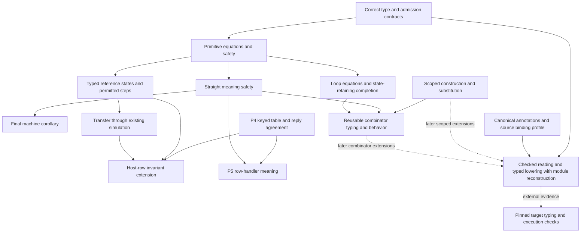

# Foundational language repair: implementation contract and delivery plan

**Ratified 2026-09-16 (evening).** The owner ratified the order and the rulings recorded as DI-79 to DI-90 in `docs/DESIGN-ISSUES.md` and summarized in `docs/STATE.md`. Where this text differs (the §3.6 substitution machinery, the §3.1 at-most-one summary, the §3.8 annotation grammar's parse round trip, the per-packet alphabet edits, the ingest engines), the register rows win. Read `docs/STATE.md` first.

This is the consolidated plan for making the existing language's types, primitive meanings, execution and external boundaries agree. It replaces the implementation ordering in the earlier research notes. It does not replace the tracked design registers, frozen contracts, architecture or generation map.

Prepared 2026-09-16 against `bc47ec580db21810db766094d78a9532ed625489`, with the existing unintegrated dogfood changes preserved. The [language-after-the-rulings note](/Users/pooks/Dev/lean4-effect4/docs/research/2026-09-16-language-after-the-rulings.md) supplies the proposed direction; the [core specification](/Users/pooks/Dev/lean4-effect4/docs/research/2026-09-15-core-algebra-repair-spec.md) supplies the existing behavioral and performance constraints. This plan resolves their conflicts below. Production implementation began with the five core commits through `812370b`; the current checked progress is in `foundational-language-implementation/progress.md`. Revised after [dogfood 6](/Users/pooks/Dev/lean4-effect4/docs/research/2026-09-16-dogfood-6-effect-machine-receipt.md) and the [end-state proposal](/Users/pooks/Dev/lean4-effect4/docs/research/2026-09-16-core-goals-and-end-state.md); this revision governs where those proposals differ.

Revised again after the [adversarial review disposition](/Users/pooks/Dev/lean4-effect4/docs/research/2026-09-16-foundational-language-plan-review-response.md). Every F1–F14/A1–A10 item has a recorded decision and acceptance control there. Its fresh evidence corrects several proposed remedies; this remains the single implementation plan.

Three scope/behavior decisions are explicitly confirmed and recorded in the tracked register: **DI-17: every error in a cause must fit the declared error type**; **DI-63: cleanup keeps an opaque view of the enclosing scope's closing exit**; **DI-78: include safe optional-value elimination, declared accumulator types and iteration returning its final value**. The other choices below are concrete implementation recommendations carried forward or refined here, not a claim that the attachment's “assume every ruling ratified” premise was an actual ruling. The first packet records their final contract wording in the existing owners; it does not reopen those confirmed requirements. DI-78 approves the capabilities, while §3.8 specifies the recommended representation to validate before implementation.

### Scope clarified by the owner

The deliverable is a general, ergonomic, proof-backed Eff authoring API. **A statechart library is not a deliverable.** Dogfooding supplies demanding examples and counterexamples; it does not choose the product's abstraction vocabulary. Do not add `Statechart.verified`, a statechart planner, topology validation, or a production statechart compiler to this release. The owner subsequently required verification and disposal of the incoming dogfood snapshot. That disposal is complete; retain compact findings and focused construct controls, not the snapshot or a replacement application estate.

Authors should compose effectful operations using named values, reusable higher-order builders, data access, iteration, error handling, services, resource scopes and concurrent work. Those conveniences elaborate to the existing first-order `Eff`. A callback used to construct syntax is different from a runtime closure stored in syntax. Arbitrary JavaScript closures and every Effect package API are not automatically in the admitted profile; supported rows and pure terms need explicit representation contracts. The goal is broad reusable constructs, with precise boundaries and located refusals when a program exceeds them.

### What the new dogfood changes

| Finding | Consequence for the general language plan |
| --- | --- |
| A terminating repeat increments to three in the prototype planner but only to one in its compiled program; both are well typed | Replace guessed unrolling limits with the existing loop form and prove generic iteration laws. Type safety and machine agreement do not establish an abstraction's promised behavior. |
| A builder inspecting its supplied syntax produces one in the planner and two in compiled code | Elaborate callbacks once into scoped terms; prove renaming/substitution and compose those terms. Do not reapply author callbacks at unrelated binder positions. |
| A fixed-depth traversal silently loses a ninth nested state | Recursive authoring operations must traverse structurally or report a real admission limit. Totality of Lean definitions alone is not semantic completeness. This prototype defect is a negative example, not a request to build a statechart validator. |
| The same tag predicate breaks two emitted modules' type checks | Use the Boolean predicate shared by ordinary branches and conservative conditional error handling. No catch-specific second atom. |
| Large outputs repeat an unchanged body per input event | Require compact generic iteration and measure code-body duplication separately from unavoidable input-data size. |
| Reply application and later scheduling have distinct outcomes | Provide an explicit, bounded driving convenience; retain both the reply result and its later stopping reason. |

The [fresh evidence](/Users/pooks/Dev/lean4-effect4/docs/research/2026-09-16-foundational-language-dogfood6-evidence/README.md) banks the first three controls and checks the tag-predicate repair in isolation. Existing primitive progress and valid-step theorems already exist; reuse them. Existing `run_eq_ref` covers loops and forks at the empty table; the missing work is the specified safety/meaning connections, not the absence of any theorem about those forms.

## 1. The contract we are implementing

For an admitted program, a supplied context satisfying its requirements, valid initial state and permitted external decisions:

- Each primitive performs its specified state transition and returns its specified answer.
- Intermediate values supplied to continuations satisfy their types and allocation/identity validity conditions.
- Every successful result fits the answer type. Every typed failure reason fits the error type, including later reasons in a combined cause. Defects and interruptions remain distinct from typed failures.
- State changes before failure or a missing reply remain available. A frontier records unfinished work; it is not a failure or an input refusal.
- A compatible tape fixes one execution of the model. The language does not promise that all tapes choose the same execution, that every loop terminates, or that a host eventually replies.
- Serialization and printing preserve their stated representation relations. Effect and the generated engine satisfy separately stated execution boundaries, with their actual evidence grades.

“No internal fallback” excludes malformed terms, invalid handles and missing required services on admitted reachable executions. It does not exclude an explicitly programmed defect, interruption, failed external operation or legitimate suspension. Input refusal is a boundary response; a rejected submission leaves the running session unchanged.

The contract is stronger than a typed final answer. A malformed internal value must not become acceptable merely because a later handler hides the defect it caused.

### Shared vocabulary and owners

Use the vocabulary of [DESIGN-MAP](/Users/pooks/Dev/lean4-effect4/docs/DESIGN-MAP.md), with the following precise meanings in this work. Incorporate these clarifications there during the documentation packet; do not create another glossary.

| Term | Meaning in this plan | Existing owner |
| --- | --- | --- |
| Program | The one stored first-order `Eff` tree, including its term/action/layer subtrees | `Program/Eff.lean` |
| Type | Answer, error and service-requirement promises, plus value membership | `Program/Ty.lean`, `Typing.lean`, `Typed.lean`, `ErrorImage.lean` |
| Meaning | The language's specified operation/decision rules; their compositional algebraic interpretation on a proved fragment | Existing primitive/store rules; `DenoteR` for the implemented reference account; `Denote` for the connected fragment interpretation |
| Reference execution | The term representation run through the decision loop; external-table extension remains P4 work | `DenoteR`, `EvaluateR`, `Sched` |
| Machine execution | Compiled frames run by the same scheduler machinery | `Program/Compile.lean`, `Machine/*` |
| Admission | Checks that a program, context, request or reply meets a stated profile before its guarantees apply | `Program/Admission`, `Admit`, `Api/HostSession` |
| Observation | The explicitly compared result, state projection, identity relation and events | Existing runtime observations and truth-lane reducer |
| Target profile | The pinned external realization, admitted types/operations and permitted representation adaptations | Existing codegen profile, row bindings and target tests |
| Authoring combinator | A reusable builder producing existing terms/programs, with scope, typing and behavior laws in the separate Laws graph | A small `Program/Authoring` module beside the current carrier; no runtime dependency on Laws |
| Compatibility | A stated relation between retained old and new representations, separately from changes in meaning | `Store/Shape`, canonical codecs, compatibility policy/baselines |

The proof carrier `Effects.Program` is not another stored language. A proof typing world is not another runtime store. A nonpersisted authoring builder is not another semantic owner. Those distinctions justify necessary views without allowing duplicate models to develop independent behavior.

## 2. Correct the mathematical explanation

Three obligations must remain separate:

1. **Meaning:** a reference read returns the current cell value; a write stores the supplied value; a rejected reply changes nothing. These are equations about behavior.
2. **Safety:** those operations, under their premises, return correctly typed and valid values and preserve the state invariants.
3. **Correspondence:** the machine, reference or target follows that meaning under the named relation and inputs.

An implementation of `refGet` that always returns zero can satisfy a natural-number typing theorem. It violates the read equation. Consequently, `meaning_typed` does not establish the primitive-operation equality premise of [interpret_pinned](/Users/pooks/Dev/lean4-effect4/.lake/packages/effects/Effects/Algebra/Universal.lean:243). That theorem characterizes an interpreter from its pure/bind laws **and exact operation agreement**. It already applies to the algebra's interpreter under its stated hypotheses; the new safety proof establishes an additional property of the concrete meanings.

[run_eq_meaning](/Users/pooks/Dev/lean4-effect4/src/Effect4/Laws/Program/Agreement/Machine.lean:1802) connects the straight fragment's final exit and stores at sufficient fuel. It does not equate traces or establish an unrestricted fixed-fuel bind law. [run_eq_ref](/Users/pooks/Dev/lean4-effect4/src/Effect4/Laws/Program/RuntimeR.lean:197) establishes internal agreement at the empty row table and with no external answers. It is not scheduler uniqueness or host equivalence. Checker agreement currently connects `effTy` with `HasTy`, not with all execution guarantees.

Syntax traversal, typing and bounded simulation are total. A represented program may loop or remain pending. Byte equality is representation equality, not decidable semantic equivalence. Decoding a changed byte may produce a different valid program; round trips do not imply that every changed byte refuses. A generated engine remains behind a compiler/extraction/runtime trust boundary until that boundary has its own proof. Generation removes a maintenance copy; it does not automatically prove execution equivalence.

The actual fragment connection is `Sched.denoteR_straight` in the DenoteR module, and its interpreted corollary `meaning_denoteR_straight`: they require Straight, sufficient translation depth and erasure of control markers/checkpoints. `Sched.meaning_via_rsig` is an injection/handler equation, not a whole-language meaning theorem; its fiber handler returns default answers without changing state and is explicitly a total placeholder, not a semantics. Preserve this distinction when extending the fragment. Reference clauses are the operational specification where implemented; the algebraic view proves a compositional account under its domain and observation. Neither becomes a competing behavior owner, nor does naming the reference erase the open table/reply work.

These corrections remove exaggerated claims without demanding a new algebra, a resumption-monad research project or a second evaluator.

## 3. Fixed behavioral choices

### 3.1 Every failure, with proved conditional handling

Retain `causeAdmits`'s all-reason fold and the existing recursive membership of typed `Cause` and `Exit`. Keep first-failure selection as the operational rule of `catchIf`; selection and membership answer different questions.

Amend DI-39 and DI-09 explicitly under the owner-confirmed DI-17 guarantee. Their unconditional printed-type residual cannot remain the admission rule. Preserve first-failure selection, the useful conditional residual theorem and tagged-catch authoring. Use one checker, with the following recommended precision rules:

```text
error(catchIf true body handler) = error(handler)
error(catchIf (tagIs tag binder) body handler)
    = diffTag tag error(body) join error(handler)
    when the canonical tagged-column and proved miss-exclusion checks succeed
error(catchIf predicate body handler) = error(body) join error(handler)
    otherwise
```

The literal-true equation concerns the form that consumes any typed failure; defects and interruptions without one remain outside E. Recognize only the canonical test on the selected failure binder, not an arbitrary term which happens to contain `tagIs`. A miss-exclusion check justifies that **every failure in the re-raised cause** belongs to the residual. Initially it has two proved routes: (a) every inhabited member of the supported, canonical error column has the caught tag, so a miss has no typed failures; or (b) a sound analysis bounds this computation's completed failure by at most one `Fail`. The first route retains useful narrowing for a `SqlError` row even when its reply contains two `SqlError` reasons. A mixed-column row with unrestricted replies uses the conservative bound.

The second route is a small checked summary over an explicit proved domain, not a new error type system: `zero`, `atMostOne`, `unknown`. Begin with direct success/failure, literal cause shape and the already proved sequential composition cases. Unproved constructs return `unknown`. Sequential alternatives use a maximum; operations that can append causes need capped addition, not Boolean OR. Races, parallel layers, pending finalizers, joined fibers and Deferred completion require their actual aggregation/state premises before receiving a narrower summary. Do not infer zero from `E = never` before proving the relevant execution typing property. State the bound for the analyzed computation's terminal failure; `exit body` may succeed with a multi-failure cause inside its value. Prove each precision-enabled case before it changes admission. The existing `SingleFail` means exactly one; split zero/one or reuse its at-most-one helper when applying the residual proof.

Independently, the hit branch can receive the selected **whole tagged error value** at `selTag tag E` under the closed tagged-column premises of §3.8. Multiplicity does not invalidate that hit refinement. This differs from `caseTag`, whose hit binder is the payload. Prove selected-value membership and validity once and reuse them; otherwise leave the binder at E. The miss-exclusion and binder checks are separate guarantees.

Normalize E before either filter. Check the predicate under E and the handler under the selected binder type; the ordinary answer/requirement joins stay unchanged. Retain §3.6's projection-through-union law, since the selected type may still contain several payload variants of the same tag. Strict-check the target's actual discriminant branch or a proved, profile-restricted local refinement wrapper; an arbitrary user-declared TypeScript type predicate is not evidence. Its runtime equation must be the existing tag test. Ordinary `tagIs` stays Boolean. Outside this proved profile preserve both the original binder and full joined error bound.

Preserve replies containing multiple correctly typed failures. One host Effect can fail with several reasons, and restricting external replies would not constrain native Deferred completions or scope finalization. No global one-failure envelope restriction is part of this repair. A future restricted row capability would need explicit adapter validation and a theorem; it is not needed for these local improvements.

The independent controls are `[Fail B, Fail A]` catching A, `[Fail A, Fail B]` catching A, two same-tag failures, one matching failure, a false predicate, and only defects/interruptions. Add two failing race entrants, failing body plus finalizer, multiple layer failures, a stored Deferred cause and an admitted multi-failure reply. Check every retained reason, not only the selected binder. Preserve the historical counterexample; its unsafe mixed-column case now widens. The fresh race and Straight witnesses in the remediation evidence refute the review's proposed summary table and its claim that every Straight computation has one failure.

At the target, compare the host's inferred error type by containment in the core's declared error bound. Continue the established answer and requirement comparisons. Record exact equality and strict containment separately. Reject missing type evidence, unsupported extraction and `any`-based acceptance. Apply this rule to the defined program-type relation, not a list of excused fixtures. Primitive row signatures and reply envelopes keep their stronger contracts. Type containment is a static comparison; runtime cause agreement still compares the retained payloads.

### 3.2 Resource cleanup: both the output and input contract

Require an `acquireRelease` release's error type to normalize to `never`: `r.error.normalize = .never`. Defects and interruption remain possible. Keep `onExit`'s different rule: it combines its body's and finalizer's typed errors. Do not silently convert a release's typed failure into a defect to rescue the old typing rule.

The resource binder retains the acquisition's answer type. The next binder is the **enclosing scope's actual closing exit**, not `Exit<acquisition answer, acquisition error>`. The fresh [preflight](/Users/pooks/Dev/lean4-effect4/docs/research/2026-09-16-foundational-language-plan-evidence/FoundationPreflight.lean) confirms both current defects, including a release typed to produce `option never` while its actual exit input yields `Some "x"`.

Introduce one dedicated `Ty.scopeExit` case over the existing `Val` exit carrier, preserving the binder positions and raw closing-exit information. It is an opaque view, not a general top type:

- The target spelling is `Exit.Exit<unknown, unknown>` at this callback boundary.
- Membership is `Val.hasTy v .scopeExit = (exitImage.ofVal v).isSome`: an existing represented exit, without a payload-type promise. Handle validity remains a separate invariant. Normalization keeps this distinct ground type; subtyping admits identity, ordinary `never` and union rules, with no implicit narrower exit/cause relation.
- Initially allow the existing failure/defect/interruption category predicates. Each means “contains a reason of this category”; a mixed cause may satisfy several. Their success-case result is false. Payload-producing `causeError` is refused for this type. Separate category-query admission from `causeInputError?`; adding this type to that shared error-extraction helper would accidentally admit the forbidden projection.
- No implicit conversion to `exitOf A E`, `causeOf E`, a resource value or an ordinary number. No unchecked cast at the target.
- Values arise from the existing scope-closing callback. Raw literals and external rows do not manufacture this type in the initial profile. The runtime validity relation still checks the actual value and any contained handles.
- Program-type and wire descriptions account for the new type tag. A public JSON codec must either have its own explicit supported-domain proof or report this opaque type as unsupported; do not claim the existing typed payload codecs cover it.

Controls: acquisition succeeds with a number while the body succeeds with a string, fails with a string, dies, or is interrupted; cleanup receives the real closing category. It can use its resource, but cannot infer the closing payload's type from the acquisition. Typed-error releases refuse, dying releases remain admitted, and combined body/cleanup defects retain the selected cause order. Check cleanup multiplicity on actual terminating closes; do not promise eventual cleanup for diverging finalizers.

### 3.3 Values, primitive answers and service identity

The default in this plan is that `refSet` answers unit, as `refUpdate` does; `refSetAndGet` remains the explicit value-returning operation. This intentionally changes the current core answer contract. Programs consuming the old returned reference must migrate to their saved reference or be refused, with named before/after cases. Update the row, state transition, equations, typing and target lowering together. Do not call this only a printer fix.

Unit has one target value: `undefined`. Normalize every producer whose **core answer is unit**, including native and external rows, before that value enters an option, pair, exit, fiber or service. A host `void` annotation alone is not evidence about the runtime value. Keep one operation-boundary lowering rule; no per-program casts or broad `void = undefined` observer exception.

`fiberId` is distinct from naturals and from fiber handles. Reuse the existing `Val` carrier, with a dedicated noncolliding identity tag/view assigned through the stable runtime-image owner. Do not reuse either existing identity image unchanged: `Value.fiberHandle` is a fiber handle, and the cause-internal `Value.fiberIdentity` has the same shape as `Exit.success(nat id)`. The host wrapper retains provenance and compares the underlying identity within the same run, not wrapper object identity. There is no arithmetic or numeric literal injection. One partial bijection, extended injectively as identities appear, relates identities across result values, causes, events and reply keys. Equal identities remain equal everywhere; ordinary numbers never enter the renaming map. Existing context-directed identity bytes inside causes may remain unchanged with explicit conversion to the same semantic identity.

Migrate all consumers in the same packet, including the compiler and reference `getId` routes, cause interruptors, interrupt collections, schema/protocol projections, and **Deferred.interrupt**, whose current continuation expects a natural. Test repeated wrapping, nested unions with naturals, fiber handles and `Exit<nat, never>`, the caller's interruption identity, and equal/different identities across layer builds. Identity provenance does not repair a different equality relationship between the two executions.

Service identity is the full key, not the carrier's shape. Generate declarations and imports from the existing key/type/row-binding inputs. Repeated declarations of one full key denote one service; two full keys with the same carrier remain distinct; conflicting carriers for one key refuse. Both module readers must understand the declarations emitted by the printer. The same binding description connects the package interface and adapter carrier; no program-specific header or oracle workaround owns that fact.

### 3.4 Layers, invocation and options

For the rc.112 target profile, a singleton merged effectful layer builds inline; a pure layer does not acquire an unnecessary build fiber. Repair both [compiler](/Users/pooks/Dev/lean4-effect4/src/Effect4/Program/Compile.lean:1177) and [reference](/Users/pooks/Dev/lean4-effect4/src/Effect4/Laws/Program/DenoteR.lean:442), and their existing correspondence clauses. Keep the checked identity-equality program that currently returns false in the model and true on the exact printed host program. Extend controls over arity 0/1/2/3, pure/effectful/mixed and nested children, sharing/freshness, failure, cancellation and cleanup. Match the stated behavior, not a hard-coded fiber count.

Retire `yieldError` and `callback`. `perform` is the invocation form and row kind selects its execution route. The current reader produces callbacks; update both canonical readers, readable admission and round-trip proofs as part of the retirement. Use the existing invocation equality on its admitted operation domain to justify recursive migration. Unsupported bare source expressions still refuse. Preserve old fixtures independently before changing them.

Add only two option atoms in this release:

```text
isSome : option A → bool
isSome none = false; isSome (some v) = true

getOrElse : option A × A → A
getOrElse none d = d; getOrElse (some v) d = v
```

These are eager pure core terms. The printed host thunk must contain only a term in the admitted pure, total fragment; arbitrary lazy callbacks are not admitted. Prove selected-value typing and validity from the same atom owner that supplies evaluation and typing. `isSome` does not add branch refinement or an effectful option case construct.

The cache acceptance case must consume a fetched value and decide hit/miss from that one lookup. Its old implementation used `has`, not `get` followed by `has`; no measured request reduction is claimed against that workload.

### 3.5 Host interaction and frontiers

Keep one path by which external answers enter execution: the existing keyed session and envelope validation. Pure, host-free run helpers may remain as thin conveniences with no answer queue. “One route” does not require applications to manually create a session for a closed arithmetic expression.

Follow the existing frozen P4 order: migrate the complete current host-using fixture set to keyed tapes; demonstrate the same declared observations; then remove the preloaded-answer route and every forwarding seam. Provide table-aware reference agreement and expose the stable session through generated OCaml. The engine must not grow its own answer interpretation.

The same run identity includes program bytes, row table/profile, initial inputs, tape and both compile/command budgets. Reply identity includes the recorded call association; never manufacture missing provenance from what replay expected. Test two outstanding calls answered in reversed arrival order, duplicate/wrong-key/session/table replies, cancellation and missing replies. Rejection leaves the complete session unchanged. Pending replies and insufficient fuel retain stores and outstanding work.

The host clock is controlled by the same explicit advance decisions. Zero sleep is a yield on the pinned default path. One reducer processes independently captured raw events, with one consistent identity relation and explicit stopping evidence. A process timeout is a harness result, never proof of language divergence or agreement.

### 3.6 General authoring contracts

The public surface should hide binder arithmetic and target bookkeeping. It should expose named values, sequencing, mapping, conditionals, typed data projections, iteration, catch/retry, resource use, scoped fork/join/race, and row-backed service calls. Reuse the existing forms and semantics; do not create one runtime per convenience.

**Binding and higher-order construction.** A construction callback receives scoped symbolic terms. Elaborate its result once at its declared scope; reject escaped/free variables and then compose by capture-avoiding renaming/substitution. Never require an author to count `.var` indices. Stored content contains existing `Term`/`Eff` data, without callbacks, hidden environments or retained builder objects. Callback purity and parametricity are not assumed from its Lean function type: only the checked produced syntax receives guarantees. Reusing a builder at different depths must instantiate that syntax, not call it again on different syntax and hope it behaves uniformly.

The substitution evaluation law needs a scoped-source premise (all variables in the declared environment), successful evaluation of substituted arguments, and the corresponding environment relation. Its typing law uses the current `termTy`/`effTy` judgment and a proved declared-bound relation. Do not assume exact inferred-type equality: substituting the literal "A" for a string variable inside `pair` refines the inferred field type to `lit "A"`. Preserve the binding or prove that the inferred result fits the declared bound; never silently widen the runtime value. A theorem without the scope premise is not ready to freeze. Validate shadowing, nested binders, captured outer values, repeated instantiation, and intentional out-of-scope references. Diagnostics report source positions but erase to the same admission result.

Binders are levels from the outermost environment. Reuse `Eff.weaken`, `termTy_weaken` and `effTy_weaken`. If bulk insertion is needed, specify `shift cut n` as insertion of n slots, moving levels ≥ cut. Specify instantiation as **removing** one bound slot: substitute a term scoped in the outer prefix at that level, decrement later levels, and transport it correctly under local binders. State the corresponding environment deletion/evaluation equation and the declared-bound typing law before coding it. A replacement that preserves the slot is a different operation; do not call both `subst`. Add only operations needed by actual builders. `Layer.effect` bodies are checked in the empty environment: capturing an outer variable across that boundary refuses at its authoring location. Weakening must not silently capture it.

**Data operations.** Keep products and tagged unions in their existing representation. Add named construction/access as views with a stated field layout. Permit `fst`/`snd` through a union only when every inhabited alternative is a product; join the projected types and prove evaluation membership/validity. An alternative that is a number must refuse. Do not equate arbitrary Schema objects with tuple encoding without a codec relation. The two option atoms retain §3.4's exact eager equations. Collection construction and elimination need their own small contract; `head : list A → A` cannot be total on an empty list for arbitrary A. No claim that three list destructors alone enable arbitrary lists: the current literals do not construct them.

**Error handling.** Derived tagged catch inherits the all-reason bound of §3.1. Retry counts actual attempts, stops or retries the stated typed errors, places delays explicitly, propagates defects/interruption, and respects resource ownership. Do not implement it by catching every cause or silently dropping later failures.

**Resources and concurrency.** Builders expose ownership rather than a collection of unexplained flags. The rc.112 readable forms of both `forkIn` and `forkScoped` require `daemon=true`; a scope still owns and cancels that child. Construct the canonical profile form and reject unsupported flag combinations without normalizing a semantically different core program. Immediate and deferred start remain distinct. A race builder specifies winner selection, loser interruption and cleanup, using the core's existing decisions. It does not promise a unique winner without those decisions.

**Rows and services.** A row declaration supplies the request/answer/error types, key, printer binding and adapter shape through their existing owners. Calling a supported row must not require a handwritten module header or a second host protocol. Unknown or unrepresentable packages refuse at that boundary; adding a package does not require adding an Eff constructor.

### 3.7 Iteration without another language

Reuse the existing loop machinery and retain `gen` for its existing control-flow role. DI-78 requires generalizing the stored loop to the single value-returning form in §3.8; the old unit-returning API becomes a derived specialization. Do not add procedures or a second program graph to cure code expansion. First prove the single-loop case with a body in the existing straight fragment, then extend composition to sequential/nested admitted loops under one explicit budget convention. This proof staging must not become two independent meanings.

A bounded interpretation returns `(Option Exit × Stores)`, or the established state-retaining frontier carrier. It must retain writes when the test budget expires. The end-state proposal's `Option (Exit × Stores)` projection drops that evidence on `none` and is unsuitable as the complete frontier observation. A stopped budget is neither an error nor evidence of divergence. A loop with no final result can remain unfinished indefinitely.

Prove: the false test skips the body; each true test runs one body and then its cursor update; a body failure propagates with its stores; completed results persist at larger budgets; completed results are unique for the decision-free admitted fragment. Establish execution correspondence at sufficient, separately stated compile/command budgets. Relate prefixes/budgets explicitly before claiming equal frontier stores. Exhausting three semantic tests does not imply that the machine with an unrelated command budget must stop there.

Freeze the following reusable laws, with their actual carrier and equality: (1) **unfold/fixpoint**, relating zero/one semantic iteration to test/body/step/result and its stores; (2) **cursor transport**, where a pure relation between cursors commutes with the test, body observations, step and result; (3) **nested composition**, for sequential nested loops in the proved fragment, retaining the same effect order and propagating failure/frontier state. Fixpoint consumes a declared semantic budget unit. Cursor transport need not be a bijection, but every required commuting premise must be proved. An index/list traversal may use it only after safe indexing and order correspondence are established. General codiagonal/naturality laws require a suitable sum carrier and observation relation; do not assert them merely because the API has a loop.

For completion, state: if the loop meaning terminates with `(exit, stores)`, an adequate fixed compile budget and a command bound exist such that every larger command budget produces that same observation. Prove the run-level corollary from the existing replay stability result; `Api.run` currently defaults compile fuel to command fuel, so a separate translation-stability argument is owed for the public combined-fuel corollary. For decision sources additionally fix a compatible tape and its consumption relation. Completed-result equality says nothing about differing divergent executions; frontier prefix/store correspondence is a separate law. Finite approximations plus uniqueness are not by themselves an Elgot monad or an interaction-tree equivalence. The [iteration axioms](https://www8.cs.fau.de/ext/papers/elgot-retract.pdf) and [interaction-tree framework](https://arxiv.org/abs/1906.00046) guide the obligations, not the evidence grade.

Reuse `denote` for the loop body, existing loop-frame equations, and the current simulation. Keep the existing straight theorem as a conservative restriction/corollary. Do not start by mechanically rewriting every denotation theorem or assuming a syntactic step-count formula remains correct for nested loops. The generalized meaning has one owner; budget and cost definitions are frozen with the first loop contract.

For closed finite input sequences, the first compact builder can use a natural cursor and a branch table selecting the next input, followed by one shared effect body. This is expressible without a generic list literal and exposes its selection cost honestly. General runtime collection traversal is required by DI-78 and supplied by S4c/§3.8. The small collection atoms alone cannot provide it: they need a payload binder, a declared invariant type and an observable final accumulator. Neither route should replicate the effect body once per input. Host event streams use existing row requests and keyed decisions, not an invented stream executor.

### 3.8 Required general collection foundations (DI-78)

The existing `whileLoop` infers its cursor type from the initial term, requires an exactly equal step type, and returns unit. Native references and Deferreds store numbers. `isSome` does not refine a branch environment, and `getOrElse` needs a default that does not exist for arbitrary element types. These are core expressiveness limits, not issues that named builders can hide. The owner explicitly chose to repair all three capabilities in this release.

The following is the **recommended representation contract**, to elaborate and falsify in S4c before production changes. It reuses current type/value carriers and replaces the narrow stored loop; it does not introduce a general heap or a second interpreter.

**Safe elimination.** Add one effectful option-case form over a term and two Eff branches. `None` runs the none branch in Γ; `Some a` runs the some branch in Γ extended by `a : A`. Evaluate the scrutinee once and run only the selected branch. Join the answer/error/requirement columns using the existing rules. The payload is scoped to its branch. No fabricated default, unchecked projection or implicit branch refinement is required. The proposed raw rule for a failed scrutinee evaluation or invalid option image is the existing `badShapeExit`, not the empty branch. A malformed value is excluded by the typed/valid-state premises, not interpreted as `None`. `option never` remains valid with only its empty inhabitant. This is a binder construct; implement all syntax consumers and proofs, not an opaque host-only atom.

**Tagged data elimination.** Include the recommended binary `caseTag(value, tag, hit, miss)` in the S4c contract. A multiway match is derived nesting, not another stored constructor. Evaluate the scrutinee once. The hit branch binds the selected pair's payload; the miss branch binds the whole original value at `diffTag tag T`. Join branch columns. Begin with normalized unions of literal-tagged products and non-pair scalar alternatives; reject bare list alternatives and products whose first component is not a literal, because they can inhabit the same raw pair without satisfying the selected payload type. Prove this admitted tagged-column predicate against `Val.hasTy`, not just type spelling. Multiple members with the same tag join their payload types; a bare string literal is a scalar, not a tagged pair. Preserve validity of nested handles.

Freeze selected-value membership, payload membership, residual membership, subtype/coverage and branch evaluation equations. Raw failed evaluation is `badShapeExit`; a well-formed nonmatching value takes the miss branch. Target lowering uses actual discriminant narrowing in lazy branches and both readers recover the canonical binary form; ordinary `tagIs` remains Boolean. Controls: Search/nat versus Done/string, repeated tags with different payloads, unknown tags, empty selections, nesting and captured variables. The fresh broad-product/list counterexamples must refuse this initial profile. `caseTag` is an implementation recommendation added by this review, not an already ratified part of DI-78 or a universal dependent type system.

**One general iteration form.** Replace the stored unit-only loop with the proposed first-order form:

```text
iterate(C, initial, test, body, step, result)
initial : C₀, with C₀ ≤ C
Γ, cursor:C ⊢ test : bool
Γ, cursor:C ⊢ body : Eff<A,E,R>
Γ, cursor:C, answer:A ⊢ step : C₁, with C₁ ≤ C
Γ, cursor:C ⊢ result : D
──────────────────────────────────────────────────────────
Γ ⊢ iterate(C, initial, test, body, step, result) : Eff<D,E,R>
```

Here `≤` is the supported checked subtype/bound relation with its membership theorem; it is not unchecked coercion. C is an explicit admitted canonical type in the stored form. Checking it rejects unrepresentable types and gives the body its stable invariant even when the initial value is an empty `list never`. Errors keep the all-reason guarantee. `result` and `step` are pure terms, not callbacks or extra effectful programs.

Evaluate `initial` once. At each iteration, a false test returns `result` evaluated with the current cursor; a true test runs `body`, then evaluates `step` once using that iteration's cursor and successful answer. Failure/interruption propagates without running `step` or `result`, retaining the existing state/finalization behavior. The loop can suspend or diverge; the type annotation promises neither termination nor an available host reply. For raw programs, failed initial/test/step/result evaluation and a non-Boolean test produce the existing `badShapeExit`, preserving stores already written. The C annotation is a checked static invariant, not a new dynamic type test or cast. This deliberately differs from malformed legacy loop test/step fallbacks; record that difference and exclude it from the admitted migration theorem. Both raw evaluators must implement the same rule to retain syntax-wide internal agreement.

The current unit-returning loop is the specialization `result = unit`; returning the cursor uses `result = cursor`. A fold can return a projection of that cursor.

Keep the existing pure `step` field when migrating legacy loops. Replacing it with an extra effectful bind can change scheduler operation counts and implicit yields, even when final values agree in a single fiber. Migration is proved on the admitted domain, with term evaluability/validity; raw malformed old steps currently have fallback behavior and cannot be silently translated to a new defect. Preserve the old specialization's operational decisions or supply and test an explicit transport relation. Plant a low-quantum competing-fiber case; a larger fuel allowance alone is not a scheduling proof. Retire the old stored form/tag under S1 policy once migration and all consumers pass; keep its familiar authoring convenience. No duplicate old/new loop engines remain.

**Collection values.** Add the minimal pure operations through the existing atom owner:

- `list(x₁,…,xₙ)` preserves order and has element type the normalized join of argument types; `list()` has type `list never`.
- `cons(x,xs)` prepends and joins the head's type with the tail's element type.
- `uncons(xs)` returns `None` on empty and `Some(head,tail)` otherwise, with type `option (A × list A)` for `xs : list A`. This `None` is an encoded language value, never the evaluator's failure result.

List operations cover every existing admitted list image, including typed fiber snapshots as well as ordinary `Val.list`. Use the existing shared views and retain handle identity/validity. Test construction/elimination of a typed fiber snapshot and consumption of the resulting list by the existing fiber operations; do not accept it in typing while refusing it in evaluation.

The derived fold's option-case none branch contains an explicit authored defect with a stable diagnostic. Prove `test = true` implies that the immediately reused cursor's `uncons` is Some, making that branch unreachable on admitted execution. Freeze single evaluation/cursor capture so this is not a time-of-check assumption. The defect does not represent missing input, empty input or fuel exhaustion; an empty input exits through the false test. Include a changed-test control which reaches the authored defect.

These operations, option-case and iteration derive runtime `fold`, sequential `map` and traversal. A fold's cursor is `(remaining : list A, accumulator : B)` with explicitly declared B; the body unpacks the next element, runs the effectful update and returns the next accumulator, while the pure step pairs it with the remaining input. The body must return any branch-local tail together with the next accumulator when the pure step needs it; branch-local bindings do not escape implicitly. The final result projects the accumulator. An empty list of results can therefore be checked below the declared `list B` bound. Preserve order for map; if accumulation uses prepend, reverse by a proved derived fold. Specify cost rather than quietly using quadratic append. With the current TypeScript `ReadonlyArray` representation, repeated suffix slicing and immutable prepend also copy: neither `uncons` nor `cons` justifies a linear-time map/fold claim. Measure sizes 0/1/2/4/8/16/32/64 and increasing large inputs against the pinned host operation. If this breaches the agreed cost budget, use a derived indexed cursor with separately specified safe lookup/length operations, or revise the representation contract before claiming performance acceptance; never hide copies in a helper.

Machine completion must receive the actual terminal cursor, including the initial cursor on zero iterations and the updated cursor after a successful step. Today `Interp.loopDone` receives only a loop name; updating that interface and both false-test sites is part of the core/proof packet. `result` cannot refer to a last body answer, because zero iterations is valid.

**Target contract.** rc.112's [reduce implementation](/Users/pooks/Dev/lean4-effect4/vendor/effect-4.0.0-rc.112/src/internal/effect.ts:4450) supplies the relevant pattern: per-execution suspended local state, `Effect.whileLoop`, and a lazily read final result. The new target lowering must allocate its cursor inside suspension on each run, snapshot it for each body's captured environment, apply the pure step after successful completion, and evaluate the final result only after a false test. The mutable cursor name and the body's fresh snapshot binder must differ. A child or finalizer created in one iteration must retain that iteration's value. Re-running or concurrently running the printed Effect must not share mutable cursor state.

Typed local declarations are presently outside the reader's canonical pattern. Extend the existing target syntax carrier, renderer and both readers for this narrow emitted shape. Implement one specified annotation grammar, with each reader related to it:

```text
T ::= never | undefined | number | string | boolean | escaped-string-literal
    | readonly [T, T] | ReadonlyArray<T> | Option.Option<T>
    | Result.Result<T,T> | Exit.Exit<T,T> | Cause.Cause<T>
    | Fiber.Fiber<T,T> | (T) | union(T,T) | registered-opaque-name
```

The grammar notation `union(T,T)` prints as TypeScript `T | T`; it is not a host type constructor. `undefined` is the canonical unit type and value after §3.3 producer normalization. Update its type renderers together: keeping `void` as the expected answer would contradict the exact answer comparison for producers inferring `undefined`. Raw host void-returning operations remain usable through the explicit producer normalization. `number` denotes nat, with int excluded by program admission. Result parameters are value then error. Parse to the canonical normalized type; promise `parseTy(renderTy(C)) = some C` only for canonical admitted C. Accept equivalent whitespace, parentheses and quote escaping: AST parsing cannot preserve cosmetic spelling. Do not promise raw-type or arbitrary-source equality.

Resolve opaque handles through an injective profile map of reserved identifiers, not arbitrary source snippets. Refuse unknown names, duplicate spellings, structural-name collisions and unrepresentable types. Reserve separate fiber-identity spelling and the exact opaque scope-exit form; ordinary exit grammar cannot parse arbitrary `unknown`. Scope-exit construction/use still obeys §3.2. Render string literals with the shared escaping rule and test quote, backslash, newline, empty and Unicode values. Current `Ty.renderRaw` concatenates unescaped quotes; the target-side `renderTy` also omits `lit` entirely. Both are concrete repairs, not new fixture exemptions.

Local cursor annotations carry program meaning and stay when the independent type lane removes the top-level expected `main` annotation. Do not strip the invariant to obtain a different program, nor accept a cast or `any` to force the expected type. Remove the unspecified metadata fallback from this contract. Option-case lowers through the pinned option representation with lazy effect branches. No claim of universal foreign-source ingestion follows.

**Idiomatic host optimization.** After the canonical lowering passes, a narrow recognizer may print the exact derived fold/map expansion as suspended `Effect.reduce` or sequential `Effect.forEach`. Require `recognize p = some args → expand args = p`, exact canonical read-back, and independent host comparisons of order, requests, errors, cancellation and capture. The existing `Codegen/Forms` rows describe foreign ingestion and finite receipts; they are not an existing iterator printer optimizer. This is real optional codegen work. Construct the host iterable and accumulator inside per-run suspension, since the pinned reduce captures its iterable at construction. Map must be sequential and retain results. Changed-step/order/binder controls must defeat recognition. Byte round trips alone do not prove host behavior, and changed scheduler operation counts require an explicit target boundary. Keep the canonical fallback. Optimize or revise the collection representation before performance acceptance if its copying exceeds the measured budget; do not declare linear runtime from an idiomatic name.

**Acceptance examples:** empty runtime input with an empty result list; a row supplies an unknown-length list of numbers and the program returns a list of strings from effectful per-element work; a runtime fold returns a product accumulator; a step fails after two updates and preserves those effects without a third call; no default can be supplied for a never element; a wrong accumulator update refuses at its source; nested loops keep distinct cursors; children/finalizers capture their own iteration value; repeated/concurrent executions use separate initial state. Compare admitted folds with pinned `Effect.reduce` and sequential maps with `Effect.forEach`, including order, failures and interruption. Use generic synthetic typed rows where needed; no application package or statechart implementation is a prerequisite.

### 3.9 Reading and printing are typed language boundaries

The owner's additional direction is to integrate readers and printers into the core
typing/proof infrastructure. This is a requirement on their contracts and consumers,
not a request to move files or import Laws into the runtime. The existing `Eff`, `Ty`,
`Signature`, `termTy`, `effTy` and declarative judgments remain the owners. A successful
codegen call must retain its connection to the checked input; successful typed source
admission must check the reconstructed program and the declarations it came from.

The implementation audit establishes why the present connections are insufficient:

- `Api.printDecl`/`printModule` compute a core type, but the recursive printer carries
  only a binder count. The lower module printer accepts a caller-supplied `EffTy`.
- Lean `readModule` discards declared annotations; its TypeScript counterpart also
  discards imports before core reading. The isolated preflight accepts an explicit
  `Effect<string>` annotation on `Effect.succeed(42)` as the same core program that
  types at `nat`; the pinned compiler rejects it. Raw parsing may legitimately accept
  an ill-typed expression, but that result cannot be presented as typed admission.
- `read_print`/`read_exact` establish expression-AST reconstruction. They do not prove
  the module hoist/restore relation, source text parsing, target typing or execution.
- `typeOfProgram` checks reference well-formedness and types `p.expandRefs`. Its
  declarative conclusion concerns that expanded tree. Code generation must still
  reconstruct the original sharing references; expansion is not an execution rewrite.
- Execution admission's `Table.lawful` does not imply codegen's `LawfulTable`: the
  latter also requires safe spelling. Conversely, code generation must not inherit
  the runner-only external/async row restriction from `AdmittedProgram`.

The exact preflight is `foundational-language-implementation/surface-preflight.lean`
and `.ts`. The annotation-discard equation is kernel checked at `[propext, Quot.sound]`;
the compiler observations are finite evidence. They describe current gaps, not repairs.

**One checked boundary, with separate obligations.** Freeze concrete declarations at
implementation. These are the intended judgments, not names of already proved theorems:

| Obligation | Required conclusion and domain |
| --- | --- |
| Core typing | The returned program and type satisfy the existing `typeOfProgram` equation; Laws derives reference validity and `HasTy sig [] p.expandRefs ty` using the existing checker theorem. No second typing algorithm. |
| Typed reading | The selected source profile validates bindings/imports, parses permitted annotations, reconstructs `p`, and checks those annotations against the inferred core contract. Wrong A, E or R is refused, not erased. |
| Checked emission | The worker receives the actual `TyEnv` where binder types affect output and reuses the existing checker/classifiers. The result records the same input, inferred type, profile and emitted syntax. Merely passing an unused certificate is insufficient. |
| Module reconstruction | Reading an emitted canonical block reconstructs the original `Eff`, including shared layer references. Check unique/ordered/used hoisted declarations and binding hygiene. A changed main name is checked against the requested export name, not silently discarded. |
| Adequacy of the admitted domain | Prove successful output throughout the advertised printable fragment under its profile premises. Translation validation alone is allowed initially, but a checker that always refuses does not complete the packet. |
| Target type relation | For the emitted initializer, independently inferred A/R satisfy the existing exact comparison and host E is contained in the core bound. Outer result annotations cannot serve as evidence of their own correctness. Pinned compiler checks remain external evidence until a target-typing theorem is actually supplied. |
| Behavior | Exact reconstruction transfers properties of the same core program. Any normalization instead needs its explicit typing and execution relation, including stores/frontiers/decisions where observed. Neither reconstruction nor target typechecking proves host execution. |

Use computed proof fields over the existing executable checks. Keep theorem derivations
in Laws and the runtime independent of Laws. Do not add a hand-maintained proof inventory,
another `Eff`, an alternate evaluator, or separate typing rules for each source parser.
Keep raw parser/printer functions available for diagnostics and deliberate negative
corpora, explicitly separate from the application-facing checked boundary.

**Review correction, 2026-09-16.** The typed-surface analysis supplies a useful
structural type carrier and module-certificate design, subject to these integration
conditions. A source-reading entry point must consume the original declaration and
binding envelope (imports with value/type distinction, annotations at every admitted
site, export name/marker, and hoisted declarations), not merely invoke a producer's
`typedModule name program table` constructor after erasing it. Prove the source
validation conclusion separately from the returned core typing equation. Check names
against imports, binders and hoisted declarations. Requirements use §3.3's full service
identities; the historical DI-24 union of value shapes is not the repaired contract.

Opaque handles map to structured target types, including generic arguments, under an
injective profile. Resolve `Ty.undefined` when unit becomes `undefined`; do not silently
exclude that existing handle or hide `Ref.Ref<number>` inside one purported identifier.
Keep the structural type correspondence below the text renderer. The existing pinned
`Render.escapeString` reaches `Classical.choice`; moving it into `Ty.render` would change
the trust dependencies of the core and its existing laws.

The structural carrier dependency is implemented upstream as commit
`6afc9b8` on `codex/typed-source-carrier` (version 0.6.0), with a compiled exact
structural-comparison theorem and retained annotation/import/export distinctions.
Object and function types are included because the existing service generator
already needs them. The owner authorized publication of that branch and it is now
available from the dependency remote. Effect4 now uses that pin through the coordinated
proof/consumer migration, verified by the general reconstruction laws and the
whole-project audit; source validation below remains required. See the existing progress note for exact
package checks, the finite independent parser controls, and the publication boundary.

The carrier inventory includes more than the outer annotation: generic arguments,
arrow result annotations, lambda/block-arrow parameters, initialized/definite locals,
and the generator declaration's parameter type. Preserve imported versus local names,
declaration/per-specifier type-only status, and named-export presence before validation.
The updated carrier retains these distinctions. Their validation remains a consumer
obligation; any further carrier extension belongs in `lean4-typescript`, not a second
target module carrier in Effect4. Keep qualified-name segments and generic
arguments structural. `Row.typeArgs` is still stored string data, so moving
`Expr.generic` to structural arguments needs an explicit admitted spelling/profile
conversion or a separately versioned row migration, not an opaque dotted identifier.
The consumer migration exposes a concrete follow-up: `ts/eff/read.ts` still stores
its generic arguments as strings and compares supplied `Row.typeArgs` literally.
Its public custom-table path must consume the same Lean-derived structural target
profile as native/package entries; generated builtin metadata alone is insufficient.
Retain persisted Row strings while projecting target arguments separately. Parser
adapters must retain literal/tuple/union structure, and compare it using one shared
structural decision. Test custom rows with parenthesized/spaced legacy types and
literal/union/tuple arguments, including wrong-argument refusals and unchanged input
row bytes. This is part of the typed boundary, not a corpus exception or another
handwritten semantic type grammar. The finite witness is recorded in the existing
implementation progress note.
Rendering remains at the existing target text boundary. First connect the actual source
envelope to the one checker over the declared admitted domain; a single numeric example
is a positive control, not the implementation's completeness claim. Extend contextual
annotation checks with their binders and refuse unsupported sites explicitly meanwhile.

The canonical reader retains `read_exact`. A permissive derived-form reader lives above
the canonical reader and `Forms`, with a normalization relation: accepting two distinct
spellings of one core tree cannot retain exact syntax reconstruction for both. Share
template expansion while retaining parser-specific recognition. Prove insertion typing
at explicit argument environments before replacing the independent expansion copies.

An all-caught rewrite does not satisfy raw `denoteR` equality under `HasTy` alone.
`foundational-language-implementation/typed-surface-denotation-counterexample.lean`
proves the failure: an abstract guard can supply an out-of-column error, on which the
tag predicate and unconditional catch differ. The witness is not a permitted scheduler
execution. Freeze the local selector equality under all-reason membership and then the
interpreted execution relation over typed reachable states and compatible decisions.
Preserve refusals or restrict typing preservation to checked input under the intended
atom signature. No rewrite is enabled on the strength of the disproved raw equation.
The later `typed-surface-raw-replay-counterexample.lean` additionally checks an
actual raw replay: program admission holds on both sides, an injected out-of-column
async failure yields different exits, and decision admission refuses that injection.
Program admission alone therefore cannot supply the compatible-decision premise.

The analysis's replacement `TypedEq` sketch needs a contextual contract before
implementation. `RSig` uses `Answer`; its `guard_` operation carries only a guard
kind, not a source site or error column. An operation-only reply predicate therefore
cannot distinguish an all-A catch from an all-B catch in the same program. Index
admitted replies by the typed occurrence and saved continuation/environment invariant;
this is proof context, not a reason to add duplicate runtime syntax. The execution
relation must also relate addressed bodies, saved finalizers and iteration hooks under
both roots. Fork operations carry source addresses, so equality of current reference
programs does not imply equality after those addresses are resolved by different roots.
`foundational-language-implementation/typed-surface-root-counterexample.lean` checks
this distinction: forked programs returning 1 and 2 have identical outer denotations
but different results at the same child address. This is a checked lookup witness,
not a complete replay comparison.

For the first all-caught rewrite, require a step relation with unchanged source
addresses and command phases, and state compile fuel, command fuel and compatible
decisions separately. Prove the reachable-reply premise rather than inferring it from
program typing or raw `Api.replay`. Later rewrites with different costs or addresses
need their own transport. Name the observation precisely: existing `classify` and
`obsR` retain the outcome category, exits and stores but discard frontier reasons,
trace and scheduling. If those are required, strengthen the observed relation
explicitly. A single claimed generic transfer must not silently promise them.

Begin the existing hoist/restore algebra and template typing transport alongside the
upstream structural type carrier. Neither proof task depends on a carrier release.
The module reconstruction chain needs replacement reversibility, ordered capture undo,
hoist success, readability transport and source binding checks; the structural inverse
alone does not discharge the module or target behavior claims.

The executable connection landed in `9eb223b`: `typeOfProgram` evidence uses one generic
`TypedProgram` shared by execution admission and emission. Module emission retains
its original program/table/name indices, the shared typing certificate, and the
exact raw-printer equation; its syntax is a projection of that result. Existing API
printing routes through this result, with unchanged raw output/refusal behavior.
The general completion/reconstruction theorems use the existing readable-domain
and spelling laws. This is producer certification, not original-source validation:
it does not fill missing imports, nominal service requirements, contextual local
annotations or the source-envelope obligation above. Those remain required rather
than being replaced by an empty-requirement-only public boundary.

The next prerequisite checks lexical bindings on the original module through
`Api.checkSourceBindings`. It retains imported origin/alias/type-only information,
records the environment of every structural value/type use, and returns a certificate
indexed by that unchanged module. Its reflection theorem uses the independent
nearest-name `Bindings.Resolves` relation. Block names mask enclosing bindings before
their declarations and become available in order; nested scopes do not leak. This
conservative profile refuses forward references, including deferred closures, and
opaque syntax. It also checks renderer-introduced references and verbatim name fields.
This closes the lexical component only. The source boundary must still use resolved
origins to recognize core heads, normalize permitted aliases, validate the requested
export and contextual annotations, and connect those checks to the shared core typing
certificate. A lexically bound local called `Effect` is not a validated package head.

The first two proof dependencies landed as `e45e451` and `34ee1af`:
`Eff.restoreAll_hoistAll` reverses every successful hoist, and `effTy_insert` plus
the existing-table form laws establish typing transport for the covered expansions.
These statements compile within the existing trust ceiling. They do not yet prove
source admission or execution on the target. The subsequent packet (`8ac9dd0`, `f3667f2`) adds
`Eff.hoistAll_exists` for well-formed references and the more general
`Eff.hoistAll_exists_of_targets`, then composes the actual declaration printer and
reader in `readModule_printModule`. That equation explicitly assumes successful
printing, readable main/captured pieces and readable reference names. The next
compiled packet (`df2861e`) closes that transport with `readable_hoistAll`, proves
`printModule_readable` on original readable programs with valid references, and
combines both in `readModule_printModule_readable`. The actual application law,
`Api.printModule_roundTrip`, derives reference validity from `typeOf` success and
requires only that typing result, the original readability check and a lawful
codegen table. It concludes existence of an emitted module and exact reconstruction;
no successful print/read is assumed. Source-envelope validation is still separate.
Reordering restoration declarations is proved only for distinct target paths.

The actual foreign readers now consume one fold of all nineteen generated form
rows (`527dd93`), while retaining independent source recognition. Default forks, yielded
services and one-parameter release now use it too; explicit fork options and the
two-parameter release remain their canonical primitive adapters.
The native service tables feed the core lookup and all three readers, with a
general theorem retaining the previous native lookup on every key. A shared
service-key insertion rule also removes encounter-order-dependent acceptance of
conflicting package/declared service carriers. Unsupported `unknown` service
annotations now refuse instead of becoming unit. These are concrete owner
consolidations, not a claim that the typed source boundary or host execution
correspondence is done.
The exact verification receipt is in
`foundational-language-implementation/progress.md`.

The analysis's later machine-bisimulation restatement is the appropriate direction
for typed elaboration, subject to the contextual premises above. Its equations are
design sketches, not frozen Lean statements: transport the actual compiled state
and its continuation/environment invariant, not merely replace a root field.
`RunMachine` has no program-root field; roots parameterize interpreters, while
`RSaved.current` and saved `resume`/`answer` continuations contain semantic code.
Instantiate a two-root state/code relation using the existing `BookMeans`,
`StepAgrees` and `HooksAgree` infrastructure where their premises fit. The
fragment's `Agreement.localStep` alone cannot transfer the full scheduler.
Address preservation alone does not relate command phases, hooks or decisions.
Keep the first theorem specific to the all-caught rewrite before generalizing it
to loop or selection migrations.

The analysis's alternative of executing elaboration after `expandRefs` is not an
interchangeable strategy. Layer memoization uses source paths as identities;
copying a referenced layer to its use sites can change sharing. Keep execution
on the original sharing representation, and prove the explicit expansion/typing
transport separately. Any future executable expansion owes its own sharing law.

Generating the canonical host reader from Lean is a promising later deletion of
the manual port. It first needs a bounded feasibility check over the reader's real
dependency closure, including refusals, strings, natural numbers and supported
runtime primitives. A new TypeScript backend is not supplied by the existing OCaml
backend. Fix the exported roots and input/output representation, require no
untranslated constructs or missing/capped dependencies, and define the JavaScript
number/string/array behavior. Require reproducible output and exact independent
Lean oracle comparisons of both accepted results and refusals before retiring the
port; extraction, primitive implementations and host parsing remain explicit trust
boundaries. This is not a dependency of the current module laws or shared tables.

Do not accept the analysis's unmeasured claim that repeated binder checking is
negligible. Measure checking and printing separately over nested and shared
programs before choosing repeated queries or a derived annotation traversal.
Reuse the existing checker and retain the same theorem boundary whichever cost
model wins; no second checker or persistent typed program representation is needed.

**Annotations have a grammar, not a string convention.** Supply the admitted structural
annotation grammar and its conversion to canonical `Ty` before typed local binders or
iterator invariants land. `parse(render C) = C` is restricted to canonical admitted C
and the selected injective opaque-name profile. `nat`/`int` both currently render as
`number`; a handle named `number` collides too; normalization changes raw unions; literal
type strings currently lack escaping. These are counterexamples to a universal raw
inverse, not reasons to weaken the round-trip claim silently. Store canonical admitted
cursor annotations under §3.8; reject noncanonical raw annotations at that admission
boundary until an explicit typed normalization/migration is proved. Preserve required
local annotations in the type-oracle input while removing only the outer claimed result
annotation. Arbitrary aliases, `any`, or `unknown` must not acquire an invented core type.
The canonical printed-module profile checks its declaration against the core contract
it emitted. If a foreign-source profile later admits a broader user annotation by
subsumption, freeze that distinct rule and retain both the declared bound and inferred
type in boundary evidence; do not silently treat it as canonical exact reconstruction.

**Delete semantic duplicates where readers meet the core.** Parser-specific AST
recognition may stay independent; its output must use the shared core decisions:

- `Forms.Template.expand` already defines `andThen`, `tap`, `as` and `ensuring`, and
  their templates are generated into TypeScript. Make the readers consume that lowering
  instead of retaining independent hand-written expansions. Start with captured/nested
  `tap` and prove binder insertion and typing transport before extending the family.
- Native service code/type assignment has one owner; project it into the canonical and
  two foreign readers. Delete their independent switches. Unsupported annotations need
  an explicit refusal; the current foreign `unknown → unit` conversion is not justified
  by merely checking the resulting core tree.
- Annotation conversion, literal escaping, selected-handler classification and cursor
  types have one definition each. Generate executable decisions where feasible; a
  generated manifest that no consumer reads does not reduce drift.

**Acceptance must reach real consumers.** Route ordinary API exports, `Truth.entry`,
`IngestPrint.observe` and session fixture exporters through the checked boundary.
Source/wire ingress must invoke the same core checker before making a typing claim;
structural `decodeEff` alone is insufficient. Preserve intentionally ill-typed diagnostic
corpora as such. Required controls include a wrong declaration column, malformed literal
annotation, wrong import binding, unused/duplicate/misordered hoists, a shared diamond,
nested/shadowed capture, unsupported service spelling, the all-A catch gap, and a runnable
historical tree outside the exact print image. No example-shaped certificate framework.

## 4. Proof obligations and their dependency graph

These are acceptance statements for implementation, not newly proved declarations. Reuse [syncOpStep_isSome_of_valid](/Users/pooks/Dev/lean4-effect4/src/Effect4/Laws/Machine/StoresLaws.lean:1222) and [progress](/Users/pooks/Dev/lean4-effect4/src/Effect4/Laws/Program/Progress.lean:476); the proposed `syncOpStep_some_of_valid` is already present under the former name. New work composes those results through term evaluation, continuations and reachable states. Elaborate the exact Lean types against the then-current definitions at each packet boundary; do not fill missing proofs with axioms, placeholders or broader assumptions. Existing theorem names below are references; proposed obligation labels are local to this plan and do not create another register.

| Obligation | Required statement and evidence |
| --- | --- |
| Primitive equations | For each changed operation, state the exact answer and state transition. `refSet` changes the selected cell and answers unit; a read returns that cell; distinct cells are unchanged. Invocation dispatch agrees on the admitted domain. Use existing store laws and `meaning_perform_sync`; expose reusable meaning equations needed by composition and extend the changed ones. `RefSetAnswersUnit` in the end-state preflight is the exact proposed answer/store equation. Do not create twenty redundant wrappers merely to count them. |
| Primitive safety | Under typed, valid arguments and the existing store invariants, evaluation succeeds in its admitted domain, returns a typed/valid answer and preserves the relevant store properties. Typing and exact-value equations are separate lemmas. |
| Straight meaning safety | For `Straight e`, `HasTy native Γ e t`, a typed/valid environment, `Stores.WF` and `HeapNat`, `meaning e env s = (ex,s')` gives a typed/valid exit, well-formed numeric heap, required growth and `Strict e env s`. `Strict` follows the actual intermediate states and chosen continuations, including handled failures. |
| Straight machine corollary | Apply `run_eq_meaning` only with its depth/command-budget premises and stated initial environment/store. Transfer final exit/store properties. Prove the separately required per-step relation for absence of hidden fallback; endpoint equality alone is insufficient. |
| Reference configuration typing | A fiber's **current computation together with its saved continuation** has the fiber's promised answer/error type. Intermediate computations may have different types. Relate captured environments, service contexts, finalizers, Deferred completions and fiber result contracts to existing state. |
| Reference reachability | An admitted load establishes the invariant. Each internal step and permitted decision preserves it, extending the allocation/fiber world where needed. Reachable exits satisfy their recorded columns; frontiers retain pending state; forbidden fallback branches are unreachable. Start at the empty row table. |
| Machine transfer | Preserve the existing untyped `SlotMeans`/`StackMeans`, `CodeMeans`, `BookMeans`, step and hook relations: their agreement theorem also covers raw ill-typed programs. Compose those relations with the new typed-state predicate in typed transfer lemmas, reusing the existing step/site proof seams. Do not make the old agreement theorem depend on typing or introduce another execution function or a parallel simulation framework. |
| P4 keyed agreement | Extend reference registration, reply conversion/allocation, prepared answers and evaluator selection. Prove session/reference agreement over admitted compatible inputs, then extend the invariant. A syntax-wide theorem with an empty table does not discharge this obligation. |
| Scoped construction | Renaming/substitution preserves evaluation under the related environments and typing under the existing judgment. Expansion contains no unbound variables or retained closures; alpha-renaming does not change the emitted core. A located check erases to the existing check. |
| Iteration | The unfold, cursor-transport and sequential nested-composition laws in §3.7, state-retaining outcomes, successful-budget monotonicity/uniqueness and adequate-budget machine agreement. Separate compile and command budgets; prove any combined-default corollary. |
| Combinator behavior | Each reusable builder has an expansion equation, typing theorem, and the nontrivial behavior law it advertises: attempt count for retry, failure/store order for folds, ownership/cancellation for scoped concurrency. Derive execution from the existing applicable agreement; do not mistake typing or fragment membership for this law. |
| Fragment evidence | Package checker admission, the actual proved domain and corresponding meaning/safety relation. Parameterize by table/profile where required. A typed + Straight record inherits execution agreement, but alone promises neither safety nor the author's business behavior. Proof consumers import Laws separately; ordinary API consumers need not. |
| P5 row meaning | Use the existing `Family` handler route and `ExceptT Frontier (StateT (Stores × Tape) Id)`. State completion exit/store agreement and frontier store/tape agreement separately, with the projection from control tape to replies and sufficient-budget premises. This does not prove resumption equivalence; continuations remain in the keyed execution relation. |

**Useful fragment, explicit admission.** Extend the algebraic fragment to conditional catches, safe option/tag elimination and the unified iterator in stages. Preserve `Straight` as an included subdomain. Define the new classifier by exhaustive constructor matching, refusing unproved forms. “Everything except parking/forking/async/layers” is insufficient: fiber context, masking and scope/resource operations have additional state premises. Do not auto-admit a future constructor. New constructors need new reference and agreement clauses; they do not already exist. Before exposing a narrowing summary or a compositional theorem, its particular domain must be proved. Keep the current broader untyped machine/reference agreement independently.

**Computed evidence.** For execution, reuse `AdmittedProgram` and `admitProgram`; a thin `verify` adds only the actual fragment/profile facts required by its proved theorem. For §3.9's codegen boundary, reuse the core typing equation without importing runner-only restrictions; share or factor that evidence rather than copy the checker. The failure branch gains located diagnostics with an erasure theorem to the existing refusal/check result. No per-application tactic or second type checker. The API returns a checked package; it does not infer an arbitrary user specification. Executing the checker compiled is different from asking Lean's kernel to reduce a closed fixture proof. The latter remains legitimate audited evidence, with measured cost. Static typing, execution safety and a combinator's promised behavior are separate fields/claims, not interchangeable certificates.

The executable `Straight` predicate has moved to `Program/Fragment.lean` and computed
straight admission landed in `1de4620`, with its original namespace retained and meaning
proofs still in Laws. Reuse it; do not repeat that move. Any new executable domain
classifier belongs at the same lower seam. The public package contains check/domain
evidence only; Laws derives semantic guarantees, so even field types do not mention
Laws-only meanings. Do not copy a second classifier or import Laws into the runtime API.



Reuse `FitsWith` and `FitsIn`, existing progress and value-membership lemmas, the numeric heap invariant and the current simulation. The fiber typing world belongs in proofs; it associates each allocated identity with the spawned computation's result contract, including nested handles. Do not start by turning the current `Ref<number>` heap into a heterogeneous heap. Where reply conversion needs prefix extension of external allocations, prove that relation explicitly; a length inequality is insufficient. Strengthen the specific proof premise rather than changing unrelated growth relations for convenience.

For each invariant, retain a negative control that would pass under a weaker version: a swallowed fallback, a forged reply, the wrong fiber result contract, a missing service, and a closing exit typed as the acquisition's result. A proof bundle may package these actual connections for one fragment. A list of theorem names or another coverage census provides no substitute.

### Implementation preflight corrections (2026-09-16)

The core-constructs brief supplies useful candidate shapes, not replacement contracts.
Before S4c, verify payload and residual inference independently for readonly tagged
products: TypeScript's built-in `Array.isArray` refines to mutable `any[]`, so the
suggested inline test is not yet an established target rule. A value-returning
`loopDone` is insufficient for raw failed result evaluation: the existing frame wraps
its returned value in success. Freeze an exit/code-returning completion boundary and
both initial/back-edge clauses. Nested iteration must propagate an unfinished inner
body and its stores; `iter_uniform` alone does not establish that budget relation or
machine migration. These requirements preserve §§3.7–3.8 rather than weaken them.

The Boolean tag repair also exposes an all-caught target boundary: a tag predicate on
an all-A body has core error `never`, but the host keeps A with its Boolean overload.
The program-error containment checker must refuse that result until a justified
printing/admission rule connects it. Do not use a cast, silently widen the core's proved
bound, or register it as agreement. The current mixed-error hand fixtures do not cover
this boundary; their passing comparison does not complete S2.

The ordinary printer receives a row signature and binder depth, not a typing context;
its read-back theorem promises exact syntax. Do not hide a type-dependent rewrite there.
One candidate is a checked transformation of the existing Eff that shares the checker's
all-caught decision and replaces only a proved all-caught test by literal true. Prove
equality of selected errors first, including causes with no Fail reason. The existing
printer then emits `Effect.catch`, and read-back is exact for the transformed program;
the original-to-transformed behavior relation is a separate obligation. Today the local
law requires all-reason cause membership, which plain checker success does not yet
establish for every execution. Keep that premise explicit or restrict the transformation
to a proved body fragment until S8 supplies it. A typed wrapper that merely declares a
narrower host error type does not discharge this obligation. This is a next-packet
design constraint, not an implemented normalization or a new representation.

## 5. Delivery packets

One packet lands a complete behavior change and its affected proofs/projections. Shared generator/root work is integrated by the coordinator, with one Lean process at a time. The listed paths are edit fences; generated outputs are regenerated through their existing producers. No broad module reorganization is part of the release.

For each changed constructor, discharge its actual affected consumers: formation and stable tag; typing/declarative agreement; raw and admitted evaluation; machine/reference simulation; required fragment laws; validity/admission; codec round trips or explicit unsupported refusal; printer and both readers; OCaml projection; generator draw/derived coverage; positive and planted-negative controls. Use this as a packet checklist over the existing owners, not another hand-maintained constructor count or theorem-name census. An intentionally unsupported opaque payload codec needs a tested refusal, not a fabricated implementation.

### S0 — Establish reliable evidence and one fixture owner

**Owner scope amendment (2026-09-16):** the verified dogfood snapshot has been dropped. The former shared `Test/Dogfood/Programs.lean`, six-program retained inventory and `check-dogfood` proposals are withdrawn. The disposal receipt records 54/54 exit and synchronous-result agreements and twelve schedule disagreements; deleting the workload does not repair those disagreements. Focused controls belong beside each affected construct's existing battery. No application-shaped test estate is required.

**Inputs:** current committed core and compact counterexample findings. **Files:** existing checker scripts and self-tests, `.github/workflows/lean_action_ci.yml`, Makefile, `harness/truth/run-truth.ts`, target tools and existing fixture registries. Production imports must not depend on Test.

Fix compiler failures/diagnostic attribution and synchronous-payload comparison before relying on a green result. Wire `check-tools` into the full tier and checker implementations into self-test prerequisites. Isolate host cases in processes using the existing corpus-lane pattern. Replace count pins with exact required fixture identities and reviewed inventory changes. Record passed/mismatched/refused/timed-out/not-run separately. Duplicate IDs, missing rows, stale inputs and required refused lanes fail the aggregate. Keep independent expected answers; add no recorder, interpreter or expectation store.

**Checks:** `make check-tools`, `bun test tools/target`, existing planted checker defects, then `make check` after root/fixture integration. Record current semantic reds; do not renew baselines to hide them. Correct the source documents' guarantee wording and record the remaining selected contract changes before their implementation packets. The current citation gate also reports two unchanged dispatches citing future ledger/pool battery files: describe those as proposed filenames under the existing directory until created, rather than fabricate empty modules or exempt missing citations.

Carry the remediation timing receipts as initial feasibility measurements, not CI budgets: 204,824-byte retained workflow, compiled admission 23 ms, whole Lean kernel-proof invocation about 2.1 s with `[propext, Quot.sound]`. Repeat controlled five-run measurements when judging a performance change. Correct the stale “every Straight cause has one failure” prose in the residual law/contract/register owners without changing the valid conditional theorem.

**Typed surface foundation, alongside S1:** implement §3.9's annotation/profile owner,
checked core/module relation and actual producer/consumer routing before adding typed
loop/tag binders. Root the Laws connections in the existing proof graph. First land a
bounded canonical declaration/module domain with explicit completeness and refusals;
extend hoisted modules in the same boundary, preserving sharing. Add no second raw
printer or parser. Stable wire IDs still precede stored alphabet changes, but this
connection work requires none and need not wait for a compatibility release.

### S1 — Stable wire identifiers and compatibility infrastructure

**Depends on:** S0. **Files:** `Store/Shape.lean`, existing canonical deriving tools/manifest, `OCaml5/Eff/Emit.lean`, `OCaml5/Tools/EffGen.lean`, `OCaml5/Eff/Goldens.lean`, `OCaml5/Tools/EffWire.lean`, `ocaml/eff/test/test_lean_wire.ml`, `Tools/TsGen.lean`, compatibility extractor, policy/checker/self-tests and Make recipe.

Use one assignment of family/constructor to active or retired wire tag. Continue deriving fields and recursion from the declarations. Validate sparse tags in the shared sum shape; update Lean and OCaml binary codecs, the TypeScript writer, JSON boundary and the currently independent positional mapping used to produce golden bytes. There is no current third TypeScript binary decoder to repair or invent. Keep wire tags distinct from compiled constructor positions: `Conform/Source/Description.lean` and `scripts/lib/program_structure.py` must continue checking actual runtime layout, not substitute the stable wire tags for it.

Extend compatibility policy beyond positional/appended-only ordinals. Account explicitly for historical `choose` removal and later `callback`/`yieldError` retirements. Reject reused tags, changed retained fields, unknown/unused exemptions and nested retired values. Retained independent vectors on both sides of a tag hole must keep their bytes.

The present promotion command only accepts the original historical commit. Extend it to a named immutable revision with self-tests; reject a working-tree origin and preserve old baselines. Wire the named policy into `make check-compat`. Promotion is an explicit final release action, not an automatic response to drift.

**Checks:** existing compatibility/program-structure tests; `make gen-hermetic`, `make gen-lcnf`, `make check`, `make check-ocaml`, and the amended `make check-compat`. Stable tags must land before type-alphabet additions or constructor deletion.

Inventory the live type reflections before adding cases: `Tools/ProfileJson`, `OCaml5/Eff/Emit`, both LCNF semantics/emission owners, target `profile.ts`, and the annotation readers. Prefer generated structural projections where available; otherwise exhaustive Lean matches and TypeScript `never` checks. Derive representative constructor coverage from `TyShape` and the existing metadata rather than pinning a new count. Include nested round trips and unsupported-type controls. Fix the confirmed missing target literal arm and escaping at their owners. Membership, schema compatibility and codec eligibility are different judgments and must not be merged merely because each traverses Ty.

### S2 — Restore trustworthy type contracts

**Depends on:** S0; the scope-exit type addition also depends on S1. **Files:** `Ty`, `Typing`, `Typed`, `ErrorImage`, `NativeAtom`, type admission/printing, `Laws/Program/Typing/*`, residual and membership laws, scope contract batteries, affected target/codec tests and generated groups.

Implement §3.1's safe conditional-handler rule without changing all-reason membership. Land the local tagged-hit and all-caught-column lemmas with their checker/declarative rules. Enable at-most-one-based precision only with the summary's execution theorem on its explicitly proved fragment; unknown cases widen and remain usable. Jointly freeze DI-39/DI-09 wording with DI-17 before this packet. Implement §3.2's never-error release and opaque scope-exit binder together. Update `HasTy` and checker agreement in the same slice. Test that a payload projection from an opaque exit refuses, while category inspection of the actual closing exit works.

Change the shared target `tagIs` binding to Boolean in this packet, keeping its runtime equation. Strict-check ordinary tagged data and catch predicates together; the isolated review changes only that signature and brings all six dogfood modules through strict checking.

The error-bound comparison change must have a planted reversed-containment case: the host may not infer an error outside the core's declared bound. Unknown diagnostics or extraction failures must not become successful containment. Existing schema/reply all-reason checks must keep rejecting later out-of-type failures.

**Checks:** conditional-handler, residual, type-algebra and resource batteries; exact checker/declarative agreement; schema codec controls; strict target controls; axiom audit through `make check`; `make check-target`, `make check-corpus`, `make check-schema-codec` for the affected boundaries. Record all changed typing/admission rows.

### S3 — Repair the shared value boundaries in small slices

**Depends on:** S1; S2 supplies the strengthened type contract. **S3a:** unit-returning `refSet` and producer-level unit lowering. **S3b:** opaque fiber identity, all producers and consumers including Deferred. **S3c:** full service-key declarations, imports and row/adapter bindings.

**Files:** the specific `Native`, `Stores`, type/value, compiler/reference and codegen owners; both readers; the existing row binding/profile inputs; corresponding Laws, schema/protocol and target tests. Each subpacket includes its generated projections and compatibility/admission accounting. Do not bundle these into an undifferentiated “representation owners” rewrite.

**Checks:** exact primitive equations and typed/valid answer laws; the old Ref.set composition witness now refuses or uses the explicit saved reference; all nested unit cases; identity equality and interruptor controls; service K1/K2 and repeated-key controls. Run `make check`, affected target/schema/host tests, and `make check-ocaml` when the engine projection changes. An operation's unchanged bytes do not excuse its changed meaning.

### S4 — Remove redundant syntax and complete the small data interface

**Depends on:** S1 and settled primitive type contracts. **Files:** `Eff`, row dispatch, printer/readers/readable predicate, invocation and round-trip proofs, fixtures, generators and compatibility policy. Retire both forms in one compatibility release, but keep source migration and old-byte refusal explicit.

Add the two option atoms as a separate small subpacket through `NativeAtom` and its existing consumers. Those two atoms add no `Eff` constructor; S4c separately supplies the required effectful option binder. Add product projection through unions with its typed/valid value law as a separate small subpacket; named records remain authoring views. Prove its equations, typing and validity; execute the value-consuming lookup on the same admitted host inputs.

**S4c — collection and tagged-data contracts and implementation:** first elaborate the formation/typing/behavior statements in §3.8 and the failing controls against current definitions. Freeze the annotation grammar, tagged-column domain and S2's precision premises jointly before their definitions diverge. Implement option elimination, binary tagged elimination, and unified iteration as separate vertical slices, each with its declarative/checker agreement, compiler/reference clauses, existing simulation updates, target lowering/readers, stable-tag migration and generated projections. Add the three collection atoms at their one existing owner. Keep the new fragment meaning/proofs in S8 synchronized with these semantics. A static expansion or a unit-only traversal does not discharge this packet. Its full edit fence additionally includes `Program/Compile`, Machine loop frames, `DenoteR`, simulation modules, `Codegen/Styles`, both readers and their generation families; this is substantive core work, not a one-file convenience.

Extend `Test/Program/Gen.lean` draw arms and its already derived constructor-coverage check. Generate semantic edge cases, not just one token of each new form. Retain the pre-change unrolled programs as independent small controls. Prove bounded unrolling agreement only with termination within the bound, or with an explicit frontier-preserving interpretation; finite fall-through is not an infinite loop's meaning. Keep “one more iteration than the guess” as a negative control. Regenerating both expected and actual programs from the new iterator is not an independent oracle.

**Checks:** retained-tree byte vectors; root/nested retired-tag refusals; recursive admitted callback migration; exact canonical read/print; false source-admission controls; option equations and strict host inference/runtime cases. `make check`, `make check-compat`, `make check-ts-reader`, `make check-target`, `make check-corpus`, `make check-ocaml` as affected. Log migrated bytes separately from unchanged retained bytes.

### S5 — Correct layer execution as one semantic packet

**Depends on:** S0; run the final identity controls after S3b. **Files:** layer clauses in `Program/Compile`, `Laws/Program/DenoteR`, `Intro` and their simulation dependencies; layer batteries and target fixtures; the existing runtime coverage join for a genuinely modeled host mechanism.

Implement §3.4's selected build behavior on both sides of the reference agreement. Keep the cause, sharing and cleanup behavior explicit. Fixing the machine alone while keeping the old reference semantics is not acceptance.

**Checks:** the full arity/kind matrix, identity-result witness, build/cleanup multiplicity, failure and cancellation, existing layer correspondence proofs, `make check`, `make check-truth`, `make check-corpus`, `make check-ocaml`, `make check-census`. Report runtime coverage only through its existing command after its gate passes.

### S6 — Organize the run seam and complete P4

**Depends on:** S0 and settled value/service boundaries. **Files:** existing Api, HostProtocol, HostSession, admission and reference table/reply code; truth/session adapters; `ocaml/engine/tools/api_engine_prelude.ml`, LCNF entry/extern configuration and thin engine API; related proofs/generators.

First avoid the import cycle that exporting HostSession through Api would create: move the existing foundational API definitions into a lower `Api/Core.lean`, preserving namespaces, and make `Effect4.Api` the facade importing Core and HostSession. HostProtocol imports the lower owner. There is no import cycle in the current tree. The move must change no execution equation and creates no second run implementation.

Migrate all current host fixtures to the keyed route before deleting preloaded answers. Inventory every answer-bearing helper and forwarded extraction seam rather than assuming there are only three entry points. Then remove the queue, establish keyed reference agreement, and expose the same route through generated OCaml. Preserve host-free convenience runners.

Move the already checked session refusal-immutability proofs into the existing Laws graph and audit their actual dependencies. A driving convenience must return the reply application result and subsequent stopping reason separately. Accept explicit budget/policy, record any scheduling controls it chooses, and stop at completion, a requested observable boundary, refusal or frontier. Do not mandate unconditional reply-then-flush or discard the flush outcome. Test immediate/deferred starts, an accepted reply followed by budget exhaustion, two distinct calls to the same row, and cancellation followed by a late reply.

Keep complete correctly typed multi-failure causes admissible, and preserve later-error rejection. Envelope validity, cause membership and optional precision analysis have separate roles. The review's proposed global one-failure restriction is rejected by this plan; fresh Lean and pinned-host controls show why it would remove valid behavior.

**Checks:** API import smoke test, `make check-host-protocol`, whole-session refusal immutability, reverse-order replies and missing-reply controls, the migrated truth/application cases, native/reference/keyed agreement proofs, `make check`, `make check-ocaml`. Mere parking of a host-row program is not successful execution of that application.

### S7 — Controlled observations and clocks

**Depends on:** identity S3b; uses S6's agreed inputs. **Files:** existing raw event adapters, Lean reducer and its thin driver, truth/corpus runners and clock driver. Keep independently captured raw events; delete only duplicate reduction policy.

Specify the clock/advance ordering for equal deadlines, newly registered sleeps and cancellation. Prove the reducer's stated properties where applicable and plant dropped-event, changed-payload, reorder and premature-stop controls through the entire lane. TestClock must not invent a scheduler-decision correspondence that its host adapter cannot enforce; state the admitted target tape/profile explicitly.

**Checks:** reducer controls, controlled-clock cases, `make check-tools`, `make check-truth`, `make check-corpus`, plus byte-stable keyed input/output receipts. Timeouts remain visible. No normalization can turn the layer identity false/true result into agreement.

### S8 — Close the proof graph in useful increments

**Depends on:** the behavior being proved, not unrelated tooling breadth. **S8a:** changed primitive equations and straight composition safety after S2/S3a, reusing existing progress. **S8a-L:** conditional catch, option/tag cases and unified-loop equations, state-retaining bounded interpretation and completion agreement from §§3.7–3.8, starting with straight bodies, plus the old unit-loop specialization/migration theorem. Prove the initial failure summary alongside the particular fragment safety it relies on; do not create a cycle by using the unproved narrowing rule as its own safety premise. Do not spend a separate release proving a loop that this packet immediately retires. **S8b:** native/empty-table reference configuration safety and transfer after relevant S3/S5 semantics, including existing gen control flow. **S8c:** table/reply extension after S6. **S8d:** P5 after keyed agreement and straight safety.

**Files:** existing progress/typing/store/denotation/meaning/simulation modules, focused additions beside those owners, and their contract batteries. Freeze exact declarations against current definitions and negative controls. Keep the old straight theorem available. If a claimed law is false, retain its counterexample and amend it explicitly rather than weakening premises until a proof passes. The dogfood's general `compile_correct` is false as currently stated; proving that prototype compiler is outside this release.

**Checks:** focused elaboration, `#print axioms` within `[propext, Quot.sound]`, invariant countercontrols, and `make check`. Audit certificates as well as theorem wrappers. The current dogfood certificate already uses `decide +kernel`; the earlier `cbv` wording in the end-state note is stale. Judge the resulting dependency report, not a blanket ban on a tactic name. Host/engine differentials remain required and retain their own evidence grade.

### S9 — General authoring API and release acceptance

This work proceeds alongside S8, not after every proof is finished. Its release contract is §3.6; its ordinary implementation is a small module over existing Program data, exported through the API facade. Proofs live in Laws. Follow the existing Schema authoring pattern, without copying its data model or equating schema objects with program tuples.

**S9a: scoped construction.** After S2's checker contract settles, add named binding, capture-avoiding instantiation, readable layer references, source locations and proof-carrying admission using the existing checker. Bank the syntax-sensitive builder witness. Acceptance: no raw binder indices in representative authored programs; nested/shadowed/reused builders elaborate consistently; out-of-scope references refuse at their source. Changing names alone leaves canonical core content unchanged.

Prepare these interfaces and their negative controls during S0/S1; they do not wait for loop implementation or P5. Integrate them as soon as their actual type/profile dependencies settle. `verify` must report the program position and expected/actual contract on refusal while erasing to the established decision.

**S9b: reusable effect combinators.** Ship sequencing/map, conditional selection, tagged catch, bounded retry, resource use, scoped fork/join/race, and row/service calls as thin expansions over existing forms. Each adds its law only where it makes a new behavior claim. Bind does not need a second monad proof; retry needs its attempt/error/cleanup laws. Canonical scoped-fork options come from the target profile. Require strict type and read-back checks on the emitted modules. Concurrency inherits decision-relative claims, not deterministic scheduling.

**S9c: compact iteration and usable data.** Pair S8a-L with compact iteration and runtime fold/map builders; use S4c's option payload binder, declared cursor type, result projection and collection atoms. Compose nested loops only after the compositional proof extension. Body size must be independent of input length; measure input-selection overhead separately. No procedures or statechart compiler. Dynamic unknown-length inputs, empty result accumulators and nonnumeric results are required by DI-78. Static finite helpers remain useful but are not acceptance substitutes.

**S9d: cross-workload acceptance.** Exercise the same builders on compact collection,
resource, service, failure and concurrent-invocation scenarios drawn from the recorded
findings. Keep lasting controls beside the existing constructs' batteries. Temporary
end-to-end authoring exercises may measure ergonomics and size, but do not restore the
discarded dogfood snapshot, six application suites, statechart-generated program copies,
or a new application test estate. Require different compositions of the same primitives
rather than bespoke helpers.

For each example record the authored source, canonical core, inferred columns, admitted target/table, inherited proof domain and measured observations. A fragment certificate cannot imply an unproved application specification. Located diagnostics are projections of one checker. Unsupported source forms remain explicit rather than silently becoming broad `unknown` or `any`.

Defer a general runtime closure representation, generic procedures, alternate IRs, scheduler-as-handler research, heterogeneous reference heaps and extra engines. New package rows can follow the ordinary row contract; they are not prerequisites to stabilize existing language constructs.

Retain `gen` and its existing semantic/proof clauses in this release. Its block scope, nearest-loop break, whole-gen return and capture rules are not just another spelling of the unit loop. A future restricted desugaring may remove duplication only after an explicit scope/type/exit/store/decision relation and compatibility migration; it cannot remove S8b obligations now. Do not call that transformation non-semantic merely because it uses existing constructors.

### Why the additional core work is necessary

The additions close expressiveness gaps with shared operations: option and tagged-data binders replace unsafe/default-dependent projections; one declared, value-returning loop supplies fold/map/while without one constructor per library function. The old narrow stored loop is retired, while its public behavior remains a specialization. Existing products, lists, options, error membership, primitive progress and machine/reference simulation stay the owners of their facts. Named builders add no runtime evaluator or stored closures. Proofs attach to construction, typing, behavior and execution connections used by these APIs; no copied declaration census or per-example certificate catalog is added. The small failure summary is justified only by precision used in real APIs, defaults to unknown and has one proved meaning. It is not a parallel semantics.

### Dispatch order and stop conditions

1. S0 repairs evidence, imports and fixture ownership; record unresolved semantic reds explicitly. Begin §3.9's shared annotation/profile and typed module boundary now; this is foundational language work, not a final documentation/checker wrapper after implementation.
2. During S1, freeze S2/S4c together: safe tag precision, opaque closing exit, option/tag binders, iteration equations, annotation grammar and falsifiers. S1 must precede alphabet edits. S2 settles type contracts; S4c then supplies the data/iteration semantics with its corresponding S8 proofs, rather than postponing all proofs to the end.
3. Start S9a and the simplest S9b constructors once their checker/profile inputs settle. In parallel on disjoint owners, S8a composes existing primitive proofs and S6 completes the keyed seam. Do not postpone useful authoring until P5.
4. S8a-L and S9c deliver generic compact iteration together. S8b/S8c attach safety to scoped concurrency and replies; S7 gives controlled observations. S8d follows its original dependencies.
5. S9d runs cross-workload acceptance and the release checks. Promote compatibility only by the named reviewed action.

The short authoring path is S0 → S1/type-contract freeze → S2 + S9a → S4c/S8a-L/S9c. S3a's changed primitive equation joins the relevant safety proof. S3b/S3c/S5/S6 and the remaining proof/observer work have their stated dependencies and must still close before their release claims. Contract analysis and disjoint tooling can run concurrently. Identity, layers and iteration share compiler/reference, typing and generation owners; they are not freely parallel production edits. Reserve those surfaces per slice and serialize integration and Lake runs. S7 still depends on identity and agreed S6 inputs. No authoring interface waits for unrelated host work, and no host-dependent acceptance bypasses it.

Every semantic packet first elaborates its exact contract and positive/negative controls, then changes definitions and proofs together, regenerates affected projections, and runs the named gates. A false contract, failed checker control or required missing lane blocks that packet's acceptance. Readiness means a bounded implementation path with explicit premises; it is not a claim that future-interface theorem statements already compile.

## 6. Compatibility, organization and release discipline

Preserve three different records:

1. **Representation:** retained trees keep their promised payload bytes and digest; migrated retired forms change bytes; old tags refuse. Schema-qualified addresses may change separately.
2. **Meaning/admission:** `refSet`, layer builds, handler error bounds and release typing deliberately change behavior or accepted programs. Record these in the existing contracts/registers even where bytes are identical. Include the target/profile semantic revision in run evidence; a program digest alone is not an execution identity.
3. **Evidence:** fresh commands and exact inputs justify each comparison. Counts are derived reports, not compatibility policies or proof-coverage percentages.

The required organization is the API import seam, shared test fixtures, and one small authoring module with its separate Laws companion. Rendering stays in tools. Keep `Machine` below `Program`, the Laws graph separate, and generators outside runtime imports. Consolidate a semantic decision at its current owner or prove the useful independent implementations agree. Do not merge the reference and compiler merely to make their agreement trivial. Do not convert every recursive consumer to the unused generated fold without a concrete reduction in duplicated policy and a preserved behavior relation.

Update the existing authority documents in the packet that changes their facts. This plan is the delivery index; historical reviews remain evidence, not competing instructions. Exact theorem names are supplied by their owning modules and contracts, not a new manual proof inventory.

The final coordinator run includes the repaired full tier, explicit compatibility and tool checks, the compact composition receipt from S9d, and fresh generation against a reviewed snapshot. The compatibility baseline is promoted only through the amended named-revision command after the release changes are reviewed. No “green” claim may hide a required lane behind a changed count or refreshed expected result.

## 7. Measures and completion criteria

Measure the same programs, tables, decisions and budgets before and after each relevant change. Keep five-run medians for runtime/CI comparisons, distinguish warm from cold builds, and use the prior specification's 15% regression trigger for investigation rather than an unstable pass/fail timing assertion.

| Dimension | Completion criterion |
| --- | --- |
| Error and cleanup types | Every retained failure fits E; invalid typed releases refuse; opaque closing-exit inspection uses the actual scope result without payload assumptions. |
| Primitive behavior | Each changed operation's value/state equation and composition control pass; well-typed but wrong-valued implementations are rejected by those controls. |
| Identity and layers | Equality relationships agree on the target profile; singleton/pure build rules and cleanup multiplicity match their contract. |
| Host replies | One checked route; no preloaded-answer bypass; required applications consume real keyed replies on model/host/engine. |
| Proof reach | The exact straight, reference and keyed judgments in §4 are proved at the trust ceiling; no claim of universal termination or all-host behavior. |
| Representation | Independent retained vectors stable, retired bytes refused recursively, intended migrations recorded, all generated groups reproducible. |
| Organization | One fixture owner; one reducer policy; one API facade; one typing judgment; no second program representation or expected-answer generator. |
| Ergonomics | Limiter, queue, cache and concurrent-invocation slices use the same named builders without binder arithmetic, handwritten host headers or application-specific core forms; unfinished briefs use supported rows. Record source size, manual escapes and located refusals. A statechart library is not an acceptance item. |
| Runtime collections | Empty/nonempty unknown-length inputs support safe payload binding, an explicit accumulator bound and nonnumeric final results; invalid updates refuse, and failure/capture controls pass. |
| Compact iteration | For one fixed effect body at 0/1/2/4/8/16/32/64 inputs, report core nodes, stored/printed bytes, body-copy count, elaboration time, execution time and peak memory. Require one static body per loop site; input data may grow. Compare exact exits and relevant stores at sufficient budgets. Do not claim constant total bytes or an unmeasured speedup. |
| Cost | Record request counts, layer builds/fibers, wire sizes, execution time and tier duration separately. Proof-only state has no runtime representation. Investigate regressions on identical workloads. |

DI-78 adds mandatory semantic acceptance beyond timing: dynamic empty/nonempty collection cases, declared-bound rejection, final accumulator results, failure prefixes, and per-iteration/per-run capture isolation.

The dogfood byte baselines are 18,441 (turnstile), 35,691 (counter), 105,576 (short workflow) and 204,824 (workflow). They are evidence of expansion, not universal speed or size targets. Generic repeat/fold controls must also run on unrelated workloads so that an optimization cannot pass by recognizing one example.

**Ready to begin:** S0's bounded assurance/fixture work and preparation of S1's explicit compatibility contract. Semantic packets have concrete behavioral decisions and controls above; their exact Lean declarations are frozen at their packet boundary against the stabilized preceding interfaces. This is implementation planning, not a claim that the new safety graph has already been proved. No further broad framework-design phase is required.

## 8. Evidence and review history

The fresh Lean [preflight and receipt](/Users/pooks/Dev/lean4-effect4/docs/research/2026-09-16-foundational-language-plan-evidence/README.md) confirm the two release faults and the all-reason membership boundary. Prior checked layer, callback, typing and target counterexamples are linked through the core specification and dogfood review; they were not relabeled as fresh full-lane runs. Three independent read-only reviewers checked algebra/proof, target semantics and delivery boundaries.

The initial preparation changed this plan and isolated evidence, pointers in the prior specification, coordination, and the DI-17/DI-63 amendments. The dogfood-6 revision changes this plan in place, adds its evidence, routes the end-state proposal here, and records the new owner-approved scope in DI-78. Existing dogfood/lane files were preserved. No production, generated output, expected result, baseline, staging, commit or push change was made, and no full build or CI run is claimed.

The repository-wide source-citation check still reports the two pre-existing future-battery references described in S0. The changed register citations satisfy its working-note convention. Local document links and whitespace are checked separately; this preparation does not label the whole repository green.

The dogfood-6 refinement adds [compiler falsifiers and fresh rechecks](/Users/pooks/Dev/lean4-effect4/docs/research/2026-09-16-foundational-language-dogfood6-evidence/README.md). It corrects the end-state proposal's redundant primitive theorem, overbroad loop/fork proof claim, omitted substitution scope, state-dropping frontier projection, stale certificate tactic, and unconditional flush recommendation. Its independent read-only reviews distinguish prototype defects from core/API deliverables. The owner's final scope clarification supersedes the proposed statechart-family milestone; the follow-up DI-78 ruling makes general runtime collection foundations required. The specific §3.8 representation remains a recommendation to validate at contract freeze, not a claim of completed implementation.

The adversarial remediation adds nineteen fresh finite Lean guards, a separately audited workflow typing theorem, a successful runtime admission timing, and four host/TypeScript assertion groups. It rejects the unsound race summary and unnecessary one-failure protocol shrink, confirms literal-renderer defects, and makes annotation parsing, safe tagged elimination, computed admission, iteration scope and shared-file dependencies concrete. The original review and inherited implementation bytes are preserved. Tracked DI-09/DI-39 clarify the prepared amendment under DI-17; they do not label the new representation recommendations as owner-ratified. See the [command and preservation receipt](/Users/pooks/Dev/lean4-effect4/docs/research/2026-09-16-plan-adversarial-remediation-evidence/README.md). No production repair, full-suite run or CI result is claimed by this planning revision.
