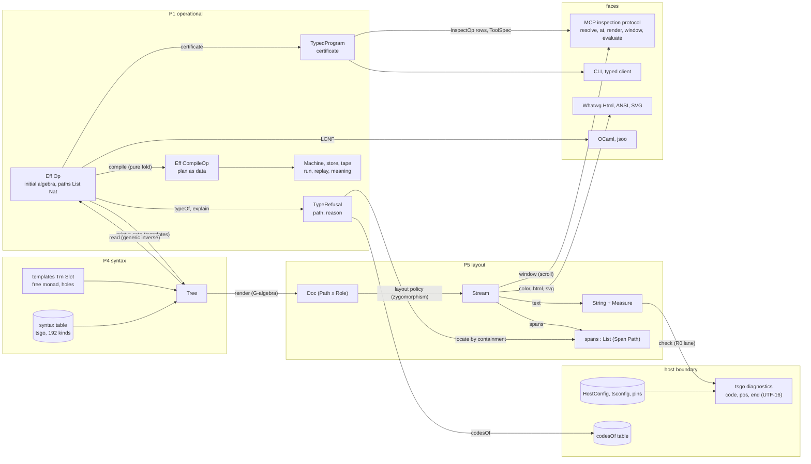
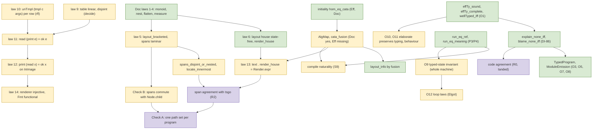
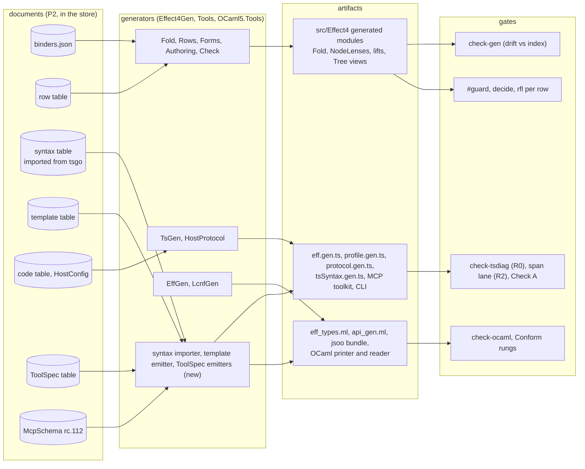

# The whole system laid out: objects, maps, obligations, and the abstraction each one is

Written 2026-09-16, late night, after the three scouts closed. The owner's steer, in their
words condensed: no separate package, but the proofs of course; the open questions should
have well-regarded answers from the literature, compilers, intermediate representations and
Lean practice; lay everything out and diagram it so the abstractions can be determined; the
algebra gives the answer; ask the owner what they will need, so that the algebra is asked for
everything.

This note does exactly that, in five parts. §1 is the inventory: every object, by plane, with
its algebraic shape and where it lives today. §2 is every map between them, with the law each
one must satisfy. §3 holds the three diagrams (objects and maps; the proof graph; the
generation pipeline). §4 answers each open question from the literature, one paragraph each,
with the consequence in Lean. §5 is the round of needs put to the owner: the questions whose
answers decide what the algebra is asked for. Four assumptions with conventional defaults are
stated at the end of §5 rather than asked.

Sources: the design note (`2026-09-16-printer-reader-positions-design.md`, §1 to §14), the
precedents note, the three scout notes (`…-scout-{a-algebra-semantics,b-format-and-host-surface,c-plan-reconciliation}.md`),
the obligations note (`…-strict-proof-obligations.md`, O1 to O17), the layout specification
(`docs/ALGEBRAIC-LAYOUT-SPECIFICATION.md`), and the repository at `23636db4`.

---

## 1. The inventory

One row per object. "Shape" names the algebraic structure the object is; "home" is where it
lives at `23636db4`; "status" is existing, first pass, or new.

### P1. Operational (the program and its meaning)

| object | shape | home | status |
| --- | --- | --- | --- |
| `Eff Op` | initial algebra of the row signature functor; first-order, answers are de Bruijn variables, so it is not a `Monad` | `src/Effect4/Program/Eff.lean` | existing |
| `EffAlgebra`, `cata_eff`, `hom_eq_cata_*`, `cata_id_*`, `frontierMap`, `foldMap_*`, `foldMapAt_*` | the generated F-algebra, the catamorphism, initiality (uniqueness of the fold), the path-indexed fold | `src/Effect4/Program/Fold.lean` (generated by `tools/Effect4Gen/Fold.lean`) | existing; `AlgMap` and `cata_eff_fusion` missing |
| `Node`, `Node.child`, `Node.at_`, `Path = List Nat`, `Path.lt`, `Path.properPrefix` | the one coordinate: the child-index path; a layer's identity is its path | `Program/NodeLenses.lean` (generated), `Program/Refs.lean`, `Program/Node.lean` | existing |
| `Node.binders`, `binders.json`, `Scoped`, the `*_scoped` family, `elaborate_scoped` | the binding signature as a table; scope safety by the fold | `Program/Binders.lean`, `tools/Effect4Gen/binders.json`, `Program/Scoped.lean` | existing |
| `Ty`, `TyEnv`, `effTy`, `typeOfProgram`, `wellTyped_iff`, `hasTy_unique`, `Ty.handle` | the declarative typing graph with one algorithm (O1); handles are the estate's move for store values | `Program/Typing.lean`, `Program/Fold.lean:34` (`Ty`), `:42` (`handle`) | existing |
| `TypedProgram`, `ModuleEmission`, `ModuleReading` | typing as a certificate carried by the value (O3, O5, O7, O8) | `Program/Typing/*`, `Codegen/*` (`9eb223b`) | existing |
| `TypeReason`, `TypeRefusal {path, reason}`, `explain`, `blame`, `explain_none_iff` | the first refusal as data; the law `explain = none ↔ effTy = some` | `Program/Typing/Blame.lean`, `Api.lean` (DI-86, `353b7960`) | existing |
| `Term` | a term language inside nodes; not a node, so no path names a subterm | `Program/Term*` | existing; coordinate gap (scout B §3.2) |
| `Machine`, `Val`, `Store`, tape, `RowTable`, `NativeOp.external`, `run_eq_ref`, `run_eq_meaning`, `Straight` | the operational machine; replay from a tape; the meaning of the straight fragment | `Machine/*`, `Laws/Program/{Denote,DenoteR,Intro,Sched}.lean` | existing |
| `denote : NativeEff → List Val → Effects.Program StoreSig ExitV`, `meaning`, `interpret` | the denotation as a free-monad term over a store signature, interpreted by a handler (the interpreter-independence claim) | `Laws/Program/Denote.lean:66`, `:135`; carrier from the `effects` package | existing; dependency to retire (DI-90) |
| `Eff CompileOp` (plan) | a second initial algebra: the compile is a pure fold into it; the plan is data typed by `TypedProgram`, run by the machine, replayable | none | new (S9, scout A Q9) |
| `Budget`, `HostConfig`, pins | fold parameters as data, included in every digest | `Api.lean`, `Codegen/Diagnostics.lean:35` | existing |

### P2. Data and contract (the universal carrier)

| object | shape | home | status |
| --- | --- | --- | --- |
| `Representation`, `Document` | a universe of codes with a decoder: the pinned model of Effect's persisted schema representation (`objects`, `union`, `suspend`, `literal`, arrays, `$ref` table, checks) | `Schema/Representation.lean`, `Schema/Document.lean` | existing |
| `Bridge.ofSchema_schema`, `ofTy`, `ofTy_normalize` | the retraction of `Ty` through schemas (O2: agreement by projection, no inverse) | `Schema/Bridge.lean`, `Codegen/Types.lean` | existing |
| `Transform`, `PureMap`, `Endpoint` | profunctor codecs; endpoints as data | `Schema/*` | existing |
| the syntax table, the template table, the code table, the row table, the tool table, the protocol messages | all P2 documents in the store, read by the compile through one row (`readTable`) | `generated/*`, `ts/eff/*.gen.ts`, `tape.schema.json`, `protocol.gen.ts` | existing for rows, codes, protocol; new for syntax, templates, tools |

### P3. Annotations

| object | shape | home | status |
| --- | --- | --- | --- |
| `AnnotationKey A`, `Lawful`, `decodeEntry_entry`, `getAll_modifyAll`, `encode_injective` | lawful keys with traversal laws (a lens family over documents) | `Schema/Annotations.lean` | existing |
| the grammar annotation | a lawful key whose value is a template: a schema declares its own concrete syntax (the meta API) | none | new (design §7, scout A Q6) |
| the role annotation on the layout | `Path × Role`, the role table generated from the constructor list as `NodeLenses` is | none | new (scout B §3.1) |

### P4. Syntax

| object | shape | home | status |
| --- | --- | --- | --- |
| the syntax table | an imported document: `tsgo`'s `ast.generated.d.ts`, 192 kinds and 482 field slots after flattening 28 base interfaces (a naive import is short by 181); records `multiLine` and `hasTrailingComma`, so the house layout decision is data on the tree | `tsgo` at `/opt/homebrew/lib/node_modules/@typescript/native-preview`, pinned in `HostConfig` | new (R2) |
| tree-sitter's `node-types.json` (324 node types) | the second importer, for foreign code at the boundary only | `/Users/pooks/Dev/lean4-tree-sitter` 0.2.4, clones under foldlab | existing binding; not for our image |
| `Tree` | a kinded tree with typed views generated from the table (law 8: one `rfl` per kind) | none; today the hand-written AST in `lean4-typescript` (`TypeScript/Render.lean`, 411 lines) | new (R2) |
| `Tm Slot` (templates) | the free monad over the syntax signature, first-order: substitution is `bind`; a hole is an `impure` node awaiting its answer; holes under binders carry `(argument, cut, insertions)` | none; today `Forms.all` (over `Eff`) and `Codegen/Print.lean`, `Codegen/Read.lean` (3531 lines) | new (R4) |

### P5. Layout

| object | shape | home | status |
| --- | --- | --- | --- |
| `Doc A` | the Wadler document as an inductive (`empty`, `text`, `line`, `hardline`, `cat`, `nest`, `choice`, `annot`) with `DocAlgebra`, `cata`, `hom_eq_cata`, `cata_id`, `AlgMap`, `cata_fusion` | `~/Dev/lean4-doc/Doc/Core.lean` (`08a0a52`) | first pass; moves in-tree (§4.1) |
| `Measure` | the product monoid (bytes, UTF-16 units, columns, lines, last column) with `ofChar`, `ofText`, `flat` | `Doc/Measure.lean` | first pass |
| `Info`, `infoAlg`, `wfAlg`, `flattenAlg` | the auxiliary algebras: breaks, hard, width; well-formedness; flattening | `Doc/Core.lean` | first pass |
| `Policy`, `layoutAlg`, `house`, `elastic`, `layout_info` | the zygomorphism: the layout carrier is `Info × (Nat → Nat → Stream × Nat)`; `layout_info` by fusion; the house policy ignores its state (byte determinism) | `Doc/Layout.lean` | first pass; `Policy` is greedy only (Pareto folds later) |
| `Stream`, `Item`, `text`, `measure`, `spans`, `Bracketed`, `locate unit` | the annotation stream; well-bracketing; spans as a laminar family (tree by containment); innermost lookup by any unit | `Doc/Layout.lean` | first pass; `spans_disjoint_or_nested`, `locate_innermost` open |
| `String` with `Measure`, `List (Span Path)` | text and positions as separate structures, both projections of the stream | `Doc/Layout.lean` | first pass |
| the two-dimensional algebras (glue, envelopes, tiles, lanes, the tropical path) | share only `Measure`; the layout specification's five invariants | `docs/ALGEBRAIC-LAYOUT-SPECIFICATION.md` (untracked) | specification only; four corrections pending (§4.5) |

### P6. Store, host, faces

| object | shape | home | status |
| --- | --- | --- | --- |
| `Effect4.Store`, `Store.Sound`, `putNode_closed` | the content-addressed store; every table, document, tree, configuration and result is addressable | `Store/*` | existing |
| `tsgo` diagnostics (`code`, `pos`, `end`, UTF-16) | the host checker at the boundary; R0's lane; `codesOf` as the code table | `harness/tsdiag/run-tsdiag.mjs`, `Codegen/Diagnostics.lean:87`, `generated/tsdiag-agreement.tsv` | existing (`7556ddef`) |
| the host session protocol, tapes | the session as data (`protocol.gen.ts`, `tape.schema.json`) | `tools/Tools/HostProtocol.lean` | existing |
| `ToolSpec` table | one row per driver (nineteen have a `main`): name, description, arguments `(name, kind, primitive, schema?, default?, description)`, reads, writes, read-only flag, exit alphabet | none (scout B §2.4) | new (R12) |
| MCP messages | documents pinned to rc.112's `McpSchema`; a tool publishes an output schema only when its success schema is object-typed (`McpServer.ts:1535`) | `vendor/effect-4.0.0-rc.112/src/unstable/ai/*` | new (R12) |
| generated TypeScript | `eff.gen.ts` (28 families' schemas), `profile.gen.ts` (content stamp), `protocol.gen.ts`, the reader `ts/eff/read.ts` (1566 lines, to be replaced by R6) | `ts/eff/*`, `tools/Tools/TsGen.lean` | existing |
| the OCaml face | `eff_types.ml`, `eff_wire.ml`, `eff_json.ml`, `eff_native.ml` from the same closed world; `api_gen.ml` from LCNF; the engine with its functor seam | `src/OCaml5/*`, `ocaml/{eff,gen,engine}` | existing; R13 gaps (type-family and value parameters, about ten builtins) |
| the web face | the html package `lean4-whatwg` (`Whatwg/Html.lean`, `Html/Schema.lean`, `Html/Svg.lean`, `Url/Rendering.lean`) | `~/Dev/lean4-whatwg` (`2c6e3bc`) | existing; not yet a consumer of the stream |
| vendored | `vendor/effect-4.0.0-rc.112` (the pin), `vendor/alchemy` (infrastructure as algebra, `docs/ALCHEMY-INFRASTRUCTURE-AS-ALGEBRA.md`), `vendor/wrangler-3.114.16` (the Worker deploy) | `vendor/` | existing; the deploy face of a generated server (§5 Q7) |
| the `effects` package | `Signature` (45 lines), `Program` (70; `vis` carries a Lean function as continuation), `Handler` (57), `Laws` (127); `Sum` (374); `Flow/Block` (273) | `.lake/packages/effects`, pinned `a4ee7a1` | dependency to retire (§4.2) |

---

## 2. The maps

One row per map. "Form" is the algebraic shape; "law" is what must hold; "status" is proved,
executed (a lane), or open.

| map | from → to | form | law | status |
| --- | --- | --- | --- | --- |
| `print` | `Eff → Except PrintRefusal Tree` | `cata_eff` with the template table; exponential carrier `Nat → …` for depth | (9) the table is linear, non-collapsing, pairwise disjoint on the image, by `decide`; (10) `unTmpl (tmpl c args) = some (c, args)` per row, by `rfl` | hand-written today (`Codegen/Print.lean`); R4 |
| `read` | `Tree ⇀ Eff` | the generic layer inverse of the finite table; deterministic tie-break on the `Effect.suspend` overlap | (11) `read (print e) = ok e` on `readable`; (12) `print (read x) = ok x` on `InImage`; `readable → scopedAt` | hand-written today (`Read.lean:1750`, `:2908`); R5 |
| `readable` | `Eff → Bool` | the domain restriction of the round trip | the Boolean equality against today's definition, per constructor | existing; guard ruled in §4.3 |
| `render` | `Tree → Doc (Path × Role)` | a G-algebra: one field per kind, the node's path as annotation | (13) `text ∘ layout house ∘ render = Render.expr` (fusion) while the old renderer exists; then the goldens are the lemma | R2 |
| `layout p w` | `Doc A → Stream A` | the zygomorphism `cata (layoutAlg p w)` | (6) `layout house` is a function of the document and the indentation alone; `layout_info` by fusion; `layout_bracketed` for every policy | proved (first pass) |
| `text`, `measure`, `spans` | `Stream A → String`, `→ Measure`, `→ List (Span A)` | monoid homomorphisms out of the stream | (4) `measure (cat a b) = measure a ++ measure b`; (5) the spans are well-bracketed and laminar | proved except `spans_disjoint_or_nested` |
| `locate unit` | `List (Span A) → Nat → Option A` | innermost containing span in the chosen unit | `locate_innermost` | open |
| `flatten` | `Doc A → Doc A` | `cata flattenAlg` | (3) the flatten laws | proved |
| `parse` | `String → Tree` with byte spans | the host's parser at the boundary (`tsgo` API or tree-sitter), in `Tools` or the harness; never under `src/Effect4` | none in the pure model: its output is a document | boundary |
| `check` | `String × HostConfig → Diagnostics` | `tsgo`'s API, pinned | executed: `effTy e = some _ → no error on print e` (408 of 408) | R0 lane |
| `typeOf`, `explain`, `blame` | `Eff → Option Ty`, `→ Option TypeRefusal`, `→ Option Path` | the typing fold; the first refusal | `explain_none_iff`, `blame_none_iff` | proved |
| `codesOf` | `TypeReason → List Nat` | the code table | executed: agreement verdicts per program | R0 lane |
| blame to span | `Path → Option (Span Path)` | containment lookup over the render's spans; Check A (path sets equal) and Check B (commutes with `Node.child`) | Check B provable from `layout_bracketed`; Check A executed | R3 |
| `elaborate` | `Eff → Eff` | the authoring fold | O10 typing-preserving, O11 behaviour-preserving | open (D7) |
| `compile` | `Eff Op → Eff CompileOp` | a pure fold producing a plan (no `Monad (Eff _)`, so no Kleisli lift) | naturality: `denote (compile e) under H = print e` on the straight fragment, by `cata_eff_fusion` | S9; needs `AlgMap` for `Eff` |
| `emitSchema` | `Document → Tree` | a second template table over the same `Tree` | (15) the table's (9) and (10) | R7 |
| `emitModule` | `TypedProgram → Module` | the certificate carried into the module | O5, O7, O8 | existing |
| `denote`, `meaning` | `NativeEff → Program StoreSig ExitV`, then `interpret` | fold into the free monad; handler as algebra | `run_eq_meaning`, `interpret_bind` | existing |
| `run`, `replay` | machine steps under fuel; tape-answered rows | | O9 typed-state invariant | fragment-wise |
| `color`, `ansi`, `html`, `svg`, `mermaid` | `Stream (Path × Role) → …` | annotation interpretations out of the stream (maps on `Role`, never on text) | the text projection ignores the role (double encoding by construction) | new |
| `ToolSpec` emitters | `ToolSpec table → MCP toolkit / CLI / OCaml protocol server` | three algebras of one signature | the reflection check: every entry names an implementing constant of the stated type | R12 |
| `LCNF → OCaml`, `jsoo` | Lean definitions → `api_gen.ml` → a JavaScript bundle | the portable face | `make check-ocaml` green; Conform rungs | R13 gaps |
| `diff`, `patch` | `Eff × Eff → Edits` over paths; text diff derived by re-render | structural diff on the initial algebra; patches as a category | later (R11) | deferred |

---

## 3. The diagrams

Mermaid sources; the same three files live under `docs/research/diagrams/` for rendering.

### 3.1 Objects and maps

### 3.2 The proof graph

### 3.3 The generation pipeline

---

## 4. What the algebra and the literature answer

Each item: the question, the answer, why, and what it means in Lean. None of these is put to
the owner as a menu; §5 asks only about needs.

### 4.1 The layout carrier: our own `Doc`, in this repository, with its proofs

`Std.Format` is a Wadler document with `tag : Nat`, `group` with two flatten behaviours, an
`Int` indent, no `DecidableEq`, and a renderer (`be`, `spaceUptoLine'`) marked `partial`. Scout
B read it against the house renderer and found four independent grounds against it: the house
layout chooses between two different documents (a trailing comma in the multiline arm,
`Render.lean:144`) and `group` only offers a document against its own flattening; its group
decision reads width and column and is re-decided after every hard break, so width
independence is not statable; the tag stream is well-bracketed by a discipline inside `be`,
not by construction; and `partial` hides the renderer from the kernel, so none of the six laws
can be proved and `decide +kernel` cannot see through it. The literature agrees on the shape
we have: Wadler's algebra of documents with its laws (Wadler 2003, "A prettier printer"; Hughes
1995, "The design of a pretty-printing library"), the layout as a fold with an auxiliary
measure (Swierstra and Chitil 2009, "Linear, bounded, functional pretty-printing"), and
non-greedy or optimal variants as later folds over the same document (Bernardy 2017, "A pretty
but not greedy printer"; Podkopaev and Boulytchev 2014; Yelland 2016, "A new approach to
optimal code formatting"). Prettier's printer is the same algebra with `fill`, `ifBreak` and
`breakParent` as extra constructors, worth reading as engineering precedent, not as a carrier.

Answer: the first-pass `Doc` (about 700 lines, `~/Dev/lean4-doc`, `08a0a52`) moves into this
repository under the audited root as `src/Effect4/Doc/{Measure,Core,Layout,Laws}.lean` with
its guards in `Test/Doc/`, the package is deleted, and no path require is added. It has no
dependency on `Effect4`, and `Effect4` must not reach `Effect4.Laws`, so its laws stay beside
the definitions as DI-86's do. One thin `Doc → Std.Format` export exists for Lean-side display
with no law attached. Two amendments from scout B are applied on the way in: name the two
widths apart (`Info.width` is code points for the elastic comparison; `Measure` carries four
units), and document that `line` and `hardline` lay out identically once a policy has chosen.

### 4.2 Retiring `Effects`: the dependency goes, the free monad stays the meaning's carrier

Two different moves were called "retire". Retiring the dependency copies `Signature`,
`Program`, `Handler` and `Laws` (299 lines) in-tree under the same names, with `Sum` (374) and
`Flow/Block` (273) only if their single consumers survive; zero proof edits; the pin and the
require go. Retiring the free monad replaces the meaning's carrier with a concrete monad,
deletes `interpret`, and with it the claim that the meaning is independent of its interpreter;
about 144 sites in ten `Laws` modules restated.

The literature settles which is the object and which is the tool. A program's syntax is the
initial algebra (`Eff`, first-order, data). Its meaning is a term of the free monad over an
operation signature, and a handler is an algebra for that free monad (Plotkin and Pretnar
2009, "Handlers of algebraic effects"; Plotkin and Power 2003; Kiselyov and Ishii 2015, "Freer
monads, more extensible effects"). Scoped operations (`scope`, `fork`, `acquireRelease`, loops)
are exactly the case the scoped-effects line treats (Wu, Schrijvers and Hinze 2014; Piróg,
Schrijvers, Wu and Jaskelioff 2018; Yang et al. 2022; Bach Poulsen and van der Rest 2023,
"Hefty algebras"). The value of that carrier is precisely that the same term has many handlers,
which the scheduler-as-handler research (U11) needs.

Answer: DI-90 as ruled, restated as scout C wrote it. The `effects` require is retired by
copying; `Eff` stays first-order; `denote`'s carrier stays a free monad now living in-tree;
making it concrete would be a separate packet with a reason nobody has given.
`Schema/EffectfulField.lean`'s use of `Flow/Block` is decided first, because it is the only
consumer that would drag 273 lines in. The same rule extends to `lean4-typescript`: once
`Tree` over the imported table exists and law 13 lets the old renderer go, the `typescript`
require is retired the same way (§5 Q15 asks for the word). `lean4-hash` stays; the store
needs it.

### 4.3 The `readable` guard: a Boolean equality, per constructor

Invertible syntax needs a side condition on the description, and the condition is decidable
on a finite table: linearity and non-overlap in Rendel and Ostermann 2010 ("Invertible syntax
descriptions"), treelessness and linearity in Matsuda and Wang's FliPpr (2013, 2018), which
derives a parser from a pretty-printer exactly as R5 derives the reader from the template
table; the lens laws' domain in Foster et al. 2007 and Boomerang. `readable` is that domain
restriction for us and is a premise of `read_print`, `read_exact`, `print_readable`,
`ModuleEmission.readModule` and `Api.printModule_roundTrip`.

Answer: `readable` keeps its name and its domain. Any new definition (from the template table
or otherwise) ships with `readable' e = readable e` proved per constructor, so the round-trip
theorems keep their promise without anyone editing their statements. `reconstructible` is
never written. This is a standing rule, not a stage.

### 4.4 The syntax table's source: TypeScript's own, for the image; tree-sitter for foreign code

Compiler practice: the abstract syntax of record is the one the checker you run agrees with.
We pin `tsgo` for diagnostics and spans (UTF-16), and its `ast.generated.d.ts` is the table:
192 kinds and 482 field slots after flattening the 28 base interfaces; a naive import gets 301
and is silently short by 181 (scout B, tested). It also records `ObjectLiteralExpression.multiLine`,
`Block.multiLine` and `NodeArray.hasTrailingComma`, so the house layout's one decision is
representable as data on the imported tree, which is what makes the fusion lemma (law 13) a
statement about two folds over the same tree. Tree-sitter's `node-types.json` is a concrete
syntax with a Lean binding and ten pinned grammars, none of them OCaml; it is the right
importer for foreign code at the boundary (the foldlab ingest lane) and wrong for our own
image, which is generated and known before it is printed.

Answer: the printed image targets the `tsgo` table imported as a document, base-flattened, with
a `#guard` on kinds, fields, required and multiple flags (law 7); the typed views are generated
with one `rfl` per kind (law 8); tree-sitter stays the second importer for foreign code only.

### 4.5 The layout specification's four corrections: apply them

They are defects, not choices: `Doc` is the one-dimensional core and the two-dimensional
algebras share only `Measure`; `Glue.resolve` cancels its own stretch; `allocateLanes` is a
stub that produces the staircase it exists to prevent; `terminalAspectScale : Float` has no
decidable equality inside a configuration that must be comparable and digestible; and
`Envelope.empty` uses a large negative sentinel where a proper bottom belongs. They are applied
to `docs/ALGEBRAIC-LAYOUT-SPECIFICATION.md` before any Lean is built from it, and the
two-dimensional half waits for its first consumer (§5 Q20).

### 4.6 `Ty` against `Document` for the compile rows: handles

`CompileOp`'s rows (`readTable`, `moduleSurface`, `checkHost`, `emit`, `resolve`) need request
and answer types in the row table, and the type language is `Ty`, which cannot express
`Document`, `Diagnostics` or `HostConfig`. Every compiler that talks to foreign values does the
same thing: an abstract type in the IR whose meaning is a contract outside the type language
(GHC's foreign type constructors, OCaml's abstract types, Lean's own `lean_object*` after
erasure). The estate already has the move: `Ty.handle` for store values, and D12 rules that
every boundary value carries an Effect Schema, so the handle's schema is the contract.

Answer: `Ty.handle` naming the document kind; `Ty` is not widened. Documents cross the row
boundary as handles into the store, and the schema on the handle is what MCP and the CLI
publish.

### 4.7 The order: positions and blame first, the alphabet next, the table last

Scout C's reconciliation, and the compilers' reason for it: settle the IR's alphabet before
generating the front-end table from it, and land the additive work (positions, blame to code,
the tool surface) first because it touches no alphabet. R1 to R3, then R12's MCP toolkit and
CLI, then the `Eff` series (with `gen` retired last, `Stmt` and `Stmts` read into `bind`,
`select`, `iterate`; recommended yes), then S1's wire tags, then R4 and R5 against the settled
alphabet with the guard of §4.3. `docs/STATE.md` already lists this order.

### 4.8 Terms are not nodes: `Option Path` now

No `List Nat` names a subterm, yet printed text has spans for terms and `TypeReason.term`
blames the enclosing node. Annotate with `Option Path` now: term text sits inside its node's
span, carries none of its own, and Check A holds unchanged. A `TermPath` second lens is the
honest extension when `explain` must point inside a term (§5 Q19).

### 4.9 The annotation is `Path × Role`, the coordinate is `List Nat`, the coherence is a lane

The role table is generated from the constructor list as `NodeLenses` is; the text projection
ignores the role, which makes the design system's double-encoding rule true by construction.
Every MCP schema carries `path : Array<number>` on node-shaped values and a span carrying bytes
and UTF-16 together, never a line and column alone. Check A (five finite-set equalities per
program over the 408 corpus programs: the paths `foldMapAt_eff` yields, the spans' paths, the
containment tree's paths, `Api.blame` when it answers, `Node.at_`'s domain) is executed; Check
B (a child's mark is contained in its parent's) is proved for the `Doc` from `layout_bracketed`.
This is the "one coordinate system" of the design system specification, made executable.

### 4.10 Templates, holes, and "should each node be effectful"

Templates are terms of the free monad over the syntax signature, first-order (`Tm Slot`);
substitution is `bind` (Swierstra 2008, "Data types à la carte"). A hole is an `impure` node:
an operation awaiting its answer, with the rest of the template as its continuation, which is
the owner's "an effect or a representation of a future message" made precise (McBride 2015,
"Turing-completeness totally free"; Hancock and Setzer's interaction structures). A hole under
a binder carries `(argument, cut, insertions)`, which is a metavariable under a substitution as
in contextual modal type theory (Nanevski, Pfenning and Pientka 2008); binding itself stays
first-order by the `Slot` encoding rather than second-order abstract syntax (Fiore, Plotkin and
Turi 1999), which scout A rated as not worth carrying in the types. Rendering is a handler for
those operations. So the answer to "should each AST node be effectful" is: the template's
nodes are, the tree's are not; the tree is the answer, the template is the question.

### 4.11 Positions, incremental handling and diffing: the shapes, named now, built later

`Measure` is a monoid, and a text with cached measures at every node is a rope or a finger tree
with that monoid as its annotation (Boehm, Atkinson and Plass 1995; Hinze and Paterson 2006):
`locate` is the monoidal search, and re-rendering a changed subtree recomputes only the
measures on its spine. Memoisation keys are the store's digests (hash-consing, Filliâtre and
Conchon 2006), so an unchanged subtree's render is a lookup; demand-driven recomputation
(Adapton, Hammer et al. 2014) is the general form if a whole session needs it. Diffing is on
the initial algebra by paths, type-safe structural diff (Lempsink, Leather and Löh 2009;
Miraldo and Swierstra 2019; GumTree, Falleri et al. 2014 as the heuristic precedent), with the
text diff derived by rendering both sides (Myers 1986 is the string fallback); patches compose
as a category with merges as pushouts (Mimram and Di Giusto 2013; Angiuli et al. 2014). R11
stays deferred until the authoring surface has an edit operation, but R1 is built so nothing
has to be rebuilt: the stream is measured, spans are a separate structure, and the store is the
memo table.

### 4.12 The effectful, typed compile: a pure fold producing a plan

`Eff` is not a `Monad` (its `bind` takes a program as continuation), so there is no Kleisli
lift and the generated `foldM_eff` cannot be instantiated at `Eff CompileOp`. The compile is
`cata_eff` into the carrier `Eff CompileOp` with `Eff.bind` as sequencing: a plan as data,
typed by `TypedProgram`, run by the machine, replayable from a tape, with the five rows of
§1 P1. Its correctness is a naturality equation between two folds into different carriers,
which is a fusion statement, so `AlgMap` and `cata_eff_fusion` are generated for `Eff` as they
exist for `Doc`; `foldM_natural_eff` is not that theorem.

### 4.13 Schemas as the universal grammar carrier, and schema AST compilers as the idiom

A schema AST is a universe of codes with a decoder, which is what `Representation` already
is; the datatype-generic literature calls this a description (Chapman, Dagand, McBride and
Morris 2010, "The gentle art of levitation"; de Vries and Löh 2014, "True sums of products").
A grammar annotation is a lawful annotation key whose value is a template: a schema declares
its own concrete syntax, and the printer for a shape is the fold of its description with that
key. Consuming generated TypeScript as a schema you compile is the same fold on the host side
(Effect's `SchemaAST` folds; `Schema.toJsonSchema`, `toArbitrary` are existing instances), so
the consumption idiom is one algebra per use, over the schema signature, generated where the
Lean side already has the fold.

### 4.14 The API surface and MCP as first-class

An API surface is a signature: entries with an implementing constant, request and response
schemas, and annotations (names for MCP and the CLI). The `ToolSpec` table is that signature
for the nineteen drivers, and the MCP toolkit, the CLI and the OCaml protocol server are three
algebras of it, generated. MCP's protocol messages are documents pinned to rc.112's
`McpSchema`; the one hard fact is that a tool publishes an output schema only when its success
schema is object-typed. The OCaml face does not get an MCP server: it answers the same
host-session protocol document (`protocol.gen.ts`, `tape.schema.json`), one protocol, two
servers. The visual channel for a model is the same stream rendered at a stated width with the
role legend, as text, and as HTML through the html package for a human viewer.

### 4.14b The inspection protocol: everything MCP-inspectable through one small API (owner's steer, same night)

The owner's words: everything should be MCP-inspectable; a very simple API, more like the
Chrome DevTools Protocol, where you write code against the structure that exists to take
action; that is the power the algebra should unlock; custom capabilities come on top, with
scrolling and inspection as the start.

The DevTools Protocol's shape is: domains (`DOM`, `Runtime`, `Debugger`), commands as
request and response messages, events, and remote object handles, all described by one
protocol document (`protocol.json`) from which every client library is generated. The
algebra gives us the same shape for free, and more uniformly than Chrome has it, because every
object in §1 is already a document in the store with one coordinate (`List Nat`) and one
generic fold. So the protocol has one domain per plane and a handful of generic commands
that never mention a particular structure:

| command | meaning | what answers it |
| --- | --- | --- |
| `resolve digest` | the document behind a handle | the store (P6) |
| `at handle path`, `children handle path`, `parent` | navigate any tree by its coordinate | `Node.at_`, `Node.child`, the generated lenses; for `Doc` and `Tree` the same lens family, generated |
| `render handle policy width` | the stream of a document, with its measure | `layout` (P5) |
| `window view offset lines` | scrolling: a window over the stream in any unit | the measured stream; a prefix-sum lookup, which is what the monoid is for |
| `spans handle`, `locate handle unit offset` | positions and the innermost node at an offset | `spans`, `locate` |
| `explain handle`, `blame handle`, `codes` | why a program was refused, where, and in the host's alphabet | DI-86, `codesOf` |
| `check handle`, `diagnostics` | the host compiler's verdict | R0's lane |
| `evaluate program` | write code against the structure: an `Eff` over the inspection rows, typed, run, replayable from the tape | the machine; the rows are `NativeOp.external` answered by the store |
| events | tape entries as they happen (a step, a refusal, a render) | the recorder tape |

Two facts make this the algebra's answer rather than a design. First, the commands are the
generic operations of the structures: a lens family (navigate), a fold (render), a monoid
search (scroll, locate), a certificate projection (explain). None is written per structure;
the generator that emits `NodeLenses` for `Eff` emits the same lenses for `Tree` and `Doc`
from their signatures. Second, "write code against the structure" is program-as-data: a
client sends an `Eff` over an `InspectOp` signature, which is typed by the same `effTy`,
runs on the same machine, and replays from the same tape, so an agent's inspection session is
a program with a certificate, and a custom capability is one more row in that signature with
its handler, never a new server. The typed TypeScript client is generated from the protocol
document the way DevTools clients are generated from `protocol.json`, and the same document
is the MCP toolkit's surface (each command a tool with object-typed success) and the OCaml
protocol server's contract.

Consequence for R12: the `ToolSpec` table of nineteen drivers becomes the second emitter,
not the first. The first is the inspection signature (`InspectOp`) with its generic commands,
served over MCP, and the drivers become entries in it (each one is `evaluate` of a known
program). Scrolling and inspection are the whole first slice: `resolve`, `at`, `children`,
`render`, `window`, `spans`, `locate`, `explain`, `blame`.

### 4.14c The AI writes TypeScript: the semantics of what it writes (owner's steer, same night)

The owner: "we'll want the AI to be writing TypeScript, so we'll need clean semantics there",
and, on Q21, "it could be both". Both means the typed client and the row signature are one
document, and it fixes what "clean semantics" is. TypeScript written by a model has exactly
one meaning: the `Eff` it reads to. There are three kinds of text a model can write, and each
has a defined fate.

1. **A program in the image.** `Effect.gen` bodies over the rows the templates print (the
   DI-88 style inverse keeps the `Effect.gen` spelling; generator bodies read into `bind`,
   `select`, `iterate`). The host reader from the exported table over `tsgo`'s AST (R6) lifts
   it to `Eff`; `read` is the inverse of `print` on the image (laws 11 and 12, with `InImage`
   characterised); the reading certificate (O3) and source validation (O4) make the lift a
   value with a proof; the meaning is the machine's (`run_eq_meaning`). What the model wrote
   and what runs are the same program by theorem.
2. **A script against the typed client.** Calls on the generated client are calls on the
   inspection rows, so a script is a program over `InspectOp` and reads the same way; an
   agent's inspection session is an `Eff` with a certificate and a tape, replayable. This is
   what "both" buys: the client is a spelling of the rows, not a second API.
3. **Anything else.** Outside the image the reader refuses with a located reason, and the
   location is a `tsgo` span (R2, R3), in the host's own code alphabet (R0), so the model gets
   the refusal where it wrote the text. Partial programs are admitted through typed holes (the
   typed-hole idiom family of the corpus coverage note), so a model can leave a hole and be
   told its type rather than be refused whole. Foreign Effect TypeScript (the foldlab ingest
   lane, tree-sitter at the boundary) stays a later lane; it is not what the model writes
   against this system.

The literature backs each piece: FliPpr derives the parser from the printer, which is why the
image is the language; invertible syntax descriptions give the round trip its side condition;
typed holes with located types are the standard authoring surface of proof assistants (Agda's
and Lean's metavariables), and contextual modal type theory is what a hole under a binder is.
The one new obligation is that the image must be documented as the language the model is
taught, so the grammar annotation (the template table) is also the model's reference: the
grammar specification the owner asked for is the same document, rendered for a model.

### 4.15 The portable face through LCNF

Lean's own pipeline erases types after LCNF (the IR carries `lean_object*`), and the two
generator gaps (type-family parameters like `EffAlgebra R`, value parameters like `Typed
table`) are the two places where the OCaml emitter tried to keep more type than the IR has.
The standard remedies are the ones every ML backend uses: a uniform representation with
`Obj.t` at the seams for type-family parameters, and dictionary passing for value parameters.
With those two rules and about ten builtin rows the whole face compiles, and js_of_ocaml
(Vouillon and Balat 2014) gives the JavaScript bundle. The template table is the one document
whose OCaml emitter has real payoff: it turns the OCaml face from a wire codec into a printer
and reader checked by the same differential the TypeScript reader runs.

### 4.16 Rendering targets, coloring and the web face

There is one algebra from `Doc` to the stream. Every target is an interpretation of the
stream's annotations: ANSI and CSS classes from the role table (with LSP semantic token types
as a third generated map if an editor ever asks), HTML through `Whatwg.Html` in the
`lean4-whatwg` package (`Html/Schema.lean`, `Html/Svg.lean` are the target models), SVG for
diagrams, Mermaid for the containment tree, plain text for MCP. Vendored code is precedent
and deployment, not a carrier: Prettier's printer for `fill` behaviour, oxc for
normalisation, `vendor/alchemy` and `vendor/wrangler` for deploying a generated server as a
Worker (§5 Q7).

---

## 5. What the owner will need: the round

Each question has a recommended answer. These are about needs, so that the algebra is asked
for everything; the design choices above are not re-opened here.

**Q1, consumers of a printed program.** Which of these must every printed program serve:
(a) `tsgo` diagnostics agreement, (b) execution by the Effect runtime, (c) a model reading it
over MCP with spans it can cite, (d) a person in a terminal with colour, (e) a web page
through the html package, (f) a diff view between two versions? Recommended: all six; (c) to
(f) are annotation interpretations of one stream, one map each.

**Q2, what an agent gets on a refusal.** Path, reason head and TypeScript codes exist. Add
the span in bytes and UTF-16, the printed text with the span marked, and a suggested edit?
Recommended: the first four now (R2, R3); suggested edits after R11.

**Q3, how agents edit programs.** By path (replace a subtree, insert a row, wrap in a scope),
by text, or both; and sent as an `evaluate` program over the inspection rows (§4.14b) so
every edit session replays? Recommended: by path, as an `evaluate` program; text edits are
derived by re-rendering, which makes diff a list of path edits and keeps `read` off the hot
path.

**Q4, incremental handling.** Needed now (re-render only changed subtrees, re-check only
changed programs, memo by digest) or later? Recommended: later, with the measured stream and
the store as memo table designed in at R1 so nothing is rebuilt.

**Q5, hosts for the printer and reader.** Lean only; TypeScript (the host reader over the
`tsgo` AST from the exported table, R6); OCaml (the template table's emitter)? Recommended: all
three from one table; nothing hand-written on any host.

**Q6, the surfaces generated from the protocol document.** The inspection protocol over MCP
(§4.14b); the typed TypeScript client; the CLI; the OCaml protocol server; OCaml roots and
`.mli`; jsoo exports; HTTP API (`unstable/httpapi`); RPC? Recommended: the inspection protocol
over MCP with scrolling and inspection as the first slice, then the typed client and the CLI,
then the OCaml protocol server; HTTP and RPC only when a client exists.

**Q7, the deploy face.** The generated MCP server over stdio only, or also as a Cloudflare
Worker through the vendored alchemy and wrangler? Recommended: stdio now; the Worker as one
more emitter of the same `ToolSpec` document later, with alchemy's resource graph as another
algebra instance.

**Q8, the visual channel for a model.** MCP content is text, image or resource. Text
renderings at a stated width with a role legend; SVG or PNG images of the containment tree and
diagrams; HTML resources for a human viewer? Recommended: text and HTML now (`render` and
`window` answer the text case directly); images when the two-dimensional engine exists.

**Q9, the colouring vocabulary.** Our own role table as the source with ANSI, CSS and LSP
token types as generated maps, or LSP's vocabulary as the source? Recommended: our role table;
one annotation, three interpretations.

**Q10, Effect modules the grammar specification must cover first.** Schema (classes,
TaggedStruct, unions, transformations), then the modules the printed image already uses
(Effect, Scope, Fiber, Deferred, Layer, Stream), then Cli and the AI toolkit? Recommended:
that order; Schema is the carrier, so it goes first.

**Q11, pins.** One pin (rc.112 and the pinned `tsgo` build) or several side by side?
Recommended: one; a pin is a document in every digest, so a second pin is a second table when
it is needed.

**Q12, scale and budgets.** Programs of hundreds of nodes with the default fuel, or thousands?
Does the OCaml engine need to print and read at wire speed? Recommended: hundreds, default
fuel stays; OCaml gets the template table so it prints and reads without Lean in the loop.

**Q13, theorems against lanes.** Round trip, layout laws, Check B and the compile's naturality
as theorems; span agreement, code agreement and Check A as lanes; diff correctness as a theorem
when R11 exists? Recommended: exactly that split.

**Q14, what "retire Effects" means to you.** The dependency (copy four modules, zero proof
edits, the free monad stays the meaning's carrier), or the carrier as well? Recommended: the
dependency; the carrier's interpreter independence is what the scheduler research needs.

**Q15, `lean4-typescript`.** Retire that dependency too, once `Tree` over the imported table
replaces its hand-written syntax and the fusion lemma lets the old renderer go? Recommended:
yes; `lean4-hash` stays.

**Q16, persistence.** Must documents, certificates and rendered programs persist across
sessions on disk and be shared between Lean, TypeScript and OCaml? Recommended: yes, one
content-addressed store with the pins in every digest.

**Q17, templates at runtime.** A fixed table at build time (a new row is a generator run with
the guard), or runtime-extensible by agents? Recommended: fixed.

**Q18, foreign code.** Must the redesign's reader also read foreign TypeScript now (the
tree-sitter path, the foldlab ingest lane), or only our image? Recommended: only our image;
tree-sitter stays the boundary importer for later.

**Q19, blame inside terms.** Do agents need a refusal to point inside a term (the `3` in
`Effect.succeed(3)`) now? Recommended: no; `Option Path` now, a `TermPath` lens later.

**Q20, the two-dimensional engine's first consumer.** The containment tree as text, score
rows, or the design system's diagrams? Recommended: the containment tree as text, which is
one-dimensional, so the two-dimensional half waits.

**Q21, what "write code against the structure" means.** (a) A typed TypeScript client
generated from the protocol document, the DevTools idiom, used from host code; (b) an `Eff`
program over the inspection rows sent to the server and replayed from the tape; (c) both?
Recommended: both, because they are one document: the client's method table and the row
signature are the same signature, and (b) is what makes an agent's session a program with a
certificate. Answered by the owner the same night: both (§4.14c).

**Q23, the TypeScript a model writes.** (a) Programs in the printed image (`Effect.gen`
bodies over our rows), (b) scripts against the typed client, (c) arbitrary Effect TypeScript
read through the ingest lane; and must partial programs be admitted through typed holes so a
model is told a hole's type rather than refused whole? Recommended: (a) and (b) now, both
lifted by the same reader into `Eff` with a certificate; typed holes yes, as the authoring
surface; (c) stays the later ingest lane.

**Q22, the first domains and commands.** Store (`resolve`), Program (`at`, `children`,
`explain`, `blame`), View (`render`, `window`, `spans`, `locate`), Host (`check`), Session
(`evaluate`, events): which must be in the first slice? Recommended: Store, Program and View
with `resolve`, `at`, `children`, `render`, `window`, `spans`, `locate`, `explain`, `blame`;
`evaluate` second; `check` is already a lane and joins when the server exists; events with
the session.

Assumed unless the owner says otherwise: Q11 one pin, Q12 hundreds of nodes, Q16 persistence
on disk, Q17 a fixed table.

---

## 6. What changes on the ground once the round is answered

- `~/Dev/lean4-doc` becomes `src/Effect4/Doc/*` and `Test/Doc/*` with the two amendments; the
  package is deleted; the goldens stay byte-identical (R1).
- `AlgMap` and `cata_eff_fusion` are added to the fold generator (two consumers already).
- `docs/ALGEBRAIC-LAYOUT-SPECIFICATION.md` gets the four corrections.
- `docs/STATE.md`'s "Owner decisions open" becomes a pointer to §4 here plus whichever of Q1
  to Q20 the owner answers against the recommendation.
- DI-90's text is amended as scout C wrote it; a sibling row records `lean4-typescript`'s
  retirement after law 13.
