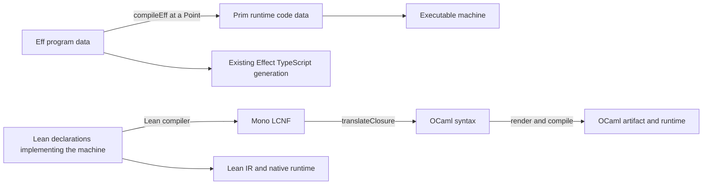

# Architectural critique: checked corrections and precise contracts

The critique identifies real proof obligations, but several of its proposed solutions are
false or stronger than the evidence. This response corrects those claims, supplies checked
composition and observation contracts, and identifies the small interfaces needed next.
It does not approve decisions 78–83 or change the runtime, compiler or frozen machine meanings.

Base: 6d2385cd. The original critique, independent reviews, executable probes and exact command
receipts are retained in docs/research/2026-09-19-critique/. The source and dependency pins are
in that directory's evidence.json. All work in this packet is tracked; STATE is its entry point.

## 1. What survives the audit

Keep one stored program language, Eff. Reuse its generated weakening/folds, the existing
typing judgments, Protocol laws, Book's relation-lifting pattern and OCaml container interfaces.
Use typed contract parameters and existing wanted declarations for deferred implementations.
The immediate work is to make those pieces compose; it is not a new framework of gates.

| Critique claim | Finding and correction |
| --- | --- |
| Rows 78–83 are concretely approved | False. They remain proposals; approved rows 44–45 concern the typed world. DI-11 explicitly settles Queue/Mailbox/PubSub composition, not every surveyed module. |
| Capture violates first-order representation because it contains context/fuel | False as stated. Capture's fields are data. The issue is confusing a runtime execution capture with a stable public behavior value. Captured context can be required behavior. |
| Every invocation must use the caller's context | False for existing captured finalizers, which restore registration context. Select lexical captures, service context and dynamic control separately. |
| Code identity is established by digest plus entry | Incomplete. A digest locates a candidate; a typed registry resolution relation establishes its identity and entry contract. Hash collision freedom is not a kernel theorem. |
| Identity is var0 and composition is raw bind | Refuted by checked equations over the actual evaluator. Identity at Γ,A uses var Γ.length; composition inserts a slot using existing weakening. |
| Raw reassociation has the stated monad meaning | Refuted: the two raw terms return 2 and 1. Their continuation environments differ. State laws for scope-correct composition and a named meaning. |
| ScopeFrame/RSaved are the illustrated first-order runtime stack | False. The illustrated constructors do not exist. The proof scheduler intentionally stores semantic functions; compiled runtime frames use data. |
| First-order representation implies serialization, replay, migration and memory safety | False. These require their own codec, resolution, control and state-invariant connections. |
| compileEff → NCode → getMonoDecl? is an established Futamura pipeline | False description of the code. compileEff makes runtime frame data; getMonoDecl? reads compiled Lean declarations through a separate route. |
| Semantic, holder and diagnostic observations form a strict chain | Unproved and not true by naming. Use explicit factorization or a relation; holder supervision currently reads some trace history. |
| A persistent transaction owner suffices at fuel boundaries | Incomplete. Current public frontier projections omit suspended command/outer-driver work. Ownership must be attached to a specified continuation protocol. |
| Pure/TxRef is the only possible version-erasure condition | Too strong as necessity. It is a candidate admission profile; the semantic condition is stability of accessed committed cells through the attempt, plus control and delivery agreement. |
| Saturation is an alternative implementation of mathematical Nat | False without a changed observation/specification. The finite OCaml probe changes a result even with bounded inputs and output; a saturated allocator loses freshness. |
| Any I-preserving interference preserves progress | False. Such interference can starve the operation; I alone does not constrain the transitions other clients may take. |
| Every composed operation needs one fixed refModify linearization point | Too restrictive. Specify public histories first; a fixed point is one possible proof method, not every module's definition. |

These corrections apply to the critique and to a few statements it inherited from our own
ontology. The authority amendments in this slice repair those statements rather than merely
disagreeing with the external review.

## 2. Composition: the smallest reusable formal repair

Variables are absolute positions from the start of the environment. Successful bind appends
its answer. For a fixed type context Γ, use the existing syntax:

```text
idAt Γ          := succeed (var Γ.length)
composeAt Γ p q := bind p (q.weaken Γ.length)
```

The second program expects Γ,B. Inside the bind it actually receives Γ,A,B; weakening moves
its B and later bound positions past A. No new AST or program wrapper is needed.

Contracts.lean proves, for every signature, context, input type and two programs:

```text
HasTy σ (Γ ++ [A]) p ⟨B,E,R⟩ →
HasTy σ (Γ ++ [B]) q ⟨C,F,S⟩ →
HasTy σ (Γ ++ [A]) (composeAt Γ p q) ⟨C, Ty.join E F, R.union S⟩
```

The proof uses HasTy.bind and the existing hasTy_weaken; its axioms are exactly
[propext, Quot.sound]. Staging.lean also proves the concrete wrong/correct identity and
composition equations. It demonstrates that raw positional syntax alone does not enforce
scope: var0 is constructible in an empty environment and evaluation returns none.

TermTransport.lean also proves the general value-environment transport equation, with no
typing or scoping assumptions:

```text
evalTerm (pre ++ inserted :: post) (term.weaken pre.length)
  = evalTerm (pre ++ post) term
```

The lookup statement is already private in the typing rules; promotion should expose that
shared fact once. The research copy exists to check the value-side proof independently.
Lift this checked term transport through the selected Eff meaning, starting with the admitted straight-line
fragment. Then prove identity/associativity for composeAt at that meaning. Error-state retention
is part of the equality. A state-only straight-line equality does not automatically preserve
concurrent guard/tick observations. Raw Ty.union is a syntax constructor; grade joins use
Ty.join, with normalized CTy/ErrTy or explicitly named equality modulo normalization.
The general semantic composition laws remain owed; typing closure is the theorem proved here.

## 3. Stored behavior: code content, captured services, invocation state

Keep three roles distinct, using current owners:

```text
BehaviorData = (CodeKey, EntryPath, CapturedValues, ContextPolicy)
EntrySignature = (CaptureTypes, ArgumentType, AnswerType, ErrorType, Requirements)
InvokeState = current fiber/control, current world, supplied execution budget/decisions
```

This is a candidate signature, not a new Val constructor in this slice. CodeKey resolves to an
admitted module owned by Eff. EntryPath must identify an allowed entry with the declared lexical
layout, not an arbitrary interior subterm that depends on missing control frames. CapturedValues
are data, typed against CaptureTypes; nested handles also satisfy the approved HandlesFit world.
The registry establishes the module/version, entry, typing and transitive admission summary.
A digest is an address checked against that registry; no injectivity of finite hashes is assumed.

ContextPolicy distinguishes invocation services from a specifically captured environment or
explicitly supplied services. The exact alternatives should follow the first real consumer.
Existing registered finalizers deliberately restore their captured context. Capabilities may
be first-order handles with type, ownership and lifetime conditions; forbidding all such
captures would prevent the intended resource APIs. Portability requires relocation/resolution
of those handles and code names, not just a JSON representation of their numbers.

Do not put old evaluation fuel, a decision cursor or a suspended driver into a reusable
behavior value. Those belong to an invocation/continuation. Conversely, do not infer that a
first-order execution snapshot is invalid merely because it records such data: it is a
different sort with a different restoration contract. The current proof-only RSaved carries
functions and explicitly lacks a serialization claim; the compiled runtime's data frames are
related by the existing Book/BMeans machinery: RuntimeR.replay_rel relates the loaded
compiled/reference machines at every tape and both budgets, and beh_eq_ref compares the named
observations under sufficiency receipts. Neither theorem is a serialization or backend theorem.

The checked invocation premise should read approximately:

```text
Resolved registry behavior signature
∧ TypedCapturedValues world signature.captureTypes behavior.values
∧ HandlesFit world behavior.values
∧ ContextFits world (selectedContext policy caller captured) signature.requires
∧ EntryAdmitted profile registry behavior.entry
```

Its conclusion is typing and the selected behavior relation for that invocation. Lifetime,
recursive callees and capability admission belong in these premises; they cannot be inferred
from a positional index. Keep a missing implementation as an explicit argument/wanted marker.

## 4. Observations, hidden identities and the direction of refinement

Keep the frozen Machine.Obs and Run.Observation. They answer different questions. Machine.Obs
contains all exits and Stores but no frontier reason or control continuation. Run.Observation
contains protocol status, outcome, host receipt status/keys and supervision; the journal is a separate
field of Run. Some supervision is recovered from fork events, so the whole trace is not
currently erasable under the holder observation.

Contracts.lean defines and proves basic laws for a precise information relation:

```text
Factors fine coarse := ∃ forget, ∀ state, coarse state = forget (fine state)
```

Equality of fine observations then entails equality of coarse observations; factorization
composes. A product can contain several views without asserting that the views determine each
other. ObservationTx.lean checks two raw machines with equal Machine.Obs but different
supervision because of fork history. This refutes an unrestricted projection claim; it is not
a claim about two executions of one program. A restriction to reachable states needs its own
proof. Existing E4-BEH-CE-001 already supplies the converse trace-only/store counterexample.

For private helpers, use a single evolving identity world W relating public/reference handles
injectively to concrete handles, together with a private complement and lifetime/type facts.
Relate outputs, nested values, causes, requests and future commands through that same W. Extend
W on allocation or deliberate export. Public enumeration and numeric ID exposure may prevent
hiding; filtering a list of fibers alone does not establish the relation. Recycling identities
needs a separate lifetime/generation argument.

For compiler/storage safety, the proposed behavior obligation has this direction:

```text
InitialRel W sourceInitial implementationInitial →
ImplementationBehavior profile implementationInitial targetObservation →
∃ W' sourceObservation,
  Extends W W' ∧ SourceBehavior profile sourceInitial sourceObservation ∧
  ObservationRel W' sourceObservation targetObservation
```

CritiqueContracts.transfer_safety proves the universal-property transfer from this direction, given
an observation-respecting property. A checked finite countermodel shows why realizing every
source behavior is insufficient: the implementation could also admit an additional bad one.
Equality requires the other inclusion too. Fix related input/decision policies; do not quietly
compare one favorable schedule with all target schedules.

Local steps that match zero abstract steps need a progress measure or another divergence-sensitive
connection. Otherwise an implementation may perform hidden work forever while its specification
has terminated. Initialization, visible effects, terminal results, no new stuck state, live
frontiers, divergence and fairness are separate clauses. A finite fuel frontier is neither
divergence nor program failure. Equal raw fuel budgets are generally the wrong correspondence.

## 5. Transactions: a continuation contract precedes version erasure

The live machine probe gives a precise new boundary. Evaluating succeed 42 with fuel 1 leaves
the root running. A fresh evaluate with fuel 400 reports its own command settled but leaves the
root without an exit. Resuming driveState with its saved command remainder does produce 42.
A different interrupt decision can also modify the intermediate frontier.

driveState retains command residue; higher fire/decision/replay/session projections do not
retain all that work. A dispatcher snapshot also has a remaining task suffix. Thus a TxOpen
owner field alone cannot establish resumable atomic execution. No STM implementation exists
here yet; these are actual driver observations, not a demonstrated STM failure.

Two precise alternatives remain available:

1. Keep low-budget replay as finite evidence. Re-run from the original state with the same
   compatible choices and more fuel. Do not call the projected frontier a resumable snapshot.
2. Retain an executable suspension over the existing driver: machine, pending Cmd values,
   and outer work such as a captured task suffix, flush/clock phase and replay cursor. Advancing
   a budget consumes that continuation. This is a driver representation, not new Eff syntax.

For the second alternative require a split law, at the same selected command/input:

```text
advanceBudget (n + k) suspended
  = continueBudget k (advanceBudget n suspended)
```

The result distinguishes settled work from a suspension; zero budget retains the same
suspension. Store one authoritative transaction owner and let the invariant read it. During
an attempt every accepted transition must be owner-local or proved noninterfering. Inspecting
or collecting a receipt may qualify; executing a reply, clock wake, dispatcher or interrupt
needs a named defer/abort/noninterference policy. Cleanup remains owned until the chosen
publication/rollback/retry boundary. Budget exhaustion does not release ownership.

The first version-erasure theorem should concern one admitted attempt. Relate ordered accesses,
saved committed values, buffered own writes, retry intent and residual control. Prove that each
accessed committed version equals its first-read version at validation. The source validation
predicate then succeeds; deleting saved versions has a justified local meaning. Pure/TxRef is
a candidate sufficient admission profile, not the mathematical definition of stability.

Whole transaction behavior still owes flat nesting, selective rollback, allocation visibility,
retry registration/cleanup and ordered delivery. rc.112 visits every journal entry and schedules
each registered callback at priority 0 on the committer's dispatcher, even for unchanged cells.
One waiter registered on several cells can cause several scheduled callbacks. A coalesced Latch
task is not definitionally the same behavior. Foreign mutation of exposed runtime TxRef fields
also belongs outside the admitted host profile unless separately modeled.

## 6. Scalars and containers: laws include the hidden parameters

For each operation, relate a mathematical input to a represented target input. Require that
related inputs yield related outputs and successor states, including ordered actions. Choose
one of: exact unbounded representation, a proved closed domain of all reachable intermediates,
or a partial target operation whose refusal is accounted for at the target boundary. Runtime
overflow refusal is not automatically an Eff typed error. For every admitted operation with
sufficient target resources, a related result and successor state must exist; a success-only
implication would also accept an implementation that always refuses. Characterize permitted
refusals and retained state separately. Saturation/wrapping is acceptable
only if it is the selected source operation or a proved observation quotient.

The native OCaml probe uses int_size 63, max_int=4611686018427387903. With x=max_int−1,
the mathematical result (x*2)/2 is x; the translated clamped multiplication followed by division
returns 2305843009213693951. Both inputs and the intended output fit. Translate's Nat.succ wraps
at max_int while E4_nat.succ saturates there. Neither is a fresh unbounded allocator. The JS
Number probe produces the same Number for the exact integers at and immediately above 2^53; BigInt
distinguishes them. These are finite boundary controls, not whole-backend execution proofs.

The six container families are law families, not six interchangeable universal modules:

| Family | Precise missing parameters and laws |
| --- | --- |
| Dense arena | Key relation; get/replace behavior on absent keys; allocation returns a fresh related key; WF preserved after every mutator; old snapshots retain their meaning. |
| Keyed table | Key equality/hash coherence; first-binding policy; ordering/multiplicity if observable; delete-all versus delete-first; pure update callbacks or an explicit effect trace. Deduplication is a quotient only at the selected interface. |
| Ordered work | Scheduling/selection policy, ownership and phase; cancellation in pending and captured work; drain returns both batch and successor state. Live and snapshot traversal remain distinct. |
| Append sequence | Order and index/length laws, safe sizes, retained snapshots. Persistent structure alone does not freeze aliased mutable payloads. |
| Paths and environments | Distinct element sorts and operations. Path caches are indexed by a fixed code object/resolver; environments carry values and absolute-position laws. |
| Derived view | One fixed projection from the base; cached view equals that projection after every update. Changing the projection invalidates previous cached entries. |

Actual carrier probes show memo raw-list values [10,20,99] versus deduplicated map values [20,10]
while selected first lookup and delete-all agree. An effectful update callback runs twice versus
once: purity matters. Persistent table and chunk-boundary snapshots pass; a shared mutable
payload still changes in the old snapshot. A path built with one resolver gives cached 1 versus
recomputed 101 under another. Mixed cached exit projections give [7,−9] versus [−7,−9]. These
countermodels challenge universally quantified interface laws, not the intended fixed/pure
generated callers. Index laws by those fixed choices and make payload ownership explicit.

## 7. Derived modules: specify permitted histories before proof technique

A module contract names public operations, invocation/response identities, abstract state,
pending operations, cancellation and cleanup. Its representation invariant relates shared
cells and operation-local state to that abstract state. An explicit rely relation describes
permitted environment steps; each implementation's guarantee must be allowed by the other
participants' relies. A count-only invariant permits two non-atomic acquisitions to both
proceed, so it is not a semaphore contract.

Prove public-history refinement respecting real-time order of nonoverlapping operations.
Choose a fixed linearization point only when the implementation has one; registration/wake or
another fiber's step may participate. Progress is separate and conditional on selected scheduler,
resource and environment assumptions. Do not promise fairness from invariant preservation.
Reuse existing Protocol typing and operation laws; add only the missing composition rule shown
by the first selected derived program. Stream/Channel can reserve these interfaces with missing
implementations explicit. Logging remains unselected.

## 8. Correct compilation map and literature boundary



getMonoDecl? reads persisted compiler data for declaration names. It does not compile arbitrary
Prim values. A declaration specializing an interpreter for a fixed program is a possible future
experiment, with a separate semantic/erasure connection. The current route is not established
as the second Futamura projection. That projection specializes a specializer on an interpreter;
compiler-generator generation is the third projection. See Jones's
[partial-evaluation account, §6.5](https://hjemmesider.diku.dk/~neil/comp2book2007/book-whole.pdf).

MetaOCaml's cross-stage persistence can retain values by reference, including code closures.
Our first-order portable-content restriction is deliberately stronger; it does not follow from
the staging label. The implementer's [MetaOCaml description](https://okmij.org/ftp/ML/MetaOCaml.html)
states that boundary. Staging's binding-time discipline is useful guidance, not a local proof.
Likewise [CompCert's behavior development](https://compcert.org/doc/html/compcert.common.Behaviors.html)
separates termination, silent/reactive divergence and simulation direction; it motivates clauses
above but supplies none of the missing Effect4 connectors.

## 9. Small next slices and verification

1. Promote the checked composition operation/typing law and shared environment transport when
   the first composed authoring consumer needs them; derive semantic laws on a named fragment.
2. Select finite replay evidence versus resumable execution as the driver contract. If resumable
   execution is required, preserve the whole current continuation before defining transaction
   ownership across budgets. This does not require implementing STM first.
3. Form one lawful storage contract using existing interfaces, fixed projection/resolver and
   exact scalar assumptions. Prove its connector before generalizing to the remaining families.
4. Reserve behavior/module signatures for known future consumers. Pin the typed-state ledger
   only after the relevant state clauses stabilize; future backends and unused APIs remain
   independent. S3 remains exit-typing transfer through the existing BMeans bridge, not a new
   proof of all denotational or host agreement.

The retained Lean files are checked research definitions/proofs, outside the library roots.
Their exact statements and axiom output are recorded beside them; promotion remains a separate
small implementation slice. Finite machine/OCaml/JS controls have their scope stated above.
No production runtime semantics, frozen theorem, target arithmetic or approval status changed.
No full repository sweep was needed for this contract/probe slice.

Reproduce from the repository root (run the Lean commands sequentially):

```sh
lake env lean docs/research/2026-09-19-critique/Contracts.lean
lake env lean docs/research/2026-09-19-critique/Staging.lean
lake env lean docs/research/2026-09-19-critique/TermTransport.lean
lake env lean docs/research/2026-09-19-critique/ObservationTx.lean
opam exec --switch=effect4 -- ocaml -I ocaml/engine docs/research/2026-09-19-critique/scalars.ml
bun docs/research/2026-09-19-critique/scalars.js
```

All six commands exited 0. The 22 named theorem receipts use only propext and Quot.sound
or a subset; this is a local receipt, not a new whole-graph trust audit. Source-citation and
diff checks passed. The three independent reviews informed the packet; current source wins
over stale documentation, including the repaired architecture statement that incorrectly
said the existing replay relation was still owed. The continuation choice, general semantic
composition laws, storage connectors and transaction implementation remain open.
