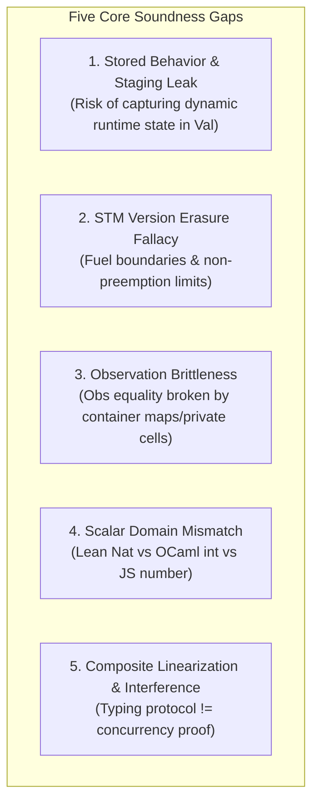
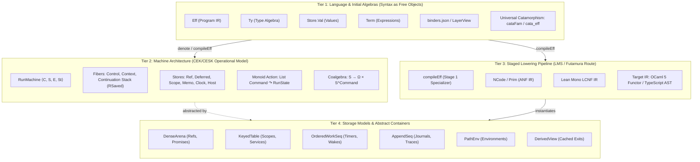
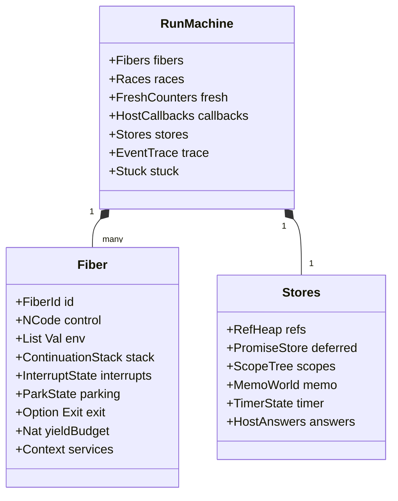
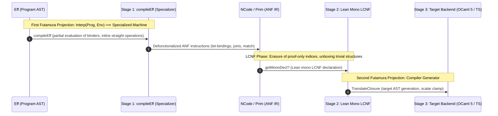
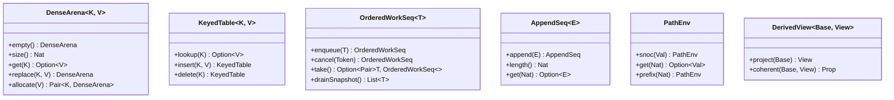
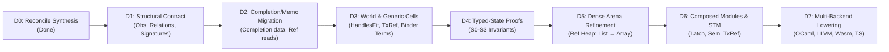

# Formal Architectural Audit, Component Map, and Staged Compilation Foundations

---

## 1. Executive Soundness Audit & Critical Gaps

The architecture synthesized in [`docs/research/2026-09-19-state-refinement-plan.md`](file:///Users/pooks/Dev/lean4-effect4/docs/research/2026-09-19-state-refinement-plan.md) and [`docs/core/machine-state.md`](file:///Users/pooks/Dev/lean4-effect4/docs/core/machine-state.md) successfully avoids ad-hoc complexity in three key ways:
1. **Rejection of Monolithic Storage:** It resists creating dedicated machine stores for `Queue`, `Mailbox`, `PubSub`, `Semaphore`, and `Cache`, strictly upholding [DI-11](file:///Users/pooks/Dev/lean4-effect4/docs/DESIGN-ISSUES.md) (composite `Eff` programs over primitive cells).
2. **Separation of the Four Semantic Edges:** It decouples meaning-to-machine, storage-to-model, LCNF-to-target syntax, and target-to-execution.
3. **World-Indexed Typing without Runtime Overhead:** Adopting `HandlesFit` (decisions rows 44–45) types cells at the logical world level $(\Gamma, \Pi, \mathrm{P})$ while preserving coarse runtime `Val`, matching Effect's runtime type erasure.

However, auditing the proposed plan against the codebase and literature reveals **five critical soundness gaps** that must be settled before pinning the typed-state ledger.



---

### Gap 1: Stored Behavior & Staging Closure Leaks (MetaOCaml / LMS)
* **The Vulnerability:** Several API families (`Cache`, `RequestResolver`, `Pool`, `ScopedCache`) store program routines for delayed execution. Section 6 of the plan notes that `Stores.Capture` ([`Stores.lean:134-142`](file:///Users/pooks/Dev/lean4-effect4/src/Effect4/Machine/Stores.lean#L134-L142)) holds runtime execution details: `env`, `fuel`, `tape`, and `context`. Promoting this `Capture` record into a `Val` constructor would violate the bedrock representation rule of the repository:
  > **"Canonical program content is first-order data. Lean functions, Expr, host closures, promises, and runtime objects are not stored program syntax."** ([`AGENTS.md`](file:///Users/pooks/Dev/lean4-effect4/AGENTS.md))
* **Sound Staging Solution:** Following MetaOCaml (Taha & Sheard) and Lightweight Modular Staging (Rompf & Odersky):
  - Stored behavior must be a **defunctionalized code reference** (content digest $\mathcal{H}(e)$ + positional entry index) paired with a typed lexical environment vector `List Val`.
  - Stored code cannot carry dynamic execution capabilities, fuel budgets, or host closures. Dynamic invocation must explicitly supply the calling fiber's dynamic fuel and execution context while restoring only the closed lexical scope.

---

### Gap 2: STM Version Erasure Fallacy & Fuel Frontiers
* **The Vulnerability:** The STM scout proposed erasing version tracking based on running transactions under `PreventSchedulerYield`. In our operational machine, this is unsound for three reasons:
  1. **Fuel Exhaustion as an Unfinished Frontier:** The machine steps with finite fuel. When fuel is exhausted mid-transaction, execution halts at a live frontier. If the open transaction buffer does not maintain exclusive ownership across refuel cycles, an interleaved host decision or scheduled task can resume another fiber or start a conflicting transaction, destroying serializability.
  2. **Indirect Preemption:** Disabling automatic scheduler ticks does not prevent inline `Deferred.completeWith`, observer delivery, interrupts, or external host calls from executing another fiber before commit.
  3. **Wake-on-Access vs. Latch Coalescing:** In rc.112 (`Effect.ts:24343-24354`), commit visits cells in journal order and wakes *all* callbacks of *every accessed cell* (even read-only, unmodified cells) at priority 0. Substituting a coalesced `Latch` broadcast violates wakeup semantics and changes scheduling interleavings.
* **Soundness Rule:** Version erasure is sound **only** under:
  - An admitted strictly pure / `TxRef` fragment that transitively excludes fiber creation, parking, and inline observer delivery.
  - A persistent single-owner invariant maintained across fuel exhaustion boundaries.
  - Dynamic access list tracking matching executed accesses.
  - Selective rollback: transactional buffered writes revert, but allocations and admitted ordinary `Ref` writes persist.

---

### Gap 3: Observation Brittleness & Container Refinement
* **The Vulnerability:** The frozen machine observation `Obs` ([`Laws/Machine/Behaviour.lean:29-50`](file:///Users/pooks/Dev/lean4-effect4/src/Effect4/Laws/Machine/Behaviour.lean#L29-L50)) observes every fiber exit *and the entire concrete `Stores` record*. Replacing ordered association lists with sorted/deduplicated maps, adding a `TxOpen` buffer, or spawning helper fibers immediately breaks equality under `Obs`.
* **Soundness Rule:** We must formally stratify observations before changing data structures:
  $$\mathrm{Obs}_{\mathrm{semantic}} \sqsubset \mathrm{Obs}_{\mathrm{holder}} \sqsubset \mathrm{Obs}_{\mathrm{diagnostic}}$$
  - **$\mathrm{Obs}_{\mathrm{semantic}}$:** Public exits, typed causes, external side effects, termination vs. live frontier.
  - **$\mathrm{Obs}_{\mathrm{holder}}$:** Command journal (`List Command`), request/answer correspondence, supervisor topology.
  - **$\mathrm{Obs}_{\mathrm{diagnostic}}$:** Frame events, internal scheduler queues, allocators (erasable).
  Container refinement is proved as a simulation over $\mathrm{Obs}_{\mathrm{semantic}}$ or $\mathrm{Obs}_{\mathrm{holder}}$, never raw `Stores` equality.

---

### Gap 4: Scalar Domain Mismatch Across Backends
* **The Vulnerability:** Lean `Nat` is unbounded $\mathbb{N}$. Lowered OCaml targets emit 63-bit signed `int` (with host wrapping or clamped arithmetic in [`Translate.lean`](file:///Users/pooks/Dev/lean4-effect4/src/OCaml5/Lcnf/Translate.lean)). JavaScript targets emit IEEE 754 double floats (exact integers up to $2^{53}-1$) or `BigInt`.
* **Soundness Rule:** LCNF and target lowering cannot assume mathematical $\mathbb{N}$ without an explicit domain contract. Fresh handle allocation, timer deadlines, priority queues, and intermediate computations must either:
  1. Prove a closed domain bound: $\forall s \in \mathrm{Reachable}, \mathrm{val}(s) < 2^{62}-1$.
  2. Emit target-checked saturating/widening arithmetic with explicit refusal at overflow boundaries.

---

### Gap 5: Composite Linearization & Interference Protocols
* **The Vulnerability:** Under DI-11, modules like `Semaphore`, `Queue`, and `PubSub` are composite `Eff` programs. A typing certificate (`HasTy`) only guarantees that operations produce well-typed values; it proves **nothing** about mutual exclusion, linearizability, deadlock freedom, or FIFO fairness.
* **Soundness Rule:** Each composed module must declare:
  1. An abstract state model $S_{\mathrm{spec}}$ and abstract operations.
  2. A representation invariant $I(s)$ over the underlying `Ref`/`Deferred`/`Latch` cells.
  3. A linearization point (typically an atomic `refModify` binder term).
  4. An interference lemma: arbitrary concurrent steps of other fibers preserving $I(s)$ do not invalidate the module's progress or safety.

---

## 2. Plain Formal Architecture Map: The 4 Tiers

Effect4 is structured into four non-overlapping tiers:



---

### Tier 1: Language & Sorts (Initial Algebras & Universal Folds)

In accordance with [`docs/core/ontology.md`](file:///Users/pooks/Dev/lean4-effect4/docs/core/ontology.md), syntax is modeled strictly as **initial algebras** over signatures presented as data:

| Sort | Free Object Carrier | Signature as Data | Universal Fold (Catamorphism) | Law / Uniqueness |
| :--- | :--- | :--- | :--- | :--- |
| **Program** | `Eff` ([`Program/Eff.lean`](file:///Users/pooks/Dev/lean4-effect4/src/Effect4/Program/Eff.lean)) | `binders.json` $\to$ `LayerView` (`ArgSort`, `makers`) | `cataFam` / `cata_eff` | $\mathrm{hom\_eq\_cata\_eff}$ (universal algebra map) |
| **Type** | `Ty` ([`Program/Ty.lean`](file:///Users/pooks/Dev/lean4-effect4/src/Effect4/Program/Ty.lean)) | 20 constructors (structural, inductive) | `cata_ty` | Monotone instantiation via `AdmitsSub` |
| **Term** | `Term` ([`Machine/Term.lean`](file:///Users/pooks/Dev/lean4-effect4/src/Effect4/Machine/Term.lean)) | Positional de Bruijn binders, 33 atoms | `cata_term` / `argTy` | Evaluated at positional environment $env$ |
| **Value** | `Store.Val` ([`Store/Shape.lean`](file:///Users/pooks/Dev/lean4-effect4/src/Effect4/Store/Shape.lean)) | Inductive carrier classified by `Shape` | `Canonical` instances | Exact embeddings `ofVal_toVal` / `ofVal_exact` |
| **Run** | `List Command` | Free monoid $(\Sigma^*, \cdot, \varepsilon)$ | `Run.play` | Monoid action: $c_1 \cdot c_2 \triangleright s = c_2 \triangleright (c_1 \triangleright s)$ |

#### The Graded Program Category at `Eff`
The semantic category of programs has objects $A, B \in \mathrm{Ty}$. A morphism $p \in \mathrm{Hom}(A, B)$ is an `Eff` term satisfying:
$$\mathrm{effTy}(\sigma, \Gamma \mathbin{+\!+} [A], p) = \mathrm{some}\langle B, E, R \rangle$$
graded by $(E, R)$ in the join-semilattice $(\mathrm{Ty.union}, \mathrm{Requirement.union})$.
- **Identity:** $\mathrm{succeed}(\mathrm{var}(0))$
- **Composition:** $\mathrm{bind}(p, f)$
- **Monad Laws (satisfied at denotation):**
  1. $\mathrm{denote}(\mathrm{bind}(\mathrm{succeed}(x), f)) = \mathrm{denote}(f(x))$
  2. $\mathrm{denote}(\mathrm{bind}(p, \mathrm{succeed})) = \mathrm{denote}(p)$
  3. $\mathrm{denote}(\mathrm{bind}(\mathrm{bind}(p, f), g)) = \mathrm{denote}(\mathrm{bind}(p, \lambda x.\, \mathrm{bind}(f(x), g)))$

---

### Tier 2: Machine Architecture (CEK/CESK Operational Model)

The runtime execution model is a **CEK / CESK Abstract Machine** (Control, Environment, Store, Kontinuation), formalized as a Moore Machine coalgebra:
$$\mathcal{M} = \langle S, \Omega, \mathrm{Command}, \mathrm{step}, \mathrm{observe} \rangle$$
where $\mathrm{step} : S \times \mathrm{Command} \to S$ and $\mathrm{observe} : S \to \Omega$.



#### Defunctionalization of Continuations
In traditional interpreters, continuations are higher-order closures $(\alpha \to \beta)$. In Effect4, continuations are **defunctionalized** (Reynolds 1972) into first-order data:
```lean
inductive ScopeFrame where
  | bind (cont : ContId) (env : List Val)
  | catch (cont : ContId) (env : List Val)
  | ensure (finalizer : FinalizerId)
```
The continuation stack `RSaved` is a pure list of `ScopeFrame`s. The machine's `resume` transition is a total first-order function dispatching on the constructor of the frame, guaranteeing:
1. Complete serializability and replayability of paused execution states.
2. Invariant preservation under storage migration without closure capture.
3. Preservation of memory safety under bounded fuel.

---

### Tier 3: Staged Lowering Pipeline (LMS & Futamura Projections)

The compilation of `Eff` into executable target code is grounded in the **Futamura Projections**:



#### Theoretical Grounding in Staged Compilation Literature

1. **Lightweight Modular Staging (LMS) — Rompf & Odersky (2010):**
   - LMS separates staging-time computations from run-time computations via types: expressions computed statically are standard types $T$, while delayed expressions generate dynamic code of type $\mathrm{Rep}[T]$.
   - In Effect4, `Authoring` and `compileEff` execute the static staging phase: type checking (`effTy`), variable scope resolution, and binder checking occur at compile-time. Dynamic operations lower to `NCode` and `NativeOp`.
   - **Soundness Invariant:** Staging-time expressions must never leak dynamic variables into closed scopes, guaranteed by de Bruijn positional scoping in `Term`.

2. **Cross-Stage Persistence (CSP) — MetaOCaml (Taha & Sheard 2000):**
   - MetaOCaml formalizes that values referenced inside staged brackets `.⟨ ... ⟩.` from an outer stage must be serializable or persistent.
   - In Effect4, CSP is strictly enforced by the rule: **No host closures across stages.** If an `Eff` program retains a behavior (e.g., in a `Cache` or `Resolver`), it cannot embed a Lean lambda or host JS closure; it must persist as a first-order program reference (content digest $\mathcal{H}(e)$) and an explicit environment vector.

3. **ANF / LCNF Lowering & Let-Insertion:**
   - To prevent code duplication during staged expansion, intermediate computations are lowered to Administrative Normal Form (ANF) / Lean's Constructor Normal Form (LCNF).
   - All complex arguments are let-bound:
     $$\mathrm{let}\; x := v;\; k(x)$$
   - Join points (`jp`) model branch mergers without duplicating continuations, compiling directly to local jumps in OCaml and loops/trampolines in TypeScript.

---

### Tier 4: Abstract Storage Interfaces & Simulation Contracts

Rather than a single universal monolithic store or direct raw arrays, storage is factored into **six small, lawful abstract container interfaces**:



#### Precise Refinement & Simulation Laws
For exact containers (e.g., `DenseArena`), refinement is established by an abstraction function $\alpha : C \to M$ and a well-formedness invariant $\mathrm{WF}(c)$:
$$\mathrm{WF}(c) \implies \mathrm{get}_C(c, k) = \mathrm{get}_M(\alpha(c), k)$$
$$\mathrm{WF}(c) \implies \alpha(\mathrm{replace}_C(c, k, v)) = \mathrm{replace}_M(\alpha(c), k, v)$$
$$\mathrm{WF}(c) \wedge \mathrm{alloc}_C(c, v) = (k, c') \implies \mathrm{alloc}_M(\alpha(c), v) = (k, \alpha(c')) \wedge \mathrm{WF}(c')$$

For order-quotienting containers (e.g., `KeyedTable` deduplicating entries or `Memo` maps), refinement is established via a simulation relation $\mathrm{Rel} \subseteq C \times M$:
$$\mathrm{Rel}(c, m) \wedge \mathrm{step}_C(c, i) = (o_C, c') \implies \exists o_M\, m',\; \mathrm{step}_M(m, i) = (o_M, m') \wedge \mathrm{OutputRel}(o_C, o_M) \wedge \mathrm{Rel}(c', m')$$

---

## 3. Grounding Solutions for Open Decisions (Rows 78–83)

| Decision Row | Core Question | Literature & Semantic Grounding | Concretely Approved Architecture |
| :--- | :--- | :--- | :--- |
| **Row 78: Completion Data & Memo** | Store completions as data; eliminate duplicate memo syntax. | Reynolds Defunctionalization & CEK State. | Migrate promise cells from raw code to `Completion` data carrier. Delayed `ofRefGet` reads are preserved as a deferred completion constructor. Memo duplicate elimination is justified by a cell-based census projection. |
| **Row 79: Stratified Observation** | Which observation is preserved when swapping containers or expanding APIs? | Coalgebraic Simulation & CompCert Preservation Contract. | Partition observations: preserve $\mathrm{Obs}_{\mathrm{semantic}}$ and $\mathrm{Obs}_{\mathrm{holder}}$ under simulation relations; erase internal diagnostic traces. Private helper fibers and internal cells are existentialized under a handle-hiding simulation relation. |
| **Row 80: Transaction Control & Admission** | Atomic profile vs. versioned STM; version erasure conditions. | Harris-Marlow-Jones STM & Non-preemptive Atomicity. | Adopt the atomic transaction profile over an admitted pure/`TxRef` fragment. Maintain single-fiber ownership across fuel exhaustion frontiers. Strictly preserve rc.112's all-cell wake-on-access semantics. Rollback is selective: buffered writes revert; external allocations persist. |
| **Row 81: Scheduled Wake (Latch)** | Scheduled wake primitive for composed modules. | Asynchronous Event Loop & Task Batching Semantics. | Formalize `Latch` as a primitive with: (1) pending and captured batch cancellation, (2) coalescing, and (3) opener dispatcher ownership. Explicitly acknowledge that `Latch` does not subsume counted `Pool` wakes or `Semaphore` re-parking. |
| **Row 82: Stored Behavior Values** | Storing code in Cache, Pool, RequestResolver. | MetaOCaml Cross-Stage Persistence & LMS Staged Functors. | Settle behavior values as `Val.codeRef(digest, entry, env)` where `digest` references an admitted `Eff` module, `entry` is a positional entry point, and `env : List Val` is the closed lexical environment. Reject embedding the dynamic `Capture` record into `Val`. |
| **Row 83: Clock & Random Profiles** | Context services for time and pseudo-randomness. | Deterministic Replay & Capability-Passing Semantics. | Keep the logical clock in `Stores`. Model pseudo-randomness as a versioned, seeded generator stored in an ordinary `Ref` behind a context capability. Refuse unseeded host nondeterminism on replay lanes. |

---

## 4. Rigorous Acceptance Criteria & Verification Sequence

The planned sequence (D0–D7) is structured to prevent circular dependencies and premature verification:



### Finishing Criteria for Milestone (D1–D4):
1. **Zero Axiom Drift:** All machine, typing, and simulation proofs must remain strictly within `[propext, Quot.sound]`.
2. **First-Order Purity:** No closure, host object, or dynamic capture admitted into `Val` or `Eff`.
3. **Soundness of S0–S3:**
   - **S0:** Formal statement of `MachineOk` invariant relating world $(\Gamma, \Pi, \mathrm{P})$, fibers, and stores.
   - **S1:** Typing of residuals: execution of well-typed instructions preserves world compatibility.
   - **S2:** Scheduler step preservation: interleaving of concurrent fibers maintains `MachineOk`.
   - **S3:** Transfer through `BMeans`: compiled machine exits match reference machine denotations under complete decision tapes.

---

## Key Open Questions for Your Direction

Before proceeding to slice D1, which aspects of this grounding would you like to prioritize?
1. **Stored Behavior Values (Row 82):** Are you aligned with the defunctionalized `Val.codeRef(digest, entry, env)` model (grounded in MetaOCaml CSP) over promoting the dynamic `Capture` record?
2. **Stratified Observation (Row 79):** Should we formally define $\mathrm{Obs}_{\mathrm{semantic}}$ (public exits, causes, termination) and $\mathrm{Obs}_{\mathrm{holder}}$ (journal replay, supervisor topology) in [`src/Effect4/Laws/Machine/Behaviour.lean`](file:///Users/pooks/Dev/lean4-effect4/src/Effect4/Laws/Machine/Behaviour.lean) as the standard for container simulation proofs?
3. **STM Admission Profile (Row 80):** Shall we proceed with the pure/`TxRef` single-owner atomic profile with fuel-frontier preservation and selective rollback, while reserving general concurrent preemption for a later target profile?