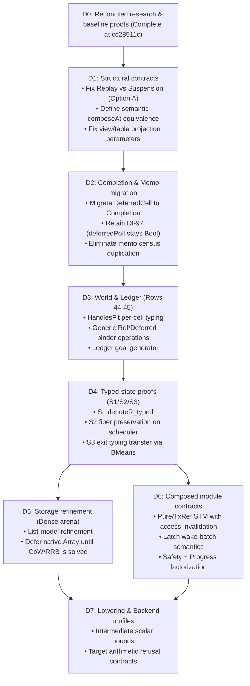

# Architectural Audit: State Refinement Implementation Plan and Catamorphism Fusion Analysis

**Date:** 2026-09-19  
**Target Commit Base:** `cc28511c`  
**Documents Audited:**
- `docs/research/2026-09-19-state-refinement-plan.md`
- `docs/research/2026-09-19-critique-response.md`
- `docs/core/machine-state.md`
- `docs/core/decisions.md` (Rows 40, 41, 44–45, 78–83)
- `docs/core/traversal-census.md`
- `vendor/effect-4.0.0-rc.112`

---

## PART I: Audit of the State Refinement Implementation Plan

### 1. Executive Summary & Proved Baselines at `cc28511c`

The critique response merged at `cc28511c` corrected significant theoretical and categorical overclaims. Six concrete technical baselines were verified directly in Lean 4 and target environments:

1. **Scope-Correct Composition**: `Contracts.composeAt_typed` was proved under axioms `[propext, Quot.sound]` using the existing weakening operator (`Eff.weaken`).
2. **Environment Transport**: `TermTransport.evalTerm_weaken` established term evaluation transport under variable insertion without scoping or typing preconditions.
3. **Simulation Safety Direction**: `Contracts.transfer_safety` proved that universal property transfer requires implementation-to-specification inclusion ($\text{Beh}_{\text{impl}} \subseteq \text{Beh}_{\text{spec}}$); a countermodel confirmed that reverse inclusion fails to transfer safety.
4. **Observation Factorization**: `Contracts.Factors` formalized observation preorders; `ObservationTx.bornAsChild` showed that supervisor status reads trace fork history, proving that frozen `obs` does not unconditionally factor through holder supervision.
5. **Fuel Boundary Residue Loss**: `ObservationTx.restarted` demonstrated that `stepDecisionState` discards command residue upon fuel exhaustion.
6. **Scalar Domain Hazards**: Finite OCaml and JS probes proved intermediate arithmetic overflow, saturation fresh-handle repetition, and JS Number precision loss.

Auditing the implementation plan (`state-refinement-plan.md`) across slices **D1–D7** against the live codebase reveals **six core architectural traps** that must be resolved.

---

### 2. Core Findings and Empirical Probes

#### Finding 1: The Continuation / Resumption Gap Blocks the Transaction Specification (Slices D1 & D6)

* **Plan Assumption** (`state-refinement-plan.md` §7, line 296):
  > *"3. One owner holds the attempt through residual commands and fuel exhaustion. Refueling does not release ownership or convert the attempt into a typed failure."*
* **The Probe**:
  In `docs/research/2026-09-19-critique/ObservationTx.lean`:
  ```lean
  def short := stepDecisionState (interpOf p) 1 initial Api.evaluate
  def restarted := stepDecisionState (interpOf p) 400 short.1 Api.evaluate
  #guard short.2 = false
  #guard (short.1.fiber? Api.root).map RunFiber.running = some true
  #guard restarted.2 = true
  #guard (restarted.1.fiber? Api.root).bind RunFiber.exit = none
  ```
  Inspecting `src/Effect4/Machine/Fibers.lean:1802`:
  ```lean
  | Cmd.evaluate id, rest =>
    match m.fiber? id with
    | some f =>
      if f.exit.isSome || f.running || f.parked != Parked.notParked then (m, rest)
      ...
  ```
  When fuel is exhausted in `driveState`, `f.running` is left `true`. The residual command list (`[Cmd.loop root false, Cmd.drainDue]`) is discarded by `stepDecisionState`, `HostSession.advance`, and `Runner.step`. Any subsequent `Cmd.evaluate` sees `f.running == true` and **drops the command as a no-op**. The fiber remains a zombie forever.
* **Architectural Trap**:
  The running machine currently **cannot resume** an interrupted command. Attempting to specify an "open transaction owner across fuel refuels" in `Session` is impossible without fundamentally altering the runner layer.
* **Prescription for D1**:
  Before specifying transactional attempt ownership in D6, D1 must formally rule between:
  - **Option A (Finite Replay Contract — Recommended)**: Reaffirm that runs are parameterized by a fixed `Api.Budget`. Fuel exhaustion is an unfinished observation frontier. The *only* way to provide more fuel is to re-run from the initial state with a higher budget via `journal_replays`. Under Option A, transactions never experience "in-flight refueling."
  - **Option B (Suspended Driver Continuation)**: Redefine `Run.session` to preserve `(RunMachine, List (Cmd ...), DispatcherSnapshot)`. This requires re-proving the monoid action theorems of `Laws/Run.lean` over suspended continuations.

---

#### Finding 2: Monadic vs Categorical Associativity of `composeAt` (Slices D0 & D1)

* **Plan Assumption** (`critique-response.md` §2, lines 77–82):
  > *"Then prove identity/associativity for composeAt at that meaning... Raw Ty.union is a syntax constructor; grade joins use Ty.join..."*
* **The Probe**:
  Probing whether `composeAt` satisfies definitional or syntactic associativity in Lean:
  ```lean
  def left := composeAt ctx (composeAt ctx a b) c
  def right := composeAt ctx a (composeAt ctx b c)
  ```
  Syntactically:
  - `left` is `bind (bind a (b.weaken |ctx|)) (c.weaken |ctx|)`
  - `right` is `bind a ((bind b (c.weaken |ctx|)).weaken |ctx|)`
  
  These are structurally distinct ASTs. When evaluated through `Denote.meaning`, they produce identical results by `rfl` on tested straight-line terms. However, in `Laws/Program/Means.lean:570-637`, `bind_assoc` is proved only for the semantic free monad `Effects.Program`, **never for `Eff` syntax**.
* **Architectural Trap**:
  `composeAt` forms a Category / Arrow on `Eff` **only up to semantic equality modulo a named observation**, never up to syntactic AST identity.
* **Prescription for D1**:
  Do not attempt to prove syntactic AST equality `composeAt Γ (composeAt Γ p q) r = composeAt Γ p (composeAt Γ q r)`. State associativity as semantic equivalence over the admitted `Straight` and `Looped` fragments.

---

#### Finding 3: The Completion Migration Collision with `ofRefGet` and `Deferred.poll` (Slice D2)

* **Plan Assumption** (`state-refinement-plan.md` §4, lines 163–164):
  > *"Narrowing the carrier also does not turn poll into a stored-exit query: ofRefGet is not yet an exit, so poll needs its own result contract."*
* **The Probe**:
  Probing rc.112 with Bun:
  ```typescript
  const d = yield* Deferred.make();
  const ref = yield* Ref.make(99);
  yield* Deferred.completeWith(d, Ref.get(ref));
  const polled = yield* Deferred.poll(d);
  // => Some({ _id: "Effect", op: "Sync", ... })
  ```
  In rc.112, `Deferred.poll` returns `Option (Effect A E)`.
  In Effect4 currently:
  - `DeferredStore.poll` returns `Option (Option Program)`.
  - `Stores.lean:1945` maps this to `Val.bool slot.isSome`, making `SyncOp.deferredPoll` a duplicate of `SyncOp.deferredIsDone` (DI-97).
  - `Completion` is defined as `ofExit (exit : Exit ...)` or `ofRefGet (cell : RefKey)`.
* **Architectural Trap**:
  If D2 replaces `DeferredCell.completion : Option Program` with `Option (Completion ...)`:
  1. If `completion` is `.ofRefGet cell`, it is **not an Exit**.
  2. If `poll` is changed from returning `Bool` to returning `Option Exit`, it **cannot answer `.ofRefGet` without reading the heap**. But store step transitions (`syncOpStep`) are pure non-effectful steps.
  3. If `poll` returns `Option Completion`, it exposes private `RefKey` identities into the value language.
* **Prescription for D2**:
  Preserve DI-97 explicitly: `deferredPoll` remains an alias for `isDone` returning `Bool`, or is retired. Do not attempt to make `Deferred.poll` return an `Exit` while `ofRefGet` remains in the completion alphabet.

---

#### Finding 4: The rc.112 STM "Wake-on-Access" Phenomenon (Slice D6 / Row 80)

* **Plan Assumption** (`state-refinement-plan.md` §7, line 303):
  > *"Commit updates atomically and owes the specified scheduled actions. rc.112 wakes waiters of every accessed cell, even unchanged/read-only cells, on the committer's dispatcher."*
* **The Probe**:
  Executing a live Bun probe against `vendor/effect-4.0.0-rc.112`:
  ```typescript
  // Waiter fiber retries on r1 and r2
  // Committer executes a 100% READ-ONLY transaction:
  yield* Effect.tx(Effect.gen(function* () {
    yield* TxRef.get(r1);
    yield* TxRef.get(r2);
  }));
  ```
  **Result**: The waiter fiber **woke and retried immediately** upon commit of the read-only transaction (`attempts after read-only tx commit: 2`).
  
  In `vendor/effect-4.0.0-rc.112/src/Effect.ts:24343-24354`:
  ```typescript
  function commitTransaction(fiber, state) {
    for (const [ref, { value }] of state.journal) {
      if (value !== ref.value) { ref.version++; ref.value = value; }
      for (const pending of ref.pending.values()) {
        fiber.currentDispatcher.scheduleTask(pending, 0);
      }
      ref.pending.clear();
    }
  }
  ```
  Because `TxRef.get` enters `state.journal` via `modify(identity)`, reading a cell marks it in `state.journal`. At commit, **every accessed cell has its pending tasks scheduled, even if no write occurred**.
  
  Furthermore, because the waiter registered the same task across all accessed cells, `scheduleTask` is called $N$ times. The callback closure in rc.112 is protected by `if (resumed) return` (`internal/effect.ts:1118`), so the fiber resumes once, but the committer's dispatcher queue receives duplicate tasks.
* **Architectural Trap**:
  Standard textbook STM theorems (which assume only modified cells trigger invalidation) **do not model rc.112**.
* **Prescription for D6**:
  The atomic transaction specification must explicitly model **access-based invalidation**. If the Effect4 engine optimizes this to write-only invalidation, that optimization must be recorded as a documented deviation under a coarser observation quotient, not claimed as an exact simulation of rc.112.

---

#### Finding 5: The OCaml `Array` Lowering Performance & CoW Trap (Slices D5 & D7)

* **Plan Note** (`state-refinement-plan.md` §11, line 502):
  > *"verify generated OCaml uses the intended carrier primitives (Array currently lowers to List), and measure separately..."*
* **The Probe**:
  Examining `src/OCaml5/Lcnf/Translate.lean:238-255` and `Types.lean:59`:
  ```lean
  | `Array.push => some (2, fun | [a, x] => .binop "@" a (.listLit [x]) | _ => .unit)
  | `Array.uget | `Array.fget => some (call2 "List.nth")
  ```
  Lean's `Array` is translated directly to OCaml `list`!
  `Array.push` compiles to `a @ [x]` ($O(N)$ append), and `Array.uget` compiles to `List.nth` ($O(N)$ search).
* **Architectural Trap**:
  Replacing `List` with Lean `Array` in D5 for "performance" will make compiled OCaml code **slower** ($O(N^2)$ for sequential pushes).
  Conversely, lowering Lean `Array` to native mutable OCaml `array` would violate snapshot isolation: as proven in `scalars-storage-review.md:85`, in-place mutation of a shared carrier payload mutates all past historical snapshots stored in `Stores` and `Run`.
* **Prescription for D5 & D7**:
  Do not introduce Lean `Array` into `Stores` until the LCNF compiler implements functional persistent vectors (e.g. RRB-trees) or an explicit uniqueness certificate guaranteeing no live aliases exist in historical snapshots.

---

#### Finding 6: Directionality & Progress in Module Simulation (Slice D6 / Row 79)

* **Plan Statement** (`critique-response.md` §4, lines 159–174):
  > *"For compiler/storage safety, the proposed behavior obligation has this direction: InitialRel ... ImplementationBehavior ... ∃ SourceBehavior ... ObservationRel ... transfer_safety proves the universal-property transfer from this direction... Equality requires the other inclusion too."*
* **The Probe**:
  In `ObservationTx.lean:51-60`, a countermodel shows that a system satisfying $\text{ImplStep} \to \text{SpecStep}$ can spin infinitely while the specification has terminated.
* **Architectural Trap**:
  For composite modules (`Semaphore`, `Queue`, `PubSub`, `TxRef`), proving $\text{Beh}_{\text{impl}} \subseteq \text{Beh}_{\text{spec}}$ ensures safety (no bad states, invariant preservation). But it **does not prevent deadlock or starvation**. A trivial implementation that immediately exhausts fuel or returns `.frontier` satisfies safety inclusion.
* **Prescription for D6**:
  Module contracts in D6 must be structured into two non-conflated proof obligations:
  1. **Safety Transfer**: $\forall t \in \mathrm{Beh}_{\mathrm{impl}}, \exists s \in \mathrm{Beh}_{\mathrm{spec}}, \mathrm{Rel}(s, t)$ under interface world $W$.
  2. **Step Progress**: For any unblocked abstract step $\mathrm{SpecStep}(s, s')$, there exists a finite non-empty concrete trace $\mathrm{ImplStep}^+(t, t')$ reaching related state $t'$.

---

### 3. Adjusted Landing Sequence (D0–D7)



---

## PART II: Analysis of Catamorphism Fusion for the Language Algebra

### 1. The Catamorphism Fusion Principle

In initial algebra semantics, catamorphism fusion states:
$$\text{Given } h : A \to B, \quad h \circ \alpha = \beta \circ F(h) \implies h \circ \mathrm{cata}(\alpha) = \mathrm{cata}(\beta)$$

In `src/Effect4/Program/Fold.lean`, initiality / uniqueness theorems are already generated for each sort:
- `hom_eq_cata_eff` (`Fold.lean:1270`)
- `hom_eq_cata_ty` (`Fold.lean:101`)
- `hom_eq_cata_term` (`Fold.lean:635`)

---

### 2. Where Fusion Actually Helps

1. **Closed, Non-Binding Syntactic Pipelines**:
   For simple AST-to-AST rewrites or static property extraction on closed terms (e.g. `renderRaw ∘ normalize` on `Ty`, or AST size/depth measures), catamorphism fusion avoids writing a separate $N$-case inductive proof. Showing that $h$ preserves the algebra constructors automatically yields function composition equality.
2. **Automated Deforestation**:
   Composing two generated AST folds produces a single fused fold, eliminating intermediate tree allocation in execution passes.
3. **Algebra Agreement**:
   Two folds on the same carrier agree if their algebra records agree (`hom_eq_cata_eff`), avoiding $N \times M$ pairwise agreement proofs.

---

### 3. Where Fusion Breaks Down on `Eff`

#### A. Lexical Scoping and Functional Carriers
`Eff` is an open term language with de Bruijn positional binders (`bind`, `gen`, `iterate`, `acquireRelease`).
Traversals like `Checker.check` or `Denote.denote` carry functional types:
$$\mathrm{Carrier} = \mathrm{TyEnv} \to \mathrm{List}\;\mathrm{Nat} \to \mathrm{Except}\;\mathrm{TypeRefusal}\;\mathrm{EffTy}$$
Because the environment $\Gamma$ grows inside continuations ($\Gamma \mathbin{+\!+} [A]$ in `bind`), the algebra map $h$ is an environment-indexed family of natural transformations. Proving that this family commutes with constructor application requires proving the exact same variable-shifting and environment-transport lemmas (`lookup_weaken`) that close direct structural induction. **Fusion does not eliminate the hard list arithmetic.**

#### B. Direct Structural Induction Is Already Cheaper
Comparing `evalTerm_weaken` in `TermTransport.lean`:
- **Direct Match**: Proved in **18 lines** across `Term` and `Terms` using standard structural pattern matching.
- **Via Catamorphism Fusion**: Requires defining `TermAlgebra` for `evalTerm`, the algebra for `weaken`, instantiating `TermAlgebra.hom`, verifying the homomorphism condition on all constructors, and applying `cata_term_fusion` (~80 lines of boilerplate).

#### C. Zero Leverage on Runtime Machine and Concurrency
The Effect runtime is **not a catamorphism on `Eff`**:
- `RunMachine`, `Stores`, and `Fibers` form a stateful transition system (a coalgebra over commands: $S \to \Omega \times S^{\mathrm{Command}}$).
- Fiber suspension, parking tokens, dispatcher queues, and fuel exhaustion live entirely outside catamorphic folds.
- Fusion cannot prove that an atomic transaction attempt remains isolated, that a latch wake preserves order, or that a fiber exit satisfies the typed-state invariant.

---

### 4. Repository Authority & Prior Decisions

The repository already completed a large-scale fold migration (converting 65 hand traversals to folds using `Program/FoldOf.lean`, documented in `docs/core/traversal-census.md`).

On 2026-09-18, the owner explicitly closed that campaign:

1. **Decisions Row 40** (`docs/core/decisions.md:86`):
   > *"Closed 2026-09-18 (owner): the remaining thirteen exemptions (`compileEff`'s five, the reference evaluator's five, `valCode`, `ofSchema`, the derived instance) stay as they are, tracked in census §7.4; **nothing is converted for uniformity's sake — a hand definition that is not a fold is not thereby wrong**."*
2. **Decisions Row 41** (`docs/core/decisions.md:88`):
   > *"The coherence milestone, restated from the owner (2026-09-18): **not a gate and not uniformity**. The question is which proof obligations back the claims the API makes... **The concurrent alphabet's statement is the milestone**."*

---

### 5. Final Strategic Recommendation

| Area | Does Fusion Help? | Why / Why Not |
|---|---|---|
| **`Ty` & `Term` syntax simplifiers** | **Yes (minor)** | Useful locally if rewriting type normalization or atom argument packing. |
| **`Eff` composition (`composeAt`)** | **No** | Requires environment-dependent transport lemmas (`lookup_weaken`) regardless of representation. |
| **Compiler lowering (`compileEff`)** | **No** | Explicitly ruled an exemption in Row 40; the 1,900-line agreement proof is stated against its current structural form. |
| **Typed-State Milestone (S0–S3)** | **Zero** | Requires preservation of `HandlesFit` across operational scheduler steps, not AST folding. |
| **Transactions & STM** | **Zero** | Governed by journal access logs, driver continuation residue, and cell invalidation. |

**Strategic Verdict**: Do not reopen the algebra-conversion campaign. Keep the 13 tracked exemptions as they are (Row 40), and keep focus on **D1 (Replay vs. Suspension contract)** and **D3/D4 (the typed-state milestone S0–S3)**.
