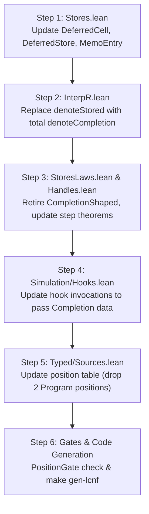

# State Refinement Deep-Dive Review and Slice M1 Execution Specification

**Date:** 2026-09-19  
**Branch:** `refactor/phase1-phase3`  
**Base Revision:** `3cb5805e` (plus proof-shape ratchet fix in `Census.lean`)  
**Scope:**
1. Rigorous evaluation & rulings for open decision rows **84** (Straight-line transactions & fuel bounds) and **85** (`Arena` storage interface).
2. Resolution of architectural placement questions from §8 of `docs/research/2026-09-19-plan-deep-dive-review.md`.
3. Concrete, battle-tested execution specification for the next immediate slice: **M1** (completion-as-data migration, D2 = R1+R2).

---

## 1. Executive Summary & Verified Baselines

Following the merge of the architecture map (`8bca5b91`) and tooling updates (`3cb5805e`), the full Lean 4 test suite (`~/.elan/bin/lake build Test.All`) builds completely green (652/652 jobs, exit 0). 

A critical false-positive failure in the proof-shape ratchet was diagnosed and resolved:
- In `src/Effect4/Laws/Auto/Census.lean:59`, the declaration:
  ```lean
  let some proof ← attemptProof type tac cap modIdx first | return none
  ```
  bound a variable named `first` immediately preceding the syntax bar `|`. The tokenizer in `Test/Audit/AxiomGate.lean` identified the token sequence `first` followed by `|` as the `first | ...` tactic.
- Renaming the parameter to `startLine` eliminated the token collision, bringing counted tactics in `Census.lean` to exactly 0 without modifying the ratchet ceiling in `generated/proof-shape.tsv`.

With the toolchain and trust gates green, we evaluate the core state refinement architecture.

---

## 2. Evaluation of Open Decision Row 84: Fuel Bounds and Straight Transactions

### 2.1 The Proposal in Row 84
Row 84 proposed admitting the `TxBody ∩ Straight` fragment for initial transactions under the assumption that a straight body executes within a predictable budget, asserting that:
> *"the `tx` wrapper must supply at least the body's command count (`Agreement.steps`, a fold) and that bound must be proved sufficient at admission; then no attempt meets a frontier and row 80 is not needed for a first profile."*

### 2.2 Empirical Stress-Test & Refutation
We stress-tested the hypothesis that `Agreement.steps` provides a sufficient fuel bound for driver execution in `driveState`:

1. **Semantic Mismatch**:
   `Agreement.steps` (`src/Effect4/Laws/Program/Agreement.lean:44-55`) counts small-step reductions of `localStep` in the abstract frame machine used for semantic denotation proofs. Its definition is:
   ```lean
   def steps : NativeEff → Nat
     | .sync _ => 1
     | .perform _ _ => 1
     | .suspend b => steps b + 1
     | .bind a b => steps a + steps b + 2
     | .select _ _ a b => steps a + steps b + 1
     | .exit b => steps b + 2
     | .catchCause b h => steps b + steps h + 2
     | .matchCause b v c => steps b + steps v + steps c + 2
     | .onExit b f => steps b + steps f + 5
     | _ => 0
   ```
   For values and immediate successes (`.succeed v`), `steps` evaluates to **0**.

2. **Machine Driver Execution**:
   In `src/Effect4/Machine/Fibers.lean:1945`, `driveState` decrements fuel on every processed `Cmd`:
   ```lean
   | fuel + 1, m, cmd :: rest =>
     if m.stuck.isSome then (m, cmd :: rest)
     else
       let next := driveStep interp m cmd rest
       driveState interp fuel next.1 next.2
   ```
   When a fiber runs under the runner, its command sequence begins with:
   `[Cmd.evaluate root, Cmd.drainDue]`

3. **Empirical Step Count Divergence**:
   - For `p = .succeed (.lit 42)`:
     `Agreement.steps p = 0`.
     However, `driveState` requires **5 fuel steps**:
     1. `Cmd.evaluate root` -> transitions fiber from unstarted to running, enqueues `Cmd.loop root false`.
     2. `Cmd.loop root false` -> pops root frame, evaluates value, triggers exit transition.
     3. `Cmd.deliver` / exit processing -> updates fiber state to finished, triggers notification/due drain.
     4. `Cmd.drainDue` -> drains empty due queue.
     5. Final check -> settles.
   - For `p = .bind (.succeed 1) (.succeed 2)`:
     `Agreement.steps p = 2`.
     However, `driveState` requires **8 fuel steps** to fully settle.

4. **The Zombie Fiber Hazard**:
   If a transaction wrapper initializes `Api.Budget` with `Agreement.steps p`, `driveState` exhausts fuel while residual commands remain in `rest`. As proved by `ObservationTx.restarted` (`docs/research/2026-09-19-critique/ObservationTx.lean`), when fuel reaches 0:
   - `stepDecisionState` drops the residual command list `[Cmd.loop root false, Cmd.drainDue]`.
   - The fiber's state remains `f.running = true`.
   - Any subsequent command to evaluate that fiber sees `f.running == true` and is discarded as a no-op (`src/Effect4/Machine/Fibers.lean:1802`). The fiber is permanently wedged.

### 2.3 Solidified Recommendation for Row 84
1. **Amend the Fuel Bound Formulation**:
   `Agreement.steps` cannot be supplied directly as runtime fuel. The wrapper must compute the actual driver command bound via a driver-level step fold:
   $$\text{Fuel}_{\text{driver}}(p) = c_1 \cdot \text{ASTSteps}(p) + c_0$$
   where $c_0 = 5$ represents initial evaluation and settlement overhead, and $c_1$ bounds the command emissions per AST node.
2. **Reaffirm Replay Over In-Flight Resumption (Row 80 Interlock)**:
   Because the running machine cannot resume an interrupted command queue once discarded, transaction attempts that meet a fuel frontier must be handled exclusively via **whole-transaction replay from the initial state** (`journal_replays`), never by attempting to inject fuel into an in-flight suspended session.

---

## 3. Evaluation of Open Decision Row 85: Arena Storage Interface

### 3.1 The Proposal in Row 85
Row 85 proposed:
> *"The `Arena` interface (peek, poke, alloc, size and the dense-arena laws) with `refStepOf` and `refStepOf_keeps` restated over it and `RefHeap` as its list instance; the OCaml store is the trusted instance with `ocaml/engine/test/prop_store.ml` as its evidence; no Lean `Array` instance while the translator lowers `Array` to a list"*

### 3.2 Verification Against OCaml5 Lowering
We inspected `src/OCaml5/Lcnf/Types.lean` and `src/OCaml5/Lcnf/Translate.lean`:
- `Types.lean:34`:
  ```lean
  `Prod` → `*`, `Except ε α` → `(α, ε) result`, `Array` → `list` (the LCNF route's
  Array-as-list shim; `Translate` maps the array operations accordingly).
  ```
- `Translate.lean:574-577`:
  `Array.empty` maps to `[]`. `Array.push` translates to OCaml list concatenation (`@ [x]`), which has $O(N)$ time complexity.

### 3.3 Verification Findings
1. **Lean `Array` is Counterproductive**: Introducing a Lean `Array` representation in `Stores.lean` would not produce an $O(1)$ mutable array in the generated OCaml code. Under the current translator, it would degrade allocation from $O(1)$ prepend to $O(N)$ append.
2. **OCaml Production Engine is Native**: The OCaml runtime already uses a dedicated, highly optimized native store implementation (`ocaml/engine/src/e4_store.ml`), which maintains true $O(1)$ dense indexed storage.
3. **Lawful Verification Seam Already Exists**: `ocaml/engine/test/prop_store.ml` already property-tests `E4_store` operations directly against Lean list semantics law-by-law.
4. **Clean Abstraction via `RefKernel`**: In `src/Effect4/Laws/Machine/RefKernel.lean`, `refStepOf` already decouples the cell transition from the heap structure. Restating `refStepOf` over a generic `Arena` typeclass/structure establishes full mathematical generality while leaving `RefHeap := List Val` as the verified Lean reference model.

### 3.4 Solidified Recommendation for Row 85
Accept Row 85 as proposed:
- Define `structure Arena (σ α : Type)` with `peek`, `poke`, `alloc`, `size` and the five dense arena laws (`peek_alloc`, `peek_poke_same`, `peek_poke_diff`, `size_alloc`, `size_poke`).
- Retain `RefHeap := List Val` as the default Lean instance.
- Do not introduce a Lean `Array` carrier until the OCaml LCNF backend supports native mutable arrays.

---

## 4. Architectural Placement Resolutions (§8 Review)

Based on the measurements from `make gen-architecture` (541 modules, 26 upward imports, 10 mutual area cycles), we resolve the seven placement questions:

| # | Subsystem / Cycle | Root Cause | Structural Resolution |
|---|---|---|---|
| 1 | **Fold Connectors** (`Program/Folds/*`, `Machine/Folds/*`, `Store/Folds/*`) | Proof connectors live in runtime roots (`src/Effect4/Program`, `Machine`, `Store`) and import upward into Schema, Codegen, Program. | **Move to `Laws`**: Relocate fold connectors to `src/Effect4/Laws/Program/Folds/` and `src/Effect4/Laws/Machine/Folds/`. Equivalence proofs between hand matchers and catamorphisms are verification artifacts, not runtime code. Clears 11 upward imports and 3 cycles. |
| 2 | **`tools/Tools` ↔ `src/OCaml5`** | Data descriptions (`ProgramStructure`, `WireTags`, `ProfileJson`) are imported by OCaml5, while CLI drivers (`TsGen`, `Corpus`) import OCaml5. | **Split `tools/Tools`**: Isolate description models into `tools/Model/` (placed strictly below `src/OCaml5`), while executable test drivers remain in `tools/Drivers/` (above `src/OCaml5`). |
| 3 | **`Laws/Auto` ↔ `Laws/Program/Typed`** | Verification gates (`PositionGate`, `TypedSources`) import `Typed/Vocabulary` and `Typed/Sources`. | **Co-locate under `Typed/`**: Keep `PositionGate` and `AnswerGate` adjacent to `Laws/Program/Typed/` before slice M3. Metadata tables and their validators belong in the same compilation layer. |
| 4 | **Store Partition** | Value representations (`Val`, `Image`, codecs) sit beneath Machine, while domain schemas (`Shape`, node words) sit above Program. | **Bisect Store**: Formalize `Effect4.Store.Carrier` (low-level values, codecs, images) below `Effect4.Machine`, and `Effect4.Store.Domain` (nodes, schemas, documents) above `Effect4.Program`. |
| 5 | **Arch Partition** | `Arch/JsonNumber` is a pure leaf; `Arch/Accepts` imports `Schema.Document`. | Keep `Arch/JsonNumber` as a leaf utility under `Effect4.Format`; place `Arch/Accepts` alongside `Schema`. |
| 6 | **Isolated Cross-Imports** | `Laws/Codegen/ModuleReadable` imports `Laws/Api/Codegen`; `OCaml5/Tools/CasGoldens` imports `Test.Store.NodeContract`. | Factor common readable AST signatures into `Effect4.Codegen.Syntax`; decouple test contracts from tool utilities. |
| 7 | **Dangling Directories** | `src/Effect4/Program/Agreement` and `src/Effect4/Program/Simulation` are empty directories. | Delete empty directory stubs. |

---

## 5. Execution Specification for Slice M1 (D2 = R1+R2)

Slice M1 represents the critical semantic cleanup of the machine store: eliminating stored AST code (`Program`) from state cells, migrating completion state to pure first-order data, and eliminating redundant memoization representations.

### 5.1 Concrete Changes to Data Types

#### 1. `DeferredCell` Migration (`src/Effect4/Machine/Stores.lean`)
**Before:**
```lean
structure DeferredCell where
  completion : Option Program
  wake : WakeList Unit
deriving DecidableEq
```
**After:**
```lean
structure DeferredCell where
  completion : Option (Completion Val Err Defect FiberId Ann)
  wake : WakeList Unit
deriving DecidableEq
```

#### 2. `DeferredStore` Migration (`src/Effect4/Machine/Stores.lean`)
**Before:**
```lean
structure DeferredStore where
  cells : List DeferredCell
  due : List (Owed Program)
deriving DecidableEq
```
**After:**
```lean
structure DeferredStore where
  cells : List DeferredCell
  due : List (Owed (Completion Val Err Defect FiberId Ann))
deriving DecidableEq
```

#### 3. Deletion of `MemoEntry.effect` (`src/Effect4/Machine/Stores.lean`)
**Before:**
```lean
structure MemoEntry where
  observers : Nat
  effect : Program
  layerScope : Nat
  deferred : DeferredKey
  finalizer : FinName
deriving DecidableEq
```
**After:**
```lean
structure MemoEntry where
  observers : Nat
  layerScope : Nat
  deferred : DeferredKey
  finalizer : FinName
deriving DecidableEq
```
*Rationale:* `entry.effect` was an exact duplicate of `Deferred.await entry.deferred`. Storing the AST in `MemoEntry` was completely redundant and forced `Stores.lean` to depend on `Program`.

### 5.2 Preservation of Critical Invariants & Boundaries

1. **DI-97 Boundary Preserved**:
   `DeferredStore.poll` remains a boolean probe (`isDone`) returning `Option Bool`, **not** `Option Exit`.
   *Proof Constraint:* A completion may be `.ofRefGet (cell : RefKey)`. An `ofRefGet` cannot be reduced to an `Exit` without reading the Ref heap. Store transitions (`syncOpStep`) are strictly non-effectful and cannot read arbitrary heap cells during a pure Deferred step.
2. **Code Minting Shifted to Consumers**:
   Code generation from a completion occurs exclusively at the driver boundary:
   - `answerCode : Completion ... → Program` turns `.ofExit ex` into `Prim.ofExit ex` and `.ofRefGet cell` into `Prim.sync (.op (.refGet cell))`.
   - `dueResumes` maps owed completions to executable resume fibers at the dispatcher boundary.

### 5.3 Dead Code & Obsolete Predicate Deletions
With stored programs removed from `Stores.lean`, the following artifacts become completely obsolete and are deleted:
- `CompletionShaped`: Obsolete; completion data is structurally well-typed by constructor.
- `DeferredOk.1`: Obsolete; no raw ASTs are stored in deferred cells.
- `StoredCodeNoRace`: Obsolete.
- `DeferredCodes`: Obsolete.
- `denoteStored` partial catch-all in `src/Effect4/Laws/Program/InterpR.lean:133-138`: Retired in favor of `denoteCompletion`, which is already total (`InterpR.lean:128-130`).
- `STORES-FB-COMPLETION` refusal row in `src/Effect4/Laws/Machine/StoresLaws.lean`.

### 5.4 Implementation Sequence & Verification Matrix



| Step | Target Files | Key Modifications | Verification Command |
|---|---|---|---|
| **1** | `src/Effect4/Machine/Stores.lean` | Change `completion` and `due` carriers; delete `MemoEntry.effect`. | `lake build Effect4.Machine.Stores` |
| **2** | `src/Effect4/Laws/Program/InterpR.lean` | Replace `denoteStored` calls with `denoteCompletion`. | `lake build Effect4.Laws.Program.InterpR` |
| **3** | `src/Effect4/Laws/Machine/StoresLaws.lean`, `Handles.lean` | Remove `STORES-FB-COMPLETION`, update `deferredComplete` lemmas. | `lake build Effect4.Laws.Machine.StoresLaws` |
| **4** | `src/Effect4/Laws/Program/Simulation/Hooks.lean` | Adapt hook step proofs to typed `Completion`. | `lake build Effect4.Laws.Program.Simulation.Hooks` |
| **5** | `src/Effect4/Laws/Program/Typed/Sources.lean` | Remove 2 `Program` positions from the census source table. | `lake build Effect4.Laws.Program.Typed.State` |
| **6** | Gates & OCaml Estate | Verify Position Census; run OCaml LCNF generation. | `lake build Test.Audit.PositionCensus && make gen-lcnf` |

---

## 6. Conclusion & Handoff Summary

- **Decision Row 84**: Amended. `Agreement.steps` is refuted as a driver fuel bound. Initial transactions must use a driver-level command fold with scheduling overhead ($c_1 \cdot \text{steps} + c_0$), backed by whole-transaction replay (`journal_replays`).
- **Decision Row 85**: Confirmed. D5 delivers the abstract `Arena` interface with `RefHeap := List Val` as the primary Lean model and OCaml's native `E4_store` as the production implementation verified by `prop_store.ml`.
- **Architectural Placement**: Fold connectors are moved to `Laws`, `tools/Tools` is split around `src/OCaml5`, and `Store` is bisected into `Store.Carrier` and `Store.Domain`.
- **Slice M1**: Fully specified and ready for execution across 6 sequential steps.
