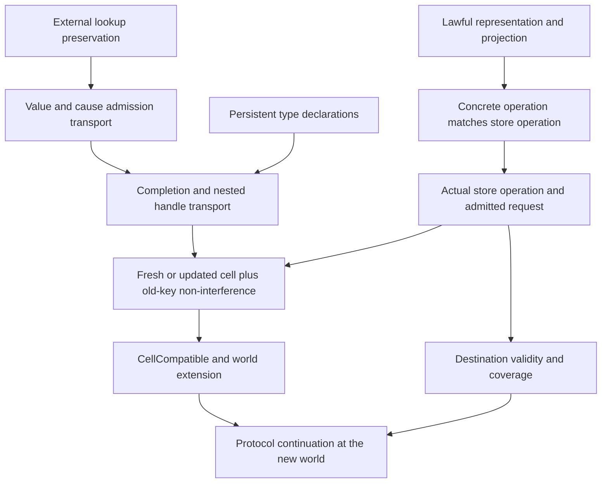

# Foundations: monotonicity, storage refinement, and implementation evidence

The additional review identifies useful proof seams, but its monotonicity and execution
claims need correction before slices 3–6 proceed. The reusable abstract storage laws are
already partly proved. Global state validity, protocol adequacy, and target execution are
separate obligations; none follows from the existence of a world preorder or a generated
implementation.

Reviewed source: `641a0feabe8ff7c3899396cd2144380d6d8cf53c`, after slices 1 and 2 and their
once-over. Input: `2026-09-21-foundations-review-and-theoretical-analysis.md`, retained as
review input. The amended implementation contract is
[the slices 3–6 brief](2026-09-21-codex-brief-foundations-slices-3-6.md). This note supplies
its evidence and rationale; it does not change the decision register or implement a slice.

The owner's follow-up fixes the direction: abstract data structures must transfer to any
**named semantics with a proved implementation relation**, with OCaml the first target.
OCaml types, integer limits, containers, and compiler behavior must not become the abstract
store's definition. The two concerns are independent: preserving typing as a world evolves,
and relating two representations at one semantic observation.

## 1. What this review checks

Completion criteria: audit the proposed statements against actual consumers; retain
constructive controls for false implications; identify existing reusable proofs; correct
file ownership, slice dependencies and acceptance controls; distinguish kernel proofs,
conditional theorems, finite execution and host assumptions. Production sources, generated
files, root imports and frozen declarations are unchanged.

The [evidence directory](2026-09-21-foundations-review-evidence/README.md) contains five
Lean probes, a compiled declaration packet, their logs, a sequential runner, source hashes
and the narrow build log. Failed
draft elaborations are retained separately and provide no mathematical evidence. The new
research lemmas are candidates for later promotion, not additions to the production ledger.

The owner's declaration-first direction is exercised in `ArchitectureStatements.lean`:
completion transport, indexed reference preservation, projection composition, and projection
to relation are full theorem-shaped obligations with `#proof_wanted`. The gate reports
**4 open, 0 proved, 4 total**. These statements can be promoted to their named owners before
proof filling; they are not evidence that their payloads are already proved. This preserves
the distinction between landing architecture and completing its implementation obligations.

## 2. Monotonicity: exactly what grows, and what follows

### 2.1 Five different statements

| Relation or judgment | Exact fact | What it does not establish |
| --- | --- | --- |
| `Stores.le` | Existing handle indices remain in range; selected key domains and sizes grow (`StoresLaws.lean:43–50`) | Payload equality, payload typing, whole-store `WF`, external target spellings |
| `TableExtends` | An already declared key keeps exactly its old declaration (`Typed/World.lean:60–61`) | Validity or coverage of fresh declarations and cells |
| `World.le` | Existence order, declaration extension, and preservation of old `HeapTypedAt`/`PromiseTypedAt` judgments through `CellCompatible` (`:120–130`) | That an actual operation satisfies the relation, or that the destination is valid |
| `Extends before after` on external spellings | Every old successful index lookup returns the same spelling (`TyView.lean:596–602`) | Whether a resource is open, belongs to this run, or conforms to its host protocol |
| `WorldValid w m` (planned) | World/machine agreement, coverage, validity, and allocation support | A monotone predicate on arbitrary pairs of worlds without a transition-preservation proof |

`heap_typed_at_mono` and `promise_typed_at_mono` are already proved in
`Typed/World.lean:407–413`. They project the `CellCompatible` assumption. They are useful
transport rules, but citing them as the proof that a write preserves typing would be circular.
The write proof must establish `CellCompatible` from `syncOpStep` and its request invariant.

The checked `leHost_does_not_imply_wf_transport` constructs an empty world and an extension
with a newly appended dangling reference. Old declaration tables are empty, so old-cell
compatibility holds; external spellings are identical; the destination fails `Stores.WF`.
This refutes global `WF` transport even under the brief's proposed `leHost`. No reachable
execution of a well-typed program is claimed by that arbitrary-world counterexample.

### 2.2 Spelling transport is already a universal proof

Production `Val.hasTy` checks `allocated[index]? == some target` for an external handle
(`Program/Typed.lean:45–53`). Length growth alone is insufficient. The checked rename
control admits handle 0 at spelling `A`, changes the one-entry table to `B`, and loses the
old type despite `World.le`.

Reuse these existing declarations:

- `Effect4.Program.Extends`, `extends_append` in `Laws/Program/TyView.lean:596–602`.
- `cata_admits_extend` and `hasTy_mono` in `Laws/Program/Admits.lean`, with the latter at
  `331–335`: all `Ty` constructors, including nested values and cause admission.
- `hasTy_append` and `FitsIn.mono` in `Laws/Program/Typed.lean:300–303,506–513`.
- `completionOk_extends` in `Typed/World.lean:474–493`, presently requiring spelling
  equality plus extension of Ρ. Generalizing this adapter to `Extends` is smaller than
  re-proving recursive value admission.

The review probe `valueOk_lookup_transport` is the direct adapter from `hasTy_mono` to
`ValueOk`. These are universal Lean proofs, freshly inspected for axioms; the separate
`A`/`B` examples are finite controls. Prefix append is sufficient through `extends_append`;
exact equality is a conservative specialization. Preserve `World.le` and name the stronger
relation used by each concrete theorem. The closed reference slice may retain equality;
future external allocation should use lookup preservation without rebuilding the value proof.

There is no evidence that every async or timer registration grows `externals.allocated`.
`reference_prepare_preserves_store` proves that the current reference interpreter's answer
preparation preserves the store. Host resources need their own profile and admission theorem.

### 2.3 The protocol order must match the transport theorem

`Typed.mono` (`Laws/Effects/Protocol.lean:55–61`) requires upward closure of **each precondition**
and **each result predicate**. D12's certificate does not remove these hypotheses. `Typed.bind`
does not require them. A certificate's syntax being first-order does not prove its precondition
monotone or an implementation's writes admissible.

Use this minimal discipline in slices 3–4:

1. Keep global `WorldValid`, `Stores.WF`, coverage and new-cell obligations in actual-operation
   preservation theorems. Do not insert them indiscriminately into every protocol precondition
   and then invoke global `Typed.mono`.
2. Put local stable demands in `pre`: declarations, keywise cell typing, admitted input values,
   source lookup and environment agreement. Prove their transport at the exact chosen order.
3. Use spelling-aware order for the concrete protocol. Bare `World.le` cannot justify the
   proposed final `ExitFits` weakening. Give the order a name and prove its preorder laws.
4. Where transport needs valid endpoints, state that premise explicitly. The checked
   `typed_transport_at` needs only pre/result transport at the selected endpoints; later
   continuation worlds compose through the same preorder. It is not a new runtime structure.
5. Conditional lookup predicates are not automatically monotone. For example, `ResumeOk`
   is vacuous when Θ has no entry, but extending Θ can impose a new typing demand on its
   code. Prove transport for issued/declared tokens with the required support invariant;
   do not register every owner predicate as an unconditional monotonic rule.
6. If an admitted-world carrier later becomes necessary, record it as an explicit proof-side
   amendment with connectors. Do not add a blanket `KProp` instance whose hidden hypothesis
   is the preservation theorem being proved.

Certificates and declared columns need explicit `Ty.closed` checks where closedness is
required. `Ty.var` exists; coarse admission even accepts `.refOf (.var 0)`. `Nat → Prop`
inhabits `Type 0`, so that universe does not enforce first-order data. The proposed certificate
families are acceptable because their specified carriers are `Ty`, pairs and `PUnit`, not
because the universe excludes functions.

### 2.4 The store proof pattern

For an allocation, derive the fresh key from world validity and the actual allocation
equation. Prove the fresh declaration, the new payload, preservation of every old lookup,
world/store growth, spelling preservation, and destination validity separately. Assemble
`World.leHost` only after proving its components. `insert_here` needs no freshness;
`insert_extends` does. A new cell fitting its declaration does not prove old-cell compatibility.

For a write, keep the cell's declaration invariant and check the replacement at that declared
type. Prove non-interference for every other key. Transport stable input/value predicates to
the resulting world, then package the complete old-cell relation. Primitive strong-value
transport must use base existence order, Γ/Ρ/Π extension and spelling preservation directly;
it must not require full `Typed.World.le` while proving `CellCompatible` for that same order.
Only afterward derive the convenient whole-world transport wrapper. Do not freeze mutable
payloads or assert that later reads equal earlier reads.

`RefKernel.Keeps P Q` and `refStepOf_keeps` (`Laws/Machine/RefKernel.lean:136–162`) already
factor the read/answer/optional-write proof. Their existing heap premise uses **one predicate
for every cell**. Generic Ρ-indexed heaps can contain both numbers and booleans, so add an
index-aware adapter or a focused-cell/non-interference lemma; do not force `HeapNat` back in.
`arena_indexed_lookup_transfer` checks that such indexed assertions transfer through
`Arena.peek_toList`. Existing `progress` remains an adapter for its documented number-only
public profile (`Progress.lean:21–29,69–72,346–351`). A checked Boolean allocation followed
by read succeeds in the machine and fails `HeapNat`.

Promises require the same separation. `Completion.ofRefGet` has a declared type through Ρ,
but live-cell existence comes from validity/coverage; delayed reads observe the cell when
forced. `Stores.WF` deliberately excludes deferred completion-handle validity
(`StoresLaws.lean:216–228`). `PromiseTable` does not silently supply nested handle agreement,
due delivery correlation or wake ordering.

The arrows into `N`, `G` and `R` are proof obligations for the operation or implementation;
the diagram does not claim they are all discharged at this base.

## 3. Store semantics to abstract representations to target implementations

### 3.1 The reusable contract

A storage abstraction owns mathematical operations and their observations. A representation
owns a carrier, a validity predicate and a projection or relation to that model. An
implementation proof connects **actual implementation operations**, not a duplicate model
written beside them. Initialization, the returned answer, updated state, unanswered frontier,
and ordered emitted actions must each be accounted for where the operation exposes them.

Current assets, with their exact scope:

| Asset | Current evidence | Boundary |
| --- | --- | --- |
| `Arena` / `LawfulArena` (`Laws/Machine/Arena.lean:11–36`) | Lean law interface; list instance proved; lookup/update/allocation projection laws proved | Dense stable indices, absent update is a no-op, fresh allocation at size; no deallocation or key reuse |
| `refStep_eq_refStepOf` / `toList_refStepOf` | Universal exact equations, including `Option` failure, for the declared reference kernel | `refMake` is separate; no blanket theorem for all 31 store operations |
| `Refinement.projects_arena` (`Refinement.lean:635–643`) | Universal conditional theorem for any supplied lawful arena | Does not instantiate a fast OCaml map, C heap or JS container |
| `DeferredStore.map_*`, `projects_*`, `deferredOk_iff_image` | Universal naturality/projection and exact-image theorems for completion-data embedding | No arbitrary inverse for executable programs; not a proof of host promise behavior |
| `Projects` (`Refinement.lean:18–27`) | Exact step projection plus retention of concrete `WF` | Same operation/answer carriers, deterministic `Option` step; initialization and whole-machine lifting separate |
| `Refines` (`Refinement.lean:31–38`) | Forward successful-step matching and concrete-none to model-none | Not automatically bidirectional behavior equality, progress, fair divergence or a compiler theorem |
| `Book` machine relation | Existing same-store, differing-code connection | Does not replace a relation between different store representations |
| OCaml `e4_table` / `e4_memo` | Implementation sources and declared property-test/differential contracts inspected | Those host tests were not re-run here; no Lean `LawfulArena` instance for those implementations found |

The checked `projects_transfers_selected_invariant` lifts a model invariant and answer
property through an actual `Projects` instance, retaining the concrete invariant. This gives
implementation a reusable proof pattern without claiming the missing instance exists.

The portable abstraction cannot identify correctness with equal physical representations.
`Arena.toList` is an observation; internal balancing or spare capacity may differ. For a
sparse map, freed cells, generations, or a mutable heap, choose a relation and validity domain
that actually fits it. A dense arena law is not automatically a finite-map or reclamation law.
If old public handles may be revoked or reused, monotone live-handle transport no longer
applies unchanged: retain a monotone historical identity/type table and state operational
liveness separately, or obtain an explicit domain amendment before changing the contract.

### 3.2 Portability acceptance for an implementation

Each new representation must supply, in this order:

1. Abstract operation, observation, domain and source semantics; state whether execution is
   deterministic or relational, and whether blocking/frontier is allowed.
2. Concrete carrier and invariant, initialization, and an abstraction function or state
   relation. If values or keys differ, a result/key relation with consistent handle renaming.
3. Per-operation simulation, invariant preservation, failure/frontier correspondence, and
   the required ordering of emitted work. An effectful or multi-step implementation needs
   its own named transition relation and stuttering/progress conditions; the current pure
   `Projects` record is a reusable special case, not a claim to cover every semantics.
4. Transfer of the selected world predicates, including external spellings and ghost tables,
   and a machine connector that relates stores instead of assuming equality. When private
   allocations change fuel or scheduling, relate choices and observations explicitly.
5. A separate compiler/artifact/execution connection on a named scalar and host domain.
   Preserve existing observations; add a named abstraction with its factorization theorem
   when internal representation should be hidden.

This makes the laws transferable to arbitrary **verified target semantics satisfying those
obligations**. It does not promise that any arbitrary backend satisfies them. No new target
or general-purpose verification framework is required by this review. Use the first OCaml
carrier replacement to identify the next missing connector.

### 3.3 OCaml first; C and TypeScript have different boundaries

| Route | Reusable part | Additional obligation |
| --- | --- | --- |
| Current OCaml LCNF route | Abstract store laws, world transport, reference-operation proofs and selected projections | Lean definition to compiler IR; IR to target syntax; carrier rewrites to actual OCaml operations; printed artifact; OCaml compiler/runtime, integer and extern profile |
| Standard Lean compilation through C | Same Lean source proofs and abstract laws | Pinned Lean compiler/runtime and C compiler/platform connection; this route retains Lean runtime representations rather than automatically adopting the OCaml int/map profile |
| A new direct C representation | Same abstract operation contracts and relation-based proof pattern | C memory/ownership/aliasing and scalar domain, concrete allocation failure policy, ABI/FFI and operation simulation; this is a distinct implementation effort from compiling existing Lean code |
| TypeScript as a generated machine target | Same source contracts and abstract operation semantics | Explicit JS numeric/string/container representation, mutation and snapshots, target-language execution and host event scheduling |
| Existing TypeScript Effect image | Canonical `Eff`, printer/reader connection, named fragment behavior observations | Executing rc.112 is its own target profile and handler/host conformance problem; it is not a replacement storage implementation by definition |

For OCaml, inspect `ocaml/engine/e4_table.mli` and `e4_memo.mli` against actual consumers.
The table contract distinguishes allocation from absent-key update and assumes density for
append. Memo bindings use sorted path order while Lean stores insertion order and can contain
duplicates. The existing whole-store observation exposes that distinction; a lookup-only
comparison is a different observation and needs an explicit connector. Property-test comments
or a successful module ascription do not prove it universally.

For the standard Lean route, compiled code calls the Lean runtime for allocation/reference
counting and primitive representations. Compiling through C does not remove those assumptions
or prove the C compiler. This follows the official
[Lean runtime description](https://lean-lang.org/doc/reference/latest/Run-Time-Code/);
repository-specific lowering limits remain in `docs/core/lcnf-route.md`.

For a prospective JS target, `number` uses binary64, `bigint` is a distinct numeric type,
and strings use UTF-16 code units. Choose exact encodings or a proved admitted domain for
all intermediate values, including allocation indices and counters. Type annotations are
erased and do not establish runtime validity. These target facts come from
[ECMAScript's value semantics](https://tc39.es/ecma262/multipage/ecmascript-data-types-and-values.html)
and the [TypeScript handbook](https://www.typescriptlang.org/docs/handbook/2/everyday-types.html#type-assertions).
They motivate future obligations; no JS backend was built or tested here.

### 3.4 Evidence grades must stay attached to arrows

Use separate labels, not one global “verified” badge:

- **Kernel-checked fact:** named theorem, exact assumptions and axiom output. An interface
  theorem can still be conditional on an uninstantiated `LawfulArena`.
- **Verified implementation instance:** actual operations connected to that interface on
  an admitted domain, including initialization and all exposed results.
- **Verified machine/translation connection:** named observation and source/target semantics,
  with compiler/runtime assumptions stated. Do not substitute the previous grade for this one.
- **Finite execution evidence:** corpus, boundary cases, tool versions and fresh output.
  Useful defect detection; no universal conclusion.
- **Assumed or open boundary:** explicitly named host, scalar, compiler, scheduling or
  ownership obligation. A successful type check does not promote it to a proof.

No new grade numbering competes with existing Conform rungs. Receipts should map each rung
to these kinds of evidence and retain its actual coverage. `docs/core/lcnf-route.md` already
records the absent end-to-end theorem; the new theoretical review must not reverse that limit.

## 4. Other checked corrections that affect the implementation plan

| ID | Finding and evidence | Required change |
| --- | --- | --- |
| FR-01 | Global `WF` monotonicity is false, even with equal spellings; `WorldReplayProbe` | Local protocol demands plus actual-transition validity proofs; exact transport order |
| FR-02 | Existing spelling `Extends` and `hasTy_mono` already prove recursive admission transport | Reuse the fold proof; equality only a specialization; keep ownership separate |
| FR-03 | Polymorphic Boolean cells fail legacy `HeapNat`; certificate closure is not automatic | Indexed heap/promise proofs, explicit closed columns, public nat adapter only |
| FR-04 | Θ active coverage allows a declaration at `nextToken`; inherited `w.ids` is unconstrained by the old list | Add token support bound and `w.ids = m.fibers.map (·.id)`; keep historical token entries |
| FR-05 | Successful `check` at an invalid diagnostic path does not prove source lookup; runtime env can disagree | Explicit `Node.at_` witness, root identity, admitted closed environment and `FitsWith` using the strong value judgment |
| FR-06 | False postcondition types an operation against final predicate `False` | Separate constructor coverage from actual-delivery adequacy and legitimate unanswered frontier |
| FR-07 | `ExitFits` admits forged handles and pure `badShapeExit` | Strong value/exit invariant at every boundary; source/internal-control safety separate from typed failure admission |
| FR-08 | Landed resume contract rejects ordinary error-removing handlers; actual pending-interrupt branch can skip a typed failure | Resolve delivery-state correlation before changing `FrameAccepts`; do not merely delete failure passthrough |
| FR-09 | `popR.answer` can discard an `unguard` continuation and deliver its payload | Ordinary protocol typing cannot supply marker-payload inversion; add admitted control forms or a stronger judgment |
| FR-10 | `popR` has seven slots and multiple recursive/running outcomes | Outcome-indexed result; explicit mask, cancellation, iterator and loop contracts and successor middle types |
| FR-11 | `forkScoped`, `guard_`, `construction`, `raceRegister`, `frontier` have different dependent carriers from brief summaries | Exact per-constructor answer rows; `scopeExit` must be admitted in its preparation phase, since raw dispatch yields `badShapeExit` |
| FR-12 | Matching raw `answerAsync` can resume a checked Unit yield with a Nat; missing/stale targets are inert in the reference probe | Type every effective matching completion at its continuation/token type, not only external-row answers |
| FR-13 | `stepDecisionState` is called by `replayEval`; reference replay needs its evaluator instance and fuel receipts | Use `replayR`; driver-boundary reachability and prefix sufficiency; no inferred public-journal theorem |
| FR-14 | Arena and completion-data proof interfaces exist, host implementations are separate | Keep target-neutral contracts and per-implementation evidence; do not call OCaml containers universally verified |

FR-08/09 are interface blockers for slice 5. Their arbitrary saved states are not claimed
reachable. The required next work is to characterize the admissible source/control/delivery
states and prove their preservation. Any refuted frozen production declaration requires the
normal counterexample registration and explicit amendment when that code change is made.

### Required stack branch matrix

`popR` returns a saved state and an optional exit. For `none`, prove the new current program
and remaining stack fit; for `some exit`, prove that completed exit fits the destination.
Do not require obsolete current code to fit the emptied stack after completion.

| Slot | Actual branch obligations |
| --- | --- |
| `resume` | Selected arm and updated interrupt mask; the actual failure-skip condition; inserted finalizer mask for `onExit`; delivery-state correlation for error-changing catches |
| `answer` | Pure-result inversion and recursive pop; `unguard` payload inversion when the continuation is discarded; ordinary running-code branch |
| `restoreMask` | Restored mask; preserved provenance; success may become the recorded interruption; otherwise recursive pop |
| `finalizerMask` | Same operational mask branch, with its cleanup-specific admission |
| `asyncFinalizer` | Failure passthrough or typed cancellation code; possible pushed restore mask; success bypass or pending-interruption injection |
| `iter` | Failure passthrough; done value; halt cause; resumed code with a successor generator and new intermediate type |
| `loop` | Failure passthrough; finishing code; continuing body with successor cursor and new intermediate type |

The generic theorem takes explicit `HookLaws` for the named callbacks. Concrete instances
for `interpR` must be proved before a concrete M4 result is reported; instances depending
on the M5 source theorem remain named open obligations. The stronger control judgment also
needs bind/preparation/guard closure: generic `Typed.bind` alone covers only its own component.

The raw-yield control is a finite actual replay at command fuel 30. It refutes “only external
row answers need checking,” not the proposed invariant with an appropriately strengthened
`AnswersOk`. Such a predicate must be defined at each replay prefix with the world/stack at
that point; it cannot assume final Γ is the continuation's intermediate type.

## 5. Theoretical and tooling recommendations: disposition

Retain the useful intuition of persistent declarations, typed stack composition, signature
sums and projection-based framing. Do not promote these analogies to new proved facts:

- `ScopeFrame.resume` and `.answer` contain Lean functions in the proof reference carrier;
  they are not fully defunctionalized stored syntax. `Eff` remains the sole stored program IR.
- `Protocol.sum` has useful lift/inversion laws. It does not isolate two protocols that share
  the same mutable world, nor establish a categorical universal property by its name.
- A `Keeps` projection equation permits reuse only for predicates proved to factor through
  that projection. Coupled fields and actions need their joint relation; no lens laws follow.
- The proposed `KProp` wrapper is optional after actual upward-closure proofs. The claimed
  saving of “over 20” lemmas was not measured; existing fold and protocol tools should be reused.
- The displayed answer-gate loop checks nothing: its constructor body is `pure ()`. Build a
  checked row manifest with duplicate/missing/stale controls, dependent answer types and named
  delivery/frontier obligations. Counting 31 + 40 is inventory evidence only.
- More than four custom commands exist; reuse `Obligations`, `Frames`, `Positions` and
  `Exhaustive` rather than introducing parallel inventories. `#exhaustive_gate` is explicitly
  an informational source-matcher report; the compiled case-site policy is a separate gate.
- `Effect4.Inversion` really is the default bank. Preserve the repository's required Phase C
  registration shapes, but make no universal speed claim. Pinned Aesop distinguishes
  `transparency` from `transparency!` for indexing (`Frontend/RuleExpr.lean:186–207,249–254`).
  Tactic spelling does not establish axiom purity; check the emitted proof dependencies.

`run_eq_meaning` is in `Agreement/Machine.lean:1918–1937`: `Straight`, depth/step fuel bounds,
finished outcome, exit and stores; no trace equality. `LoopAgreement` is the eventual
sufficient-fuel observation conditional on a completed bounded denotation
(`LoopAgreement.lean:26–32`; proof `Agreement/Loop.lean:839`). `denoteRWith` recurses on
explicit compilation fuel (`DenoteR.lean:783–797`); weight lemmas help later source proofs.
None establishes generic protocol progress or full host equivalence. `[propext, Quot.sound]`
is an axiom ceiling, not “zero axioms.” Inventory counts are not runtime proof coverage.

Literature analogies in the input were not used as proof evidence or independently audited
bibliographic claims. Current source and the retained checked propositions determine these
corrections. The three official language references above support only the target-profile
facts beside them; they do not certify a repository implementation.
