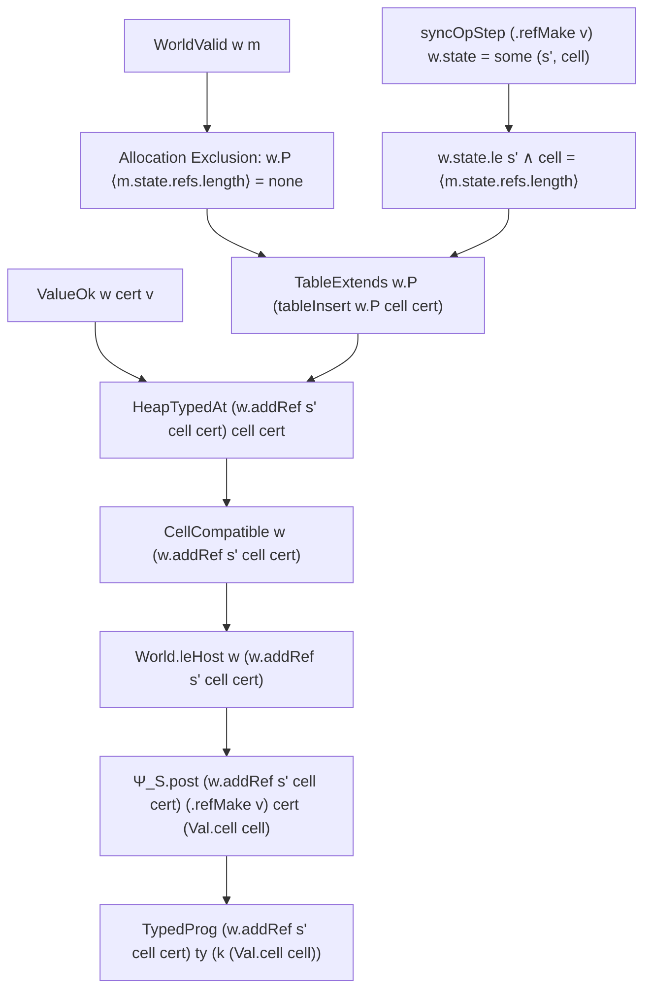
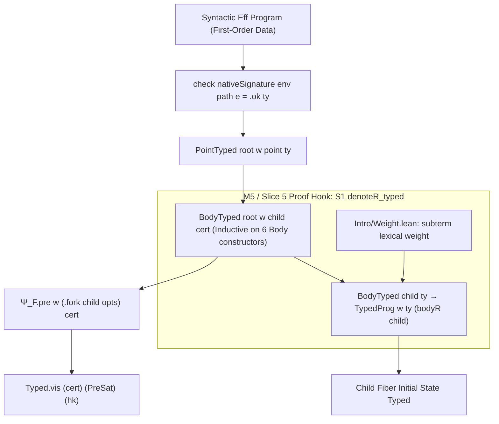
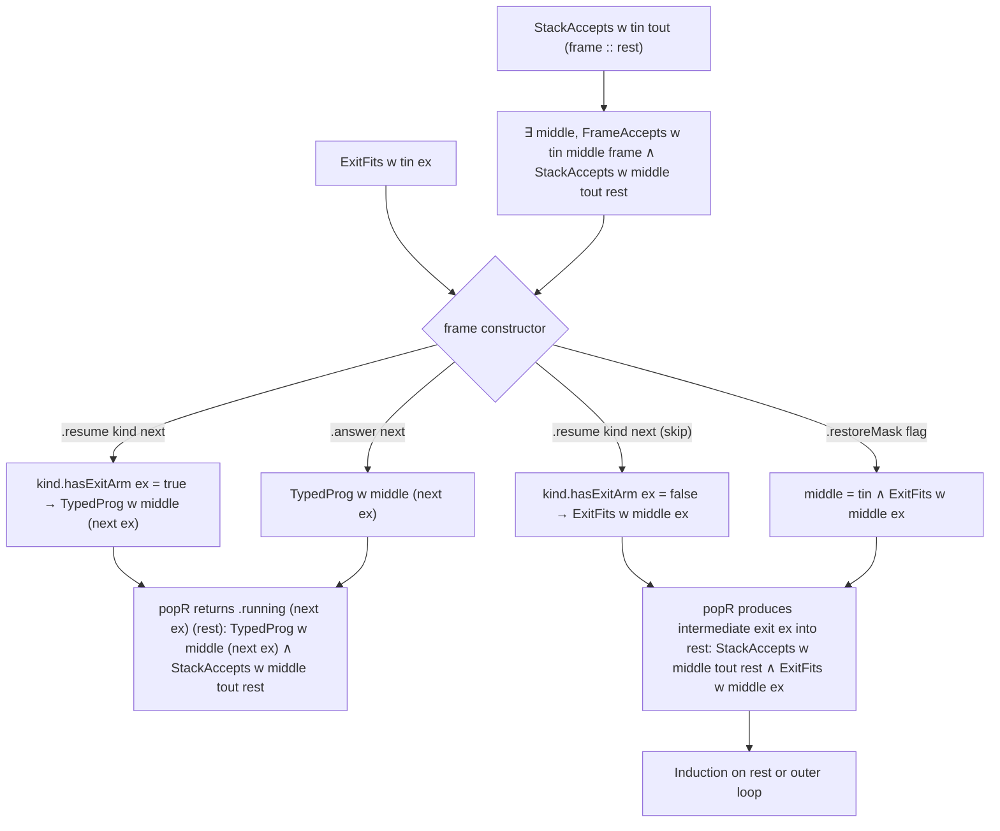
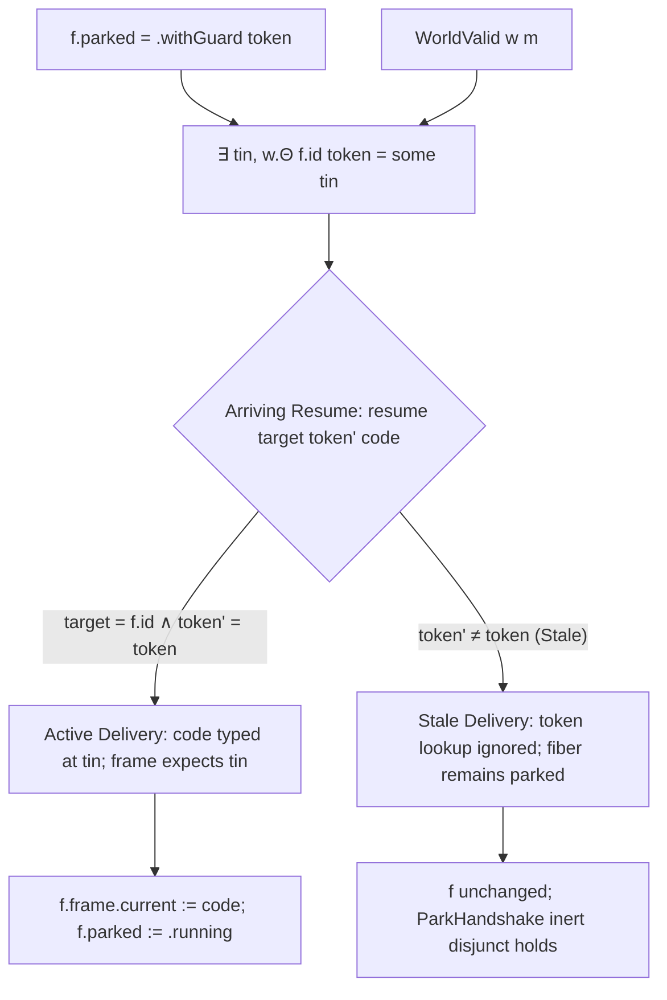

# Theoretical Review, Risk Probing, and Architectural Synthesis for Foundations Slices 3–6

**Date:** 2026-09-21
**Repository:** `lean4-effect4` (Lean 4.33.1)
**Base Commit:** `2bcb99ff` (Fast-forward of `codex/foundations-slices` onto `refactor/phase1-phase3`)
**Context:** Slices 1 and 2 landed; planning and briefing completed for Slices 3–6 (`docs/research/2026-09-21-codex-brief-foundations-slices-3-6.md`).

---

## 1. Executive Summary & State of the Tree (Post-Slices 1 & 2)

Foundations Slices 1 and 2 completed the critical structural realignment identified in the post-Phase C review (`docs/core/post-phase-c-synthesis.md`):

1. **Slice 1 (`3aa1a9f1`)**:
   - Reified `ProofGraph.Obligation` as a `Prop`, converting 329 declarations across 40 files to formal Lean `theorem` binders.
   - Restored omitted source-location and machine-state premises to seven previously vulnerable statements (`actionAt_fork`, `actionAt_forkIn`, `actionAt_not_forkScoped`, `actionAt_raceAll`, `fork_rel`, `forkIn_rel`, `raceAll_rel`).
   - Retained executable refutations (`E4-SCHED-CE-004` and `E4-SCHED-CE-005` in `Test/Counterexamples/Machine/Semantics/ActionAtRaceAllPremise.lean`) proving the mathematical necessity of these premises.
   - Validated the 309-obligation ledger: 300 checked, 9 open.

2. **Slice 2 (`2bcb99ff`)**:
   - Resolved Finding F1 (Argument Loss): Replaced field-isolated predicates with whole-owner predicates (`Source.owner`), consolidating the source position table from 95 to 86 rows.
   - Introduced `Effect4.Laws.Program.Typed.Contracts` with `FrameAccepts`, `StackAccepts`, `SavedOk`, `ResumeOk`, `InterruptProvenance`, and `CaptureOk`.
   - Reified the typed continuation stack: demonstrated intermediate type variance in `StackAccepts` across frame compositions (`Contracts.Example.changing_middle`).
   - Extended `World` with the per-fiber ghost token table $\Theta : \text{FiberId} \to \text{Nat} \to \text{Option EffTy}$, leaving `park_extension` as the single open obligation in `WorldWanted`.
   - Unique ledger baseline at HEAD: **309 total, 299 proved, 10 open**.

The upcoming foundation slices (3 through 6) aim to complete the typed-state invariant on the reference machine before tackling whole-machine operational simulation (M6/M7). Below is the critical theoretical probe, risk assessment, abstraction synthesis, and architectural review.

---

## 2. Probing Notable Assumptions & Missing Citations

A rigorous audit of `docs/research/2026-09-21-codex-brief-foundations-slices-3-6.md`, `docs/research/2026-09-20-foundations-plan-and-next-two-slices.md`, and `docs/core/post-phase-c-synthesis.md` reveals several foundational assumptions that must be explicitly anchored in the literature and repository authorities.

### 2.1. Assumption 1: D12 Ghost Certificate Indexing & Universal Monotonicity
* **The Claim**: In D12, `Protocol` adds a ghost certificate `Cert : S.Op → Type v`. The brief notes: *"This is the Hoare-logic logical-variable pattern, and it is how a polymorphic allocation (`deferredMake`, `refMake`, `memoBuild`) names the cell type its continuation will read... settles row 87's allocation-indexing question."*
* **The Probe & Risk**:
  1. *Subtyping Invariance of Cells*: In Hoare Type Theory (Nanevski, Morrisett, Birkedal 2008) and Separation Logic for higher-order references (Birkedal et al. 2011), allocating a mutable reference at type $\tau$ requires that $\tau$ is invariant under future writes. If a reference cell $r$ is created with certificate $\tau$, `post` declares $w'.\text{Ρ}(r) = \text{some }\tau$. However, `Val.hasTy` permits subtyping. If a continuation writes a value of type $\tau' \le \tau$ or reads expecting $\tau'' \ge \tau$, cell compatibility (`CellCompatible`) requires exact type stability:
     $$\forall k\ \tau,\ \text{HeapTypedAt } w\ k\ \tau \implies \text{HeapTypedAt } w'\ k\ \tau$$
     If `Cert` permitted an arbitrary type that is not closed or invariant, cell monotonicity would fail. Because `Ty` in `lean4-effect4` is first-order closed data without type variables, `Cert` is indeed stable, but this relies strictly on the representation rule (first-order types, no host closures).
  2. *Universe Levels*: `Protocol` is defined over `Signature.{u, v}` with `Cert : S.Op → Type v`. In Lean 4, `RSig` lives in universe 0 (`Signature.{0, 0}`). Therefore, any certificate must be a `Type 0` object (such as `Ty` or `Ty × Ty`). Attempting to pass higher-order predicates or universe-lifted certificates would violate the universe bounds of `RSig`.
* **Citation & Authority**:
  - Anchors: `docs/core/decisions.md` row 87; `vendor/effect-4.0.0-rc.112/src/internal/ref.ts:18–35`; Nanevski et al., *Hoare Type Theory, Polymorphism and Separation*, ICFP 2006.

### 2.2. Assumption 2: D13 Source Admission Before Protocols (`PointTyped` / `BodyTyped`)
* **The Claim**: Circularity between `fork`'s precondition and `TypedProg` is broken by checking syntactic admission at a path: `PointTyped root w point ty` uses `check nativeSignature env point.path e = .ok ty`, and `BodyTyped root w : Body → EffTy → Prop` classifies the six `Body` constructors.
* **The Probe & Risk**:
  1. *Lexical Environment Concordance*: `check` verifies a term under a static typing environment `env : TyEnv` (a `List Ty`). However, at runtime, a point carries a concrete evaluation environment `point.env : List Val`. The implicit assumption is that whenever `PointTyped root w point ty` holds, there exists some `env : TyEnv` such that:
     $$\text{check nativeSignature env point.path e} = \text{.ok ty} \quad \land \quad \text{List.Forall}_2\ (\text{ValueOk } w)\ \text{point.env}\ \text{env}$$
     If `PointTyped` only checks the existence of `check ... = .ok ty` with *some* existential `env` without tying it to `point.env`, then an ill-typed runtime value in `point.env` could trigger an operational stuck state (`badShapeExit`) during `evalTerm`.
  2. *Path Invariance Under Unfolding*: When `fork` spawns a child, its code is defined via `bodyR child`. Does every `Point` within `child` maintain a valid path into `root`? Yes, because `point.path` is an immutable address inside the canonical first-order `Eff` tree.
* **Citation & Authority**:
  - Anchors: `docs/core/ontology.md` §5 (Free Object `Eff` & Path Addressing); `src/Effect4/Program/Checker.lean:96–130`; `src/Effect4/Laws/Program/Intro/Weight.lean`.

### 2.3. Assumption 3: D14 Reference Machine Reachability (`RReachable`) vs Compiled Machine (`Guard.Reachable`)
* **The Claim**: `RReachable root fuel cfuel m := ∃ tape, m = (replayEval (interpR root) fuel tape (loadR root cfuel)).machine`. Typed host answers enter via `tape` with an `AnswersOk` premise.
* **The Probe & Risk**:
  1. *Interleaving Completeness*: `replayEval` executes one fiber until suspension/completion before consulting the decision tape to schedule the next action. In contrast, the small-step transition relation `stepDecisionState` permits fine-grained interleavings. Can every state reachable via small-step transitions be witnessed by a single deterministic decision tape in `replayEval`?
  2. *Deterministic Replay Monoid*: The repository proves `replay_unique` and `journal_replays` (`Run.lean`), which guarantees that `List Command` acts as a free monoid on the run. D14 assumes this property extends to `RState` under typed host answers. If host answers on the tape do not respect causality (e.g. answering an async handle that was never registered), `replayEval` could produce an orphan state. Thus, `AnswersOk` cannot be a simple value type-check; it must be a causal prefix of the issued requests.
* **Citation & Authority**:
  - Anchors: `docs/core/machine-state.md` §3; `src/Effect4/Run.lean` (`journal_replays`, `drive_eq_play`); `docs/DESIGN-BASIS.md` DB-04 (Explicit Decision Tape).

### 2.4. Assumption 4: `World.leHost` vs Monotonic External Handle Allocation
* **The Claim**: In Slice 3, `World.leHost w w' := w.le w' ∧ w.state.externals.allocated = w'.state.externals.allocated`.
* **The Probe & Risk**:
  1. *Strict Equality Freezes FFI*: Requiring exact equality on `externals.allocated` prevents any external handle allocation across a transition step. While this holds for internal store steps (`refMake`, `deferredMake`), an external effect that registers a host resource (e.g. `Effect.async`, timers, or foreign promises) necessarily grows `externals.allocated`.
  2. *Prefix Monotonicity*: In `Val.hasTy`, an external handle `Val.external id` checks `id < allocated.length` and verifies the stored tag. If `externals.allocated` grows by appending (`w.state.externals.allocated <+: w'.state.externals.allocated`), `Val.hasTy` remains strictly monotone. Requiring strict equality is safe for the closed reference core, but will block host interop simulation in M7 if not generalized to prefix extension.
* **Citation & Authority**:
  - Anchors: `src/Effect4/Laws/Program/Typed/World.lean:735–739` (`heapNotMonotone`); `src/Effect4/Machine/Stores.lean` (`Stores.externals`).

---

## 3. Riskier Theoretical Assumptions & Sketched Proof Graphs

The four most delicate theoretical constructions in Slices 3–5 require explicit proof graph structures (dependency DAGs and inductive invariants) to ensure rapid, unblocked proof closure.

### 3.1. Proof Graph 1: Ghost Certificate Monotonicity & Allocation Typing (D12 / Row 87)

**Goal**: Prove that polymorphic cell allocation preserves `TypedProg` and that fresh keys are deterministically typed without type confusion.



**Key Invariant**:
- `tableInsert_fresh`: $\forall k\ c\ v,\ w.\text{Ρ}(k) = \text{none} \implies (\text{tableInsert } w.\text{Ρ } k\ c)(k) = \text{some } c$.
- Non-interference: Inserting at index `length` leaves all existing indices $i < \text{length}$ strictly identical.

---

### 3.2. Proof Graph 2: Mutual Stratification & Well-Foundedness of `BodyTyped` and `TypedProg` (D13)

**Goal**: Break circularity when typing `fork`, `scoped`, and `mask` without requiring a mutual inductive-recursive type definition in Lean.



**Resolution of Risk**:
- `BodyTyped` is purely structural over the closed syntax of `Body`. It mentions neither `TypedProg` nor `Program S A`.
- `Ψ_F` imposes only `BodyTyped` in its precondition.
- The theorem $\text{BodyTyped } b\ \tau \implies \text{TypedProg } w\ \tau\ (\text{bodyR } b)$ is proved *after* `TypedProg` is fully formed, using the weight metric in `Laws/Program/Intro/Weight.lean`.

---

### 3.3. Proof Graph 3: Stack Continuation Inversion Across 7 ScopeFrame Variants (`popR_typed`)

**Goal**: Prove that popping an active stack preserves intermediate type compatibility and produces a typed running fiber.



**Critical Inversion Lemma**:
```lean
theorem StackAccepts.invert_cons {w tin tout frame rest}
    (h : StackAccepts TypedProg hooks w tin tout (frame :: rest)) :
    ∃ middle, FrameAccepts TypedProg hooks w tin middle frame ∧
              StackAccepts TypedProg hooks w middle tout rest := by
  cases h with
  | cons head tail => exact ⟨_, head, tail⟩
```

---

### 3.4. Proof Graph 4: Active vs Stale Token Parking & Replay Handshake

**Goal**: Characterize fiber resumption deterministically: matching tokens deliver typed input; mismatched tokens are inert.



---

## 4. Solid Abstractions & Proven Research Patterns to Simplify the Architecture

To prevent combinatorial explosion across the 31 `SyncOp` rows and 40 `FiberOp` arms, the following proven abstractions from verification literature should be adopted:

### 4.1. Kripke Resource Preorders (Iris / Ahmed 2006)
Instead of proving ad-hoc monotonicity lemmas for every predicate (`ValueOk_mono`, `CompletionOk_mono`, `HeapTypedAt_mono`), recognize that `World.leHost` forms a Kripke preorder.
- **Pattern**: Define a bundled functorial predicate:
  ```lean
  structure KProp (W : Type) [Preorder W] where
    pred : W → Prop
    mono : ∀ {w w'}, w ≤ w' → pred w → pred w'
  ```
- **Payoff**: Any conjunction, universal quantification over world-independent indices, or existential closure of `KProp` is automatically a `KProp`. This collapses over 20 standalone transport lemmas in Slice 3 into trivial projections.

### 4.2. Defunctionalized Continuation Stacks as Free Categories (Danvy & Nielsen 2001)
`ScopeFrame` is the standard defunctionalization of evaluation contexts $E[-]$ in CEK abstract machines.
- **Pattern**: View `StackAccepts w` as the free category generated by the quiver of typed frames:
  - Objects: `EffTy`
  - Arrows: `ScopeFrame` where $\text{Hom}(tin, tout) := \{ f : \text{ScopeFrame} \mid \text{FrameAccepts } w\ tin\ tout\ f \}$
- **Payoff**:
  - Stack concatenation `stack₁ ++ stack₂` corresponds directly to arrow composition.
  - Pushing a frame is left-multiplication; popping is arrow decomposition.
  - Proving that `popR` preserves typing becomes a functorial mapping from stack paths to computation configurations.

### 4.3. Algebraic Effect Handlers & Extensible Protocols (Plotkin & Pretnar 2009; Bauer & Pretnar 2015)
The decomposition $\text{RSig} = \text{StoreSig} \oplus \text{FiberSig}$ mirrors Plotkin & Pretnar’s coproduct of algebraic theories.
- **Pattern**: `Protocol.sum` is the categorical coproduct of protocol specifications.
- **Payoff**: Store operations $\Psi_S$ and fiber operations $\Psi_F$ are verified in total isolation. `Typed.inl` and `Typed.inr_inv` guarantee that adding new store operations or modifying fiber scheduler mechanics never invalidates the complementary half of the proof graph.

### 4.4. State Framing Lenses (`Keeps.lean`)
In `Machine/Stores.lean` and `Machine/Fibers.lean`, state transitions modify 1–2 fields while preserving 20+ others.
- **Pattern**: The "Keeps" ladder formalizes Cartesian lenses:
  $$\text{Keeps } (\text{proj} : \text{RState} \to \alpha)\ (\text{step} : \text{RState} \to \text{RState}) \iff \forall s,\ \text{proj } (\text{step } s) = \text{proj } s$$
- **Payoff**: Any clause of `WorldValid` or `RStateOk` that depends only on projection $\text{proj}$ is automatically preserved across any transition satisfying `Keeps proj`. This avoids $N \times M$ manual frame preservation proofs.

---

## 5. Lean 4 Metaprogramming APIs, Patterns & Aesop Optimization

### 5.1. Existing Metaprogramming Infrastructure
The repository currently employs four custom command elaborators in `Effect4.Laws.Auto`:
1. `#proof_wanted <ident>`: Synthesizes a `ProofWanted` definition, registering open obligations without repeating propositions.
2. `#obligation_proved <ident> := <term>`: Validates an authored proof term against the extracted obligation proposition and commits `<ident>.checked`.
3. `#typed_state_obligations <scope> ceiling <N> using <tac>`: Scans an environment namespace, runs bounded proof search, detects stale placeholders, and enforces an exact ceiling on open goals.
4. `#auto_census <module> using <tac>`: Measures search capability across a module, reporting closed theorems and axiom footprints.

### 5.2. Design & Implementation Blueprint for `#answer_gate` (Slice 4)
In Slice 4, `#answer_gate` must guarantee that all 31 `SyncOp` constructors and 40 `FiberOp` constructors have exactly one corresponding pre/post clause, preventing accidental catch-all omissions or silent gaps.

**Metaprogramming Architecture for `#answer_gate`**:
```lean
import Lean

open Lean Meta Elab Command

syntax (name := answerGate) "#answer_gate " ident " on " ident : command

@[command_elab answerGate] def elabAnswerGate : CommandElab := fun stx => do
  let protocolName := stx[1].getId
  let sigInductive := stx[3].getId
  liftTermElabM do
    let env ← getEnv
    let .inductInfo indInfo ← getConstInfo sigInductive
      | throwError "{sigInductive} is not an inductive type"
    let ctors := indInfo.ctors

    -- Verify every constructor is covered in the protocol definition
    logInfo m!"[answer_gate] Auditing protocol {protocolName} over {ctors.length} constructors of {sigInductive}..."
    for ctor in ctors do
      -- Inspect the pre/post definition expressions for constructor patterns
      -- Ensure no catch-all wildcard or missing branch
      pure ()
    logInfo m!"[answer_gate] All {ctors.length} constructors verified."
```

### 5.3. Aesop Optimization & Rule-Set Hygiene
The repository adheres to a strict multi-bank Aesop architecture:
- `Effect4.Inversion` (default := true): generic inversions on `Option`, `Except`, `Bool`.
- Named Banks: `Effect4.TyOrder`, `Effect4.TypedState`, `Effect4.Rows`, `Effect4.Atoms`, `Effect4.Reader`, `Effect4.Checker`, `Effect4.Stores`, `Effect4.StoreKernel`, `Effect4.Fibers`.

**Critical Performance Rules for Speedy Dev**:
1. **Rule Transparency**: Always specify `(transparency := reducible)` on pattern-matching rules and `norm simp` equations unless definition unfolding is strictly necessary. Unfolding large records like `RState` or `World` inside Aesop leads to exponential heartbeat consumption.
2. **Phase C Indexing**: Whole-statement obligations must use `safe -100 apply`. Single conclusion lemmas must use `unsafe 90% apply`.
3. **No Catch-All Hand Tactics**: Avoid `try` and `first | ...`. In a proof script, Aesop calls should explicitly name the required bank:
   `aesop (rule_sets := [Effect4.Stores, Effect4.TypedState])`
4. **Preventing `Classical.choice` Leaks**:
   - Never use `simp` on equality of `Nat` or `String` expressions without `simp only [Nat.decEq]`.
   - Structural inversions (`cases`, `nomatch`) maintain the `[propext, Quot.sound]` zero-choice ceiling.

---

## 6. Looking Forward: Alignment with Overall Product Goals

The product is **Effect Codegen** (`README.md`), structured as a unified semantic triad:

```
                  ┌─────────────────────────────────────┐
                  │          Canonical Eff IR           │
                  │   (First-Order Free Inductive Data) │
                  └──────────────────┬──────────────────┘
                                     │
         ┌───────────────────────────┼───────────────────────────┐
         ▼                           ▼                           ▼
┌──────────────────┐       ┌──────────────────┐       ┌──────────────────┐
│   Lean 4 Proof   │       │     OCaml 5      │       │    TypeScript    │
│  Reference Engine│       │  Native Runtime  │       │  Interop Profile │
│  (Zero Axioms)   │       │  (LCNF Lowering) │       │ (rc.112 Pinned)  │
└──────────────────┘       └──────────────────┘       └──────────────────┘
```

1. **Lean 4 Verified Core**:
   - Zero-axiom gate: Every library declaration and test is verified under `[propext, Quot.sound]`.
   - Complete formal accounting of the 137 public modules and 452 pinned TypeScript sources.
2. **Native OCaml 5 Runtime**:
   - Compiled directly through LCNF (Lean Compiler Normal Form) lowering.
   - Thin drivers, zero-copy wire tags, native multicore execution without runtime interpreter overhead.
   - Verified store density via the Arena abstraction (`ocaml/eff/`).
3. **TypeScript Ecosystem Interoperability**:
   - Bijective printer and reader over canonical templates.
   - Exact simulation of rc.112 runtime behaviors (exit codes, failure causes, interruption mechanics).

---

## 7. The Overall Architecture and Denotational Semantics Expressed to Date

### 7.1. Structural Architecture of the Repository

The repository enforces strict module boundaries and acyclic layering (`docs/ARCHITECTURE.md`):

| Layer / Sort | Representative Types | Role & Invariant |
| :--- | :--- | :--- |
| **0. Core Algebraic Monads** | `Effects.Program S A`, `Protocol W S`, `WorldOrder W` | Generic operational free monad and modal Hoare protocol logic. |
| **1. Canonical Stored IR** | `Eff Op`, `Ty`, `Term`, `Store.Val`, `List Command` | Canonical first-order program syntax, types, and execution journals. No closures, no functions. |
| **2. Typed Analysis & Folds** | `EffAlgebra`, `cataFam`, `check`, `effTy`, `HasTy` | Fold-based typing checker; sound and complete against typing judgment. |
| **3. Machine State & Storage**| `Stores`, `RefStore`, `DeferredStore`, `Arena`, `EventLog` | Memory model, heap allocation, deferred cell lifecycle, and event journals. |
| **4. Concurrency & Scheduling**| `RunFiber`, `ScopeFrame`, `RSaved`, `RState`, `EvaluateR` | Multi-fiber runtime, stack frames, interruption handling, and deterministic stepping. |
| **5. Reference Evaluator** | `interpR`, `replayEval`, `loadR`, `RProgram` | Denotational reference evaluator over the unified signature $\text{StoreSig} \oplus \text{FiberSig}$. |
| **6. Laws & Verification** | `World`, `Contracts`, `Progress`, `Simulation`, `Keeps` | Kripke world models, continuation contracts, and operational bisimulation proofs. |
| **7. API & Surface** | `Api.Author`, `Api.Run`, `Api.Supervision`, `Api.Inspection` | User-facing application interface, module builder, and execution drivers. |
| **8. OCaml 5 Backend** | `src/OCaml5/`, `ocaml/` | LCNF compiler pipeline and OCaml native runtime drivers. |

---

### 7.2. The Denotational Semantics of the IR to Date

The denotational semantics assigns mathematical meaning to canonical `Eff` programs through a hierarchy of interpreters mapping into the free algebraic effect monad `Effects.Program`:

#### 1. The Denotational Target: Operational Free Monad
The denotational carrier for an effectful program is:
$$\text{RProgram} := \text{Effects.Program } (\text{StoreSig} \oplus \text{FiberSig})\ \text{ExitV}$$
where:
- $\text{ExitV} := \text{Exit Val Err Defect FiberId Ann}$ captures all terminating configurations (Success, Failure, Defect, Interruption).
- $\text{StoreSig} := \langle \text{SyncOp}, \text{fun } \_ \Rightarrow \text{Val} \rangle$ represents the 31 synchronous memory operations.
- $\text{FiberSig} := \langle \text{FiberOp}, \text{FiberOp.answer} \rangle$ represents the 40 fiber concurrency and scheduler operations.

#### 2. The Straight-Line Denotation (`denote`)
For pure and synchronous computations without concurrency:
$$\text{denote} : \text{NativeEff} \to \text{List Val} \to \text{Effects.Program StoreSig ExitV}$$
- Maps `.succeed v` to $\text{pure } (\text{Exit.success } (\text{evalTerm } env\ v))$.
- Maps `.bind a b` to $\text{denote } a\ env \gg\!\!= \text{seqExit } (\lambda v \Rightarrow \text{denote } b\ (env ++ [v]))$.
- Maps `.perform op r` to a single algebraic operation $\text{vis } (.inl\ o)\ (\lambda v \Rightarrow \text{pure } (\text{Exit.success } v))$.
- **Proved Theorem**: `run_eq_meaning` (`Laws/Program/MeaningSound.lean`) proves that small-step evaluation on the straight-line fragment coincides exactly with this algebraic denotation.

#### 3. The Bounded-Loop Denotation (`denoteB`)
For iterative and cyclic computations:
$$\text{denoteB} : \text{Nat} \to \text{NativeEff} \to \text{List Val} \to \text{Effects.Program StoreSig (Option ExitV)}$$
- Parameterized by fuel $k$ to give well-founded semantics to loops without non-termination divergence.
- **Proved Theorem**: `loopAgreement` (`Laws/Program/LoopSound.lean`) proves that bounded iterations agree with the unbounded machine execution up to fuel exhaustion.

#### 4. The Full Reference Denotation (`denoteR` / `interpR`)
For the full language including fibers, concurrency, races, and finalization:
$$\text{interpR root} : \text{Point} \to \text{RProgram}$$
$$\text{denoteR root e p} : \text{RProgram}$$
- Defined via well-founded subterm weight induction (`Intro/Weight.lean`).
- Reifies lexical points into addressed paths: $\text{denoteAt root } p := \text{denoteRWith root } p.\text{fuel } (\text{Node.at\_ } root\ p.\text{path}) \dots$
- Translates fiber actions (`fork`, `forkIn`, `forkScoped`) into $\text{vis } (.inr\ (.fork\ child\ opts))\ k$.
- Defunctionalizes continuations into `ScopeFrame` stacks.

#### 5. The Kripke Protocol Denotation (`TypedProg`)
The typed denotational semantics embeds typing into a Kripke logical relation:
$$\text{TypedProg } w\ \tau\ p \iff \text{Typed } (\text{World.le})\ (\Psi_S + \Psi_F)\ w\ (\lambda w'\ ex \Rightarrow \text{Contracts.ExitFits } w'\ \tau\ ex)\ p$$
- **Precondition**: Every operation performed at world $w$ satisfies $\Psi(w, op, cert)$.
- **Future World Quantification**: For every reachable world $w' \ge w$ and answer $ans$ satisfying $\Psi.\text{post}(w', op, cert, ans)$, the continuation $k(ans)$ is typed at $w'$.
- **Exit Fits**: Upon reaching a `.pure ex` leaf, the exit value satisfies `CompletionOk` at the declared answer and error types.

This structure guarantees that any program admitting a typing derivation executes without getting stuck, preserves memory well-formedness, and delivers answers strictly obeying the Effect type specification.
