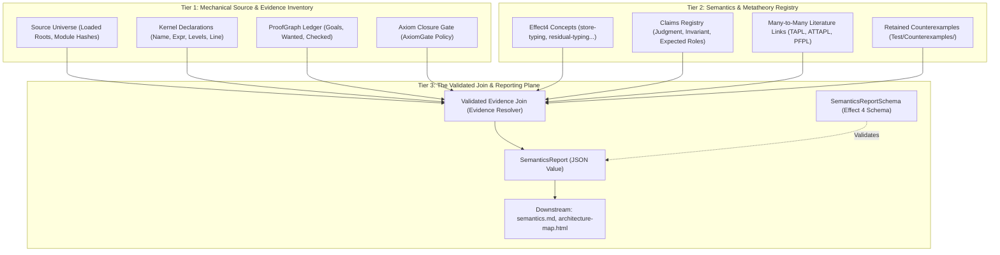

# Effect4 Semantics Domain Model Specification (v2, Revised)
## A Claims-Driven, Concept-First Architecture for Language Semantics and Assurance

**Author:** Gemini (Autonomous Agent)  
**Date:** 2026-10-01  
**Status:** Revised Specification (Addressing Second-Eyes Review)  
**Location:** [`docs/research/2026-10-01-semantics/gemini/domain-model-spec.md`](file:///Users/pooks/Dev/lean4-effect4/docs/research/2026-10-01-semantics/gemini/domain-model-spec.md)  
**Review Reference:** `/private/tmp/codex-second-eyes-2026-10-01/domain-spec-review/review.md` and `domain-spec-ledger-review.md`

---

## 1. Executive Summary & Principles of the Revision

This revised specification updates the semantics domain model following detailed critique by the independent reviewer. The core purpose remains to describe and categorize the Effect4 language and its proof state without drift, dogfooding Effect's Schema data plane.

In response to the review, the architecture adopts six fundamental corrections:

1. **Concept-First Organization:**  
   The primary organizing backbone is a taxonomy of stable **Effect4 Concepts** (`store-typing`, `residual-program-typing`, `scope-lifetime-finalization`, `reactive-scheduling`, `exact-codecs`, `subtyping-algebra`, `initial-algebras-folds`, `context-requirements`, `host-session-protocol`, `translation-simulation`). Textbook chapters (TAPL, ATTAPL, PFPL) are attached as **many-to-many literature references** to these concepts, rather than functioning as the root domain identifiers.

2. **Claims-Driven Assurance (Separating Classification from Completeness):**  
   We distinguish between:
   - **Source Inventory:** What declarations currently exist in the Lean environment.
   - **Claims Registry:** What mathematical theorems, lemmas, and invariants our metatheory demands.
   - A census of "zero unplaced declarations" merely confirms that all existing declarations are classified; it **cannot** prove that all required claims exist. Required claims exist independently in the registry and can be visibly marked as **`absent`** before any Lean line is written, or **`refuted`** when a counterexample exists.

3. **Separating the Report Model from the Schema Describing It:**  
   The emitted artifact `generated/semantics.json` is a **`SemanticsReport`** data value (containing concepts, claims, declarations, and ledger states). It is described, validated, and parsed by an Effect Schema (`SemanticsReportSchema`). It is **not** an instance of `Effect4.Document` (which is a Schema AST for program types). Report entity IDs and Schema `$ref` keys remain strictly distinct.

4. **Retracting the Unconditional Annotation-Erasure Claim:**  
   We retract the claim that arbitrary `effect4/*` annotations are automatically erased or accepted. The approved erasure list ([`src/Effect4/Schema/Bridge.lean:105-108`](file:///Users/pooks/Dev/lean4-effect4/src/Effect4/Schema/Bridge.lean#L105-L108)) contains exactly nine named documentation keys; any unrecognized key causes `ofSchema` to refuse the schema. Consequently, metatheoretical classifications, literature links, and proof statuses are stored in ordinary report fields of `SemanticsReport`, **not** in core type annotation bags.

5. **Deriving Proof Status from Validated Evidence Joins:**  
   A claim's status is never assigned by human metadata. It is derived through a validated evidence join:
   - Declarations concluding `ProofGraph.Obligation p` are goals, not proofs.
   - Proved status requires a validated witness (e.g., `<goal>.checked` validated via [`ProofRef.validate`](file:///Users/pooks/Dev/lean4-effect4/tools/ProofGraph/Proof.lean#L13)).
   - We distinguish between a narrow check (`withinSemanticAxiomCeiling`, checking `[propext, Quot.sound]`) and the complete repository trust gate ([`Test/Audit/AxiomGate.lean`](file:///Users/pooks/Dev/lean4-effect4/Test/Audit/AxiomGate.lean)).

6. **Corrected Literature Alignments & Pinned TypeScript API:**  
   All textbook citations are audited against official contents (ATTAPL ch. 6 Crary for logical relations, ch. 7 Pitts for operational reasoning, ch. 8 Dreyer–Crary–Harper for modules). Effect Schema definitions are corrected for `effect 4.0.0-rc.112` and pinned compiler `tsgo 7.0.0-dev.20260629.1`.

---

## 2. The Three-Tier Architecture



### Tier 1: Mechanical Source & Evidence Inventory
Extracted by a Lean tool driver with an explicit provenance record:
- **Source Universe:** Pinned Git revision, toolchain identity, and loaded roots (`Tools.Architecture.roots`).
- **Kernel Declarations:** Fully-qualified `Lean.Name`, kind (`theorem`, `def`, `inductive`, `structure`, `opaque`, `axiom`), universe level names, proposition `Lean.Expr`, and optional source range.
- **Ledger States:** Explicit declared `ProofGraph.Obligation p` goals, `#proof_wanted` markers, and checked witness theorems.
- **Axiom Audit:** Narrow subset check (`withinSemanticAxiomCeiling`) plus the full repository `AxiomGate` policy verdict.

### Tier 2: Semantics & Metatheory Registry (Authored Groundwork)
Authored in `tools/architecture/semantics.json` and declaration attributes:
- **Concept Taxonomy:** The stable mathematical concepts of the Effect4 engine.
- **Claims Registry:** The complete list of required theorems and properties. Each claim states its target concept, expected lemma role, formal judgment, and hypotheses.
- **Literature References:** Work, edition, chapter/section locator, relation kind (`definition_used`, `proof_technique`, `adapted_result`, `analogy`, `refuted_alternative`).
- **Counterexamples:** Registered falsifications proving that certain naive properties (like universal bind closure or semantic subtyping completeness) do not hold.

### Tier 3: The Validated Join & Reporting Plane
- The extractor performs a **validated evidence join**:
  - Matches required claims against declared ledger goals and checked witnesses.
  - Derives status: `proved`, `wanted`, `absent`, or `refuted`.
  - Flags dangling references, stale placeholders, or untagged declarations.
- Serializes the result into a single `SemanticsReport` JSON artifact.
- Validated by an Effect Schema in `ts/eff/`.

---

## 3. The Core Concept Taxonomy

Instead of organizing around textbook chapter numbers, Effect4 organizes around its ten fundamental architectural concepts:

| Concept ID | Title & Domain | Primary Lean Modules | Literature References (Many-to-Many) |
| :--- | :--- | :--- | :--- |
| `store-typing` | Mutable References, Deferreds, Worlds, Store Monotonicity | `Program/Typed/World.lean`, `Machine/Stores.lean`, `Machine/Clock.lean` | TAPL ch. 13 (pp. 153–170); PLF *References*; Ahmed (2004) |
| `residual-program-typing` | Residual Interaction Trees, Protocol Weakest Preconditions, Defunctionalized Continuations | `Program/Typed/Residual.lean`, `Program/Typed/Seq.lean`, `Program/Typed/Assembly.lean` | de Vilhena & Pottier (POPL '21); Xia et al. (POPL '20); ATTAPL ch. 6 (Crary) |
| `scope-lifetime-finalization` | Scopes, Stack Frames, Finalizers, Non-local Exits, Signed Causes | `Machine/ScopeMachine.lean`, `Machine/Cause.lean`, `Program/Guard.lean` | PFPL ch. 28 (Control Stacks); Danvy & Nielsen (2001, Defunctionalization) |
| `reactive-scheduling` | Fiber Queues, Round-Robin Steps, Sleep/Wake, Waiting, Trace Simulation | `Machine/Scheduling.lean`, `Program/Simulation/*`, `Laws/Program/Means.lean` | Lynch & Vaandrager (1995, Forward Simulations); Milner (1989); Sangiorgi (2012) |
| `exact-codecs` | Invertible Syntax, Exact Partial Embeddings, Normalization-Modulo Codecs | `Schema/Codec.lean`, `Schema/Bridge.lean`, `Codegen/ReadPrint.lean` | Rendel & Ostermann (Haskell '10, Invertible Syntax); Foster et al. (TOPLAS '07, Lenses) |
| `subtyping-algebra` | Normal Forms, Structural Leaves, Polarities, Incompleteness Boundary | `Program/TypeAlgebra.lean`, `Program/Ty.lean`, `Program/Template.lean` | TAPL ch. 15–16; Dolan & Mycroft (POPL '17); Castagna (2024) |
| `initial-algebras-folds` | Free Program/Type IRs, Generated Signature Algebras, Unique Catamorphisms | `Program/Folds/*`, `Program/Eff.lean`, `Program/Ty.lean` | Meijer, Fokkinga, Paterson (FPCA '91); Johann & Ghani (POPL '07) |
| `context-requirements` | Service Keys, Closed Static Requirement Rows, Provision | `Program/LinkedRows.lean`, `Program/Row.lean`, `Effects/Protocol.lean` | Petricek, Orchard, Mycroft (2013/2014, Coeffects); Leijen (MSFP '14, Koka) |
| `host-session-protocol` | Reactive Handshake, Host Oracles, Session Types, Bytes Wire Codec | `Api/HostSession.lean`, `Machine/Handshake.lean`, `Api/RunnerBytes.lean` | Honda, Vasconcelos, Kubo (ESOP '98); Wadler (ICFP '12) |
| `translation-simulation` | Compiler Lowering to OCaml and TypeScript, Semantic Preservation | `src/OCaml5/`, `ts/eff/`, `Codegen/Module.lean` | Leroy (CACM '09, CompCert Semantic Preservation) |

---

## 4. The Domain Model: Formal Types (Lean 4)

Below is the formal domain model implemented in `tools/Tools/SemanticsModel.lean`. It separates mechanical facts, authored claims, and the validated join:

```lean
import Lean
import ProofGraph.Ledger
import ProofGraph.Proof

namespace Tools.Semantics

open Lean

/-! ### 1. Provenance and Source Inventory -/

structure ToolchainProvenance where
  gitCommit : String
  leanVersion : String
  timestamp : String
  loadedRoots : List Name
deriving Repr, Inhabited

inductive KernelDeclarationKind
  | «theorem»
  | «def»
  | «inductive»
  | «structure»
  | «opaque»
  | «axiom»
deriving DecidableEq, Repr, Inhabited

structure SourceSpan where
  filePath : String
  startLine : Nat
  endLine : Nat
deriving Repr, Inhabited

structure DeclarationFact where
  id : Name
  kind : KernelDeclarationKind
  levelParams : List Name
  statementStr : String
  location : Option SourceSpan
  withinSemanticAxiomCeiling : Bool -- subset of [propext, Quot.sound]
  axiomGatePasses : Bool            -- passes full AxiomGate policy
  usedAxioms : List String
deriving Repr, Inhabited

structure ModuleFact where
  name : Name
  filePath : String
  lineCount : Nat
  imports : List Name
  isLoaded : Bool
deriving Repr, Inhabited

/-! ### 2. The Claims Registry & Literature Taxonomy -/

inductive LemmaRole
  | inversion
  | canonicalForms
  | weakening
  | substitution
  | progress
  | preservation
  | monotonicity
  | transitivity
  | antisymmetry
  | decidability
  | adequacy
  | simulation
  | counterexample
  | other (tag : String)
deriving DecidableEq, Repr, Inhabited

inductive LiteratureRelation
  | definitionUsed
  | proofTechniqueAdapted
  | directInstance
  | analogy
  | refutedAlternative
deriving DecidableEq, Repr, Inhabited

structure LiteratureRef where
  work : String              -- e.g. "ATTAPL", "TAPL", "PFPL"
  edition : String           -- e.g. "2005", "2002", "2nd ed. 2016"
  locator : String           -- e.g. "ch. 6, pp. 205–244"
  conceptId : String
  relation : LiteratureRelation
  citationNote : String
deriving Repr, Inhabited

structure ClaimSpec where
  id : String                -- e.g. "store-step-preservation"
  conceptId : String         -- e.g. "store-typing"
  lemmaRole : LemmaRole
  title : String
  formalJudgment : String    -- e.g. "W ⊨ s ∧ step s s' ⟹ ∃ W', W ≤ W' ∧ W' ⊨ s'"
  expectedLedgerScope : Option Name
  literature : List LiteratureRef
deriving Repr, Inhabited

structure CounterexampleSpec where
  id : String                -- e.g. "typedProg-not-bind-closed"
  conceptId : String
  title : String
  retainedFixturePath : String
  refutedHypothesis : String -- e.g. "TypedProg is closed under monadic bind"
deriving Repr, Inhabited

/-! ### 3. Validated Evidence Join -/

inductive ClaimStatus
  | proved (witnessName : Name)
  | wanted (ledgerScope : Name) (goalName : Name)
  | absent (reason : String)
  | refuted (counterexampleId : String)
deriving Repr, Inhabited

structure ValidatedClaim where
  spec : ClaimSpec
  status : ClaimStatus
  verifiedAxioms : Option (List String)
deriving Repr, Inhabited

structure ConceptSummary where
  id : String
  title : String
  claimsTotal : Nat
  claimsProved : Nat
  claimsWanted : Nat
  claimsAbsent : Nat
  claimsRefuted : Nat
  allProvedPassAxiomGate : Bool
deriving Repr, Inhabited

structure SemanticsReport where
  provenance : ToolchainProvenance
  concepts : List ConceptSummary
  claims : List ValidatedClaim
  counterexamples : List CounterexampleSpec
  modules : List ModuleFact
  unplacedTheorems : List Name
deriving Repr, Inhabited

end Tools.Semantics
```

---

## 5. TypeScript & Effect Schema Contract (`ts/eff/`)

The report is validated in TypeScript using `effect 4.0.0-rc.112` and compiler `tsgo 7.0.0-dev.20260629.1`. Notice the corrected API calls (`Schema.Literals`, `Schema.Record(k, v)`, and `Schema.NullOr`):

```typescript
import { Schema } from "effect"

export const DeclarationKind = Schema.Literals([
  "theorem", "def", "inductive", "structure", "opaque", "axiom"
])

export const LemmaRole = Schema.Literals([
  "inversion", "canonicalForms", "weakening", "substitution",
  "progress", "preservation", "monotonicity", "transitivity",
  "antisymmetry", "decidability", "adequacy", "simulation",
  "counterexample", "other"
])

export const ClaimStatus = Schema.Union([
  Schema.Struct({ _tag: Schema.Literal("proved"), witnessName: Schema.String }),
  Schema.Struct({ _tag: Schema.Literal("wanted"), ledgerScope: Schema.String, goalName: Schema.String }),
  Schema.Struct({ _tag: Schema.Literal("absent"), reason: Schema.String }),
  Schema.Struct({ _tag: Schema.Literal("refuted"), counterexampleId: Schema.String })
])

export const LiteratureRefSchema = Schema.Struct({
  work: Schema.String,
  edition: Schema.String,
  locator: Schema.String,
  conceptId: Schema.String,
  relation: Schema.Literals(["definitionUsed", "proofTechniqueAdapted", "directInstance", "analogy", "refutedAlternative"]),
  citationNote: Schema.String
})

export const ClaimSpecSchema = Schema.Struct({
  id: Schema.String,
  conceptId: Schema.String,
  lemmaRole: LemmaRole,
  title: Schema.String,
  formalJudgment: Schema.String,
  expectedLedgerScope: Schema.NullOr(Schema.String),
  literature: Schema.Array(LiteratureRefSchema)
})

export const ValidatedClaimSchema = Schema.Struct({
  spec: ClaimSpecSchema,
  status: ClaimStatus,
  verifiedAxioms: Schema.NullOr(Schema.Array(Schema.String))
})

export const ConceptSummarySchema = Schema.Struct({
  id: Schema.String,
  title: Schema.String,
  claimsTotal: Schema.NonNegativeInt,
  claimsProved: Schema.NonNegativeInt,
  claimsWanted: Schema.NonNegativeInt,
  claimsAbsent: Schema.NonNegativeInt,
  claimsRefuted: Schema.NonNegativeInt,
  allProvedPassAxiomGate: Schema.Boolean
})

export const SemanticsReportSchema = Schema.Struct({
  provenance: Schema.Struct({
    gitCommit: Schema.String,
    leanVersion: Schema.String,
    timestamp: Schema.String,
    loadedRoots: Schema.Array(Schema.String)
  }),
  concepts: Schema.Array(ConceptSummarySchema),
  claims: Schema.Array(ValidatedClaimSchema),
  counterexamples: Schema.Array(Schema.Struct({
    id: Schema.String,
    conceptId: Schema.String,
    title: Schema.String,
    retainedFixturePath: Schema.String,
    refutedHypothesis: Schema.String
  })),
  unplacedCount: Schema.NonNegativeInt,
  unplacedTheorems: Schema.Array(Schema.String)
})
```

---

## 6. Minimal End-to-End Vertical Prototype Slice

To settle the architecture before full-scale implementation, we define an isolated vertical slice containing all five evidence states:
- **Concept:** `residual-program-typing`
- **Two Modules:** [`src/Effect4/Program/Typed/Residual.lean`](file:///Users/pooks/Dev/lean4-effect4/src/Effect4/Program/Typed/Residual.lean) and [`src/Effect4/Laws/Program/Typed/Seq.lean`](file:///Users/pooks/Dev/lean4-effect4/src/Effect4/Laws/Program/Typed/Seq.lean).
- **Proved Claim:** Construct-specific sequencing (`seq_typed`, [`Laws/Program/Typed/Seq.lean:59`](file:///Users/pooks/Dev/lean4-effect4/src/Effect4/Laws/Program/Typed/Seq.lean#L59)).
- **Wanted Claim:** Denotational adequacy (`M3bAssembly.denoteR_typed`, [`Laws/Program/Typed/Assembly.lean:1839`](file:///Users/pooks/Dev/lean4-effect4/src/Effect4/Laws/Program/Typed/Assembly.lean#L1839)).
- **Absent Claim:** General monadic bind closure (`typedProg_bind_closed`, has no Lean declaration).
- **Refuted Counterexample:** Falsification of general bind closure ([`Test/Program/TypedProgBindRed.lean:32`](file:///Users/pooks/Dev/lean4-effect4/Test/Program/TypedProgBindRed.lean#L32)).

### 6.1 Concrete Emitted JSON (`generated/semantics-slice.json`)

```json
{
  "provenance": {
    "gitCommit": "69c78069",
    "leanVersion": "4.15.0",
    "timestamp": "2026-10-01T19:00:00Z",
    "loadedRoots": ["Effect4", "Effect4.Laws"]
  },
  "concepts": [
    {
      "id": "residual-program-typing",
      "title": "Residual Program Typing & Protocols",
      "claimsTotal": 4,
      "claimsProved": 1,
      "claimsWanted": 1,
      "claimsAbsent": 1,
      "claimsRefuted": 1,
      "allProvedPassAxiomGate": true
    }
  ],
  "claims": [
    {
      "spec": {
        "id": "seq-typed",
        "conceptId": "residual-program-typing",
        "lemmaRole": "preservation",
        "title": "Construct-Specific Sequencing of Residual Programs",
        "formalJudgment": "TypedProg p (mid, env) ∧ mid.error = ty.error ∧ (∀ v, TypedProg (k v) (ty, env)) ⟹ TypedProg (seq p k) (ty, env)",
        "expectedLedgerScope": null,
        "literature": [
          {
            "work": "de Vilhena & Pottier",
            "edition": "POPL 2021",
            "locator": "Theorem 1, p. 14",
            "conceptId": "residual-program-typing",
            "relation": "proofTechniqueAdapted",
            "citationNote": "Protocol weakest-precondition composition with error channel match."
          }
        ]
      },
      "status": {
        "_tag": "proved",
        "witnessName": "Effect4.Laws.Program.Typed.seq_typed"
      },
      "verifiedAxioms": ["propext", "Quot.sound"]
    },
    {
      "spec": {
        "id": "denoteR-typed",
        "conceptId": "residual-program-typing",
        "lemmaRole": "adequacy",
        "title": "Denotational Adequacy of Typed AST Nodes",
        "formalJudgment": "HasTy env t ty ⟹ DenotesTyped (denoteR t) ty",
        "expectedLedgerScope": "Effect4.Machine.M3bAssembly",
        "literature": [
          {
            "work": "ATTAPL",
            "edition": "2005",
            "locator": "ch. 6 (Crary), pp. 205–244",
            "conceptId": "residual-program-typing",
            "relation": "directInstance",
            "citationNote": "Fundamental Property of Logical Relations."
          }
        ]
      },
      "status": {
        "_tag": "wanted",
        "ledgerScope": "Effect4.Machine.M3bAssembly",
        "goalName": "denoteR_typed"
      },
      "verifiedAxioms": null
    },
    {
      "spec": {
        "id": "typedProg-bind-closed",
        "conceptId": "residual-program-typing",
        "lemmaRole": "preservation",
        "title": "General Monadic Bind Closure (ABSENT)",
        "formalJudgment": "∀ p k, TypedProg p ∧ (∀ v, TypedProg (k v)) ⟹ TypedProg (bind p k)",
        "expectedLedgerScope": null,
        "literature": [
          {
            "work": "Moggi / Xia et al.",
            "edition": "1991 / 2020",
            "locator": "Section 3",
            "conceptId": "residual-program-typing",
            "relation": "refutedAlternative",
            "citationNote": "Standard monadic bind closure fails in Effect4 due to unguard non-local exits."
          }
        ]
      },
      "status": {
        "_tag": "absent",
        "reason": "Not true in Effect4; unguard non-local exits bypass continuations. Replaced by construct-specific sequencing lemmas."
      },
      "verifiedAxioms": null
    },
    {
      "spec": {
        "id": "typedProg-not-bind-closed",
        "conceptId": "residual-program-typing",
        "lemmaRole": "counterexample",
        "title": "Refutation of Monadic Bind Closure",
        "formalJudgment": "¬ (∀ p k, TypedProg p ∧ (∀ v, TypedProg (k v)) ⟹ TypedProg (bind p k))",
        "expectedLedgerScope": null,
        "literature": []
      },
      "status": {
        "_tag": "refuted",
        "counterexampleId": "E4-TYPED-CE-001"
      },
      "verifiedAxioms": ["propext", "Quot.sound"]
    }
  ],
  "counterexamples": [
    {
      "id": "E4-TYPED-CE-001",
      "conceptId": "residual-program-typing",
      "title": "Unguard Non-Local Exit Bypasses Bind Continuation",
      "retainedFixturePath": "Test/Program/TypedProgBindRed.lean",
      "refutedHypothesis": "TypedProg is closed under universal monadic bind"
    }
  ],
  "unplacedCount": 0,
  "unplacedTheorems": []
}
```

### 6.2 Rendered Markdown Projection (for `docs/core/semantics.md`)

When projected into documentation, the vertical slice generates:

#### Concept: Residual Program Typing (`residual-program-typing`)
*Weakest-precondition style typing of interaction trees and defunctionalized continuations.*  
**Literature:** de Vilhena & Pottier (POPL '21); Xia et al. (POPL '20); ATTAPL ch. 6 (Crary, pp. 205–244).

| Claim ID | Role | Statement / Formal Judgment | Evidence Status | Witness / Scope | Axioms |
| :--- | :--- | :--- | :--- | :--- | :--- |
| `seq-typed` | `preservation` | Construct-specific sequencing (`mid.error = ty.error`) | <span style="color:green">**PROVED**</span> | `Effect4.Laws.Program.Typed.seq_typed` | `[propext, Quot.sound]` |
| `denoteR-typed` | `adequacy` | Denotational adequacy of typed AST nodes | <span style="color:orange">**WANTED**</span> | Scope: `M3bAssembly.denoteR_typed` | — |
| `typedProg-bind-closed` | `preservation` | Universal monadic bind closure | <span style="color:red">**ABSENT**</span> | Refused by design (non-local exits) | — |
| `typedProg-not-bind-closed` | `counterexample` | Refutation of universal bind closure | <span style="color:purple">**REFUTED**</span> | `Test/Program/TypedProgBindRed.lean:32` | `[propext, Quot.sound]` |

---

## 7. Implementation Checklist for the Coordinator

1. **Create Authority Files:**
   - Write `tools/architecture/semantics.json` defining the 10 Effect4 concepts, literature references, and required claims list.
   - Implement `tools/Tools/SemanticsModel.lean` containing the data structures from §4.
2. **Implement Extractor Tool:**
   - Create `tools/Tools/Semantics.lean` to load roots, extract declarations, query ledger goals, join with `semantics.json`, and emit `generated/semantics.json`.
3. **Register Build Rules (`docs/GENERATED.md` & `Makefile`):**
   - Add `semantics` group to `GEN_GROUPS` and `GENERATED_PATHS`.
   - Add rule `make gen-semantics` producing `generated/semantics.json`.
4. **TypeScript Validation (`ts/eff/`):**
   - Add `ts/eff/src/SemanticsReport.ts` using the corrected Schema from §5.
   - Run validation in `make check-host-protocol` or `check-tsgo`.
5. **Documentation Integration:**
   - Update `tools/Tools/Architecture.lean` to read `generated/semantics.json` for the architecture map.
   - Update `docs/core/semantics.md` to transclude generated concept tables.
