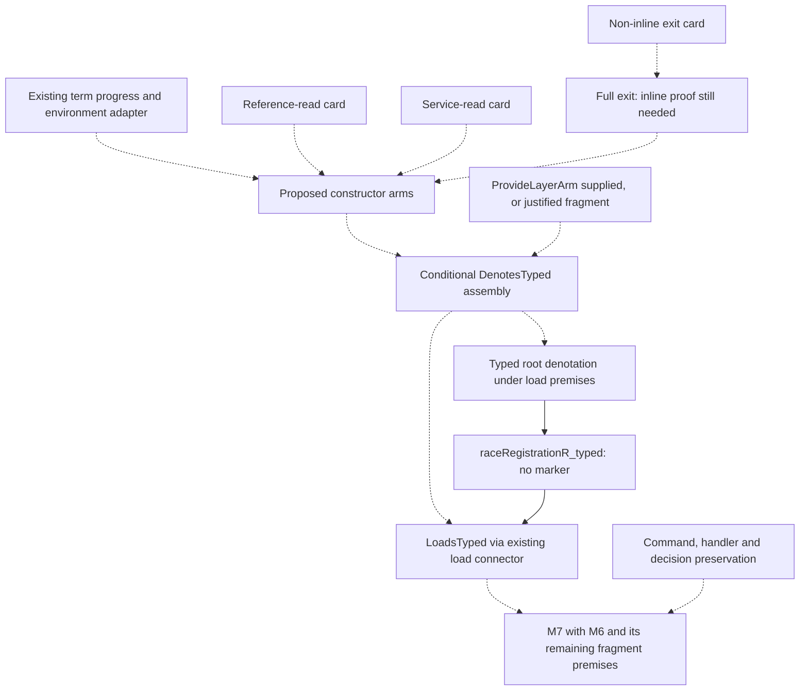

# Use the book to shorten the next proof decisions

Three small proof tasks can advance M5 without changing its statement. The supplied book helps
organize their assumptions and explanations. It does not supply their Effect4 proofs. The
[proof cards](proof-cards.md) give the concrete order; [documentation tooling](tooling-adoption.md)
gives two measured improvements to the existing semantics report.

This is research for adoption during consolidation. No production proof, policy, registry,
generated report, or active Gemini file changed. Read source claims below at Gemini commit
`a8cc886697e173e28a7cf67eca0f49566164b0d8`. The selected report is not the complete obligation set.

## Source and citation audit

The retrieved PDF is *Types for Proofs and Programs*, TYPES 2003, LNCS 3085, edited by Stefano
Berardi, Mario Coppo and Ferruccio Damiani, Springer, 2004. Robin Adams wrote its first chapter.
This is not Pierce's TAPL or a Robin Adams textbook called *Proofs and Types*.

Local source: `/Users/pooks/Dev/lean4-effect4/docs/research/2026-10-01-semantics/sources/types-2003-proofs-and-programs.pdf`.
SHA-256: `c96a2965756f8388b1bfc4d8ddf890a415e32b219dc1a7ac9eed7ef6af1c7dfe`.
The owner's copy has 417 PDF pages; printed page `p` of these chapters is PDF page `p + 8`.
All three chapters were read in full. Formula/layout samples were visually checked at PDF
pages 19, 46 and 392. The PDF and whole-chapter extracts remain local, outside this commit.

The following rows are proposed additions to the existing source index and citation audit,
not a second bibliography authority. `literature-refs.json` uses the already-landed
`LiteratureRef` fields; the existing Effect Schema accepts those shapes. Its acceptance alone
cannot verify a citation. Do not claim these proposed keys resolve in the canonical index yet.

| Proposed work key / audit row | Full work and inspected locator | What the source says | Our use and limit |
| --- | --- | --- | --- |
| `Adams2004` / `TYPES-A1` | Robin Adams, *A Modular Hierarchy of Logical Frameworks*, pp. 1–16; §3.4, pp. 11–12, Theorem 1; qualifications §1, pp. 1–2 and §6, p. 15 | For the presented hierarchy, adding a feature whose dependencies are present preserves derivability of old-framework judgments. The paper gives a derivation-induction argument; general sufficient conditions for arbitrary features remain future work. | **Analogy for reviewing changes.** List affected constructors, judgments, rules and dependencies, then say what remains unchanged and what needs reproving. This does not prove an Effect4 invariant repair conservative, or establish runtime preservation. |
| `Ballarin2004` / `TYPES-B1` | Clemens Ballarin, *Locales and Locale Expressions in Isabelle/Isar*, pp. 34–50; §§3.2–3.5, pp. 37–41; identity/merge discussion §§4.1–4.3, pp. 42–47 | A locale fixes parameters, assumes propositions and derives facts. Export retains those assumptions in universally quantified conditional theorems. Locale/parameter instances matter when merging facts. The account is a tutorial and first step toward semantics, not a generic soundness theorem. | **Proof organization technique.** Reuse Lean parameters, existing predicate bundles and named assumptions. Same English title does not identify two differently instantiated claims. No new locale framework is needed. |
| `Wiedijk2004` / `TYPES-W1` | Freek Wiedijk, *Formal Proof Sketches*, pp. 378–393; §§3–4, pp. 383–386; §7, pp. 388–389 | A sketch is related to a full Mizar formalization by deleting proof steps/references. Filling a sketch can uncover a wrong plan. Explicit justification problems provide bounded targets for automation. | **Proof planning technique.** Keep one short explanation of the argument, exact Lean subgoals and named dependencies. A sketch, a declared obligation and a conditional assembly theorem do not establish an unconditional capstone. We do not import Mizar's partial-checking convention into Lean. |

These relations describe our proposed method. Do not append all three citations to every
semantic theorem or describe an unimplemented proof as having used the technique. Semantic
sources such as Ahmed, the protocol papers, and TAPL remain attached to the judgments they
actually motivate. The book adds a method for organizing those proofs.

## What this changes in the work plan

1. **Reuse results before adding goals.** `evalTerm_progress` and its environment adapter already
   prove existence of an evaluated value as well as membership, under the native atom table and
   typed environment. The completed `TermFits` adapter remains a conditional membership result;
   it need not be strengthened. `raceRegistrationR_typed` already discharges the separate marker
   premise of `loadsTyped_of_denotesTyped` once the root denotation has been typed. These are
   evidence/placement tasks, not two new semantic obligations.
2. **Keep each proof's assumptions visible.** An M5 arm consumes point admission, source/world
   service-table agreement, a concrete constructor and any child hypothesis. A store arm proves
   protocol permission and continuation typing; actual handler fulfillment belongs to M6. This
   is the useful Ballarin adaptation: derived results retain the context that made them true.
3. **Use a checked conditional assembly as a milestone.** A theorem taking `ProvideLayerArm root`
   can establish `DenotesTyped root` conditionally. Its parameter remains visible until a real
   layer proof supplies it. It must not close the original ledger goal merely because the
   conditional theorem compiles. Even a layer-free corollary needs a named fragment and a proof
   that the layer premise cannot arise there; a free hypothesis is not that proof.
4. **Explain the semantic move, not every tactic.** For reference reads: membership exposes a
   declaration; compatible world extension keeps that declaration; the reply's membership at
   its declared type yields membership at the requested type. Those are the useful steps to
   show in the chapter. The elaborated theorem and generated statement carry all binders.

Adams's conservativity must not be confused with Kripke persistence. The former is about which
judgments a logical framework can derive after adding features; `leHost` and `fits_mono` concern
membership under compatible world extension. Transition preservation additionally types changed
contents and re-establishes state invariants. None implies the other without another theorem.

## A small proof graph, with honest edge meanings

This is an authored plan, not output from the ledger. Solid edges name existing theorem
interfaces; dotted edges name planned proof assembly. Status remains in the existing report.

Kernel-checked theorem applications, explicit ledger dependency edges, and the next-work plan
are different things. The present collector validates exact goal evidence and placeholders but
constructs goals with empty dependency arrays. The underlying checker rejects cycles and missing
nodes when edges are supplied. Do not advertise this planning diagram as a mechanically extracted
M5/M6 graph. The tooling note describes the narrow next step without inventing another ledger.

## A decision rule for each future slice

Choose the smallest unproved claim with available premises and a named consumer. Its record
contains the exact source judgment, the existing claim/goal identity, the literature relation and
its limit, one paragraph of argument, the precise statement, positive/refusing controls, and the
consumer. If the statement fails, preserve the refutation and propose a ruling. If only proof
placement fails, fix the dependency direction rather than changing the semantic claim.

The author supplies meaning and citations; the compiler supplies statements, universes and axiom
footprints; the current ledger supplies evidence status; the generated report displays those
facts. A completed helper may leave the selected report's counts unchanged. Record the helper
and its consuming edge instead of manufacturing a new top-level claim to move a number.
