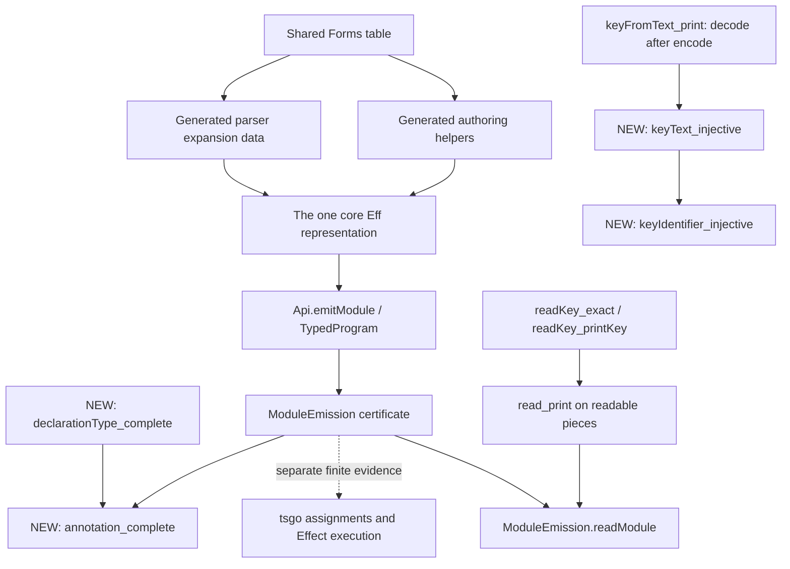

# Service identity in the existing proof map

This is a view of checked declarations and their consumers, not a second registry. The existing feature is `printed-modules` in `tools/Tools/ProofMapSelection.lean`. The new claims below are proposed additions to that feature and the semantics registry; the active coordinator reports are not regenerated by this slice.

The arrows distinguish construction/consumption from the dotted external validation step. `keyIdentifier_injective` is a standalone syntax claim about the Identifier constructor; it is not a premise secretly supplied to the TypeScript compiler. The exact key laws continue into existing module readback proofs.

| Claim | Exact statement and reach | Status |
| --- | --- | --- |
| `keyIdentifier_injective` | At one fixed scope key, distinct ServiceKeys yield distinct TypeRef identifiers, independently of carrier equality | Proved; proposed registry id `service-identifier-injective` |
| `ModuleEmission.annotation_complete` | Every certified module has a main declaration with explicit answer, error and the complete requirement row | Proved; proposed registry id `emission-requirements-complete` |
| `readKey_exact`, `readKey_printKey` | The canonical key syntax and its key read back exactly on successful printing/reading | Existing statements retained, proofs adapted and checked |
| `ModuleEmission.readModule` | The emitted module reads back to its source program under lawful-table and readable-piece hypotheses | Existing proof checked against the changed printer |
| Forms typing transport | `effTy_insert`, template rules and concrete form laws reuse weakening and the core checker; generated authoring forms have scoping laws | Existing source inspected; no new Forms table or semantics |
| Target interpretation | Full-key identities, remaining requirements, real Scope service, correct and wrong provisions | Tested with tsgo7 and Effect rc.112; no general host theorem |

The identity proof is the elementary retraction argument: apply the decoder to equal encodings, then use `keyFromText_print` to recover equal keys. Exactness/retraction are Concept5 in `docs/core/semantics.md`; requirements belong to Concept8. This is the repository's existing invertible-syntax framework, not a newly invented equivalence. The source owner cites Rendel/Ostermann, Foster et al. and profunctor optics there; this slice relies on its concrete Lean laws and does not claim to mechanize those papers.

The API still separates source typing, syntax reconstruction, target compilation and execution. Missing a TypeScript annotation used to hide g309's inference gap; retaining it now exposes that gap. Neither syntax theorem establishes M6, liveness, global service-name freshness across linked modules, or general TypeScript execution correctness.
