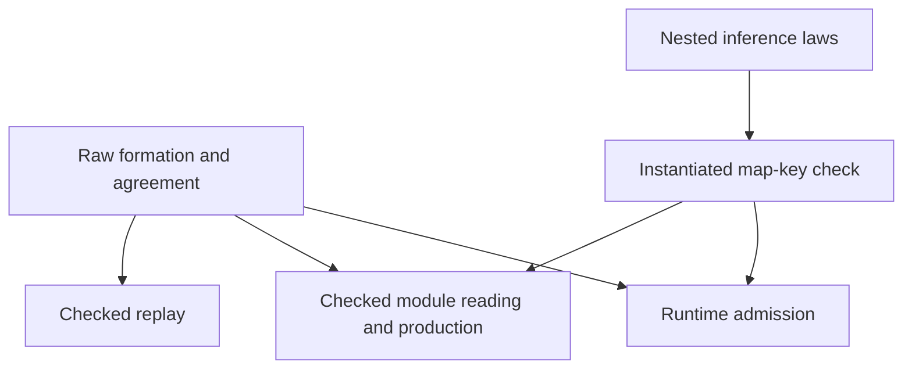

# Program admission slice

Status: implementation brief. Base: `82d34358`. Branch: `codex/data-admission`.

## Contract

Rows 192 and 193 require one formation check before normalization at every checked public boundary.
The check inspects raw program annotations and every request, answer and error type in the raw table.
It refuses repeated record names and invalid closed map keys.
Open map keys remain available in row templates. Each actual row instantiation must have string map keys.
Program annotations do not defer map-key checks.

The declarative predicate quantifies over the raw subtype occurrences collected by the generated type fold.
Each record has distinct field names. Each map key normalizes to `string`, unless this is an open key in a template.
`checkInput_eq_none_iff` relates a successful check to that predicate. The certificate retains the predicate, not only a Boolean result.
Each refusal identifies the enclosing table column or program annotation, its subtype occurrence, and the reason.
The subtype occurrence is its deterministic preorder index. No normalizer runs before raw formation.

The check reaches `admitProgram`, `admitModule`, `emitModule`, `emitTypedModule`, `Api.printDecl` and `Api.replayChecked`.
Existing runtime, integer, handle, row and inhabitance restrictions remain separate and retained.
The replay refusal distinguishes formation from an actual decision refusal. An empty tape needs no invented decision.

Template inference gains structural cases for records, maps, tuples and nominal application arguments.
Record inference matches names. Tuple inference matches positions. Application inference requires the same constructor name.
Existing matching guards still establish subtyping; inferred bindings must retain the existing widening and closed-template laws.

## Proof placement

| Question | Concept and role | Consumer and reach | Exclusions and requirement |
| --- | --- | --- | --- |
| Raw formation check agrees with the declarative judgment | `subtyping-algebra`, decidability; proposed `raw-formation` claim | The admission certificate, checked module reading and production, checked replay; all existing raw type constructors | No inhabitance, codec or execution claim; R3 and R8 |
| Admission retains formation evidence | `residual-program-typing`, preservation; helper of `raw-formation` | `AdmittedProgram`, every successful checked boundary; exact original program and table | Existing typing remains necessary; no M6 or M7 extension; R1 and R3 |
| Nested inference preserves closed templates and widens bindings | `subtyping-algebra`, substitution; existing template laws extended | `matchTemplate`, `rowTy`, native atom schemes; existing `join` choices | No unrestricted inference completeness or union matching; R3 |
| Actual template use checks its instantiated map keys | `residual-program-typing`, compatibility; proposed `instantiated-formation` claim | `rowTy`, then the ordinary checker and M5; supplied row templates | No change to host reply admission; R1 and R3 |
| Checked boundaries cannot bypass formation | `residual-program-typing`, compatibility; helpers of `raw-formation` | Module certificates and replay's formation refusal; positive and negative fixtures | Finite fixtures supplement general certificate laws; no target or host execution claim |

The coordinator authored `raw-formation` and `instantiated-formation` as open claims in the semantics registry before proof work.
The landed theorems replace those open markers. The coordinator adds their pointers and root imports.
Helpers name the question and consumer. No second proof graph is introduced.

## Edit fence

- `src/Effect4/Program/Formation.lean`: shared predicate, fold collection, check and certificate agreement.
- `src/Effect4/Program/Admission.lean`: raw formation certificate and located refusal.
- `src/Effect4/Program/Ty.lean`: only required nested template inference helpers.
- `src/Effect4/Program/Typing/Rules.lean`: actual row-instantiation check.
- `src/Effect4/Codegen/Admit.lean` and `src/Effect4/Codegen/Checked.lean`: checked boundary consumers.
- `src/Effect4/Api.lean`: honest checked replay refusal and formation check.
- Direct existing proof and test consumers; dedicated formation proof and fixture files.
- This brief and the final receipt.

The coordinator owns root imports, `lakefile.toml`, decisions, the axiom gate and generated outputs.
No generated sort constructor changes in this slice. No full sweep or push.

## Verification

Request the coordinator's build slot before every Lean session.
Use `LEAN_NUM_THREADS=3 lake build` on the changed modules and direct consumers.
Run dedicated fixture files with `lake env lean` and print the exported theorems' axioms.
Run the reached case gate and inspect every generated-output requirement before regeneration.
Run `git diff --check` and the documentation checker on the new brief and receipt.

Controls cover nested duplicates, malformed closed keys, and valid or invalid substituted keys.
They cover every checked public boundary, empty replay tapes, nested template inference, and retained old refusals.
A failed or unresolved theorem is recorded without weakening its statement.

## Settled contract refinement

The coordinator approved strict formation of all three actual instantiated columns.
There is no closed-row bypass: signature normalization can turn an open key into closed `unknown`.
The old unconditional `rowTy_closed` statement gains a formation premise.
Its successful-result projection keeps its statement because success discharges the guard.

The next record slice adds raw type metadata inside a `Term` constructor.
That slice must extend `Formation.programSites` with the same `sites false` check for the declared fields.
The current collector covers the existing `iterate` annotation only.

Direct proof consumers include `Laws/Program/TypeAlgebra.lean`, `Template.lean`,
`CheckedTyping.lean`, `Handles/Evaluation.lean`, `Laws/Run.lean`, and the code generation and API laws.
Existing replay fixtures migrate to the explicit decision-refusal constructor.
New refusal cases append to existing alphabets.
Old cases retain their wire ordinals.
The generator needs `FormationReason` and `FormationRefusal` before `AdmitRefusal`.

The coordinator approved a shared diagnostic row checker and an appended `TypeReason.instantiatedFormation` case.
`checkRow_formation_iff` and `checkRow_request_iff` serve `instantiated-formation` and the existing located typing refusal.
They distinguish failed substitution formation from failed request subtyping. Request mismatch retains precedence.
The checker, blame alphabet, and their direct inversion law are included in this edit fence.
