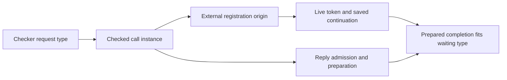

# Host call instances and live reply correspondence

The next host slice must retain the request type chosen by the checker.
Runtime values cannot reconstruct that choice.
This note proposes the next implementation boundary.
It changes no source, theorem statement, or decision register.

Evidence: source reading of the coordinator tree at `c101f5cf`, including its working changes.
Note base: `e9d975f7` on `codex/record-operations`.
No Lean command, generator, or runtime probe runs for this note.

## Existing evidence and missing evidence

`preflight_success_prepared_fits` already identifies the actual live request and external row (`src/Effect4/Laws/Api/HostSession.lean`).
It proves membership at that row's answer column when `shapeDecides` accepts the column.
It does not connect that column to the waiting continuation's declared type.

`ActiveDelivery` supplies the token declaration and saved `HostStack` (`src/Effect4/Laws/Program/Typed/Assembly.lean`).
It carries no relation between the live host row and that declaration.
`SchedulerState.requestsBelow` and `requestsOwned` concern token bounds and ownership (`src/Effect4/Laws/Program/Typed/Scheduler.lean`).
They supply no row typing relation.

`externalAsyncParks` obtains a certificate through `TypedProg.fiber_inv` (`src/Effect4/Laws/Program/Typed/Commands/Clauses/Async.lean`).
It discards the external precondition and declares the fresh token at that certificate.
`Evaluating.park_fresh_request` constructs the parked state and typed saved stack in the same file.
This producer is the place to retain the missing relation.

`Session` retains program admission but accepts an arbitrary machine field (`src/Effect4/Api/HostSession.lean`).
Program admission alone therefore supplies no execution history or relation to a typed reference state.
The existing reference interpreter accepts no row table (`interpR`, `src/Effect4/Laws/Program/InterpR.lean`).
The empty-table connection remains separate from a connection for nonempty row tables.

## Row 183 and information loss

Row 183 in `docs/core/decisions.md` recommends replacing template columns with the instance selected at the request.
`checkRow` computes that instance from the request's static type (`src/Effect4/Program/Typing/Rules.lean`).
`bitEntry` still compares template columns (`src/Effect4/Laws/Program/Typed/Residual.lean`).
`Denote.external_arm` types the call through those template columns (`src/Effect4/Laws/Program/Typed/Denotation.lean`).
Its instantiation lemma admits fewer replies than the checked instance permits.

Retain row 183's lawful `List<A>` to `Option<A>` example before changing these definitions.
Check that the instance admits `some 1` while the template membership refuses it.
Also retain the existing `none` case.
These are proposed finite controls, not results from this scout.

The same empty list can inhabit `List<nat>` and `List<string>`.
A variable can carry either static type while its environment supplies `Val.list []`.
`evalTerm` returns the stored value without that type (`src/Effect4/Machine/Term.lean`).
`Ty.infer` binds the template parameter differently for those request types (`src/Effect4/Program/Ty.lean`).
Thus identical runtime requests can require different reply columns.
A function of the value alone cannot recover both checked choices.

`EffName.external` stores only the operation and evaluated request (`src/Effect4/Program/Compile.lean`).
`denoteForeign` constructs the same pair (`src/Effect4/Laws/Program/DenoteR.lean`).
`externalRow`, `prepareExternalAnswer`, and `externalAdmits` read template columns in `src/Effect4/Program/Compile.lean`.
`admitAnswer` does likewise in `src/Effect4/Program/Admit.lean`.
Changing only `bitEntry` therefore leaves runtime reply admission inconsistent with the proposed rule.

## Representation options

A call instance means first-order data recording the checked request type and instantiated result columns.
It belongs to the existing `Ty` and program-metadata sorts.
Its production arrow projects checker evidence into data.
Its lookup arrow is a total-by-refusal map tied to the admitted program and table.
Neither option introduces another program IR.

| Option | Stored evidence | Smallest producer law | Cost and unresolved detail |
| --- | --- | --- | --- |
| A: checked call metadata, recommended | The checker emits call instances indexed by source origin; an external registration retains that origin | A successful metadata lookup yields the addressed `perform`, its checked request type, and the exact `checkRow` result | Extend the checker carrier, carry the origin to registration, and prove the metadata projection agrees with existing checking |
| B: checked compilation carries the instance | A compilation context carries the static environment and table; each emitted external registration stores its checked instance | Every emitted external registration contains the `checkRow` result for its source request under that context | Thread static types through continuations, generators, loops, layers, and compilation hooks; prove agreement with current compilation on accepted inputs |

`Point.path` and `Point.root` already identify a source origin (`src/Effect4/Program/Compile.lean`).
`Point` also carries runtime values, but no static environment or row instance.
`asyncRoute` currently drops the point when it constructs an external registration in that file.
Option A retains that origin instead of inferring a type from values.
A metadata entry must also retain its checking environment or checked binder evidence that determines that environment.

Do not assume path uniqueness through layer references and expansion.
Prove that metadata lookup follows the same source addressing as compilation.
Missing entries and ambiguous entries must refuse.
The checker and compilation must share the admitted program, table, and source-origin interpretation.
The host must not choose the request type or substitution.

Option A keeps the compiler's existing runtime environment model.
Option B moves that evidence into compilation but changes more function interfaces.
Both options require a reviewed alphabet and serialization change for stored external registrations.
Keep existing constructor tags and apply the generated compatibility checks.
The coordinator must choose the concrete metadata owner before implementation.

## Bounded producer and its consumer

After choosing the representation, add a proof-only view of one actual external park.
The proposed `ExternalParkView` records the following evidence:

- the exact live fiber, token, operation, request, and call instance;
- the fresh token's declaration in the resulting world;
- the instance's answer and error columns below that declaration;
- the saved `HostStack` from that declaration to the fiber's result type.

Construct this view from the typing inversion used by `externalAsyncParks` and the state returned by `Evaluating.park_fresh_request`.
Do not accept the row-to-token relation as an additional premise of that constructor.
Derive it from the checked instance retained in the external precondition.
A later interruption can retire the call, so application must recheck that its token remains live.

The immediate consumer extends the successful-preflight claim with membership at the view's token type.
It combines the actual prepared-value theorem with the instance-to-token subtype relation.
A failure consumer combines error-column membership with row 191's reserved-defect exclusion.
Neither consumer should infer a token declaration from the reply itself.

A native session also needs a connection between its stored call and this producer evidence.
A checked view can carry that connection without inserting proof fields into canonical program content.
The existing `BookMeans`, `CodeMeans`, and `Means` describe structural state relations (`src/Effect4/Laws/Machine/Book.lean`, `src/Effect4/Laws/Program/Means.lean`).
They do not establish reachability under the current nonempty-row-table runtime.
Do not present a conditional view theorem as a theorem about every session prefix.

## Proof placement

| Part | Proposed placement |
| --- | --- |
| Concept and required property | Host Session Protocol; `typed-replay-session` and the host boundary's `RequestFits` to `PreparedFits` connection |
| Claim and role | Helper of `session-success-prepared-membership`, preservation, then a separate live-token correspondence claim in `tools/Tools/SemanticsRegistry.lean` |
| Consumer | The instance-aware preflight theorem, followed by checked reply application; the producer supplies its call evidence |
| Scope and hypotheses | One checker-produced external registration, its actual park, lawful indexed source, matching live token, and admitted prepared completion |
| Limits | Shape-decided membership is the initial proved fragment; world-reading types retain their allocation obligations; no liveness, whole-session theorem, or target execution claim |
| Requirement and spine | R12 and R3; connects checker evidence through M5 to M6's host-answer premise; does not extend M7's empty-table fragment |

Rows 97, 99, 100, 183, and 191 bound this work.
DI-57 and DI-69 bound the reference and session connection.
Row 191 settles reserved defects only.
The capability registry, recursive allocation, and ownership obligations remain where `docs/core/host-boundary.md` places them.

## Implementation and proof impact

| Files | Necessary work |
| --- | --- |
| `src/Effect4/Program/Checker.lean`, `src/Effect4/Program/Typing/Rules.lean`, `src/Effect4/Program/Admission.lean` | Produce or retain the checked instance; prove the projection agrees with existing checking |
| `src/Effect4/Program/Compile.lean`, `src/Effect4/Laws/Program/DenoteR.lean` | Retain source origin or instance in external registration; use one instance lookup for preparation and oracle admission |
| `src/Effect4/Program/Admit.lean`, `src/Effect4/Laws/Program/Admit.lean` | Use the live call's instance for successful, failing, and reference-read replies; retain request and token checks |
| `src/Effect4/Laws/Program/Typed/Residual.lean` | Repair `bitEntry`, its table extension law, and external precondition transport using the checked instance |
| `src/Effect4/Laws/Program/Typed/Denotation.lean` | Choose the checked instance certificate in `external_arm`; remove its reliance on the template-only reply restriction |
| `src/Effect4/Laws/Program/Typed/Commands/Clauses/Async.lean` | Produce the actual park view from the retained certificate |
| `src/Effect4/Api/HostSession.lean`, `src/Effect4/Laws/Api/HostSession.lean` | Expose checked call information and connect accepted replies to it; keep receipt distinct from application |
| `src/Effect4/Laws/Program/Handles/Hooks.lean` | Repair preparation and oracle handle proofs without relaxing allocation or handle restrictions |
| `Test/Program/TypedProgRows.lean`, proposed `Test/Program/HostRowInstances.lean` | Retain row 116 transport controls; add row 183 and empty-list ambiguity controls |
| Generated alphabet consumers and compatibility fixtures | Refresh through their producers after the registration representation changes; inventory exact groups in the implementation brief |

The coordinator owns decision rows, root imports, semantics registry entries, and generator dispatch.
This note authorizes no representation change.
Its completion criteria are source-grounded options, explicit consumers, wording checks, and a documentation-only commit.
