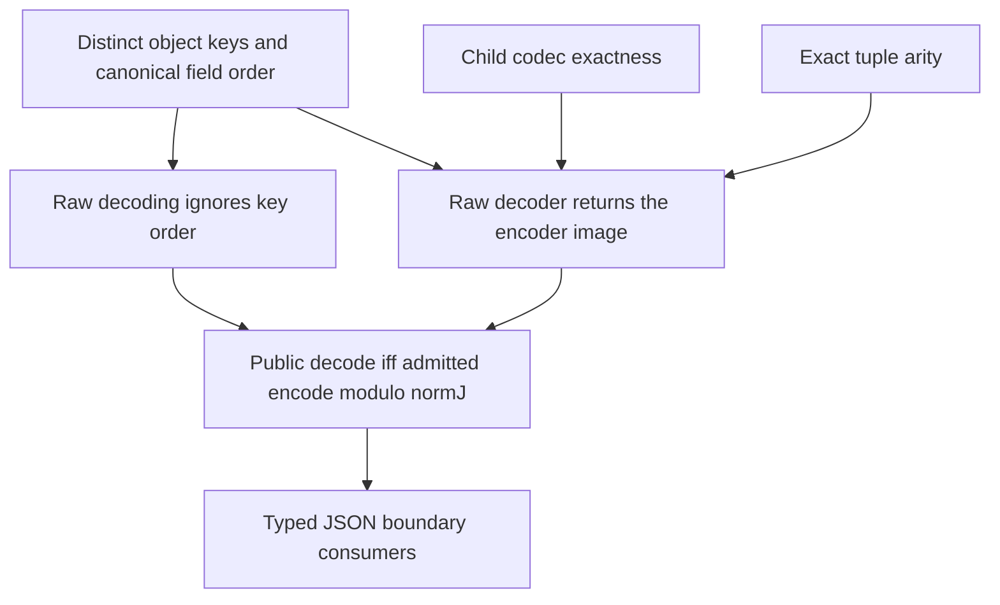

# JSON codecs for the data language

## Scope and owner

The coordinator owns `src/Effect4/Schema/Codec.lean`, `src/Effect4/Laws/Schema/Codec.lean` and the focused `Test/Codegen/DataCodec.lean` fixture.
Helpers may live in adjacent `Codec` directories to keep each proof consumer explicit.
The existing map and record value readers own their respective frames.
This slice adds records, string maps and exact-arity tuples to the existing JSON boundary.
Other leaf refusals remain unchanged.

## Boundary contract

The public encoder checks normalized type membership and exact recovery.
The public decoder checks normalized type membership after reading JSON.
Type support and value admission remain separate judgments.
An absent optional field need not supply a value with a JSON image.
A present field must supply one.

Records encode named fields as JSON object entries.
Maps encode their string-keyed entries as JSON objects.
Tuples encode positional items as JSON arrays with the declared arity.
Two-item tuples use the existing normalized product face.

The decoder refuses repeated object keys before canonicalization.
It retains every admitted field name, including `__proto__` and non-identifiers.
It sorts decoded entries by the existing UTF-8 field order.
Record decoding refuses undeclared present names.
The public membership check refuses missing required fields.
Optional absence differs from a present value containing an option.

`normJ` retains repeated keys and sorts object entries recursively.
The slice does not change this normalizer or collapse duplicate keys.
A host JSON text parser may discard repeated keys before this boundary.
That external parser behavior remains outside these Lean laws.

## Proof placement before work

Concept: Exact Codecs & Data Plane Embeddings in `docs/core/semantics.md`.
Claims: `decode-encode` and `decode-iff`, with their existing compatibility and decidability roles.
Record support also serves the existing `record-codec-layout` goal.
Requirements: R2, R3 and the data boundary used by R4.
No M5, M6 or M7 statement changes.

| Obligation | Consumer | Exact scope |
| --- | --- | --- |
| Object sorting and per-name codec selection | `decodeRaw_normJ` and `decodeRaw_exact` | Distinct JSON keys and successful child decoding |
| Positional codec traversal | `decodeRaw_normJ` and `decodeRaw_exact` | Equal item and codec lengths |
| Record and map frame reconstruction | `decodeRaw_exact` | Successful raw reads; the existing frame owners |
| Extended raw codec laws | `decode_of_encode`, `encode_of_decode`, `decode_iff` | Every raw type and JSON value under the existing theorem statements |
| Public codec controls | Session adapters and schema generation | Normalized membership plus value-level JSON representability |

The existing public theorem statements and their premises remain unchanged.
Each helper serves one of the named raw codec laws.
No theorem states that every typed value has a JSON image.
No theorem establishes host execution, liveness or arbitrary Schema transformation behavior.

## Verification and finishing criteria

Build the changed codec modules and their direct law and API consumers.
Run the focused fixture and query the new proof declarations at the existing axiom ceiling.
Retain controls for duplicates, missing required fields, extra fields, optional absence and present nested options.
Check empty, singleton and multi-item tuples, wrong arity, map key order and record payloads inside maps.
Check union branch selection where list and tuple JSON images overlap.
Refresh only the producers reached by the final source changes.
