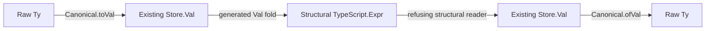

# Exact type metadata for structural TypeScript expressions

Base: `41c82479e94851c222ee06443d2818243b943342` on `codex/record-contracts`.

## Contract and placement

Concept: Exact Codecs & Data Plane Embeddings, as defined in `docs/core/semantics.md`.
Proposed semantics registry claim: `type-metadata-exact`.
Role: exact embedding of the existing type language into structural TypeScript expressions.
The coordinator registers the claim when the proof lands.

The source is raw `Ty` (`src/Effect4/Program/TyCore.lean`).
Its canonical value representation is `Canonical Ty` (`src/Effect4/Store/Domain/Derived/Program.lean`).
The target is the existing `TypeScript.Expr` from the pinned package.
The slice adds no new stored program or type representation.

The required statements have no formation, normalization, scope, or value-frame-size premise:

```text
readTy (writeTy t) = some t
readTy e = some t → writeTy t = e
```

These statements retain raw field order, duplicate declarations, optional flags and type variables.
Program admission checks those declarations separately.
The record TypeScript printer and reader consume this metadata to retain the full declared record shape.
The statements serve R2's exact representation boundary and R3's data language.

The contract concerns structural target expressions.
It proves no TypeScript type assignment, rendered-text parsing, JavaScript execution, program simulation, or host behavior.
The later record slice retains the existing scope premise of `readTerm_printTerm`.

## Representation and dependency order



The writer uses `cata_val` and `ValAlgebra` from `src/Effect4/Store/Carrier/Fold.lean`.
It writes tagged arrays using the existing `Store.Tag` byte numbers.
It writes each arbitrary natural as an array of `natBytes` digits.
Each digit is an integer between zero and 255.
This avoids encoding an arbitrary natural as one JavaScript number.

The structural encoding does not use the framed byte codec.
It therefore requires no `Val.WF` premise or bound on encoded frame lengths.
The reader checks byte bounds and canonical natural digits.
It refuses negative digits, oversized digits, leading zero digits and unrecognized expression forms.
The float-bit reader also checks the existing 64-bit scalar bound.

The writer defines an algebra, rather than another recursive traversal of `Val`.
The reader traverses the target expression syntax to recognize this fixed image.
Its exactness proof retains the full target expression, rather than a normalized spelling.

## Owned files and finishing criteria

The slice owns these new files:

- `src/Effect4/Codegen/Metadata.lean`
- `src/Effect4/Laws/Codegen/Metadata.lean`
- `Test/Codegen/Metadata.lean`
- This brief and its receipt in `docs/research/2026-10-03-data-language/`

The coordinator owns root imports, the semantics registry, traversal-census integration and the axiom gate.
No generator or existing declaration changes in this slice.

The slice finishes after the narrow module builds, focused tests and axiom checks pass.
The tests distinguish `nat`, `int` and `number`, and retain absent optional declarations and raw field order.
They include a natural beyond JavaScript's safe integer range and malformed digit controls.
The receipt records the exact commands, their results, the checked code commit and remaining target obligations.
