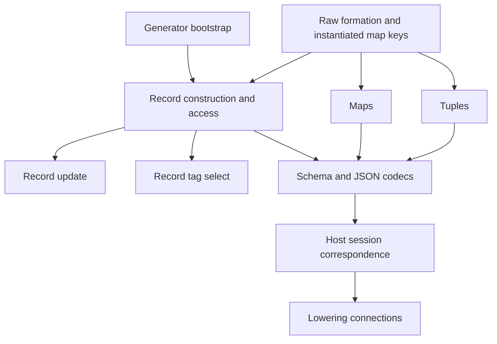

# Data language implementation

Base: `82d34358`. Implementation branch: `codex/data-language-wave`.
The owner authorizes development and ratifies robust, expressive TypeScript printer contracts.
Each slice includes its definitions, consumers, proof placement, focused checks and documentation.

## Order

The generator slice implements decisions row 194 before adding program constructors.
The admission slice implements rows 192 and 193 across every checked public entry.
The record slices implement rows 165, 166 and 195 with the printer ruling below.
Maps and tuples follow the same value membership and typing proof requirements.
Codec work separates value membership, profile support and codec admission.
Host session work connects accepted replies to the actual waiting program.
Each lowering stage states its observation, supported fragment and external assumptions before proving a simulation.

## Printer ruling

The pinned `lean4-typescript` package is version 0.7.0.
Its `objectWith` constructor selects one key form for the whole literal.
Use computed keys when any field name is `__proto__`.
Otherwise, use quoted keys when any name fails the canonical identifier profile.
Otherwise, use plain keys.
The reader accepts precisely this choice for each literal.
Field access uses dot access for canonical identifiers and bracket access otherwise.
This ruling replaces row 167's per-field literal spelling, retaining every string field name.

Declared record types remain program data, including absent optional fields.
A TypeScript annotation alone cannot retain distinctions that its numeric type erases.
The canonical printed image retains existing `Ty` representation data alongside its readable annotation.
The existing reader must recover that data exactly.

## Finishing criteria

Each landed slice builds its changed modules and direct consumers.
Its focused fixtures include rejected inputs and accepted boundary cases.
Each new theorem has a concept, registry claim, exact scope, exclusions and a consumer.
The axiom receipts retain the repository's trust ceiling.
Generated changes come from their producer, with a repeat run checking deterministic output.
Touched documentation follows `docs/core/controlled-english.md`.
Receipts distinguish proved statements, finite checks and remaining work.
No slice claims general progress, liveness or target execution from a typing proof.
