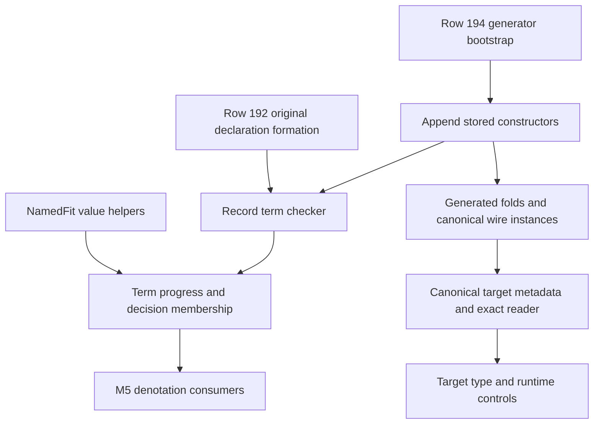

# Record operations: constructor and observation contract

Base: `82d34358e84f0e823be24ba895aa382092c1754c`.

Evidence: source reading. This contract states the implementation obligations for slice 2.
It records the owner's approval of the enlarged slice and the TypeScript printer recommendations.
It changes no authority document or production declaration.

## Owners and scope

`Term` remains the stored value language (`src/Effect4/Machine/Term.lean`).
`Eff` remains the stored program language (`src/Effect4/Program/Eff.lean`).
`Ty` remains the stored type language (`src/Effect4/Program/TyCore.lean`).
The runtime carrier remains `Store.Val` (`src/Effect4/Store/Carrier/Val.lean`).

`docs/core/semantics.md` owns the judgments.
`docs/core/decisions.md` owns the rulings, including rows 165, 178 and 192–195.
`docs/core/controlled-english.md` owns the vocabulary.
This contract supplies concrete declarations and falsifiers for those rulings.

The slice adds record construction, required and optional reads, single-field overwrite, and literal-tag selection.
Maps and tuples remain separate parts of slice 2.
The stored forms contain no functions, expressions from Lean's elaborator, or runtime objects.

## Stored syntax signature

Append these constructors without changing any existing constructor ordinal:

```lean
inductive FieldReadMode
  | required
  | optional

-- Append to the existing Term family.
Term.record
  (fields : List (String × Bool × Ty))
  (presentNames : List String)
  (values : Terms)
Term.field (mode : FieldReadMode) (target : Term) (name : String)
Term.recordSet (target : Term) (name : String) (value : Term)

-- Append to the existing Decision alphabet.
Decision.recordTag (tag : String)
```

`fields` declares every field, including absent optional fields.
Each entry stores its name, optional flag, and declared type.
`presentNames` identifies the supplied values, in the same order as `values`.
It avoids a positional presence mask and makes located refusals name the offending field.

Only `Term` and `Terms` contain recursive term children.
The metadata lists contain no term children, so this extension introduces no nested term family.
`Machine.Term` can import `Program.TyEq` for metadata equality.
At the base, `TyEq` imports only `TyCore`, which imports nothing.
This dependency does not import `Eff`, typing, or the Laws graph.

Generated folds, equality, canonical codecs, scope traversals and authoring traversals follow the enlarged signature.
Row 194's bootstrap change precedes those constructor edits.
The generated program codec must emit the `Ty` instance before the `Term` instance that now needs it.
Reordering those sort blocks changes no constructor ordinal or wire byte.

## Record construction

The checker first checks the original declaration's formation, as row 192 requires.
Duplicate declared names fail before normalization.
Duplicate supplied names, unknown supplied names and unequal name/value counts also fail.
Every required field must be supplied.
An absent optional field keeps its declared type and optional flag.

The checker checks each supplied term against that field's declared type.
It uses `Ty.subN` after formation, retaining row 178's exact-name and exact-flag record rule.
The result type is the normalized declared record type.
This constructor does not infer a new declaration from its present values.

Literal checking retains a direct string literal when the declaration needs its literal type.
This uses the existing constant-argument distinction in `argTy` (`src/Effect4/Program/Typing/Rules.lean`).
A variable typed as `string` does not become a particular literal without evidence.
This permits a declared `_tag : lit "Found"` without weakening literal membership.

Evaluation visits supplied value terms in their stored order.
The evaluator then orders the evaluated name/value pairs by the existing canonical field order.
Sorting pairs must never separate a name from its value.
A successfully typed term produces the existing record frame:

```lean
Store.Val.ctor 0 [Store.Val.list names, Store.Val.list values]
```

The resulting names and values contain only present fields.
Absent optional fields occupy neither list.
The names are string values, in the order used by `Ty.canon`.
This retains row 165's layout and introduces no new value frame or wire tag.

Malformed raw terms may make evaluation return `none`.
The progress obligation excludes that result for successfully typed terms under fitting environments.
No failure of a raw value operation becomes a program error or frontier.

## Field reads

The required mode returns the field value at its declared type.
It requires a declared, required field in the checked target type.
The optional mode returns an outer `option` of the declared field type.
It requires a declared field and tests whether that field is present in the value.
Allowing this mode on a required field merely returns `Some` for every admitted input.

The first implementation can check a normalized record target.
Union support lifts the same rule branchwise and joins the result types.
Every branch must declare the field and meet the selected mode's premise.
No branch may disappear because its access is unsupported.

The runtime lookup reads the value's names, never a position inferred from one union branch.
Missing means absent from the names list.
It does not mean that the value is `undefined`, `null`, or `Option.none`.

| Record state | Optional-read result |
| --- | --- |
| Field absent | `None` |
| Field present with `undefined` | `Some(undefined)` |
| Field present with `null` | `Some(null)` |
| Field present with `Option.none` | `Some(None)` |
| Field present with `Option.some x` | `Some(Some(x))` |

The mode must remain in stored syntax and in the canonical printed image.
The checker returns a type, rather than rewriting the stored term.
These facts forbid a mode-free field constructor.

The smallest discriminator uses the same value and two environments:

```text
v  = record value ["nickname"] ["Ada"]
T1 = record [("nickname", false, string)]
T2 = record [("nickname", true,  string)]
```

`v` fits both `T1` and `T2` under the existing `NamedFit` definition.
A mode-free lookup sees identical inputs in both contexts.
It cannot return both a string and an outer option from those identical inputs.
The explicit mode resolves that contradiction without changing row 195.

## Single-field overwrite

`recordSet target name value` evaluates `target`, then `value`, once each.
It inserts the named field if absent and replaces it if present.
It retains every other present field, then restores canonical name order.
It neither mutates the input value nor evaluates an omitted field.

The output type is computed from the input record and the replacement term's type.
The checker removes the old declaration of `name` and inserts `(name, false, replacementType)`.
The output field is required because this operation supplies it.
The operation can therefore change the field's type and change an optional field to required.
It does not assert that the resulting record is a subtype of its input.
Such an assertion would contradict row 178's exact-name and exact-flag rule.

The checker retains direct string literals when computing a replacement type.
Updating `_tag` therefore changes the resulting discriminant type.
For a union of record inputs, the checker applies this calculation to every branch and joins the results.
Ordinary assignment to an existing declared record type still requires the resulting type to pass `Ty.subN`.

## Literal-tag selection

`Decision.recordTag tag` operates on unions of records with required literal `_tag` fields.
It reads `_tag` by name from the existing record frame.
The hit branch receives the whole record.
The miss branch receives the whole record.
Neither branch receives a positional payload extracted from a tagged pair.

The hit type contains the input alternatives whose literal `_tag` equals `tag`.
The miss type contains the remaining alternatives.
An empty branch has type `never`.
The input alternatives must supply enough literal information to compute both sets.
An optional `_tag` or a `_tag` typed only as `string` does not meet this fragment.

Existing `Decision.tag` retains its pair representation and payload binder.
No old tag operation changes meaning.
Identical value columns with different field names remain distinguishable under the named record layout.

## Canonical target image

The pinned `TypeScript.Expr.objectWith` gives one `KeyForm` to the whole object literal.
Its `ObjectEntry` carries either a property or a spread.
The implementation needs no dependency upgrade.

Choose the whole literal's form deterministically:

1. If a property is named `__proto__`, use computed keys for every property.
2. Otherwise, if any property name is not an identifier, quote every property name.
3. Otherwise, use plain keys for every property.

This is the owner's approved amendment to row 167's per-name spelling rule.
The exact reader must accept precisely this image, including quoted identifiers in a quoted whole literal.
It must reject a different spelling when the chosen canonical form disagrees.
Field access still uses member access for identifiers and bracket access for other strings.

Record construction prints a typed wrapper around its object literal.
The wrapper retains the full declaration, including absent optional fields.
Its readable type argument uses the existing `Ty` target face.
Its metadata uses the existing `Canonical Ty` representation from `src/Effect4/Store/Domain/Derived/Program.lean`.
The reader checks that the readable annotation agrees with that retained declaration.
At the base, that codec module's transitive imports contain no `Effect4.Codegen` module.
The target printer and reader can therefore use it without an import cycle.

The type argument alone cannot be the retained declaration.
`nat`, `int` and `number` all render as TypeScript `number`.
The canonical image must retain their different `Ty` data.
This metadata is an exact embedding of the existing type sort, not another type language.

Optional access prints through a canonical helper that evaluates its target once.
The helper tests own-property presence and returns `Option.none()` or `Option.some(value)`.
Neither `in`, truthiness, nor conversion from `undefined` implements this contract.
The helper must handle a property named `hasOwnProperty` without calling that property.

Overwrite prints through `objectWith`, with the target spread before the replacement property.
The computed-key rule applies when the replacement name is `__proto__`.
The target is evaluated once, before the replacement.
Any wrapper added for annotations retains this order.

The reader recognizes these canonical helpers before ordinary atom calls.
Each helper has one owner in the generated prelude and source-binding checks.
The reader must reconstruct the stored declaration, supplied names and read mode.

## Proof placement and consumers

The registry owner is `tools/Tools/SemanticsRegistry.lean`.
The planned record helpers serve the existing `denote-typed` claim.
The concrete consumer is the extension of `evalTerm_progress` in `src/Effect4/Laws/Program/Typed/Denotation.lean`.
`NamedFit` and `Fits` live in `src/Effect4/Laws/Program/Typed/Membership.lean`.

| Obligation | Concept and role | Exact scope and premises | Consumer and requirement | Exclusions |
| --- | --- | --- | --- | --- |
| Named value columns have equal lengths | Store Typing & Value Membership; helper for `denote-typed` | `NamedFit fields names values`; no closed-type premise | Typed record lookup and overwrite; R3, M5 | Does not imply sorted or unique names |
| A required declaration has a present fitting pair | Store Typing & Value Membership; helper for `denote-typed` | `NamedFit`; membership of a required declaration in the field list | Required lookup progress in slice 2a; R3, M5 | Pair membership alone does not prove first-match lookup without unique names |
| Optional lookup distinguishes presence | Store Typing & Value Membership; helper for `denote-typed` | `Fits` at the declared record type; canonical unique fields; successful lookup | Optional lookup progress in slice 2a; R3, M5 | Does not collapse a present empty value into absence |
| Construction and overwrite produce fitting records | Residual Program Typing; step of `denote-typed` | Well-formed declarations, typed arguments, `FitsAll` environment, native atom assumption of `evalTerm_progress` | `evalTerm_progress`, then M5; R3 | No program termination or host cooperation claim |
| Record-tag selection gives the chosen branch's membership | Residual Program Typing; step of `denote-typed` | Record-union fragment with required literal `_tag`; input `Fits` | Typed decision and select denotation; R3, M5 | No arbitrary string discriminator or pair-tag claim |
| Canonical print/read reconstruction | Exact Codecs & Data Plane Embeddings; exact embedding | Readable admitted term fragment; metadata and annotation agree; pinned canonical spelling | Existing `readTerm_printTerm` and exact-image reader claims; R2, R3 | Does not prove execution of generated TypeScript |
| Target value observations agree on examples | Translation & Simulation Metatheory; finite check | Generated helpers, admitted test values, pinned tsgo 7 and runtime | Target controls for slice 2b | Finite evidence, not a general target execution theorem |

The first two helpers require no new operation definition and can land before term constructors.
The remaining helpers land with their consuming operations.
The coordinator adds any new semantics registry property with the slice that proves it.
This contract creates no parallel proof ledger.



## Acceptance controls

The test battery needs these discriminators:

- The same present value under required and optional declarations gives the two explicit read results.
- An omitted optional field retains its declared type through construction, printing and reading.
- Missing, present `undefined`, present `null`, and present `Option.none` remain distinct.
- A required missing field, duplicate declaration, duplicate supplied name, and surplus supplied value are refused.
- Reordering supplied values never separates their names from their values.
- Overwrite replaces a present field, inserts an absent field, and makes that field required.
- Overwrite may change a field type without claiming input-output record subtyping.
- Record tag selection retains the whole record and leaves pair-tag selection unchanged.
- Plain, nonidentifier, empty, escaped, `__proto__`, `constructor`, and `hasOwnProperty` names reach the target controls.
- Mixed-name objects follow the approved whole-literal spelling in both print and read.
- Metadata distinguishes records containing `nat`, `int`, and `number` despite their shared target spelling.
- Existing wire constructor ordinals and retained program goldens remain unchanged.

Run only the narrow checks that the changed modules reach.
Report Lean theorems, finite target checks, and unverified obligations separately.
