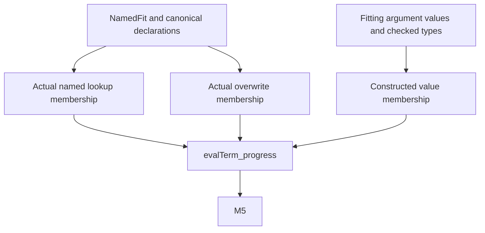
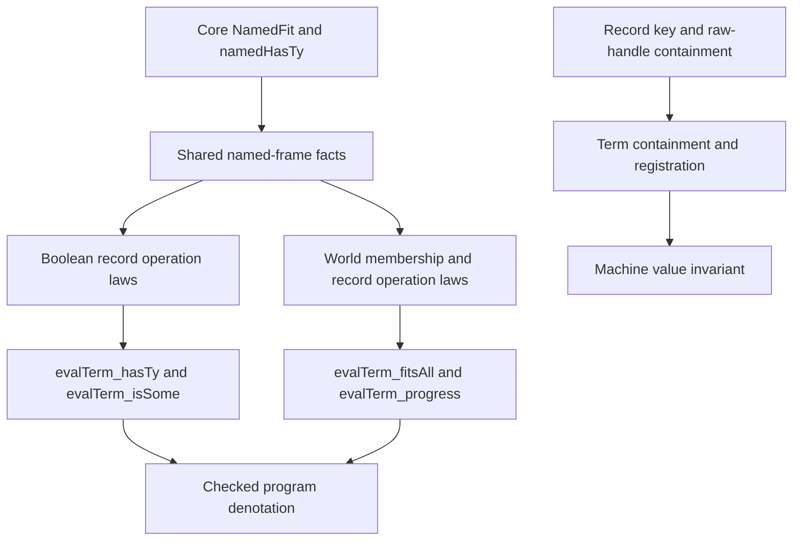

# Record value and type operations

Base: `82d34358e84f0e823be24ba895aa382092c1754c`.
Existing helpers: `e237599b` and `41c82479`.

## Scope

Add value operations in `src/Effect4/Machine/Record.lean`.
Add type operations in `src/Effect4/Program/Record.lean`.
Keep `Term` and its traversals unchanged in this slice.
Relocate `Program.recordParts?` without changing its definition.
The original declaration lives in `src/Effect4/Program/Typed.lean`.

Construction checks parallel columns and distinct supplied names before sorting paired fields.
Lookup checks every name and value before selecting a field.
An outer `none` reports malformed columns.
An inner `none` reports an absent field.
Overwrite replaces one named value and orders the resulting pairs.
Type operations use already computed argument types.
Public program admission owns recursive declaration formation checks before normalization.

## Proof placement

Concept: Store Typing & Value Membership (`docs/core/semantics.md`).
Property: typed value operations retain `Fits` in their current world.
Role: helpers for the existing registry claim `denote-typed`.
Consumer: `evalTerm_progress` in `src/Effect4/Laws/Program/Typed/Denotation.lean`.
Requirement: R3, on the M5 typing path.

Reach: named record frames from decisions row 165 and exact field declarations from row 178.
The operations implement the record forms approved in row 195.
Lookup assumes `Fits` at the declared record type and a declared field.
Required lookup also assumes the declaration marks that field required.
Construction assumes the argument values fit their checked argument types.
Overwrite assumes input-record membership and replacement membership at the replacement type.
The overwrite result has a required field at that type.
Field reads and overwrite check every union alternative before joining their result types.

The exported bridges are `record_build_fits`, `record_fieldType_fits`, and `record_setType_fits`.
Each bridge concludes that its executable operation returns a fitting value.
The helpers for column pairing, ordered names, lookup, and joined results serve these bridges.

These helpers do not prove termination or eventual host replies.
They establish no target execution claim.
Malformed raw frames remain outside the membership premises.
The host boundary remains in `docs/core/host-boundary.md`.

## Finishing criteria

Compile the changed modules and their narrow test module.
Check missing, present undefined, present null, and nested option values.
Check duplicate names, unequal columns, and malformed name frames.
Check replacement types and required-field output flags.
Inspect each exported proof's axioms.
Record any unproved construction connection without weakening its statement.
The coordinator adds the root imports at integration.

## Term proof integration

The coordinator assigns the term proof integration after the checked operation bridges.
The syntax dependency is `70d35a9d`.
Generated folds and typing rules arrive from the coordinator before compilation.

Concepts: Store Typing & Value Membership and Residual Program Typing (`docs/core/semantics.md`).
Role: helpers for `denote-typed` and its M5 consumers.
The existing contracts in `Test/contracts/program-denotation.contract.md` retain their statements.

`evalTerm_hasTy` and `evalTerm_isSome` retain Boolean value typing and term evaluation at the native signature.
`evalTerm_fitsAll` retains world-indexed membership under its existing signature and environment premises.
`evalTerm_progress` retains an actual returned value and world-indexed membership.
Their consumers include source admission, typed denotation, and straight-fragment meaning typing.

Concept: Reactive Scheduling & Machine Invariants.
Role: term-operation helpers for handle registration and the existing native value invariant.
`evalTerm_keys` and `RawHandles.evalTerm_handles` retain their actual successful-evaluation premise.
The raw handle theorem includes every kind byte and allocation index.
Its immediate consumer is `RawHandles.evalTerm_registered`.
`evalTerm_validIn` retains valid environment values and actual evaluation as premises.
These helpers serve R4 and the value side of the M5 to M6 path.

No statement becomes a whole-program termination or liveness claim.
Boolean value typing remains separate from world-indexed membership.
Handle containment alone establishes neither registration nor allocation validity.
The host boundary remains unchanged.

The coordinator approves a narrow dependency repair.
Move `NamedFit` unchanged into core `Program.Typed` with its existing namespace.
Lower world-independent proof helpers into `Laws/Program/Typed/RecordValues.lean`.
Move the term-membership mutual block from `Membership.lean` into `RecordOperations.lean`, retaining names and statements.
Update `Typed/Admission.lean` to import that new theorem owner.
This order lets the term proofs consume the checked operation bridges without an import cycle.

