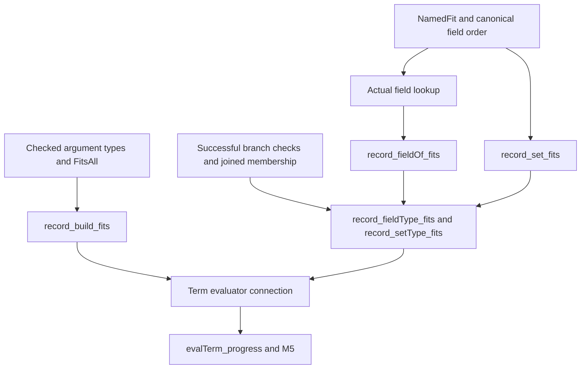

# Record operation membership: proof receipt

The construction, field-read, and overwrite bridges compile without stronger premises.
The coordinator still connects them to the new term constructors and the loaded proof graph.

Base: `6a02b2b8`.
Proof head: `5b074be3`.
Branch: `codex/record-operations`.
Compiler: `leanprover/lean4:v4.33.1`.
The preceding core receipt records the executable operations and the unchanged `recordParts?` relocation.

## Changes

`src/Effect4/Machine/Record.lean` adds `Record.read`.
Its Boolean mode selects required extraction or optional presence wrapping after validated lookup.
The stored term mode remains the coordinator's syntax.

`src/Effect4/Laws/Program/Typed/RecordOperations.lean` proves the membership connections.
`Test/Program/RecordOperations.lean` adds mode controls, a theorem application, and axiom queries.

## Placement and scope

Concept: Store Typing & Value Membership (`docs/core/semantics.md`).
Required property: typed value operations retain `Fits` in their current world.
Role: helpers for registry claim `denote-typed`.
Consumer: `evalTerm_progress` in `src/Effect4/Laws/Program/Typed/Denotation.lean`.
Requirement: R3, on the M5 typing path.
Decisions rows 165, 178, and 195 bound the record frame and field rules.

| Bridge | Premises | Conclusion |
| --- | --- | --- |
| `record_build_fits` | Successful record type check; evaluated arguments satisfy `FitsAll` | Construction returns an actual value satisfying `Fits` at the checked result type |
| `record_fieldType_fits` | Successful field type check; target satisfies `Fits` | Required or optional read returns an actual value satisfying `Fits` at the result type |
| `record_setType_fits` | Successful overwrite type check; target and replacement satisfy `Fits` | Overwrite returns an actual value satisfying `Fits` at the result type |

The read and overwrite bridges cover union targets.
Their type checks require every alternative to support the operation before joining result types.
The proofs use the fitting input's actual alternative and retain its result through that join.
No alternative disappears because its operation is unsupported.

Construction checks paired counts, distinct names, declared names, required presence, and normalized subtyping.
Its proof sorts whole name/value pairs and retains their membership connection.
Optional reads distinguish absence from present undefined, null, or an inner empty option.
Overwrite makes the replacement field required at its new type.
It asserts no subtype relation from the output record to the input record.

These bridges do not establish recursive declaration formation.
Public program admission owns that separate check before normalization.
They do not establish standalone program progress, termination, liveness, target execution, or host behavior.
The host boundary remains in `docs/core/host-boundary.md`.

## Helper placement

Every helper below serves the same registry claim, concept, and requirement through the named operation bridge.

| Helpers | Scope and immediate consumer |
| --- | --- |
| `namedFit_columns`, `namedFit_names_sublist`, `readColumns_frame` | Existing named membership and complete columns; consumed by `record_entries_of_fits` |
| `namedFit_lookup` | Unique declared names and named membership; consumed by `record_lookup_fits` |
| `ascending_names_sublist`, `namedFit_of_sublist_lookup` | Ordered names, inclusion, and declared lookups; consumed by construction and `record_frame_fits` |
| `zipNames_columns`, `zipNames_fits`, `firstOf_fits` | Supplied names and fitting argument lists; consumed by `record_build_fits` |
| `record_entries_of_fits`, `record_lookup_fits` | An actual fitting record and declared field; consumed by both field-read modes and overwrite |
| `record_lookup_required`, `record_lookup_optional`, `record_fieldOf_fits` | Declared field flags and the explicit read mode; consumed by `record_fieldType_fits` |
| `mapM_some_mem`, `fits_foldl_join`, `fits_joinResults` | Successful branch checks and result membership; consumed by union reads and overwrite |
| `firstOf_filter_other`, `record_frame_fits`, `record_set_fits`, `record_setOf_fits` | Named replacement and input membership; consumed by `record_setType_fits` |

## Verification

`LEAN_NUM_THREADS=3 lake build Effect4.Laws.Program.Typed.RecordOperations` passes.
It builds the operation proof module and its dependencies.
`LEAN_NUM_THREADS=3 lake env lean Test/Program/RecordOperations.lean` passes.
The finite controls retain the core cases and add explicit read-mode presence distinctions.

The test queries every exported operation bridge and its helpers, except `readColumns_frame`, whose query is transitive through `record_entries_of_fits`.
Every queried theorem reports an axiom set contained in `[propext, Quot.sound]`.
The three operation bridges each report exactly `[propext, Quot.sound]`.
`namedFit_columns`, `namedFit_names_sublist`, and `firstOf_filter_other` report `[propext]`.
No trust exception is added.

The finite examples are finite controls.
The universal statements above are Lean proofs over their stated premises.
No full build, whole battery, generator, or host compiler runs for this slice.
`git diff --cached --check` passes before the proof commit.

## Integration

Import the proof module through the coordinator's assigned Laws anchor.
Import the test module through the coordinator's assigned test anchor.
Map the stored optional field mode to `true` when calling `Record.read`.
Use the three operation bridges in the new term typing and evaluation cases.

The core receipt still identifies the new type case sites for the coordinator's case-policy review.
The coordinator owns that audit after the operations enter the loaded root.
Term traversal laws, the TypeScript image, codec boundaries, and host checks remain outside this proof slice.
