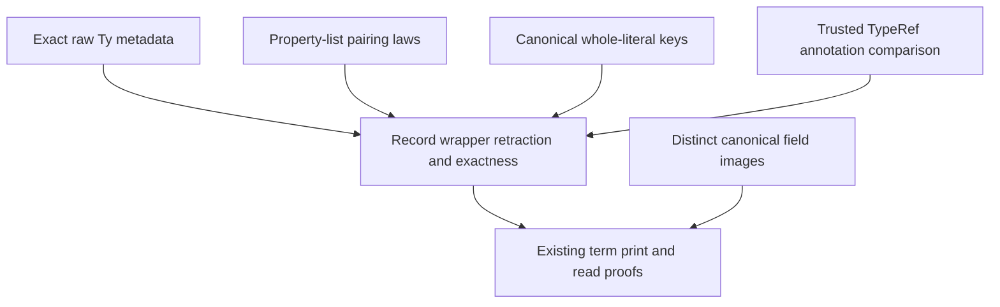

# Canonical record wrapper and field access

Base: `5a5527e2d2bbae06538131accc1e2e96c4a95b54` on `codex/record-contracts`.
Authority: decisions rows 164, 195 and 196 in the coordinator's worktree.

## Placement and contract

Concept: Exact Codecs & Data Plane Embeddings (`docs/core/semantics.md`).
Role: exact embedding of record and field components into structural TypeScript expressions.
The helpers serve the `printed-modules` semantics registry claim and the existing `readTerm_printTerm` consumer.
They serve R2's representation boundary and R3's data language.

The stored program and type languages remain `Term`, `Eff` and `Ty`.
This slice adds no constructor to them.
Its wrapper functions take raw declared fields, supplied names, and already-printed child expressions.
The reader returns those same components, without interpreting or normalizing the children.

The wrapper laws quantify over every raw field list, name list and child-expression list:

```text
readRecord (writeRecord fields names values) = some (fields, names, values)
readRecord e = some (fields, names, values) → writeRecord fields names values = e
```

There is no formation, length, profile-support, `Val.WF`, or child-readability premise.
The field-access laws also quantify over every target expression and string name.
The later term consumer retains only its existing scope premise for its round trip.

The recursive core reader also needs a strict size bound on each recovered child.
`readRecord_size` bounds the whole recovered expression list by its wrapper.
`readField_size` bounds the recovered target by its access expression.
These helpers serve the same `printed-modules` claim through termination of `readTerm` and `readTermList`.
Their only premise is successful structural reading; they add no semantic restriction.
They live with the core wrapper because the core reader cannot import the Laws graph.

These laws concern structural TypeScript expressions.
They establish no type assignment, text parser result, target execution, program simulation, or host behavior.
The metadata laws from the preceding slice retain the declared raw `Ty`.

## Normal and raw images

The normal image is available when `Types.ofTy (.record fields)` succeeds and name/value lengths agree.
It has this structural shape:

```text
recordValue<declared target type>(type metadata, objectWith(properties))
```

Properties pair the supplied names and values in their original order.
The literal always uses `Expr.objectWith`, including its plain and quoted forms, as row 164 requires.
The key form follows row 196:

1. Use computed keys if any supplied name is `__proto__`.
2. Otherwise, use quoted keys if any name fails `TypeScript.targetIdentifier`.
3. Otherwise, use plain keys.

Every other raw input uses this image:

```text
recordRaw<unknown>(type metadata, names array, values array)
```

The raw image retains unequal list lengths, unsupported target types, duplicate names and raw field order.
Its reader refuses the raw wrapper when the normal image is available.
The normal reader checks the declared target annotation and the canonical whole-literal key form.
It refuses spread entries and legacy `object` or `objectQuoted` constructors in this structural image.

The target-text parser may reconstruct a legacy object node because rendering erases that distinction.
The coordinator normalizes that node to `objectWith` only within the record wrapper's text reader.
That text boundary is outside these structural expression laws.

The starting base refused records in `Types.ofTy`.
The coordinator's checked projection commit `8e247ce1` supplies record target annotations before the wrapper's normal-image controls run.
The theorem remains conditional only inside the writer's branch selection, never in its public retraction statement.

## Field access image

Required access uses `Expr.member` when the name passes `targetIdentifier`.
It uses `Expr.index` with a string literal otherwise.
Its reader refuses the alternate spelling.

Optional access has this distinct structural image:

```text
recordOptional<literal key>(key)(target)
```

The type argument and first call argument retain the same exact name.
The second call carries the target expression once.
The structural reader checks both spellings and returns the optional mode explicitly.
These functions do not inspect the target's type or choose its mode dynamically.

The runtime helper's own-presence test and `Option` result remain a later target implementation obligation.

## Proof dependencies and trust



The implementation does not compare arbitrary expressions with the package's unproved `Expr` Boolean equality law.
It reads each wrapper component structurally.
`TypeRef` has a proved Boolean equality law.
The focused axiom queries for `TypeRef.beq`, `TypeRef.beq_iff` and `TypeRef.beq_self` each reported only `propext`.
The annotation check therefore uses that existing law within the repository's trust limit.

## Scope and finishing criteria

The slice owns these new files:

- `src/Effect4/Codegen/Record.lean`
- `src/Effect4/Laws/Codegen/Record.lean`
- `Test/Codegen/Record.lean`
- This brief and its receipt

The coordinator owns `Codegen/Types.lean`, term constructors, root imports, prelude registration and the target-text reader.
The coordinator also owns semantics registry and traversal-census integration.

The narrow builds, focused structural controls and axiom queries must pass before the slice is committed.
Controls include unequal lengths, unsupported annotations, mixed key names, malformed wrappers, wrong key modes and both field-access modes.
The receipt distinguishes structural theorems from later target compiler and runtime checks.
