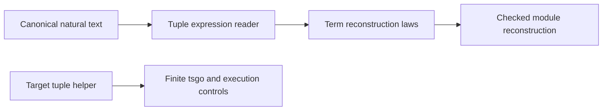

# Exact tuple target syntax

Base: `b1f5b9e0` on the integration branch.
The record seat continues on its own branch, `codex/tuple-codegen`, from this base.
The owner authorizes robust, expressive implementation through the data-language plan.

## Contract

Use `tupleAt<"2">("2")(target)` for static projection.
The two literal strings must match the canonical decimal spelling of the stored natural index.
Structural `printTerm` and `readTerm` retain every natural index, including values above JavaScript's exact numeric range.
The helper requires a readonly tuple containing the requested key.
It retains `never` for an impossible receiver.
It refuses arrays, absent positions and non-tuples at target typing.
The TypeScript reifier refuses indices it cannot store exactly in its existing numeric representation.
Construction uses the existing variadic `tuple` native atom with its const-generic result.
Do not add a target-number restriction to the Lean structural round-trip theorem.

The pinned tsgo probe at `/private/tmp/effect4-tuple-index-probe.ts` checks the proposed helper shape.
It checks ordinary positions, impossible receivers and oversized literal indices.
This finite probe does not prove target execution or the Lean reconstruction laws.

## Placement and consumers

Concept: Exact Codecs & Data Plane Embeddings in `docs/core/semantics.md`.
Claims: `printed-modules` and `collection-term-print-read`; requirements R2 and R3.
Retraction retains the existing scope premise on raw terms.
Exactness assumes only successful structural reading.
Decimal helpers serve the tuple reader and existing service-key or variable readers.
Reuse existing byte-based natural parsing and proofs, extracting a shared helper when necessary.
Do not give tuple indices the nominal identity of logical milliseconds.
No theorem claims host execution, general target-language admission or liveness.

## Ownership

The seat owns new `Codegen/Tuple.lean` and `Laws/Codegen/Tuple.lean` modules.
It owns tuple cases in `Codegen/PrintLeaf.lean`, `Codegen/Read.lean`, `Laws/Codegen/ReadLeaf.lean` and `Laws/Codegen/PrintReadable.lean`.
It may extract decimal helpers into `Data/NatDecimal.lean` with their directly required laws and consumers.
It owns tuple cases in `Codegen/Blame.lean` only if needed.
It owns target helper source, reader cases and focused fixtures under `harness/truth` and `ts/eff`.
Existing map and record behavior must remain intact.
The coordinator owns generators, generated outputs, root imports, manifests, decisions and policy census.
Request generated PreludeAtoms and TsGen companions after a checked source checkpoint.
Do not edit Schema or tuple typing and handle proof files.

## Finishing criteria

Build changed source modules and direct consumers using the shared Lean lane.
Keep theorem statements and the axiom ceiling unchanged.
Check empty, singleton, two-item and larger tuples, literals, unions and impossible branches.
Refuse malformed markers, noncanonical decimals, missing positions and number-rounding cases.
Use only pinned tsgo 7 and existing Bun dependencies for target checks.
Record exact commands, results, trust queries and remaining host assumptions in a receipt.
Commit explicit paths after focused checks; do not push or run a full sweep.

## Concrete dependencies

`Data.NatDecimal.decodeBytes` owns the byte fold extracted from `Codegen.Read`.
The existing `Program.digitOfByte` and `Program.decodeBytes` names remain aliases.
`Laws.Data.NatDecimal` owns decimal retraction; the existing public theorem names in `ReadLeaf` forward to those facts.
`NatDecimal.read` checks the complete canonical spelling after byte decoding.
Its retraction covers every natural; its exactness assumes only a successful read.
These are helpers of `collection-term-print-read` and `printed-modules`, consumed by `Tuple.readAt_writeAt` and `Tuple.readAt_exact`.
The shared decoder also serves existing variable-name and service-key laws.

`Tuple.readAt_size` serves recursive term reading under the same claims, with successful wrapper reading as its only premise.
The wrapper laws quantify over every natural index and arbitrary child expression.
The existing term and program reconstruction statements keep their hypotheses.
All these obligations belong to Exact Codecs and Data Plane Embeddings and serve R2/R3.
They establish no target execution, source-number representability or liveness theorem.

`Program.termHelperNames` combines record and tuple helper bindings for row and export name checks.
`Codegen.Diagnostics.codesOf` gains the necessary tuple case without asserting a measured target diagnostic mapping.
The coordinator owns the corresponding generated helper-name inventory.
