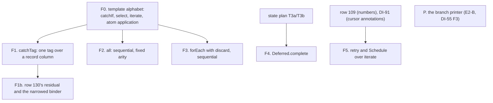

# Derived forms with behaviour laws: the slice plan (DI-89, DI-39, rows 130, 204, 208; R10)

**The one thing to know first.** A derived form today is a row of a template table
(`src/Effect4/Codegen/Forms.lean`, 19 rows). Each row has a typing lemma, a generated builder and a
readable expansion, but no behaviour law. None of DI-89's named forms exists: `catchTag`,
`forEach`, `all`, `retry`, `Schedule`. The template alphabet cannot spell them, because it has no
`catchIf`, `select` or `iterate` and no atom application in terms. All five acceptance programs
wait on R10. The plan:
- extends the template alphabet;
- lands `catchTag` with row 130's sound residual and a narrowed handler binder;
- lands the sequential `all` and `forEach`;
- lands `Deferred.complete` after the state slice's T3;
- leaves `retry` and `Schedule` until numbers (row 109) and readable cursor annotations (DI-91).

Inputs:
- the coordinator's read-only survey of 2026-10-04 at `26fbc785`;
- DI-89, DI-39, DI-55, DI-84, DI-88 and DI-91 (`docs/DESIGN-ISSUES.md`);
- decisions rows 79, 109, 130, 204 and 208;
- seat E2's receipt (`docs/research/2026-10-04-seat-E2-receipt.md` §6, E2-B);
- the acceptance batteries (`Test/Dogfood/README.md`).

## 1. Where it stands

| Part | Today | Evidence |
| --- | --- | --- |
| The table | 19 rows: `andThen` (three), `as`, `asVoid`, `tap` (two), `ensuring`, `void`, `die`, `yieldKey`, `matchCause` (two), `yieldNow`, four fork defaults, `releaseOne` | `Forms.all` |
| A row's owners | the template; the generated builder with its `#guard` and scope lemma; the foreign spelling; the TypeScript table | `tools/Effect4Gen/Forms.lean`; `Codegen/Authoring/Forms.lean`; `Codegen/Styles.lean`; `ts/eff/forms.gen.ts` |
| Typing | one lemma per row, all 19 R10 top nodes | `src/Effect4/Laws/Codegen/Forms.lean` |
| Behaviour law | none | R10's open parts; system map §8 |
| Printing | through the expansion's constructor rows; forms are stored expanded | `Codegen/Templates.lean` (`effRows`) |
| Reader admission of foreign TypeScript | the ingest engines only, parked by DI-88 "at the current alphabet" | `ts/eff/ingest/ck.ts`, `oxc.ts` |
| `catchIf` with `tagIs` | the core already expresses a tag catch; `tagIs` hits a pair and, since E1, a record | `Eff.catchIf`; `NativeAtom.tagHit`; `pTagPayload` round-trips |
| The residual | `Ty.diffTag` subtracts only pair members; a record column is never subtracted | `Program/Ty.lean`; P2's pin |
| Loops | `iterate` with `iterateWith`, `forRange`, `foldRange`, `repeatWhile` | `Program/Authoring/Loops.lean` |
| A mask that restores the caller's interruptibility | none; `uninterruptible` and `interruptible` are rc.112's, no-ops in their own state | `Machine/Frames.lean` |

The corpus measures uses, not units (DI-48). `Effect` has 51,783 uses in 15 projects: `catchTag`
4,320, `forEach` 967, `retry` 938, `all` 425. `Schedule` has 2,525 uses, 0% admitted. A per-form
unit count does not exist until the census reports which rule fired.

## 2. The slices

- **F0. The template alphabet.**
  - `Template.catchIf`, `Template.select`, `Template.iterate` and `TermTemplate.app`.
  - `expand`, the template typing lemmas, the generator, `templateJs`, `forms.ts`, `exampleArgs` and `Form.foreign` all follow.
  - Every new template keeps `checkExample` at the four depths.
- **F1. `catchTag`**, one string tag over a record column, with no `orElse`. A row expanding to `catchIf` with the tag test on the caught error.
  - Its typing lemma goes through `HasTy.catchIf`.
  - Its behaviour law, at `denoteR` from `denoteR_catchIf`:
    - a hit exactly when the first failure's `_tag` is the tag;
    - a miss re-raises the whole cause, as `internal/effect.ts:2800-2809` does.
  - The P1, P2, P3 and P5 guards turn red, and their batteries move.
- **F1b. Row 130 and the binder.**
  - The residual: `catchIfError` gains a record arm. The caught tag leaves the column only when every alternative carries it.
  - The handler's binder is typed at the caught arm (`Record.tagArms`). Its soundness follows from `Record.tagArms_hasTy` and `NativeAtom.tagHit_record`, which finally gets its consumer.
  - The general subtraction rc.112 makes (`Types.ts:158`, `ExcludeTag`) is unsound in this model when a cause holds two failures (`E4-RESID-CE-001`). It waits on DI-17's multiplicity bound.
- **F2. `all`, sequential, at a fixed arity, answering a tuple.**
  - Its law is at `denote` on `Straight`, carried to the machine by `run_eq_meaning`.
  - The concurrent `all` waits on a printable fail-fast primitive (§3, question 6).
- **F3. `forEach` with `discard`, sequential.**
  - An index cursor, `listGet` and `select .option`, with no annotation.
  - Its law is at `meaningB`, carried by `loopAgreement`.
  - The collecting variant waits on DI-91; the concurrent one on the primitive.
- **F4. `Deferred.complete`**, after the state slice's T3, with a `done` row and the mask (§3, question 5). Its law sits at `denoteR` or the machine, because masks are outside `Looped`.
- **F5. `retry` and `Schedule` over `iterate`**, after row 109 and DI-91.
- **P. The branch printer.** A small slice, beside F1. `Effect.suspend(() => c ? a : b)` is refused by tsgo when the arms fail with different classes (TS2375, DI-55 F3, now reached by p2). The row prints through a prelude `ifCase(c, () => a, () => b)` typed `E0 | E1`, as `optionCase`, `caseTag` and `caseTagR` already are.

Each slice is design-first, lands its owed laws as placed goals where proofs do not follow at once
(row 207), and moves the acceptance batteries it reaches.

## 3. Questions for the owner, with recommendations

1. **What a derived form is.** Recommended:
   - a row of the form table: an expansion template with a typing lemma, a generated builder, a readable expansion and one behaviour law;
   - the template alphabet grows to spell `catchIf`, `select`, `iterate` and atom application;
   - a helper written for one program stays an authoring function, as P1's `retryForm` is.
2. **Reading foreign TypeScript that uses a form.** The ingest engines are parked (DI-88). Recommended:
   - keep them parked;
   - forms land for authoring, typing, the law and the printed expansion;
   - R10's "reader admission" stays an open part until the ingest unparks.
3. **`catchTag`'s error column (row 130).** Recommended:
   - subtract the caught tag only when every alternative carries it;
   - type the handler's binder at the caught class;
   - rc.112's unconditional subtraction waits on DI-17's bound.
   The printed TypeScript then has a wider error column than rc.112's own, never a narrower one (strict containment).
4. **`catchTag` matches rc.112's test.** rc.112's `Predicate.isTagged` is false on a pair; the tree's `tagIs` is true on both. Recommended:
   - the form tests a record's `_tag` only, through an atom that is false on pairs, printed as `Predicate.isTagged("T")`, the refinement that narrows the handler's binder in TypeScript as in Lean;
   - a pair keeps today's `catchIf` with `tagIs`.
5. **`Deferred.complete`'s mask (row 208).** No construct restores the caller's interruptibility. Recommended:
   - state the law for an interruptible caller now;
   - add a mask-with-restore construct when a program needs a masked caller;
   - register the machine's `ProgName.intoDeferred` as a counterexample: from a masked caller its body is interruptible, where rc.112's is not.
6. **Concurrency.** Recommended:
   - the sequential `all` and `forEach` first;
   - the concurrent ones wait on a decision about a printable fail-fast primitive: `awaitAllFailFast` made printable, or `Fiber.joinAll` modelled.
7. **The branch printer (E2-B).** Recommended: a prelude `ifCase` typed `E0 | E1`. Rejected:
   - `Effect.gen`: a reader-only head, so `read_print` and `read_exact` would be re-proved;
   - an annotation on the printed arrow;
   - `Effect.if`, which the pin does not export.

## 4. What this plan does not establish

- Ingest of foreign TypeScript (DI-88).
- `catchTag`'s precise residual on a column whose alternatives do not all carry the tag (DI-17).
- Concurrency semantics of `all` and `forEach`.
- `retry` and `Schedule` (row 109, DI-91).
- Stable form identity across versions (D9, unruled).
