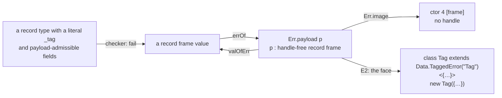

# Error payloads: the slice plan (decisions row 120, ruled with probe T's amendment)

**The one thing to know first.** A program fails today with a number, a string or a pair of
strings. Four of the five acceptance programs need a record: p1's `HttpError`, p2's `NotFound`
and `Unauthorized`, p3's `JobFailed`, p5's `InsufficientFunds`. The carrier is a handle-free
record frame. Its image is disjoint from the three old images, so `errOf` stays exact, and the
six handle-freeness lemmas stay unconditional. The slice runs in two parts:
- E1, the carrier: the Lean side, the generated groups, the OCaml engine and the truth wire;
- E2, the face: one `Data.TaggedError` class per tagged payload type.

Row 209 puts E1 before the state plan's T3.

Inputs:
- decisions rows 120, 130, 165, 205 and 209, and DI-62;
- the data probe (`docs/research/2026-10-01-data-probe/synthesis.md` §3.2 stage 3, §3.4, §5);
- probe T (`docs/research/2026-10-01-type-language-probe/T/note.md` §1–§5);
- the data wave's briefs W7 and W8 (`docs/research/2026-10-01-data-wave/`), never carried out;
- the coordinator's read-only survey of 2026-10-04 at `76508dc5`.

## 1. Where it stands

- `Err` is `boom | tag (code : Nat) | tagged (tag message : String) | text (message : String)`
  (`Machine/Alphabets.lean`). Its store image is `ctor 0`–`ctor 3`.
- A program value becomes an error by `errOf : Val → Err` (`Machine/Term.lean`):
  - a number becomes `tag`;
  - a string becomes `text`;
  - `[str, str]` becomes `tagged`;
  - anything else becomes `boom`.
  `valOfErr` inverts it everywhere but at `boom`.
- The checker admits a failure at `admittedErrTy` (`Program/Eff.lean`, `rawSupportedErrTy`): `never`,
  `nat`, `string`, a literal, a pair of tag types, and unions of these. It refuses everything else
  as `errorNotAdmitted`. That includes every record.
- Six lemmas rest on `Err` holding no handle:
  - `Err.image_handleFree`, `Defect.image_handleFree`, `causeImage_handleFree`
    (`Machine/Alphabets.lean`);
  - `Val.keys_exitErr` (`Laws/Machine/Handles.lean`);
  - `valOfErr_keys` (`Laws/Program/Admit.lean`);
  - `handles_of_cause` (`Laws/Program/Typed/Membership.lean`).
  They have twelve use sites outside `Alphabets.lean`. `host-boundary.md` §5 ("typed failures need
  no new check") rests on two of them.
- A record value is the frame `ctor 0 [list names, list values]` (row 165; `Record.frame`,
  `Record.entries`, `Machine/Record.lean`). Its image matches none of `errOf`'s three arms.
- The face prints no class. A tagged pair prints as the prelude's `pair("Tag", m)`.

## 2. The design

1. **The carrier.** `Err.payload (p : Payload)` is appended as `ctor 4`.
   - `Payload := {v : Val // isPayload v = true}`, where `isPayload v` holds when
     `Record.entries v` reads a frame and `v.handles = []`.
   - The store image is `ctor 4 [p.val]`, through `Image.subtype`. It is an exact embedding with
     the subtype's own laws. It holds no handle by the subtype's proof, so the six lemmas stay
     unconditional.
   - Rejected:
     - a new first-order family mirroring `Val`: a second representation of values;
     - `Err.value (v : Val)` with a typing premise: rejected by row 120.
2. **`errOf` and `valOfErr`.**
   - `errOf` keeps its three arms. Its last arm reads a payload when `isPayload v` holds, and
     `boom` otherwise.
   - A frame matches none of the three old patterns, so `errOf (valOfErr e) = e` for every
     `e ≠ boom`, as today (`errOf_valOfErr`).
3. **The admitted error types.** `rawSupportedErrTy` gains `record fs`. It holds when:
   - `fs` has a field `_tag` whose type is a string literal, and that field is not optional;
   - every field type is payload-admissible.
   A payload-admissible type is first-order and holds no handle by its type:
   - `nat`, `string`, `bool`, `unit`, a literal, `null`, `undefined`, `number`, `bytes`;
   - `option`, `list`, `tuple`, `map` and `record` of admissible types, and their unions.
   - Excluded: `unknown`, `handle`, `refOf`, `deferredOf`, `fiberOf`, `exitOf`, `causeOf`, `app`,
     `var`, `int` (row 121) and `never`.
   - The `_tag` requirement follows ruling (b): one class per tagged payload type.
4. **Ruling (a), "refused by name".** A payload field typed `unknown` is refused. So are the other
   excluded types. A new reason names the field path and its type:
   `errorPayloadField (error : Ty) (path : List String) (field : Ty)`.
   - No acceptance program uses a `cause: unknown` field.
   - The admission route of (a), a field typed `unknown` with the handle check the carrier needs,
     is later work. It needs a typing premise that makes `errOf` total at such a field.
5. **Ruling (c), "as today".** A message-only class stays the pair `[tag, message]`, and a no-field
   class stays the literal, read as `text`. A record whose only fields are `_tag` and `message`
   is refused with a reason that names the pair. Otherwise one rc.112 class would have two
   spellings, and the face could not read both back (§3, E2).
6. **Catching a payload by tag.** The `tagIs` atom (`tagHit`, `Machine/Term.lean`) hits a record's
   `_tag` as `Record.tagHit` reads it (`Program/Record.lean`), as well as a pair's tag, with its
   soundness arm. `catchIf`'s residual over
   records stays the whole error column, which is sound but imprecise, until row 130 rules the
   residual.
7. **Defects.** `Defect.ofError (payload p)` is `Defect.error (payload p)`. `orDie` and `die`
   keep their rules.
8. **The wires.**
   - `Codec.encodeErr`/`decodeErr` gain the payload's JSON image. It must be exact, and it must not
     collide with `{"boom": null}` or the three old shapes.
   - The truth wire's `errJson`, `reasonCode` and `defectWire` follow.
   - Host rows keep `failed: [string, string]`. A host that answers with a payload waits on R6,
     which is parked.

## 3. The two parts

### E1. The carrier (one seat)

- The carrier, `errOf`, `valOfErr`, the six compile-forced `Err` definitions (`Err.image`,
  `Repr`, `Defect.ofError`, `valOfErr`, `Codec.encodeErr`, `RunnerGen.ErrC`) and the store image.
- `Payload` listed before `Err` in the Runner group (`tools/Effect4Gen/manifest.json`), and the
  group regenerated.
- The six lemmas re-proved, unconditional.
- The checker: the `record` arm of `rawSupportedErrTy`, `errorPayloadField`, and the
  message-only refusal. The Refusals group regenerated.
- The typing proofs that read the error image extended: `hasTy_rawSupported_allocation`,
  `valOfErr_errOf_supported`, `errOf_ne_boom_of_supported`, `errAdmits_errOf`, `FitsCause`'s
  failure arm, `MeaningSound.valOfErr_validIn`, `causeAdmits_of_forall`.
- `tagIs` at records, with its soundness.
- The wires: `encodeErr`/`decodeErr` with `decodeErr_exact`, and the truth wire.
- The OCaml engine regenerated through LCNF, in the fixed order. The hand mirrors
  (`ocaml/engine/e4_engine.ml`, `.mli`, `ocaml/gen/api_check.ml`) gain the constructor.
  `dune build` runs through `opam exec --switch=effect4`.
- The compatibility policy names the constructor
  (`Test/fixtures/baseline/66ee4657-supplement-v1.policy.json`, `constructor_additions`).
- The acceptance batteries move. p1, p2, p3 and p5 lose their `errorNotAdmitted` pins, and each
  battery and README row records the new stage. A program that now builds but cannot print a
  payload is pinned at "printed: no" until E2.
- Stale texts:
  - DI-62's pointer to `Machine/Stores.lean`;
  - DB-15's "proposed" for row 120;
  - R3's open part "ratification owed" (`tools/Tools/SemanticsRegistry.lean`);
  - the data-wave brief's `keys_of_cause`, now `handles_of_cause`.
- The printer refuses a payload by name until E2.

### E2. The face (after E1)

- One class per tagged payload type, named by its tag:
  `export class NotFound extends Data.TaggedError("NotFound")<{ readonly id: number }> {}`.
  A payload term prints as `new NotFound({ id: 1 })`.
- The envelope admits the class declaration (`layersPlain`, `Codegen/Admit.lean`, refuses
  `classDecl` today).
- The Lean reader and `ts/eff/read.ts` read the class back as its record type, and `new X({…})`
  as a record term.
- `read_print` and `read_exact` extend to the class and the construction.
- Naming, each refused by name in E2's first cut:
  - a tag that is not an identifier;
  - a tag that collides with an import or a declaration;
  - two payload types under one tag with different fields.
- The truth harness's DI-59 adapter (`toPair`) stops projecting a class that has fields beyond
  `message`.

## 4. The obligations, placed

| Obligation | Concept | Claim, requirement | Consumer | Does not establish |
| --- | --- | --- | --- | --- |
| `Payload.image` exact (`ofVal_toVal`, `ofVal_exact`) and handle-free | `exact-codecs` | a new claim `error-payload-exact`, R3 | `Err.image`'s laws; the six lemmas | anything about host payloads (R6) |
| `errOf_valOfErr`, `valOfErr_errOf` with the payload arm | `exact-codecs` | the same | `firstErrorValue?`, `catchIf`'s binder | — |
| `errOf_ne_boom_of_supported` at payload records | `residual-program-typing` | R3 | the checker's failure rule; `FitsCause` | completeness of the admitted error types against rc.112 |
| the six handle-freeness lemmas, unconditional | `store-typing` | R6's host boundary (`host-boundary.md` §5) | `fits_live`, `external_failure_internalFree`, key accounting | admission of host payloads |
| `tagIs` sound at records | `residual-program-typing` | R10 | `catchIf` over payloads | row 130's residual |
| `read_print` at the class and `new` (E2) | `translation-simulation` | R8 | the face | the truth harness's agreement, which is a finite check |

## 5. What this plan does not establish

- Host payloads: a host row answering a payload waits on R6, which is parked.
- `catchTag`'s residual: row 130, with the derived forms of DI-89.
- `int` fields: row 121. p1's `-e.status` and p5's signed amounts stay refused until then.
- Fields typed `unknown`: refused by name in this slice (ruling (a), its second branch).
- Row 117, part two of H2, changes the `die` arm's requirement discharge, not the `fail` arm this
  slice extends. If it changes `FitsExit`, the two compose.
