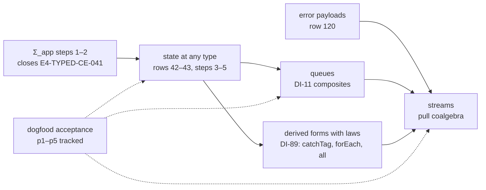

# What to build after the Σ_app bridge (2026-10-04)

**The one thing to know first.** The keystone is state at any type: decisions rows 42–43, steps 3
to 5. Today a cell holds only a number (`refTy := .handle "Ref.Ref<number>"`,
`src/Effect4/Program/Native.lean`). Queues, streams, caches and almost every real program wait on
it. The recommended order:

1. finish the Σ_app slice through step 2;
2. land state at any type;
3. build queues, then streams as reified pull coalgebras.

Dogfooding runs alongside as the acceptance test of each slice. Lowering to OCaml and
TypeScript stays parked, and so does the host-session guarantee. The owner ruled so on 2026-09-30,
until MCP, WASM or a host application needs them.

The evidence below comes from a read-only survey of the corpus on 2026-10-04 at `0e68443a`. The
coordinator re-read the four facts the order rests on: the owner's route, the cell type, the stream
kernel and rc.112's `Pull`.

## 1. The missing features, ranked

The rank is the number of the five model-probe programs a gap stops
(`docs/research/2026-09-30-model-probe/synthesis.md`). Ties go to how often the 15-project v4
ingest corpus uses the idiom (`docs/research/2026-10-01-type-language-probe/T/note.md`).

| # | Feature | Evidence | Owner of the decision |
| --- | --- | --- | --- |
| 1 | `Ref<A>`, `Deferred<A, E>` at any type, rows as templates | cells and deferreds carry numbers (`Native.lean`); row 42 calls it "the largest visible gap against Effect" | rows 42–43, steps 3–5; R4 |
| 2 | Derived forms with behaviour laws: `catchTag`, `forEach`, `all`, `retry`, `Schedule`, the eliminators | refused in the corpus: `catchTag` 4,320 units, `forEach` 967, `retry` 938; `Schedule` 0% admitted | DI-89; row 130; R10 |
| 3 | Structured error payloads | `Err` is `boom`, `tag`, `tagged` or `text` (`Machine/Alphabets.lean`); 4 of 5 probes, 13 of 15 projects | row 120 (ratification owed) |
| 4 | A typed guarantee for programs that call the host | M7 covers the empty row table only; R6 parked by the owner | rows 97–100, 183; DI-57 |
| 5 | Queue, PubSub, Semaphore, Cache | no census row; Queue 127 uses, 0% admitted | DI-11 (composites, ruled) |
| 6 | Stream, Channel, Sink in programs | Stream 2,269 uses, 0%; the kernel is host-sourced only (`Program/Stream.lean`) | DI-11; DI-89 |
| 7 | Config, Random, a custom Clock | R13 "designed, not implemented" | rows 51, 83; R13 |
| 8 | Numbers: `int`, number to text | `int` ruled, not landed; no number-to-text atom | rows 108, 109, 121, 131 |
| 9 | Recursive types | 196 recursive declarations in 10 projects | row 124 |
| 10 | Programs across modules | `E-IMPORT-OPAQUE` 9,002 units | row 144 |

Code-valued services (`Effect.fn`, 9,392 uses) are not in this list. The owner ruled them not a
blocker for the product (row 163).

## 2. Lowering, the host session and dogfooding

| Track | Done | Open | Waits on |
| --- | --- | --- | --- |
| Lowering | `read_print`, `read_exact`; LCNF to OCaml total on the machine's closure; a session-lowering probe agreed across Lean, native OCaml and node | what a checked lowering means (row 28); `lower_refines_build` (row 147); numbers (row 108) | Σ_app step 3 changes the entry points it would root |
| Host session | the keyed route and its laws; reserved defects (row 191) | R6's typed guarantee: DI-57 "weeks", row 99; the checked instance at each call site (row 183) | the host-instance representation, before the host correspondence proof |
| Dogfooding | four apps, 37 programs (2026-09-15/16) | none integrated: no `Test/Dogfood`; p1–p5 untracked; forms (F10) and the fixture owner (F25) unaddressed | rows 1–3 of §1 for real programs |

The owner's route (`docs/STATE.md`, 2026-09-30): "Then expansion on the proven route: queues
first, ergonomic run APIs, MCP authoring after LCNF". The same entry parks the full host-services
contract until needed. So neither lowering nor the host session leads now. Queues lead, and queues
need state at any type.

## 3. Streams as reified pull coalgebras

What exists:
- DI-11 (ruled 2026-09-10): streams add no `Eff` constructor; a stream is its coalgebraic kernel.
- `src/Effect4/Program/Stream.lean`: the kernel as three host rows (open, pull, close). A pull
  answers `Option (List α)`: a non-empty chunk, or `none` at the clean end.
- Streams come from the host only. No program builds or transforms one.

What "reified stream semantics" would add:
- A stream as program data: a state, a step program that answers a chunk and the next state or
  the end, and a release. This is a coalgebra written in `Eff`. Its binder is a term, not a
  closure, so it stays first-order data.
- Combinators (`map`, `filter`, `take`, `merge`, `runCollect`) as coalgebra transformers and
  folds. Each has a behaviour law, as DI-89 asks of every form.
- Equality of two streams as bisimulation of their pull traces. `runCollect` is a hylomorphism:
  the unfold of the coalgebra followed by a fold. This is the dual of the tree's folds
  (`initial-algebras-folds`), and the proof graph already has a coinduction bank (`Effect4.Coind`).

What it waits on:
1. **State at any type** (rows 42–43): a stream's state and its elements are not numbers.
2. **Queues** (DI-11's composites over `Ref`, `Deferred` and `WakeList`): `merge`, buffering and
   `Mailbox` need them. The owner put queues first.
3. **A ruling on the end signal.** rc.112's `Pull<A, E, Done>` extends `Effect<A, E |
   Cause.Done<Done>>` (`vendor/effect-4.0.0-rc.112/src/Pull.ts`): the end travels in the error
   channel and carries a leftover value. DI-11's kernel answers `none` and carries nothing.
   Faithfulness to rc.112 means `Done` with its leftover, which also needs structured error
   payloads (row 120).

The design note for streams can be written now, beside the state slice, because it changes no
code. Its build starts after queues.

## 4. The order

1. **Σ_app steps 1–2.** Seat P is proving the bridge goal now. Step 2 moves `admitSig` into
   program admission and repairs `E4-TYPED-CE-041`. Program admission lets through tables the
   typed state cannot account for, so this comes first.
2. **Error payloads (row 120).** Small, and 13 of 15 projects use them. It waits on the owner's
   ratification.
3. **State at any type.** The keystone, with the largest effect on what programs can say.
4. **Derived forms with laws.** `catchTag` first (with row 130's residual), then `forEach` and
   `all`. `retry` and `Schedule` wait on numbers (row 109).
5. **Queues, then streams.**
6. **Lowering and the host session,** when MCP or WASM, or a program that calls the host, is
   next.

## 5. Dogfooding as acceptance, not a phase

Track the five model-probe programs and the earlier dogfood programs under `Test/Dogfood`. Each
program gets a plan row naming the features it waits on, and each slice moves at least one
program forward. A program's semantic claims ("p3's worker pool returns every job") are
`proof_goal`s once the program admits. Dogfooding then answers "is this on track" with a
measurement at every slice, instead of in one later phase.

## 6. For the owner

1. The order of §4, in particular state at any type before queues and streams.
2. Row 120's ratification (error payloads).
3. The stream end signal: rc.112's `Cause.Done` with a leftover, or DI-11's `none`.
4. Whether p1–p5 become tracked acceptance programs (§5).
