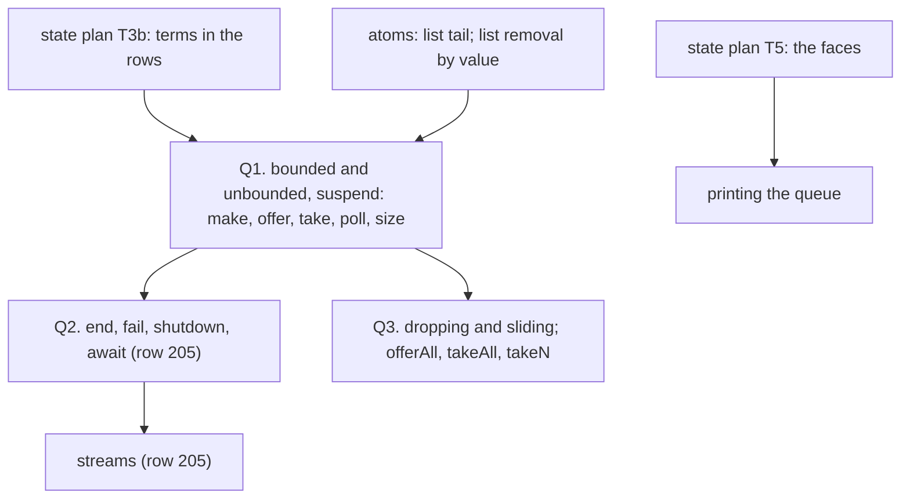

# Queues as composite programs: the slice plan (DI-11, decisions rows 79, 81, 204, 205)

**The one thing to know first.** No queue exists in the tree, and none can carry a law before
the state plan's T3b. An atomic offer or take needs `Ref.modify` with a binder term, and today the
read-modify-write rows carry five number functions. rc.112's `Queue` is not built on `Deferred`.
It parks raw callbacks, wakes takers through a task posted on the dispatcher stored at `make`, and
repolls. A composite over `Ref` and `Deferred` therefore matches its values relative to the
decision tape. It cannot match its wake timing, and it names that deviation (row 79, R79.5). The
plan's first slice, Q1, is a bounded suspend queue whose acceptance test is p3.

Inputs:
- the coordinator's read-only survey of 2026-10-04 at `917d4b5d`;
- DI-11 (`docs/DESIGN-ISSUES.md`), DB-13 (`docs/DESIGN-BASIS.md`) and `docs/core/machine-state.md` §5;
- the stateful-API catalogue (`docs/research/2026-09-19-stateful-api-catalogue.md` §2);
- the observation packet (`docs/research/2026-09-20-open-design-issues-order-and-observation-packet.md` §2.5);
- rc.112's `Queue.ts`, `PubSub.ts` and `Semaphore.ts`.

## 1. Where it stands

| Part | Today | Evidence |
| --- | --- | --- |
| The ruling | Queue, Mailbox and PubSub are composite `Eff` programs over `Ref`, `Deferred` and `WakeList`, never new machine stores | DI-11; DB-13 |
| `WakeList` | reaches programs only through a `Deferred` cell: `Stores.wakeList` dispatches on the promise kind alone | `Machine/Wake.lean`, `Machine/Stores.lean` |
| Atomic update with a term | the store runs it (T2); the operations do not yet carry one (T3b) | `SyncOp.refModify`; `NativeOp.refModify (f : FnName)` |
| A record or list in a cell | builds since T3a | p4, p5 |
| Printing a cell or deferred at a non-number instance | refused by name until T5 | rows 212, 210 |
| List atoms | `nil`, `cons`, `get`, `length`, `append`; no tail, drop or removal | `Machine/Term.lean` |
| Equality | numbers and strings only; no handle equality | `Machine/Term.lean` |
| Agreement profiles | `Profile` and `Agrees` exist only on paper (R79.5) | the observation packet §2.5 |
| Acceptance | p3 stands in the queue by a host row, `Jobs.take`, with no offer side | `Test/Dogfood/P3WorkerQueue.lean` |
| Corpus | Queue 127 uses in 6 projects; Semaphore 62; PubSub 44; Latch 3; all 0% admitted (uses, not units) | `docs/research/2026-10-01-type-language-probe/T/note.md` §3.3 |

## 2. The slices

- **Q1. A suspend queue.**
  - **Representation.** One `Ref` holds a record `{messages, capacity, takers, offerers}`, with
    capacity `option nat` (`none` unbounded). Each waiter parks on its own `Deferred<void, never>`
    and repolls, as rc.112's `take` does (`Queue.ts`, `take`: `takeUnsafe` or await and retry).
  - **Atomicity.** Each operation is one `Ref.modify` whose term answers what to do and the new
    state, so no yield falls between the read and the write.
  - **Waiter removal.** An interrupted waiter is removed from the list, as rc.112 removes it
    (`awaitTake`'s cleanup). Without removal, a wake meant for a live taker goes to a dead one.
  - **The law, in two layers.**
    - (L1) The step terms refine a pure Lean transcription of rc.112's `offerUnsafe`,
      `takeUnsafe` and `releaseCapacity` on an open queue: FIFO order, no loss, no duplication,
      size within capacity. It is proved at `meaningB`, where the operations are synchronous.
    - (L2) `Agrees profile Queue expansion` at the machine, on the profile "values relative to
      the decision tape" (R79.5), as a stuttering refinement. It lands as a placed goal at R10,
      with `Profile` and `Agrees` built in the slice.
  - **Named refusal rows** (R79.5), in the register:
    - the composite's inline `Deferred` wake against rc.112's posted `releaseTakers` on the
      maker's dispatcher;
    - the composite's wake count per offer.
  - **Acceptance.** p3 replaces the `Jobs.take` host row with an in-program queue. Main offers five
    jobs into `bounded(2)`. The workers' interruption cancels an in-program `Deferred.await`.
    Printing waits on T5.
- **Q2. End, failure and shutdown**, with row 205's end value, `Take.ts`'s shape and the named
  connection to `Cause.Done`. The streams slice reads it.
- **Q3. The other strategies and the bulk operations.** Each is a change of the step term.

## 3. Questions for the owner, with recommendations

1. **What DI-11's `WakeList` means.** Recommended: each waiter parks on its own `Deferred` and
   repolls, as rc.112's `Queue` does. No new program-visible primitive. A Latch store (row 81)
   stays open, for a module whose wake count or timing a `Deferred` cannot express.
2. **The queue's type, and what prints.** Recommended:
   - the queue is typed as its cell, `Ref<{…}>`, and prints as its expansion, as derived forms
     are stored expanded;
   - so p3's printed TypeScript runs the composite, not rc.112's `Queue.bounded`;
   - a nominal `Queue.Queue<A, E>` type, and printing as rc.112's own calls, wait for a later
     ruling on whether a composite may print as its module's call.
3. **Two list atoms, an alphabet append under DI-47.** Recommended:
   - a list tail, for the take that removes the head;
   - a list removal by value, for removing an interrupted waiter's `Deferred`. A `Deferred` is
     first-order data, so removal compares by structural equality.
4. **The wake-timing deviation.** Recommended: accept it as two named refusal rows under R79.5,
   with values matched relative to the decision tape. Matching rc.112's posted, coalesced wake on
   the maker's dispatcher needs a scheduled-wake primitive; it stays open with row 81.

Coordinator calls, recorded here:
- capacity `option nat`;
- `bounded(0)` (rendezvous) refused by name in Q1;
- HandleKind byte 6's old Queue reservation (`Machine/Value.lean`) released, since DI-11 rules out
  a store;
- runtime census rows for the composite under a new kind, deferred to Q2.

## 4. What this plan does not establish

- rc.112's wake timing, coalescing and dispatcher ownership (row 81).
- Printing as rc.112's `Queue.*` calls (question 2).
- PubSub, Semaphore and Latch: each needs its own law on a named profile (machine-state.md §5).
- Concurrency beyond the machine's interleavings on a decision tape.
