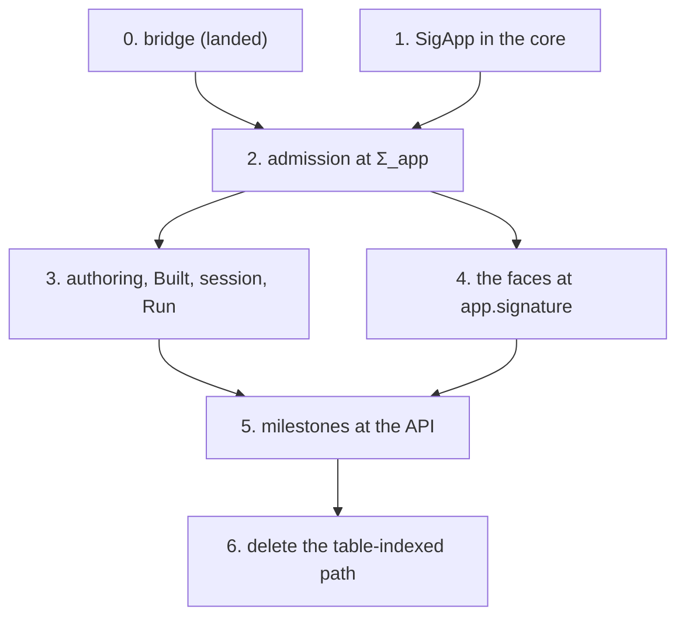

# The Σ_app slice: admission and code generation at an application's signature

**The one thing to know first.** The API's program admission is weaker than the typed state's
lawful source. It admits a table whose row requires a service key no carrier serves
(`E4-TYPED-CE-041`, kernel-checked). This slice makes signature admission part of program
admission (decisions row 21, ruled 2026-10-01: "thread it"). Its first step landed with this plan:
the bridge from program admission to the typed state, with one planned goal.

Requirement: R1 (`docs/core/system-map.md` §8). Survey: the coordinator's read-only survey of
2026-10-04, at `0e68443a`; its facts are cited by declaration and path below.

## 1. Where it stands

- The signature an application's tables give the checker is `SigApp` with `SigApp.signature`. Its
  located refusal is `admitSig`, complete against `LawfulSig` (`admitSig_ok_iff`). All of them live
  in `src/Effect4/Laws/Program/Signature.lean`. The `Effect4` root cannot reach them.
- Admission is pinned to the built-in signature: `AdmittedProgram program table` extends
  `TypedProgram (nativeSignature table) program` (`src/Effect4/Program/Admission.lean`).
- Code generation is pinned the same way: `ModuleEmission` (`src/Effect4/Codegen/Checked.lean`),
  `ModuleReading` and `admitModule` (`src/Effect4/Codegen/Admit.lean`).
- Their laws are pinned too, in 22 lines: `Laws/Codegen/Checked.lean` (10),
  `Laws/Codegen/Admit.lean` (6) and `Laws/Api/ModuleReadable.lean` (6). `nativeLawful`
  (`Laws/Codegen/ReadLeaf.lean`) and `printModule_erasure` (`Laws/Api/Codegen.lean`) follow.
- The printer and the reader already take a signature: `printEntry`, `readModule`,
  `checkTypedProgram`. Only their callers fix `nativeSignature`.
- `Author.build` (`src/Effect4/Api/Author.lean`) checks each service declaration against the
  built-in carriers (`disagreeingService`). So an application cannot declare a seventh carrier.
- `Built` (`src/Effect4/Api/Built.lean`), the session header (`HostSession.Header`) and `Run.open`
  carry the row table only.
- The typed state ranges over `ProgramSource` with its services and its lawfulness evidence.
  `m7_proved`, `reachable_typed` and `loadsTyped` read `root.signature`. Before this plan, no
  theorem connected `AdmittedProgram` to `ProgramSource`.

## 2. The finding: `E4-TYPED-CE-041`

`admitProgram` checks a table's keys, kinds, columns and formation. It skips three conditions of
`LawfulSig`: every key a row requires has a carrier (`served`); every parameter of a row's answer
or error is bound by its request (`wellScoped`); no parameter sits under a union head
(`templateAdmissible`). For each, a row the API admits and `admitSig` refuses is kernel-checked in
`Test/Counterexamples/Program/AdmissionUnserved.lean` (`decide +kernel`). The bridge names the
three as one premise, `AdmissionGap`.

## 3. Step 0, landed with this plan

`src/Effect4/Laws/Program/Typed/AdmittedSource.lean`:

| Declaration | Status | What it says |
| --- | --- | --- |
| `m7_admitted` | proved | at the empty row table, a program the API admits, with a closed row and an answer-free tape, satisfies M7a–c |
| `lawfulSig_of_admitted` | planned goal | an admitted table that meets `AdmissionGap` is a lawful signature with the built-in services |
| `reachable_typed_admitted` | modulo `lawfulSig_of_admitted` | every machine an admitted program's admitted tapes reach is typed, over a table that meets the gap |

The registry names `m7_admitted` (claim `m7-admitted`, R9) and `lawfulSig_of_admitted` (claim
`admitted-source-lawful`, R1). `generated/semantics.md` shows the goal as R1's next goal.

Placement of `lawfulSig_of_admitted`:

- Concept: `residual-program-typing`; property: admission implies the typed state's lawful source.
- Question: claim `admitted-source-lawful` (role compatibility); consumer: `AdmittedProgram.source`,
  then `reachable_typed_admitted`.
- Reach: the built-in services (no declaration), any row table, with the gap as a premise.
- Does not establish: program admission at declared services; the premise stays open until step 2.
- Unlocks: M6 for every program the API admits over a table that meets the gap (R1).

## 4. The steps

1. **`SigApp` in the core.** Move `SigApp`, `SigApp.signature`, `SigApp.serviceTy`, `sigRefusal?`
   and `admitSig` to a core module (`src/Effect4/Program/SigApp.lean`). The theorems stay in
   `Laws/Program/Signature.lean` over the moved names, with no second definition.
2. **Admission at Σ_app.** `AdmittedProgram program app` extends `TypedProgram app.signature
   program` and keeps `admitSig app = .ok ()`. `admitProgram` runs `admitSig` first, with a new
   refusal `signature (why : SigRefusal)`. Callers at a table move through `⟨table, []⟩`, whose
   signature is `nativeSignature table` by `rfl` (`SigApp.signature_nil`).
   - `lawfulSig_of_admitted` loses its gap premise: admission checks the three conditions, so
     `AdmissionGap` follows from it. CE-041 is repaired.
   - Goal to state when the carrier lands: `AdmittedProgram.lawful : LawfulSig app`.
3. **Authoring and the run.** `Author.build` builds the `SigApp` from `Module.table` and
   `Module.serviceTypes`. `disagreeingService` retires: `admitSig`'s service refusal replaces it.
   `Built`, `Run.open` and `HostSession.start` carry the `SigApp`.
   - The session header's wire form gains the service declarations. That is an owner decision
     (§5, question 1).
4. **The faces.** `ModuleEmission`, `ModuleReading`, `admitModule` and `emitModule` take
   `app.signature`. The 22 law lines are restated at it.
   - Goal: `LawfulSpelling app.signature (nativeSpell app.rows)` for flat carriers, generalizing
     `nativeLawful`. Structured carriers stay out (decisions row 118).
   - The printed key syntax changes for a declared service (`Context.Service<…>`), so the
     TypeScript face and the truth harness follow.
5. **Milestones at the API.** `m7_admitted` and `reachable_typed_admitted` are restated at
   `AdmittedProgram program app`, with services. Meaning and run soundness follow at the
   admitted signature for straight and looped programs through `effTy_restrict`.
6. **Delete** the table-indexed `AdmittedProgram`, `nativeSignatureWith`, `nativeServiceTyWith`
   (the per-key table that `one_code_two_carriers` refutes), `disagreeingService` and
   `BuildRefusal.serviceCarrier`.

Steps 1 and 2 are one seat's slice. Step 3 waits on question 1. Step 4 can run beside step 3 in a
second seat: its files are disjoint (`Codegen/*`, `Laws/Codegen/*`, `Laws/Api/ModuleReadable`).

## 5. Questions for the owner

1. The session header carries the row table today. Does it carry the service declarations as well,
   with a protocol version step, or does the session derive them from the admitted program?
2. Does step 4 ship with step 2, or after it? The faces stay correct at the built-in signature
   meanwhile.

## 6. What this plan does not establish

- M7 at a non-empty row table: `M7Fragment` requires the empty table (DI-57, R6).
- Structured service carriers (decisions row 118).
- The host-call instances of decisions row 183. They touch the same program admission files.
- `meaning_typed_app` and `run_typed_app` at a declaration that rebinds a built-in code: they hold
  at fresh codes only.
