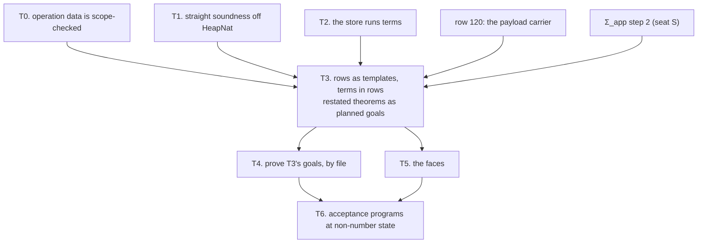

# State at any type: the slice plan (decisions rows 42–43, steps 3–5; row 204)

**The one thing to know first.** The typed state already types a cell and a deferred at any type.
What is still number-only:
- the public rows;
- the store's function names (`FnName`);
- the straight soundness's heap column (`HeapNat`);
- the faces.

So this slice is a cutover, not a new theory. It runs in seven slices, T0–T6. Two of them, T0 and
T1, can start now, because they change no behaviour. The large one, T3, lands its restated
theorems as planned goals (row 203) so that T4 can prove them in parallel by file.

Requirement: R4 (`docs/core/system-map.md` §8). Ruled order: decisions row 204. The inputs:
- the 2026-09-18 plan, `docs/research/2026-09-18-rows-42-43-plan.md`, with its §2b corrections
  and §2d re-cuts;
- the coordinator's read-only survey of 2026-10-04 at `37289464`;
- the monitor's audit of 2026-10-04 at `9b5881f5`, relayed by the owner and kept in
  `state-audit/` beside this note (`state-at-any-type-audit.json`, with the replayable probe
  `state-at-any-type-probe.mjs` and its receipt).

## 1. Where it stands

| Layer | Status | Evidence |
| --- | --- | --- |
| L1: `Term` below the machine | landed | `Machine/Term.lean`; the stores do not import it yet |
| L3: the atoms the rows need (`ite`, `some`, `none`, `mul`), the `Spec`/`Scheme` table | landed | `Machine/Term.lean`, `Program/NativeAtom.lean`; `NativeAtom.sound` |
| The template calculus and `checkRow` | landed | `Program/Ty.lean` (`instantiate`, `infer`, `matchTemplate`); `Typing/Rules.lean` (`checkRow`, `rowTy`) |
| `templateAdmissible`, `Row.wellScoped` as admission refusals | landed | `rowChecks` (`Laws/Program/Signature.lean`) |
| The typed world, generic per cell | landed | `World.Ρ`, `World.«Π»` (`Typed/World.lean`); `Fits` at `refOf`/`deferredOf` (`Typed/Membership.lean`) |
| Store adequacy for make, get, set and `completeWith`, at any type | landed | `refMake_world`, `refGet_implements`, `refSet_implements`, `refGetAndSet_implements`, `deferredMake_implements`, `deferredCompleteWith_implements` (`Typed/Adequacy.lean`) |
| The public rows | number-only | `refTy`, `deferredTy` (`Program/Native.lean`); `syncOpOf` decodes `Val.nat` only |
| Function rows | names, not terms | `NativeOp.refUpdate (f : FnName)` and seven siblings; `refStep` runs `FnName.total`, `modify`, … (`Machine/Stores.lean`) |
| `refModify`'s typing | `nat` only | `storePre`/`storePost` (`Typed/Residual.lean`); `nat_cell`, `modify_nat` (`Typed/Adequacy.lean`) |
| Straight soundness | `HeapNat` | `TypedAt.heap` (`MeaningSound.lean`), `SoundB` (`LoopSound.lean`), `progress` (`Progress.lean`) |
| Scope check of an operation's data | missing | `scopedAlgebra`'s `eff_perform` ignores the operation (`Program/Scoped.lean`, generated by `tools/Effect4Gen/Authoring.lean`) |
| `Deferred.make`'s type arguments | spelled, not data | `NativeOp.deferredMake` has no fields; the typed state picks the certificate `(nat, nat)` (`syncRow_typed`, `Typed/Denotation.lean`) |
| The faces | alphabet only | the printer prints `refOf`/`deferredOf`; no row produces them; binder terms are not printed (F3 open, `harness/truth/prelude.ts`) |

## 2. What the rc.112 runtime does, and what the model holds

The monitor's probe ran against the installed rc.112 under node 22. It is finite host evidence,
not a Lean theorem and not a concurrency proof. Its observations:

- `Ref.modify(ref, f)` with `f : A → [B, A]` answers `B`, stores `A` and runs `f` once
  (`vendor/effect-4.0.0-rc.112/src/Ref.ts`, `modify`).
- `Deferred.completeWith(d, eff)` stores the effect, and each await runs it. A record-valued
  `Ref` written between two awaits is seen as before, then after. A second `completeWith` answers
  `false` and replaces nothing.
- `Deferred.complete(d, eff)` runs the effect once and stores its exit, so both awaits see the
  value from before the write.
- `complete` is guarded: `suspend(() => self.effect ? succeed(false) : into(effect, self))`
  (`Deferred.ts`, `complete`). On a completed deferred it answers `false` and never runs `eff`.
  `into` runs `eff` under `uninterruptibleMask`, restoring the caller's interruptibility around
  it, then calls `done` with its exit (`Deferred.ts`, `into`). The monitor's second probe
  (`state-audit/deferred-complete-guard-probe.mjs`) shows the guard matters: on a completed
  deferred, an unguarded "run, then `done`" runs a side effect that `complete` skips. Both answer
  `false` and keep the first value. The pending deferred is the positive control.

The model:
- `Completion` is `ofExit exit | ofRefGet cell` (`Machine/Completion.lean`). `completionPrim`
  makes `ofRefGet` a stored read, run when each waiter resumes (`Machine/Stores.lean`).
- A second completion answers `false`: `DeferredStore.complete`, `deferredStore_complete_done`,
  `w4_complete_twice_answers_false`.
- No program row produces `ofRefGet`. It comes only from host tapes.
- `Deferred.complete` has no row of its own. The coverage row `deferred.complete-runs-once` is
  witnessed only by `deferredStore_complete_done`.
- No theorem shows two awaits on either side of a write seeing different values.

## 3. The slices

### T0. Operation data is scope-checked (now; no behaviour change)

- The generator (`tools/Effect4Gen/Authoring.lean`, group `Scoped`) emits
  `scopedAlgebra (Op) (opScoped : Op → Nat → Bool)`. Its `eff_perform` is
  `fun op a1 n => opScoped op n && a1.scoped n`.
- `NativeOp`'s instance answers `true` until an operation carries a term. A term at
  `env ++ [current]` is checked at `n + 1`.
- Red control, in a `Test` fixture over a fixture operation type that carries a `Term`:
  - an out-of-scope variable inside the operation is refused, even when the request is closed;
  - an outer capture at a bound level is admitted.
- Obligation `perform_scoped_iff`: `scopedAt n (.perform op arg) = true ↔ opScoped op n = true ∧
  arg.scoped n = true`, by the generated connector.
  - Concept `initial-algebras-folds`.
  - Claim: a new claim, `operation-data-scoped`, role decidability, in R4.
  - Consumer: T3's term rows; the checker refuses an unscoped term before typing it.
  - Does not establish term typing: scope is not typing.

### T1. The straight soundness leaves `HeapNat` (now; no behaviour change)

`HeapNat` breaks the moment `refMake` admits a non-number value. FR-03
(`docs/research/2026-09-21-foundations-monotonicity-and-refinement-review.md`) rules out forcing it
back in. Two routes:

1. **Derive.** The typed state types every machine exit on every fragment (`Typed.exits_hasTy`,
   `Typed/Results.lean`). If `run_eq_meaning` and `loopAgreement` do not rest on
   `MeaningSound.sound` or `progress`, the meaning's soundness on `Straight` and `Looped` is that
   theorem transported along them, and the straight proofs keep no heap column.
2. **Restate.** `TypedAt`, `SoundP`, `SoundB` and `progress` carry the world's per-cell table, and
   reuse `HeapCell`, `HeapTable` and `HeapTypedAt` (`Typed/World.lean`).

Route 1 does not replace route 2 (the monitor's follow-up audit). The two statements differ in
scope:
- `exits_hasTy` assumes an admitted tape (`AdmittedTape`) and types the recorded exits of a
  closed program;
- `sound` and `soundB` quantify over arbitrary typed environments and stores, and `SoundP` also
  gives bad-exit independence, the store order and well-formedness.

So the transport gives at most the closed-program exit corollary. The stronger judgments stay
while any consumer needs them. The seat:
1. lists the consumers of `sound`, `soundB`, `progress` and their fields;
2. tests the dependency with `ProofGraph.reachedAxioms`, using a fresh memo and a stop predicate
   that names `sound`, `soundB` and `progress` (the default result and `#plan_status` do not
   report reachability of an arbitrary theorem);
3. restates the stronger judgments over the per-cell table (route 2). Route 1 adds the
   closed-program corollary only where it is cheaper and loses nothing.

Either way:
- `HeapNat`, `step_heapNat` and `FnName.*_hasTy_nat` are deleted;
- `heapNat_iff` survives only if a public consumer still states a number-only result.

Placement:
- Concept `residual-program-typing`, serving `store-typing`.
- Claims: `straight-meaning-typed` (pointer `Denote.meaning_typed`) and `sound-at-app-signature`
  (pointer `Denote.run_typed_app`). Their pointers stay; their proofs lose the heap column.
- R4 open part 3.
- Does not establish anything at a template row: the rows are still closed here.

### T2. The store runs terms (after T0; behaviour-preserving)

1. `Machine/Stores.lean` imports `Machine/Term.lean`.
   - The `SyncOp` read-modify-write rows carry `(f : Term) (env : List Val)`.
   - `refStep` and `SyncOp.refKernel` evaluate `evalTerm (env ++ [a]) f`.
   - A term that fails to evaluate, or answers the wrong shape, makes the step `none`. That is a
     frontier, as a dangling key is.
2. `modify` decodes a two-element tuple `[b, a']`: it answers `b` and stores `a'` in one store
   step. `modifySome` decodes `[b, option a']`.
3. The connector first: `FnName.term : FnName → Term`, with one agreement theorem per kernel,
   `kernel_term_agrees : refKernel (… (FnName.term f) []) = refKernel (… f)`.
   - `NativeOp` keeps its `FnName` field in this slice and lowers through `FnName.term`. So every
     program, golden and corpus verdict runs unchanged.
4. The machine census rows that cite `FnName` move to the term rows.
5. The OCaml estate regenerates from LCNF:
   - the four `FnName` roots in `ocaml/gen/roots.json` go;
   - the closure manifests change, and the change is reviewed.

Placement of `kernel_term_agrees`:
- Concept `translation-simulation`: two representations of one row, equal on every request.
- Claim: a step of R4's open part 2.
- Consumer: every existing run and golden across the cutover.

Placement of `refStep` atomicity: it holds by construction, one `syncOpStep`. A split get and set
does not stand in for `modify`.

### T3. Rows as templates, terms in rows (after T0–T2, seat S and row 120's carrier)

The rows:
- The Ref rows go over `refOf (var 0)`, the Deferred rows over `deferredOf (var 0) (var 1)`.
- `NativeOp.deferredMake (value error : Ty)` carries its type arguments, as rc.112's
  `Deferred.make<A, E>()` does. An unbound template is never defaulted (the 2026-09-18 plan, §1).
  - Red control: a `Deferred.make()` with no type arguments is refused at reading, never typed
    at a default.
- The read-modify-write `NativeOp`s carry `(f : Term)`, and `FnName` is deleted.
- `syncOpOf` decodes any value.

The checker:
- `Row.fn : Option (Ty × Ty)` (parameter and result templates) and
  `Signature.termOf : Op → Option Term`.
- `rowTy` types the term at `env ++ [instantiate σ param]` and extends `σ` from the term's type
  with the same `matchTemplate`. `modify`'s `B` is bound from the term.
- The match guard normalizes the instance (§2d).

Other changes:
- `NativeOp.all` cannot enumerate term-carrying operations. Table collision, `nativeSpell` and
  the generated authoring rows key on the spelling instead.
- Service code 7 is `refOf nat`, and `FlatFits` accepts it.
- Decisions row 155 (a) and row 183's repair activate here (§5, question 3).

The theorems this breaks are restated in place and land as `proof_goal`s when their proofs do not
follow at once. Row 203's workflow keeps the build green, and `#plan_status` shows the frontier
T4 works. The expected goals, each placed:

| Goal | Concept | Claim, requirement | Consumer | Does not establish |
| --- | --- | --- | --- | --- |
| `matchTemplate_complete_anchored`: if some `σ` puts the request under the instance and every parameter first occurs at an invariant handle position, the match finds such a `σ` | `subtyping-algebra` | R4, template instantiation | the checker's completeness at every native row (`setAndGet`'s template repeats `var 0`) | completeness at a row whose parameter first occurs under a covariant position |
| `refModify_implements` at any `A`, `B` | `store-typing` | store safety; R4; M6 | `storeStep_typed` | concurrency; the probe's atomicity is host evidence |
| `refUpdate_implements` and the five siblings, at a term | `store-typing` | the same | the same | the same |
| `deferredMake_implements`, with the certificate read from the operation | `store-typing` | R4 | `storeStep_typed`; the faces' type arguments | — |
| `syncRow_typed` per instantiation | `residual-program-typing` | M5 | `Typed/Denotation.lean`'s perform arm | host rows (R6) |
| `HandleFits` without the number spellings; `Val.hasTy`'s cell and promise arms retired | `store-typing` | row 96 D2 retired | `Fits`'s consumers | — |

### T4. Prove T3's goals (parallel seats, one per file group)

Each seat takes the goals of disjoint files. The plan of T3's receipt lists them by file:
`Typed/Adequacy.lean`, `Typed/Denotation.lean`, `Typed/Residual.lean`, `Typed/Membership.lean`,
`Typed/Commands/Clauses/StoreRef.lean`, `Laws/Machine/RefKernel.lean` and `StoresLaws.lean`. Two
code seats at most (the parallelism ceiling of 2026-10-01).

### T5. The faces (after T3)

- `Row.typeArgs` is derived from the instance (`ofNormalized`, `Codegen/Types.lean`), not spelled.
- The printer prints a binder term as `(a) => …`. `LambdaShape` and `atom?` retire.
  - Until T5, the printer prints only the five old shapes (`FnName.term`'s image) and refuses any
    other term by name.
- `Deferred.make<A, E>()` prints and reads its explicit type arguments.
- The readers follow: the Lean reader and `ts/eff/read.ts`.
- The generated faces follow: `TsGen` and `profile.gen.ts`; the OCaml `eff_native`, `eff_json`
  and `eff_layout`.
- The harness prelude's `FnName` exports go, which closes F3.
- The goldens change: the `.ty` verdicts move from `handle "Ref.Ref<number>"` to `refOf nat`.
- Obligation: `read_print` and `read_exact` extended to binder terms and explicit type
  arguments.
  - Concept `translation-simulation` (generated-code relations).
  - R4 open part 4.
  - Does not establish the truth harness's agreement, which is a finite check.

### T6. Acceptance (after T4 and T5)

Seat D's table (decisions row 206, `Test/Dogfood/README.md`) names the probe programs that wait
on non-number state. Each moves a stage. Its admission is a kernel-checked test, and its semantic
claims become `proof_goal`s in `Test`. The completion witness lands here too: in the machine, two
awaits on either side of a `refSet` see before and after under `ofRefGet`, and the same value
under `ofExit`. This is a finite machine witness for the coverage row
`deferred.complete-with-stores-effect`, the Lean twin of the monitor's probe.

## 4. What this plan does not establish

- Concurrency: one store step is atomic in the machine. The probe does not prove rc.112 atomic
  under every schedule.
- Host rows at templates: R6 stays parked. Row 183's repair makes the certificate the instance,
  but no host-correspondence proof follows.
- Functions as values: they stay refused by the profile (decisions row 43). A binder term is
  first-order data with a fixed binder layout.
- Retained behaviour: a deferred completed with an arbitrary stored `Eff`. A stored first-order
  program is data, not a host function. What it lacks is R7's code resolution and capture contract
  (`docs/core/machine-state.md`, "Composed APIs": resolution must establish the entry signature
  and the capture layout).
- Profile support or lowering beyond regeneration: the OCaml and TypeScript faces are
  regenerated, not proved.
- Queues and streams: they come next (row 204), over this slice's `Ref<A>` and `Deferred<A, E>`.

## 5. Questions for the owner, with recommendations

1. **`Deferred.complete` and `Deferred.completeWith`.** Recommended:
   - `complete(d, eff)` becomes a derived form with a behaviour law (DI-89), transcribing rc.112
     exactly (§2):
     - if `d` is completed, answer `false` and run nothing;
     - otherwise run `eff` under a mask that restores the caller's interruptibility, and call
       `done(d, exit)` with its exit.
     The form's contract states the guard and the mask before any goal is stated. Today's
     `uninterruptible` and `interruptible` do not express "restore the caller's", so the form
     needs that construct, or its law holds only for an interruptible caller.
   - `completeWith(d, eff)` with an arbitrary effect stays outside this slice and is refused by
     name. Its boundary is R7's missing code resolution and capture contract, not a ban on stored
     programs (§4).
   - The one first-order stored effect, `ofRefGet`, stays host-only.
2. **The error column of `Deferred<A, E>`.** `Deferred.fail` at a non-number error needs an `Err`
   that carries a value: row 120's payload carrier. Recommended: land row 120's carrier before
   T3. The other order would leave `fail` refused by name at every error type except a tag.
3. **Rows 155 and 183.** Both activate at T3, and both are open with a recommendation:
   - row 155 (a): a parameter in a row column counts as inhabited for the column check;
   - row 183: `bitEntry` reads the row's instance at the request, not the template.
   Recommended: ratify both as recommended.
4. **The straight soundness (T1).** Recommended: restate `sound`, `soundB` and `progress` over the
   per-cell table, keeping their generality. Deriving them from the typed state gives only the
   closed-program exit corollary (T1). `HeapNat` goes. The coordinator proceeds this way unless
   the owner objects.
