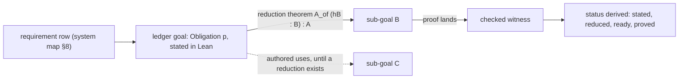

# Proof graph audit (2026-10-04)

**The one thing to know first.** The estate checks evidence more strictly than a blueprint does,
but it does not plan like one. The open goals are written in prose, no tool records which goal
needs which, and the status of the requirements is written by hand. The machinery to fix this
already exists: the ledger, its `dependencies` field, and the reduction theorem `m7_of_ledger`.
What is missing is to use it as the plan.

Base: `faad3e9e` on `refactor/phase1-phase3`, built and current (`lake build --no-build
Effect4Laws Tools.SemanticsRegistry`: all 614 jobs up to date).

## 1. How the field does it

### 1.1 Mathematics in Lean: the blueprint

A blueprint is a dependency graph that is written before the Lean code
(`https://github.com/PatrickMassot/leanblueprint`, which lists over 40 projects, among them the
Polynomial Freiman–Ruzsa conjecture, Fermat's Last Theorem, Carleson and the Prime Number
Theorem).

- A node is a definition or a statement, written in words first.
- `\uses{…}` lists the nodes it needs. These lists are the edges.
- `\lean{…}` names the Lean declaration, and `\leanok` marks it formalized.
- The tool computes each node's status from these marks. The statuses are: can be stated,
  stated, can be proved, proved and fully proved (proved, with every node it needs proved too).
- Lean holds the open nodes as `sorry` stubs. `checkdecls` only checks that each named
  declaration exists.

LeanArchitect (`https://github.com/hanwenzhu/LeanArchitect`, tag `v4.33.1`) moves the node into
Lean as a `@[blueprint]` attribute. It infers `uses` from the constants of the statement and
`proofUses` from the constants of the proof, and an author can override both.

### 1.2 Any proof assistant: stub, reduce, ask the kernel

The common loop is the same everywhere:

1. State the top theorem.
2. Break it into stub lemmas: `Admitted` in Rocq, `sorry` in Lean and Isabelle.
3. Prove the top theorem from the stubs.
4. Ask the system what the top theorem still rests on: Rocq's `Print Assumptions`, or Lean's
   `#print axioms`, which shows `sorryAx`.

The open frontier is computed, never written down by hand.

### 1.3 Verified software

Large verified systems plan the same graph, with different nodes. seL4 proves refinement through
a chain of specifications. CompCert composes one simulation proof per compiler pass. The plan is
the top correctness theorem, its split into one simulation or refinement per layer, and the
invariants each layer needs.

### 1.4 The verdict on the owner's question

The owner's reading is right: declare the theorems and invariants first, model the graph, tick
the obligations off as they land, and let the graph guide the work. Two refinements:

- **Reductions beat `\uses`.** A blueprint's edges are authored and unchecked. Here an edge can be
  a theorem `A_of (hB : B) (hC : C) : A`, proved now, whose premises are the open goals. The
  kernel then checks the decomposition itself. The estate has done this once:
  `m7_of_ledger` (`src/Effect4/Laws/Program/Typed/Assembly.lean`) proves M7 from M5's
  `LoadsTyped` and M6's `DecisionKeeps`.
- **Unused theorems are not a defect.** A blueprint does not count them, and Mathlib is mostly
  lemmas that no single theorem uses. The graph should tell the spine (what a goal reaches) from
  the library (everything else), and gate neither.

## 2. What the estate has

| Layer | Where | What it holds | Status from |
| --- | --- | --- | --- |
| Requirements R1–R13 | `docs/core/system-map.md` §8 | theorem shapes, one line each, in prose | written by hand ("Status at `0c534f06`") |
| Semantics registry | `tools/Tools/SemanticsRegistry.lean` | 10 concepts, 84 claims | derived from the environment (`make gen-semantics`) |
| Obligation ledger | `tools/ProofGraph/Ledger.lean`, `src/Effect4/Laws/Auto/Obligations.lean` | `Obligation p` goals, `#proof_wanted`, `#obligation_proved`, `#typed_state_obligations … using aesop` | derived; the frozen proposition is checked against the proof |
| Reductions | `m7_of_ledger` | M7 from M5 and M6 | kernel |
| Evidence | `ProofGraph.Proof`, `ProofGraph.Axioms`, `ProofGraph.Search` | `checked_theorem%`, axiom ceiling, kernel-checked search | kernel and the axiom gate |

The registry's 84 claims point at 79 witnesses, 1 refutation, 3 absences, 1 assumption and
**0 ledger goals** (counted from the `pointer :=` lines of `SemanticsRegistry.lean`).

The ledger holds **0 goals under `src/`**. M6's 20 goals closed on 2026-10-03, and commit
`0821bb2d` retired the ledger. The only `Obligation` declarations left are the fixtures under
`Test/Audit/`.

## 3. Findings

**F1. The plan is not in Lean.** Every open requirement is a one-line prose shape: R2's C6, R4's
steps 3–5, R5, R7, R10, R11 over the whole run, R12, R13 and row 117. A blueprint would hold
each one as a stated node. As a result no tool computes the frontier, and "what is next" is
read from `docs/STATE.md`.

**F2. No edges.** `ProofGraph.Goal` has a `dependencies` field, but `readGoal` always leaves it
empty. The cycle check in `ProofGraph.check` (Kahn's algorithm) therefore never sees an edge.
The registry's `Claim` has no edge field at all. Nothing reads `m7_of_ledger` as a graph either.

**F3. The requirements' status is written by hand.** The status column of the system map's §8
is prose. That breaks the owner's rule that tracking artifacts are measured, not drawn.

**F4. The ledger is filled for one milestone and then emptied.** Retiring a proved goal is right.
But an empty ledger cannot serve as the plan between milestones.

**F5. The registry catalogues results instead of planning them.** 79 of its 84 claims point at
theorems that are already proved. The registry records what landed, not what is wanted.

**F6. "What a proof brings in" exists in pieces.** `#auto_census` and
`#typed_state_obligations … using aesop` try a rule bank on a stated goal. The trust gate
counts tactics by syntax kind. No tool records, for each landed proof, the lemmas and rule
banks it used.

**F7. The spine and the library (finite probe).** The probe is
`docs/research/2026-10-04-proof-graph-audit/reach_probe.lean`, run as
`LEAN_NUM_THREADS=3 lake env lean -M8192 --run <probe> > reach.tsv` (79 s), then
`python3 docs/research/2026-10-04-proof-graph-audit/join.py reach.tsv`. It loads the registry's
roots (`Effect4.Laws` and two `Test` modules), takes as goals the registry's pointers and any
ledger goals (80 roots), follows the constants of every statement and proof, and applies the
semantics report's filter for auxiliary declarations.

| Theorems of the `Effect4.Laws.*` modules | Count |
| --- | --- |
| reached from the 80 roots: the spine | 3,468 |
| used by something, with no path to a root | 2,410 |
| used by nothing loaded | 1,457 |
| — of these, referenced from `Test` or tool sources (`.ilean`) | 329 |
| — named in text (for example the coverage lists of `Test/Audit/RuntimeCoverage.lean`) | 270 |
| — mentioned nowhere checked | 858 |

The roots leave out the coverage witnesses and the counterexample register's witnesses. Some of
the 858 are generated, for example 62 frame rules in `Typed.Frames`. So 858 bounds the unplaced
theorems from above; it is not a count of mistakes. Per §1.4 these numbers are information, not
a gate.

## 4. The planning graph this tree should have

- **Node:** a ledger goal, `theorem r12_… : Obligation (statement) := ⟨⟩`, with its concept and
  claim in the registry (`Pointer.goal`). The five placement facts of `AGENTS.md` go with it, as
  they do today.
- **Edge:** a reduction theorem whose premises are other goals' propositions. The tool matches
  each premise to a goal by definitional equality and fills `Goal.dependencies`, so the cycle
  check becomes real. A goal with no reduction yet may carry authored `uses` (LeanArchitect's
  `uses :=`), drawn dashed and reported as unchecked.
- **Status, derived:**
  - *stated*: the goal is declared, with a `wanted` placeholder;
  - *reduced*: a reduction theorem exists;
  - *ready*: every premise of the reduction is proved;
  - *proved*: `X.checked`, or the reduction applied to proved premises;
  - *frontier*: the goals that are ready, plus the goals with no reduction.
- **What a proof brings in:** for each proved node, the tree lemmas its proof term uses, the
  rule banks of its `aesop` calls and its tactic kinds. For each open node,
  `#typed_state_obligations … using aesop (rule_sets := …)` already reports which goals the bank
  closes as they are stated. That is the cheapest development speed-up on offer.
- **Output:** `generated/semantics.md` gains the graph as Mermaid and the frontier list,
  `make status` prints the frontier, and the system map's §8 status column becomes a pointer to
  it (F3).

### 4.1 Slices

1. **`ProofGraph.Reach`** (tooling only, under the `ProofGraph` root, outside the axiom gate).
   It holds the probe's forward and reverse closure, the reduction reader and the filling of
   `Goal.dependencies`. Its roots add the coverage witnesses and the register's witnesses.
2. **One requirement stated as ledger goals.** The owner picks it: R11 over the whole run and R12
   are the candidates, since both are open with a shape already written. Each goal comes with its
   five placement facts.
3. **The report:** statuses, the frontier and the Mermaid graph in `generated/semantics.md`, and
   the §8 status column replaced by a pointer.
4. **The brought-in profile** for each proved node.

## 5. The module system, and the order of work

Facts:

- In 4.33.1 the option `experimental.module` is a deprecated no-op
  (`Lean/Language/Lean.lean` in the toolchain source). The module system is on without a flag.
- `lake shake` refuses this tree: "`lake shake` only works with `module`s currently" (run
  2026-10-04 with `--force --explain` on three modules).
- The analysis of `docs/research/2026-10-03-claude-lead/tooling-map.md` §1.10 stands:
  - after the change, editing a proof rebuilds none of the modules that import it;
  - adoption runs bottom-up: `effects` (3 of 46 files are modules), `hash` (3 of 54) and
    `typescript` (0 of 12) come first;
  - the idiom that keeps today's meaning is `module`, `public import` and
    `@[expose] public section`;
  - tactic and generator code needs `meta import`;
  - the axiom gate needs proof bodies, which a pilot must confirm it still receives.
- `src/` holds 448 Lean files, 268 of them under `Laws/`.

Order: land the module system first, as a wave of its own, then the planning graph.

- The migration touches every file header, so it conflicts with any other work under `src/`.
  The tree is clean and built now, which makes this the quiet point for it.
- The proof graph reads proof bodies (`thmInfo.value`), as the axiom gate does. Under the module
  system a theorem's body sits in the private part of the `.olean`. The pilot should run this
  probe beside the axiom gate as an acceptance check. Both must see every proof before and after.
- Slice 1 of §4.1 touches only `tools/`, which can stay outside the module system: a file that is
  not a module may import modules. It can run beside the packages' conversion, in its own
  worktree.

The owner ruled "no pilot for now" on 2026-10-03, so this order needs a new ruling.

## 6. Open for the owner

1. The module system now, bottom-up from the three packages: reverses the ruling of 2026-10-03.
2. The ledger as the standing plan (F4): goals stay declared between milestones, and only proved
   goals retire.
3. Which requirement is stated first as ledger goals (§4.1, slice 2).
4. Whether authored `uses` edges are allowed before a reduction exists, or every edge must be a
   reduction theorem.

## Sources

- leanblueprint: `https://github.com/PatrickMassot/leanblueprint`
- LeanArchitect: `https://github.com/hanwenzhu/LeanArchitect`
- import-graph: `https://github.com/leanprover-community/import-graph`
- Lean Atlas (2026): `https://arxiv.org/html/2604.16347v1`
- Goedel-Architect (2026): `https://arxiv.org/pdf/2606.06468`
- BlueprintRepair (2026): `https://arxiv.org/html/2607.28110v1`
