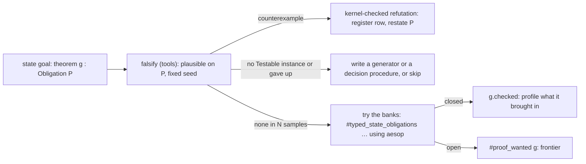

# Reference scout: automation (seat: automation, 2026-10-04)

Evidence kind for this whole note: source reading. No Lean process ran, nothing was built, and
nothing here is tested. A conclusion that goes past what the source says is marked *assumed*.
Counts of estate text come from `grep`; the command is given next to each count, and each count
is a text-level upper bound (it also matches docstrings).

## 1. The one thing to know first

**grind and lean-auto cannot carry a proof under the estate's `[propext, Quot.sound]` ceiling.**

- Every `grind` proof of a goal that is not `False` after its binders are introduced contains
  `Classical.byContradiction`. Its case splits use `Classical.em`. Its negation normalizer
  rewrites with lemmas proved by classical `by_cases`. No field of `Lean.Grind.Config` removes the
  first step.
- `lean-auto` applies `Classical.byContradiction` before anything else. It accepts an external
  prover's answer only through two axioms.
- The 2026-09-17 tooling scout (`docs/research/2026-09-17-lean-tooling-scout-G.md`, §6) lists
  `grind` as "in use". No file under `src/`, `Test/` or `tools/` calls it
  (`grep -rn --include='*.lean' -E '\bgrind\b' src Test tools`: no match).

The automation that fits the ceiling is elsewhere:

- aesop banks with checked registration and a bank lint;
- Lean's linter framework, which is a gate here because every library builds with
  `-DwarningAsError=true`;
- a term-level "brought in" profile;
- plausible, as a tools-only falsifier for stated goals.

A linter can also close a gap the estate has today. The axiom ceiling is checked only inside
`lake build Test`, so a narrow build can land a theorem that reaches `Classical.choice`.

## 2. What I read

| Source | Pin | What I read |
| --- | --- | --- |
| Lean core, `~/.elan/toolchains/leanprover--lean4---v4.33.1/src/lean/` | toolchain `v4.33.1` | `Lean/Meta/Tactic/Grind/{Util,Intro,Finish,Split,SimpUtil,Attr,Extension,RegisterCommand,CollectParams}.lean`; `Lean/Elab/Tactic/Grind/{Main,Trace}.lean` (outline and trace path); `Init/Grind/{Config,Util,Norm,Lemmas,Lint}.lean`; a grep of `Init/Grind/` for `Classical`; `Init/Classical.lean`; `Init/ByCases.lean`; `Init/Tactics.lean` (tactic syntax kinds); `Lean/Elab/Command.lean` (`Linter`, `addLinter`); `Lean/Linter/{Init,Basic,PersistentLintLog,Sets}.lean`; `Lean/Linter/EnvLinter/{Basic,Frontend}.lean`; `Lean/Linter/Extra/UnreachableTactic.lean` (head); `Lean/Util/Trace.lean` (profiler options); `Lean/Elab/Tactic/Simp.lean` (`mkSimpOnly`); `Lean/Meta/Tactic/Simp/Types.lean` (`UsedSimps`); `lake/Lake/CLI/Help.lean` (`helpLint`); `lake/Lake/Config/LeanConfig.lean` (`plugins`) |
| aesop, `.lake/packages/aesop` | `3448c0bcc5ce01b2d1546e483ec3620e32df3d0e` (`lake-manifest.json`) | `Aesop/Options/Public.lean`; `Aesop/Stats/{Basic,Extension,File,Report}.lean`; `Aesop/Frontend/{Command,Tactic}.lean`; `Aesop/Frontend/RuleExpr.lean` (builder options); `Aesop/Frontend/Extension.lean` (API outline); `Aesop/Rule/Name.lean` (`RuleName`); `Aesop/RuleSet.lean` (`BaseRuleSet`); `Aesop/Script/Main.lean` (head); `Aesop/Check.lean`; `Aesop/Tracing.lean` |
| batteries, `.lake/packages/batteries` | `4488d40d070b9700d4d5a6aa342f0d40c31b2a2d` (tag `v4.33.0`) | `Batteries/Tactic/Lint/Basic.lean`; `Batteries/Tactic/Lint/Simp.lean` (`simpNF`); `Batteries/Tactic/Lint/{Misc,TypeClass,Frontend}.lean` (linter list, commands); `Batteries/Linter/UnreachableTactic.lean` (head); the `scripts/` listing |
| mathlib4, `vendor/refs/mathlib4` | `0df444a360eaa60ab8c11dca51a86af692955474` (`v4.33.1`) | `Mathlib/Tactic/{Continuity,Continuity/Init,Measurability,Says,TacticAnalysis}.lean`; `Mathlib/Tactic/TacticAnalysis/Declarations.lean` (pass list); `Mathlib/Tactic/Positivity/Core.lean`; `Mathlib/Tactic/GCongr/Core.lean`; `Mathlib/Tactic/FunProp/{Attr,Theorems}.lean`; `Mathlib/Tactic/NormNum/Core.lean` (registry only); `Mathlib/Tactic/Simps/Basic.lean` (header); `Mathlib/Tactic/Linter/{DeprecatedSyntaxLinter,DirectoryDependency}.lean`; the headers of `Linter/{FlexibleLinter,UnusedTactic,Multigoal,Header}.lean`; `Mathlib/Util/CountHeartbeats.lean`; `Mathlib/Init.lean` (linter imports, `linter.mathlibStandardSet`); `lakefile.lean` (`mathlibOnlyLinters`) |
| lean-auto, `vendor/refs/lean-auto` | `a66de83d4eea7f2811613d7b24ce87cf46bb3ac2` (`v4.33.0`) | `Auto/Tactic.lean` (`evalAuto`, `queryTPTP`, `querySMT`, `queryNative`); `Auto/Solver/{SMT,Native}.lean`; a grep of `Auto/` for axioms, `sorryAx` and `Lean.ofReduceBool`; `Auto/Translation/LamReif.lean` (checker build modes) |
| plausible, `vendor/refs/plausible` | `b7eb3304aeae834b12dda98993a37f6a41f6f0bb` (`v4.33.0`) | `Plausible/{Tactic,Testable}.lean`; `Plausible/DeriveArbitrary.lean` (head and refusals); the instance lists of `Plausible/{Arbitrary,Shrinkable,Sampleable}.lean`; `lakefile.toml`; `lake-manifest.json`; `README.md` |
| the estate | `refactor/phase1-phase3` | `docs/research/2026-10-04-proof-graph-audit/audit.md`; `src/Effect4/Laws/Auto/{RuleSets,Census,Obligations,Frames,SubsetTac}.lean`; the headers of `src/Effect4/Laws/Auto/{Traversals,Exhaustive}.lean`; `tools/ProofGraph/{Search,Axioms,Proof,Ledger,Audit}.lean`; `Test/Audit/AxiomGate.lean` (header and policy lists); `Test/Counterexamples/REGISTER.md` (header and the first rows); `lakefile.toml`; `Makefile` (check targets); `AGENTS.md`; `docs/research/2026-09-17-lean-tooling-scout-G.md` §6 |

Not read: Duper; aesop's rule builders; grind's solver internals beyond the grep of `Init/Grind/`;
the bodies of Mathlib's `Linter/Style.lean`; jixia, LeanArchitect and import-graph (other seats).

## 3. Findings

### 3a. Domain tactics with extension points, and what the Laws.Auto banks could copy

**How the projects build them.** Five shapes recur.

1. **A rule bank with front-end macros** (Mathlib over aesop).
   - `Mathlib/Tactic/Continuity/Init.lean` declares `declare_aesop_rule_sets [Continuous]` in a
     file of its own. Its docstring gives the reason: a rule set becomes visible only once the
     declaring file is imported.
   - `Mathlib/Tactic/Continuity.lean` defines the attribute `continuity` as a macro for
     `aesop safe apply (rule_sets := [Continuous])`.
   - The same file defines the tactic `continuity` as `aesop (config := { terminal := true })
     (rule_sets := [Continuous])`, and `continuity?` as the `aesop?` form.
   - `Mathlib/Tactic/Measurability.lean` follows the same plan for `Measurable`.
2. **An attribute that checks and routes.**
   - The `measurability` attribute (`Mathlib/Tactic/Measurability.lean`, `registerBuiltinAttribute`)
     reads the statement. A function-property goal (`isFunPropGoal`) goes to `fun_prop`, with a
     warning to use `@[fun_prop]`. Anything else becomes `aesop safe apply (rule_sets :=
     [Measurable])`.
   - `gcongr` refuses a lemma of the wrong shape at registration. `makeGCongrLemma`
     (`Mathlib/Tactic/GCongr/Core.lean`) throws "`@[gcongr]` attribute only applies to lemmas
     proving f x₁ ... xₙ ∼ f x₁' ... xₙ'" with a precise reason: no relation, different heads,
     varying arguments that are not variables.
   - `fun_prop` classifies each theorem by its statement (`getTheoremFromConst`,
     `Mathlib/Tactic/FunProp/Theorems.lean`). The classes are lambda, function, morphism and
     transition theorems. The attribute first registers the property itself (`addFunPropDecl`,
     `Mathlib/Tactic/FunProp/Attr.lean`).
3. **A keyed registry.**
   - `gcongr` stores lemmas under `GCongrKey` (relation, head function, arity) in a
     `SimpleScopedEnvExtension`.
   - `positivity` and `norm_num` store compiled meta functions (`PositivityExt`, `NormNumExt`)
     under `DiscrTree` keys. They load them with `evalConstCheck` inside `unsafe`
     (`mkPositivityExt` in `Mathlib/Tactic/Positivity/Core.lean`; `Mathlib/Tactic/NormNum/Core.lean`).
4. **grind's attribute family** (toolchain).
   - Kinds: `[grind =]`, `[grind →]`, `[grind ←]`, `[grind cases]`, `[grind ext]`, `[grind inj]`,
     `[grind funCC]`, `[grind norm]`, `[grind unfold]` (`getAttrKindCore`,
     `Lean/Meta/Tactic/Grind/Attr.lean`).
   - Named sets come from `register_grind_attr`, which declares `x`, `x!`, `x?` and `x!?`
     (`Lean/Meta/Tactic/Grind/RegisterCommand.lean`).
   - `grind_pattern` takes multi-patterns with constraints: `x =/= term`, `x =?= term`, size and
     depth bounds, `gen < n` (`EMatchTheoremConstraint`, `Lean/Meta/Tactic/Grind/Extension.lean`).
   - The bank has its own lint: `#grind_lint check | inspect | mute | skip`
     (`Init/Grind/Lint.lean`). It makes an artificial goal from each annotated theorem and counts
     the instances it produces, to find long or unbounded instantiation chains.
5. **aesop's own controls** (`Aesop/Frontend/Tactic.lean`, `Aesop/Frontend/Command.lean`,
   `Aesop/Frontend/RuleExpr.lean`).
   - A call can disable sets: `(rule_sets := [-builtin, MyRuleSet])`.
   - `add_aesop_rules` and `erase_aesop_rules` change a set from a command.
   - `#aesop_rules` prints the declared sets.
   - A rule can restrict where it fires with the builder options `(pattern := …)` and
     `(index := [target …, hyp …])`.

**What the estate has.**

- Twelve banks are declared in `src/Effect4/Laws/Auto/RuleSets.lean`. A call names its bank:
  `aesop (rule_sets := [Effect4.X])`.
- `keys_norm` with the reflective `sub_tac`/`mem_tac` (`src/Effect4/Laws/Auto/SubsetTac.lean`)
  plays the role a `norm_num` extension plays in Mathlib.
- `#auto_census` (`src/Effect4/Laws/Auto/Census.lean`) tries a tactic on every theorem statement
  of a module.
- `#typed_state_obligations … using` (`src/Effect4/Laws/Auto/Obligations.lean`) tries one on
  ledger goals.
- `#frame_rules` (`src/Effect4/Laws/Auto/Frames.lean`) generates checked frame theorems.
- The bank discipline is prose in `AGENTS.md`:
  - the builder follows the declaration's kind;
  - a rule that creates metavariables stays out of a bank;
  - every bank has a red control (decisions row 65).

**Observations (grep, text level).**

- Four declared banks are named nowhere outside `RuleSets.lean`: `Effect4.Inversion`,
  `Effect4.TyOrder`, `Effect4.Rows` and `Effect4.Reader`. They have no registration and no call.
  Command: `grep -rn --include='*.lean' -E "Effect4\.(Inversion|TyOrder|Rows|Reader)\b" src Test tools`.
- The bank names that occur most often in `rule_sets := [...]` clauses (registrations and calls
  together) are `Effect4.Checker` 131, `Effect4.Stores` 107, `Effect4.Fibers` 93,
  `Effect4.Stores, Effect4.StoreKernel` 70 and `Effect4.StepInv` 46. Command:
  `grep -rn --include='*.lean' -E "rule_sets := \[" src Test tools | grep -oE "rule_sets := \[[^]]*\]" | sort | uniq -c | sort -rn`.

**What the banks could copy.**

- **Front-end macros per bank** (shape 1). One attribute macro and one tactic macro per bank,
  with a `?` form. The tactic macro passes `Aesop.tactic_clause`s through, because the estate
  hands induction hypotheses to the call (`aesop (add safe forward [ih1, ih2])`). Call sites then
  stop spelling the set and the configuration.
- **A checked registration attribute** (shape 2). It turns the `AGENTS.md` aesop bullets into
  refusals at the declaration:
  - a definition gets `norm simp`;
  - an inductive predicate gets `constructors` or `cases`;
  - an implication gets `forward` or `destruct`;
  - a rule is refused when a premise's variable does not occur in its conclusion, because
    applying it creates a metavariable.
  It needs no `evalConst`. Like `measurability`, it only calls `Attribute.add` with syntax it
  builds. As meta code, its module joins `auditImplementationModules`.
- **One entry per key** (shape 3, gcongr's `GCongrKey`), refusing a second registration for the
  same key. This enforces the owner's rule of one monotonicity lemma per predicate at the
  declaration. The rule was applied in `docs/research/2026-10-02-claude-lead/receipt.md`, slice 5:
  `commandDelivery_mono` replaced two transports that enumerated all twenty commands.
- **A bank lint** (shape 4's `#grind_lint`, with Batteries' `simpNF`, §3d). For each rule of a
  bank it asks three questions:
  - does the bank close the rule's own statement with that rule erased (`(erase r)`)? Then the
    rule is redundant;
  - is a `norm simp` rule's left side in the bank's normal form?
  - which banks are empty?
  `ProofGraph.search` already runs a tactic speculatively and rolls back
  (`tools/ProofGraph/Search.lean`).
- **A red-control command** for decisions row 65. One command checks both halves: the theorem
  closes with `(rule_sets := [X])` and fails with `(rule_sets := [-X])`.
- **Not to copy:** a `DiscrTree` registry of compiled meta functions. Loading them needs
  `evalConstCheck` under `unsafe`, which the axiom gate refuses in any `Effect4.*` module.

### 3b. Can grind or lean-auto be used under the axiom gate?

**grind: no, in every mode I read.** The chain, read in the toolchain source:

1. **Proof by contradiction, unconditionally.**
   - The search is `Lean.Meta.Grind.Action.mkFinish` (`Lean/Meta/Tactic/Grind/Finish.lean`):
     `checkTactic >> intros 0 >> assertAll >> step.loop`, called by `Lean.Meta.Grind.solve`.
   - The `intro` action (`Lean/Meta/Tactic/Grind/Intro.lean`) calls `Lean.MVarId.byContra?` once
     the binders are introduced.
   - `byContra?` (`Lean/Meta/Tactic/Grind/Util.lean`) returns `none` only when the target is
     `False`. Otherwise it assigns `mkApp2 (mkConst ``Classical.byContradiction) target mvarNew`.
   - The same call opens the interactive and suggestion paths: `symInit` for `finish?`
     (`Lean/Elab/Tactic/Grind/Trace.lean`) and the `sym` mode (`Lean/Elab/Tactic/Grind/Sym.lean`,
     grep).
   - `Classical.byContradiction` is `Decidable.byContradiction (dec := propDecidable _)`
     (`Init/Classical.lean`). `Classical.em` there is Diaconescu's proof through
     `Classical.choose`, so both reach `Classical.choice`.
2. **Case splits use excluded middle.** `mkCasesMajor` (`Lean/Meta/Tactic/Grind/Split.lean`)
   builds `Lean.Grind.em c` for an `ite`/`dite` condition, a negation, and a model-based
   theory-combination equality. `Lean.Grind.em` is `Classical.em p` with marked disjuncts
   (`Init/Grind/Util.lean`). For an `And`, it uses `Lean.Grind.or_of_and_eq_false`, which
   `Init/Grind/Lemmas.lean` proves with `by_cases`.
3. **The normalizer rewrites with classical lemmas.**
   - The `pushNot` simproc (`Lean/Meta/Tactic/Grind/SimpUtil.lean`) rewrites with
     `Lean.Grind.not_and`, `not_or`, `not_not`, `not_eq_prop`, `not_forall` and `not_implies`.
   - `Init/Grind/Norm.lean` proves these with `by_cases p` on an arbitrary `Prop`, or with `simp`.
     `by_cases` expands to `open Classical in refine if h : e then ?pos else ?neg`
     (`Init/ByCases.lean`), so for a `Prop` with no `Decidable` instance it takes
     `Classical.propDecidable`.
   - `Lean.Grind.iff_eq` is proved the same way and is a post rule of `init_grind_norm`.
4. **The theory solvers' lemmas.** `Init/Grind/Ring/Field.lean` uses `Classical.em`.
   `Init/Grind/Ordered/Linarith.lean` uses `Classical.byContradiction`. `Init/Grind/Order.lean`
   and `Init/Grind/Ordered/Order.lean` use classical rewrites. (Grep of `Init/Grind/` for
   `Classical`.)
5. **No configuration removes step 1.**
   - `Lean.Grind.Config` (`Init/Grind/Config.lean`) has `splits`, `splitIte`, `splitMatch`,
     `mbtc`, `ring`, `linarith`, `lia`, `ac` and `order`. Turning them off removes steps 2 and 4,
     not step 1.
   - I found no option for `pushNot`.
   - `Config.useSorry` ("When `trace := true`, uses `sorry` to close unsolved branches") is a
     further hazard of the trace mode.

*Assumed* (not tested): a goal that is already `False` after introduction, with no split and no
negated compound, may yield a choice-free term. Nothing guarantees it, so no proof plan can rest
on it.

The main session can make this *tested* with two named theorems and `#print axioms`. Use a
scratch file, not a module under `Test/`:

- `theorem t1 (a b : Nat) (h : a = b) : b = a := by grind`. Expected (*assumed*): the axioms
  include `Classical.choice`.
- `theorem t2 (a : Nat) (h : a ≠ a) : False := by grind`. The result is unknown.

**grind as a tool.**

- `#auto_census M using grind` already parses: the argument is any `tacticSeq`.
  `ProofGraph.search` does not filter axioms. `ProofGraph.addTheorem` refuses them
  (`disallowedAxioms`), so nothing found this way can be published.
- A closed goal says only that a classical proof exists. `grind?` names the lemmas it used
  (§3c). That is a planning hint for a choice-free proof, not evidence.

**lean-auto: no.**

- `evalAuto` (`Auto/Tactic.lean`) introduces the binders and applies
  `.const ``Classical.byContradiction []` before anything else.
- **TPTP route.** `queryTPTP` closes the goal with the axiom `autoTPTPSorry` only when
  `auto.tptp.trust` is set. Otherwise it returns an unsat core for premise selection.
- **SMT route.** `querySMT` closes it with the axiom `autoSMTSorry` (`Auto/Solver/SMT.lean`) only
  when `auto.smt.trust` is set. `auto.smt.rconsProof` logs "Proof reconstruction is not
  implemented."
- **Native route.** It calls a prover rebound to `Auto.Native.solverFunc` (`queryNative` is an
  `@[implemented_by queryNativeUnsafe] meta opaque`). The default `emulateNative` returns
  `sorryAx`. The prover's term is checked by lean-auto's checker. The checker's
  `indirectReduce_reflection` mode builds `Lean.ofReduceBool`
  (`buildFullCheckerExprFor_indirectReduce_reflection`, `Auto/Translation/LamReif.lean`). The
  default mode is `indirectReduce` (`auto.checker.buildMode`), whose body I did not read.
- So external provers enter only as axioms, and every proof is classical. At most lean-auto is
  a premise selector for tools, and it brings external binaries.

### 3c. How proofs report what they used, and how to record a "brought in" profile

**What each tool reports.**

- **`simp?`** (core). `Lean.Elab.Tactic.mkSimpOnly` (`Lean/Elab/Tactic/Simp.lean`) prints
  `simp only [...]` from the `Simp.UsedSimps` that `simp` collects
  (`Lean/Meta/Tactic/Simp/Types.lean`). The core linter `linter.unusedSimpArgs` already fails an
  unused argument in this tree.
- **`aesop?`** (`Aesop/Frontend/Tactic.lean`). It sets `traceScript`, and `checkAndTraceScript`
  (`Aesop/Script/Main.lean`) prints the proof as a "Try this" tactic script. `aesop.check.script`
  and `aesop.check.script.steps` (`Aesop/Check.lean`) check that the script proves the goal. The
  trace classes are `trace.aesop`, `.ruleSet`, `.proof`, `.tree`, `.stats` and `.script`
  (`Aesop/Tracing.lean`).
- **aesop statistics** (`Aesop/Options/Public.lean`, `Aesop/Stats/*`).
  - `aesop.collectStats` records one entry per call into `statsExtension`, which is stored in the
    `.olean`. `#aesop_stats` sums them over the current and imported modules.
  - `aesop.stats.file` appends one JSON line per call (`StatsFileRecord`, `Aesop/Stats/File.lean`).
    The fields are `syntax`, `file`, `position`, `declaration` (the enclosing declaration, from
    `getParentDeclName?`), `goalSolved`, the phase times, and `ruleStats`. A `ruleStats` entry
    holds a rule, its time and whether its application succeeded.
  - A success counts every application during the search, not only the steps of the final proof.
  - A `RuleName` holds `name`, `builder`, `phase` and `scope` (`Aesop/Rule/Name.lean`), not the
    rule set. Set membership sits in `BaseRuleSet.ruleNames` (`Aesop/RuleSet.lean`), read through
    `getGlobalRuleSet` and `getDeclaredGlobalRuleSets` (`Aesop/Frontend/Extension.lean`).
- **`grind?`** (`evalGrindTraceCore`, `Lean/Elab/Tactic/Grind/Main.lean`). It runs with
  `Config.trace := true`, which "records used E-matching theorems and case-splits"
  (`Init/Grind/Config.lean`), and prints `grind only [...]` (`Lean/Meta/Tactic/Grind/CollectParams.lean`).
  `Config.markInstances` marks instance IDs "for precise tracking of which theorems appear in the
  final proof".
- **`says`** (`Mathlib/Tactic/Says.lean`). `X says Y` runs `Y`. With `says.verify`, or when the
  `CI` environment variable is set, it also runs `X` and checks that `X` still suggests `Y`.
- **Tactic sequences.** Mathlib's tactic analysis framework (`Mathlib/Tactic/TacticAnalysis.lean`)
  turns a command's info trees into per-proof sequences of `TacticNode` (`findTacticSeqs`). It runs
  passes registered with `@[tacticAnalysis linter.tacticAnalysis.<round>]`, one option per pass.
  The passes in `Mathlib/Tactic/TacticAnalysis/Declarations.lean` include `tryAtEachStepAesop`,
  `tryAtEachStepGrind` and `tryAtEachStepSimpAll`. Each runs a tactic at every step of the
  existing proofs and reports where it closes the goal. `#auto_census` does this only at the
  theorem's statement.
- **Persisting per-command facts.** Core records every linter warning into `lintLogExt`, a
  persistent extension stored in the `.olean`, so `lake lint` can read it back
  (`recordLints`, `Lean/Linter/PersistentLintLog.lean`). aesop's `statsExtension` is the same
  shape.

**Nobody records use at the use site.**

- The `declare_aesop_rule_sets` elaborator carries the comment "TODO: record dependency on rule
  set at use site" (`Aesop/Frontend/Command.lean`).
- The `positivity` attribute carries "TODO: track what `[positivity]` decls are actually used at
  use sites" (`Mathlib/Tactic/Positivity/Core.lean`).
- The proof term is the only complete record of the lemmas a proof uses. The tactics appear only
  in the syntax and the info trees.

**A profile the estate could compute** (the audit's §4.1 slice 4). Inputs 1 to 3 and 5 exist
today; input 4 needs a parse or a linter.

1. **Lemmas.**
   - Source: the constants of `thmInfo.value`, closed over the auxiliary declarations the
     elaborator mints (`_proof_N`, `match_N`, `eq_N` mapped to their parent). Use the reach
     probe's filter (`docs/research/2026-10-04-proof-graph-audit/reach_probe.lean`).
   - Split them three ways: estate lemmas by module prefix, library lemmas, and generated lemmas
     (`#frame_rules`).
2. **Banks.**
   - Source: membership of each lemma in `(← getGlobalRuleSet X).ruleNames` for every declared
     set, and in `keys_norm` through `getSimpExtension?`.
   - This join needs Aesop. The `ProofGraph` library promises no Aesop dependency (comment in
     `lakefile.toml`), so the join belongs in `src/Effect4/Laws/Auto/` (meta, on the gate's
     implementation list) or in `Tools`.
3. **Axioms.** Source: `ProofGraph.reachedAxiomsMany` (`tools/ProofGraph/Axioms.lean`), memoized
   and compiled native.
4. **Tactic kinds and requested banks.**
   - Source: syntax. Either a syntax-only parse of each command with the module's imports loaded,
     or a linter (§3d) that stores each proof's tactic kinds and the `rule_sets` names it reads
     into a persistent extension, as `lintLogExt` does.
   - A requested bank that contributes no lemma is slack.
5. **Search cost** (optional, at a sweep only). Source: `-Daesop.stats.file=<path>` for the
   modules of interest.

Limits of the profile:

- A step closed by definitional unfolding leaves no constant.
- A `decide +kernel` certificate shows only the decided function.
- A requested bank is not a used bank.
- For searched goals, the same columns can come from `ProofGraph.search`'s returned term: one
  more column in `#auto_census`.

### 3d. Linters as gates

**The framework.**

- A syntax linter is a `Lean.Elab.Command.Linter`, registered with `addLinter`
  (`Lean/Elab/Command.lean`). It runs after each command, with the command's syntax and info
  trees, and reports with `Lean.Linter.logLint` (`Lean/Linter/Init.lean`), which emits a warning.
- **Here a linter warning fails the build where it is written.** Every library in `lakefile.toml`
  builds with `-DwarningAsError=true`, and its comment says "a linter finding is fixed, not
  read".
- The tree already lives with one such linter wherever Batteries' module is loaded:
  `linter.unreachableTactic` defaults to `true` (`Batteries/Linter/UnreachableTactic.lean`).
  `Census.lean` and aesop exempt their deferred tactics from it with `addIgnoreTacticKind`, and
  the comment in `Census.lean` says ordinary proof tactics "remain linted".
- **A linter runs only where its module is loaded.**
  - Mathlib imports all its linters through `Mathlib/Init.lean`. It switches them on for its own
    files with `weak.linter.*` options in `lakefile.lean` (`mathlibOnlyLinters`).
  - It groups them with `register_linter_set linter.mathlibStandardSet` (core command,
    `Lean/Linter/Sets.lean`).
  - Lake has a `plugins` field, "Lean plugin targets to load during the elaboration of a module
    (via `lean --plugin`)" (`lake/Lake/Config/LeanConfig.lean`). Whether a linter registered by
    a plugin runs in every module is not tested.
- **Environment linters** run per declaration, on demand.
  - Batteries: `@[env_linter]`, `@[nolint name]`, `#lint`, `#list_linters`
    (`Batteries/Tactic/Lint/{Basic,Frontend}.lean`). It ships `simpNF`, `simpComm`,
    `unusedArguments`, `unusedHavesSuffices`, `synTaut`, `checkType`, `docBlame`,
    `impossibleInstance` and `nonClassInstance`. `scripts/runLinter.lean` with `nolints.json`
    runs them in CI.
  - Core now has `@[builtin_env_linter]` and `@[builtin_nolint]`
    (`Lean/Linter/EnvLinter/Basic.lean`), driven by `lake lint --builtin-lint`
    (`lake/Lake/CLI/Help.lean`).
- **A ratchet exists in the tool.** `lake lint --record-exceptions` records "each linter warning
  as a `set_option <linter> false in` exception by editing the offending source files in place"
  (help text, read; not tested).

**The estate's checks, one by one.**

1. **No `simp_all`, `first | …` or `try` in a new proof, and `simp only` for a hand-written `simp`.**
   - **Today nothing checks these.** The trust gate's source pass was retired on 2026-09-19
     (header of `Test/Audit/AxiomGate.lean`).
   - The header of `src/Effect4/Laws/Auto/Exhaustive.lean` still names "the counted token list
     of the trust gate" as the instrument for proof shape. That reference is stale.
   - A syntax linter is the cheapest possible check: no extra pass, and it runs only when the
     module is rebuilt. The template is `getDeprecatedSyntax` and `deprecatedSyntaxLinter`
     (`Mathlib/Tactic/Linter/DeprecatedSyntaxLinter.lean`). They walk the command's `Syntax` and
     match kinds such as ``Lean.Parser.Tactic.nativeDecide``, ``Lean.Parser.Tactic.tacticAdmit``
     and `decide +native`, with one option per kind.
   - The kinds here are ``Lean.Parser.Tactic.simpAll`` and ``Lean.Parser.Tactic.first``
     (`Init/Tactics.lean`). `try` is an unnamed `macro "try "` in the same file, so its generated
     kind name must be read from the environment (not verified). For `simp`, the check is
     ``Lean.Parser.Tactic.simp`` without the `only` token. The flexible linter's `flexible?`
     predicate starts from non-`only` `simp` the same way (`Mathlib/Tactic/Linter/FlexibleLinter.lean`).
   - The existing text under `src/` (grep; upper bounds, docstrings included):
     - 87 `simp_all` lines in 40 files
       (`grep -rn --include='*.lean' -E '\bsimp_all\b' src | grep -v -E '^\S+:[0-9]+:\s*--'`);
     - 84 `first |` lines (`… -E '\bfirst\s*\|' …`);
     - 178 `try` lines (`… -E '(^|[^a-zA-Z_.])try\s' …`; English "try" in docstrings counts too);
     - 1,549 `simp` lines without `only` (`… -E '(^|[ (;<>])simp( |$|\[)' src | grep -v 'simp only' …`).
   - `AGENTS.md` scopes the rule to "a new or touched proof". Recorded exceptions implement "new"
     exactly. "Touched" needs a rule for when an exception is removed: the owner's call.
2. **The axiom ceiling.** This is not on the brief's list, but it is the largest gap.
   - The gate runs inside `lake build Test` (`#effect4_axiom_gate` in `Test/All.lean`; `Makefile`
     header).
   - `AGENTS.md` owes no battery run for an integration. So a narrow build can land a theorem
     that reaches `Classical.choice`, and only the next sweep sees it.
   - A per-declaration linter for `Effect4.*` modules would move the same ruling into every
     narrow build. After each command it would:
     - walk the new theorems with `ProofGraph.reachedAxioms` and a per-process memo;
     - refuse anything outside `[propext, Quot.sound]` unless the module or declaration is
       admitted;
     - refuse `unsafe`, `partial`, `extern`, `implemented_by` and a bodiless `opaque`.
   - It stays incremental: only rebuilt modules pay.
   - Mathlib states the same split for `linter.style.nativeDecide`. The linter alerts the user
     quickly; `lean4checker` in CI stays the authority (`DeprecatedSyntaxLinter.lean`, comment
     on the option).
   - **The cost is moving the admission lists.** `allowedAxioms`, `auditImplementationModules`,
     `choiceImplementationModules`, `choiceImplementationDeclarations`,
     `choiceImplementationPrivateDeclarations` and `admittedInitializedHandles` are private to
     `Test/Audit/AxiomGate.lean`, and so is the rule that admits a declaration's same-module
     ancestors (`sameModuleAncestors`). They must move to one shared module, so the gate and the
     linter read one list.
3. **The hand-match rule** (`#traversal_census`, `#exhaustive_gate`).
   - Both read compiled matchers and recursion helpers, so they work on the environment, not on
     syntax.
   - A per-declaration linter could classify only the definitions the command just added. It
     would require an exemption when a definition is `structural` or `wf` over a free-object
     family. The exemption would be an attribute at the declaration, shaped like Batteries'
     `nolint` (a `ParametricAttribute`), instead of a row in the census.
   - But decisions rows 34 and 49 keep the census an instrument that never fails. A linter makes
     it a gate, and that is the owner's decision.
   - `make check-cases` over compiled LCNF stays as it is.
4. **The census reports** (`#auto_census`, `#position_census`, the semantics census). They report
   and do not refuse. Keep them as commands; an `env_linter` adds nothing they lack.
5. **"`Effect4` never imports the Laws graph."**
   - Mathlib's `directoryDependency` linter (`Mathlib/Tactic/Linter/DirectoryDependency.lean`,
     run from `headerLinter` in `Mathlib/Tactic/Linter/Header.lean`) checks
     `env.allImportedModuleNames` against prefix rules (`NamePrefixRel`) at the module's first
     command.
   - The estate checks the same edge once, at the end of `lake build Test` (library-root gate,
     `Test/Audit/AxiomGate.lean`).
   - A header linter would fail at the module that adds the import. Low value: the edge is rare,
     and the gate already holds it.

### 3e. plausible: testing a stated ledger goal before it is proved

**What it does** (`Plausible/Tactic.lean`).

- The tactic `plausible` reverts the hypotheses, decorates the binders (`addDecorations`),
  synthesizes `Testable` for the goal, and runs `Testable.check` through `unsafe evalExpr`.
- It then calls `admitGoal`. When it finds no counterexample, it closes the goal with `sorry`.
- Inside `Effect4` or `Test` that is a "declaration uses 'sorry'" warning, which fails the build,
  and it breaks the trust rules. The tactic is out.
- The same check runs without a goal: `Testable.check p cfg : CoreM PUnit`, the `#test` macro,
  or `Testable.checkIO` (`Plausible/Testable.lean`).
- Runs are reproducible with `Configuration.randomSeed`; otherwise it uses the global generator.
  The defaults are `numInst := 100` and `maxSize := 100`.

**Which statements it can test.** The `Testable` instances (`Plausible/Testable.lean`):

- a leaf proposition needs `Decidable` and `PrintableProp` (`decidableTestable`);
- `p → q` with a decidable `p` discards the samples where `p` fails, and they count toward
  giving up (`decGuardTestable`);
- `∀ x : α` needs `SampleableExt α`, or `Repr`, `Shrinkable` and `Arbitrary` through
  `SampleableExt.selfContained` (`varTestable`);
- `∀ x, p x → q x` with a `SampleableExt (Subtype p)` uses a generator of values that satisfy the
  premise, so nothing is discarded (`subtypeVarTestable`, priority 2000);
- `∀ α : Type` is tested at `Int` (`forallTypesTestable`);
- `∧`, `∨` and `↔` combine.

**Generators.**

- `deriving Arbitrary` (`Plausible/DeriveArbitrary.lean`) derives fuel-bounded generators,
  mutual blocks included.
- It refuses an indexed family ("Cannot derive instance of Arbitrary typeclass for indexed
  inductive type") and a type with no non-recursive constructor.
- `Effect4.Eff (Op : Type)` takes `Op` as a parameter, not an index, inside a `mutual` block
  (`src/Effect4/Program/Eff.lean`). So it is derivable in principle (*assumed*, not tested).
- Random raw programs are mostly ill-typed. A goal guarded by a typing judgment needs a typed
  generator, `SampleableExt {e // …}`, or nearly every sample is discarded.
- The built-in instances cover `Nat`, `Int`, `Fin`, `BitVec`, the `UInt`s, `Bool`, `Char`,
  `String`, `Option`, `Prod`, `Sum`, `Sigma`, `List`, `Array` and `ULift`.
- plausible has no dependencies (`lakefile.toml`; `packages: []` in `lake-manifest.json`). Its
  library source is 124 KB (`du -sh vendor/refs/plausible/Plausible`).

**The decidability it needs is the estate's own.**

- The estate already demands decision procedures that reduce in the kernel and stay at the
  ceiling (register row `E4-DATA-CE-008`). Those are exactly the instances plausible evaluates.
- A judgment with a checker and a soundness-and-completeness theorem gives `Decidable` through
  `decidable_of_iff`.
- Relations over runs, decision tapes and greatest fixed points have no such instance. A goal
  over them is not testable as stated.

**What a result is worth.**

- `TestResult.failure` carries a proof of `¬ p` (`Plausible/Testable.lean`), but only inside
  compiled code. The elaborator receives strings.
- So a counterexample is a lead, not evidence. It enters `Test/Counterexamples/REGISTER.md` only
  as a kernel-checked refutation in a battery, for example
  `theorem …_refuted : ¬ P := fun h => absurd (h v₁ v₂) (by decide)`. It takes a stable ID and
  the register's statuses (`SEEDED`, then `REPAIRED` or `RETIRED`).
- The register is for declaration-changing counterexamples. A plausible find qualifies when the
  ledger goal's statement must change.
- A run with no counterexample is a finite probe, never evidence of truth.

**A falsification lane for the planning graph.** It is a tools command, because it needs
`unsafe evalExpr` as the tactic does:

- It reads each goal under a scope with `ProofGraph.readGoal` (`tools/ProofGraph/Ledger.lean`).
- For each goal it reports one of four outcomes:
  - no `Testable` instance, with the missing generator or decidability;
  - gave up, with the discard rate;
  - a counterexample, with its values and a refutation stub;
  - no counterexample in N samples at seed k.
- Placement: tools only. The generators live there too. plausible's instance proofs use
  `Classical.em` (`iffTestable`) and `Classical.ofNonempty` (`unusedVarTestable`). An instance
  declared in a `Test.*` module would be audited, and its axioms are not known.

## 4. Ranked recommendations

Recommendations 1 and 2 share one lint module and one loading question (§6, question 3). The
module-system wave the audit proposes edits every header. That edit is the cheap moment to add
one import of the lint module to each file.

1. **An axiom-ceiling linter for narrow builds.**
   - What: after each command in an `Effect4.*` module, compute the axioms of the new theorems
     with `ProofGraph.reachedAxioms` and a per-process memo. Refuse any axiom outside the ceiling
     unless the module or declaration is admitted. Refuse `unsafe`, `partial`, `extern`,
     `implemented_by` and a bodiless `opaque` the same way.
   - Learn from: the core linter API (`Lean.Elab.Command.Linter`, `addLinter`,
     `Lean.Linter.logLint`); `Mathlib/Tactic/Linter/DeprecatedSyntaxLinter.lean` (the comment on
     `linter.style.nativeDecide`: the linter alerts, the checker decides).
   - Estate files: a new lint module under `tools/ProofGraph/` (compiled native, beside
     `ProofGraph.Axioms`); the admission lists moved out of `Test/Audit/AxiomGate.lean` into one
     shared module; an import in each `src/Effect4/**` file.
   - Adoption: copy-pattern. Semantic impact: tooling-only. Cost: a-slice.
2. **A proof-style syntax linter with recorded exceptions.**
   - What: refuse ``Lean.Parser.Tactic.simpAll``, ``Lean.Parser.Tactic.first``, the `try` macro,
     and a ``Lean.Parser.Tactic.simp`` without `only`. Record the existing occurrences as
     exceptions.
   - Learn from: `Mathlib/Tactic/Linter/DeprecatedSyntaxLinter.lean` (`getDeprecatedSyntax`);
     `Mathlib/Tactic/Linter/FlexibleLinter.lean` (`flexible?`); `lake lint --record-exceptions`
     (`lake/Lake/CLI/Help.lean`).
   - Estate files: the same lint module; the rule's wording in `AGENTS.md`.
   - Adoption: copy-pattern. Semantic impact: tooling-only. Cost: hours, plus the owner's ratchet
     decision.
3. **The "brought in" profile from proof terms** (the audit's slice 4).
   - What: for each proved node, record:
     - the lemmas of `thmInfo.value`, closed over auxiliary declarations;
     - each lemma's bank, from `getGlobalRuleSet`'s `ruleNames` and the `keys_norm` simp set;
     - the axioms, from `ProofGraph.reachedAxiomsMany`;
     - the tactic kinds, from syntax.
     Add a "banks used" column to `#auto_census`.
   - Learn from: `Aesop/RuleSet.lean` (`BaseRuleSet.ruleNames`); `Aesop/Frontend/Extension.lean`;
     `Aesop/Stats/File.lean` (`StatsFileRecord`); `Lean/Linter/PersistentLintLog.lean`
     (`lintLogExt`); the reach probe.
   - Estate files: the audit's proposed `tools/ProofGraph/Reach.lean` (its slice 1); a bank join in
     `src/Effect4/Laws/Auto/Census.lean` or a new `src/Effect4/Laws/Auto/Profile.lean`.
   - Adoption: copy-pattern. Semantic impact: tooling-only. Cost: a-slice.
4. **A bank lint and a red-control command.**
   - What: `#bank_lint X` reports, for each rule, whether `X` with the rule erased still closes
     the rule's statement; whether each `norm simp` left side is in the bank's normal form; and
     the empty banks (four today). `#bank_control X thm` checks that `thm` closes with
     `(rule_sets := [X])` and fails with `(rule_sets := [-X])` (decisions row 65).
   - Learn from: `Init/Grind/Lint.lean` (`#grind_lint`); `Batteries/Tactic/Lint/Simp.lean`
     (`simpNF`); `Aesop/Frontend/Tactic.lean` (`erase`, `-set`).
   - Estate files: `src/Effect4/Laws/Auto/Census.lean`; a fixture in `Test/Audit/`.
   - Adoption: copy-pattern. Semantic impact: tooling-only. Cost: hours.
5. **Checked registration and per-bank front-ends.**
   - What: one attribute that picks the builder from the declaration's kind and refuses a rule
     whose premise variables are missing from its conclusion. Add one entry per key for
     monotonicity lemmas, a tactic macro per bank (`terminal := true`, clauses passed through)
     and a `?` form.
   - Learn from: `Mathlib/Tactic/Measurability.lean`; `Mathlib/Tactic/Continuity.lean`;
     `Mathlib/Tactic/GCongr/Core.lean` (`makeGCongrLemma`, `GCongrKey`).
   - Estate files: `src/Effect4/Laws/Auto/RuleSets.lean`; a new `src/Effect4/Laws/Auto/Bank.lean`;
     the gate's implementation list at its anchor; the existing `@[aesop …]` registrations, bank
     by bank.
   - Adoption: copy-pattern. Semantic impact: proof-side. Cost: a-slice.
6. **A plausible falsification lane for stated ledger goals.**
   - What: a tools command over a scope of `Obligation` goals with a fixed seed and the four
     outcomes of §3e. A find becomes a kernel-checked refutation and a register row.
   - Learn from: `Plausible/Tactic.lean` (the elaboration sequence); `Plausible/Testable.lean`;
     `Plausible/DeriveArbitrary.lean`.
   - Estate files: a new tools library; a `[[require]]` in `lakefile.toml` (the coordinator's
     file); generators per sort; `Test/Counterexamples/REGISTER.md` for the finds.
   - Adoption: tool-only-dependency. Semantic impact: none. Cost: a-slice for the lane; typed
     generators for `Eff` and `Ty` are a wave.
7. **A step-level bank census.**
   - What: an option-gated linter, run at a sweep on chosen modules. At every tactic step of the
     existing proofs it runs a bank call and reports where the bank closes the goal and at what
     heartbeat cost.
   - Learn from: `Mathlib/Tactic/TacticAnalysis.lean` (`findTacticSeqs`, `TacticNode`) and the
     `tryAtEachStep…` passes in `Mathlib/Tactic/TacticAnalysis/Declarations.lean`.
   - Estate files: a tools-side lint module; `ProofGraph.search` for the rolled-back attempt.
   - Adoption: copy-pattern. Semantic impact: tooling-only. Cost: a-slice.
8. **Strict bank calls.**
   - What: measure whether bank calls close with `(config := { useDefaultSimpSet := false })`.
     aesop's built-in `simp_all` normalisation otherwise brings in the whole default simp set,
     one path by which `Classical.choice` enters a searched proof (the `AGENTS.md` note on
     `(x == x) = true`).
   - Learn from: `Aesop/Options/Public.lean` (`useDefaultSimpSet`, `useSimpAll`, `terminal`).
   - Estate files: the bank macros of recommendation 5; measure first with `#auto_census`.
   - Adoption: idea. Semantic impact: proof-side. Cost: hours to measure.
9. **grind as a classical oracle in tools only.**
   - What: run `grind?` on open goals in a scratch file or through `#auto_census … using grind`.
     A closed goal is true classically, with the listed lemmas: a hint for the choice-free proof.
   - Learn from: `Lean/Elab/Tactic/Grind/Main.lean` (`evalGrindTraceCore`); `Init/Grind/Config.lean`
     (`trace`, `markInstances`).
   - Estate files: none required; optionally a suggestion column in `Census.lean`.
   - Adoption: idea. Semantic impact: none. Cost: hours.
10. **An aesop statistics sweep for bank tuning.**
    - What: one sweep with `aesop.collectStats` or `aesop.stats.file`, then `#aesop_stats`, to
      see which rules cost time and fail.
    - Learn from: `Aesop/Stats/{Extension,File,Report}.lean`.
    - Estate files: a sweep target in the `Makefile` (the coordinator's), or a one-off
      `lake env lean -D…` run.
    - Adoption: idea. Semantic impact: tooling-only. Cost: hours.
11. **A header import-direction linter.**
    - What: refuse an import of `Effect4.Laws.*` from a core module at the module itself.
    - Learn from: `Mathlib/Tactic/Linter/DirectoryDependency.lean`.
    - Estate files: the lint module; the library-root gate stays the authority.
    - Adoption: copy-pattern. Semantic impact: tooling-only. Cost: hours.
12. **A traversal-class linter with exemptions at the declaration.**
    - What: on each new definition, run the `Traversals.lean` classifier and require an exemption
      attribute for `structural` or `wf` over a free-object family.
    - Learn from: Batteries' `nolint` (`Batteries/Tactic/Lint/Basic.lean`).
    - Estate files: the lint module; `src/Effect4/Laws/Auto/Traversals.lean`.
    - Adoption: copy-pattern. Semantic impact: tooling-only. Cost: a-slice. It waits on the
      owner (§6, question 5).

## 5. What not to borrow, and why

- **`grind` in any `Effect4.*` or `Test.*` proof.** It is classical by construction (§3b). Its
  attribute family and `register_grind_attr` banks feed only `grind`, so they go too.
- **lean-auto, all of it.** Every proof starts with `Classical.byContradiction`. External answers
  enter as `autoTPTPSorry` or `autoSMTSorry`. One checker mode uses `Lean.ofReduceBool`. It
  brings external binaries.
- **The `plausible` tactic in a battery.** It admits the goal with `sorry`. Use
  `Testable.check` from tools.
- **plausible instances declared in `Test.*`.** They would be audited, and plausible's own
  instance proofs use `Classical.em` and `Classical.ofNonempty`. Keep generators in tools.
- **Mathlib as a dependency for its linters, `says`, `simps`, `positivity` or `gcongr`.** The
  patterns copy without the dependency. Mathlib also makes every file import `Mathlib.Init`.
- **`DiscrTree` registries of compiled meta functions** (positivity, norm_num, tactic analysis
  passes) inside `src/`. They load with `evalConstCheck` under `unsafe`, which the gate refuses.
  In tools they are fine.
- **`says`.** It keeps two copies of a tactic and switches on a `CI` environment variable. Use
  `simp?` and `aesop?` to write a proof, and keep the result.
- **Mathlib's per-declaration `countHeartbeats` linter.** It has been deprecated since 2026-07-30
  in favour of `trace.profiler` with `trace.profiler.useHeartbeats` (core, `Lean/Util/Trace.lean`).
  `#count_heartbeats in` stays usable as a pattern.
- **Batteries' default `#lint` set as a gate.** `docBlame` and the rest would fire across the tree
  and duplicate the estate's own writing rules. Pick a single linter, such as `simpNF` for a
  bank, if ever.

## 6. Questions only the owner can answer

1. **The ratchet for the proof-style linter.** Record every existing occurrence as an exception
   (`lake lint --record-exceptions`), switch the linter on file by file as files are touched, or
   fix them first? What counts as "touched" for removing an exception?
2. **The axiom check in narrow builds.** Move the admission lists out of
   `Test/Audit/AxiomGate.lean` into one shared module, and let every rebuilt `Effect4.*` module pay
   for its own axiom walk?
3. **How the lint module loads.** One import per file, added in the module-system wave's header
   edit? Lake's `plugins` option (not tested)? Or opt-in per file?
4. **plausible.** Accept it as a tools-only dependency (no transitive dependencies, 124 KB of
   source)? Which requirement is stated and falsified first? It needs decidable leaves and
   generators, which runs, decision tapes and fixed points do not have.
5. **Traversal exemptions.** May they live at the declaration as an attribute? And should the
   census become a gate, against decisions rows 34 and 49?
6. **Strict banks.** Should bank calls drop aesop's default simp set once a measurement shows what
   breaks?
7. **The relayed request.** It asked to "wipe all ones older than oct 2" to free disk space. This
   read-only seat could not tell what "ones" meant, and deletion was outside its brief, so it
   deleted nothing. The main session holds that task.

## Receipt

- **Base:** `53640d85` on `refactor/phase1-phase3`. No commit was made.
- **Changed files:** this note only.
- **Commands:** reads with `cat`, `sed` and `grep`. The counts above give their commands, plus
  `du -sh vendor/refs/plausible/Plausible`, `df -h` and `git log`.
- **Not run:** any Lean process, `lake` or `make`. There is no axiom output.
- **Evidence:** source reading only. The grind and lean-auto verdicts are read, not tested. The
  two `#print axioms` probes of §3b would make the grind verdict tested.
- **Open obligations:** none placed. This note proposes tools, not theorems.
