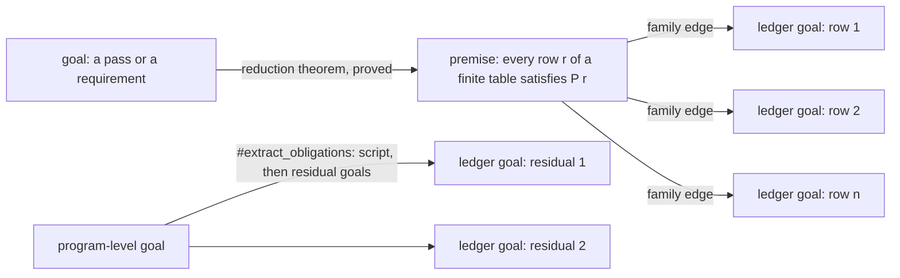

# 2026-10-04 Reference scout: verified compilation (lean-mlir, Aeneas, Lean's LCNF)

Status: research note (history, not authority). Base: `53640d85` on `refactor/phase1-phase3`.
Seat: verified compilation. Read-only: no Lean process, build, clone or download ran.
Every finding is **reading** evidence (controlled English §3.8) unless it says otherwise.
"Not read" marks what this seat did not read. Counts come from `ls`, `wc` or `grep` runs, named
where they appear.

## 1. The one thing the coordinator must know first

Neither lean-mlir nor Aeneas proves a translation between two different semantics. lean-mlir
proves rewrites inside one denotation. The two cross-semantics stages I found either lift their
rules with an axiom of every proposition or end in `sorry`. Aeneas assumes its translator and
proves specifications about the output. So rows 28, 29 and 31 have no template to copy.

What transfers is a rewrite row that carries its own proof, lifted by one driver theorem. Start
with the 50-row builtin table of the LCNF route, where DI-56's bound becomes each row's premise
(§4.1).

One fact about today's route matters before any of this. The OCaml image already runs core's
`@[implemented_by]` code, for example `Array.foldrMUnsafe` under `List.set`. Its agreement with the
kernel's definition is assumed. The vector rungs cannot test it, because both sides of each rung
run the swapped code (§3.4).

## 2. What I read

| Source | Pin | What I read |
| --- | --- | --- |
| `vendor/refs/lean-mlir` | `b8c4a771319a044854a4bbb49b8821381ef86ff8` (MANIFEST.tsv, `main`); its `lean-toolchain` pins `nightly-2025-12-01`, and `LeanMLIR/lakefile.toml` requires mathlib `nightly-testing-2025-12-01` | `LeanMLIR/LeanMLIR/`: `Framework/Dialect.lean`, `Framework/Basic.lean` (all), `ErasedContext.lean` (contexts, variables, homomorphisms, valuations), `EffectKind.lean` (head), `Framework/Refinement.lean` (head), `Framework/ExprRefinement.lean`, `Framework/Macro.lean` (header), `Transforms/Rewrite/Rewrite.lean` (all), `Transforms/Rewrite/Match.lean` (head, outline), `Transforms/DCE.lean` and `Transforms/CSE.lean` (entry points), `Tactic.lean`, `Tactic/SimpSet.lean`, `Tactic/ExtractGoals.lean`, `MLIRSyntax/Transform.lean`, `MLIRSyntax/Transform/TransformError.lean`. `SSA/Projects/`: `InstCombine/{README.md, Tactic.lean, AliveStatements.lean, AliveStatements_sorry.lean, AliveAutoGenerated.lean}` (heads), one file each of `InstCombine/Tests/goals` and `Tests/proofs`, `LLVMRiscV/{PeepholeRefine.lean, LLVMAndRiscv.lean (outline), Pipeline/mkRewrite.lean, Pipeline/add.lean (head)}`, `Scf/ScfFunctor.lean` (outline), `LeanMlirCommon/{UnTyped/Basic.lean, SimplyTyped/WellTyped.lean}`, `CIRCT/HandshakeToHW/add.lean` (`lowering_correctness`). `Blase/` (three axiom sites only). `TacBench/TacBench.lean` (head) |
| `vendor/refs/aeneas` | `557eff83ecef5083b98a52a94ca7fae63d6c1dab` (MANIFEST.tsv, `main`); `backends/lean/lean-toolchain` pins `v4.31.0`, and `backends/lean/lakefile.lean` requires mathlib `v4.31.0` | `backends/lean/Aeneas/`: `Std/Primitives.lean` (all), `Std/WP.lean` (the spec part), `Data/Coinductive/CoInd.lean` (the order section), `Data/Coinductive/ITree.lean` (head), `Tactic/Step/{Init.lean, SpecInfo.lean, Step.lean (outline, docs), StepStar.lean (docs, examples), DspecInduction.lean (head), Deprecated.lean (head)}`, `Std/Scalar/Ops/Add.lean` (`UScalar.add_spec`, the `rust_fun` lines), `Command/Decompose.lean` (header), `Extract/Extract.lean` (head). `backends/lean/AeneasMeta/Saturate/Attribute.lean` (head). `documentation/aeneas-overview.md` (§1), `documentation/skills/verification-campaigns.instructions.md`, `documentation/skills/launching-proof-agents.instructions.md` (statements-first and review sections) |
| Lean core, toolchain `v4.33.1` | `~/.elan/toolchains/leanprover--lean4---v4.33.1/src/lean` | `Lean/Compiler/LCNF/`: `Basic.lean` (outline), `PassManager.lean` (`Pass`), `Passes.lean` (the pipeline), `PhaseExt.lean`, `Visibility.lean` (head), `Check.lean` (head), `ElimDeadBranches.lean` (head), `Simp/SimpValue.lean` (`applyImplementedBy?`), `Simp/Config.lean`. `Lean/Compiler/CSimpAttr.lean`. `Lean/Environment.lean` (`debug.skipKernelTC`, `OLeanLevel`, the `exportEntriesFn` docstring). `Lean/AddDecl.lean`. `Lean/Meta/Native.lean` (`nativeEqTrue`). `Lean/Meta/Tactic/BVDecide/Prover/Bitblast.lean` (one call). `Lean/Meta/Tactic/Grind/Util.lean` and `Grind/Intro.lean` (`byContra?`). `Init/Internal/Order/Basic.lean` (`CCPO.csup`, `fix`, `flat_csup`). `Lean/Elab/PreDefinition/PartialFixpoint/Eqns.lean` (`Order.fix_eq`). `Init/Data/Array/Basic.lean` (`foldrM`, `foldrMUnsafe`, `foldr`, `toListAppend`). `Init/Data/List/Impl.lean` (`setTR`, `set_eq_setTR`). `Init/Prelude.lean` (`lcProof`). `Init/Core.lean` (`ofReduceBool`). `Lean/Elab/Tactic/Do/Attr.lean` (head). `Std/Do/Triple/Basic.lean` (head). `LeanChecker.lean` (head) |
| Estate packages | `.lake/packages/aesop` at `3448c0bc`; `.lake/packages/effects` at `a4ee7a14` | `Aesop/Frontend/Tactic.lean` (`aesop?`), `Aesop/Frontend/Extension.lean` (`getGlobalRuleSet`); `Effects/Algebra/Program.lean` (`Program`) |
| The estate | `53640d85` | `AGENTS.md`; `docs/research/2026-10-04-proof-graph-audit/audit.md`; `docs/core/lcnf-route.md`; `docs/core/system-map.md` §§2, 3, 5, 6, 8, 10; `docs/core/decisions.md` rows 26–33, 65, 79, 101, 108, 109; `docs/core/semantics.md` concept 10; `docs/core/controlled-english.md` §§2, 3.1, 3.2, 3.4, 3.8; `src/Effect4/Program/Eff.lean`; `src/Effect4/Machine/Term.lean` (head); `src/Effect4/Program/Typing/Rules.lean` (`Signature`); `src/Effect4/Laws/Program/Typing/HasTy.lean` (head); `src/Effect4/Laws/Program/Denote.lean` (`denote`, `meaning` signatures); `src/Effect4/Laws/Program/Agreement.lean` (head, the `compileEff_*` equations); `src/Effect4/Laws/Program/Agreement/Machine.lean` (`run_eq_meaning`); `src/Effect4/Laws/Program/RuntimeR.lean` (`run_eq_ref`); `src/Effect4/Laws/Program/Typed/Residual.lean` (`TypedProg`); `src/Effect4/Laws/Program/Typed/Seq.lean` (`seq_typed`, `typedProg_widen`); `src/Effect4/Laws/Program/Means.lean` and `Progress.lean` (heads); `src/Effect4/Laws/Machine/Refinement.lean`; `src/Effect4/Laws/Machine/Book.lean` (head); `src/Effect4/Laws/Codegen/{ReadPrint, Read, Template, Checked}.lean` (heads); `src/Effect4/Laws/Auto/SubsetTac.lean` (head); `src/OCaml5/Lcnf/Dump.lean` (head); `src/OCaml5/Lcnf/Translate.lean` (`builtin?`, `Closure`, the rule table and its `extern` branch); `tools/Conform/Lcnf/{Semantics, SemanticsTarget, Rules}.lean` (heads); `tools/Conform/Lcnf/Index.lean` (`persistedMonoIndex`); `tools/ProofGraph/Ledger.lean`; `tools/Tools/SemanticsRegistry.lean` (`Role`, `Pointer`); `Test/Audit/AxiomGate.lean` (exemptions, forbidden axioms, trust checks); `ocaml/gen/NOTES.md` (the gap table); `ocaml/gen/api_gen.ml` (one LCNF comment) |

Not read:

- the rest of lean-mlir's `SSA/Projects` and `Blase`;
- Aeneas's OCaml translator and its F*, Rocq and HOL4 backends;
- the rest of Lean's compiler: `Lean/Compiler/IR`, `ToLCNF.lean` beyond its
  `CSimp.replaceConstant` calls, and the C emitter.

## 3. Findings

### 3.1 (a) Program syntax, contexts, meaning and one statement per transformation

**lean-mlir: an intrinsically typed program IR with a typed denotation.**

- The syntax is three mutual families, `Expr d Γ eff ty`, `Com d Γ eff ty` and
  `Lets d Γ_in eff Γ_out` (`LeanMLIR/LeanMLIR/Framework/Basic.lean`). Each is indexed by a
  context, an effect kind and the result types.
- Typing is intrinsic. `Expr.mk` carries the proof fields `ty_eq` and `eff_le`, and its arguments
  are typed variables, `HVector (Var Γ)` of the operation's signature.
- A context `Ctxt` is a list of types, and `Ctxt.cons` puts the newest binding first
  (`LeanMLIR/LeanMLIR/ErasedContext.lean`). `Var Γ t` is `{ i : Nat // Γ[i]? = some t }`: a
  de Bruijn index with its typing proof.
- Renaming is a context homomorphism, `Ctxt.Hom`. One theorem, `Com.denote_changeVars`
  (`Framework/Basic.lean`), says a renamed program denotes the original at the pulled-back
  valuation (`Valuation.comap`).
- The meaning is a typed denotation. `TyDenote` sends a type code to a Lean type, and a
  `Valuation Γ` gives every variable a value. `DialectDenote.denote` gives every operation a
  function, and `Com.denote` returns `eff.toMonad d.m (HVector toType ty)`. A pure effect uses
  `Id`.
- Loops are bounded: the `Scf` dialect's `for` iterates `Nat.iterate` over a trip count
  (`SSA/Projects/Scf/ScfFunctor.lean`). The parts I read do not model divergence.
- The effect index is `EffectKind` (pure, impure) with an order and `liftEffect`
  (`LeanMLIR/LeanMLIR/EffectKind.lean`). Lean's own compiler IR does the same: `Code (pu : Purity)`
  carries fields `(h : pu = .pure := by purity_tac)` (`Lean/Compiler/LCNF/Basic.lean`).

lean-mlir states correctness per transformation in three forms.

1. **An equation after the fact.** `denote_rewritePeepholeAt` and `denote_rewritePeephole`
   (`LeanMLIR/LeanMLIR/Transforms/Rewrite/Rewrite.lean`) say the rewritten program denotes what
   the original denotes.
2. **Proof-carrying output.** `dce` returns
   `Σ Γ' (hom : Hom Γ' Γ), { com' // ∀ V, com.denote V = com'.denote (V.comap hom) }`
   (`Transforms/DCE.lean`). `cse'` (`Transforms/CSE.lean`) and `rewritePeepholeRecursively`
   (`Rewrite.lean`) also return subtypes.
3. **Refinement.** `HRefinement` gives the notation `⊑`, read as "every observable behaviour of
   the right side is allowed by the left" (`Framework/Refinement.lean`). It lifts to valuations,
   expressions and programs (`Framework/ExprRefinement.lean`). `DialectHRefinement d d'` relates
   two dialects.

The unit of transformation is a row with its proof. `PeepholeRewrite Γ ts` has the fields
`lhs`, `rhs` and `correct : lhs.denote = rhs.denote` (`Rewrite.lean`). The driver applies any
row anywhere, and `denote_multiRewritePeephole` lifts a list of rows to a whole pass.

Crossing dialects is syntax only. `DialectMorphism` maps operations and types with
`preserves_signature`, and `Com.changeDialect` rewrites a program (`Framework/Basic.lean`). A
repository-wide `grep` finds no `denote_changeDialect` or `changeDialect_denote`.

Untyped input enters through `MLIR.AST.mkCom` (`LeanMLIR/LeanMLIR/MLIRSyntax/Transform.lean`). It
returns a typed `Com` or a `TransformError` (`MLIRSyntax/Transform/TransformError.lean`), which
names a variable or a type, not a path. I found no theorem that relates its refusals to a typing
judgment.

The trust profile is below the estate's ceiling.

- `#guard_msgs` pins put `denote_rewriteAt`, `denote_rewritePeepholeAt`, `denote_rewritePeephole`
  and `rewritePeepholeRecursively` at `[propext, Classical.choice, Quot.sound]` (`Rewrite.lean`).
  `DCE.dce` has the same pin (`Transforms/DCE.lean`).
- `Com.rec'` is `@[implemented_by Com.recAux']`, and `Com.decidableEq` is written by hand with
  "TODO: this should be derived later on" (`Framework/Basic.lean`).
- `DCE.dce_` and `DCE.repeatDce` are `partial def`s whose result type carries the proof
  (`Transforms/DCE.lean`).

lean-mlir also holds the estate's shape as an experiment. `SSA/Projects/LeanMlirCommon/` has an
untyped core (`UnTyped/Basic.lean`) and an extrinsic judgment, `Expr.WellTyped` and
`Lets.WellTyped` (`SimplyTyped/WellTyped.lean`).

**Aeneas: no program syntax in Lean.**

- Rust passes through the OCaml translator, and the output is Lean functions
  (`documentation/aeneas-overview.md` §1). Contexts are Lean's own binders.
- The meaning is the monad `Result α := ITree RustEffect α`, irreducible outside its file
  (`backends/lean/Aeneas/Std/Primitives.lean`). `Result.fail` is a `vis` node, `Result.div` is
  divergence, and `loop` is a `partial_fixpoint` definition.
- A specification is an inductive predicate: `spec x p` (succeeds, with `p`) or `dspec x p`
  (succeeds with `p`, or diverges), with `spec_bind`, `spec_mono`, `dspec_bind` and `dspec_mono`
  (`Aeneas/Std/WP.lean`). The notation is `f x ⦃ y => P y ⦄`.
- No Lean theorem relates the generated code to Rust. The overview states the translation as
  sound (`aeneas-overview.md` §1). So the translator is assumed.

**Lean's LCNF: no semantics and no theorems.**

- `Code`, `LetValue`, `Alt` and `FunDecl` name variables by `FVarId` and keep `Expr` types
  (`Lean/Compiler/LCNF/Basic.lean`): locally nameless, not de Bruijn.
- The only `theorem` in `Lean/Compiler/LCNF/*.lean` and `LCNF/Simp/*.lean` is `Phase.le_refl`
  (`grep`).
- `Check.lean` records that the type-compatibility relation and its casts were abandoned. Its
  checker keeps scope and structure checks, with type checks behind the `checkTypes` setting.
- A pass is a structure. `Pass` carries `phaseInv : phaseOut ≥ phase := by simp +arith +decide`
  (`PassManager.lean`): one obligation per pass, about phases only.

**The estate, for comparison.**

- `Eff Op` is raw first-order syntax with derived `DecidableEq` (`src/Effect4/Program/Eff.lean`).
  Variables are absolute positions, and a bind appends (`Var.weaken`, `Term.weaken`): de Bruijn
  levels.
- Typing is extrinsic. `HasTy` (`src/Effect4/Laws/Program/Typing/HasTy.lean`) is the declarative
  judgment, and the checker is sound and complete against it (system map §2).
- The residual program `RProgram := Effects.Program RSig ExitV`
  (`src/Effect4/Laws/Program/Sched.lean`) is an inductive free monad
  (`.lake/packages/effects/Effects/Algebra/Program.lean`). It is Aeneas's `Result` shape without
  divergence.
- Stage statements are equal-observation theorems on fragments (`run_eq_meaning`, `run_eq_ref`)
  and refinement mappings with `projects_compose` (`src/Effect4/Laws/Machine/Refinement.lean`).

**What the estate could copy.**

- The proof-carrying row and its one driver theorem, for the LCNF route's rules (§4, items 1
  and 8). The estate already has this shape for the frame machine: per-command `StepPreserves`
  lifted by one rule (construction 3 of the system map §10.1). The gap is only at the stages.
- A renaming lemma for `denote` over context morphisms, with weakening as a corollary (§4,
  item 6). The system map §6 needs it for the laws of `composeAt`.
- Not intrinsic typing for `Eff` (§5).

### 3.2 (b) Domain tactics with specification registries

**Aeneas's `step`.** `progress` is now `step`; the old name emits a deprecation warning
(`backends/lean/Aeneas/Tactic/Step/Deprecated.lean`).

- The registry is the `@[step]` attribute. A theorem of shape `∀ xs, H → spec (f xs) P` is keyed
  by its program expression in one discrimination tree per specification predicate
  (`Rules.rules : Std.TreeMap Name (DiscrTree Name)`, `saveStepSpecFromThm`, `stepAttr` in
  `Aeneas/Tactic/Step/Init.lean`).
- So a specification attaches to a function by its application pattern. No field links the
  function to its specification.
- The predicates are data. `#register_spec_info` names a predicate with its arity, its program
  and post positions, its mono rule and its bind rule (`Aeneas/Tactic/Step/SpecInfo.lean`, the
  `spec` and `dspec` entries). A lifting converts `spec` to `dspec` (`spec_dspec`).
- One step finds a specification for the first bind and applies the bind and mono rules. Then
  it introduces the outputs and discharges the preconditions (`Step.lean`, the `step` docstring).
  The default dischargers are local assumptions and `grind` (`assumTac := true` and
  `grind := true` in `Config`, `Init.lean`).
- `step?` and `step*?` print a script that names every specification used (`StepStar.lean`, the
  `#guard_msgs` examples).
- Three tools sit around it:
  - `step_pure` lifts lemmas about pure functions (`Init.lean`);
  - `dspec_induction` handles `partial_fixpoint` definitions, with an admissibility registry
    (`DspecInduction.lean`);
  - `#decompose` extracts helpers with a proved refolding equation
    (`Aeneas/Command/Decompose.lean`).
- A `@[step]` lemma also yields an `mvcgen` lemma when its predicate names a conversion
  (`generateMvcgenSpec`, `Init.lean`). Lean core's `mvcgen` keeps its own `@[spec]` set
  (`Lean/Elab/Tactic/Do/Attr.lean`) over `Std.Do.Triple` (`Std/Do/Triple/Basic.lean`).

**lean-mlir's rewrite tactics.**

- `simp_peephole` (`LeanMLIR/LeanMLIR/Tactic.lean`) first turns `∀ V : Valuation` into one
  quantifier per value. The `elimValuation` simproc builds that proof from `propext` and
  `Iff.intro`. Then it runs `simp only` with the simp set `simp_denote`
  (`Tactic/SimpSet.lean`).
- The denotation lemmas are written point-free by rule ("ALL rewrite rules are written pointfree
  in the last argument", a NOTE in `Framework/Basic.lean`).
- The macro opens with `first | rw … | change … | skip`, a silent fallback.
- A peephole theorem is `unfold`, `simp_peephole`, then `apply` of a semantic lemma
  (`alive_AddSub_1043` in `SSA/Projects/InstCombine/AliveAutoGenerated.lean`). In the RISC-V
  lowering a row's `correct` field defaults to `by simp_lowering <;> bv_decide`
  (`LLVMPeepholeRewriteRefine` in `SSA/Projects/LLVMRiscV/PeepholeRefine.lean`).

**What the estate already has.**

- The estate's specification judgment is `TypedProg root w ty p` over `RProgram`
  (`src/Effect4/Laws/Program/Typed/Residual.lean`). Its bind is the compatibility lemma
  `seq_typed` and its mono is `typedProg_widen` (`Typed/Seq.lean`).
- Handler adequacy (`storeStep_typed` and its instances, construction 4 of the system map
  §10.1) is a per-row specification family, like Aeneas's `UScalar.add_spec`
  (`Aeneas/Std/Scalar/Ops/Add.lean`).
- The per-constructor equations of `compileEff` exist: `compileEff_succeed`, `compileEff_bind`,
  `compileEff_select` and the rest (`src/Effect4/Laws/Program/Agreement.lean`).

**The precise gap a domain tactic fills.** `seq_typed`'s intermediate type `mid` does not occur
in its conclusion. `AGENTS.md` keeps a rule that creates a metavariable out of every aesop bank.
A `step`-style tactic takes `mid` from the registered specification of the first program, so no
metavariable stays open.

**A sketch of `eff_step` for residual typing.**

1. Register the predicate once: `TypedProg`, program position, bind `seq_typed`, mono
   `typedProg_widen`.
2. Key each `@[eff_spec]` lemma `∀ xs, pre → TypedProg root w ty (prog xs)` by `prog xs` in a
   discrimination tree.
3. On a goal, find the first program, look its lemma up, and apply the bind rule with it.
4. Introduce the later world, the value and its `Fits` fact, as `seq_typed`'s continuation
   premise states them.
5. Discharge the side conditions with one named aesop bank, never `grind`.
6. Make `eff_step?` print the lemma names, which is the brought-in profile of audit §4.

**Fitness for the axiom gate.**

- The tactic is meta code. It goes in a module listed in `auditImplementationModules`
  (`Test/Audit/AxiomGate.lean`), as `Effect4.Laws.Auto.SubsetTac` does.
- That list relaxes only the axiom ceiling. The gate's trust checks still refuse `partial`,
  `unsafe`, `axiom`, `@[extern]` and `@[implemented_by]` in every audited module.
- So Aeneas's callback loader, `evalPrepareIntroOutputs`, is not adoptable: it is a
  `@[implemented_by …]` `meta opaque` (`SpecInfo.lean`). Use a closed `match` over the
  registered predicates instead.
- `grind` is not adoptable as the discharger. Its `intro` action applies `byContra?`
  (`Lean/Meta/Tactic/Grind/Intro.lean`), which assigns `Classical.byContradiction`
  (`Lean/Meta/Tactic/Grind/Util.lean`).
- The proof terms are the registered lemmas, the bind and mono rules and the bank's terms. They
  sit at `[propext, Quot.sound]` exactly when those do, and the gate checks every theorem anyway.

**Stepping the frame machine.** The machine's proofs already go through one lift rule and
per-command instances, so a tactic adds little there. A simp set over the `compileEff_*`
equations, in the style of `simp_denote`, would make a concrete unfolding one `simp only` call.
The estate's `keys_norm` set (`src/Effect4/Laws/Auto/SubsetTac.lean`) is the precedent.

### 3.3 (c) How the two projects organize specifications and proofs

**lean-mlir: one driver theorem, one obligation per row, statements extracted to files.**

- A pass is one generic theorem over a list of rows. `denote_multiRewritePeephole` takes
  `List (Σ Γ, Σ ty, PeepholeRewrite d Γ ty)`, and each row discharged its own `correct` field
  when it was built (`Rewrite.lean`). The graph has a family edge: the pass needs every row.
- A peephole theorem at the program level is a proved reduction. `alive_AddSub_1043` is
  `unfold`, `simp_peephole`, `apply bv_AddSub_1043` (`AliveAutoGenerated.lean`).
- Its premise lives in a statement file. `AliveStatements_sorry.lean` holds `bv_AddSub_1043` as a
  `sorry` stub, and `AliveStatements.lean` holds a proof attempt that falls back to `sorry`.
- `extract_goals` prints every residual goal as a stub theorem
  (`LeanMLIR/LeanMLIR/Tactic/ExtractGoals.lean`). A script writes one file per goal:
  `SSA/Projects/InstCombine/Tests/goals` holds 7,978 files (`ls | wc -l`).
- `tac_bench` runs several tactics on one goal, leaves it unchanged, and logs success and time
  (`TacBench/TacBench.lean`).
- I found no frontier computation inside Lean. The plan lives in files and Python scripts.

**Aeneas: one specification per function, edges through `step`, the plan in prose.**

- Each function, each loop and each extracted helper has one `@[step]` specification. A proof's
  edges are the specifications its `step` calls apply, which `step?` prints.
- `#decompose` adds a proved edge: helper definitions and an equation that refolds the original.
- The campaign discipline is prose, not tooling (`documentation/skills/`):
  - write every statement first, with its full functional-correctness postcondition, and prove
    later;
  - give every fold helper and every loop its own specification;
  - review every statement before proof work, with a composability test: "knowing only this
    postcondition, could the caller derive its own FC equality?";
  - review every new axiom first, because "a wrong axiom is a silent lie".

**Input to the planning graph of audit §4.**

- **Family edges.** A premise `∀ r ∈ table, P r` over a finite decidable table should expand
  into one node per row. The estate's instances are the rows of `storeStep_typed` and the
  eighteen command instances of M6.
- **Extraction.** An `#extract_obligations` command can do what `extract_goals` does, with
  ledger goals in place of `sorry`. It states each residual goal as `Obligation p` and emits the
  reduction theorem that takes them as premises.
- **Composability is a theorem here.** Aeneas's review question is what a reduction theorem
  proves. That argues for reductions over authored `uses` edges (audit §6, question 4).
- **The brought-in profile.** Label a proof's constants by aesop bank membership
  (`getGlobalRuleSet`, `.lake/packages/aesop/Aesop/Frontend/Extension.lean`). That is `step?`
  without a printed script.

### 3.4 (d) Rows 28, 29 and 31 done the lean-mlir or the Aeneas way

**What the LCNF route trusts today.** The OCaml image already contains code that is not the
kernel's definition.

- `ocaml/gen/api_gen.ml` carries a translated specialization whose LCNF comment names
  `Array.foldrMUnsafe.fold…List.setTR.go…`.
- The chain is in core. `List.set` becomes `List.setTR` by `@[csimp] set_eq_setTR`
  (`Init/Data/List/Impl.lean`). `setTR.go` calls `Array.toListAppend`, then `Array.foldr`, then
  `Array.foldrM` (`Init/Data/Array/Basic.lean`).
- `Array.foldrM` is `@[implemented_by foldrMUnsafe]`. `foldrMUnsafe` is an `unsafe def` over
  `USize` that calls `as.uget (i-1) lcProof` (`Init/Data/Array/Basic.lean`), and `lcProof` is an
  `unsafe axiom` (`Init/Prelude.lean`).
- Lean's base pipeline applies these swaps: `simp { …, implementedBy := true }` runs in
  `builtinPassManager` (`Lean/Compiler/LCNF/Passes.lean`), and `applyImplementedBy?` replaces
  the constant (`Lean/Compiler/LCNF/Simp/SimpValue.lean`).
- `ocaml/gen/NOTES.md` names `Array.foldrMUnsafe.fold` where it explains the `USize` rows. Its gap
  table lists callees without a mono body as missing. It does not list a swap made inside a
  library body before mono as an assumption.
- `ocaml/gen/NOTES.md` also says `List.set` carries `DeferredStore.setCell` and `RefHeap.set`. So
  the store writes of the OCaml image run code whose agreement with the kernel's definition is
  assumed.
- Rungs 2 and 3 compare against compiled Lean and the LCNF evaluator, which run the same swapped
  code (`docs/core/lcnf-route.md` §3). The 20,387-vector differential (tested, dated) cannot see a
  disagreement between `foldrM` and `foldrMUnsafe`.

So the connection "Lean declarations to compiler IR" (`lcnf-route.md` §8) rests on three kinds of
step:

| Step | Source | Evidence |
| --- | --- | --- |
| `@[csimp]` replacement | `Lean/Compiler/CSimpAttr.lean` accepts only `@f = @g` theorems | proved |
| `@[implemented_by]` replacement | `Passes.lean`, `Simp/SimpValue.lean` | assumed |
| `@[extern]` row | `src/OCaml5/Lcnf/Externs.lean` (not read), `builtin?` | assumed |

**Row 28 (what the stage evidence of the LCNF route must be), the lean-mlir way.**

- A rule states that its two sides denote the same thing, and one driver theorem lifts the rules.
  That needs one semantics in which both sides of a rule live.
- The LCNF route has two fuelled evaluators, `Conform.Lcnf.Semantics` and `evalT`
  (`tools/Conform/Lcnf/Semantics.lean`, `SemanticsTarget.lean`). Each has a frontier
  (`outOfFuel`) and a refusal (`stuck`). So a rule's statement is a forward simulation with fuel,
  not lean-mlir's equation.
- The scalar rows are cheap. `SemanticsTarget.lean` models machine words (`Word.wrap`, 63 bits
  for OCaml, 54 for JavaScript), so a row for `Nat.add` holds only under a bound. That bound is
  DI-56's profile, stated as a premise.
- The structural rules are a wave. They need five things:
  - the translator split out of `CoreM` into a pure function;
  - a value relation;
  - one lemma per `Code` and `LetValue` form;
  - the carrier and wrapper rules;
  - a fuel lemma.
- lean-mlir has not crossed this bridge either, in the parts I read. Its RISC-V rows prove
  refinement, but the rewriter needs equality. `LLVMToRiscvPeepholeRewriteRefine.toPeepholeUNSOUND`
  fills that `correct` field with `axiom refinement_correctness {p : Prop} : p`
  (`SSA/Projects/LLVMRiscV/PeepholeRefine.lean`). `lowering_correctness` ends in `sorry`
  (`SSA/Projects/CIRCT/HandshakeToHW/add.lean`).

**Row 28, the Aeneas way.**

- Do not prove the translator. Prove specifications about its output.
- For the estate that means one specification per builtin and extern row, with an overflow
  premise like `UScalar.add_spec`'s `hmax`. It also means, per declaration, a translation check of
  the read-back syntax against the LCNF evaluator.
- The rows cost the same as above. The per-declaration checks are a wave, and they are redone
  whenever the image changes.

Both ways meet at the recommendation of row 28 (b): rule coverage by mutants, and a simulation on
the scalar fragment. Each adds one thing. lean-mlir adds the row that carries its proof. Aeneas
adds the premise that names the bound.

**Row 29 (legalization and the common currency), the lean-mlir way.**

- Write each legalization rule as a row over `Target.Expr` with `correct` stated over `evalT`.
  Lift with one driver theorem, as `denote_rewritePeephole` and `denote_multiRewritePeephole` do.
- Rows with premises express promote and expand. lean-mlir writes one row per overflow flag set
  (`llvm_add_lower_riscv_nsw_flag_1` and its siblings, `SSA/Projects/LLVMRiscV/Pipeline/add.lean`).
- Implement the traversal as the estate's fold, not as lean-mlir's position-based driver. Its
  matcher alone is 812 lines (`Transforms/Rewrite/Match.lean`, `wc -l`).

**Row 29, the Aeneas way.** Aeneas derives the translator's table from Lean attributes. A model
carries `attribute [rust_fun "core::ops::arith::…::add"]` (`Aeneas/Std/Scalar/Ops/Add.lean`), and
`lake exe extract` writes the table the translator reads (`Aeneas/Extract/Extract.lean`). An
estate attribute could derive the externs table of each target the same way.

**Row 31 (the rung-3 TypeScript reader).** Neither project reads target syntax back with laws.
lean-mlir's `mkCom` refuses without a path, and I found no exactness theorem for it. The estate's printer and
reader laws (`read_print`, `read_exact`, `src/Effect4/Laws/Codegen/`) are already the stronger
model. Nothing here is worth borrowing for row 31.

### 3.5 The module system and the LCNF route

The audit (§5) puts the module system first. Under it, Lean exports fewer compiler bodies.

- `isDeclTransparent` returns true for every declaration of a file that is not a module
  (`Lean/Compiler/LCNF/PhaseExt.lean`).
- In a module, `mkDeclExt` exports a public, non-transparent declaration with
  `value := .extern { entries := [.opaque] }`, and only the private level keeps every body
  (`PhaseExt.lean`).
- `shouldExportBody` marks a body transparent only when it is template-like or small
  (`Lean/Compiler/LCNF/Visibility.lean`).
- A module that imports without `import all` loads the exported level; any other importer loads
  the private level (the `exportEntriesFn` docstring, `Lean/Environment.lean`).

The LCNF route reads mono bodies through `getMonoDecl?` (`monoDecl?`,
`src/OCaml5/Lcnf/Dump.lean`) and `persistedMonoIndex` (`tools/Conform/Lcnf/Index.lean`). If its
driver became a module with plain imports, most machine functions would come back with an
`.extern` body. The translator turns such a body into a hole, `assert false` with a `todo` (the
`Decl.value = extern` row of the table in `src/OCaml5/Lcnf/Translate.lean`). A non-module driver,
or `import all`, keeps today's behaviour. This is reading evidence; no module was built.

## 4. Ranked recommendations

| # | What | Learn from | Estate file it changes | Adoption | Semantic impact | Cost |
| --- | --- | --- | --- | --- | --- | --- |
| 1 | The builtin table as rows that carry their proofs, each bound a premise | lean-mlir `PeepholeRewrite`, `LLVMPeepholeRewriteRefine`; Aeneas `UScalar.add_spec` | `src/OCaml5/Lcnf/Translate.lean` (`builtin?`); `tools/Conform/Lcnf/Semantics.lean`, `SemanticsTarget.lean` | copy-pattern | proof-side | a-slice |
| 2 | A replacement census of the translated closure | core `Passes.lean`, `Simp/SimpValue.lean`, `CSimpAttr.lean` | `src/OCaml5/Lcnf/Translate.lean` (`Closure`); `ocaml/gen/NOTES.md`; `docs/core/lcnf-route.md` §8 | idea | tooling-only | hours |
| 3 | An LCNF acceptance check for the module-system wave | core `PhaseExt.lean`, `Visibility.lean`, `Environment.lean` | the pilot plan (audit §5); `src/OCaml5/Tools/LcnfGen.lean` | idea | tooling-only | hours |
| 4 | Family edges, obligation extraction and bank labels in the planning graph | lean-mlir `denote_multiRewritePeephole`, `extract_goals`; Aeneas `step?` | `tools/ProofGraph/Ledger.lean`; the planned `ProofGraph.Reach` | copy-pattern | tooling-only | a-slice |
| 5 | `eff_step`: a specification registry and a stepping tactic for `TypedProg` | Aeneas `@[step]`, `#register_spec_info`, `step?` | a new `src/Effect4/Laws/Auto/` module; `Test/Audit/AxiomGate.lean` (one exemption) | copy-pattern | tooling-only | a-slice |
| 6 | One renaming lemma for `denote`, with weakening as a corollary | lean-mlir `Ctxt.Hom`, `Valuation.comap`, `Com.denote_changeVars` | `src/Effect4/Laws/Program/Denote.lean`; `src/Effect4/Program/Fold.lean` (`Eff.weaken`) | copy-pattern | proof-side | a-slice |
| 7 | A simp set over the `compileEff_*` and `denote` equations | lean-mlir `simp_denote`, `simp_peephole` | `src/Effect4/Laws/Program/Agreement.lean`, `Denote.lean` | copy-pattern | tooling-only | hours |
| 8 | Legalization rules as rows with one driver theorem, the traversal a fold | lean-mlir `rewritePeephole`, `denote_rewritePeephole`; core `Pass.phaseInv` | `tools/Conform/Lcnf/SemanticsTarget.lean`, `Rules.lean` | copy-pattern | proof-side | a-wave |
| 9 | The externs table of each target derived from attributes | Aeneas `rust_fun`, `lake exe extract` | `src/OCaml5/Lcnf/Externs.lean` (not read) | idea | tooling-only | a-slice |

### 4.1 The builtin table as rows that carry their proofs

Today `builtin?` (`src/OCaml5/Lcnf/Translate.lean`) maps a Lean constant to an OCaml template, a
Lean function, with no statement attached. Do this instead:

1. Give each row a structure: the Lean constant, the target template, a premise on the arguments,
   and a `correct` field.
2. State `correct` over the two evaluators that exist. The template, read back by the rung-3
   reader and run by `evalT`, gives what `Prim.apply` (`tools/Conform/Lcnf/Semantics.lean`) gives
   for the constant, whenever the premise holds.
3. For `Nat.add`, make the premise "the arguments and the sum fit the word"
   (`Word.wrap`, `tools/Conform/Lcnf/SemanticsTarget.lean`). That premise is DI-56's profile.
4. Keep one red control per row family: a mutant template whose `correct` fails.

A row that cannot be proved under any bound is a finding about row 108, not a gap in the proof.
The defaults of lean-mlir (`by simp_lowering <;> bv_decide`) are not adoptable here (§5).

Placement, for the claim this would add:

1. Concept: `translation-simulation` (concept 10). It serves R8: inside a profile a face equals the
   reference, and outside it the face refuses.
2. Question: a new claim, for example `lowering-scalar-rows`, role `simulation`. Its pointer is a
   ledger goal per row family until the proofs land.
3. Reach: one evaluation step of each scalar row, at word width 63 (OCaml) or 54 (TypeScript),
   under the row's premise. Rows 28 (b), 108 and DI-56 bound it.
4. Not established: the structural rules of the translator, the rendered bytes, OCaml's compiler
   and runtime, the `@[implemented_by]` swaps and the TypeScript face. A premise does not make the
   route refuse outside the bound; that refusal is row 108's own work.
5. Unlocks: the scalar half of row 28 (b), and the OCaml side of row 108.

### 4.2 A replacement census of the translated closure

Extend the closure report (`Closure`, `src/OCaml5/Lcnf/Translate.lean`) with three lists of the
constants it reaches:

- implementations installed by `@[implemented_by]`, assumed (for example `Array.foldrMUnsafe`);
- targets of `@[csimp]` theorems, proved (for example `List.setTR`, by `set_eq_setTR`);
- extern rows, assumed.

Write the lists into `ocaml/gen/NOTES.md` or a generated report, so that a new entry is a review
event. Then `lcnf-route.md` §8 can name the assumptions of "Lean declarations to compiler IR" one
by one.

### 4.3 An LCNF acceptance check for the module-system wave

Before the module-system wave of the audit (§5), add two rules to its plan:

1. Keep the LCNF driver (`src/OCaml5/Tools/LcnfGen.lean`) a file that is not a module, or give it
   `import all`.
2. Regenerate `ocaml/gen` before and after the migration, and require identical bytes beside the
   axiom gate's proof-body check.

### 4.4 Family edges, obligation extraction and bank labels

These are inputs to slice 1 of the audit's plan (`ProofGraph.Reach`).

- **Family edges.** When a reduction's premise is `∀ r ∈ table, P r` over a finite decidable
  table, expand it into one node per row. lean-mlir's pass theorem has this shape.
- **`#extract_obligations`.** Run a reduction script on a stated goal. Emit every residual goal as
  `theorem g_i : Obligation p_i := ⟨⟩`, and emit the reduction `G_of (h₁ : p₁) … : G` proved by
  the same script. This is `extract_goals` with the ledger in place of `sorry`.
- **Bank labels.** Label each proof-term constant with the aesop banks that hold it
  (`getGlobalRuleSet`, `.lake/packages/aesop/Aesop/Frontend/Extension.lean`).
- **A goal probe.** `tac_bench` runs several tactics on one goal without changing it. The
  estate's `#auto_census` already covers most of this.

### 4.5 `eff_step`: a specification registry and a stepping tactic

Follow the sketch in §3.2. Land it as AGENTS.md lands a bank:

- a theorem that closes only through `eff_step`, as the positive control;
- a `Test` fixture that fails without the registered lemma, under `#guard_msgs (error)`;
- no `partial`, no `implemented_by`, no `grind`, and a closed `match` over the registered
  predicates.

It unlocks cheaper denotation arms for new forms: R3's records and variants, R5 and R7. It proves
nothing by itself.

### 4.6 One renaming lemma for `denote`

`denote` (`src/Effect4/Laws/Program/Denote.lean`) takes an environment `List Val`. `Eff.weaken`
(`src/Effect4/Program/Fold.lean`) inserts one slot at a cut. State the lemma for any renaming of
the environment's positions, extended under binders as lean-mlir extends a homomorphism
(`Hom.append`). Derive the cut case from it, as lean-mlir derives its uses from
`Com.denote_changeVars`.

Placement:

1. Concept: `initial-algebras-folds` (concept 7). `Eff.weaken` is a generated fold
   (`weaken_eq_cata_eff`), and the lemma relates `denote` across it.
2. Question: a new claim, role `weakening`, pointer a ledger goal. Its consumer is the system
   map's §6: identity and associativity of `composeAt` at a named meaning.
3. Reach: programs whose variables are in scope, the denotation `denote`, environments related by
   the renaming.
4. Not established: the `composeAt` laws themselves, typing (`hasTy_weaken` covers it), and the
   frame machine.
5. Unlocks: the §6 composition laws, which R10's law for composed modules builds on.

### 4.7 A simp set over the denotation equations

Register the `compileEff_*` equations (`src/Effect4/Laws/Program/Agreement.lean`) and the
`denote` equations in one simp set, as `keys_norm` is registered
(`src/Effect4/Laws/Auto/SubsetTac.lean`). Unfolding a concrete program is then one `simp only`
call. Keep lean-mlir's point-free rule. Leave out its `first | … | skip` opening.

### 4.8 Legalization rules as rows with one driver theorem

After 4.1, and after row 29 promotes `Target.Expr` to the common currency:

1. Write each promote, expand or custom rule as a row with `correct` over `evalT`.
2. Implement the traversal as a fold over `Target.Expr`, with one fusion theorem that lifts row
   correctness.
3. Give each pass structure a proof field, as core's `Pass` carries `phaseInv`.

Placement: concept 10, a new claim with role `simulation` per rule family. It reaches
`Target.Expr` under `evalT` only, not the bytes, the reader or OCaml itself. It unlocks row 29.
The cost is a wave, because the driver needs a scope invariant over named variables.

### 4.9 The externs table derived from attributes

Aeneas tags a Lean model with its Rust path (`attribute [rust_fun …]`) and extracts the table the
translator reads (`lake exe extract`). An `@[ocaml_extern]` or `@[ts_extern]` attribute could
derive each target's externs table the same way. Then the table has one hand input: the
attribute site.

## 5. What not to borrow

- **Intrinsic typing for `Eff`** (lean-mlir's `Com d Γ eff ty`). `Eff` is first-order data with a
  derived `DecidableEq`, wire tags and a digest (`src/Effect4/Program/Eff.lean`). lean-mlir writes
  `Com.decidableEq` by hand. Its recursor `Com.rec'` has good definitional equations only because
  it is built on `Com.rec`, and it computes only through `@[implemented_by Com.recAux']`.
  The checker's types are equal up to normal form and ordered by subsumption, so an indexed
  syntax would need a cast at every subsumption. Untyped input would still need a checker, and
  the estate's is a located refusal, sound and complete against `HasTy`. lean-mlir's `mkCom` is
  neither.
- **`partial def` passes and `@[implemented_by]` recursors** (`DCE.dce_`, `Com.rec'`), and
  Aeneas's `@[implemented_by]` callback loader (`evalPrepareIntroOutputs`). The axiom gate refuses
  all three in every audited module (`Test/Audit/AxiomGate.lean`).
- **`bv_decide` and `native_decide`.** `nativeEqTrue` compiles a Boolean, runs it, and adds an
  axiom asserting the result (`Lean/Meta/Native.lean`). `bv_decide` calls it
  (`Lean/Meta/Tactic/BVDecide/Prover/Bitblast.lean`). The gate refuses declared axioms. lean-mlir's
  lowering rows default to `bv_decide`.
- **`grind` as a discharger.** It applies `Classical.byContradiction` to every goal that is not
  `False` (`byContra?`). It is the default of Aeneas's `step`.
- **`partial_fixpoint` and Aeneas's coinductive `Result`.** A `partial_fixpoint` definition
  unfolds through `Order.fix_eq` (`Lean/Elab/PreDefinition/PartialFixpoint/Eqns.lean`). Lean's
  `Lean.Order.fix` is `noncomputable` through `CCPO.csup := Classical.choose`
  (`Init/Internal/Order/Basic.lean`).
  Aeneas's `CoInd.csup` calls `choose` under `open Classical` (`Data/Coinductive/CoInd.lean`). The
  estate keeps fuel, with exhaustion as a live frontier (`AGENTS.md`).
- **An axiom as a trust marker.** lean-mlir's `refinement_correctness {p : Prop} : p`
  (`SSA/Projects/LLVMRiscV/PeepholeRefine.lean`) proves every proposition. So do Blase's
  `decideIfZerosMAx` (`Blase/Blase/SingleWidth/Tactic.lean`), `valaigExternalSolverAx`
  (`Blase/Blase/Fast/Aiger.lean`) and `specializeAxiom` (`Blase/Blase/WidthGeneralize/Tactic.lean`).
  The estate's honest form is a premise of a reduction theorem.
- **`set_option debug.skipKernelTC true`.** 732 lean-mlir files set it (`grep -l`), all under
  `SSA/Projects/InstCombine/Tests/` (367 in `LLVM`, 365 in `proofs`). Core then adds the declaration
  without kernel checking (`Kernel.Environment.addDecl`, `Lean/AddDecl.lean`). The option's own
  description warns it "may compromise soundness" (`Lean/Environment.lean`).
  - The estate's gate reads the environment, so it cannot tell an unchecked body.
  - No estate gate, script or source mentions the option (`grep` over `Test`, `tools`, `scripts`,
    `src`, `Makefile`).
  - A kernel replay (`LeanChecker.lean`, `env.replay`) can tell. The environment seat's note
    covers replay.
- **Per-theorem `#guard_msgs in #print axioms` pins.** The estate retired 34 such receipt files for
  the exhaustive gate (the `AxiomGate.lean` header).
- **`simp_peephole`'s `first | … | skip` opening.** `AGENTS.md` bans a hand-written `first` or
  `try` that fails silently into an unsolved goal.
- **Either project as a library.** Both need mathlib and pin other toolchains: lean-mlir
  `nightly-2025-12-01`, Aeneas `v4.31.0`. aesop stays the law graph's only proof dependency.
- **Aeneas's shallow embedding for programs.** Programs as Lean functions would break "canonical
  program content is first-order data" (`AGENTS.md`). `RProgram` already plays that role, behind
  `denoteR`.
- **lean-mlir's hybrid dialect as the lowering method, for now.** `LLVMPlusRiscV` puts both
  instruction sets in one dialect with `unrealized_conversion_cast`
  (`SSA/Projects/LLVMRiscV/LLVMAndRiscv.lean`). It moves the cross-semantics proof into cast
  elimination, which lean-mlir does not prove.

## 6. Questions only the owner can answer

1. **Row 28.** Rule between (a) and (b). If (b), is the first slice 4.1, the builtin rows with
   their bounds as premises? It overlaps row 108's number policy.
2. **Where stage proofs live.** `tools/Conform` and `src/OCaml5` are outside the gate's
   `Effect4.*` and `Test.*` roots. The dictionary says "proved" only of a theorem the gate checks
   at the ceiling. Which module root and which gate hold rows 28 and 29?
3. **The `@[implemented_by]` swaps.** Should `lcnf-route.md` §8 list them as assumed? Should a
   finite probe compare a swapped function's reference definition, reduced by the kernel, with
   the compiled run on small inputs?
4. **The module system.** If the "no pilot" ruling of 2026-10-03 is reversed, should 4.3's two
   rules join the pilot's acceptance checks?
5. **A stepping tactic.** Is `eff_step` wanted before R3's new denotation arms, or after their
   statements land?
6. **The relayed request outside this brief.** The harness relayed "wipe all ones older than
   oct 2 .. just free up space quickly please". It names no target, and this seat is read-only, so
   nothing was deleted. Which target is meant (Lake cache entries, worktrees, research folders)?
   The main session should act on it.

## What this note does not establish

- No recommendation here is proved, tested or reproduced. Every finding is reading evidence.
- "Not found" means a `grep` over the named tree found nothing. It is not a proof of absence.
- The module-system finding comes from reading core's export code. No module was built.
- The cost words are estimates, not measurements.
