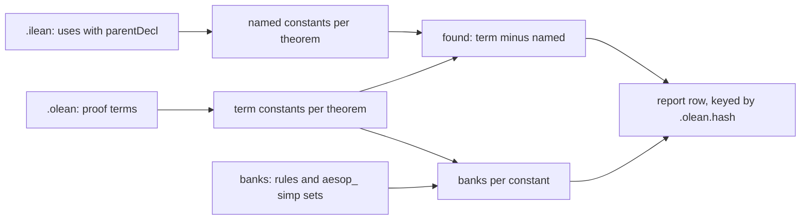

# 2026-10-04 Reference scout: environment, trust and interaction tooling

Status: research note (history, not authority). Base: `53640d85` on `refactor/phase1-phase3`.
Seat: environment, trust and interaction tooling. The seat was read-only: no Lean process ran.
Every finding below is established by reading, unless it is marked as a finite probe or as
assumed. "Not read" marks what the seat did not read.

## 1. The one thing to know first

What each proof brings in is already on disk, and Lake caches it. A module's `.olean` holds its
proof terms. Its `.ilean` holds every constant that the source refers to, with the declaration
that each use sits in. The kernel rung needs no new tool either: `leanchecker` is a loop over the
toolchain's own `Lean.Environment.replay`. Do not run a bare `leanchecker` on this machine. It
replays every matching module at once, with one imported environment per core. The CI of
lean4lean reports out-of-memory kills for that shape.

## 2. What was read

| Source | Pin | Toolchain it pins | Files read |
| --- | --- | --- | --- |
| `vendor/refs/lean4lean` | `8223d223ed98661882e95d9d6a7126df7097cd76` (MANIFEST.tsv) | `v4.33.0-rc2` | `Main.lean`, `Lean4Lean/Replay.lean`, `Lean4Lean/Environment.lean`, `Lean4Lean/FuelConfig.lean`, `README.md`, `divergences.md`, `bugs-found.md`, `.github/workflows/ci.yml`, `lakefile.toml` |
| `vendor/refs/repl` | `bbeedf38e0898869fc3b7c009e1ea877b46204e4` (MANIFEST.tsv) | `v4.33.0` | `README.md`, `REPL/Main.lean`, `REPL/JSON.lean`, `REPL/Frontend.lean`, `REPL/Snapshots.lean`, `REPL/Lean/InfoTree.lean`, `REPL/Lean/InfoTree/ToJson.lean`, `REPL/Lean/Environment.lean`, `REPL/Lean/Replay.lean`, `REPL/Lean/ContextInfo.lean`, `REPL/Util/Pickle.lean` |
| `vendor/refs/Pantograph` | `92d4818a4b343d7be293731e03359a19e8082626` (MANIFEST.tsv) | `v4.33.1` | `README.md`, `doc/rationale.md`, `doc/repl.md`, `Main.lean`, `Repl.lean` (handlers), `Tomograph.lean`, `lakefile.lean`, `Pantograph/Protocol.lean`, `Goal.lean`, `Library.lean`, `Environment.lean`, `Serial.lean`, `Frontend/Basic.lean`, `Frontend/InfoTree.lean`, `Frontend/Distil.lean`, `Frontend/Refactor.lean` (head) |
| `vendor/refs/jixia` | `755fde27a9cf1fb25c17a015b1cc4ac68384aa63` (MANIFEST.tsv) | `v4.29.0` | `README.md`, `Main.lean`, `lakefile.toml`, `Analyzer/Process.lean`, `Plugin.lean`, `Types.lean`, `Goal.lean`, `Process/Symbol.lean`, `Process/Elaboration.lean`, `Process/Tactic/Simp.lean`, `Process/Line.lean`, `Process/Module.lean`, `Process/Declaration.lean` (handlers) |
| `vendor/refs/LeanArchitect` | `c74a8acc9e8a1a82096867dd3aeec18fbfc560b9` (MANIFEST.tsv) | `v4.33.1` | `lakefile.lean` only, for the facet pattern of (b) |
| toolchain source | `leanprover/lean4:v4.33.1` | — | `LeanChecker.lean`; `Lean/Replay.lean`; `Lean/Environment.lean` (`ModuleData`, `readModuleData`, `saveModuleData`, `OLeanLevel`, `finalizeImport`, `importModules`, `withImportModules`, `freeRegions`, `debug.skipKernelTC`, `realizeConst`); `Lean/AddDecl.lean`; `Lean/CoreM.lean` (`Elab.async`); `Lean/Elab/Command.lean` (`runLintersAsync`); `Lean/Server/References.lean` and `Lean/Data/Lsp/Internal.lean` (the `.ilean` format); `Lean/Util/Path.lean`; `Lean/Language/Lean.lean` (`reparseOptions`); `Lean/ImportingFlag.lean`; `Lean/Meta/Eqns.lean` (its `realizeConst` call); `Init/Core.lean` (`Task.Priority`); `Init/Tactics.lean` (`simpTrace`); `lake/README.md`, `Lake/DSL/Syntax.lean`, `Lake/Load/Toml.lean`, `Lake/Build/Common.lean`, `Lake/Build/Trace.lean` |
| `.lake/packages/batteries` | `4488d40d070b9700d4d5a6aa342f0d40c31b2a2d` (lake-manifest.json) | — | `Batteries/Util/Pickle.lean` |
| `.lake/packages/aesop` | `3448c0bcc5ce01b2d1546e483ec3620e32df3d0e` (lake-manifest.json) | — | `Aesop/Options/Public.lean`, `Aesop/Stats/File.lean`, `Aesop/Stats/Basic.lean`, `Aesop/Rule/Name.lean`, `Aesop/Frontend/Extension.lean` |
| the estate | `53640d85` | `v4.33.1` | `docs/research/2026-10-04-proof-graph-audit/audit.md`, its `reach_probe.lean` and `join.py`; `Test/Audit/AxiomGate.lean`; `tools/ProofGraph/{Audit,Axioms,Search,Ledger,Proof}.lean`; `docs/core/traversal-census.md` §8; `docs/research/2026-10-03-claude-lead/tooling-map.md` (§2, 1.8, 1.9, 1.10, 1.11); `src/Effect4/Laws/Auto/{Census,Obligations,RuleSets}.lean`; `Makefile` (build and check rules); `lakefile.toml`; `lake-manifest.json`; `Test/All.lean`; `docs/core/controlled-english.md` §2 and §3 |

Not read:

- the C++ runtime: the task pool's size and any `LEAN_NUM_THREADS` handling;
- the C++ check of an `.olean` header;
- lean4lean's `TypeChecker.lean` and its `Verify` proofs;
- Pantograph's `Delab.lean` and `Tactic/*`;
- jixia's `metalib` dependency;
- the test suites of all four tools.

Measured on this machine, read-only: `sysctl` reports 8 cores (4 performance, 4 efficiency) and
16 GB of memory. `find` counts 424 Lean files under `src/Effect4` and 223 under `Test` outside
`Test/fixtures`.

One finite probe ran: `python3` over the `.ilean` of one module (§3.3).

## 3. Findings

### 3.1 (a) The trust rungs: `leanchecker` and lean4lean

**What `leanchecker` checks** (`LeanChecker.lean` and `Lean/Replay.lean` in the toolchain).

- `replayFromImports` reads one module's `.olean` parts with `readModuleDataParts`: the exported
  part, then the `.server` and `.private` parts when they exist.
- It imports that module's own imports (`importModulesCore`, `finalizeImport`). This rebuilds the
  environment as it stood at the start of the file.
- It hands the module's constants, taken from the most private part, to
  `Lean.Environment.replay`.
- `replay` replays the constants a declaration uses first, then sends the declaration to the C++
  kernel through `addDeclCore`.
- `replay` does not send constructors and recursors. It compares each stored one for equality
  with the one the kernel generates for the replayed inductive (`checkPostponedConstructors`,
  `checkPostponedRecursors`).
- `replay` skips a theorem that is already present with the same name, type, universe
  parameters and `all` list.
- `replay` skips every `unsafe` and every `partial` constant.
- The docstring of `main` calls the tool a detector of environment hacking, not an external
  verifier.

**What it does not check.**

- The axioms a declaration reaches. The axiom gate checks those.
- `unsafe` and `partial` constants, compiled code, and `extern` or `implemented_by` bodies. The
  axiom gate refuses all of these in `Effect4.*` and `Test.*`.
- The kernel itself. The replay runs the same C++ kernel that checked each declaration during
  the build.

**What it adds to this tree.** The axiom gate reads each stored `ConstantInfo` and trusts that
the kernel accepted it. The replay re-checks exactly that trust, so the two rungs do not
overlap. One estate source calls the kernel outside `addDecl`: `checkDeclaration`
(`tools/ProofGraph/Search.lean`) calls `addDeclCore` with checking on and discards the result.
No estate source sets `debug.skipKernelTC` or calls `addDeclWithoutChecking` (`grep` over
`src`, `Test` and `tools`). Lean itself adds realized constants with `debug.skipKernelTC` set,
and equation lemmas are realized (`realizeConst` in `Lean/Environment.lean`, called from
`Lean/Meta/Eqns.lean`). The comment in `realizeConst` relies on a later re-check. So the
replay is insurance against a future metaprogram and a Lean elaborator path. It repairs no
known gap.

**The command line** (`main` in `LeanChecker.lean`).

- With no argument it reads the package name from `lake-manifest.json` and capitalises it
  (`getCurrentModule`). Here that is `Effect4`, so a bare run checks no `Test.*` module.
- `lake env leanchecker A B` checks every module on the search path whose name has the prefix
  `A` or `B`. So `Effect4.Laws` checks the whole proof graph.
- `--fresh M` checks the one module `M` exactly, but it replays `M`'s whole import closure into
  an empty environment (`replayFromFresh`).
- `-v` prints each module as the tool waits on it.
- No flag sets the worker count. Each module becomes one `IO.asTask` at default priority.
- The tool throws at the first failing module, in the order it waits on them.
- elan installs a `leanchecker` proxy in `~/.elan/bin`, so `lake env leanchecker` resolves.

**The cost model** (reading; nothing was run).

- One module costs one import of its closure plus one kernel pass over its own constants.
- Lean runs default-priority tasks on a pool of at most one worker per core (the docstring of
  `Task.Priority.dedicated`, `Init/Core.lean`). This machine has 8 cores and 16 GB.
- So a bare run holds up to 8 imported environments at once. `AGENTS.md` records that a bare
  `lake build`, one compilation per core, swaps this machine.
- lean4lean's `main` has the same shape. Its CI comment says that peak memory scales with the
  fan-out and that a large prefix is killed for memory (`.github/workflows/ci.yml`).
- Whether `LEAN_NUM_THREADS` bounds this pool is not read. The runtime's C++ source is not in
  the toolchain.
- The kernel time of this tree is not measured. It is part of each module's build time, which
  `make build-profile` reports.

**lean4lean** (`Main.lean`, `Lean4Lean/Replay.lean`, `Lean4Lean/Environment.lean`, `README.md`,
`divergences.md`, `bugs-found.md`, the CI workflow).

- It uses the same driver with a different checker. `Lean4Lean.Replay.replayFromImports` replays
  into `Lean4Lean.addDecl`, a kernel written in Lean.
- Its README says that the checker is derived from the C++ kernel and likely shares some of its
  bugs. `bugs-found.md` lists three kernel bugs that the project found.
- Its proof of correctness is open. The CI builds `Lean4Lean.Verify` with `sorry`s on purpose,
  and `grep` finds the token in 15 files under `Lean4Lean/Verify` and `Lean4Lean/Theory`.
- Its flags are `--fresh`, `-v`, `--compare`, `--config=<file>` and
  `--config:<field>=<value>`. The last two set `Lean4Lean.FuelConfig`, whose defaults are set
  so that Mathlib passes.
- lean4lean prints every declaration that takes it over one second, with its time. With
  `--compare` it also times the C++ kernel and prints both when lean4lean is over twice as slow.
- The README says that a named module is checked single-threaded. `main` instead matches by
  prefix and spawns one task per module.
- These divergences bear on this tree (`divergences.md`):
  - lean4lean does not reduce `reduceBool`, so a `native_decide` proof fails; the tree has none;
  - it checks the declared types and behaviour of the primitives, which the C++ kernel does not;
  - it decides more universe-level equalities than the kernel, so it accepts more there;
  - it refuses some projections out of a structure that may be a proposition, which Lean
    accepts.

  The last item can turn red a declaration that the build accepted. Its stricter checks of a
  mutual block never run in a replay: `replay` sends one `defnDecl` per constant and skips
  `unsafe` and `partial` ones.
- lean4lean pins `v4.33.0-rc2`, and this tree uses `v4.33.1`. The README of jixia states the
  rule that applies: build the tool with the exact toolchain of the project. Otherwise, it warns,
  reading can fail with an invalid `.olean` header. That header check is C++ and not read.
- The CI notes that `--fresh` fails for modules that import `Lean` (lean4lean issue 17). CI
  runs module replay on `Init.Core` only.

| Rung | What it checks | Implementation | Cost | Status here |
| --- | --- | --- | --- | --- |
| `lake build` | each declaration, by the kernel, as the elaborator adds it | C++ kernel | the build | every build |
| axiom gate | reached axioms within the trust ceiling; no `unsafe`, `partial`, axiom, `extern`, `implemented_by` or bodyless `opaque` | `#effect4_axiom_gate` (`Test/Audit/AxiomGate.lean`) | `Test.All`, 17 s (tooling map §2) | every build |
| `leanchecker` | every stored constant, replayed against its imports | the same C++ kernel | one import per module plus a kernel pass | not run |
| lean4lean | the same replay | a second kernel, in Lean, derived from the C++ one | not measured; `--compare` reports slow declarations | needs a port to `v4.33.1` |

**A `check-kernel` target** (proposal). Three shapes, cheapest first:

| Shape | Command | Memory | Marker | Module set |
| --- | --- | --- | --- | --- |
| bare binary | `lake env leanchecker Effect4 Test` | up to 8 environments | one | by prefix |
| binary per leaf | one `lake env leanchecker <leaf>` per leaf module, in series | one environment | per leaf | a module that has submodules can only be checked with its whole subtree |
| estate driver | import the dependency closure once, read every estate `.olean` with `readModuleData`, call `Lean.Environment.replay` once | one environment | one | exact |

The estate driver is the robust shape. It needs no `unsafe` code: `readModuleData`,
`importModules` and `Lean.Environment.replay` are safe definitions in the toolchain. It imports
only `Lean` and loads the tree at run time, as the report drivers of tooling map 1.5 do. An
outline, for the slice that writes it:

```lean
-- tools/Tools/KernelReplay.lean (proposal; safe Lean)
import Lean.Replay
open Lean

def main (roots : List String) : IO UInt32 := do
  initSearchPath (← findSysroot)
  -- 1. Walk the import graph from the roots (Test.All, Test.Slow) with `readModuleData`.
  -- 2. Split it: estate modules (under .lake/build/lib/lean) and dependency modules.
  -- 3. Collect the estate constants; a name listed twice keeps the later entry.
  -- 4. let base ← importModules (dependency modules) {} 0
  -- 5. discard <| base.replay estateConstants  -- throws, naming the declaration
  return 0
```

```make
check-kernel: $(CHK)/kernel ## (sweep) every compiled Effect4 and Test declaration replayed through the kernel
$(CHK)/kernel: $(CORE) $(LAWS) .lake/build/lib/lean/Test/All.trace | build
	$(LAKE) exe kernel-replay Test.All Test.Slow
	@mkdir -p $(CHK) && touch $@
```

The red control is a fixture outside the audited roots. It adds `theorem forged : False` through
`addDecl` with `debug.skipKernelTC` set. `addDecl` passes that option to
`Environment.addDeclAux`, which then skips the kernel (`Lean/AddDecl.lean`). A script compiles
the fixture to a scratch `.olean` and requires the driver to refuse `forged` by name. A comment
in `auditedSources` (`Test/Audit/AxiomGate.lean`) names the precedent: the planted declarations
of `scripts/test-trust-boundaries.sh`. The target belongs in the sweep tier, beside
`check-slow`, not in `make check`. Its `lean_exe` entry is a `lakefile.toml` edit, which is the
coordinator's.

### 3.2 (b) An incremental axiom gate: per-module results, cached and recombined

| Source | Per-module unit | Cache key | Recombination |
| --- | --- | --- | --- |
| `leanchecker`, lean4lean | one module's own constants, replayed against its imports (`replayFromImports`) | none: both re-run every module they are given | the import graph: each module checked against checked imports covers the closure; the lean4lean README states the assumption that the imports are correct |
| Lake | each module's outputs | `X.olean.hash`, the content hash (`writeFileHash`, `computeFileHash`); `X.trace`, the input hashes | a library job collects the module jobs |
| LeanArchitect | `module_facet blueprint`: one extractor run per module (`lakefile.lean`) | `buildFileUnlessUpToDate'` skips an unchanged module | `buildLibraryBlueprint` collects the module jobs with `Job.collectArray` |
| REPL, Pantograph | an environment delta: the imports plus `env.constants.map₂` (`Lean.Environment.pickle`, `distilEnvironment`) | none | re-import, then insert the delta (`replayToElabEnv`, `insertConstants`) |
| jixia | `Analyzer.Process.Symbol.getResult`: the constants of one imported module, kept by module index | none | one JSON file per source file, joined outside |
| Batteries | `pickle` writes any value as a compacted region | the file | `unpickle` maps it back; it is `unsafe` and does not check the type |

In this tree, `Census.olean.hash` holds the same hash that names the `.olean` in the module's
`.trace` outputs (read from `.lake/build/lib/lean/Effect4/Laws/Auto/`). It is the artifact
cache's key too (tooling map 1.3).

**The fit to the estate.**

- The gate's traversal already composes. `reachedAxioms` (`tools/ProofGraph/Axioms.lean`)
  memoizes per constant, and a constant's axioms are its own plus those of its dependencies.
- A per-module summary is that memo restricted to the module's constants. A changed module
  seeds the memo from its imports' summaries and walks only its own constants.
- `readModuleData` gives a module's constants without importing anything. The module-closure
  and library-root gates need only the import graph, which `ModuleData.imports` gives.
- The dependency packages and Lean need one summary per pinned revision.

**The hazards.**

- `auditedFacts` (`tools/ProofGraph/Audit.lean`) reads facts from the final environment, because
  a module can list a name twice. A per-module reader must keep the later entry, as
  `finalizeImport` does.
- The staleness checks of the exemption lists (`choiceImplementationModules`,
  `choiceImplementationDeclarations`) need the verdicts of every listed declaration, not those
  of the changed modules only.
- The verdict would rest on cached data on disk. A full, non-incremental run at each sweep and
  the existing red controls would have to stay.

**The gain, measured by the tooling map, not by this seat.** `Test.All` takes 17 s and ends the
critical path of every rebuild. The gate's scan and traversal take 0.2 s and 3.1 s of it.
`Test/All.lean` holds 205 imports and the gate command, so most of the rest is import. That is
an inference from reading. A Laws edit rebuilds a median of 11 modules and 80 s of work (tooling
map §2). So the ceiling of the gain is about 17 s of wall time per rebuild.

**The Lake route.** A per-module job with Lake's own caching is a `module_facet`, as in
LeanArchitect. A facet is defined in a `lakefile.lean`. A `lakefile.toml` can name
`defaultFacets` but cannot define a facet (`Lake/Load/Toml.lean`). `lake/README.md` calls
custom facets experimental. The `lakefile.toml` is the coordinator's. Without it, the
Makefile's marker rules are the route: one marker per module, keyed on its `.olean.hash`, and
one driver process.

### 3.3 (c) What each proof brings in

**What the tools extract.**

| Tool and mode | Needs Lean elaboration | Per tactic | Per declaration | How it finds constants |
| --- | --- | --- | --- | --- |
| REPL, `allTactics` and `infotree` | yes: `processInput` with info trees on | goals before, the printed tactic, a proof state id, `usedConstants` | — | `TacticInfo.getUsedConstantsAsSet`: the constants of the goals' assignments in `mctxAfter`, following child metavariables |
| Pantograph, `frontend.process` with `invocations` | yes: `Frontend.mapCompilationSteps` | `goalBefore`, `goalAfter`, `tactic`, `usedConstants` | the new constants of each command (`CompilationStep.newConstants`) | `TacticInvocation.usedConstants`: the constants of the assignments, one level deep |
| jixia, `-e` | yes, with `Elab.async` off | goals before and after, with the variables each uses; the identifiers in the tactic syntax; for `simp`, the theorems used | — | `Simp.getUsedTheorems` re-runs `simp` in the before state and reads `Simp.Stats.usedTheorems` |
| jixia, `-s` | the plugin reads the built module (`importModules`); a jixia run still elaborates the file | — | kind, type, `typeReferences`, `valueReferences`, `isProp` | `references`: a walk memoized by `Expr.data` |
| Lean's `.ilean`, written by every build | no: each build writes it, and Lake caches it | — | each constant's uses, each with its `parentDecl` | only original syntax (`findReferences`, `Lean/Server/References.lean`) |
| aesop, option `aesop.stats.file` | yes | one JSON line per `aesop` call: its syntax with `rule_sets`, its declaration, whether it solved its goal | — | each rule tried: name, builder, phase, scope, time, success; norm simp is one entry |

The REPL filters tactics by `isOriginal` and `isSubstantive`. Its `infotree` field takes `full`,
`tactics`, `original` or `substantive`. Pantograph's `collectTactics` uses the same filter.
aesop's record is `Aesop.StatsFileRecord` (`Aesop/Stats/File.lean`), with `Aesop.RuleStats`
and `Aesop.DisplayRuleName` (`Aesop/Stats/Basic.lean`, `Aesop/Rule/Name.lean`).

**Four facts that bound the design.**

- An `.olean` holds no info tree. `ModuleData` holds the imports, the constants, the extra
  constant names and the extension entries (`Lean/Environment.lean`). Tactic steps and goals
  exist only while a module elaborates. Every tool above that reports them re-elaborates.
- `Elab.async` is false by default, but the command line and the server turn it on
  (`Lean/CoreM.lean`). A driver that elaborates with it on must also collect the snapshot tasks.
  The jixia driver turns it off, because with it on most tactic nodes are missing (`Main.lean`).
- A linter sees the whole info tree. `runLintersAsync` (`Lean/Elab/Command.lean`) waits for the
  command's snapshot tasks first. It then runs the linters in a separate snapshot task. Whether a
  linter can add data to the module's `.olean` from there is not read.
- A bank is three registrations (`declareRuleSetUnchecked`, `Aesop/Frontend/Extension.lean`): a
  scoped extension of rules, a simp set `aesop_<bank>` and a simproc set. So a loaded environment
  can map a constant back to the banks that hold it (`getDeclaredGlobalRuleSets`). The banks
  exist in a process only after their `initialize` runs.

**The cheapest path for this tree** (proposal), in two tiers.



Tier 0 reads build outputs only. It needs no elaboration, and Lake caches both inputs.

1. For each theorem `T` of `Effect4.Laws.*`, read its proof term from the `.olean` and collect
   its constants.
2. Fold each auxiliary name to its owner, as `admissionAncestors` (`Test/Audit/AxiomGate.lean`)
   does. The reach probe's `noise` filter lists the auxiliary shapes. Equation lemmas such as
   `f.eq_1` can come from another module.
3. Read the module's `.ilean`. Collect the constants whose uses carry `parentDecl` equal to `T`.
   These are the constants that `T`'s source refers to, its statement included: the named ones.
4. Compute `found`, the term constants minus the named ones. That is what automation brought in.
5. Map each term constant to the banks that hold it as a rule or as an `aesop_<bank>` lemma.
6. Write one row per theorem to a report under `.lake/gen`. Key each module's rows on its
   `.olean.hash`, so that a run recomputes only the modules that changed.

Step 3 is a few lines of Python: `join.py` already reads the `.ilean` references. Steps 1 and 2
extend the reach probe's traversal, which the audit's slice 1 moves into `ProofGraph.Reach`.
Step 5 needs the banks declared in the process. Either a Lean command runs in a module that
imports the law graph, where initializers have run, or a driver links
`Effect4.Laws.Auto.RuleSets`. The second is how `semantics-report` gets its attribute (tooling
map 1.9). That it works for the banks is assumed, not tested.

Tier 1 runs on demand for one module, at the cost of one elaboration.

- `lake env lean -Dweak.aesop.stats.file=<scratch>/M.jsonl -Dtrace.profiler=true <M.lean>`
  writes one record per `aesop` call and prints per-declaration times. It needs no code.
- Setting the file alone turns aesop's statistics on (`enableStats`, `Aesop/Stats/Basic.lean`).
- The `weak.` prefix keeps the option harmless where aesop is not imported (`reparseOptions`,
  `Lean/Language/Lean.lean`).
- Tactic kinds and the goals of each step need a frontend driver with info trees on. It would
  copy Pantograph's `collectTacticsFromCompilationStep` or the REPL's `tactics`, keep original
  and substantive steps, and group them by `ContextInfo.parentDecl?`.

Tier 0 gives the audit's "brought-in profile" (audit §4.1, slice 4) for every proved node. Tier 1
serves the slow proofs of tooling map 1.11.

**Finite probe** (this seat, 2026-10-04). `python3` read
`.lake/build/lib/lean/Effect4/Laws/Codegen/ReadPrint.ilean` and counted constant uses. 3,400 uses
carry a `parentDecl` and 218 do not, over 124 parent declarations. `Effect4.Program.read_print`
names 20 constants, among them `Effect4.Program.cataFam` and `Effect4.Program.ReadableAt`. This
is one file. It shows that step 3 has data; it measures nothing else.

### 3.4 (d) Interaction APIs for agent-driven proving

**What the estate has.** `ProofGraph.search` (`tools/ProofGraph/Search.lean`) runs a tactic on
a stated type under a heartbeat cap. It rolls every change back and closes the term over
temporary declarations. It then checks the closed term with the kernel against the original
environment (`checkPortable`). `#auto_census` and `#typed_state_obligations … using aesop` use
it during a module's elaboration (`src/Effect4/Laws/Auto/Census.lean`, `Obligations.lean`).
`#obligation_proved` uses its sibling `ProofGraph.addTheorem`, which checks the axioms too. An
agent lacks a session: load the law graph once, open a goal, step tactics, read goals, branch,
and take a script back.

| | Pantograph | REPL | the estate today |
| --- | --- | --- | --- |
| toolchain | `v4.33.1`, as here | `v4.33.0` | `v4.33.1` |
| session | one process; modules imported at start (`importModules`, `loadExts := true`) | one process; environments by number | none: one Lean command per elaboration |
| open a goal | `goal.start` from an expression, or from a constant's type (`copyFrom`) | a `sorry` in a command, or the root goals of each `by` block (`rootGoals`) | `ProofGraph.readGoal` gives a ledger goal's proposition |
| step | `goal.tactic` on a state id; a state is an `Elab.Tactic.SavedState` with its root and parent goals (`Pantograph.GoalState`) | `tactic` on a proof state id (`ProofSnapshot.runString`) | a whole script only |
| branch and merge | `goal.continue`; `goal.subsume`, with a cycle check; `GoalState.replay` | by id | — |
| check at the end | flags `hasSorry` and `hasUnsafe`; no kernel check | `getProofStatus`: `addDecl` of an anonymous definition | the kernel and the axioms (`checkPortable`, `addTheorem`) |
| time bound | a cancel token after `timeout` ms | none in `REPL/Main.lean` | a heartbeat cap |
| save and load | `env.save`, `env.load`, `goal.save`, `goal.load` | `pickleTo`, `unpickleEnvFrom`, `unpickleProofStateFrom` | — |

**Facts that bear on adoption.**

- `copyFrom` takes the constant's type. On a ledger goal `theorem g : Obligation p` it opens
  `Obligation p`, which `⟨⟩` closes. A session for this tree must open `p` through `readGoal`.
- Pantograph's loading paths add constants without the kernel. `insertConstants` calls the
  private `lake_environment_add`, and its docstring says it skips kernel checks
  (`Pantograph/Environment.lean`).
- The REPL's `replayToElabEnv` does the same. Its module docstring calls pickles trusted
  artifacts and no verifier boundary (`REPL/Lean/Replay.lean`).
- Both lose extension entries on load. The REPL documents that only constants come back. For
  this tree, that drops every aesop rule and simp lemma registered in the pickled part.
- Both tools run initializers through `unsafe` code (`Pantograph.initSearch`; the REPL's
  `processInput`). `enableInitializersExecution` is `unsafe` (`Lean/ImportingFlag.lean`). The
  tree's tools hold no `unsafe` code (`grep` over `tools`). A comment in
  `tools/Conform/Cli/Audit.lean` records why one driver avoids `withImportModules`, which is
  `unsafe`.
- Pantograph's `frontend.track` checks that one file fills another's `sorry`s. Its
  `checkEnvConflicts` replays the filled constants with the kernel. It then refuses, among other
  things, a changed type, a new axiom or a missing constant. The estate's `ProofRef.validate`
  and `ProofGraph.check` (`tools/ProofGraph/Proof.lean`, `Ledger.lean`) already hold a goal's
  frozen proposition.
- `Pantograph.Frontend.distilSearchTargets` turns a file's `sorry`s into goals. The tree has no
  `sorry`, so its search targets are ledger goals instead.

**Fast reload buys little here.** A built `.olean` is mapped into memory on import, and the
semantics report loads its roots and reports in 7 s (tooling map §2). Pickling pays only for an
environment that is not built. In this tree, it would also lose the banks of that part. A
session that loads once removes the reload altogether.

**A session driver for this tree** (proposal).

1. Start one process. Import `Effect4.Laws` once with `loadExts := true`, with the banks declared.
2. On `start`, open a goal from a theorem's type, a ledger goal (`readGoal`) or an expression.
   Return a state id and the goals.
3. On `step`, run one tactic on a state id. Store the new saved state under a new id. Return
   the goals and the messages.
4. On `close`, instantiate the root and run `search`'s closure and kernel check. Return the
   axioms (`ProofGraph.axiomsOf`).
5. Return a tactic script for the agent to write into the source. The build and the axiom gate
   stay the only evidence.

`closeOverFresh` and `checkPortable` are private to `tools/ProofGraph/Search.lean`, so step 4
needs a public entry there. Steps 2 and 3 copy `Pantograph.GoalState`, `GoalState.tryTactic`
and the `goal_tactic` handler (`Pantograph/Goal.lean`, `Repl.lean`).

## 4. Ranked recommendations (proposals, not rulings)

| # | What to do | Learn from | Estate file it would change | Adoption | Semantic impact | Cost |
| --- | --- | --- | --- | --- | --- | --- |
| 1 | Tier 0 brought-in profile: per theorem, term constants from the `.olean`, named constants from the `.ilean`, `found`, and banks; one report row per theorem under `.lake/gen` | `Lean.Server.Ilean`, `findReferences` (toolchain); jixia `Analyzer.Process.Symbol.getResult`; aesop `getDeclaredGlobalRuleSets`; the audit's `join.py` | `tools/ProofGraph/Reach.lean` (new, the audit's slice 1); a `make` report target | copy-pattern | tooling-only | a-slice |
| 2 | Tier 1 profile on demand: re-elaborate one module with `-Dweak.aesop.stats.file` and `-Dtrace.profiler=true` | aesop `aesop.stats.file`, `Aesop.StatsFileRecord`; Lean `reparseOptions` | `Makefile` (a target taking `MODULE=`) or a script under `scripts/` | idea | none | hours |
| 3 | A session driver for agents: open a goal (theorem, ledger goal or expression), step tactics by state id, close with the kernel and the axioms | Pantograph `GoalState`, `GoalState.tryTactic`, `goal_tactic`; REPL `ProofSnapshot`; `ProofGraph.search` | `tools/Drivers/` (new driver); `tools/ProofGraph/Search.lean` (a public close); `lakefile.toml` (a `lean_exe`, the coordinator's) | copy-pattern | tooling-only | a-slice |
| 4 | `check-kernel` at the sweep tier: one safe driver over `Lean.Environment.replay`, with a red control | `LeanChecker.lean`; `Lean/Replay.lean`; lean4lean `Lean4Lean.Replay.replayFromImports` | `tools/Tools/KernelReplay.lean` (new); `Makefile`; `lakefile.toml` (a `lean_exe`); a fixture and a script for the red control | copy-pattern | proof-side | a-slice |
| 5 | A trial of Pantograph as an outside tool, built in its own checkout and run under `lake env`, before recommendation 3 | Pantograph `doc/repl.md` | none in the tree | tool-only-dependency | tooling-only | hours |
| 6 | Only if the owner rules on tooling map 1.8: an incremental axiom gate, with per-module summaries keyed on `.olean.hash` and a full run at each sweep | `leanchecker`'s per-module replay; Lake `writeFileHash`; LeanArchitect `module_facet`; `reachedAxioms` | `tools/ProofGraph/Axioms.lean`, `Test/Audit/AxiomGate.lean`, `Makefile` | idea | proof-side | a-slice |
| 7 | lean4lean as a third rung at a later sweep: a port to `v4.33.1` in its own checkout, one module at a time, with `--compare` | lean4lean `Main.lean`, `divergences.md` | none in the tree; a sweep script | tool-only-dependency | proof-side | a-wave |

**Why this order.**

1. Recommendation 1 answers the audit's open slice 4 for every proved node, with no elaboration
   and no new dependency. Its two inputs are already cached by Lake.
2. Recommendation 2 costs one command line and serves the slow proofs of tooling map 1.11 at
   once.
3. Recommendation 3 serves the agent-first purpose. The estate already holds its hardest part,
   the kernel-checked close in `ProofGraph.search`.
4. Recommendation 4 adds a rung against a hazard that no estate source has today. It is cheap
   insurance, and it belongs in the sweep.
5. Recommendation 5 tests 3's protocol before the estate writes its own. Its build fetches a
   dependency, `LSpec`, so it needs network and disk, which is an owner question.
6. Recommendation 6 saves at most about 17 s per rebuild, and it moves a verdict onto cached
   data.
7. Recommendation 7 needs a port and triage of known divergences, and lean4lean's own proofs
   are open.

The placement rule of `AGENTS.md` does not apply to these items: none states or proves a
theorem. Recommendation 4's red control is a fixture, not a theorem.

## 5. What not to borrow, and why

- **A bare `leanchecker` in `make check`.** It runs up to one imported environment per core on a
  machine that swaps at 8 compilations. It also picks the `Effect4` prefix from the manifest
  and misses `Test`.
- **lean4lean as a gate now.** It pins `v4.33.0-rc2`. Its `--fresh` mode fails on modules that
  import `Lean`, and its driver spawns unbounded tasks. One divergence refuses some projections
  that the build accepts, and its own `Verify` proofs hold `sorry`s.
- **Pickled environments as a reload path or as evidence.** The REPL and Pantograph add the
  pickled constants through `lake_environment_add` with no kernel check. They lose extension
  entries, so this tree's banks would be missing. `unpickle` is `unsafe` and does not check the
  type it casts to.
- **jixia's `proof_wanted` handler.** `handleProofWanted` elaborates a `proof_wanted` as an
  `axiom` (`Analyzer/Process/Declaration.lean`). The axiom gate refuses axioms, and this tree's
  `#proof_wanted` adds a `ProofWanted` placeholder instead (`ProofGraph.addWanted`).
- **The REPL's `sorry`-based tactic mode, or Pantograph's `frontend.distil` and
  `frontend.track`, as an in-tree workflow.** They start from `sorry` stubs, which the tree
  bans. Ledger goals and `readGoal` play that role here.
- **The binaries of the REPL, jixia and lean4lean as pinned.** They pin `v4.33.0`, `v4.29.0`
  and `v4.33.0-rc2`. The README of jixia says that a tool built for another Lean version can fail
  on the `.olean` header.
- **A linter that records profiles during every build.** It would change every module's
  imports or options, which rebuilds the tree. It runs in its own snapshot task, and whether it
  can write into the `.olean` from there is not read. Tier 0 gets the same data from the build's
  existing outputs.
- **A `lakefile.lean` only to gain facets.** Custom facets are experimental by Lake's own README.
  The switch moves every library declaration out of `lakefile.toml`, for a gain of about 17 s
  per rebuild.
- **jixia's re-run of `simp` to list its theorems.** The tree already requires `simp only [...]`
  with named lemmas, which the `.ilean` records. For one goal, Lean's `simp?` (`simpTrace`,
  `Init/Tactics.lean`) prints a sufficient `simp only` call.

## 6. Questions only the owner can answer

1. **`check-kernel`.** Should the tree gain a kernel rung at the sweep tier, as a safe estate
   driver with its own `lean_exe`? Recommendation: yes, after one measured run of the stock
   binary on a single leaf module, such as `lake env leanchecker Effect4.Laws.Codegen.ReadPrint`.
2. **Tooling map 1.8.** Keep the one axiom gate in `Test.All`, or adopt per-module summaries
   with a full run at each sweep? Recommendation: keep the one gate; the gain is about 17 s per
   rebuild, and the verdict would rest on cached data.
3. **`unsafe` in tools.** May an interaction driver under `tools/` use `unsafe`, for
   `enableInitializersExecution` or `unpickle`? Today's tools avoid it. Recommendation: keep
   them safe, and link the bank module into the driver instead.
4. **An agent session.** Build the estate-native driver (recommendation 3), first try Pantograph
   (recommendation 5), or neither now? A Pantograph build fetches `LSpec` and needs disk.
5. **Where the profile lives.** A report under `.lake/gen`, as a build artifact, or a committed
   file under `generated/`? Recommendation: `.lake/gen`, per the steer that reports are build
   artifacts (2026-10-03).
6. **lean4lean.** Is a second kernel worth a port to `v4.33.1` and a triage of its divergences
   at a later sweep?

## 7. What this note does not establish

- No tool was built or run. No replay, profile or session has a measured time.
- That `leanchecker` and `Lean.Environment.replay` accept this tree's `.olean` files is not
  tested. `replayFromImports` calls `finalizeImport` with `isModule := true`, and no file here
  is a `module`.
- That a driver which links `Effect4.Laws.Auto.RuleSets` has the banks declared is assumed.
- The finite probe covers one `.ilean` file.
- The timings quoted come from the tooling map, measured on 2026-10-03 under its conditions.
- Nothing here changes a judgment, a theorem or a gate.
