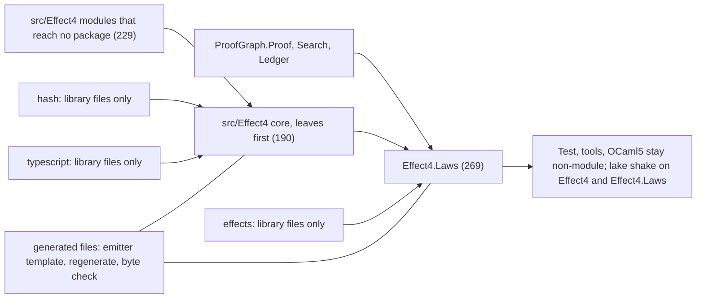

# Reference scout, seat modules: Lean's module system for this estate (2026-10-04)

Seat: modules. Read-only. Base: `682ea1fd` on `refactor/phase1-phase3`. Head `53640d85` adds only
`vendor/refs/MANIFEST.tsv` and a `.gitignore` entry. Toolchain:
`leanprover/lean4:v4.33.1`. No Lean process, no build and no download ran for this note. The
counts below come from `grep` and two small Python header scans over source text, kept in the
session scratchpad; each count names its pattern.

## 1. The one thing to know first

Keep the three files that run the axiom gate (`Test.lean`, `Test/All.lean`, `Test/Slow.lean`)
non-module. Then the gate, `ProofGraph.Audit`, `ProofGraph.Axioms` and the reach probe keep seeing
every proof body with no code change. A non-module file, and any `importModules` call left at its
default level, reads each module's `.olean.private` part, and that part holds every kernel
constant. The payoff of the cutover is narrower than the tooling map says: Lake stops rebuilding a
module importer only when the exported `.olean` is byte-identical. That holds for proof edits, and
by default not for edits to exposed definition bodies. Nothing fails when it does not hold, so it
must be measured on the first converted package.

Correction to `docs/research/2026-10-03-claude-lead/tooling-map.md` §1.10 and to the audit §5: no
file of the three packages is a module. A header-aware count (the first token after comments is
`module`) gives `effects` 0 of 46, `hash` 0 of 54 and `typescript` 0 of 12. The "3 of 46" and
"3 of 54" counted doc-comment lines that begin with the word "module", for example in
`Effects/Flow/Alphabet.lean` and `Hash/Sha256/Vec.lean`.

## 2. What I read

| Source | Pin | What I read |
| --- | --- | --- |
| Lean core source, `~/.elan/toolchains/leanprover--lean4---v4.33.1/src/lean/` | toolchain `v4.33.1` | `Lean/Environment.lean` (`OLeanLevel`, `OLeanEntries`, `mkModuleData`, `writeModule`, `ImportedModule`, `readModuleDataPartsOfMod`, `importModulesCore`, `finalizeImport`, `subsumesInfo`, `importModules`, `setExporting`, `hasExposedBody`, `addConstAsync`); `Lean/AddDecl.lean` (`addDeclCore`); `Lean/Elab/Import.lean` (`HeaderSyntax.imports`, `processHeaderCore`, `parseImports`); `Lean/Parser/Module.lean`, `Lean/Parser/Module/Syntax.lean` (`header`, `import`, `parseHeader`); `Lean/Parser/Command.lean` (`sectionHeader`, the `meta` docstring); `Lean/Elab/DeclModifiers.lean` (`Visibility.isInferredPublic`, `applyVisibility`); `Lean/Elab/MutualDef.lean` (`expose`, `no_expose`, `wouldBeExposed`, `warn.redundantExpose`, `warn.exposeOnPrivate`); `Lean/ResolveName.lean` (`backward.privateInPublic`, `resolvePrivateName`); `Lean/CoreM.lean` (`DeclNameGenerator.mkUniqueName`); `Lean/Meta/Eqns.lean` (`mkEqLikeNameFor`, the reserved-name predicate); `Lean/Elab/Declaration.lean` (`elabInitialize`); `Lean/Compiler/InitAttr.lean` (`runInitAttrForMod`); `Lean/Compiler/MetaAttr.lean`; `Lean/Compiler/IR/CompilerM.lean` (`declMapExt`, `exportIREntries`, `findInterpDecl`, `getIRExtraConstNames`); `Lean/Compiler/LCNF/PhaseExt.lean`, `Lean/Compiler/LCNF/Visibility.lean`, `Lean/Compiler/LCNF/PublicDeclsExt.lean`, `Lean/Compiler/LCNF/Basic.lean` (`findExtEntry?`); `Lean/Compiler/Options.lean`; `Lean/Elab/BuiltinEvalCommand.lean`; `Lean/Elab/Tactic/Guard.lean` (`evalGuardCmd`); `Lean/Elab/Syntax.lean`, `Lean/Elab/AuxDef.lean`; `Lean/Elab/Deriving/Basic.lean`, `Lean/Elab/Deriving/Util.lean`, `Lean/Elab/Deriving/DecEq.lean` (`mkAuxFunction`); the `@[no_expose]` lines of `Lean/Elab/Deriving/Repr.lean` and `Hashable.lean` (by `grep`); `Lean/Compiler/LCNF/EmitC.lean` (`emitInitFn`); `Lean/Elab/ParseImportsFast.lean` and `Lean/PrivateName.lean` (signatures, by `grep`); `Lean/Attributes.lean`; `Lean/ScopedEnvExtension.lean`; `Lean/DeclarationRange.lean`; `Lean/DocString/Extension.lean`; `Lean/ExtraModUses.lean`; `Lean/Util/CollectAxioms.lean`; `Lean/Setup.lean` (`Import`, `ModuleHeader`, `ImportArtifacts`); `Lean/Language/Lean.lean` (`experimental.module`); `LeanIR.lean`; `LeanChecker.lean` |
| Lake, `…/src/lean/lake/Lake/` (same toolchain) | `v4.33.1` | `Build/Facets.lean` (`ModuleImportInfo`, `ModuleExportInfo`); `Build/Module.lean` (`fetchTransImportArts`, `ModuleImportInfo.addImport`, `fetchImportInfo`, `Module.computeExportInfo`, `Module.recFetchPreSetup`, `Module.cacheOutputArtifacts`, `Module.cacheOutputHashes`, `Module.restoreAllArtifacts`, `Module.checkArtifactsExist`, `Module.buildLean`); `Build/Actions.lean` (`compileLeanModule`); `Build/Common.lean` (`computeArtifact`, `checkHashUpToDate'`); `Config/Artifact.lean` (`Artifact.trace`); `Config/LeanConfig.lean` (`requiresModuleSystem`, `allowNonModules`); `CLI/Shake.lean`; `CLI/Help.lean` (`helpShake`) |
| `vendor/refs/mathlib4` | `0df444a360eaa60ab8c11dca51a86af692955474` (tag `v4.33.1`) | `lakefile.lean`; header and idiom counts over `Mathlib/`, `MathlibTest/`, `Archive/`, `Counterexamples/`; `Mathlib/Tactic/Linter/PrivateModule.lean`; `Mathlib/Order/Interval/Lex.lean`; `Mathlib/Data/List/Sort.lean`; `Mathlib/Data/Nat/Log.lean`; `Mathlib/Order/DirectedInverseSystem.lean`; `Mathlib/Tactic/Basic.lean`, `Mathlib/Tactic/Common.lean`, `Mathlib/Init.lean`, `Mathlib/Util/CompileInductive.lean`, `Mathlib/Tactic/Attr/Register.lean`, `Mathlib/Tactic/SetLike.lean`, `Mathlib/Tactic/Continuity/Init.lean`, `Mathlib/Tactic/ContinuousFunctionalCalculus.lean`; the `import all` and `@[no_expose]` sites |
| `.lake/packages/batteries` | `4488d40d070b9700d4d5a6aa342f0d40c31b2a2d` (not in MANIFEST.tsv; the estate's resolved dependency) | `lakefile.toml`; idiom counts; `Batteries/Tactic/Trans.lean`, `Batteries/Tactic/Lint/Basic.lean`, `Batteries/Util/LibraryNote.lean`, `BatteriesTest/Internal/DummyLabelAttr.lean` |
| `.lake/packages/aesop` | `3448c0bcc5ce01b2d1546e483ec3620e32df3d0e` (the estate's pin) | `lakefile.toml`; idiom counts; `Aesop.lean`; `Aesop/Frontend/Command.lean` (`declare_aesop_rule_sets`); `Aesop/Frontend/Extension.lean` (`extensionDescr`); the three non-module files |
| `.lake/packages/{effects,hash,typescript}` | `a4ee7a14…`, `c906b15d…`, `f5878bf8…` (the estate's pins) | `lakefile.toml` of each; idiom counts; `Hash.lean`, `Hash/Sha256/Audit.lean`, `Hash/Sha256/Api.lean` |
| The estate | `682ea1fd` | `docs/research/2026-10-04-proof-graph-audit/audit.md`; `docs/research/2026-10-03-claude-lead/tooling-map.md`; `lakefile.toml`; `Test/Audit/AxiomGate.lean`; `tools/ProofGraph/Audit.lean`, `Axioms.lean`, `Ledger.lean` (imports only), `Proof.lean` (imports only), `Search.lean` (imports only); `tools/Tools/Architecture.lean`; `tools/Tools/GeneratedStamp.lean`; `tools/Effect4Gen/Check.lean`; the emitters' `import` lines in `tools/Effect4Gen/*.lean` and `tools/Tools/Variances.lean`; `tools/Effect4Gen/manifest.json`; `tools/Effect4Gen/guards/json.lean`; `scripts/generate.py`; `scripts/lib/derived_plan.py`; `docs/research/2026-10-04-proof-graph-audit/reach_probe.lean`; `Test/Store/DerivedCheck.lean`; `src/Effect4/Store/Domain/Derived/Json.lean` (header) |

Not read: `vendor/refs/import-graph`, `vendor/refs/LeanArchitect` and the other references (other
seats); Lean's C++ runtime and the IR interpreter's C++ side; the toolchain's `doc/` (not in this
install).

## 3. Findings

### (a) The idioms and what each means

**The header.** `Lean/Parser/Module/Syntax.lean` (`Module.header`, `Module.import`) admits an
optional `module`, an optional `prelude`, then imports of the shape
`public? meta? import all? M`. Comments may come before `module`. `Lean/Parser/Module.lean`
(`parseHeader`) refuses `public import`, `meta import` and `import all` in a file without
`module`, and refuses `public import all` ("consider using separate `public import` and
`import all` directives"). `Lean/Elab/Import.lean` (`HeaderSyntax.imports`) reads each import as
an `Import` record (`Lean/Setup.lean`): `isExported := publicTk.isSome || moduleTk.isNone`, so in
a non-module file every import counts as public. Unless the file says `prelude`, `Init` is
imported twice, once plain and once with `isMeta := true`.

`Lean/Environment.lean` (`importModulesCore`) refuses a direct import of a non-module from a
module: "cannot import non-`module` … from `module`". The reverse is allowed. So adoption runs
bottom-up, per file: a file can convert once all its direct imports are modules.

**The import kinds.** The lattice comment in `importModulesCore` defines them, and
`ModuleImportInfo.addImport` (`Lake/Build/Module.lean`) traces them:

| Import in a module `A` | What `A` sees of `B` | Re-exported to `A`'s importers | IR of `B` loaded on the command line | What Lake traces for `A` |
| --- | --- | --- | --- | --- |
| `import B` | `B`'s public part, in `A`'s private scope (proofs, non-exposed bodies, private declarations) | no | no | `B`'s `.olean` and `B.transTrace` |
| `public import B` | `B`'s public part, in `A`'s public scope (statements, signatures, exposed bodies) | yes | no | the same, and `B` enters `A.transTrace` |
| `meta import B` | as `import`, plus `B`'s IR for code `A` runs at compile time, transitively | no | yes | `B`'s `.olean`, `.ir.sig` and `.ir` |
| `public meta import B` | as `public import`, plus the IR, which `A`'s importers also receive | yes | yes | the same, and `B` enters `A.transTrace` with its IR, so `A`'s importers trace `B`'s `.ir` too |
| `import all B` | `B`'s private part too (theorem bodies, non-exposed bodies, private names), not transitive | no (`public import all` is refused) | yes, `B` only | every part of `B` |

A public statement cannot mention a declaration that reaches `A` only through a non-public
import. `finalizeImport` builds the public constant map only from modules with `isExported`, and
a declaration's type is elaborated while `Environment.isExporting` is set.

**Default visibility.** In a module, a declaration is private unless it is inside a
`public section` or marked `public`. `Visibility.isInferredPublic` (`Lean/Elab/DeclModifiers.lean`)
reads `if env.isExporting || !env.header.isModule then !v.isPrivate else v.isPublic`, and
`applyVisibility` gives a non-public declaration a private name (`mkPrivateName`).
`Mathlib/Tactic/Linter/PrivateModule.lean` states the same rule ("private declarations from the
current module are exactly those which satisfy `isPrivateName`, whether private due to an explicit
`private` or due to not being made `public`").

**Sections.** `sectionHeader` (`Lean/Parser/Command.lean`) is
`@[expose]? public? noncomputable? meta? section`, in that order. An unnamed section may stay open
to the end of the file. Mathlib opens one after the module docstring and never closes it.

**`@[expose]` and `@[no_expose]`.** `finishElab` in `Lean/Elab/MutualDef.lean` computes
`wouldBeExposed`:

- an `abbrev` is exposed;
- an `instance` whose type is not a `Prop` is exposed;
- a `def` is exposed inside an `@[expose]` section, unless it is `meta` outside a meta section;
- nothing else is exposed, and a `theorem` never is.

`@[expose]` on one definition exposes it, and `@[no_expose]` "Negate[s] previous `[expose]`
attribute". A definition that is not exposed is elaborated `withoutExporting`.
`addDeclCore` (`Lean/AddDecl.lean`) then stores it in the exported part as an `axiomInfo`. It does
the same to every theorem ("exporting theorem … as axiom") and to a non-exposed `opaque`, and it
leaves a private declaration out of the exported part. Two warnings are on by default:
`warn.redundantExpose` ("`@[expose]` has no effect; this declaration would be exposed by default",
and the same outside a module) and `warn.exposeOnPrivate`. Under this tree's
`-DwarningAsError=true` each one fails the build.

**Private names inside public bodies.** `resolvePrivateName` (`Lean/ResolveName.lean`) does not
resolve a private name while exporting. An exposed body that calls a `private` helper therefore
fails with an unknown identifier. The porting escape is the option `backward.privateInPublic`,
documented as "(module system) Export `private` declarations, allowing for arbitrary access to
them while code is being ported". It warns unless `backward.privateInPublic.warn` is off. Mathlib
writes `set_option backward.privateInPublic true in` 684 times and
`set_option backward.privateInPublic.warn false in` 332 times, in 179 files (for example
`Mathlib/Order/DirectedInverseSystem.lean`). A theorem body never exports a private name:
`finishElab` turns `privateInPublic` off for theorems "to make sure they stay irrelevant for
rebuilds".

**Generated names.** Two rules change names that the gate and the probes read:

- `DeclNameGenerator.mkUniqueName` (`Lean/CoreM.lean`) makes an auxiliary name private when
  `env.header.isModule && !env.isExporting`. A `proof_n`, `match_n` or `_aux` declaration minted
  inside a proof or a non-exposed body becomes `_private.<Module>.0.<parent>.proof_n`.
- `mkEqLikeNameFor` (`Lean/Meta/Eqns.lean`) names an equation lemma privately unless
  `hasExposedBody` holds. Its comment: "The equational theorem for a definition can be private
  even if the definition itself is not." The reserved-name predicate accepts only the exact name
  `mkEqLikeNameFor` computes in the current environment.

`Mathlib/Tactic/Linter/PrivateModule.lean` notes that a reserved name such as `foo.eq_1` may be
realized in a downstream module, and then joins that module's public scope.

**How Mathlib and Batteries handle definitions unfolded across modules.**

- `@[expose] public section` opens 4,952 Mathlib files and 106 of 191 `Batteries/` files. Plain
  `public section` opens 2,717 Mathlib files (2 files have both) and 10 Batteries files. Aesop,
  which is tactic code, exposes nothing: 127 plain `public section` files. Which Mathlib files
  pick which form was not checked file by file. The rule in `wouldBeExposed` makes the choice
  matter only for `def`s.
- Per-declaration `@[expose]` appears on 152 Mathlib lines and `@[no_expose]` on 104, of which 40
  sit on instances (`Mathlib/Order/CompleteLattice/PiLex.lean`, `Mathlib/Order/Types/Defs.lean`).
- `import all` is the escape for upstream definitions that are not exposed: 13 Mathlib files, for
  example `Mathlib/Data/Nat/Bitwise.lean` ("import all Init.Data.Nat.Bitwise.Basic -- for
  unfolding `bitwise`") and `Mathlib/Data/String/Basic.lean`.
- Lean core exposes little by default. Of 630 `Init` files, 72 open an `@[expose]` section
  (`Init/Prelude.lean` uses `public section` then `@[expose] section  -- Expose all defs`), and
  `Init` carries 373 per-declaration `@[expose]` lines. In `Std`, 244 of 482 files open an
  `@[expose]` section. Every estate file is a non-module today, so it imports `Init` at the
  private level and can unfold any core definition. A converted file can unfold only exposed ones
  (trap T3 below).
- `simp [f]` and `unfold f` need equation lemmas. For a non-exposed `f` these exist only as
  private names in the defining module, so importers can use only the public lemmas that module
  states about `f`.

**Instances.** A non-`Prop` instance is exposed by default (`wouldBeExposed`). Mathlib hides
heavy instance bodies with `@[no_expose]` (`Mathlib/Order/Types/Defs.lean`).

**`initialize`, attributes and environment extensions.**

- `elabInitialize` (`Lean/Elab/Declaration.lean`) expands `initialize x : T ← act` into an
  `@[no_expose] private def initFn` and an `opaque x` carrying `@[init initFn]`.
- In a module environment, `runInitAttrForMod` (`Lean/Compiler/InitAttr.lean`) skips an
  initializer whose IR phase is `.runtime`. It runs one only in the language server, or when the
  importer reaches that module through `meta import` or `import all` (`initRuntime`). So a plain,
  non-`meta` `initialize` in a plainly imported module does not run for a module importer on the
  command line, but it does run in the editor.
- The idiom is `meta initialize`, or `initialize` inside `public meta section`. Aesop's
  `declare_aesop_rule_sets` expands to `meta initialize (…)` and calls
  `recordExtraRevUseOfCurrentModule` (`Aesop/Frontend/Command.lean`). `Batteries/Tactic/Trans.lean`
  puts `initialize transExt` inside `public meta section`. `Mathlib/Tactic/Attr/Register.lean`
  puts `register_simp_attr` inside `public meta section`, after
  `public meta import Lean.LabelAttribute`.
- Each persistent extension exports three arrays, `OLeanEntries {exported, server, private}`
  (`Lean/Environment.lean`). The older `exportEntriesFn` maps to `.uniform`: the same entries at
  every level. The levels used by core:
  - tag and enumeration attributes keep exported entries only for declarations visible in the
    exported environment. Parametric attributes filter through `filterExport`, whose default
    (`env.contains`) is documented as "only params on public declarations are exported"
    (`Lean/Attributes.lean`). The estate's `semanticsAttribute` is a `ParametricAttribute String`;
  - scoped extensions, which include Aesop's rule sets (`Aesop/Frontend/Extension.lean`,
    `extensionDescr`), default to uniform (`exportEntry?` in `Lean/ScopedEnvExtension.lean`);
  - docstrings and declaration ranges are `exported := #[]`, with `server` and `private` holding
    all entries (`Lean/DocString/Extension.lean`, `declRangeExt` in `Lean/DeclarationRange.lean`);
  - `extraModUses` is private only (`Lean/ExtraModUses.lean`);
  - `exportedAxiomsExt` (`Lean/Util/CollectAxioms.lean`) is uniform. It records, at `.olean`
    write time, the axioms of every declaration visible in the exported view, computed over the
    private environment;
  - the IR table `declMapExt` (`Lean/Compiler/IR/CompilerM.lean`) keeps, for a module, "`meta`
    closure only in `.olean`, turn all other decls into opaque externs". The full IR goes to the
    separate `.ir` file (`exportIREntries`);
  - the LCNF tables `baseExt` and `monoExt` (`Lean/Compiler/LCNF/PhaseExt.lean`) export public
    declarations, with a body only when `isDeclTransparent`, and keep all of them in `private`.

**`#guard` and `#eval` in a module file.**

- `evalGuardCmd` (`Lean/Elab/Tactic/Guard.lean`) evaluates with `checkMeta := false`. On the
  command line, though, `importModulesCore` loads an import's IR only for `meta import`,
  `import all`, the server, or a non-module root (`needsIR`).
- For an imported non-meta function, `findInterpDecl` (`Lean/Compiler/IR/CompilerM.lean`) then
  finds only the opaque extern that the `.olean` keeps. A `#guard` over imported code therefore
  needs `meta import` of the providing module. Not checked: whether a precompiled module's native
  code stands in for the missing IR. The interpreter's C++ side was not read.
- `#eval` compiles a `meta` helper under `compiler.relaxedMetaCheck`, documented as "Allow mixed
  `meta`/non-`meta` references in the same module. References to imports are unaffected"
  (`addAndCompileExprForEval` in `Lean/Elab/BuiltinEvalCommand.lean`).
- Mathlib's idiom, in `Mathlib/Order/Interval/Lex.lean`:
  `meta import Mathlib.Order.Interval.Basic  -- shake: keep (for #eval testing)`. A guard over
  core code needs nothing, since `Init` is meta-imported: `Mathlib/Data/List/Sort.lean` has
  `#guard mergeSort …` with plain imports.
- In the editor, `globalLevel` is `.server` and all IR loads, so a guard that fails in
  `lake build` passes in the editor.

**Deriving.**

- A derived definition is declared in the current scope. Under `@[expose] public section` it is
  exposed. The `DecidableEq` handler declares a plain `def` (`mkAuxFunction` in
  `Lean/Elab/Deriving/DecEq.lean`), so kernel `decide` in an importer needs that scope.
- `deriving @[expose] C` exposes one class's output (`DerivingClassView.ofSyntax` and
  `applyDerivingHandlers (setExpose := …)` in `Lean/Elab/Deriving/Basic.lean`). It is refused for
  a type with private constructors (`withoutExposeFromCtors`, `Lean/Elab/Deriving/Util.lean`).
- The `Repr` and `Hashable` handlers mark their helpers `@[no_expose]`
  (`Lean/Elab/Deriving/Repr.lean`, `Lean/Elab/Deriving/Hashable.lean`).

**Tactic and elaborator code.**

- `syntax` declares a `public meta def` parser descriptor (`Lean/Elab/Syntax.lean`), and
  `elab_rules` and `macro_rules` declare `meta def`s through `aux_def` (`Lean/Elab/AuxDef.lean`).
  The generated code is therefore `meta` without being asked.
- Its callees must be `meta`, or imported with `meta`. `checkMeta`
  (`Lean/Compiler/LCNF/Visibility.lean`) refuses otherwise: "Invalid `meta` definition …
  consider adding `public meta import …`". A public meta definition that importers run must reach
  its callees through `public meta import`.
- The idiom is `public meta import Lean.Elab.…` plus `public meta section`
  (`Batteries/Tactic/Trans.lean`, `Batteries/Tactic/Lint/Basic.lean`, `Mathlib/Tactic/Basic.lean`;
  307 Mathlib files open `public meta section`, 264 use `public meta import`).
- The `meta` docstring (`Lean/Parser/Command.lean`) adds two rules. A `meta def` cannot be used at
  run time, "e.g. as part of a `lean_exe`". A definition needed in both phases stays non-`meta`,
  and its module is imported both plainly and with `meta import`.

**`precompileModules`.**

- The module system does not change it. `Module.recFetchPreSetup` (`Lake/Build/Module.lean`)
  loads the shared libraries of precompiled imports into each importer and mixes their traces into
  the importer's trace, unless `platformIndependent = true`.
- Aesop keeps it off, in `.lake/packages/aesop/lakefile.toml`:
  `precompileModules = false # We would like to turn this on, but it breaks the Mathlib cache.`
  Mathlib's `lakefile.lean` and Batteries' `lakefile.toml` do not set it.
- `compiler.postponeCompile` ("Internal. Toggle experimental `leanir` separate compilation",
  `Lean/Compiler/Options.lean`) defaults to off. So `compileLeanModule` (`Lake/Build/Actions.lean`)
  still emits C from `lean` itself.

**Where the module system already runs.**

| Tree | Files that open with a `module` header |
| --- | --- |
| `vendor/refs/mathlib4/Mathlib/` | 8,311 of 8,311 |
| `MathlibTest/` | 186 of 396 |
| `Archive/` and `Counterexamples/` | 30 of 115 |
| `.lake/packages/batteries` | 196 of 260: `Batteries/` 191 of 191 plus `Batteries.lean`, `BatteriesTest/` 4 of 66, `scripts/` 0 of 2 |
| `.lake/packages/aesop` | 135 of 250: `Aesop/` 134 of 137 plus `Aesop.lean`, `AesopTest/` 0 of 112 |
| `effects`, `hash`, `typescript`, and the estate's `src/`, `tools/` and `Test/` | 0 |

The brief's 8,241 is the count of lines that are exactly `module`. It misses 70 Mathlib files whose header line carries a comment after `module`, for example `module -- shake: keep-all` in `Mathlib/Init.lean`. The three
non-module Aesop files (`Aesop/Builder.lean`, `Aesop/Forward/CompleteMatchQueue.lean`,
`Aesop/Index/DiscrKeyConfig.lean`) are not imported by `Aesop.lean`'s closure.

### (b) What each part holds, and what the gate and the probes receive

**The files.** `writeModule` (`Lean/Environment.lean`) writes one `.olean` for a non-module
file. For a module it writes three parts with `saveModuleDataParts`, then `.ir` and `.ir.sig`
(`.ir.sig` holds `default` unless `leanir` fills it). "Objects shared with prior parts are not
duplicated", so a part loads only after the parts before it (`readModuleDataParts`). Lake
caches, restores and hashes all five (`Module.cacheOutputArtifacts`,
`Module.restoreAllArtifacts`, `Module.checkArtifactsExist`).

| Part | Constants (`mkModuleData`) | Extension entries |
| --- | --- | --- |
| `.olean` (`OLeanLevel.exported`) | what the environment shows with `setExporting true`, re-sorted so the part does not depend on the private one. Exposed definitions keep their bodies. Theorems, non-exposed definitions and non-exposed opaques are `axiomInfo`. Private declarations are absent, apart from some kernel-generated private names of inductives (the comment in `resolvePrivateName`). | each extension's `exported` array. Docstrings and declaration ranges are empty here. IR holds only the `meta` closure plus opaque-extern signatures of public declarations. |
| `.olean.server` (`OLeanLevel.server`) | the same constants as `.olean` | adds the `server` arrays: docstrings, declaration ranges |
| `.olean.private` (`OLeanLevel.private`) | every kernel constant: "this branch makes very sure all kernel constants are exported eventually". Theorem bodies, private declarations and all auxiliaries are here. | every `private` array: `extraModUses`, `declMetaExt`, all LCNF declarations with bodies |
| `.ir` | none | the full IR (`declMapExt`), all `[init]` entries and the module-package table (`exportIREntries`) |

**What an importer receives.** `ImportedModule.mainModule?` picks the private part under
`import all` and the exported part otherwise. The import level decides which applies:

- **A non-module file** is elaborated at `OLeanLevel.private` (`processHeaderCore` in
  `Lean/Elab/Import.lean`: `level := if isModule then … else .private`). `importModulesCore`
  then sets `importAll := globalLevel == .private || …` for every import, and loads IR for every
  module, since `needsIR` holds once `globalLevel > .exported`.
  - Lake hands such a file `allArts` for every transitive module: `.olean`, `.olean.server`,
    `.olean.private`, `.ir.sig` and `.ir` (`fetchTransImportArts` with `nonModule`,
    `ModuleImportInfo.addImport`, `Module.computeExportInfo`).
  - `finalizeImport` runs with `isModule := false` and builds one constant map from the private
    parts.
  - `runInitAttrForMod` runs every initializer, since `getIRPhases` answers `.all` outside a module.
  - Such a file sees every theorem body, every private declaration and every docstring, exactly
    as today.
- **A `--run` driver calling `importModules imports {} 0`** gets the defaults
  `level := OLeanLevel.private` and `loadExts := false`. With no `arts` it reads `.olean`, `.olean.server`
  and `.olean.private` from the search path (`readModuleDataPartsOfMod`), and throws if a part is
  missing. It reads `.ir.sig` and `.ir` if present (`readIRPartsOfMod`). The constants and the
  imported extension entries are the private ones. Extension states are not finalized, as today.
  The parts are found because `lakefile.toml` sets `restoreAllArtifacts = true`.
- **A module on the command line** gets the exported part of each import (the private part under
  `import all`). It gets no IR except through `meta import`, `import all`, or the implicit
  `meta` import of `Init`.
- **A module in the editor** also gets `.olean.server` (`ImportArtifacts.oleanParts`), and IR for
  all imports.

**The four consumers, answered concretely.**

- `Test/Audit/AxiomGate.lean` (`#effect4_axiom_gate`, run in `Test/All.lean` and
  `Test/Slow.lean`): **yes, every proof body**, while those files stay non-module.
  - The gate reads `env.header.moduleData`, which is the private part of each module.
  - It reads facts through `env.find?`. In a non-module environment `setExporting` is a no-op, so
    `find?` reads the private map.
  - If a gate root became a module, every imported theorem would arrive as an `axiomInfo`, and
    `Facts.isAxiom` would refuse the tree. Every private declaration would be absent.
- `ProofGraph.Audit.auditedFacts` (`moduleData.constNames`): **yes**. The private part lists every
  kernel constant of the module. The `missing` check is unchanged. `factsOf` reads `isExtern`
  and `Compiler.getImplementedBy?`. These read the `externAttr` and `implementedByAttr`
  attributes (`getExternAttrData?` in `Lean/Compiler/ExternAttr.lean`,
  `Lean/Compiler/ImplementedByAttr.lean`), not the IR table. So the opaque-extern IR stubs that a
  module writes into `declMapExt` do not trip the gate's `@[extern]` ruling.
- `ProofGraph.Axioms.reachedAxioms` (theorem values via `usedConstantsOf (.thmInfo v)`): **yes**.
  `env.find?` returns `thmInfo` with its value.
- `docs/research/2026-10-04-proof-graph-audit/reach_probe.lean` (`importModules … {} 0`, then
  `env.constants.map₁`): **yes**. The default level is private. The same holds for
  `Tools.Architecture.loadCounts`, the semantics report, `Effect4Gen.Check.main`, and the LCNF
  readers under `src/OCaml5/Tools` and `tools/Conform`. `findExtEntry?`
  (`Lean/Compiler/LCNF/Basic.lean`) falls back to the private LCNF entries, which keep their
  bodies.

**What does change, and the edits it needs.**

1. **Names, not access.** Two rules from (a) rename declarations.
   - Auxiliaries minted inside a proof or a non-exposed body become `_private.<M>.0.…`
     (`DeclNameGenerator.mkUniqueName`). An equation lemma of a non-exposed definition becomes
     private (`mkEqLikeNameFor`).
   - The gate's `sameModuleAncestors` walks `Name.getPrefix`. It stops at
     `_private.<M>.0.<parent>`, which is no constant when the parent is public.
   - The reserved-name clause of `admissionAncestors` evaluates the reserved-name predicate in
     the gate's non-module environment. There `hasExposedBody` is true for every definition, so a
     private equation-lemma name is not recognized as reserved.
   - Both rules bite only for a declaration whose admission must be inherited: the exact
     exemptions of `choiceImplementationDeclarations`, when the exempt definition is not exposed.
     Module-level exemptions (`choiceImplementationModules`) read the auxiliary's own module and are
     unaffected.
   - Edit, if any exempt definition ends up non-exposed: map a private ancestor through
     `privateToUserName?` in `sameModuleAncestors`, and test reservation on the user name. Land it
     with a red control: a fixture whose private auxiliary of an exempt definition is refused today.
2. **A guard that the root is not a module.** Add one check to `#effect4_axiom_gate`: refuse when
   `(← getEnv).header.isModule`. It is cheap, and it turns the silent failure into a loud one.
3. **Silent shrink in the probes.** `reach_probe.lean` (`noise`) and `Tools.Architecture.isNoise`
   drop every name with a component starting with `_`, so they drop every private name. A file
   converted without `public section` has every declaration private. Its importers that are
   modules fail loudly, but non-module `Test` files and both probes do not: the probes just
   report fewer theorems. Section 4 gives the check.
4. **`#print axioms` keeps working from modules.** `Lean.collectAxioms` looks up an imported
   declaration in `exportedAxiomsExt`, which is precomputed from the private environment at write
   time. So a module can still print an imported theorem's axioms, though it cannot see the proof.
   The estate's gate walks bodies itself and need not change. A package audit that walks the
   constant map itself, as `Hash/Sha256/Audit.lean` scans "every declaration", still needs a
   non-module root.

`LeanChecker.lean` (`replayFromImports`) is the reference pattern for reading one module's full
constants without importing at the private level. It reads `.olean`, `.olean.server` and
`.olean.private` with `readModuleDataParts`, and takes "the last ("most private") part, which
subsumes all prior ones". The toolchain ships it as `bin/leanchecker`.

### (c) What makes Lake rebuild an importer

Lake rebuilds a module when its dependency trace hash differs from the saved `depHash`
(`checkHashUpToDate'` in `Lake/Build/Common.lean`; modification times count only in `--old`
mode). Every artifact's trace carries the file's content hash (`computeArtifact`;
`Artifact.trace` in `Lake/Config/Artifact.lean`). `Module.recFetchPreSetup`
(`Lake/Build/Module.lean`) builds the trace from these inputs:

1. the library's extra dependency jobs (`lib.extraDep`);
2. the import trace, `ModuleImportInfo.trace`;
3. the shared libraries of precompiled imports (`fetchImportLibs`), with package extern
   libraries, `dynlibs` and `plugins`. `platformIndependent = true` replaces these with a nil
   trace;
4. the toolchain (`addLeanTrace`);
5. the source text's hash (`input.trace` from `Module.recFetchInput`);
6. the options (`traceOptions`), the `isModule` flag, the module name, the package id and
   `leanArgs` (this tree's `moreLeanArgs`). `weakLeanArgs` are not traced.

The import trace adds, for each direct import `B` (`ModuleImportInfo.addImport`):

| How the importer imports `B` | What enters its trace |
| --- | --- |
| a non-module file, any import | `B.legacyTransTrace` and `B.allArtsTrace`: all five artifacts of `B` and, transitively, of everything `B` imports |
| `import all B` | `B.allTransTrace` and `B.allArtsTrace` |
| `meta import B`, `public meta import B` | `B.metaTransTrace` and `B.metaArtsTrace`: `B`'s `.olean`, `.ir.sig` and `.ir` |
| `import B`, `public import B` | `B.transTrace` and `B.artsTrace`: `B`'s `.olean` only |

`Module.computeExportInfo` hands the module importer the paths of `.olean`, `.olean.server`,
`.ir.sig` and `.ir`. Its own comment calls this "too dangerous". But `artsTrace` mixes only
`olean.trace`. `B.transTrace` grows only through `B`'s own `public import`s
(`if imp.isExported then …`). A non-public import of `B` never reaches `B`'s importers' traces.
A `public meta import C` in `B` puts `C`'s `.ir` into `B.transTrace`, so every importer of `B`
then rebuilds on `C`'s body edits. Toolchain modules such as `Lean.Elab.*` never change, so this
costs nothing for them. It does cost for an estate module, for example `SubsetTac` meta-importing
`ListSubset`.

So a module importer `A` is rebuilt when one of these changes:

- the exported `.olean` of a direct import;
- the exported `.olean` of a module reachable from a direct import through `public import`s;
- the `.ir` of a `meta` import;
- a precompiled import's shared library;
- `A`'s own source or options.

A rebuilt `B` whose exported part comes out byte-identical stops the cascade there. This early
cutoff is the whole payoff.

What each edit should do, read from the export rules in (a) and (b). Expected, not measured:

| Edit in a converted module `B` | `B`'s `.olean` | Module importer (`import`, `public import`) | `meta import` importer | Non-module importer (`Test`) |
| --- | --- | --- | --- | --- |
| a proof, with the same axioms | same | not rebuilt | not rebuilt | rebuilt |
| a proof that changes its axioms | changes: `exportedAxiomsExt` | rebuilt | rebuilt | rebuilt |
| a theorem statement | changes | rebuilt | rebuilt | rebuilt |
| an exposed definition body | changes | rebuilt | rebuilt | rebuilt |
| a non-exposed definition body, not `@[inline]` or otherwise template-like | same (exported as `axiomInfo`; LCNF body opaque by `shouldExportBody`) | not rebuilt | rebuilt (the `.ir` changed) | rebuilt |
| a private declaration | same | not rebuilt | rebuilt if its IR changed | rebuilt |
| a docstring, or lines shifted | same (`exported := #[]` for docstrings and ranges) | not rebuilt | not rebuilt | rebuilt |

Three consequences for this tree:

- `Test.All` keeps rebuilding on every edit below it, as today. The gate stays where the trust
  is: one module that sees everything.
- With `@[expose] public section` everywhere, the idiom that keeps today's unfolding, a
  definition-body edit still rebuilds everything above it. The tooling map's §2 medians for
  Store, Program and Machine edits (249 to 433 modules) shrink only by the share of those edits
  that touch proofs. Its §1.10 claim that the change "removes most of the rebuild costs in §2"
  holds for the Laws graph, and is unmeasured elsewhere.
- Every `meta import` added for a `#guard` makes that module rebuild on body edits of what it
  meta-imports. Its importers are spared, because its own exported part does not change.

### (d) A cutover recipe for this estate

**What may stay non-module.** `Test`, `tools`, `OCaml5` and the packages' own test, gate and
executable roots may stay non-module, and the audit roots must. A non-module file may import
modules and sees everything they hold (b).

- Precedent: `BatteriesTest/` has 4 module files of 66, `AesopTest/` 0 of 112, `MathlibTest/` 186
  of 396.
- Only three tool modules must convert, because `src` modules import them directly or through
  each other:
  - `ProofGraph.Proof`, imported by the other two;
  - `ProofGraph.Search`, imported by `Effect4.Laws.Auto.Census` and `Effect4.Laws.Auto.Frames`;
  - `ProofGraph.Ledger`, imported by `Effect4.Laws.Auto.Obligations`.
- `Tools.*`, `TestSupport.*` and `Conform.*` are imported from `src/OCaml5` only.
- `OCaml5` is imported by no `Effect4` module (counted with `grep '^import OCaml5'`).
- In the packages, `Hash.Verified` (the `HashVerified` root, whose `#guard_msgs` pin the axiom
  audits), `HashTest`, `HashGates`, `hashbin`, `EffectsTest` and `TypeScriptTest` stay non-module
  for the same reason as `Test`.

**Order.** A file converts once every direct import is a module. A header scan of `src/`
(scratchpad `closure.py`, `import` lines only) counts 459 `Effect4` modules:

- 229 reach none of the three packages, so they can convert before any package: 135 of 190
  outside `Laws`, 94 of 269 in `Laws`;
- 198 reach `Hash`;
- 184 reach `TypeScript`;
- 143 reach `Effects`, all of them under `Laws`.

Direct package imports: `Effect4.Store.Carrier.Digest` imports `Hash.Sha256.Api`; ten `Codegen`
modules import `TypeScript.*`; five `Laws` modules import `Effects.*`. The longest `Effect4` import
chain the same scan finds is 75 edges.

The packages are separate repositories pinned by commit in `lakefile.toml`. Converting one is a
commit there, a new `rev` and a manifest update, which belong to the coordinator.

**The transformation per file.** This is Batteries' and Mathlib's idiom, chosen to keep today's
meaning.

1. Put `module` first. A banner comment such as `-- GENERATED by …` may stay above it.
2. Turn every `import X` into `public import X`. This keeps today's re-export of everything.
   `lake shake` narrows it later (f).
3. Pick the section by the file's kind. The section goes after the module docstring, or after
   the imports when there is none.
   - **Definitions and theorems:** `@[expose] public section`. Every `def` stays unfoldable
     downstream, as today, and only proofs become private.
   - **Meta code** (`elab`, `elab_rules`, tactics, commands, `initialize`, `register_simp_attr`):
     `public meta section`, and `public meta import` for every module the meta code calls,
     `Lean.*` included. The gate's `auditImplementationModules` already lists this tree's meta
     modules, fifteen in all (`Census`, `Traversals`, `Exhaustive`, `RuleSets`, `Positions`,
     `Frames`, `Obligations`, `AnswerGate`, `Semantics` and `SubsetTac` under `Laws/Auto`;
     `PositionGate`, `TypedStateDecl` and `TypedSources` under `Laws/Program/Typed`;
     `Laws/Program/Authoring/Tactic`; `Program/FoldOf`), plus the two `Test/Audit` modules.
     Eight files import `Lean` directly today: `Semantics`, `Positions`, `SubsetTac`,
     `AnswerGate`, `Authoring/Tactic`, `TypedSources`, `FoldOf` and `Program/Authoring/Sugar`.
     The rest reach `Lean` transitively. In a module, meta code reaches `Lean` only through a
     `public meta import` somewhere on its import chain.
   - **Mixed files** need a split, so that code a compiled executable uses stays non-`meta`.
     The `meta` docstring says a `meta def` is unavailable "as part of a `lean_exe`", and a
     `meta def` may not call a same-module non-`meta` definition (`checkMeta`;
     `compiler.relaxedMetaCheck` is off by default). `Effect4.Laws.Auto.Semantics` is the known
     case. Its `semanticsTheorems`, `semanticsNoise` and `semanticsModule` serve the compiled
     `semantics-report`, and its `initialize semanticsAttribute` and `#semantics_census` are meta.
     Put the helpers in a runtime module and the attribute and command in a meta module that
     `public meta import`s it. A split of a module that `auditImplementationModules` lists
     changes that list as well. The gate's staleness check refuses an entry that no longer reaches
     `Classical.choice`, so the list stays exact. `Effect4.Laws.Auto.SubsetTac` needs both
     `public import Effect4.Laws.Auto.ListSubset` and `public meta import Effect4.Laws.Auto.ListSubset`:
     its meta code runs `reify` and `quoteTree` over `ListSubset`'s `Tree`, and its proofs cite
     `ListSubset`'s lemmas.
4. A `#guard` or `#eval` that runs code from another module needs `meta import` of that module.
   `src/Effect4` has 1,050 `#guard` lines in 48 files (`grep '^\s*#guard\b'`). Twenty of the 26
   generator groups append guard fragments to their outputs. `tools/Effect4Gen/guards/json.lean`,
   for example, calls `Canonical.encode` and `Canonical.decode` from an import. The alternative is
   to move the guard to a non-module `Test` file (owner question 3).
5. An exposed body that calls a `private` helper fails to resolve it (trap T7). There are 407
   `private` declarations in 60 files of `src/Effect4` (`grep`). Two fixes:
   - drop `private`, which renames the declaration;
   - wrap the helper in `set_option backward.privateInPublic true in`, and the caller in that
     plus `set_option backward.privateInPublic.warn false in`, as Mathlib does. The `.warn false`
     is not optional under `-DwarningAsError=true`.
6. A proof that unfolds a core definition that is not exposed fails: by `rfl`, `decide`,
   `simp [f]`, `unfold f` or `delta`. Add `import all Init.…` for the module that defines it, as
   Mathlib does in `Mathlib/Data/Nat/Bitwise.lean`; a toolchain module never changes, so the
   import costs no rebuild. Or rewrite the proof with the public lemmas.
7. Write no per-declaration `@[expose]` inside an `@[expose]` section. `warn.redundantExpose`
   would fail the build.

**The traps, in one list.**

- T1. **Default visibility.** In a module, a declaration outside `public section` is private
  (`applyVisibility`). Module importers fail loudly. Non-module `Test` files see the private
  names, and the two probes silently drop them (b, item 3).
- T2. **Theorems and non-exposed definitions are exported as `axiomInfo`** (`addDeclCore`).
  `rfl`, `decide` and equation lemmas stop working across modules for non-exposed definitions,
  whose equation lemmas are private (`mkEqLikeNameFor`).
- T3. **Core exposure.** 558 of 630 `Init` files open no `@[expose]` section. Any estate proof
  that today unfolds a core definition outside the 373 per-declaration `@[expose]`s and the
  exposed sections breaks on conversion. The count is unknown until a package converts.
- T4. **`#guard` and `#eval` over imported code** need `meta import` on the command line. They
  pass in the editor regardless (a).
- T5. **A non-`meta` `initialize` does not run in a module importer on the command line**
  (`runInitAttrForMod`). That covers three initializers: `initialize semanticsAttribute` in
  `Semantics`, the binder-free `initialize do` that registers the `keys_norm` simp set in
  `SubsetTac`, and `initialize Batteries.Linter.UnreachableTactic.addIgnoreTacticKind` in
  `Census`. Use `meta initialize` or a `public meta section`. The `declare_aesop_rule_sets` lines
  in `RuleSets` already expand to `meta initialize`.
- T6. **Meta code that reaches non-`meta` code** needs `public meta import`. `checkMeta` is loud.
- T7. **Private names in exposed bodies** do not resolve (`resolvePrivateName`).
- T8. **`warn.redundantExpose` and `warn.exposeOnPrivate`** are warnings, so errors here.
- T9. **Private auxiliary and equation-lemma names** reach the gate's ancestor walk (b, item 1).
- T10. **The gate root must stay non-module** (b).
- T11. **`Effect4Gen.Check.fileImports`** (`tools/Effect4Gen/Check.lean`) keeps only lines that
  start with `"import "`. A generated file with `public import` lines yields no imports, and
  `main` throws "the given files import nothing". `Lean.Elab.parseImports` reads every form.
- T12. **Aesop rule sets export uniformly** (`ScopedEnvExtension.Descr.exportEntry?`). A rule on a
  definition whose equation lemmas are private would ship a name that importers cannot resolve.
  No `@[aesop …]` sits on a `private` declaration in `src` today (`grep`). Keep rule-bearing
  definitions exposed.
- T13. **LCNF across modules.** A public definition's LCNF body is exported only when
  `shouldExportBody` holds: template-like, or small and exposed (`Lean/Compiler/LCNF/Visibility.lean`).
  Importers may inline less, so the OCaml cut from LCNF can change. Regenerate the `lcnf` family
  and diff it after each converted chain.
- T14. **`meta import` and `import all` trace the `.ir` or every part.** Body edits in what they
  name rebuild the importer. A `public meta import` passes the same to the importer's own
  importers (c). Keep them out of hot modules where a `Test` file can hold the guard.
- T15. **`requiresModuleSystem`** (`Lake/Config/LeanConfig.lean`) makes Lake warn on every
  non-module importer. Set it only together with `allowNonModules` on `Test` and `tools`, or leave
  both unset.
- T16. **Disk.** A module leaves seven artifacts where a non-module leaves three:
  `.olean.server`, `.olean.private`, `.ir.sig` and `.ir` join `.olean`, `.ilean` and `.c`
  (`Module.cacheOutputHashes`). The artifact cache keeps every version. The data volume is
  unmeasured, since shared objects are stored once across the parts. This Mac has 26 GiB free
  (`df -h`, 94% used).

**What must change in the tree's own gates, tools and generators.**

| File | Change | Why |
| --- | --- | --- |
| `tools/Effect4Gen/Main.lean`, `Atoms.lean`, `Authoring.lean`, `Forms.lean`, `LayerView.lean`, `Rows.lean`, `Fold.lean` (two sites), `View.lean`; `tools/Tools/Variances.lean` | emit `module`, `public import` for each manifest import, `meta import` for what the appended guards run, and `@[expose] public section` after the generated module docstring; regenerate and commit the 25 `src` outputs; `make check-gen` stays byte-identical afterwards | these ten sites write `import {i}` today; a generated file is converted only through its emitter |
| `tools/Effect4Gen/manifest.json` | possibly a per-group field for the guards' meta imports | the guard fragments call imported code (T4) |
| `tools/Effect4Gen/Check.lean` (`fileImports`) | read imports with `Lean.Elab.parseImports` | T11 |
| `Test/Audit/AxiomGate.lean` | refuse a module root; make the ancestor walk private-aware only if an exempt definition ends up non-exposed, with a red-control fixture | b, items 1 and 2 |
| `tools/Tools/Architecture.lean` | optional: record `isModule` per file (`HeaderSyntax.isModule` after `Parser.parseHeader`, or `ModuleHeader.isModule` from `Lean.parseImports'` in `Lean/Elab/ParseImportsFast.lean`), and count public declarations per module | conversion progress is then measured, not drawn; it catches T1 |
| `scripts/generate.py`, `scripts/lib/derived_plan.py` | none | the plan reads headers through `Lean.Elab.parseImports` (`tools/Effect4Gen/Driver.lean`) |
| `ProofGraph.Audit`, `ProofGraph.Axioms`, the reach probe, the semantics report | none | b |
| `lakefile.toml` | none required; the module system needs no flag (`experimental.module` is a "no-op, deprecated" in `Lean/Language/Lean.lean`) | the coordinator's file in any case |

### (e) Why measure first, and what to measure

The honest answer to the owner: no pilot in the sense of a trial followed by a second ruling.
Convert as one wave, and stop once, after the first package, for five measurements that take
hours. Repeat the first of them when the first `Laws` chain with `@[semantics]` and `@[aesop]`
attributes converts.

Most failures of this change are loud, and the narrow build of each file catches them one by
one:

- a non-module import from a module;
- an unresolved private name;
- a `checkMeta` refusal;
- a missing `meta import`;
- a core definition that will not unfold.

Three failures are silent. Nothing breaks, and something is lost:

- the rebuild payoff;
- the gate's coverage;
- public names.

So a pilot that "sees whether it builds" learns little. A measurement after the first package
learns what the build cannot say.

| # | Measure | How | Why it must be known before the rest |
| --- | --- | --- | --- |
| M1 | the payoff | In a converted module with module importers, edit one proof. `lake build` it. Compare `shasum -a 256` of its `.olean` (must be equal) and of its `.olean.private` (must differ). `lake build --no-build <a module importer>` must succeed. Red control: a statement edit must make the same `--no-build` fail. Edit a docstring as a second green control. | Nothing fails when the exported part drifts; builds stay as slow as today. Lean's rules predict stability (c). This tree adds uniform-export extensions of its own (`semanticsAttribute`, the Aesop banks, `keys_norm`). `hash` has none of them, so repeat M1 on the first converted `Laws` chain that carries `@[semantics]` and `@[aesop]` attributes. Ninety-four `Laws` modules reach no package, so that chain need not wait for any package. |
| M2 | the gate's coverage | The gate's own line "checked … modules and … declarations" before and after must be equal, and the gate must pass. In a package, its own pinned audit lines must be equal (`Hash.Verified`'s `#guard_msgs`). | The gate passes vacuously if it sees fewer declarations. Its count is the only signal. |
| M3 | public names | List the non-private constants per converted module before and after, with a short `--run` probe over the private parts, like `reach_probe.lean`. The two lists must be equal, apart from auxiliaries renamed by design (T9). | T1 and T9 are silent for non-module consumers. The probes and the architecture map would just report less. |
| M4 | disk and time | `du -sk` of the package's `.lake/build` and of the toolchain cache (`lake env printenv LAKE_CACHE_DIR`) before and after. The package's build wall time at `LEAN_NUM_THREADS=3`. | Disk is at 94%. A module writes seven artifacts. Imports should get smaller (module builds load only the exported parts of their imports), but that is unmeasured. |
| M5 | the breakage census | Per converted file: the edits beyond the mechanical header, counted by cause (core `import all`, `privateInPublic`, `meta import`, a split, a de-privatized helper). | It prices the other ~490 files. It shows whether T3 (core exposure) is rare or common. |

Why measure at the first package: M1 to M4 depend on the toolchain and on this tree's
configuration, not on which files convert. That configuration is the gate's code,
`-DwarningAsError=true`, the artifact cache and the attributes. One package answers them for all
files. A wrong answer changes the recipe. That is cheap before about 520 headers are rewritten and dear after: about 28 `hash` library files, 7 `typescript`, 22 `effects`, 459 `src/Effect4` modules and 3 `ProofGraph` modules.

`hash` exercises the most traps. In its 34 `Hash/` files (`grep` with a declaration-start
pattern) it has:

- 302 theorem lines;
- 108 `private` lines;
- 39 `#guard` lines in 5 files, some over imported code: `Hash/Sha256/Api.lean` guards `sha256`,
  which computes through `Hash.Sha256.Fast`;
- `#guard_msgs` audit pins in `Hash/Sha256/Verified.lean` and `Hash/Sha3/Verified.lean`, which
  stay non-module;
- a meta audit command, `Hash/Sha256/Audit.lean`.

Its consumer here is one file. `typescript` has 7 theorem lines in 6 files and is a weak test of
M1. `effects` has 195 theorem lines and 102 `private` lines in 21 files, and it is the package
that `Laws` needs.

One more number would sharpen the payoff estimate, though nothing waits on it: the share of
recent `src/Effect4` edits that touch only proofs. Read it from `git log -p`, per area.

### (f) What `lake shake` gives once converted

**What it requires.** `Lake.Shake.run` (`Lake/CLI/Shake.lean`) loads the given roots at the
private level. It throws "`lake shake` only works with `module`s currently" if any loaded module
is not a module, which is the refusal the audit hit on 2026-10-04. Once `hash`, `typescript`,
`effects`, the three `ProofGraph` modules and all of `src/Effect4` are modules,
`lake shake Effect4 Effect4.Laws` runs. `lake shake Test` never runs while `Test` stays
non-module. That costs little: `Test/All.lean` is an umbrella of batteries, whose imports there
is no reason to narrow. By default shake first checks `lake build --no-build`, which `--force`
skips.

**What it computes.** `calcNeeds` reads each module's constants from its private part: every
constant's type and value, plus its recorded extra uses (`getExtraModUses`, `indirectModUseExt`
in `Lean/ExtraModUses.lean`, recorded from 34 core files). It ignores reserved names, since "they
can be re-generated in-place". It sorts every needed module into one of four kinds (`NeedsKind`):

- `pub`, when a public declaration's type or exposed body uses it;
- `priv`, when only proofs, non-exposed bodies or private declarations use it;
- `metaPub` and `metaPriv`, the same for compile-time uses.

`visitModule` then reports, per module:

- imports to remove;
- imports to add, for modules used directly but imported only transitively;
- the narrowest kind each import needs.

**The options** (`helpShake` in `Lake/CLI/Help.lean`):

- `--fix` rewrites the headers;
- `--explain` "Show[s] which constants require each import", a use–definition pair per import
  (`getExplanations`);
- `--keep-public`, `--add-public`, `--keep-implied`, `--keep-prefix` and `--gh-style`;
- three annotations: `import X -- shake: keep`, `module -- shake: keep-all` and
  `module -- shake: keep-downstream`.

**What it buys here.**

1. **Rebuilds.** Every `public import` it narrows to `import` takes that module out of the
   importer's `transTrace` (c). A statement edit far below then stops rebuilding the modules that
   use it only in proofs. This multiplies the payoff of (c). The recipe's "`public import`
   everything" is only the starting point.
2. **A measured, justified import graph.** `--explain` gives, per module, the declarations that
   bring each dependency in. The audit's F6 ("what a proof brings in") wants the per-proof version
   of the same data. Shake computes it per module from the private parts. `calcNeeds` is not
   `public` in Lake's own module, which exports only `Args` and `run`, so a tool either parses
   `--explain` or redoes its ~40 lines over `Expr.foldConsts` and `getExtraModUses`.
3. **Dead imports**, found by the same pass.

**Limits.**

- A `--fix` on a generated file is overwritten by the next regeneration. Put the narrowed imports
  in `tools/Effect4Gen/manifest.json`, or mark generated files `module -- shake: keep-all`.
- A guard's `meta import` needs `-- shake: keep`, as in `Mathlib/Order/Interval/Lex.lean`.
- A rule-set module stays imported because Aesop's `declare_aesop_rule_sets` calls
  `recordExtraRevUseOfCurrentModule`.
- Shake loads the private parts of the whole closure, so it needs the full build on disk.

## 4. Ranked recommendations

| # | What to do | Learn from | Estate file it changes | Adoption | Semantic impact | Cost |
| --- | --- | --- | --- | --- | --- | --- |
| 1 | Keep every `Test` file, and above all `Test.lean`, `Test/All.lean` and `Test/Slow.lean`, non-module. Add one check to `#effect4_axiom_gate` that refuses when `(← getEnv).header.isModule`. Keep the packages' audit roots (`Hash.Verified`, `HashTest`, `EffectsTest`, `TypeScriptTest`) non-module too. | `processHeaderCore` (`Lean/Elab/Import.lean`); `importModulesCore`, `finalizeImport` (`Lean/Environment.lean`); `addDeclCore` (`Lean/AddDecl.lean`); `fetchTransImportArts` (`Lake/Build/Module.lean`); `BatteriesTest/`, `AesopTest/` | `Test/Audit/AxiomGate.lean` | idea | tooling-only | hours |
| 2 | Convert the first package, then stop for M1–M5 of (e). Repeat M1 on the first `Laws` chain that carries `@[semantics]` and `@[aesop]`; 94 `Laws` modules reach no package, so it can come first. | `LeanChecker.lean` (reading all three parts); `checkHashUpToDate'`, `ModuleImportInfo.addImport` (Lake) | `.lake/packages/hash` (upstream `pure-algebra/lean4-hash`), then one `src/Effect4/Laws` chain; a research note for the numbers | idea | none | hours |
| 3 | Convert bottom-up with the Batteries and Mathlib idiom of (d): `module`; `public import`; `@[expose] public section` for definitions and theorems; `public meta section` with `public meta import` for meta code; `meta initialize`; `meta import` for guards over imported code; split mixed modules such as `Effect4.Laws.Auto.Semantics`; de-privatize or `privateInPublic` for private helpers; `import all Init.…` for core definitions that are not exposed. | `Batteries/Tactic/Trans.lean`, `Batteries/Util/LibraryNote.lean`, `Mathlib/Tactic/Attr/Register.lean`, `Mathlib/Order/Interval/Lex.lean`, `Mathlib/Data/Nat/Bitwise.lean`, `Mathlib/Order/DirectedInverseSystem.lean`; the `meta` docstring in `Lean/Parser/Command.lean` | the library files of `hash`, `typescript` and `effects`; all 459 `src/Effect4` modules; `tools/ProofGraph/Proof.lean`, `Search.lean`, `Ledger.lean` | copy-pattern | proof-side (what an importer may unfold; no judgment changes) | a-wave |
| 4 | Change the header the emitters write, regenerate the 25 `src` outputs, and read imports in the projection guard with `Lean.Elab.parseImports`. | `HeaderSyntax.imports`, `parseImports` (`Lean/Elab/Import.lean`) | `tools/Effect4Gen/Main.lean`, `Atoms.lean`, `Authoring.lean`, `Forms.lean`, `LayerView.lean`, `Rows.lean`, `Fold.lean`, `View.lean`, `Check.lean`; `tools/Tools/Variances.lean`; `tools/Effect4Gen/manifest.json` | copy-pattern | tooling-only | a-slice |
| 5 | After the wave, run `lake shake Effect4 Effect4.Laws --explain`, then `--fix`. Narrow `public import` to `import` where only proofs use a module. Mark generated files `module -- shake: keep-all`, or feed the narrowed imports to the manifest. Mark guard `meta import`s `-- shake: keep`. | `Lake/CLI/Shake.lean` (`calcNeeds`, `getExplanations`, `visitModule`, `run`); `helpShake` | every converted header; `tools/Effect4Gen/manifest.json` | tool-only-dependency (in the toolchain already) | tooling-only | a-slice |
| 6 | Measure conversion and catch T1. In the architecture map, record `isModule` per file and the public and private declaration counts per module. Refuse an `Effect4.*` module that declares only private declarations, as Mathlib's linter does. | `Mathlib/Tactic/Linter/PrivateModule.lean`; `Lean.parseImports'`, `ModuleHeader.isModule` (`Lean/Elab/ParseImportsFast.lean`, `Lean/Setup.lean`) | `tools/Tools/Architecture.lean`, or the gate | copy-pattern | tooling-only | hours |
| 7 | Make `sameModuleAncestors` and the reserved-name clause of `admissionAncestors` private-aware (`privateToUserName?`), only if an exactly exempted definition ends up non-exposed. Land it with a red-control fixture. | `DeclNameGenerator.mkUniqueName` (`Lean/CoreM.lean`); `mkEqLikeNameFor` (`Lean/Meta/Eqns.lean`); `privateToUserName?` (`Lean/PrivateName.lean`) | `Test/Audit/AxiomGate.lean`; a fixture under `Test/fixtures/trust-gate/` | idea | tooling-only | hours |
| 8 | Regenerate the `lcnf` family after each converted chain and diff it. Cross-module LCNF bodies become opaque unless template-like, or small and exposed. | `shouldExportBody`, `markDeclPublicRec` (`Lean/Compiler/LCNF/Visibility.lean`); `mkDeclExt` (`Lean/Compiler/LCNF/PhaseExt.lean`) | the outputs listed in `ocaml/gen/roots.json` (`python3 scripts/generate.py --only lcnf`) | idea | tooling-only (a diff is a generated-code change for the Conform rungs to judge) | hours |
| 9 | Later, measured: narrow exposure in core definition files. Use plain `public section` with per-definition `@[expose]` only where `Laws` unfolds, so that definition-body edits stop rebuilding too. | Mathlib's 2,717 plain `public section` files; `Init`'s 373 per-declaration `@[expose]`; `wouldBeExposed` | `src/Effect4/Store/**`, `Program/**`, `Machine/**` | copy-pattern | proof-side | a-wave |
| 10 | For a tool that needs one module's full constants without importing at the private level, read the three parts with `readModuleDataParts` and take the last. After the wave, `bin/leanchecker Effect4` can replay every converted module's private part through the kernel as an outside re-check. | `replayFromImports` (`LeanChecker.lean`); `readModuleDataParts` (`Lean/Environment.lean`) | `tools/ProofGraph/*` (a future per-module reader); the reach probe | copy-pattern | tooling-only | hours |

## 5. What not to borrow

- **A module audit root.** In a module, imported theorems are `axiomInfo` and private
  declarations are absent (`addDeclCore`, `finalizeImport`). The gate would refuse every theorem,
  or audit less. This holds for `hash`'s `Hash.Verified` too.
- **`backward.privateInPublic` as a standing state.** Mathlib carries it as a porting escape: 684
  `true` lines and 332 `.warn false` lines in 179 files. It exports private declarations "as is",
  so edits to them rebuild importers again. Every access it allows warns, so under
  `-DwarningAsError=true` each accessing declaration also needs `.warn false`. Use it to finish a
  file, then de-privatize.
- **`import all` of this tree's own modules as a routine fix.** It traces every part of the
  module (`allArtsTrace`), so every edit there rebuilds the importer. It is free only for
  toolchain modules.
- **Plain `public section` as the first-wave default for definition files.** It changes what
  `Laws` can unfold (`rfl`, `decide`, equation lemmas), and it makes equation lemmas private.
  Mathlib opens it in 2,717 files, a choice this note did not check file by file. Make it
  recommendation 9, measured, not a side effect of the cutover.
- **`requiresModuleSystem` on the estate's libraries.** Lake would warn on every non-module `Test`
  importer (`fetchImportInfo`).
- **`compiler.postponeCompile` and `leanir`.** The option says "Internal. Toggle experimental
  `leanir` separate compilation". Off by default, and not needed.
- **`lake shake --fix` on generated files.** The next regeneration overwrites it.
- **Aesop's `precompileModules = false` as a reason to drop `Effect4Tactics` or
  `ProofGraphNative`.** The comment concerns Mathlib's shared cache, not the module system.
- **`#print axioms` (`exportedAxiomsExt`) in place of the gate's traversal.** The precomputed lists
  come from the same elaborator at write time. The gate's own walk over the private parts is the
  stronger evidence, and costs 3.1 s (tooling map §2).
- **Per-declaration `@[expose]` inside an `@[expose]` section.** `warn.redundantExpose` fails the
  build here.

## 6. Questions only the owner can answer

1. Reverse the ruling of 2026-10-03 ("no pilot for now"): convert now as one wave, with one stop
   for M1–M5 after the first package (audit §6, question 1)?
2. The exposure default for definition files:
   - `@[expose] public section` keeps today's unfolding and gains on proof edits only;
   - plain `public section` with per-definition `@[expose]` also gains on definition-body edits,
     but changes what `Laws` can unfold.
3. The 1,050 library `#guard` lines in 48 `src/Effect4` files, and the guard fragments of 20
   generator groups: keep them in place with `meta import` (the module then rebuilds on body
   edits of what it meta-imports), or move them to non-module `Test` files?
4. Private helpers that exposed bodies call: de-privatize them, which renames them and touches the
   gate's private exemption lists, or use the `privateInPublic` escape?
5. The three packages are separate repositories pinned in `lakefile.toml`. Who converts and
   re-pins `hash`, `typescript` and `effects`?
