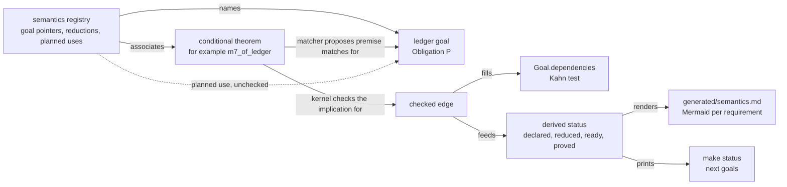

# 2026-10-04 reference scout: the proof graph and blueprint tooling

Status: research note (history, not authority). Base: `53640d85` on `refactor/phase1-phase3`.
Seat: proof graph and blueprint tooling. Read-only: no Lean process, build or download ran.
Every finding below is *reading* evidence (controlled English §3.8): established by reading the
named source, with no run and no proof. No claim here is proved, reproduced or tested.

## 1. The one thing the coordinator must know first

LeanArchitect derives `\leanok` from the absence of `sorryAx`, and leanblueprint builds every
status on `\leanok`. Neither fits a tree with no `sorry`, so neither can be adopted as it stands.
The estate should copy only LeanArchitect's stop-at-node dependency walk. Its edges should be
implications between node propositions, built from conditional theorems it already writes, like
`m7_of_ledger`. A matcher proposes each edge, and the kernel checks it.

Two cheap defects surfaced on the way, both by reading. Three copies of a string filter treat 23
user theorems named `eq_…` or `match_…` as auxiliary names (a text search, §3.3). So the audit's
census and the semantics placement undercount. The report's marker rule omits two of the
registry's three roots (§3.2).

## 2. What I read

| Source | Pin | What I read |
| --- | --- | --- |
| `vendor/refs/LeanArchitect` | `c74a8acc9e8a1a82096867dd3aeec18fbfc560b9` (tag `v4.33.1`) | all of it: `Architect/*.lean`, `Main.lean`, `lakefile.lean`, `ArchitectTest/*.lean`, `scripts/convert/*`, README, CI |
| `vendor/refs/leanblueprint` | `56e066d30fb7b608a63f4241fee80982d7eae3ef` (`master`) | `leanblueprint/Packages/blueprint.py`, `leanblueprint/client.py`, the templates, README |
| `vendor/refs/import-graph` | `16f02aa7642864af59f1ff0e384a015994db9118` (tag `v4.33.0`) | every `ImportGraph/**` module, `MainGraph.lean`, `MainUnusedTransitiveImports.lean`, the tests, README |
| `vendor/refs/doc-gen4` | `e2af49a7b7e5e1a9224008c1f15e7aa4f58a4015` (tag `v4.33.1`) | `lakefile.lean` (all facets), `Main.lean`, `DocGen4/Load.lean`, `DocGen4/Process/{Analyze,Base,DocInfo,NameInfo,TheoremInfo,AxiomInfo,Attributes}.lean`, `DocGen4/DB.lean` (writer), `DocGen4/DB/Schema.lean` |
| Lean core, toolchain `v4.33.1` | `~/.elan/toolchains/leanprover--lean4---v4.33.1/src/lean` | `Lean/Util/CollectAxioms.lean`, `Lean/Environment.lean` (import levels, `importModules`, `mkModuleData`, `readModuleDataParts`), `Lean/Elab/Import.lean` (`processHeaderCore`), `Lean/Setup.lean` (`Import`), `Lean/Attributes.lean` (`registerParametricAttribute`), `Lean/OriginalConstKind.lean`, `Lean/Data/Name.lean` (`isInternalDetail`), `Lean/AuxRecursor.lean`, `Lean/Util/Sorry.lean`, `Lean/Util/FoldConsts.lean`, `Lean/DeclarationRange.lean`, `LeanChecker.lean`, `lake/Lake/Build/Common.lean`, `lake/Lake/Build/Facets.lean`, `lake/Lake/Load/Toml.lean`, `lake/README.md` |
| Batteries in the estate | `.lake/packages/batteries` at `4488d40d` | `Batteries/Lean/NameMapAttribute.lean` |
| The estate | `53640d85` | the audit (`docs/research/2026-10-04-proof-graph-audit/audit.md`, its probe and join script), `tools/ProofGraph/*.lean`, `tools/Tools/SemanticsRegistry.lean`, `tools/Tools/Semantics.lean`, `src/Effect4/Laws/Auto/Obligations.lean`, `src/Effect4/Laws/Auto/Semantics.lean`, `generated/semantics.md`, `docs/core/semantics.md` §1, `docs/core/controlled-english.md` §§2–6; and for context `m7_of_ledger` (`src/Effect4/Laws/Program/Typed/Assembly.lean`), `Test/Audit/ProofGraph.lean`, the exemption lists of `Test/Audit/AxiomGate.lean`, `isNoise` (`tools/Tools/Architecture.lean`), `tools/Drivers/SemanticsControls.lean`, the `Makefile` semantics rules, `lakefile.toml` |

Not read, and so not claimed: `plastexdepgraph`, the `checkdecls` Lean package and the three 2026
papers the audit cites. `plastexdepgraph` is the plasTeX plugin that builds leanblueprint's graph
from `\uses`.

## 3. Findings

### 3.1 (a) The node, edge and status models

**leanblueprint: nodes and edges live in LaTeX.** A node is a theorem-like LaTeX environment with a
`\label`. Its edges are the labels listed in `\uses{…}`, once in the statement and once in the
proof. Three flags are authored per environment: `\leanok`, `\notready` and `\mathlibok` (classes
`leanok`, `notready`, `mathlibok` in `vendor/refs/leanblueprint/leanblueprint/Packages/blueprint.py`).
`\mathlibok` also sets `leanok`. The plasTeX plugin `plastexdepgraph` builds the graph from these
marks; I did not read it.

**leanblueprint: the statuses are derived in one callback.** `make_lean_data` in the same file
computes them after parsing:

| Status | Rule in `make_lean_data` |
| --- | --- |
| `can_state` | every statement `uses` node has `leanok`, and the node is not `notready` |
| `can_prove` | every statement and proof `uses` node has `leanok`; false when the node has no proof |
| `proved` | the proof environment has `leanok` |
| `fully_proved` | every node in `graph.ancestors(node) ∪ {node}` is `proved` or is a definition (`item_kind`) |

Two consequences matter for us. First, readiness asks only that the dependencies are *stated*
(`leanok`), not proved. In Lean a sorried lemma can already be applied. Second, `fully_proved`
exempts every ancestor whose `item_kind` is `'definition'`, whatever its own `leanok`.
(`item_kind` comes from `plastexdepgraph`, which I did not read.) By this reading, a theorem
about an unformalized definition can show as fully proved.

The same callback writes the file `lean_decls`: every name inside a `\lean{…}`.
`leanblueprint checkdecls` runs `lake exe checkdecls blueprint/lean_decls` (`do_checkdecls` in
`vendor/refs/leanblueprint/leanblueprint/client.py`). The check is existence only. I did not read
the `checkdecls` package.

**LeanArchitect: the node is a Lean attribute.** `@[blueprint …]` is registered with
`registerBuiltinAttribute` (`Architect/Attribute.lean`), global only, at
`applicationTime := .afterCompilation`. Its `add` builds a `Node` (`Architect/Basic.lean`) and
stores it in `blueprintExt : NameMapExtension Node`. A second extension,
`latexLabelToLeanNamesExt`, maps one label to many declarations. A `Node` holds the name, the
label, a statement `NodePart`, an optional proof `NodePart`, `notReady`, `discussion` and `title`.
A `NodePart` holds the text, the authored `uses` and `excludes`, label lists and the LaTeX
environment. The inferred edges and the statuses are **not stored**. The output step computes them
each time.

`NameMapExtension` is Batteries' (`.lake/packages/batteries/Batteries/Lean/NameMapAttribute.lean`).
Its docstring for `registerNameMapAttribute` says such an attribute need not be assigned in the
declaration's file. LeanArchitect's own `add` does not check the declaration's module either. So
`attribute [blueprint …] Imported.decl` tags an imported declaration (README, "Declarations
upstreamed to Mathlib"). The estate's `semanticsAttribute`
(`src/Effect4/Laws/Auto/Semantics.lean`) is a `ParametricAttribute`. Lean's
`registerParametricAttribute` refuses a declaration from an imported module
(`throwAttrDeclInImportedModule`, `Lean/Attributes.lean` in the toolchain).

Two more extensions hold text. `proofDocStringExt` (`Architect/Tactic.lean`) records a
`/-- … -/` written before a tactic, with `asyncMode := .async .asyncEnv` so proofs elaborated in
parallel still record it (`ArchitectTest/AsyncElab.lean` tests this). `moduleBlueprintDocExt`
(`Architect/Command.lean`) holds `blueprint_comment` text and exports nothing at the `exported`
olean level (`exportEntriesFnEx?`).

**LeanArchitect: which constants count.** `CollectUsed.collect` (`Architect/CollectUsed.lean`)
follows the walk of Lean's `collectAxioms`, as its docstring says, but also records blueprint
nodes. It reads `Expr.getUsedConstants` of a
declaration's type and value, an inductive's type and constructors, and a constructor's or
recursor's type. It records an axiom when it meets one. It records a blueprint node when it meets
one and **does not enter it**. Every other constant is entered: auxiliary `match_`, `proof_` and
`eq_` declarations, instances, recursors, and untagged lemmas. So the closure is transitive
through non-nodes and direct at nodes: a node's uses are its nearest node ancestors. The
`visited` set is fresh for each node. There is no memo across nodes.

**LeanArchitect: `uses` versus `proofUses`.** `collectUsed` runs the walk twice over one shared
state. The first pass starts from the constants of the statement and gives the statement uses. The
second starts from the declaration itself, so it also walks the value. The proof uses are the
second set minus the first, with `sorryAx` kept (`valueUsed \ typeUsed.erase ``sorryAx`). A
constant in both the statement and the proof counts as a statement use. A node with no proof part
(a definition, unless `hasProof := true`) takes the union as its statement uses.
`hasProof` defaults to true when proof text is given or when `wasOriginallyTheorem` holds. That
function reads the kind as declared, not as exported (`Lean/OriginalConstKind.lean` in the
toolchain).

**LeanArchitect: the statuses.** `NodePart.inferUses` (`Architect/Output.lean`) adds the authored
`uses` to the inferred set, removes `excludes`, maps nodes to labels and drops the node's own
label. `leanOk` is `!uses.contains ``sorryAx`. `\leanok` is printed only if every declaration
sharing the label is `leanOk` (`InferredUses.merge`). `\notready` is printed if any of them is
`notReady`, an authored flag. `\mathlibok` is printed when every declaration's module starts with
`Init`, `Lean`, `Std`, `Batteries` or `Mathlib` (`isMathlibOk`). Sorry detection is transitive
through non-nodes and stops at nodes. A node that uses a sorried node keeps its own `\leanok`.
leanblueprint's `fully_proved` then carries the ancestors' state.

By reading, `excludes` is applied before the `sorryAx` test. So `(proofUses := [-sorryAx])`
would print `\leanok` over a sorry. I did not test this. LeanArchitect's own cycle check,
`checkCyclicUses`, is commented out (`Architect/Attribute.lean`), so cycles surface only in
plasTeX.

**import-graph and doc-gen4 detect sorry directly, not transitively.** `allConstantsWithSorry`
(`ImportGraph/Util/FindSorry.lean`) and `TheoremInfo.ofTheoremVal`'s `sorried`
(`DocGen4/Process/TheoremInfo.lean`) both test `value.hasSorry`. `Expr.hasSorry` finds a
`sorryAx` constant in the term itself (`Lean/Util/Sorry.lean` in the toolchain).

**The estate's model, for comparison.** A ledger goal is a theorem whose type ends in
`ProofGraph.Obligation p`, recognised by shape (`readGoal`, `tools/ProofGraph/Ledger.lean`). Its
open state is a sorry-free `ProofWanted` definition `g.wanted` (`addWanted`). Its proof is a
theorem `g.checked`, which `ProofRef.validate` holds to the frozen proposition and the ceiling.
`Goal.dependencies` exists, but `readGoal` returns it empty, so `check`'s cycle test sees no edge
(audit F2). The red control `dependency cycle through [one, two]` (`Test/Audit/ProofGraph.lean`)
builds its dependencies by hand.

### 3.2 (b) Output formats, Lake facets and incrementality

**LeanArchitect writes LaTeX and JSON per module.** The base directory is
`.lake/build/blueprint` (`outputBaseDir`, `Main.lean`). The paths come from `moduleToRelPath`
and `libraryToRelPath` (`Architect/Output.lean`):

| Output | Path | Content |
| --- | --- | --- |
| module header | `module/<A>/<B>.tex` | macros `\newleannode{label}{\input{…}}` per node and `\newleanmodule{A.B}{…}` |
| node artifact | `module/<A>/<B>.artifacts/<label>.tex` | the environment with `\label`, `\lean{…}`, `\notready`, `\discussion`, `\mathlibok`, a `% at file:line.col-line.col` comment, `\uses{…}`, `\leanok`, the text; then the proof environment the same way |
| module JSON | `module/<A>/<B>.json` | an array of `{"type": "node", "data": …}` and `{"type": "moduleDoc", "data": …}` |
| library index | `library/<Lib>.tex`, `library/<Lib>.json` | `\input` of every module file; JSON `{"modules": [paths]}` |

A node's JSON `data` comes from `NodeWithPos.toJson`. It holds `name`, `latexLabel`,
`statement`, `proof`, `notReady`, `discussion`, `title`, `hasLean` and `file`. Its `location`
holds the `module` and a `range` of `pos` and `endPos`. `statement` and `proof` are `NodePart`s. The JSON carries **only the
authored data**: no inferred `uses`, and no `leanOk`. The fixture in `ArchitectTest/MyNat.lean`
confirms it: `uses` stays `[]` on every node except the two with authored `uses :=` or
`proofUses :=`. A JSON consumer must recompute the graph and the statuses.

**LeanArchitect's facets.** `lakefile.lean` declares `module_facet blueprint` and
`module_facet blueprintJson`. Each fetches the `extract_blueprint` executable and the module's
`leanArts`. It runs `extract_blueprint single <module>` inside `buildFileUnlessUpToDate'` on the
module's main output file (`buildModuleBlueprint`). `library_facet` and `package_facet` versions
collect the module jobs and write the index (`buildLibraryBlueprint`). The extractor imports the
module's whole closure in a fresh process (`runEnvOfImports`, `Architect/Load.lean`), with
`debug.skipKernelTC` on and `Elab.async` off. Only the main file is traced; the artifact files
beside it are side outputs.

**doc-gen4's facets.** `module_facet docInfo` (`vendor/refs/doc-gen4/lakefile.lean`) depends on the
`docInfo` facet of every import, the core documentation, the bibliography prepass, the executable
and the module's `leanArts`. It writes an empty marker file `doc-data/<module>.doc` and relies on
the marker's trace for incrementality. The real output goes into one SQLite database,
`api-docs.db`. `updateModuleDb` (`DocGen4/DB.lean`) deletes a module's rows and inserts them again
in one transaction, so a rerun replaces exactly that module. `generateHtmlDocs` then runs one
`fromDb` process for the root modules. The schema carries two hashes: one of the DDL text and one
of the serialised Lean types, computed at compile time by `inductiveRepr!`
(`DocGen4/DB/Schema.lean`). A stale database is refused, not misread.

**What makes a Lake job incremental.** `buildFileUnlessUpToDate'` is in
`lake/Lake/Build/Common.lean` in the toolchain. It skips a file that exists while the job's trace
equals the one saved in `<file>.trace`. The `leanArts` facet's trace "just includes its dependencies"
(`lake/Lake/Build/Facets.lean`). So a per-module extraction keyed on `leanArts` reruns whenever
the module or anything it imports changes.

**A TOML lakefile cannot declare a facet.** The estate's config is `lakefile.toml`, which belongs
to the coordinator. Lake's TOML loader decodes four target kinds only: `lean_lib`, `lean_exe`,
`input_file` and `input_dir` (`decodeTargetDecls`, `lake/Lake/Load/Toml.lean`). The Lake README
gives `module_facet`, `library_facet` and `package_facet` in the Lean DSL only ("Defining New
Facets", `lake/README.md`). A semantics facet therefore means a `lakefile.lean`.

**The estate's report is already incremental, with one gap.** The marker rule `$(GEN)/semantics`
in the `Makefile` depends on `SEMANTICS_SOURCES` and on `$(LAWS)`, Lake's trace of
`Effect4.Laws`. The registry's roots are `Effect4.Laws`, `Test.Program.TypedProgBindRed` and
`Test.Program.ProtocolPosts` (`registry.roots`, `tools/Tools/SemanticsRegistry.lean`). The rule
names no trace of the two `Test` roots. The witness `closeSeq_protocol` lives in
`Test.Program.ProtocolPosts`. A change confined to those two modules leaves an existing marker
fresh, and `check-gen` regenerates only stale groups. This is reading evidence; I reproduced
nothing. The roots are data in the registry, while the rule lists traces by hand, and the list has
fallen behind the data.

**Can the report be a Lake facet? Yes, at three granularities.**

1. *Whole report, Makefile.* Add the two `Test` traces to the rule. This closes the gap with no
   new mechanism.
2. *Whole report, Lake target.* In a `lakefile.lean`, one target fetches `leanArts` of each
   registry root and the driver executable, and runs the driver inside `buildFileUnlessUpToDate'`.
   Lake then tracks the roots exactly. The granularity stays the whole report.
3. *Per module, then collate.* This is LeanArchitect's and doc-gen4's pattern. It pays only if
   each module's extraction is local. Both tools import the module's whole closure per module.
   Lean's own checker shows a cheaper first step. `replayFromImports` (`LeanChecker.lean` in the
   toolchain) reads one module's own constants, all three olean parts, with
   `readModuleDataParts`. It imports the closure afterwards only because its kernel replay needs
   it. An extractor that lists each declaration's kind, goal shape and direct used constants
   needs the first step alone. The closure, reach and statuses are then computed at collation.
   Without the module system, an upstream edit still reruns every downstream module, because
   `leanArts` traces include dependencies.

**Lean core computes axioms per module at export.** In 4.33.1 `collectAxioms` does not walk
imported bodies. The extension `exportedAxiomsExt` (`Lean/Util/CollectAxioms.lean`) computes each
exported declaration's axioms when the olean is written, using the private environment. Downstream
modules look the result up, so "axiom collection never crosses module boundaries" (its docstring).
This is the in-build form of option 3. It needs the extension registered in every audited module's
environment, and it costs build time in every module. I name it as the precedent, not as a
recommendation.

This bears on `ProofGraph.Axioms` (`tools/ProofGraph/Axioms.lean`). Its docstring says
`Lean.collectAxioms` walks the dependency graph afresh on every call. In 4.33.1 it caches within
a call and reads imported declarations from the extension, so that motivation may be stale. The
estate's walk still has a reason of its own: it reads the bodies, while `collectAxioms` trusts
entries the producing process wrote into each olean. A trust gate that recomputes from bodies does
not depend on those entries. A speed comparison is owed before either is changed; I measured
nothing.

**Who sees proof bodies under the module system.** `processHeaderCore` (`Lean/Elab/Import.lean`)
imports at the `.private` level for a file that is not a `module`, and at `.exported` for a
`module`. `importModules` defaults to `level := .private` (`Lean/Environment.lean`), and
`importModulesCore` then sets `importAll` for every import. Its docstring says a root without the
module system imports everything and ignores module annotations. A note in the same file says an
exported theorem "may be weakened to an axiom". So, by reading: the report drivers, the reach
probe and the axiom gate keep every proof body if they stay non-`module` files. A walker inside a
`module` file would meet weakened theorems; `ProofGraph.reachedAxioms` would then list them as
axioms, a loud failure rather than a silent pass. There, the only body-free answer is
`collectAxioms`, with the trust cost above. The pilot should confirm all of this; I tested
nothing.

### 3.3 (c) doc-gen4: the walk and the per-declaration record

**The walk.** `runSingleCmd` (`vendor/refs/doc-gen4/Main.lean`) loads one module with
`load (.analyzeConcreteModules #[module])`. `load` (`DocGen4/Load.lean`) imports that module's
closure with `loadExts := true`, runs initializers, and sets `debug.skipKernelTC` on and
`Elab.async` off. `process` (`DocGen4/Process/Analyze.lean`) then iterates **every** constant of
the environment, `env.constants`, and keeps those whose module index is in the requested set.
Each kept constant gets its own `MetaM` run with `maxHeartbeats := 5000000`, wrapped in
`tryCatchRuntimeEx`. A failure prints a warning and skips the declaration. Members are finally
sorted by declaration range.

The estate already walks more cheaply. `auditedFacts` (`tools/ProofGraph/Audit.lean`) reads each
selected module's own `constNames` from `env.header.moduleData`. Its docstring records why: a fold
over the whole environment also pages in every constant of Lean and the dependencies.

**The population filter.** `DocInfo.isBlackListed` (`DocGen4/Process/DocInfo.lean`) keeps
structure projections. It drops a name with no declaration range, and a name that is
`isInternal`, `isAuxRecursor`, `isNoConfusion`, `isInternalDetail`, `isRec` or `isMatcher`.
import-graph's `isBlackListed` (`ImportGraph/Export/Gexf.lean`) uses the same Lean predicates.
These read environment tags, not spellings. `Name.isInternalDetail` (`Lean/Data/Name.lean` in the
toolchain) drops `eq_`, `match_`, `proof_` and `omega_` only when digits or underscores follow
(`matchPrefix`).

The estate has three copies of a string filter: `semanticsNoise`
(`src/Effect4/Laws/Auto/Semantics.lean`), `Tools.Architecture.isNoise`
(`tools/Tools/Architecture.lean`) and `noise` in the audit's `reach_probe.lean`. Each drops any
name with a component that merely *starts with* `eq_`, `match_` or `proof_`. A text search
(a finite probe over source text, not the environment) finds 23 theorem headers in
`src/Effect4/Laws` that these filters drop as noise. Examples: `eq_cata`, `wire.eq_cata` and
`decodeRaw.eq_cata` (`src/Effect4/Laws/Program/Folds/Ty.lean`); `Effect4.Program.effTy.eq_cata`
(`src/Effect4/Laws/Program/Typing/FoldAgreement.lean`); `match_of_inst` and `match_apart`
(`src/Effect4/Laws/Codegen/ReadPrint.lean`). `Folds.Ty` and `ReadPrint` are default modules of
the concepts `initial-algebras-folds` and `exact-codecs`. So the placement counts in
`generated/semantics.md` miss those theorems. The audit's F7 tiers miss all 23. The
architecture map's theorem counts (`loadCounts`) apply the same filter to whatever their roots
load.

**The record per declaration.** `Info` (`DocGen4/Process/Base.lean`) holds:

| Field | Source |
| --- | --- |
| name, pretty-printed type with tagged constants | `NameInfo.ofTypedName`, `prettyPrintTerm` |
| arguments: each binder rendered, with an implicit flag | `Info.ofTypedName` (`DocGen4/Process/NameInfo.lean`) |
| declaration range | `findDeclarationRanges?` |
| attributes as strings | `getAllAttributes` (`DocGen4/Process/Attributes.lean`): `simp`, `csimp`, reducibility, `inline`, `specialize`, `extern`, `implemented_by`, `export`, `deprecated` and four tags |
| `sorried` | direct `value.hasSorry` only |
| docstring | Markdown, or Verso with a Markdown rendering |
| kind data | axiom `isUnsafe`; opaque safety; definition hints, equations and `isNonComputable`; instance class and argument type names; structure fields and parents |

The module record adds the imports, the module docstrings and the tactics declared there.
doc-gen4 records **no used constants, no edges and no axioms** of a declaration. Its database
has a reverse index of module imports and nothing at the declaration level.

**What the estate can reuse.**

1. The Lean predicates, in one shared `ProofGraph` helper that replaces the three string filters.
2. Source order: sort a module's goals by `findDeclarationRanges?`, as doc-gen4 sorts members.
   The report stays free of line numbers in prose.
3. Kind classification for the brought-in profile: `isInstance` reads `instanceExtension`, and
   `isProjFn` reads the structure info (`DocGen4/Process/Base.lean`, `DocInfo.lean`).
4. A schema version derived from the types: the report's `schemaVersion` is the hand-written
   `3` in `buildReport` (`tools/Tools/Semantics.lean`). doc-gen4 hashes its serialised types.
5. Per-declaration isolation is already present: `buildReport` collects one error per claim.

### 3.4 (d) A design for the audit's §4, in the estate's terms

This section is a proposal, not a ruling. It creates no theorem, so it owes no placement block. It
changes how future obligations are placed, which §6 puts to the owner.

**What the design keeps.** One evidence path for *proved*: a theorem the kernel accepted within the
ceiling, by name (controlled English §3.8). Frozen propositions (`ProofRef.validate`). Shape-based
recognition of goals (`readGoal`). Authored associations checked against the environment, as the
registry already does. No status taken from authored input (`buildReport`'s docstring).

**Words first.** The audit's statuses collide with the dictionary. *Frontier* already means a
run's live waiting state (`docs/core/controlled-english.md` §3.6). *Reduction* appears in the
entry for definitional equality as the kernel's reduction. *Stated* is not the dictionary's word;
§3.8 says *declared*. Below I write *declared*, *reduced*, *ready*, *proved* and *next goals*. The
coordinator owns the final words (§6, question 5).

**Nodes.** A node is either open or proved.

- An open node is a ledger goal, `theorem g : Obligation P := ⟨⟩`, read by `readGoal`, with its
  placeholder `g.wanted` (`#proof_wanted`).
- A proved node is a theorem: `g.checked`, a registry witness, or a counterexample witness.
- A claim points at either kind through `Pointer.goal` or `Pointer.witness`, as today.
- A new registry field maps each requirement row to its top nodes. The system map's §8 status
  column can then point at derived statuses (audit F3).

**Edges: the matcher proposes, the kernel checks.** An edge set is an authored association in the
registry: goal `g` is reduced by theorem `r`, for example `m7_of_ledger`
(`src/Effect4/Laws/Program/Typed/Assembly.lean`). The tool checks it in four steps.

1. Open the goal's proposition `∀ xs, A xs` with `forallTelescope`, and open `r`'s type with
   metavariables. Unify `r`'s conclusion with `A xs`, or refuse the association.
2. For each remaining premise of `r`, find the nodes whose proposition has the same head
   constant. Test each candidate as an instance by `isDefEq`. The head index keeps this to a few
   tests per premise.
3. Build the implication `Q₁ → … → Qₙ → P` from the matched node propositions `Qᵢ`, with `r`
   applied inside, and **check it in the kernel without adding it**. This reuses the check-only
   path that `checkPortable` and `checkDeclaration` already take
   (`tools/ProofGraph/Search.lean`, both private today).
4. Record each matched premise as an edge, and fill `Goal.dependencies` from them. `check`'s Kahn
   test (`tools/ProofGraph/Ledger.lean`) then sees real edges.

A premise that matches no node is a *loose premise*: an obligation nobody has declared. The tool
reports it as a planning signal, not as a refusal. A wrong match cannot pass: the kernel rejects
the implication. So an edge is a kernel-checked implication between node propositions; the
matcher's heuristics only choose candidates.

This keeps the 2026-10-03 rule that a goal retires when its proof lands. The reduction is an
ordinary conditional theorem, like `m7_of_ledger`, and survives the goal. After retirement its
premise matches the witness instead, provided a registry pointer names that witness. The node then
shows as proved.

*The alternative: edges that name their goals.* `Obligation.statement` already exists in
`tools/ProofGraph/Ledger.lean`. A plan theorem typed `m5_goal.statement → m6_goal.statement →
m7_goal.statement` names its endpoints in its own type. The reader is then syntactic and exact.
The cost is that a proved goal cannot retire while a plan theorem names it. So a plan would
retire as one unit when its top goal is proved. That conflicts with the 2026-10-03 rule unless the
owner amends it (§6, question 1).

**Statuses, derived.** Over the goals reachable from the requirements' top nodes:

| Status | Rule |
| --- | --- |
| declared | `g.wanted` exists and no checked reduction concludes `g` |
| reduced | a checked reduction concludes `g`, and some matched premise is not proved |
| ready | a checked reduction concludes `g`, and every matched premise is proved |
| proved | `g.checked` exists and `ProofRef.validate` accepts it; after `g` retires, the node is the witness its claim points at |

*Ready* is not *proved*. For a ready goal the report prints the exact command that proves it,
`#obligation_proved g := r …` with the premises' `.checked` names, which `addTheorem` will
kernel-check (`src/Effect4/Laws/Auto/Obligations.lean`). Several reductions may conclude one goal;
any one of them suffices. A cycle among matched edges is refused by the existing Kahn test.

*Next goals* (the audit's frontier) are the declared goals, the ready goals and the loose premises
reachable from a requirement's top nodes. Restricting to reachable goals keeps an abandoned goal
from flooding the list. This is the estate's analogue of leanblueprint's `can_prove`, with one
difference: leanblueprint asks that dependencies be stated, because a sorried lemma can be
applied. Here a premise must be proved.

**Reach (`ProofGraph.Reach`).** Three walks, all tooling, all outside the axiom gate:

- *Forward, stopping at nodes.* LeanArchitect's `CollectUsed.collect` semantics: enter every
  non-node constant, record a node and do not enter it. Memoize per constant on an explicit stack,
  as `reachedAxioms` does (`tools/ProofGraph/Axioms.lean`), not with a `partial` recursion.
- *Statement versus proof.* `collectUsed`'s split: constants the statement reaches, then the rest
  that the proof reaches.
- *Reverse.* For each tree lemma, the nodes whose proofs reach it. The audit's F7 tiers (spine,
  library, unconsumed) become a measured table in the report, as information and not as a gate.

**What a proof brings in.** For each proved node the report lists:

- its nearest nodes, which are LeanArchitect's inferred `proofUses`;
- the tree lemmas, definitions and instances it reaches before the next node, sorted by kind with
  doc-gen4's `isInstance` and `isProjFn`;
- its axioms, from the existing memo.

An aesop rule bank leaves no trace in the proof term. The banks a proof called come from syntax,
through the trust gate's tactic scan (audit F6), not from this walk.

**Authored uses.** Before a reduction exists, a goal may carry planned uses (audit §6, question 4).
They live in the registry beside the goal pointer. They are drawn dashed and labelled unchecked.
They never change a status. They enter the cycle test. A planned use is refused once a checked
reduction concludes the same goal. So the entry cannot outlive its reason, the axiom gate's rule
for its exemptions (`Test/Audit/AxiomGate.lean`). This is LeanArchitect's `uses :=` with one
change. LeanArchitect merges authored uses into the inferred set and lets `excludes` remove
inferred ones.

**Rendering.** The report's JSON gains a `plan` section with six parts:

- the requirements with their top nodes;
- the goals with status, module and source order, from doc-gen4-style declaration ranges;
- the edges with source, target, the reduction's name and a kind, `checked` or `planned`;
- the loose premises;
- the next goals;
- the reach table.

`renderMarkdown` writes one Mermaid diagram per requirement. That keeps each diagram under the
thirty nodes of controlled English §5. `make status` prints the next goals from the JSON.

The diagram below shows the pipeline the design proposes. It claims nothing about the tree.

**Red controls owed with the slice.** Each check keeps its red control, in the style of
`Test/Audit/ProofGraph.lean`. The slice owes six:

1. a reduction whose conclusion does not unify with its goal;
2. an implication the kernel rejects;
3. a cycle among matched edges;
4. a planned use that outlives a checked reduction;
5. a ready goal whose printed command fails;
6. a loose premise, which is reported and not refused.

**Copy from LeanArchitect, or write.**

| Part | Source | Copy or write |
| --- | --- | --- |
| stop-at-node walk; statement versus proof split | `CollectUsed.collect`, `collectUsed` (`Architect/CollectUsed.lean`) | copy the semantics; write it memoized on an explicit stack |
| interactive status of one node | `#show_blueprint`, `#show_blueprint_json` (`Architect/Output.lean`) | copy the idea as `#plan_status g` |
| authored edges | `uses :=`, `proofUses :=` (`Architect/Attribute.lean`) | copy as display-only planned uses; drop the merge and `excludes` |
| per-module JSON and facets | `buildModuleBlueprint`, `module_facet blueprintJson` (`lakefile.lean`) | later, after the module system and a `lakefile.lean` |
| node attached from another module | `NameMapExtension` (Batteries) | not needed while the registry holds the associations |
| premise matcher, kernel-checked implication, statuses, next goals, Mermaid, schema, red controls | none in LeanArchitect | write |
| population filter by environment tags | doc-gen4 `DocInfo.isBlackListed`; import-graph `isBlackListed` | copy |

**What LeanArchitect does that the sorry-free ledger cannot.**

1. *Apply an unproved node.* A sorried stub has its exact statement and can be applied in other
   proofs, which the kernel then checks against it. The ledger's `Obligation P` gives no
   inhabitant of `P`. A dependency must be a premise of a conditional theorem.
2. *Infer every edge with no authoring.* One attribute per node, and `collectUsed` finds the
   edges in proof terms. Here a decomposition costs a written conditional theorem and a registry
   line.
3. *Hold a node whose statement is not yet formal.* With `--convert_informal`, the converter emits
   `theorem name : (sorry : Prop)` for informal nodes (`scripts/convert/modify_lean.py`).
   leanblueprint then has `notready` and `can_state`. A goal here must elaborate, so such a node
   stays prose: an `absent` pointer with its reason.
4. *Attach a node to an imported declaration, and merge declarations into one node* by a shared
   label (`latexLabelToLeanNamesExt`).
5. *Carry informal text*: a statement, a proof sketch, and docstrings written inside tactic proofs
   (`proofDocStringExt`), rendered as a LaTeX and web blueprint.

The converse also holds. LeanArchitect freezes no statement, knows no axiom but `sorryAx`, checks
no decomposition, and has no refutation or cut.

## 4. Ranked recommendations

Ranked by value for cost. Items 1–3 are hours each and depend on no ruling. Item 4 is the main
deliverable and waits on §6, questions 1 and 5.

| # | What to do | Learn from | Estate file | Adoption | Semantic impact | Cost |
| --- | --- | --- | --- | --- | --- | --- |
| 1 | Replace the three string filters with one helper over Lean's environment predicates, keeping projections; add a fixture theorem named `eq_cata` as the red control | doc-gen4 `DocInfo.isBlackListed`; import-graph `isBlackListed` (`ImportGraph/Export/Gexf.lean`); Lean `Name.isInternalDetail` | `src/Effect4/Laws/Auto/Semantics.lean` (`semanticsNoise`), `tools/Tools/Architecture.lean` (`isNoise`), a shared helper in `tools/ProofGraph/Audit.lean` | copy-pattern | tooling-only | hours |
| 2 | Add the traces of the two `Test` roots to the report's marker rule, or derive the list from `registry.roots`; the refusal controls load their own fixture root and need no change | LeanArchitect `buildModuleBlueprint` keyed on `mod.leanArts`; Lake `buildFileUnlessUpToDate'` | `Makefile` (`$(GEN)/semantics`) | idea | tooling-only | hours |
| 3 | Make it a module-system pilot acceptance check that the body-reading tools (the axiom gate, the report drivers, the reach probe) stay non-`module` files, so they import at `.private` and keep walking bodies | Lean `processHeaderCore`, `importModulesCore`, `exportedAxiomsExt` | `Test/Audit/AxiomGate.lean`, `tools/ProofGraph/Axioms.lean`, the audit's §5 pilot | idea | none | hours |
| 4 | The planning slice: registry associations of goal and conditional theorem; the matcher with a head index; a check-only kernel implication; `Goal.dependencies` filled; declared, reduced, ready, proved; next goals; loose premises; the red controls of §3.4 | LeanArchitect `CollectUsed`, `inferUses`; leanblueprint `make_lean_data`; the estate's `readGoal`, `check`, `checkPortable` | new `tools/ProofGraph/Reach.lean`; `tools/ProofGraph/Ledger.lean`; `tools/ProofGraph/Search.lean`; `tools/Tools/SemanticsRegistry.lean` | idea | tooling-only | a-slice |
| 5 | Render the plan: a `plan` section in the JSON, one Mermaid diagram per requirement, a next-goals table with the exact `#obligation_proved` command, `make status` printing next goals | LeanArchitect's split of authored data from computed edges; import-graph `transitiveReduction` for drawing | `tools/Tools/Semantics.lean` (`buildReport`, `renderMarkdown`), `generated/semantics.md`, `Makefile` | copy-pattern | tooling-only | a-slice |
| 6 | The brought-in profile and the reach table: the stop-at-node walk with the statement and proof split, memoized; per proved node its nearest nodes, tree lemmas, definitions, instances and axioms | LeanArchitect `collectUsed`; import-graph `transitivelyRequiredModules'`; doc-gen4 `isInstance`, `isProjFn` | `tools/ProofGraph/Reach.lean`, `tools/ProofGraph/Axioms.lean` | copy-pattern | tooling-only | a-slice |
| 7 | `#plan_status g`: one goal's status, matched and loose premises, and the command when ready, in the editor | LeanArchitect `#show_blueprint` | `src/Effect4/Laws/Auto/Obligations.lean` | copy-pattern | tooling-only | hours |
| 8 | Planned uses: display-only, dashed, never a status, refused once a checked reduction concludes the goal | LeanArchitect `uses :=`, `proofUses :=`, without the merge; the axiom gate's stale-exemption rule | `tools/Tools/SemanticsRegistry.lean`, `tools/Tools/Semantics.lean` | copy-pattern | tooling-only | hours |
| 9 | Derive the report's `schemaVersion` from the registry and report types instead of the hand-written `3` | doc-gen4 `inductiveRepr!`, `serializedCodeTypeDefs` | `tools/Tools/Semantics.lean` | copy-pattern | tooling-only | hours |
| 10 | After the module system and a `lakefile.lean` ruling: per-module edge files read with `readModuleDataParts`, collated into the report | LeanArchitect `module_facet blueprintJson`; doc-gen4 `module_facet docInfo`; `LeanChecker.lean` `replayFromImports` | `lakefile.toml` (coordinator's), a new driver under `tools/Drivers/` | copy-pattern | tooling-only | a-wave |

Notes on trust. Item 1's helper belongs in `ProofGraph`, outside the axiom gate.
`Effect4.Laws.Auto.Semantics` is already among `auditImplementationModules`
(`Test/Audit/AxiomGate.lean`), so either home passes the gate. Item 4 publishes nothing: the
kernel check is check-only, and *proved* still needs `g.checked`. No item adds a library
dependency.

## 5. What not to borrow

1. **Sorry stubs.** `sorry_using`, `(sorry : Prop)` informal nodes and sorried proofs are trust
   tokens here. The sorry-free `ProofWanted` placeholder is the estate's analogue.
2. **Authored edges merged into inferred ones.** LeanArchitect adds `uses` to the inferred set and
   lets `excludes` remove inferred edges, before the `sorryAx` test. Authored data must never move
   a derived status.
3. **Status by node kind, and readiness by statement.** leanblueprint's `fully_proved` exempts
   definitions. Its `can_prove` asks only that dependencies be stated, which is sound only where a
   sorried lemma can be applied.
4. **The LaTeX, plasTeX, graphviz and Python pipeline.** The `leanblueprint` client also edits
   lakefiles and commits to git (`new`, `client.py`). The estate's diagrams are Mermaid in
   generated Markdown (controlled English §5), and its tools are Lean drivers.
5. **Existence checks.** `checkdecls` checks that a name exists. `ProofRef.validate` already checks
   the frozen proposition and the ceiling.
6. **LeanArchitect's JSON as an interchange format.** It holds authored data only. An estate export
   should carry the derived edges and statuses, labelled as derived.
7. **doc-gen4's SQLite store and whole-environment walk.** The store is a new dependency
   (`leansqlite`), and `auditedFacts` already walks per module more cheaply.
8. **LeanArchitect or import-graph as Lake dependencies.** LeanArchitect would put its attribute
   and `Cli` into the law graph's imports. import-graph overlaps `make gen-architecture`. Copy the
   small algorithms (`filterGraph`, `transitiveReduction`), and replace their `partial` recursion
   with an explicit budget, as `reachedAxioms` does.
9. **`debug.skipKernelTC` in any run that publishes evidence.** It is harmless in read-only
   extraction. `addTheorem` must keep its kernel check.

## 6. Questions only the owner can answer

1. **Edges and goal lifetime.** Matched edges keep the 2026-10-03 rule: a goal retires when its
   proof lands, and its conditional theorem then matches the witness. Named edges
   (`Obligation.statement`) are exact and simpler, but a plan must then retire as one unit.
   Recommendation: matched edges, each checked by the kernel.
2. **Planned uses before a reduction exists** (the audit's question 4). Recommendation: allow them
   as display-only registry entries that expire.
3. **Requirements as data.** Should the registry map each requirement row to its top nodes?
   Should the system map's §8 status column then become a pointer to the generated plan (audit
   F3)? Recommendation: yes to both.
4. **`lakefile.toml` or `lakefile.lean`.** A facet needs the Lean form. Recommendation: fix the
   Makefile rule now; revisit facets after the module-system wave.
5. **The words.** *Frontier* and *reduction* already have meanings in the dictionary, and *stated*
   is not the dictionary's word. Recommendation: declared, reduced, ready, proved and next goals,
   each defined in `docs/core/controlled-english.md` §3.4 before use. *Decomposed* is a candidate
   for *reduced* if the kernel's sense of reduction should stay unshared.
6. **Composition.** For a ready goal, should a generator write the `#obligation_proved` line into
   the source, or should the report only print it? Recommendation: print only; the author lands it.
