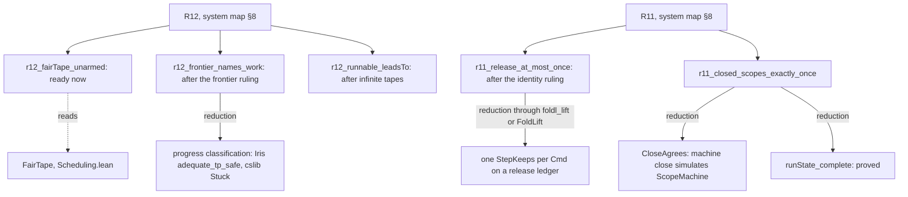

# 2026-10-04 Reference scout: semantics libraries

Status: research note (history, not authority). Base: `53640d85` on `refactor/phase1-phase3`.
Seat: semantics libraries. Every claim about a reference project has the evidence word
**reading**: no Lean process ran, nothing was built, and `#print axioms` was not run. A claim
marked "not read" was not checked.

## 1. The one thing the coordinator must know first

- None of the four libraries can be a dependency of `Effect4` or `Test`, and no proof can be
  pasted from them.
  - cslib and loom need Mathlib.
  - iris-lean and veil use `Classical.choice` directly.
  - veil trusts SMT answers by default.
  - In this toolchain `grind`'s `intro` step proves any goal other than `False` through
    `Classical.byContradiction` (§3.2).
- What is worth taking is vocabulary. cslib's transition-system, simulation, fairness and
  stuck-state definitions are the words the R12 goals need. They are small enough to copy with
  rewritten proofs.
- `Std.Do` and `mvcgen` do not fit R11 over the whole run, R12, or R13's congruence half. The
  machine is not monadic code, and liveness and two-run congruence lie outside a unary logic of
  terminating programs.
- The first R12 ledger goal can be stated today, and its proof should take hours. It says that
  a fair finite tape (`FairTape`) leaves nothing armed at its end.

## 2. What was read

| Source | Pin | What was read (reading) |
| --- | --- | --- |
| `vendor/refs/cslib` | `v4.33.1`, `98e395a701f2027a413ad24729e1a11a6c772eb4` | `lakefile.toml`; `Cslib/Init.lean`; all of `Cslib/Foundations/Semantics/LTS/` and `Cslib/Foundations/Semantics/FLTS/`; `Cslib/Foundations/Control/Monad/Free.lean` and `Cslib/Foundations/Control/Monad/Free/Fold.lean`; `Cslib/Foundations/Data/PFunctor/Free.lean` (header); `Cslib/Foundations/Data/OmegaSequence/Temporal.lean` and `Cslib/Foundations/Data/OmegaSequence/Defs.lean` (head); `Cslib/Computability/Distributed/FLP/Consensus.lean` and `Cslib/Computability/Distributed/FLP/FairScheduler.lean` (heads); statement lists of `Cslib/Languages/CCS/BehaviouralTheory.lean`, the STLC and Fsub safety and strong-normalisation files under `Cslib/Languages/LambdaCalculus/LocallyNameless/`, `Cslib/Foundations/Relation/Confluence.lean`, `Cslib/Logics/HML/LogicalEquivalence.lean` |
| `vendor/refs/iris-lean` | `v4.33.1`, `ec3bd660b7c19d1f6540d8777cff02925f82114f` | `readme.md`; `Iris/lakefile.toml`, `IrisMath/lakefile.toml`; under `Iris/Iris/ProgramLogic/`: `Language.lean`, `WeakestPre.lean` (definitions and statement list), `Adequacy.lean`, `TotalAdequacy.lean`, `AbstractWeakestPre.lean`, `Lifting.lean` and `EctxLifting.lean` (statement lists); `Iris/Iris/Instances/Lib/Token.lean`; `Iris/Iris/Instances/Lib/GhostVar.lean` (head); `Iris/Iris/BI/MonPred.lean` (head); `Iris/Iris/BI/Lib/Relations.lean` (head); `Iris/Iris/Instances/Classical/Instance.lean` (head); `Iris/Iris/Algebra/Chain.lean` (the completion); grep for classical and trust escapes over `Iris/Iris` |
| `vendor/refs/loom` | `master`, `78928abc9054b31d0bea85985496490baae95244` | `README.md`; `lakefile.lean`; `lean-toolchain`; `Loom/MonadAlgebras/Defs.lean`; `Loom/MonadAlgebras/WP/Basic.lean`; `Loom/MonadAlgebras/WP/Liberal.lean` (head); `Loom/MonadAlgebras/WP/Gen.lean` (head); `Loom/MonadAlgebras/NonDetT/Basic.lean` (head); `Loom/MonadAlgebras/Instances/ExceptT.lean` (head); `Loom/SpecMonad.lean`; grep of `Loom/SMT.lean` |
| `vendor/refs/veil` | `main`, `e82c09071cfa48c94ee298a2e1fed31ea13115a8` | `README.md` (head); `lakefile.lean`; `lean-toolchain`; `Veil/Base.lean` (options); `Veil/Frontend/DSL/Tactic.lean`; `Veil/Core/Tools/ModelChecker/TransitionSystem.lean`; `Veil/Core/Tools/ModelChecker/ExecutionOutcome.lean` (head); `Veil/Core/Tools/ModelChecker/Simulation/Soundness.lean` (head); `Veil/Frontend/DSL/Action/Semantics/Definitions.lean` (first half); `Veil/Frontend/DSL/Action/Semantics/Theorems.lean` (statement list); `Veil/Frontend/DSL/Module/VCGen/Induction.lean` (head); `Veil/Frontend/DSL/Module/Syntax.lean` (property kinds); `Veil/Frontend/DSL/Module/Elaborators/Verification.lean` and `Veil/Frontend/DSL/Module/Elaborators/Core.lean` (trust and default tactics); grep for trust escapes over `Veil` |
| Lean core, `~/.elan/toolchains/leanprover--lean4---v4.33.1/src/lean` | toolchain `leanprover/lean4:v4.33.1` | `Std/Do.lean`; `Std/Do/PostCond.lean` (head); `Std/Do/PredTrans.lean` (head); `Std/Do/WP/Basic.lean` (head); `Std/Do/Triple/Basic.lean` (head); `Std/Do/Triple/SpecLemmas.lean` (statement list, the loop invariant and `Spec.foldlM_list`); `Std/Do/WP/Sound.lean`; `Std/Do/SPred/DerivedLaws.lean` (the classical lemmas and `IsPure`); `Std/Tactic/Do/Syntax.lean` (`Config`, `mleave`, `mvcgen` syntax); the `mvcgen` docstring in `Init/Tactics.lean`; file list of `Lean/Elab/Tactic/Do/`; `Lean/Meta/Tactic/Grind/Util.lean` (`byContra?`) and `Lean/Meta/Tactic/Grind/Intro.lean` (`intro`); `Init/Classical.lean`; `Init/ByCases.lean`. The VC generator's internals under `Lean/Elab/Tactic/Do/Internal/` were **not read** |
| `.lake/packages/effects` | version `0.8.0` (its `lakefile.toml`) | `Effects/Algebra/Program.lean`, `Effects/Algebra/Universal.lean` (statement list), `Effects/Trace.lean` (head) |
| `.lake/packages/batteries` | the estate's pin | `Batteries/Data/List/Basic.lean` (`List.Forall₂`) |
| The estate | `53640d85` | the audit `docs/research/2026-10-04-proof-graph-audit/audit.md`; `docs/core/semantics.md`; `docs/core/system-map.md` (all, §8 closely); `docs/DESIGN-BASIS.md` DB-03 and DB-07; `docs/core/machine-state.md` §7; `docs/research/2026-09-07-lit-papers.md` Q7; the files of §3.0 below |

Not read:

- lean-auto and lean-smt, the SMT bridges that loom and veil require;
- Mathlib;
- the rest of cslib's languages and automata;
- iris-lean's proof mode and HeapLang;
- loom's case studies;
- veil's examples and model-checker internals.

## 3. Findings

### 3.0 The estate machinery the findings map onto (reading)

- `Projects` and `Refines` (`src/Effect4/Laws/Machine/Refinement.lean`): one-step forward
  simulations over `Option`-valued step functions, with `projects_compose` and
  `projects_induces_refines`.
- `BookMeans`, `StepAgrees`, `HooksAgree`, `ReplayRel`, `book_replayEval`, `bookMeans_obs`
  (`src/Effect4/Laws/Machine/Book.lean`): a lockstep relation between two instances of the
  decision machine, lifted from one `driveStep` to every tape.
- `BMeans` (`src/Effect4/Laws/Program/Simulation/Fibers.lean`): the book at the frame and term
  instances; `run_eq_ref` and `replayR_bmeans_reachable` read it.
- `StepKeeps`, `driveState_lift`, `foldl_lift`, `replayEval_lift`, `DecisionLift`, `FoldLift`
  (`src/Effect4/Laws/Machine/Lift.lean`): invariant lifting over a `WorldOrder`, with a later
  world at each step and an admission premise per decision.
- `Typed`, `Protocol`, `Protocol.Le`, `Typed.bind`, `Typed.mono`, `Typed.refine`
  (`src/Effect4/Laws/Effects/Protocol.lean`): a protocol-indexed predicate on the free monad over
  a world preorder.
- `MachineTyped`, `ConfigTyped`, `MachineLive`, `LoadsTyped`, `DecisionKeeps`, `RReachable`,
  `M7Fragment`, `m7_of_ledger` (`src/Effect4/Laws/Program/Typed/Assembly.lean`).
- `Guard.Reachable` and `Guard.executePrefix` (`src/Effect4/Laws/Program/Guard/Core.lean`): a
  `foldl` of `steppedBy` (`src/Effect4/Program/Admit.lean`) over `(budget, decision)` pairs from
  `Api.load`.
- `FairTape`, `Services`, `flush_fair` (`src/Effect4/Laws/Machine/Scheduling.lean`): fairness
  on finite tapes. A grep finds no theorem that reads `FairTape`.
- `frontierReasons` (`src/Effect4/Api/Frontier.lean`) and `awaitDecision_iff`
  (`src/Effect4/Laws/Api/Frontier.lean`).
- `ScopeMachine.runState_complete`, `runState_restore`, `runState_result`,
  `respond_rejects_wrong_id` (`src/Effect4/Laws/Machine/ScopeMachine.lean`).
- The `Std.Do` uses: `Conform.Spec.Reflect` (`tools/Conform/Spec/Reflect.lean`, tools only);
  `checkTyping_spec` (`src/Effect4/Laws/Program/Typing/Check.lean`) and `mapM_ofVal_spec`
  (`src/Effect4/Laws/Store/CanonicalSpec.lean`, closed by `mvcgen`). Both law modules are imported
  by `src/Effect4/Laws.lean`, and `Test/Audit/AxiomGate.lean` names neither, so the gate holds
  them at the ceiling whenever it runs.

### 3.1 Question (a): the libraries' abstractions against the ten concepts

Each row names the generic definition, the estate's counterpart, and what the generic theory
would give. "Concept" uses the ids of `docs/core/semantics.md` §1.

Path legend for this table. A cslib path that starts with `LTS/` or `FLTS/` is under
`vendor/refs/cslib/Cslib/Foundations/Semantics/`, and one that starts with `Cslib/` is under
`vendor/refs/cslib/`. An Iris path is under `vendor/refs/iris-lean/Iris/Iris/`. A veil path is
under `vendor/refs/veil/Veil/`. A loom path is under `vendor/refs/loom/Loom/MonadAlgebras/`. A
`Std/` path is under the toolchain's `src/lean/`.

| Abstraction | Generic definition (file, declaration) | Estate counterpart | Concept | What it gives the estate |
| --- | --- | --- | --- | --- |
| Labelled transition system, multistep runs | cslib `LTS`, `LTS.MTr`, `CanReach`, `generatedBy` (`LTS/Basic.lean`); `FLTS`, `FLTS.mtr` (a `foldl`), `FLTS.toLTS`, `toLTS_deterministic`, `toLTS_mtr` (`FLTS/Basic.lean`, `FLTS/FLTSToLTS.lean`); veil `RelationalTransitionSystem`, `reachable` (`Core/Tools/ModelChecker/TransitionSystem.lean`); Iris `Language`, `Language.Step`, `NSteps` (`ProgramLogic/Language.lean`) | `stepDecisionState`, `replayEval`, `steppedBy`, `Guard.executePrefix`, `Guard.Reachable`, `RReachable` | reactive-scheduling | `executePrefix p table m h` is `FLTS.mtr` of the functional system `m ↦ (fuel, d) ↦ steppedBy p fuel table m d`: the same `foldl`. So `Guard.Reachable` is cslib's `CanReach` from `Api.load` (through `toLTS_mtr`), and determinism holds by construction. INV-TAPE-1 would become an instance, not prose |
| Invariants, inductive invariants | cslib `TrInv`, `MTrInv`, `mtrInv_of_trInv` (`LTS/Basic.lean`); veil one VC per action with the assembled invariant as precondition (`Frontend/DSL/Module/VCGen/Induction.lean`), `reachable_inclusion`; Iris `wptp_preservation`, `wp_invariance_gen` (`ProgramLogic/Adequacy.lean`) | `StepKeeps`, `driveState_lift`, `foldl_lift`, `replayEval_lift`, `DecisionLift`, `FoldLift` | reactive-scheduling | Nothing new in the theory. The estate's lifts carry a monotone ghost world and an admission premise; cslib's `mtrInv_of_trInv` has neither. Veil adds a workflow: a VC matrix of action × clause with a counterexample to induction |
| Simulation, bisimulation, trace equivalence | cslib `IsSimulation`, `Similarity`, `IsSimulation.comp`, `IsSimulation.sim_trace` (`LTS/Simulation.lean`); `IsBisimulation`, `Bisimilarity`, `IsBisimulation.comp`, `IsBisimulation.traceEq`, `Bisimilarity.deterministic_bisim_eq_traceEq`, `Deterministic.bisim_tfae` (`LTS/Bisimulation.lean`); `TraceEq`, `Deterministic.isSimulation_traceEq` (`LTS/TraceEq.lean`) | `Projects`, `Refines`, `projects_compose`, `projects_induces_refines`, `BookMeans`, `ReplayRel`, `book_replayEval`, `run_eq_ref` | translation-simulation | (1) `Refines related stepC stepM` yields `IsSimulation` on the system labelled by (operation, answer), plus refusal reflection (its `frontier` field). (2) `book_stepDecisionState` and `book_replayEval`, with determinism on both sides, would make the book a bisimulation of the decision systems: a candidate theorem, not checked. `deterministic_bisim_eq_traceEq` would then turn lit-papers Q7's "bisimulation-strength because of INV-TAPE-1" into a statement with a proof. (3) Composition is generic. The three equal-observation theorems relate different pairs on different fragments (`Straight`, `Looped`, the empty table), so a composite needs one label alphabet and one fragment |
| Up-to techniques, weak (stuttering) simulation | cslib `IsBisimulationUpTo`, `IsBisimulationUpTo.isBisimulation`; `HasTau`, `saturate`, `IsWeakBisimulation`, `IsSWBisimulation`, `isWeakBisimulation_iff_isSWBisimulation` (`LTS/HasTau.lean`, `LTS/Bisimulation.lean`) | none. `docs/core/machine-state.md` §7: id renaming and stuttering simulation are "not provided automatically". R10: a composite owes its contract "by a stuttering route" | translation-simulation | The single-step challenge criterion for weak bisimulation (cslib cites Sangiorgi, lemma 4.2.10). This is the tool R10's stuttering route needs, and the one §7 lists as missing |
| Executions, infinite executions, divergence | cslib `Execution`, `OmegaExecution`, `OmegaExecution.extract_mTr`, `Divergent`, `DivergenceFree`, `Total` (`LTS/Execution.lean`, `LTS/OmegaExecution.lean`, `LTS/Divergence.lean`, `LTS/Total.lean`); veil `ExecutionResult.divergence` (`Core/Tools/ModelChecker/ExecutionOutcome.lean`) | `replayEval_append`, `replayEval_append_machine` (`src/Effect4/Laws/Machine/Approximation.lean`); DB-03: "no infinite tape is defined" | reactive-scheduling | The shape of an infinite run: states and labels indexed by `Nat`, with `∀ i, Tr (ss i) (μs i) (ss (i+1))`. Finite prefixes of it are runs (`extract_mTr`), which is DB-03's chain of compatible prefixes |
| Fairness and temporal operators | cslib FLP `ProcFair`, `ProcFaulty`, `FairRun`, `AdmissibleRun`, `ProcTermination`, `Algorithm.Termination` (`Cslib/Computability/Distributed/FLP/Consensus.lean`); `ωSequence.Step`, `ωSequence.LeadsTo`, `leadsTo_trans`, `until_frequently_leadsTo_and` (`Cslib/Foundations/Data/OmegaSequence/Temporal.lean`) | `FairTape`, `Services`, `FiredWithin`, `flush_fair` | reactive-scheduling | Statement shapes for R12's liveness: fairness as "every pending request is eventually serviced", liveness as `LeadsTo`, termination quantified over admissible infinite runs |
| Stuck states, progress, deadlock | cslib `Stuck` with a `Terminated` parameter, `MayTerminate`, `Bounded`, `Terminating`, `Acyclic` (`LTS/Termination.lean`, `LTS/Basic.lean`); Iris `PrimStep.Stuck`, `NotStuck`, `adequate_tp_safe` (`ProgramLogic/Language.lean`, `ProgramLogic/Adequacy.lean`); veil `deadlock` in `Trace.witnessesSimulationViolation` (`Core/Tools/ModelChecker/Simulation/Soundness.lean`) | `machineTyped_not_halted`, `MachineLive`, `frontierReasons`, `awaitDecision_iff`; registry claim `scheduler-progress` (absent) | reactive-scheduling | Progress as "every reachable configuration is terminated or can step" (Iris `adequate_tp_safe`). Deadlock as "no successful step, no failing step, and not terminated" (veil). Both name what the absent `scheduler-progress` claim asks for |
| Program logics, weakest preconditions | `Std.Do` `WP`, `PredTrans`, `Triple`, `Spec.*` (`Std/Do/`); loom `MAlg`, `MAlgOrdered`, `MAlgDet` (`Defs.lean`), `wp`, `triple`, `wp_bind`, `triple_bind` (`WP/Basic.lean`), `wlp` (`WP/Liberal.lean`), `NonDetT` (`NonDetT/Basic.lean`); Iris `wp`, `wp_bind`, `wp_mono`, `wp_frame_l` (`ProgramLogic/WeakestPre.lean`), `LawfulAbstractWP`, `BindAbstractWP` (`ProgramLogic/AbstractWeakestPre.lean`) | `Typed`, `Typed.bind`, `Typed.mono`, `Typed.widen`, `Protocol.Le`, `Typed.refine`; `TypedProg` (not closed under bind, `E4-TYPED-CE-030`); `checkTyping_spec`, `mapM_ofVal_spec` | residual-program-typing | Iris's `LawfulAbstractWP` and `BindAbstractWP` are a checklist of the laws a WP-like judgment meets. The generic `Typed` meets the bind law; `TypedProg` refutes it. No library supplies the connecting theorem that `docs/core/semantics.md` §1.1 says a WP reading would need |
| Kripke worlds, monotone predicates | Iris `BiIndex`, `MonPred` (monotonicity is the field `monPred_mono`), `MonPred.upclosed` (`BI/MonPred.lean`) | `WorldOrder`, `Mono`, `World.leHost`; 85 theorems named `*_mono` under `src/Effect4/Laws` (a grep count, not a census; not all are world monotonicity) | store-typing | Monotonicity proved once, when the predicate is built. An idea only |
| Adequacy, the fundamental property | Iris `wp_strong_adequacy_gen`, `wp_adequacy_gen`, `adequate` (`adequate_result`, `adequate_not_stuck`), `wp_invariance_gen` (`ProgramLogic/Adequacy.lean`), `twp_total` (`ProgramLogic/TotalAdequacy.lean`); cslib STLC `soundness` over `semanticMap` and `strong_norm` (`Cslib/Languages/LambdaCalculus/LocallyNameless/Stlc/StrongNorm.lean`, statement list) | `DenotesTyped`, `denoteR_typed` (M5's fundamental property); `m7_of_ledger`; `M7Exits`, `M7Stores`, `M7NoHalt` | translation-simulation, residual-program-typing | Shape confirmation. M7 has the shape of Iris's `adequate`: every result fits (`M7Exits`, `M7Stores`) and the run never halts (`M7NoHalt`). Iris adds the progress corollary `adequate_tp_safe`, which the estate lacks |
| Exclusive resources, at most once | Iris `token`, `token_alloc`, `token_exclusive` (`Instances/Lib/Token.lean`) | `AcceptedOnce` (`src/Effect4/Program/Admit.lean`); `respond_rejects_wrong_id`; `close_idempotent` | scope-lifetime-finalization | The idea behind R11's "at most once per registration": a release consumes something that exists once. In plain Lean this is a release ledger with `Nodup` |
| Exact embedding shape | Iris `ToVal` (`toVal_coe`, `coe_of_toVal_eq_some`, `ProgramLogic/Language.lean`) | K2 (`docs/core/system-map.md` §5) | exact-codecs | `ToVal` is a K2 pair with the identity normaliser. No action |
| Free monad and its universal property | cslib `FreeM`, `FreeM.liftM`, `Interprets.iff` (`Cslib/Foundations/Control/Monad/Free.lean`), `foldFreeM_unique` (`Cslib/Foundations/Control/Monad/Free/Fold.lean`); `PFunctor.FreeM` (`Cslib/Foundations/Data/PFunctor/Free.lean`) | `Effects.Program`; `program_is_free`, `program_is_initial_in_models`, `interpret_isMonadMorphism` (`.lake/packages/effects/Effects/Algebra/Universal.lean`); `hom_eq_cata_eff` | initial-algebras-folds | Nothing new. `Effects.Program` already has `PFunctor.FreeM`'s shape (shapes `Op`, positions `Answer op`) and its universal property |

Three concepts have no counterpart in any of the four libraries: subtyping-algebra,
context-requirements, and the codec half of exact-codecs. The concept host-session-protocol has
one weak analogy. Veil's `Mode.external` reads a `require` as an assumption the environment owes,
as the estate reads host progress (`docs/core/host-boundary.md`).

### 3.2 Question (b): adoptable under the axiom gate?

| Library | Requires (lakefile) | Toolchain | Classical or trust escapes found (reading) | Dependency of `Effect4` or `Test` | In `tools/` | Pattern worth copying |
| --- | --- | --- | --- | --- | --- | --- |
| cslib | Mathlib `v4.33.1`; `Cslib/Init.lean` publicly imports `Mathlib.Init` and `Mathlib.Tactic.Common` | v4.33.1 | `grind` on most semantics files (grep, attribute lines included: 38 lines of `Cslib/Foundations/Semantics/LTS/Basic.lean`, 33 of `LTS/Bisimulation.lean`); `Classical.choose` in `chooseFLTS` (`LTS/Total.lean`); `by_contra!` and Mathlib filters in `Cslib/Foundations/Data/OmegaSequence/Temporal.lean` | no | no use | yes: the definitions are small; every proof must be rewritten without `grind` |
| iris-lean | Qq and batteries `v4.33.0` (`Iris/lakefile.toml`); Mathlib only for `IrisMath` (`IrisMath/lakefile.toml`) | v4.33.1 | `Classical.choose` in the COFE completion (`exists_limit`, `diagonal`, `Iris/Iris/Algebra/Chain.lean`); `Classical.axiomOfChoice` in `Iris/Iris/Algebra/Functions.lean` and `Iris/Iris/Algebra/Heap.lean`; `grind` in 72 files (grep, attribute lines included), among them `Iris/Iris/ProgramLogic/Adequacy.lean`; `unsafe` meta code in `Iris/Iris/ProofMode/SynthInstanceAttr.lean` | no | no use | ideas: the `adequate` structure, token exclusivity as a ledger, `MonPred` bundling, the WP law checklist |
| loom | Mathlib `v4.24.0`; lean-auto; downloads z3 and cvc5 (`lakefile.lean`) | v4.24.0 | `open Classical` in `LE.pure` (`Loom/MonadAlgebras/Defs.lean`); external SMT solvers (`Loom/SMT.lean`); lean-auto's trust model not read | no | no: wrong toolchain, external oracles | ideas only: monad algebras, demonic and angelic WP, the determinism class |
| veil | lean-smt, Loom (branch `v4.32.0-for-veil`), batteries, aesop, ProofWidgets; a NodeJS widget build (`lakefile.lean`) | v4.32.0 | `veil.smt.trust` defaults to `true` (`Veil/Base.lean`), so unsat answers stand in for proofs and `trustedSmtWarning` counts VCs whose proof has `sorry`; the default assumption check is `first \| decide \| native_decide` (`Veil/Frontend/DSL/Module/Elaborators/Core.lean`); `open Classical` for proof reconstruction (`Veil/Frontend/DSL/Tactic.lean`) | no | no | ideas: the VC matrix with stubs for undischarged VCs, violation kinds, "a reported violation is witnessed by a valid trace" |
| `Std.Do`, `mvcgen` | in the toolchain | v4.33.1 | `Classical.skolem` in the `WPSound` instances for `ReaderT` and `StateT` (`Std/Do/WP/Sound.lean`); `SPred.pure_imp` (a `by_cases` split, which opens `Classical`) and `SPred.pure_forall` (`Classical.not_not`), both used by `IsPure` instances (`Std/Do/SPred/DerivedLaws.lean`); the `mvcgen` docstring suggests `with grind` | already used, under the gate | already used | yes, as today: specifications of `Option`- and `Except`-valued checkers |

**`grind` and the gate.** `grind`'s `intro` action (`Lean/Meta/Tactic/Grind/Intro.lean`) calls
`Lean.MVarId.byContra?` (`Lean/Meta/Tactic/Grind/Util.lean`) once the hypotheses are in. That
function assigns the goal through `Classical.byContradiction` whenever the target is not
`False`. `Classical.byContradiction` decides by `Classical.propDecidable` (`Init/Classical.lean`).
So a copied `grind` proof is expected to fail the axiom gate. This is reading; `#print axioms`
was not run. The estate has no `grind` today (grep over `src`, `Test` and `tools`: none).

**`Std.Do` stays usable.** The estate's two gated uses, one closed by `mvcgen`, show that a
`Std.Do` proof can stay at the ceiling. That holds if the gate passed at its last sweep, which
this note did not check. A new `Std.Do` proof should avoid proof-mode steps that use `IsPure` at
`→` or `∀`, and the `WPSound` instances for `ReaderT` and `StateT`. Read its axiom output before
landing.

### 3.3 Question (c): `Std.Do` and `mvcgen` for R11, R12 and R13

**What `Std.Do` is (reading).**

- A weakest-precondition interpretation `WP m ps` maps a monadic program to a conjunctive
  predicate transformer (`PredTrans`, `Std/Do/PredTrans.lean`).
- `Triple x P Q` is `P ⊢ₛ wp⟦x⟧ Q` (`Std/Do/Triple/Basic.lean`).
- A `PostShape` has one argument layer per `StateT` and one exception barrel per `ExceptT`
  (`Std/Do/PostCond.lean`).
- Loops take an `Invariant` over a `List.Cursor`, a prefix and a suffix of the list
  (`Spec.forIn_list`, `Spec.foldlM_list`, `Std/Do/Triple/SpecLemmas.lean`).
- `WPSound` connects a proved `wp` to what a program may return (`Std/Do/WP/Sound.lean`).
- `mvcgen` splits a triple into verification conditions. It uses the `@[spec]` lemma keyed on
  each program head, and the `invariants` clause for loops (`Std/Tactic/Do/Syntax.lean`,
  `Init/Tactics.lean`).

**What fits and what does not.**

| Requirement | Hoare-style triple possible? | Cost | Why |
| --- | --- | --- | --- |
| R11 at one close | yes: `Scope.closeExitsM` (`src/Effect4/Machine/Scope.lean`) is `closeOrder.mapM` in any monad | hours | Redundant. `runState_complete` already states the exact result as an equation, which is stronger than a triple |
| R11 over the whole run | only by wrapping the machine | a wave | `driveStep`, `driveState`, `stepDecisionState` and `replayEval` (`src/Effect4/Machine/Fibers.lean`) are plain recursive functions, not `do` code. A triple over `Id.run` restates the pure claim. A `StateM` rewrite of the step would be a second spelling of the machine, owing an agreement theorem, and would gain nothing over `FoldLift` |
| R12 frontiers, progress | the finite parts are state predicates; no gain | none | `frontierReasons` and `FairTape` are predicates on machines and tapes. A triple would wrap them in `Id` |
| R12 liveness, divergence | no | n/a | `Std.Do` reasons about one terminating run: assertions before and after, success and exception barrels. It has no infinite executions, fairness or temporal operators |
| R13 congruence | no | n/a | Congruence compares two runs, and `Std.Do` is unary. Once every input is an argument of the replay function, congruence is `congrArg`. The work is making the load inputs arguments (the 2026-09-10 Config route B), not a proof |
| R13 admission ("supplied values fit the admitted load requirements") | yes | a slice, after Config lands | `Config.load` returns `Answer := Except (SourceError Name) (Option Node)` (`src/Effect4/Program/Config.lean`). An `Except` triple with a membership post is the `checkTyping_spec` pattern; `reflect_spec` and `harvest_specs` (`tools/Conform/Spec/Reflect.lean`) generate the leaf specifications |
| A user's program | yes, over `meaning` | owner question | `meaning` runs `Effects.interpret storeHandler` in `StateT Stores Id` (`src/Effect4/Laws/Program/Denote.lean`), and `interpret_isMonadMorphism` makes binds compose. This verifies one program on the `Straight` fragment, not the metatheory |

The `mvcgen` docstring suggests ending with `with grind` or `try grind`. Neither fits here:
`grind` reaches `Classical.choice`, and `AGENTS.md` bans a hand-written `try`. `mvcgen`'s own
pipeline (`mleave`, `mvcgen_trivial`) needs no such ending.

### 3.4 Question (d): candidate first ledger goals, phrased as the libraries would

The shapes below are not checked. Binders, instances and universes need fixing in the slice
that declares them, because `ProofGraph.Obligation` takes a closed proposition (`readGoal`,
`addWanted`, `tools/ProofGraph/Ledger.lean`).



**R12-a, ready now: a fair finite tape leaves nothing armed.** The shape follows cslib FLP's
`FairRun` and `ProcFair`, on a finite tape. `FairTape`'s docstring already says "The final
prefix therefore cannot leave an outstanding armed owner."

```lean
-- at the frame machine (NativeMachine), as Guard.Reachable is stated
theorem r12_fairTape_unarmed : ProofGraph.Obligation
    (∀ (p : NativeEff) (table : RowTable) (fuel : Nat) (m : NativeMachine)
        (tape : List NativeDecision),
      letI := evaluatorFor p table
      Scheduling.FairTape (interpOf p table) fuel m tape →
      Suffices (interpOf p table) fuel tape m = true →
      (replayEval (interpOf p table) fuel tape m).machine.stuck = none →
      (replayEval (interpOf p table) fuel tape m).machine.armed = []) := ⟨⟩
```

The proof instantiates `FairTape` at `pre := tape` and `suffix := []`, so every armed owner needs
`[] = before ++ decision :: after`, which is impossible. Placement:

1. Concept reactive-scheduling. It serves the absent claim `fair-scheduling` ("Progress under
   weak fairness", `tools/Tools/SemanticsRegistry.lean`), and it gets a claim of its own.
2. Question: a new registry claim, for example `fair-tape-drains-armed`, role `.progress`.
3. Reach: finite tapes, the frame machine (`NativeMachine`), a tape whose decisions suffice, and
   a final machine that has not halted.
4. It does not establish liveness on infinite tapes, termination, host progress, or that the
   frontier names the remaining waits.
5. It serves R12. It is the finite half of "liveness under `FairTape`".

**R12-b, after a ruling: the frontier names armed work.** cslib phrases a stuck state with a
parameter for what counts as finished: `Stuck s := ¬Terminated s ∧ ¬∃ μ s', Tr s μ s'`. Iris
phrases progress as "all threads are values, or some step exists" (`adequate_tp_safe`). R12 asks
that `Deadlocked` require nothing armed. Today `awaitDecision_iff` puts `.awaitDecision` in the
frontier exactly when the tape ran out and `hasRunnable` holds. So a machine with armed work and
no runnable fiber shows no reason for that work. A goal "every non-deadlocked, unfinished machine
has a non-empty frontier" is then expected to be false (reading, not tested). It needs a ruling
on the frontier alphabet first.

```lean
def Deadlocked (m : NativeMachine) : Prop :=   -- R12: requires nothing armed
  m.stuck = none ∧ m.finished = false ∧ m.armed = [] ∧ hasRunnable m = false ∧
    hostReasons m = [] ∧ timerReasons m = [] ∧ compileReasons m = []
theorem r12_frontier_names_work : ProofGraph.Obligation
    (∀ p table cf answers m, Guard.Reachable p table cf answers m →
      m.stuck = none → m.finished = false → ¬ Deadlocked m →
      frontierReasons .tape m ≠ [])
```

**R12-c, after a ruling on infinite tapes.** Runnable work leads to an exit or an external wait.
cslib gives the run (`OmegaExecution`), fairness (`ProcFair`) and liveness (`LeadsTo`).

```lean
def InfiniteRun (interp) (fuel) (ms : Nat → RunMachine …) (ds : Nat → RunDecision …) : Prop :=
  ∀ i, (ms i).stuck = none ∧ stepDecisionState interp fuel (ms i) (ds i) = (ms (i + 1), true)
def WeaklyFair (interp) (fuel) (ms) (ds) : Prop :=        -- FLP ProcFair, per armed owner
  ∀ owner k, owner ∈ (ms k).armed → ∃ j, k ≤ j ∧ Services interp fuel (ms j) owner (ds j) = true
-- goal: under InfiniteRun and WeaklyFair (and the owner's row-specific enabling),
-- every runnable fiber LeadsTo (exited ∨ parked on a host or timer wait)
```

The infinite tape is a proof-side function `Nat → RunDecision`, never stored data. cslib's
`Total.extend_omegaExecution` builds such runs by `Classical.choose`; do not copy that.

**R11-a, already proved, as planning nodes.** One close runs every finalizer once, in close
order, with the scope closed first: `runState_complete`, `runState_restore`, `runState_result`,
`runState_scope`. A stale or future response cannot consume a request:
`respond_rejects_wrong_id`.

**R11-b, after a ruling on identity: at most one release per registration.** Iris states
exclusivity as `token γ ∗ token γ ⊢ False` (`token_exclusive`). In plain Lean that is a release
ledger with `Nodup`, carried by the estate's own lift through a ghost world ordered by prefix:

```lean
-- `releases m`: the registration identities released in `m`'s run; defined after the ruling
theorem r11_release_at_most_once : ProofGraph.Obligation
    (∀ root rootTy fuel tape, M7Fragment root rootTy tape →
      (releases (Api.replay root.program fuel tape).machine).Nodup)
-- reduction edge, the m7_of_ledger pattern:
-- r11_of_steps : (∀ ts, StepKeeps prefixOrder interp (Guarded ReleaseOk …)) → r11 statement
```

The gap: `RunEvent.finalizerProgram` (`src/Effect4/Machine/Fibers.lean`) and
`FrameEvent.ranFinalizer` (`src/Effect4/Machine/Frames.lean`) carry the finalizer's name
(`FinName`), not the registration's identity. A scope is `ScopeV := Effect4.Scope Nat FinName …`
(`src/Effect4/Machine/Stores.lean`), so the identity would be a scope key with a finalizer key.
The per-command obligations then form veil's VC matrix: one `StepKeeps` per `Cmd` constructor
for the clause `ReleaseOk`, as the M6 ledger did.

**R11-c: exactly once, in close order, over closed scopes.** It reduces to `runState_complete`
plus one connector, `CloseAgrees`: the machine's close path simulates `ScopeMachine.runState`.
`ScopeMachine`'s docstring leaves "frame/host agreement and interruption" open, so `CloseAgrees`
is a simulation obligation in the sense of §3.1, row 3.

## 4. Ranked recommendations

Paths in this table are under `vendor/refs/<repo>/` for the references and under the
toolchain's `src/lean/` for `Std/`.

| # | What to do | Learn from | Estate file it would change | Adoption | Semantic impact | Cost |
| --- | --- | --- | --- | --- | --- | --- |
| 1 | Declare R12-a (`r12_fairTape_unarmed`) as the first ledger goal with its five placement facts, prove it, and add its registry claim | cslib `Cslib/Computability/Distributed/FLP/Consensus.lean` (`FairRun`, `ProcFair`); estate `FairTape` | a new ledger module beside `src/Effect4/Laws/Machine/Scheduling.lean`; `tools/Tools/SemanticsRegistry.lean` | idea | proof-side | hours |
| 2 | Copy cslib's transition-system vocabulary into one law module: `LTS`, `MTr`, `CanReach`, `Deterministic`, `FLTS.mtr`, `IsSimulation`, `IsBisimulation`, `TraceEq`, `HasTau` saturation, `IsSWBisimulation`, `IsBisimulationUpTo`, `OmegaExecution`, `Stuck`. Rewrite every proof without `grind`. Add three connectors: `Guard.Reachable` as `CanReach`; `Refines` as `IsSimulation`; the book as `IsBisimulation`, with the determinism instance | cslib `Cslib/Foundations/Semantics/LTS/{Basic,Simulation,Bisimulation,TraceEq,HasTau,OmegaExecution,Termination}.lean`, `Cslib/Foundations/Semantics/FLTS/{Basic,FLTSToLTS}.lean` | a new `src/Effect4/Laws/Machine/` module (name for the owner); connectors beside `src/Effect4/Laws/Machine/Refinement.lean` and `src/Effect4/Laws/Machine/Book.lean` | copy-pattern | proof-side | a slice |
| 3 | State R11-b and R11-c as ledger goals with their reduction edges: a ghost release ledger through `foldl_lift` or `FoldLift`, and `CloseAgrees` toward `runState_complete` | iris-lean `Iris/Iris/Instances/Lib/Token.lean` (`token_exclusive`); veil `Veil/Frontend/DSL/Module/VCGen/Induction.lean`; estate `AcceptedOnce` | a new ledger module under `src/Effect4/Laws/Machine/`; `tools/Tools/SemanticsRegistry.lean` (concept scope-lifetime-finalization) | idea | proof-side; a machine change if identity goes into the trace events | a slice to state; a wave to prove |
| 4 | After the frontier ruling, state R12-b and fill the absent `scheduler-progress` claim with the progress classification | iris-lean `Iris/Iris/ProgramLogic/Adequacy.lean` (`adequate`, `adequate_tp_safe`); cslib `Cslib/Foundations/Semantics/LTS/Termination.lean` (`Stuck`); veil `Veil/Core/Tools/ModelChecker/Simulation/Soundness.lean` (`deadlock`) | `src/Effect4/Api/Frontier.lean` (the reason alphabet), `src/Effect4/Laws/Api/Frontier.lean`, the registry | idea | changes-judgments: the frontier observation changes, and `HostProtocol.observe` too if the repair goes through `hasRunnable` | a slice |
| 5 | Give the ledger a generator of goal stubs for an invariant: one `Obligation` per (command, clause), reported with its counterexample when refuted | veil `Veil/Frontend/DSL/Module/VCGen/Induction.lean` (per-action VCs), `addUndischargedTheoremSuggestion` (`Veil/Frontend/DSL/Module/Elaborators/Verification.lean`) | `tools/ProofGraph/`, `src/Effect4/Laws/Auto/Obligations.lean` | idea | tooling-only | a slice |
| 6 | Keep `Std.Do` for `Option`- and `Except`-valued checkers. When Config lands, state R13's admission half as an `Except` triple over `Config.load` | `Std/Do/Triple/SpecLemmas.lean`, `Std/Do/WP/Sound.lean` (`Except.of_wp_eq`); estate `checkTyping_spec`, `tools/Conform/Spec/Reflect.lean` | the law module of `src/Effect4/Program/Config.lean` (to be named) | library-dependency (core, already imported) | proof-side | a slice, after Config |
| 7 | Later, consider bundling world monotonicity into the world-indexed predicates, as Iris's `MonPred` does | iris-lean `Iris/Iris/BI/MonPred.lean` | `src/Effect4/Laws/Program/Typed/` | idea | proof-side | a wave (it touches many statements) |

Recommendation 2 supplies the vocabulary for R12-c and for R10's stuttering route. It also gives
lit-papers Q7's informal claim about `run_eq_ref` a candidate theorem. Recommendation 1 needs
none of it and can go first.

## 5. What not to borrow, and why

- No dependency on cslib: it brings Mathlib through `Cslib/Init.lean`, and its proofs use `grind`.
- No dependency on iris-lean: its algebra uses `Classical.choose`, its adequacy proofs use
  `grind`, and its step-indexed logic answers a question the estate does not have. `Fits` has no
  arrow clause and needs no step index (`docs/core/semantics.md` §2.1).
- No dependency on loom: it pins Lean `v4.24.0` and Mathlib `v4.24.0`, and calls z3 and cvc5.
- No dependency on veil: it trusts SMT answers by default, falls back to `native_decide`, pins
  Lean `v4.32.0`, and needs a NodeJS build.
- No pasted `grind` proof from any of them: `grind` decides the goal classically (§3.2).
- No monadic rewrite of the machine to suit `mvcgen`: it is a second spelling of the step, and
  the triples it buys restate pure facts.
- No `with grind` or `try` endings from the `mvcgen` docstring.
- No `IsPure` steps at `→` or `∀`, and no `ReaderT` or `StateT` `WPSound`, in gated proofs.
- No replacement of `foldl_lift`, `DecisionLift` or `FoldLift` by cslib's `TrInv` and `MTrInv` or
  veil's reachability induction: the estate's lifts are strictly more general.
- No separation logic, ghost-state algebra or invariant masks for R11: the token idea is enough,
  as a `Nodup` ledger.
- No `NonDetT` demonic weakest precondition as a meaning for tapes. DB-03 keeps meaning
  relational over explicit tapes, and a second semantics would owe its own agreement.
- No `chooseFLTS` or `Total.extend_omegaExecution` for infinite runs: both use `Classical.choose`.
- No switch from `ListRel` to Batteries' `List.Forall₂`: Batteries defines it with one lemma,
  `forall₂_cons` (`Batteries/Data/List/Basic.lean`), so nothing is gained.

## 6. Questions only the owner can answer

1. Is `r12_fairTape_unarmed` the first R12 ledger node? Is `FairTape` the fairness R12 means, or
   should fairness be per-row enabling on infinite tapes?
2. What is a registration's identity for R11? Should the release events carry a scope key and a
   finalizer key (a machine change), or should the proof keep a ghost ledger (proof-side only)?
3. Should the frontier alphabet name armed work, by a new `FrontierReason` or by a change to
   `hasRunnable`, before any R12 classification goal is declared?
4. Should a generic transition-system module enter the law graph? Where: `src/Effect4/Laws/Machine/`
   or the `effects` package? `src/Effect4/Laws/Effects/Protocol.lean` keeps a free-monad law in
   the estate "until the algebra takes it", which is a precedent for either answer.
5. May a proof-side infinite tape (`Nat → RunDecision`) state R12's liveness and divergence
   clauses? DB-03 says no infinite tape is defined yet.
6. Is verifying one user program's meaning, by `Std.Do` triples over `meaning`, in scope for the
   application face?

## 7. What this note does not establish

- No reference claim was run or built; every one is reading.
- The axiom findings are read off the sources. No `#print axioms` ran on any reference
  declaration.
- The goal shapes in §3.4 are not checked. R12-b is expected to be false today, and that
  expectation is not tested.
- Costs are estimates by reading, not measurements.
