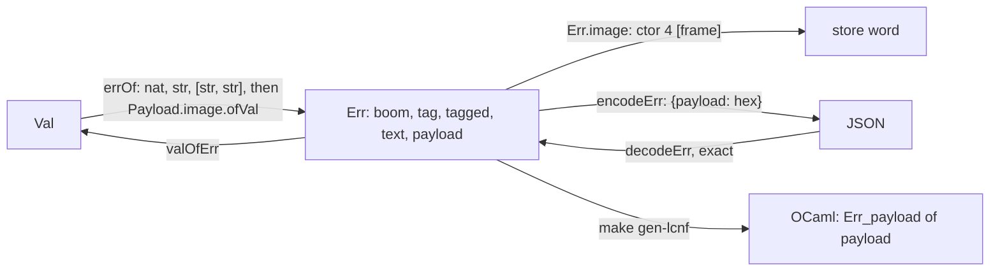

# 2026-10-04 seat E1 receipt: the error payload carrier (decisions row 120, part E1)

Status: receipt (history, not authority). Branch `seat/e1`, worktree
`/Users/pooks/Dev/lean4-effect4-e1`. Brief: the coordinator's seat E1 brief. Three course
corrections followed it: T1's deletions in `MeaningSound.lean`, a merge of `refactor/phase1-phase3`
at T1, and one at T0. Plan: `docs/research/2026-10-04-claude-lead/error-payloads-plan.md`
§3, part E1.

**The one thing to know before merging.** `seat/e1` already contains `refactor/phase1-phase3` at
`69686dd6` (seats T1 and T0), and every gate ran on the merged head `37aa85eb`. If that branch has
moved, merge it and regenerate; never hand-merge a generated file. This branch re-cut the derived,
lcnf and ts groups, `generated/semantics.md` (`make gen-semantics`) and
`Test/fixtures/proof-style/baseline.tsv` (`make record-proof-style`).

**What part E2 must know.** The TypeScript printer refuses a payload by name only where it sees
one. It refuses `fail` of a record construction (a template row). It refuses a declaration whose
error column holds a tagged record (`declarationType`). A payload failed from a bound variable
still prints as an expression. A payload handled inside, or reified by `exit`, prints as an
expression and as a declaration. §8's probe measures the routes, and
`Test/Codegen/PrintContract.lean` pins the bound-variable one.

## 1. Base and head

| Item | Commit |
| --- | --- |
| Base | `2531127d` |
| The carrier, the checker, the codec, the printer's refusal, the batteries | `28ee85ff` |
| The faces: the OCaml engine, its mirrors, the TypeScript table | `c8666c69` |
| The authorities and the registry | `6ebf0f9e` |
| Merge of `refactor/phase1-phase3` at `9b9c42e5` (seat T1) | `fd0f76ad` |
| After it: the proof-style baseline, the semantics report, the printer boundary pin | `6a2f1658` |
| Merge of `refactor/phase1-phase3` at `69686dd6` (seat T0) | `a79de6c5` |
| After it: three lemmas with no consumer deleted, the report regenerated | `14cbe78e` |
| Two docstrings name the consumers the code has | `37aa85eb` (the gated head) |
| This receipt | the commit after `37aa85eb`; it adds this file only |

## 2. What landed



| Plan item (§3, E1) | What landed |
| --- | --- |
| The carrier | `Payload` (`src/Effect4/Machine/Alphabets.lean`) is a value with a proof of `isPayload`: a record frame (`Record.entries`) holding no handle. `Payload.image` restricts the new identity image `Store.Image.ident` (`src/Effect4/Store/Carrier/Image.lean`) by `Image.subtype`. `Err.payload` is `ctor 4`. `ofErr`, `Err.image`, `Repr` and `Defect.ofError` gain the arm. |
| `errOf`, `valOfErr` | `errOf`'s last arm reads `Payload.image.ofVal` before `boom`. `valOfErr (.payload p) = some p.val` (`src/Effect4/Machine/Term.lean`). |
| The Runner group | `Payload`'s canonical instance is a hand module, `src/Effect4/Store/Domain/PayloadCanonical.lean`, which the group imports (§10, deviation 1). The Runner and Refusals groups are regenerated. |
| The six lemmas, unconditional | `Err.image_handleFree`, `Defect.image_handleFree`, `causeImage_handleFree`, `handles_exitErr`, `valOfErr_keys` and `handles_of_cause` gained no premise. The carrier holds handle-free frames only, by the subtype's proof. |
| The checker | `payloadFieldTy` and `payloadRecordTy` (`src/Effect4/Program/Eff.lean`), and `rawSupportedErrTy`'s record arm. The refusal names `errorPayloadField` or `errorSpelling` (`src/Effect4/Program/Typing/Blame.lean`, §4). |
| The typing proofs | `hasTy_rawSupported_allocation`, `valOfErr_errOf_supported`, `errOf_ne_boom_of_supported` and `errAdmits_errOf` are re-proved over the record arm. `FitsCause`'s failure arm (`CauseFits`) reads the error through `valOfErr`, so it needed no edit. `Denote.sound`'s `fail` arm reaches the record arm through `Typed.valOfErr_errOf_fits`. T1 deleted `valOfErr_validIn` and `causeAdmits_of_forall`. |
| `tagIs` at records | `NativeAtom.tagHit` falls back to `Record.tagHit`, which moved to `src/Effect4/Machine/Record.lean`, below both readers. `NativeAtom.tagHit_record` states it. The atom's TypeScript prelude reads an own `_tag` property. |
| The wires | `Codec.encodeErr` and `decodeErr` with `decodeErr_exact` (§3); the truth wire's `errJson`, `reasonCode` (`103`) and the two session adapters. Host rows keep `failed: [string, string]`. |
| The OCaml engine | `make gen-lcnf`'s four outputs carry `Err_payload of payload`, with `payload = val_`. The hand mirrors `ocaml/engine/e4_engine.ml`, `.mli` and `ocaml/gen/api_check.ml` gain the constructor. |
| The compatibility policy | `Effect4.Machine.Err.payload` in `constructor_additions`; `Effect4.Machine.Payload` in `family_additions` (`Test/fixtures/baseline/66ee4657-supplement-v1.policy.json`). |
| The batteries | p1, p2, p3 and p5 lose their `errorNotAdmitted` pins, and each measures its payload parts (§5). |
| The printer | A table row (`ArgPat.recordTerm`) refuses `fail` of a record construction by name. `declarationType` refuses an error column holding a tagged record (§4, §8). |
| Stale texts | DI-62 points at `Machine/Alphabets.lean` and records row 120. DB-15 records row 120 as ratified. R3's open part names what stays open (§11). |
| Census and policy rows | The position census gains the hook row `Effect4.Machine.Payload.val` (`src/Effect4/Laws/Program/Typed/Sources.lean`). The case-site policy names `payloadFieldTy`, `excludedAt` and `payloadRefusal?`. |

## 3. The payload's images

- **Store word.** `Err.image.toVal (.payload p) = ctor 4 [p.val]`. `ofErr` reads `ctor 4 [v]`
  through `Payload.image.ofVal`, so a frame holding a handle, or a non-frame, reads as `none`.
- **JSON, the closed error image.** `encodeErr (.payload p) = {"payload": payloadHex p}`, the
  lowercase hexadecimal of the payload's canonical bytes (`Payload.image.encode`). `decodeErr`
  reads that spelling only: `payloadOfHex?` re-encodes and compares. So `decodeErr_exact` holds
  with no normaliser. The key `payload` collides with none of `{"boom": null}`, a number, a
  two-string array and a string. Example, `NotFound{id: 9}`:
  `{"payload": "0a000000000000004e0200000000000000000400000000000000180300000000000000045f746167030000000000000002696404000000000000001b0300000000000000084e6f74466f756e6402000000000000000109"}`.
- **Row 10.** Row 10 asks for one `Val → Json`. The closed image adds no fifth: it reuses the
  canonical bytes. At a record error type, the type-directed codec (`Schema.encode`) writes the
  record itself. The hexadecimal serves only where no type directs the JSON: a promoted defect's
  error (`encodeDefect`).
- **Truth wire.** `errJson` uses the codec's image. `harness/truth/session/Session.lean` (v1)
  writes it and reads none. `harness/truth/session/Keyed.lean` writes the frame through its own
  `valJson`, one of row 10's four images, and reads it back through `Payload.image.ofVal`.
- **OCaml.** `Err_payload of payload`, with `payload = val_`, is generated. The mirrors print it
  (`show_err`, `show_reason`).

## 4. Refusals and reasons added

| Where | Refusal | When |
| --- | --- | --- |
| `TypeReason.errorPayloadField (error) (path) (field)` | the checker, by name (ruling (a)) | `fail` at a record member with a literal `_tag` and a field no payload admits: `unknown`, a handle, `app`, a fiber, a cell, a deferred, an exit, a cause, a variable, `never`. The path goes through nested records. |
| `TypeReason.errorSpelling (error) (spelling)` | the checker, by name (ruling (c)) | A message-only class (`_tag` and a string-valued `message`) is the pair `[tag, message]`. A tag-only class is the literal `tag`. |
| `errorNotAdmitted` (unchanged) | the checker | a record with no required literal `_tag` (ruling (b)) |
| `uninhabited` (unchanged) | table admission | an `int` field, refused before typing (row 121); p1 and p5 pin it at the field's path |
| `PrintRefusal.internalAction "Err.payload"` (`errorPayloadRefusal`) | the printer | `fail` of a record construction (the table row); a declaration whose error column holds a tagged record (`payloadColumn`) |
| `decodeErr` answers `none` | the codec | a `payload` key whose text is not the canonical lowercase hexadecimal of a payload frame |

The checker's verdict stays `admittedErrTy`'s. `errorRefusal` chooses only which reason a refusal
names, so `explain = none ↔ wellTyped` is unchanged (`Api.explain_none_iff`).

## 5. The batteries' stages

Each battery pins its payload parts with `PartReach` (`Test/Dogfood/Stage.lean`). The fields are
the build's verdict, whether the run fails with the part's record as the first typed failure, and
the printer's answer. The program stages (`Reach`) are unchanged.

| Battery | Payload part | Measured |
| --- | --- | --- |
| p1, `P1HttpCache.lean` | `HttpError{status, url}`, with a natural `status` | built; fails with rc.112's recorded 404 error; the printer refuses `Err.payload` |
| p1 | the same with a signed `status` | admission refuses `uninhabited` at `program/argument/0/term/fields/status` (row 121) |
| p2, `P2HandlerLayers.lean` | `NotFound{id}`, `Unauthorized{reason}` | built; fails with the record; the printer refuses `Err.payload`; `catchIf` over `tagIs` catches `Unauthorized` and reads its `reason` |
| p3, `P3WorkerQueue.lean` | `JobFailed{id, reason}` | built; fails with the record; the printer refuses `Err.payload` |
| p5, `P5LedgerService.lean` | `InsufficientFunds{needed, available}`, natural fields | built; fails with the record; the printer refuses `Err.payload`; signed fields refused at admission |

`Test/Dogfood/README.md`'s rows say the same. Their "Waits on" column now names row 120's face
(E2), row 121 and row 130. Every stage is a finite probe: one scripted host and one decision tape
per run.

## 6. Placement of each landed theorem

| Theorem (path) | Concept | Claim or requirement | Consumer | Does not establish |
| --- | --- | --- | --- | --- |
| `errOf_valOfErr` (`src/Effect4/Laws/Program/Admit.lean`) | `exact-codecs` | the pointer of the new claim `error-payload-exact`; a top node of R3 | no proof; it is the claim's statement | anything about host payloads (R6) or the printed face (E2) |
| `valOfErr_errOf` (same) | `exact-codecs` | DI-62's row theorem, over the payload arm | no proof | — |
| `errOf_payload` (same; tagged) | `exact-codecs` | a step of `error-payload-exact`; placed at R3 | `errOf_valOfErr`, `valOfErr_errOf_rawSupported` | — |
| `frame_of_entries`, `errOf_ctor`, `errOf_of_isPayload` (same) | `exact-codecs` | steps of `errOf_payload` | `errOf_payload`, `valOfErr_errOf_rawSupported` | — |
| `Payload.image_handleFree`, `handles_of_isPayload`, `entries_of_isPayload` (`src/Effect4/Machine/Alphabets.lean`) | `store-typing` | what the six lemmas rest on; R6's host boundary | `Err.image_handleFree`, `valOfErr_keys`, `valOfErr_handles`, `errOf_payload` | admission of host payloads |
| `Err.image_handleFree` (same), `valOfErr_keys` (`Admit.lean`), `RawHandles.valOfErr_handles` (`src/Effect4/Laws/Program/Handles/Term.lean`) | `store-typing` | three of the six lemmas, unconditional; R6's host boundary (`docs/core/host-boundary.md` §5) | `causeImage_handleFree`, `external_failure_internalFree`, `handles_of_cause`, hence `fits_live` | admission of host payloads |
| `handles_of_payloadFieldTy` (`Admit.lean`; tagged) | `store-typing` | placed at R6 | `isPayload_of_hasTy_record` | — |
| `hasTy_payloadFieldTy_allocation`, `payloadFieldTys_iff`, `payloadItemTys_iff`, `payloadFieldTys_of_payloadRecordTy`, `handlesList_eq_nil`, `itemsHasTy_mem`, `namedHasTy_mem` (`Admit.lean`) | `store-typing` | steps of `handles_of_payloadFieldTy` and `isPayload_of_hasTy_record` | those two | — |
| `isPayload_of_hasTy_record` (`Admit.lean`; tagged) | `residual-program-typing` | placed at R3 | `valOfErr_errOf_rawSupported`'s record arm | — |
| `errOf_ne_boom_of_supported` (`Admit.lean`; tagged), `errAdmits_errOf` (same) | `residual-program-typing` | DI-62's statements over the record arm; placed at R3 | no proof; they state what the checker's failure rule keeps | completeness of the admitted error types against rc.112 |
| `valOfErr_errOf_supported`, `hasTy_rawSupported_allocation` (`Admit.lean`) | `residual-program-typing` | steps of those two | `Typed.valOfErr_errOf_fits`, hence `Denote.sound` and `meaning_typed`; `ofError_errOf_ne_badName` | — |
| `Defect.ofError_shapeFree` (`Admit.lean`) | `residual-program-typing` | H2 part one's exclusion (decisions row 107) | `ofError_errOf_ne_badName`, `shapeFree_die_of_fits`, `orDieCause_exitOk` | — |
| `orDieCause_fail` (`Admit.lean`) | `residual-program-typing` | DI-31's row; its proof is now `rfl` | no proof | — |
| `NativeAtom.tagHit_record` (`src/Effect4/Laws/Program/RecordTag.lean`; tagged) | `residual-program-typing` | placed at R10 | no proof yet: row 130's residual is its consumer | the residual a hit leaves, the whole column until row 130 |
| `NativeAtom.tagHit_eq`, `Ty.tagPayload_of_tagged`, `Ty.diffTag_sound_of_payload`, `Decision.decide_typed` (`src/Effect4/Laws/Program/Decision.lean`) | `residual-program-typing` | R10's selects | `Decision.decide_typed`, `Typed.decide_fits` | a precise residual over records (row 130) |
| `decodeErr_exact`, `payloadOfHex?_exact`, `decodeErr_obj_ne`, `decodeErr_obj_two`, `decodeErr_normJ`, `mapM_exact`, `sortE_two` (`src/Effect4/Laws/Schema/Codec.lean`) | `exact-codecs` | the closed error image under `decode-iff` | `decodeDefect_exact`, then the cause decoders | rc.112's JSON of a class instance (E2) |
| `reasonAdmits_congr`, `reasonAdmits_mono` (`src/Effect4/Laws/Program/Typed.lean`); `orDieCause_exitOk` (`Typed/LayerArm.lean`); `Typed.shapeFree_die_of_fits`, `Typed.decide_fits` (`Typed/Denotation.lean`) | `residual-program-typing` | re-proved with no case on `Err` | their existing consumers | — |
| `ArgPat.holds_of_supplies` (`src/Effect4/Codegen/Templates.lean`); `ArgPat.holds_fold`, `readArg_exact` (`src/Effect4/Laws/Codegen/Read.lean`); `declarationType_ok`, `declarationType_complete` (`src/Effect4/Codegen/Print.lean`) | `translation-simulation` | R8, over the new row and refusal | `read_print`, `read_exact`, the envelope check | the payload's printed face (E2) |

`14cbe78e` deletes three lemmas this branch had added with no consumer:
`handles_of_fits_payloadFieldTy`, `Payload.image_toVal` and `Store.payloadImage_toVal`.
No planned goal was added or proved.

## 7. Changed files (against `69686dd6`)

| File | Change |
| --- | --- |
| `src/Effect4/Machine/Alphabets.lean` | `isPayload`, `Payload`, `Payload.image`, `Payload.image_handleFree`, `handles_of_isPayload`, `entries_of_isPayload`; `Err.payload` and its `ofErr`, `Err.image` and `Repr` arms; `Defect.ofError`'s arm |
| `src/Effect4/Machine/Term.lean` | `errOf`'s and `valOfErr`'s payload arms; `NativeAtom.tagHit` reads records; `tagIs`'s prelude and docstring |
| `src/Effect4/Machine/Record.lean`, `src/Effect4/Program/Record.lean` | `Record.tagHit` moves to the first |
| `src/Effect4/Program/Eff.lean` | `payloadFieldTy` and its two list companions, `excludedField`, `excludedAt`, `classSpelling?`, `payloadRecordTy`; `rawSupportedErrTy`'s record arm |
| `src/Effect4/Program/Typing/Blame.lean`, `src/Effect4/Program/Checker.lean` | the two reasons, `payloadRefusal?`, `errorRefusal`; `fail`'s refusal names it |
| `src/Effect4/Program/Decision.lean`, `src/Effect4/Program/NativeAtom.lean` | docstring and `tagIs`'s spec citation |
| `src/Effect4/Schema/Codec.lean` | `payloadHex`, `payloadOfHex?`; `encodeErr` and `decodeErr` arms |
| `src/Effect4/Store/Carrier/Image.lean` | `Image.ident` |
| `src/Effect4/Store/Domain/PayloadCanonical.lean` (new) | the hand `Canonical Payload` instance |
| `src/Effect4/Codegen/PrintLeaf.lean`, `Templates.lean`, `Print.lean`, `Diagnostics.lean` | `errorPayloadName`, `errorPayloadRefusal`; `ArgPat.recordTerm` and the refusal row; `payloadColumn` and `declarationType`'s refusal; `codesOf`'s arms |
| `src/Effect4/Api/RunnerDerived.lean`, `src/Effect4/Api/RefusalsDerived.lean`, `harness/truth/prelude-atoms.gen.ts` | regenerated (derived group) |
| `tools/Effect4Gen/manifest.json`, `tools/Effect4Gen/guards/runner.lean`, `tools/Effect4Gen/guards/refusals.lean` | the Runner group imports the instance; the guards list the new reasons |
| `src/Effect4/Laws/Program/Admit.lean` | the payload lemma family and the error-image theorems of §6 |
| `src/Effect4/Laws/Program/Decision.lean`, `RecordTag.lean` | `tagIs` at records; the pair select's miss over records |
| `src/Effect4/Laws/Program/Typed.lean`, `Typed/Denotation.lean`, `Typed/LayerArm.lean` | proofs read the error through `valOfErr` or `Defect.ofError_shapeFree`, with no case on `Err` |
| `src/Effect4/Laws/Program/Typed/Sources.lean` | the hook row `Effect4.Machine.Payload.val` |
| `src/Effect4/Laws/Program/Handles/Term.lean`, `src/Effect4/Laws/Machine/Witnesses.lean`, `src/Effect4/Laws/Program/Folds/Ty.lean` | `valOfErr_handles`'s arm; `reasonCode` `103`; two `fold_of` connectors |
| `src/Effect4/Laws/Schema/Codec.lean`, `src/Effect4/Laws/Codegen/Read.lean` | the codec's exactness over the payload; the read laws over the new row |
| `src/OCaml5/Tools/LcnfGen.lean` | an explicit heartbeat budget (§10, deviation 2) |
| `ocaml/gen/api_gen.ml`, `ocaml/engine/api_engine.ml`, `ocaml/gen/closure-api_gen.tsv`, `ocaml/gen/closure-api_engine.tsv` | regenerated (lcnf group) |
| `ocaml/engine/e4_engine.ml`, `ocaml/engine/e4_engine.mli`, `ocaml/gen/api_check.ml` | hand mirrors: `payload`, `Err_payload`, the printers' arms |
| `tools/Drivers/TsGen.lean`, `ts/eff/templates.gen.ts`, `ts/eff/read.ts` | the `recordTerm` classifier; the regenerated table; the reader's `holds` |
| `harness/truth/Truth.lean`, `harness/truth/session/Keyed.lean`, `harness/truth/session/Session.lean` | the payload's wire spellings (§3) |
| `tools/Conform/Effect4/cases-policy.json` | three new case sites; `record` leaves `rawSupportedErrTy`'s default cover |
| `Test/Program/TypedContract.lean`, `Test/Program/BlameContract.lean`, `Test/Codegen/DataCodec.lean`, `Test/Codegen/PrintContract.lean`, `Test/Audit/PositionCensus.lean` | the carrier, the reasons, the JSON image, the printer's refusal and boundary, the census count |
| `Test/Dogfood/Stage.lean`, `P1HttpCache.lean`, `P2HandlerLayers.lean`, `P3WorkerQueue.lean`, `P5LedgerService.lean`, `README.md` | `PartReach` and the payload parts (§5) |
| `Test/fixtures/baseline/66ee4657-supplement-v1.policy.json`, `Test/fixtures/proof-style/baseline.tsv` | the constructor and family additions; five rows dropped by `make record-proof-style` |
| `docs/DESIGN-ISSUES.md`, `docs/DESIGN-BASIS.md`, `docs/core/semantics.md`, `tools/Tools/SemanticsRegistry.lean`, `generated/semantics.md` | DI-62, DB-15, §2.5's new property, the claim and R3's row; the regenerated report |

## 8. Commands and results

Every Lean command ran through `/Users/pooks/Dev/lean4-effect4/scratch/lean-slot.sh`. These ran
on the gated head `37aa85eb`:

| Command | Result |
| --- | --- |
| `lake build Effect4 Effect4Laws Test` | exit 0, 898 jobs |
| `lake env lean -DwarningAsError=true Test/All.lean` | exit 0; the three gate lines below |
| `lake env lean -DwarningAsError=true Test/Audit/ProofStyle.lean` | exit 0: 1936 recorded uses, 60 unread commands, 1193 entries |
| `python3 scripts/generate.py --only <g> --output-dir <scratch>`, for derived, eff, wire, cas and ts | exit 0 each: no file differs from the committed one |
| `python3 scripts/generate.py --only lcnf` (in place; the group refuses `--output-dir`) | exit 0; `git status` clean |
| `python3 scripts/check-conform.py cases` | PASS, 216 of 216 subjects |
| `make corpus`'s recipe (`tools/Drivers/Corpus.lean .lake/corpus 400 4`) | kept 408 (readable 385), refused 0; `generated/corpus-index.tsv` unchanged |
| `lake env lean -M4096 --run tools/Tools/RowTypes.lean generated/row-types.tsv --check` | PASS |
| `make gen-semantics`'s recipe | exit 0; `generated/semantics.md` unchanged against `14cbe78e` |
| `lake env lean -DwarningAsError=true <scratch>/E1Axioms.lean` | 82 declarations, none missing (§9) |
| `python3 scripts/check-truth.py` | PASS: 36 programs agree; one signed divergence (U-01) |
| `python3 scripts/check-host-protocol.py` | PASS: 57 rc.112 runs, 52 programs, 30 controls |
| `bun run check.ts …` in `ts/eff` (the ts-reader lane) | exit 0: 445 files, 416 matched, 0 mismatched, 22 accepted and 7 refused without an oracle |
| `bun run typecheck` in `ts/eff` (tsgo 7.0.0-dev.20260629.1) | exit 0 |
| `bun test` in `ts/eff`; the four truth host tests | 686 pass, 0 fail; 18 pass, 0 fail |
| `bun ts/eff/ingest/render-readme.ts --check` | PASS |
| `opam exec --switch=effect4 -- dune build`, then `dune test --force eff gen clock` and `dune test --force engine` (from `ocaml/`) | exit 0; 1502 `PASS` lines, every suite at 0 failures |
| `opam exec --switch=effect4 -- bash ocaml/engine/tools/gen-check.sh` | exit 1: C1 red (pre-existing, §12); C2, C3a, C3b and C4 ok |

The three gate lines:

```text
Effect4 library-root gate: 160 API/utility modules, 273 Laws-only modules; every library source is reachable; Effect4 never reaches Laws
Effect4 module and axiom gate: checked 659 modules and 80770 declarations … semantic/test axioms are [propext, Quot.sound]; exact implementation boundary (17 module(s), 23 declaration(s)) additionally allows Classical.choice
Effect4 goal gate: 13 planned goal(s), each a theorem whose body is `sorry` outside the Effect4 root; 7 declaration(s) rest on goals; no other declaration reaches sorryAx
```

Earlier runs, on the trees they name:

| When | Command | Result |
| --- | --- | --- |
| before `28ee85ff` | `python3 scripts/generate.py --only lcnf` | exit 0, after deviation 2 |
| before `28ee85ff` | `python3 scripts/generate.py --only <g>`, for eff, wire, cas and ts | exit 0; only `ts/eff/templates.gen.ts` changed: one row, the `recordTerm` tag, its stamp |
| before `28ee85ff` | `python3 scripts/check-conform.py cases` | REFUSED: three unlisted case sites and one stale cover; then PASS after the policy rows |
| before `28ee85ff` | `lake env lean -DwarningAsError=true -M4096` of the three truth harness files | exit 0 each |
| after `fd0f76ad` | `lake build Effect4 Effect4Laws Test` | failed at `Test.Audit.ProofStyle`: five stale entries |
| after `fd0f76ad` | `make record-proof-style` | five rows removed, none added; then the build exit 0 |
| after `a79de6c5` | `python3 scripts/generate.py --only <g>`, for derived, lcnf, eff, wire, cas and ts, in place | exit 0 each; no committed file changed (the lcnf cut took 42 s) |

The printer probe (a finite probe: `lake env lean` of a scratch file over `Api.Author.build`,
`Api.print` and `Api.printDecl`, at `37aa85eb`):

| Program | Error column | `Api.print` | `Api.printDecl` |
| --- | --- | --- | --- |
| `fail` of a record construction | the record | refused: `Err.payload` | refused |
| a bound record, then `fail (var x)` | the record | printed | refused |
| the same inside `catchCause … (succeed 0)` | `never` | printed | printed |
| `exit (fail (var x))` of a bound record | `never`; the answer is `exitOf never record` | printed | printed |
| a tagged record as data | `never` | printed | printed |

## 9. Axiom output

`Lean.collectAxioms` of every theorem and definition this branch added or changed, found by
module and name, on `37aa85eb`:

```text
Effect4.Codegen.Templates.ArgPat.holds_of_supplies: [propext]
Effect4.Machine.Err.image: [propext]
Effect4.Machine.Err.image_handleFree: [propext]
Effect4.Machine.Payload.image: [propext]
Effect4.Machine.Payload.image_handleFree: [propext]
Effect4.Machine.entries_of_isPayload: [propext]
Effect4.Machine.handles_of_isPayload: [propext]
Effect4.Program.ArgPat.holds_fold: [propext]
Effect4.Program.Decision.decide_typed: [propext, Quot.sound]
Effect4.Program.Defect.ofError_shapeFree: [propext]
Effect4.Program.Denote.ExitHasTy: [propext]
Effect4.Program.Denote.meaning_typed: [propext, Quot.sound]
Effect4.Program.Denote.sound: [propext, Quot.sound]
Effect4.Program.NativeAtom.tagHit_eq: [propext]
Effect4.Program.NativeAtom.tagHit_record: [propext, Quot.sound]
Effect4.Program.RawHandles.valOfErr_handles: [propext]
Effect4.Program.Record.tagArms_hasTy: [propext, Quot.sound]
Effect4.Program.Ty.diffTag_sound_of_payload: [propext, Quot.sound]
Effect4.Program.Ty.tagPayload_of_tagged: [propext]
Effect4.Program.Typed.decide_fits: [propext, Quot.sound]
Effect4.Program.Typed.orDieCause_exitOk: [propext, Quot.sound]
Effect4.Program.Typed.shapeFree_die_of_fits: [propext, Quot.sound]
Effect4.Program.Typed.valOfErr_errOf_fits: [propext, Quot.sound]
Effect4.Program.declarationType_complete: [propext, Quot.sound]
Effect4.Program.declarationType_ok: [propext, Quot.sound]
Effect4.Program.errAdmits_errOf: [propext, Quot.sound]
Effect4.Program.errOf_ctor: [propext]
Effect4.Program.errOf_ne_boom_of_supported: [propext, Quot.sound]
Effect4.Program.errOf_of_isPayload: [propext]
Effect4.Program.errOf_payload: [propext]
Effect4.Program.errOf_valOfErr: [propext]
Effect4.Program.external_oracle_typed: [propext, Quot.sound]
Effect4.Program.frame_of_entries: [propext]
Effect4.Program.handlesList_eq_nil: [propext, Quot.sound]
Effect4.Program.handles_of_payloadFieldTy: [propext, Quot.sound]
Effect4.Program.hasTy_payloadFieldTy_allocation: [propext, Quot.sound]
Effect4.Program.isPayload_of_hasTy_record: [propext, Quot.sound]
Effect4.Program.itemsHasTy_mem: [propext]
Effect4.Program.namedHasTy_mem: [propext]
Effect4.Program.ofError_errOf_ne_badName: [propext, Quot.sound]
Effect4.Program.orDieCause_fail: [propext]
Effect4.Program.payloadFieldTys_iff: [propext, Quot.sound]
Effect4.Program.payloadFieldTys_of_payloadRecordTy: [propext]
Effect4.Program.payloadItemTys_iff: [propext, Quot.sound]
Effect4.Program.readArg_exact: [propext, Quot.sound]
Effect4.Program.reasonAdmits_congr: [propext]
Effect4.Program.reasonAdmits_mono: [propext]
Effect4.Program.valOfErr_errOf: [propext]
Effect4.Program.valOfErr_errOf_supported: [propext, Quot.sound]
Effect4.Program.valOfErr_keys: [propext]
Effect4.Schema.Codec.decodeErr_exact: [propext, Quot.sound]
Effect4.Schema.Codec.decodeErr_normJ: [propext, Quot.sound]
Effect4.Schema.Codec.decodeErr_obj_ne: [propext, Quot.sound]
Effect4.Schema.Codec.decodeErr_obj_two: [propext, Quot.sound]
Effect4.Schema.Codec.mapM_exact: [propext, Quot.sound]
Effect4.Schema.Codec.payloadOfHex?_exact: [propext, Quot.sound]
Effect4.Schema.Codec.sortE_two: [propext]
Effect4.Store.RefusalsGen.AdmitRefusalC.lift_FormationRefusal: [propext, Quot.sound]
Effect4.Store.RefusalsGen.AdmitRefusalC.lift_ListString: [propext, Quot.sound]
Effect4.Store.RefusalsGen.CauseTypingRefusalC.lift_RecordCauseRefusal: [propext, Quot.sound]
Effect4.Store.RefusalsGen.CauseTypingRefusalC.lift_TupleCauseRefusal: [propext, Quot.sound]
Effect4.Store.RefusalsGen.FormationRefusalC.lift_ListString: [propext, Quot.sound]
Effect4.Store.RefusalsGen.RecordCauseRefusalC.lift_RecordTermRefusal: [propext, Quot.sound]
Effect4.Store.RefusalsGen.RecordTypingReasonC.lift_FormationRefusal: [propext, Quot.sound]
Effect4.Store.RefusalsGen.TermTypingRefusalC.lift_RecordTermRefusal: [propext, Quot.sound]
Effect4.Store.RefusalsGen.TermTypingRefusalC.lift_TupleTermRefusal: [propext, Quot.sound]
Effect4.Store.RefusalsGen.TupleCauseRefusalC.lift_TupleTermRefusal: [propext, Quot.sound]
Effect4.Store.RefusalsGen.TypeReasonC.lift_CauseTerm: [propext, Quot.sound]
Effect4.Store.RefusalsGen.TypeReasonC.lift_Decision: [propext, Quot.sound]
Effect4.Store.RefusalsGen.TypeReasonC.lift_FormationRefusal: [propext, Quot.sound]
Effect4.Store.RefusalsGen.TypeReasonC.lift_ListString: [propext, Quot.sound]
Effect4.Store.RefusalsGen.TypeReasonC.lift_Lit: [propext, Quot.sound]
Effect4.Store.RefusalsGen.TypeReasonC.lift_RecordCauseRefusal: [propext, Quot.sound]
Effect4.Store.RefusalsGen.TypeReasonC.lift_RecordTermRefusal: [propext, Quot.sound]
Effect4.Store.RefusalsGen.TypeReasonC.lift_Term: [propext, Quot.sound]
Effect4.Store.RefusalsGen.TypeReasonC.lift_TupleCauseRefusal: [propext, Quot.sound]
Effect4.Store.RefusalsGen.TypeReasonC.lift_TupleTermRefusal: [propext, Quot.sound]
Effect4.Store.RunnerGen.ErrC.lift_Payload: [propext, Quot.sound]
Effect4.Store.instCanonicalPayload: [propext, Quot.sound]
Effect4.Store.payloadImage: [propext, Quot.sound]
(private, Admit.lean) Effect4.Program.hasTy_rawSupported_allocation: [propext, Quot.sound]
(private, Admit.lean) Effect4.Program.valOfErr_errOf_rawSupported: [propext, Quot.sound]
declarations: 82; missing: []
```

## 10. Deviations from the plan

1. **The Runner group's instance.** The plan lists `Payload` before `Err` in the Runner group.
   The generator derives no `Canonical` instance for a carrier with a `Prop` field. The instance
   is written by hand in `src/Effect4/Store/Domain/PayloadCanonical.lean`, as `ReasonAnnotations`'
   is, and the group imports it.
2. **The LCNF budget.** The grown closure stopped the `api_gen` cut at Lean's default heartbeat
   budget, which counts the whole `MetaM` run. `src/OCaml5/Tools/LcnfGen.lean` sets five times the
   default, still finite.
3. **The printer's refusal is a table row.** A row (`ArgPat.recordTerm`, `RowOut.refuse`) keeps
   the read and print laws and the TypeScript reader's consistency. The reader (`ts/eff/read.ts`)
   and `tools/Drivers/TsGen.lean` gained the classifier.
4. **`Record.tagHit` moved** to `src/Effect4/Machine/Record.lean` under its old name. The atom and
   the record select read `_tag` through one definition.
5. **`int` fields.** Admission refuses a signed field before the checker runs. So the reason is
   `uninhabited`, not `errorPayloadField`, and the batteries pin the admission refusal.
6. **The plan's fourth stale text**, the data-wave brief's `keys_of_cause`, is in a history file
   (`docs/research/2026-10-01-data-wave/brief-W7.md`). History is not edited; the lemma is
   `handles_of_cause` (`src/Effect4/Laws/Program/Typed/Membership.lean`).

## 11. Open obligations

- **E2's face.** One `Data.TaggedError` class per tag, printed and read back, with `read_print` and
  `read_exact` over the class and `new`. It must reach every route of §8's probe, not only the two
  the printer refuses today.
- **The truth face.** No corpus or truth program fails with a payload, so the truth harness
  compares none. Once E2 prints classes, `errJson`'s hexadecimal and rc.112's JSON of a class
  instance differ, and the comparison needs a rule (proposed row A).
- **Row 130.** `catchIf` over `tagIs` keeps a caught record in the residual; `tagHit_record` waits
  for the subtraction.
- **Row 121.** `int` and `number` fields stay refused.
- **R6.** A host row answering a payload stays parked; host rows keep `failed: [string, string]`.
- **The keyed session's wire.** `Keyed.lean`'s `valJson` has no spelling for bytes or numbers,
  so a payload with such a field does not cross it. No keyed fixture fails with a payload.

## 12. Bounded or host-only evidence

- Proved: every theorem of §6, at `[propext]` or `[propext, Quot.sound]` (§9).
- Tested, finite:
  - the batteries' stages and guards, and §8's printer probe;
  - the truth lane: rc.112 on bun 1.4.2, 36 programs and one signed divergence;
  - the keyed host lane: 57 rc.112 runs;
  - the TypeScript reader lane: tsgo 7.0.0-dev.20260629.1, 416 programs matched;
  - the OCaml tests.
- Reproduced, each against a fresh producer run:
  - the derived, lcnf, eff, wire, cas, ts and readme groups;
  - the corpus index, the row-types table and the semantics report.
- Host-only: the truth, keyed and TypeScript lanes need the pinned installation. This worktree
  cloned it copy-on-write from the main checkout's `ts/eff/node_modules`; nothing was downloaded.
- Red and not this branch's: `gen-check.sh`'s C1 matches `fibers.filter isRunnable`, a read, in
  `src/Effect4/Api/Frontier.lean`. That line is the same at `2531127d` and at `69686dd6`.
- Reported and not gated: the OCaml cross face lists `pAcquire` and `pProvide` as differing from
  `harness/truth/corpus.json`, the same before and after both merges. Lean's run of each
  succeeds; the engine differs by a defect (`missingService`) or a fiber count, not by an error.

## 13. Proposed decisions rows (not written into the register)

- **A. A payload's JSON at the truth face.** E1's closed image is the hexadecimal of the canonical
  bytes: exact, and opaque. Once E2 prints classes, rc.112 writes a class instance as an object.
  The options:
  - (a) compare through the type-directed codec, which writes the record;
  - (b) give the closed image a structural spelling, a fifth `Val → Json` against row 10;
  - (c) keep the hexadecimal, and project rc.112's instance through the codec in the harness.

  Recommended: (a), since a truth program's error column is typed.
- **B. The printer's payload boundary until E2.** Option (a): refuse every program whose typing
  names a tagged record in an error position. That needs types at subterms, which is E2's work.
  Option (b): let §8's routes print structurally until E2. Recommended: (b), pinned by the
  contract's guard.

## 14. Stale texts left for the coordinator

- `docs/STATE.md`'s order paragraph says error payloads (row 120, ratified) land alongside the
  state slice. After this merge part E1 has landed and E2 is next. STATE is the coordinator's
  file.
- DB-15's Decision bullet (`docs/DESIGN-BASIS.md`) still says that until row 119's slice lands,
  `Ty` has no records. Records are in `Ty` today.
- Seat T2 works on `src/Effect4/Machine/Stores.lean`. This branch's `Err` changes are in
  `Machine/Alphabets.lean` and `Machine/Term.lean`.
