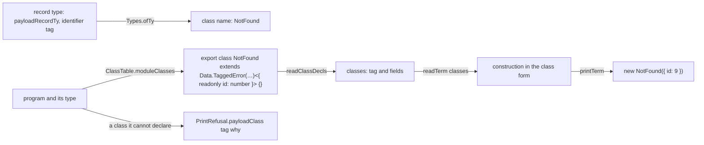

# 2026-10-04 seat E2 receipt: the error payload face (decisions row 120, part E2)

Status: receipt (history, not authority). Branch `seat/e2`, worktree
`/Users/pooks/Dev/lean4-effect4-e2`, base `c58bcc43`. Brief: the coordinator's seat E2 brief.
Plan: `docs/research/2026-10-04-claude-lead/error-payloads-plan.md` §3, part E2.

**The one thing to know before merging.** The reader now takes the module's payload classes as
its first explicit argument: `readTerm`, `readTerms`, `readCause`, `readLeaf`, `readT`,
`readEff`, `readLayer` and their kin (`src/Effect4/Codegen/Read.lean`), and
`readTerm_printTerm` gained a coverage premise (`Term.covers`). `Api.read` and `Api.readAt`
default the classes to `[]`, so their callers are unchanged. A branch in flight that calls the
reader or proves about it merges against this, mechanically: pass `[]`, or the classes the
module declares. Second, a decision for the coordinator (§6, row E2-A): DI-59's adapter now makes
a key-value row's failure a defect, as the brief's item 8 reads literally.

## 1. Base and head

| Item | Commit |
| --- | --- |
| Base | `c58bcc43` |
| The face in the core: classes, the class table, printer, reader, envelope, the Refusals group, the TypeScript table, the case policy, the proof-style baseline | `563b469b` |
| The laws over the classes | `8db38ef2` |
| The batteries; p1, p2, p3 and p5 | `b084528d` |
| The TypeScript reader and tsgo's green file and red twin | `bf1140e5` |
| The truth face and DI-59's adapter | `fa0ef281` |
| The registry, `docs/core/semantics.md`, `generated/semantics.md` | `a8201e34` (the gated head) |
| This receipt | the commit after `a8201e34`; it adds this file only |

Nothing is pushed. `docs/core/decisions.md`, `lakefile.toml`, `docs/STATE.md` and
`Machine/Stores.lean` are untouched.

**Changed files** (98, `git diff --stat c58bcc43..a8201e34`: 3689 insertions, 1058 deletions).
New: `src/Effect4/Codegen/Classes.lean`, `src/Effect4/Codegen/ClassTable.lean`,
`src/Effect4/Laws/Codegen/Classes.lean`, `Test/Codegen/PayloadClasses.lean`,
`ts/eff/test/payload-classes.typecheck.ts`, `ts/eff/test/payload-classes.test.ts`,
`ts/eff/test/red/payload-classes.red.ts`, `ts/eff/test/red/tsconfig.json`,
`harness/truth/generated/pFailPayload.ts`, `harness/truth/generated/pTagPayload.ts`. Changed:
the core (`Codegen/Types`, `PrintLeaf`, `Templates`, `Print`, `Read`, `Admit`, `Checked`,
`Api.lean`, `Api/RefusalsDerived.lean`); the laws (`Laws/Codegen/ReadLeaf`, `Read`, `ReadPrint`,
`PrintReadable`, `Module`, `Checked`, `Admit`, `Laws/Api/ModuleReadable`, `Laws/Api/Codegen`); the
batteries (`Test/All.lean`, `Test/Codegen/PrintContract`, `ReadContract`, `RecordTerms`, `Tuple`,
`Test/Dogfood/Stage`, `P1HttpCache`, `P2HandlerLayers`, `P3WorkerQueue`, `P5LedgerService`,
`Test/Dogfood/README.md`); the generators' inputs and outputs (`tools/Effect4Gen/manifest.json`,
`tools/Effect4Gen/guards/refusals.lean`, `tools/Drivers/TsGen.lean`, `ts/eff/templates.gen.ts`,
`ts/eff/test/type-projection.gen.json`, `generated/semantics.md`); the policies
(`tools/Conform/Effect4/cases-policy.json`, `Test/fixtures/proof-style/baseline.tsv`,
`Test/fixtures/target/selection.json`); TypeScript (`ts/eff/read.ts`, `ts/eff/target-types.ts`,
`ts/eff/tsconfig.json`, `ts/eff/README.md`); the truth harness (`harness/truth/Truth.lean`,
`prelude.ts`, `run-truth.ts`, `records.test.ts`, `corpus.json`, `result.json`, `result.md`, and
the 37 other generated modules, whose header gains `Data`); the registry and its prose
(`tools/Tools/SemanticsRegistry.lean`, `docs/core/semantics.md`).

## 2. What landed



| Brief item | What landed |
| --- | --- |
| 1. One class per tag | `Classes.classDecl` prints `export class Tag extends Data.TaggedError("Tag")<{ readonly f: T; … }> {}`, the fields after `_tag` in their order. `ClassTable.moduleClasses` collects one class per tagged payload type the program constructs or its printed types mention, constructions first, in first-occurrence order. The module declares them before its block (`ModuleEmission.module`). |
| 2. Construction and types | A construction in the class form (`Classes.classTag?`) prints as `new Tag({ f: v, … })`, `_tag` omitted. A payload record type prints as the class name in every printed type (`Types.payloadClass?`), so the error column is the class or a union of classes. Every route of E1's probe prints the class (§3). |
| 3. Refusals by name | `PrintRefusal.payloadClass tag why`, with `ClassRefusal`: `notIdentifier`; `collides` (the `effect` namespaces, `Data` among them; the prelude's atoms; the builtins; `Readonly`, `Record`; the export name; the rows' roots and trailing names; what `exportNameSafe` excludes); `fieldsDiffer`; `construction` (outside the class form); `unreadable` (a declaration that does not read back). |
| 4. The envelope | `envelopeCheck` checks that the leading class declarations read back to exactly the printer's classes (`SurfaceRefusal.classDeclarations` otherwise), then the block after them; `layersPlain` reads the block only. `Data` is an `effect` origin. `admitModule_classDecls`: an admitted module's class declarations are exactly the printed ones. |
| 5. The readers | Lean: `readClassDecl` reads a declaration back to its class, exactly (`readClassDecl_exact`); `readTerm`'s class branch restores `_tag` from the class; a structural record in the class form is refused (`shape "record in class form"`). `ts/eff/read.ts` reads the same text the same way. `read_print` and `read_exact` extend in place (§4). |
| 6. tsgo | `ts/eff/test/payload-classes.typecheck.ts` (green) and `ts/eff/test/red/payload-classes.red.ts` (the red twin; `ts/eff/test/payload-classes.test.ts` pins its codes). The truth lane type-checks the two payload programs' modules (DI-49). §3 lists each form and its verdict. |
| 7. The truth face, ruling (a) | `Truth.lean`'s `errJsonAt` writes the program's own exit through its error column (`Schema.encode`): `{"payload":{"_tag":"NotFound","id":9}}`. The recorder writes a class instance's JSON (`payloadOf`), and the runner compares modulo an object's key order. Two programs were cheap, and are added: `pFailPayload` and `pTagPayload`. |
| 8. DI-59's adapter | `pairOf`'s case 3 projects a flat tagged error only when its JSON data is `_tag` and `message`. A class with more is a payload, never a pair (§6, row E2-A). |
| 9. Acceptance batteries | The payload parts of p1, p2, p3 and p5 measure `⟨"built", true, "printed", true⟩`: built, run to the record, printed as a module with the class, read back. `Test/Dogfood/README.md` and the four headers follow. |
| 10. The registry | R3's open part drops E2's face. Claim `collection-term-print-read` names the classes. New claim `payload-class-decl-exact` (`exact-codecs`, R3) is proved. |

**Where a class prints: everywhere, not at error positions only.** The printer is untyped
(decisions row 165), so "error positions" can only mean syntax. The bound-variable route then
prints a structural object under an error column that names the class, and tsgo refuses that
(TS2375, the red twin's line 10). A class instance fits where its structural record is expected
(the green file's `below`), so printing the class everywhere loses nothing. Types print the
class name everywhere for the same reason, and because `Ref<A>` and `Deferred<A, E>` are
invariant.

**A field named `cause`.** It is an ordinary field at an admitted type; a field typed `unknown`
stays refused at the checker (ruling (a), `errorPayloadField`). rc.112's `Data.Error` passes a
truthy `cause` on as the native `ErrorOptions.cause`, so the instance holds it unenumerable; a
falsy one is own and enumerable. Its JSON writes it either way, through `plainArgs`
(`vendor/effect-4.0.0-rc.112/src/internal/core.ts:586-605`; reproduced, bun 1.4.2). It prints
as `new Wrapped({ cause: "disk" })` and reads back (tested).

## 3. The printed forms and their tsgo verdicts

Compiler: tsgo 7.0.0-dev.20260629.1 (`@typescript/native-preview`, pinned in `ts/eff`), against
effect 4.0.0-rc.112, with the package's own options (strict, `exactOptionalPropertyTypes`). The
exact texts are pinned in `Test/Codegen/PayloadClasses.lean`; `harness/truth/Truth.lean` pins
the truth module's text.

| Form (exact text) | Declared type | tsgo |
| --- | --- | --- |
| `export class NotFound extends Data.TaggedError("NotFound")<{ readonly id: number }> {}` | — | green (green file; truth module `pFailPayload`, DI-49) |
| `export class Unauthorized extends Data.TaggedError("Unauthorized")<{ readonly reason: string }> {}` | — | green |
| `export class Wrapped extends Data.TaggedError("Wrapped")<{ readonly cause: string }> {}` | — | green |
| `Effect.fail(new NotFound({ id: 9 }))` | `Effect.Effect<never, NotFound, never>` | green; the truth lane agrees with rc.112 |
| `Effect.flatMap(Effect.succeed(new NotFound({ id: 9 })), (a0) => Effect.fail(a0))` | `Effect.Effect<never, NotFound, never>` | green |
| `Effect.catchCause(Effect.flatMap(Effect.succeed(new NotFound({ id: 9 })), (a0) => Effect.fail(a0)), (a0) => Effect.succeed(0))` | `Effect.Effect<number, never, never>` | green |
| `Effect.flatMap(Effect.succeed(new NotFound({ id: 9 })), (a0) => Effect.exit(Effect.fail(a0)))` | `Effect.Effect<Exit.Exit<never, NotFound>, never, never>` | green |
| `Effect.succeed(new NotFound({ id: 9 }))` | `Effect.Effect<NotFound, never, never>` | green |
| `Effect.flatMap(Effect.fail(new NotFound({ id: 9 })), (a0) => Effect.fail(new Unauthorized({ reason: "bad token" })))` | `Effect.Effect<never, NotFound \| Unauthorized, never>` | green |
| `Effect.fail(new Wrapped({ cause: "disk" }))` | `Effect.Effect<never, Wrapped, never>` | green |
| `Effect.catchIf(Effect.fail(new NotFound({ id: 9 })), (a0) => tagIs("NotFound", a0), (a0) => Effect.succeed(1), undefined)` | `Effect.Effect<number, NotFound, never>` | green (truth module `pTagPayload`, DI-49); the truth lane agrees |
| `Effect.flatMap(Effect.succeed(true), (a0) => Effect.suspend(() => a0 ? Effect.fail(new NotFound({ id: 9 })) : Effect.fail(new Unauthorized({ reason: "bad token" }))))` | `Effect.Effect<never, NotFound \| Unauthorized, never>` | **red, TS2375**: DI-55's finding F3, open since 2026-09-12 (§6) |

The red twin's lines and codes, pinned by `ts/eff/test/payload-classes.test.ts` (tested, exit 1):

| Line | Text | Code |
| --- | --- | --- |
| 9 | `export const structuralValue: NotFound = { _tag: "NotFound", id: 9 }` | TS2740 |
| 10 | `… Effect.Effect<never, NotFound, never> = Effect.fail({ _tag: "NotFound" as const, id: 9 })` | TS2375 |
| 11 | `… Effect.Effect<never, NotFound \| Unauthorized, never> = Effect.fail({ _tag: "Unauthorized" as const, reason: "bad token" })` | TS2375 |
| 12 | `new NotFound({ _tag: "NotFound", id: 9 })` | TS2353 |
| 13 | `new NotFound({ id: "9" })` | TS2322 |
| 15 | the `select` route above | TS2375 |

`make check-target` reads the two payload programs: the error column agrees by strict
containment (`Program.NotFound` within Lean's structural rendering), the answer and requirement
columns exactly (tested).

## 4. The theorems, placed

Every new or changed theorem rests on at most `[propext, Quot.sound]` (§5).

| Theorem | Concept, claim, requirement | Consumer | Reach and limits |
| --- | --- | --- | --- |
| `readTerm_printTerm` (changed: the classes, `Term.covers classes t`) | `exact-codecs`, `collection-term-print-read`, R3 top | `leafReadable`, `read_print` | scoped terms whose class constructions the classes cover; no typing premise; not tsgo, not execution |
| `readTerm_exact` (changed: every class table) | `translation-simulation`, R8 | `read_exact` | what the reader accepts prints back; untyped (row 165) |
| `read_print`, `read_exact` (changed in place, no second statement) | `translation-simulation`, R8 top | the faces | the readable domain, whose leaves carry the coverage (`rowDom classes`); `pAwait` and annotated loops stay outside (DI-91) |
| `readModule_printModule` (changed: the class section) | `translation-simulation`, R8 | `readModule_printModule_readable`, then `ModuleEmission.readModule` and `printModule_roundTrip` (`Laws/Api/ModuleReadable.lean`) | premise `readClassDecls classDecls = some classes`, discharged from the printer's decision |
| `admitModule_classDecls` (new) | `exact-codecs`, `payload-class-decl-exact`, R3; placed by `@[semantics "exact-codecs" (requirement := R3)]` | the claim; the envelope's exactness | modules `admitModule` admits at `nativeSignature table` (R1's open part for the faces); not target typing |
| `readClassDecls_eq_checked`, `readClassDecl_exact`, `checkedDecl_classDecl` (new) | steps of `admitModule_classDecls` | it | the class section only |
| `readClassDecls_checked`, `readClassDecl_checked` (new) | steps of the module round trip | `ModuleEmission.readModule` (`Laws/Api/ModuleReadable.lean`), `ModuleEmission.admit` | uses `checkedDecl`'s decision, never assumes it |
| `moduleClasses_checked`, `splitClasses_append` (new) | steps of the module and boundary laws | `ModuleEmission.admit`, `readModule_printModule` | — |
| `readClass_writeClass`, `readClass_exact`, `readClass_writeRecord`, `readClass_writeField`, `readClass_writeSet`, `readClass_writeAt`, `classTag?_some`, `printTerms_restTerms`, `printTerms_length`, `coverNode_class`, the coverage equations, `Term.covers_lit_nil` (new, `Laws/Codegen/Classes.lean`) | steps of `readTerm_printTerm` and `readTerm_exact` | those | — |
| `readClass_size` (new, `Codegen/Classes.lean`) | termination of `readTerm`'s class branch | `readTerm`, `readTerm_exact` | — |
| `envelopeCheck_iff`, `ModuleReading.recheck`, `admitModule_complete`, `ModuleEmission.admit` (changed) | the boundary, R8 | `Api.admitModule` | five facts now, the classes first |

Deleted for having no consumer: `printEntry_classes`, `readRecord_writeClass`,
`readField_writeClass`, `readSet_writeClass`, `Term.covers_var`, `Term.covers_lit`,
`Terms.covers_nil`.

## 5. Commands and results

Lean commands ran through `/Users/pooks/Dev/lean4-effect4/scratch/lean-slot.sh`
(`LEAN_NUM_THREADS=2`).

| Command | Result |
| --- | --- |
| `make record-proof-style` | `proof style: recorded 1938 uses and 60 unread commands`; two rows moved, both in the regenerated Refusals group: `ofVal_exact first 16 → 17`, `ofVal_toVal simp-without-only 23 → 24` |
| `lake build Test` | `Build completed successfully (900 jobs)` |
| `lake env lean -DwarningAsError=true Test/All.lean` | the three gate lines below, exit 0 |
| `make check-proof-style` (final tree; it runs `make build`, 902 jobs) | exit 0; `1938 recorded uses and 60 recorded unread commands in 1193 entries` |
| `python3 scripts/check-conform.py cases` | the first run refused three new case sites (`coverNode`, `Classes.readNamed` twice); after naming them in `tools/Conform/Effect4/cases-policy.json`: `conform-cases: 219/219 subjects, 219 pass, 0 refused` |
| `python3 scripts/generate.py --only ts` | `templates.gen.ts` (the refusal row and `recordTerm` gone) and `test/type-projection.gen.json` (seven payload cases) |
| `python3 scripts/generate.py --only ts --output-dir <tmp>`, then `cmp` of the nine files | all nine identical |
| `python3 scripts/generate.py --only derived --output-dir <tmp>` | `PASS generate` (check mode) |
| `make gen-semantics` | exit 0; `generated/semantics.md` committed |
| `tsgo --noEmit -p tsconfig.json` in `ts/eff` (7.0.0-dev.20260629.1) | exit 0 |
| `bun test` in `ts/eff` (bun 1.4.2) | `696 pass, 0 fail` (25 files) |
| `make corpus` | `kept 408 (readable 385) refused 0`; `generated/corpus-index.tsv` unchanged |
| `bun run check.ts .lake/corpus harness/truth/generated --oracle .lake/corpus` | `files 447: matched 416, mismatched 0, refused with oracle 0, accepted without oracle 24, refused without oracle 7` (the seven: `unknownHead` of a host row, as at base); the two payload modules are accepted |
| `lake env lean -M4096 --run harness/truth/Truth.lean harness/truth/corpus.json --tapes harness/truth/tapes` | `wrote 39 programs`; only the two new entries differ from base |
| `bun run harness/truth/run-truth.ts --manifest harness/truth/corpus.json --out harness/truth --timeout 300 --tape-out harness/truth/tapes` | `PASS: 38 programs agree on exits, schedules and sync exits; 1 signed divergence(s)`; tapes unchanged |
| `bun test` of the four truth host tests, then `python3 scripts/check-truth.py` | `23 pass, 0 fail`; `PASS truth: … the regenerated modules type-check` |
| `bun run harness/truth/run-truth.ts --self-test-errors` | `{"kind":"pure-error-comparison-controls","checks":20,"failures":[]}` (four payload controls added); no lane runs this flag |
| `make check-target` | `PASS row-types`; tsgo on `tools/target` exit 0; `bun test tools/target` `28 pass`; `target conformance … PASS; 50 expected, 50 attempted, 50 resolved, 0 mismatching, 0 refused`; assignability `600 pairs; agree 594, cut 6`, red control `10 … caught`, then **FAIL**: `generated/assignability.tsv differs` (red before this seat, below) |
| `bun tools/target/rows.ts --repo .` (the step after it) | `PASS rows` |
| `python3 scripts/check-corpus.py` | `PASS corpus: 400 programs match the committed results; 25 registered disagreement(s)` |
| `make check-tsdiag` | **FAIL**, red before this seat (below) |
| `python3 scripts/check-docs.py` | `PASS check-docs: … 72 documents resolves` |
| `python3 scripts/check-language.py --show docs/core/semantics.md` | 70 findings, the base's 70; none in the new lines |

The gate lines on the final tree:

```
Effect4 library-root gate: 162 API/utility modules, 274 Laws-only modules; every library source is reachable; Effect4 never reaches Laws
Effect4 module and axiom gate: checked 663 modules and 81147 declarations; … semantic/test axioms are [propext, Quot.sound]; exact implementation boundary (17 module(s), 23 declaration(s)) additionally allows Classical.choice
Effect4 goal gate: 13 planned goal(s), each a theorem whose body is `sorry` outside the Effect4 root; 7 declaration(s) rest on goals; no other declaration reaches sorryAx
```

**Axiom output.** A scratch file collected the axioms of every theorem of the 21 changed modules
(`Lean.collectAxioms`): 1536 theorems, each at most `[propext, Quot.sound]`;
`Codegen.PrintLeaf` and `Codegen.Templates` at `[propext]`; `Codegen.ClassTable` has no theorem.
The load-bearing ones are at `[propext, Quot.sound]`: `readTerm_printTerm`, `readTerm_exact`,
`read_print`, `read_exact`, `readModule_printModule`, `readClassDecls_checked`,
`readClassDecl_exact`, `readClassDecls_eq_checked`, `moduleClasses_checked`,
`admitModule_classDecls`. `readClass_writeClass` and `coverNode_class` are at `[propext]`.

**Two lanes red before this seat.** Neither input changed here (`git diff c58bcc43` is empty on
each input).
- `make check-target`'s assignability step: `generated/assignability.tsv` was written on
  2026-09-19 (`2f0a7b46`), and `Ty.sub nat int` has changed since, so the rows `spelling/0-1` and
  `spelling/1-0` move. `make gen-assignability` promotes it; that is a reviewed promotion.
- `make check-tsdiag`: `harness/tsdiag/run-tsdiag.mjs` copies `prelude.ts` alone, while the
  base's prelude re-exports `./prelude-atoms.gen.ts`, `./records.ts` and `./tuples.ts`. Every
  corpus module then fails with TS2305 and TS2724.

**Lanes not run.** `make check` and `make check-full`: no sweep is owed for a seat (AGENTS.md,
Working), and `check-gen` is a full-tree build. `make check-ocaml` and `make gen-lcnf`: the
OCaml cuts' closures (`ocaml/gen/closure-*.tsv`) name no `Codegen` declaration and no changed
`Program` one, so the OCaml estate is untouched (assumed from the closure lists, not re-cut).
`make check-ts-reader` as one target: its three steps ran one by one (above).

## 6. Open obligations and proposed decisions rows

Proposed rows (the register is the coordinator's; this seat edits none):

- **E2-A, DI-59 at payload classes (decision).** The brief's item 8 is implemented literally:
  `pairOf` no longer projects a flat tagged error with data beyond `message`. So a
  `KeyValueStoreError` (`method`, `key`) failing a key-value row is now a defect at the adapter,
  where it was the pair `["KeyValueStoreError", message]`. The rows' declared error column (the
  pair) then overstates what the host raises. No truth program observes it. Case 2 (`SqlError`'s
  reason, ruling G1) is unchanged. Options: (a) as landed, until R6 admits a host payload;
  (b) keep case 3 at the adapter (`toPair`) and stop only on the value wire (`taggedPair`),
  which splits DI-59's one function; (c) refuse the pair as the key-value rows' error column.
  Recommendation: (a). Dropping a class's fields gives it two spellings, the reason of ruling
  (c); record the overstated column against R6.
- **E2-B, the `select` route of two classes (DI-55's finding F3, amend).** p2's handler pattern
  (`NotFound` and `Unauthorized` in two arms) reaches F3 now that payloads print. tsgo refuses
  `Effect.suspend(() => c ? a : b)` (TS2375). The class union type-checks through `bind` and
  through `Effect.gen` (reproduced). Recommendation: decide F3 with the `Effect.gen` candidate
  measured beside F3's two; until then F3 is recorded, not repaired.
- **E2-C, fields named after `Error` members.** tsgo accepts payload fields `toJSON`, `pipe`,
  `name`, `stack`, `constructor`, `toString` and `asEffect` (reproduced, exit 0). At run time an
  own `toJSON` or `pipe` shadows the method. Options: refuse each by name (`ClassRefusal`), or
  accept. Recommendation: refuse `toJSON`, `pipe`, `constructor` and `toString`; accept `name`,
  `stack`, `message` and `cause`, which rc.112 itself sets.
- **E2-D, a record update of a class instance.** `recordSet` copies own enumerable properties
  into a plain object, so the update of a `NotFound` answers a structural object whose printed
  type is still the class. No route of E1's probe and no battery reaches it. Options: an update
  in the runtime helpers that keeps the prototype, or a refusal where the target's type is known.
  Recommendation: measure it with a truth program before choosing.
- **E2-E, the faces contract's text.** `Test/contracts/faces.contract.md` §2 states
  `readEff sig spell n x`, with line numbers in `Read.lean`. The reader now takes the classes
  first, and R1's readable domain carries the coverage. The packet is frozen; the amendment is
  the coordinator's.

Open, not rows:
- A payload field typed `number` is refused by name (`unreadable`): the class declaration
  spells `nat` and `number` alike. A field typed by another payload class is refused the same
  way, since its spelling is the other class's name. Row 121 and nested classes would lift them.
- The target lane's expected columns render a payload type structurally (`Ty.render`). An error
  column agrees by strict containment; an answer column at a payload type would mismatch. A
  program that answers a payload needs the class spelling in `typeJson`, or a class binding.
- `run-truth.ts --self-test-errors` runs in no lane (before this seat too).
- `Truth.lean`'s value wire writes a payload inside a reified exit or a child fiber's exit as
  hexadecimal, where the recorder writes the instance's data. Those positions are not compared
  today: the comparison reads the root's exit only.

## 7. What the evidence is

- **Proved:** the theorems of §4, at `[propext, Quot.sound]`, under their stated premises.
- **Tested:** the batteries (finite `#guard`s), the TypeScript reader's cases, the red twin's
  codes, the truth lane's two payload programs against rc.112, the corpus lanes. The truth
  evidence is bounded: two programs, one payload type.
- **Reproduced:** rc.112's instance data and its `cause` handling (bun 1.4.2); the F3 route
  under tsgo; tsgo's acceptance of member-named fields.
- **Host-only:** every tsgo verdict and the truth agreement are finite checks against the pinned
  host. Nothing here states target typing or execution in general.
- **Assumed:** the OCaml estate is unaffected (closure lists read, not re-cut).

## 0. Working notes (kept while the seat ran; the sections above supersede them)

### 0.1 The design, as decided before the code

- **Which records are classes.** A record *type* is a payload class when its fields are a tagged
  payload record type (`payloadRecordTy`, E1's checker predicate) and its tag is a TypeScript
  identifier. Classness is a property of the type, not of a use: the model's record types are
  structural, so a tagged record used only as data is the same type as the failure. Every such
  type prints as its class name, wherever a type prints (`Codegen.Types.ofTy`). Every record
  construction whose declared fields are such a type, and whose first field, first name and
  first value are `_tag` and the tag's literal, prints as `new Tag({ … })`, wherever it
  occurs ("everywhere", not "at error positions only").
- **Why everywhere (tsgo, probe T §4 and this seat's files):** a class instance is assignable
  where its structural record is expected (`e2`), and not conversely (`e1`/`r1` TS2740,
  `e3`/`r7` TS2375). The printer is untyped (row 165), so "at error positions only" can only
  mean syntactic positions: the bound-variable route (`succeed` of the record, then `fail` of
  the variable) would print a structural object under an error column that names the class,
  which tsgo refuses (TS2375). Types print the class name everywhere for the same reason, and
  because `Ref<A>` and `Deferred<A, E>` are invariant.
- **The reader's environment.** `new Tag({ … })` carries no field declaration, so the reader
  takes the module's classes (tag ↦ fields) as a parameter, read from the class declarations.
  `read_print` holds for every class table that covers the program's class constructions
  (a premise in the readable domain's leaves); `read_exact` holds for every class table.
- **The module.** One class declaration per tag, before the layer constants:
  `export class Tag extends Data.TaggedError("Tag")<{ readonly f: T; … }> {}`. The fields are the
  class constructions' declared fields (`_tag` first, the rest in their written order), or a
  printed type's normalized fields when no construction names the tag.

### 0.2 Findings while the seat ran (kept as they arrived)

- **The select route and a class union (reproduced, tsgo 7.0.0-dev.20260629.1).** A `select` whose
  two arms fail with two classes prints `Effect.suspend(() => c ? Effect.fail(new A(…)) :
  Effect.fail(new B(…)))`; tsgo refuses it (TS2375): TypeScript infers one arm's error, not the
  union. The same holds for two pairs with different literal tags, and for `number` beside
  `string`, so it is DI-55's finding F3 (open since 2026-09-12), not a new defect of the class
  face. The class union type-checks through `bind`
  (`Effect.flatMap(Effect.fail(new NotFound(…)), (a0) => Effect.fail(new Unauthorized(…)))`) and
  through `Effect.gen`.
- **DI-59's adapter, read literally (decision for the coordinator).** `pairOf` case 3 now projects
  a flat tagged error only when its JSON image has no key but `_tag` and `message`. A
  `KeyValueStoreError` has `method` and `key`, so a key-value row's failure is now a defect at the
  adapter (`UnsupportedHostFailure`), where it was the pair before. No truth program observes a
  key-value failure (the memory store never fails). Case 2 (`SqlError`'s reason, ruling G1) is
  unchanged.
- **A record update of a class instance (open).** `recordSet` copies own enumerable properties
  into a plain object, so the update of a `NotFound` answers a structural object while its type
  still names the class. No E1 probe route reaches it; no program in the batteries does.
- **Fields named after `Error` members (reproduced, tsgo exit 0; bun 1.4.2).** tsgo accepts
  payload fields `toJSON`, `pipe`, `name`, `stack`, `constructor`, `toString`, `asEffect`; at run
  time an own `toJSON: 1` shadows the method and `pipe: 1` the pipe. E2 does not refuse them.
- **rc.112's instance data (reproduced, bun 1.4.2).** `new NotFound({ id: 9 })` has own keys
  `id`, `_tag`; JSON `{"id":9,"_tag":"NotFound"}`; `message` is the inherited `""`. A truthy
  `cause` is own and unenumerable, a falsy one own and enumerable; both appear in the JSON
  through `plainArgs` (`vendor/effect-4.0.0-rc.112/src/internal/core.ts:586-605`).
- **The manifest's key order.** `Lean.Json`'s writer lists an object's keys in its own order
  (`{"id": 9, "_tag": "NotFound"}` in `corpus.json`), so the runner compares modulo key order.
  Every compared value before this seat had at most one key.
