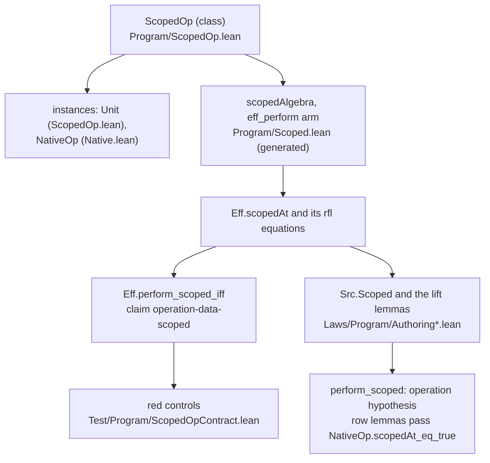

# 2026-10-04 seat T0 receipt: the scope check reads an operation's own data

Status: receipt (history, not authority). Branch `seat/t0`, worktree
`/Users/pooks/Dev/lean4-effect4-t0`. Brief: the coordinator's seat T0 brief, slice T0 of
`docs/research/2026-10-04-claude-lead/state-any-type-plan.md`.

**The one thing to know before merging.** `Eff.scopedAt` and the authoring scope predicates now
take `[ScopedOp Op]`, so every statement over an arbitrary alphabet carries that binder. At
`NativeOp` and `Unit` the instance answers `true`, so no native scope verdict moves.
`src/Effect4/Program/Native.lean` gained one import and one instance, so the merge rebuilds
everything that imports it. The error-payload plan has seat E1 edit R3's row of
`tools/Tools/SemanticsRegistry.lean`; this branch edits the folds claims and R4's row. Both
branches regenerate `generated/semantics.md`. After the merge, run `make gen-semantics` once
and commit the report.

## Base and head

| Item | Commit |
| --- | --- |
| Base | `9b9c42e5` (`refactor/phase1-phase3`) |
| The slice | `b639a230` |
| This receipt | the commit after `b639a230` |

## The choice: a class of the alphabet, not a typing signature field

`ScopedOp (Op : Type)` with `scopedAt : Op → Nat → Bool` is a class
(`src/Effect4/Program/ScopedOp.lean`). The alternative, `Signature.scopedOp`, is not taken.

| Criterion | Class `ScopedOp` | Field `Signature.scopedOp` |
| --- | --- | --- |
| Scope is syntax, decided from the program alone | the alphabet answers; no signature enters `Eff.scopedAt` | `Eff.scopedAt` takes a signature, and the scope fold's module imports `Program/Typing/Rules.lean` |
| Consumers with no signature at hand | `Src.Scoped` and every lift lemma read the instance by type | each would thread a signature through `holds` and every lemma |
| One alphabet, one scope | fixed per alphabet | two signatures over one alphabet could disagree on scope |
| Churn in the generic theorems | one binder `[ScopedOp Op]` per generic statement; concrete alphabets change nothing | one argument per statement and per call site, concrete ones included |

The instance for `NativeOp` sits beside the inductive (`src/Effect4/Program/Native.lean`). T3
changes the constructors and this instance together, so they share a file. The cost is the
rebuild of everything downstream of `Program/Native.lean` at this commit.

## What landed

The diagram shows which declaration reads which. An edge means "is read by"; it claims no
proof.



1. **The interface.** `ScopedOp` holds the binder convention in its docstring. A term that an
   operation carries and evaluates at `env ++ [current]` is checked at level `n + 1`. The
   current value is the variable at index `n`, and a variable below `n` is an outer capture.
   This is `iterate`'s step convention (`tools/Effect4Gen/binders.json`). `Unit` answers `true`
   beside the class, and `NativeOp` answers `true` beside its inductive.
2. **The generator.** `tools/Effect4Gen/Authoring.lean` reads an argument of the family's
   parameter type as `ArgKind.op`, from the declaration. The group `Scoped` emits
   `eff_perform := fun a0 a1 n => ScopedOp.scopedAt a0 n && a1.scoped n` and puts
   `[ScopedOp Op]` on every emitted declaration. The group `ScopedLaws` gives the operation
   lift's lemma `perform_scoped` the hypothesis `∀ n, ScopedOp.scopedAt op n = true`. The lift
   takes an operation as data, and authoring elaboration never reads it against the scope. So
   the hypothesis covers every level. `tools/Effect4Gen/Rows.lean` passes
   `NativeOp.scopedAt_eq_true` there. The manifest's `Scoped` group imports and meta-imports
   `Effect4.Program.ScopedOp`, since its guards evaluate at `Unit`.
3. **The connector.** `Eff.perform_scoped_iff` (`src/Effect4/Laws/Program/Authoring.lean`)
   holds by one `simp only` over the generated equation `Eff.scopedAt_perform`. No hand-written
   lemma about the `perform` arm existed, so nothing was replaced. The generated equation and
   the lift lemma changed in place, through the generator.
4. **The guards.** `tools/Effect4Gen/guards/scoped.lean` adds three `perform` rows at `Unit`.
   `tools/Effect4Gen/guards/scopedlaws.lean` pins `perform_scoped`'s shape in term mode.
5. **The red controls.** `Test/Program/ScopedOpContract.lean`, imported last by `Test/All.lean`,
   runs over the fixture alphabet `TermOp`. Its one operation carries a `Term`, and its instance
   checks the term at `n + 1`. The section "Evidence" lists the controls.
6. **Placement.** The registry claim `operation-data-scoped` (`initial-algebras-folds`, role
   decidability) points at `Eff.perform_scoped_iff`. The theorem is placed at R4 by
   `@[semantics "initial-algebras-folds" (requirement := R4)]`. R4's open part "an
   operation's data is scope-checked … (state plan T0)" is removed.
7. **The consumers.** 39 hand-written statements over an arbitrary alphabet name a scope
   predicate, and each gained the binder (counted by `grep -c`). They are 12 in
   `Laws/Program/Authoring.lean`, 14 in `Laws/Program/Author.lean`, 9 in
   `Laws/Program/Authoring/Sugar.lean` and 4 in `Laws/Program/Authoring/Loops.lean`. The full
   build met no concrete alphabet other than `NativeOp` and `Unit` that needs an instance. No
   hand-written proof body changed. `Node.scopedAt_child` gained the binder in its statement
   only. Its proof, with its recorded `try` and `simp_all` uses, is byte-identical.

## Changed files

| File | Change |
| --- | --- |
| `src/Effect4/Program/ScopedOp.lean` | new core module: the class, its convention, the `Unit` instance |
| `src/Effect4/Program/Native.lean` | imports `ScopedOp`; the `NativeOp` instance; `NativeOp.scopedAt_eq_true` |
| `src/Effect4/Program/Scoped.lean` | regenerated: the operation arm reads the operation; `[ScopedOp Op]` throughout; three guards |
| `src/Effect4/Laws/Program/Authoring/Lifts.lean` | regenerated: `[ScopedOp Op]` on every lift lemma; `perform_scoped`'s operation hypothesis; one guard |
| `src/Effect4/Laws/Program/Authoring/Rows.lean` | regenerated: each row lemma passes `NativeOp.scopedAt_eq_true` |
| `src/Effect4/Laws/Program/Authoring.lean` | the binder on the predicates and lemmas; `Eff.perform_scoped_iff`; imports `Laws.Auto.Semantics` |
| `src/Effect4/Laws/Program/Author.lean`, `Authoring/Sugar.lean`, `Authoring/Loops.lean` | the binder on the generic scope lemmas |
| `tools/Effect4Gen/Authoring.lean` | `ArgKind.op`; the groups `Scoped` and `ScopedLaws` read it |
| `tools/Effect4Gen/Rows.lean` | the row lemmas pass the native operation's scope |
| `tools/Effect4Gen/manifest.json` | the `Scoped` group imports `Effect4.Program.ScopedOp` |
| `tools/Effect4Gen/guards/scoped.lean`, `guards/scopedlaws.lean` | the `perform` guards |
| `Test/Program/ScopedOpContract.lean`, `Test/All.lean` | the red controls; their import at the end of the list |
| `tools/Tools/SemanticsRegistry.lean`, `generated/semantics.md` | the claim; R4's open part removed; the report regenerated |
| `docs/research/2026-10-04-seat-T0-receipt.md` | this receipt, force-added |

## Commands and results

Every Lean command ran under `/Users/pooks/Dev/lean4-effect4/scratch/lean-slot.sh` at the
worktree root.

| Command | Result | Evidence |
| --- | --- | --- |
| `lake build`, at the base | green, 895 jobs | tested |
| `lake env lean --run tools/Effect4Gen/Driver.lean --group <G>` for `Scoped`, `ScopedLaws`, `RowsLaws`, at the base | `same` three times: the generator reproduces the base | reproduced |
| `lake build Effect4.Program.ScopedOp` | green, 2 jobs | tested |
| the driver, `--group Scoped`, then `lake build Effect4.Program.Scoped Effect4.Program.Native` | `CHANGED`; green, 54 jobs | tested |
| `lake build Effect4.Laws.Program.Authoring` | green, 235 jobs | tested |
| `lake build Effect4.Program.Authoring.Lifts`, the driver `--group ScopedLaws`, `lake build Effect4.Laws.Program.Authoring.Lifts Effect4.Program.Authoring.Rows` | the first guard draft failed: `authoring_scoped` met the operation hypothesis and named an unknown `Bool.true_scoped`. The guard was rewritten in term mode; then green, 238 jobs | tested |
| the driver, `--group RowsLaws`; `lake build` of the seven authoring law modules | `CHANGED`; green, 344 jobs | tested |
| `lake build Test.Program.ScopedOpContract` | first failed on `.withTerm` with no expected type, repaired by `TermOp.withTerm`; green, 238 jobs | tested |
| `lake build` (`Effect4`, `Effect4Laws`, `Test` with the gates) | green, 897 jobs; again green after line wrapping, 897 jobs | tested |
| `lake env lean -DwarningAsError=true Test/All.lean` | exit 0; the gate lines are below | tested |
| `lake env lean` on two scratch files of `#print axioms`, 27 declarations | the block under "Axiom output" | proved |
| `lake env lean` on a scratch `#traversal_census` file | the section "The traversal census" | tested |
| `make check-proof-style` | exit 0: 1945 recorded uses and 60 recorded unread commands in 1198 entries, as at the base | tested |
| `make gen-semantics` | green; `generated/semantics.md` regenerated: claim `operation-data-scoped` proved, R4's placed node `perform_scoped_iff` proved, one open part fewer | tested |
| `lake env lean --run tools/Effect4Gen/Driver.lean --verify`, after `b639a230` | 26 groups `same`, `changed: nothing`, exit 0 | reproduced |
| `make check-cases` (not owed: no policy family gained a match) | `conform-cases: 213/213 subjects, 213 pass, 0 refused`, exit 0 | tested |

The gate lines, as `lake env lean -DwarningAsError=true Test/All.lean` printed them:

```text
Effect4 library-root gate: 159 API/utility modules, 273 Laws-only modules; every library source is reachable; Effect4 never reaches Laws
Effect4 module and axiom gate: checked 658 modules and 80197 declarations; [...] semantic/test axioms are [propext, Quot.sound]; exact implementation boundary (17 module(s), 23 declaration(s)) additionally allows Classical.choice
Effect4 goal gate: 13 planned goal(s), each a theorem whose body is `sorry` outside the Effect4 root; 7 declaration(s) rest on goals; no other declaration reaches sorryAx
```

## Axiom output

Printed by `#print axioms` on the final tree:

```text
none: NativeOp.scopedAt_eq_true, ScopedOpContract.closed_scoped
[propext]: Eff.perform_scoped_iff, Eff.scopedAt_perform, Authoring.Node.scopedAt_child,
  Authoring.Node.childLevel_stmts_cons, Authoring.elaborate_scoped,
  ScopedOpContract.out_of_scope_refused, out_of_scope_refused_under_binder,
  out_of_scope_refused_in_statement, out_of_scope_lift_refused, outer_capture_admitted,
  capture_and_current_admitted, current_value_admitted, current_value_admitted_at_three,
  past_current_value_refused_at_three, request_out_of_scope_refused, withTerm_scoped_iff,
  native_perform_scoped, before_T0_admitted, before_T0_admitted_under_binder,
  before_T0_admitted_in_statement, before_T0_admitted_at_three
[propext, Quot.sound]: Authoring.perform_scoped, Authoring.Ref.update_scoped,
  Authoring.Ref.make_scoped, Authoring.Row.call_scoped
```

## Evidence

Each control is a theorem of `Test/Program/ScopedOpContract.lean`, kernel-checked by `decide`
or `rfl`, at the axioms above. The fixture alphabet's instance checks its term at `n + 1`.

| Claim | Theorems | Evidence |
| --- | --- | --- |
| A `perform` node is scoped exactly when its operation's data and its request are | `Eff.perform_scoped_iff` | proved |
| An out-of-scope variable inside the operation is refused, though the request is closed | `out_of_scope_refused`, `_under_binder`, `_in_statement`; `closed_scoped` | proved, finite instances |
| The authoring predicate refuses that operation through the lift | `out_of_scope_lift_refused` | proved |
| An outer capture at a bound level is admitted | `outer_capture_admitted`, `capture_and_current_admitted` | proved, finite instances |
| The term's own binder level is admitted; the next level is refused | `current_value_admitted`, `_at_three`; `past_current_value_refused_at_three` | proved, finite instances |
| The request is still checked at the node's level | `request_out_of_scope_refused` | proved, finite instance |
| Red side: the same fold with the arm of `9b9c42e5` admits each program refused inside the operation | `before_T0_admitted`, `_under_binder`, `_in_statement`, `_at_three` | proved, finite instances |
| No behaviour change at the native alphabet: the operation arm reads the request alone | `native_perform_scoped` | proved |
| Every other arm is unchanged | the diff of `Program/Scoped.lean`: the imports, the binder, one docstring, the `perform` arm and its equation, three guards | reading |
| Every existing scope guard and battery still holds | the full build with `Test/All.lean` | tested |

None of the evidence is host-only. The controls are finite instances; the connector and the
native statement are universal.

The monitor's third control of `state-binder-and-capture`, a result type that differs from the
stored type, is not checked here. It belongs to the term's typing, state plan T3, where
`rowTy` types the term. The fixture's docstring says so.

## Landed theorems and their placement

`Eff.perform_scoped_iff` (`src/Effect4/Laws/Program/Authoring.lean`):
- Concept: `initial-algebras-folds`; property: the scope fold decides an operation's own data
  (new; the proposal for `docs/core/semantics.md` §2.7 is below).
- Question: registry claim `operation-data-scoped` (role decidability); consumer: T3's term
  rows, where the checker refuses an unscoped term before typing it; today the fixture's
  `withTerm_scoped_iff`.
- Reach: the scope check `Eff.scopedAt`, observed as its Boolean answer, at every level, over
  every alphabet with a `ScopedOp` instance; no other hypothesis. Rows 42–43 and 204 bound
  the slice; row 207 places the theorem.
- Does not establish: term typing, since scope is not typing; an instance's adherence to the
  convention; which variable a captured level names.
- Unlocks: R4, state plan T3.

`NativeOp.scopedAt_eq_true` (`src/Effect4/Program/Native.lean`):
- Concept: `initial-algebras-folds`; a helper of claim `operation-data-scoped` at the native
  alphabet.
- Consumer: the generated row lemmas (`src/Effect4/Laws/Program/Authoring/Rows.lean`) and
  `native_perform_scoped`.
- Reach: every native operation at every level, while none carries a term.
- Does not establish: anything once a native operation carries a term. Its `rfl` proof then
  fails, and every row lemma names it, so the build points T3 at each row to restate.

`Authoring.perform_scoped` (generated, `src/Effect4/Laws/Program/Authoring/Lifts.lean`):
- Concept: `initial-algebras-folds`; the operation lift's scope preservation, restated in place.
- Consumers: the native row lemmas and the guard of `tools/Effect4Gen/guards/scopedlaws.lean`.
- Reach: an operation scoped at every level and a scoped request.
- Does not establish: the meaning of a raw operation's term at the depth where it lands.

## The traversal census

The census rule asks whether the native instance is a hand match. It is not:
`⟨fun _ _ => true⟩` reads nothing of the operation. Measured with `#traversal_census` on a
scratch file over the final tree:

| Census | Result |
| --- | --- |
| `Effect4.Program.Eff` under `Effect4` | 278 takers; the eight scope definitions (`Eff.scopedAt`, `Stmt.scopedAt`, `Stmt.bindsNext`, `Stmts.scopedAt`, `Effs.scopedAt`, `ActionTerm.scopedAt`, `LayerTerm.scoped`, `LayerTerms.scoped`) are `fold` rows through `scopedAlgebra`, as `docs/core/traversal-census.md` records them |
| `Effect4.Program.NativeOp` under `Effect4.Program.Native` | 5 rows: `kind`, `row`, `syncOpOf`, `nativeRowOf` one-level; `instDecidableEqNativeOp` opaque. The new instance is no row: it takes no `NativeOp` value |
| `Eff` and `Term` under `Effect4.Program.ScopedOp` | 0 rows |

So no exemption is owed. The fixture instance on `TermOp` matches one level, in `Test`, which
the census does not scan.

## Findings for later slices

1. **T3's instance is a case site of a policy family.** `NativeOp` is a family of the
   case-site policy (`tools/Conform/Effect4/cases-policy.json`, `unlisted: refuse`). T3's
   instance matches the term rows, so T3 adds the policy row and runs `make check-cases`.
2. **A raw operation's term has no fixed meaning.** Levels count from the root, so a term's
   `var k` names the binding at level `k` of the scope where it lands. The `perform` lift places
   an operation at any depth, and its hypothesis bounds scope only. T3's authoring of a term row
   should elaborate the term under `env.push [current]`, as the `iterate` lift does for its step.
3. **The read and print domain does not read an operation's data.** `leafReadable` and
   `rowDom` (`src/Effect4/Laws/Codegen/ReadPrint.lean`) check a row call's request scope only.
   T5's extension of `read_print` to binder terms adds the operation's data there.
4. **The tactic has no step for the operation hypothesis.** On `ScopedOp.scopedAt op n = true`,
   `authoring_scoped` names an unknown `Bool.true_scoped` and the elaborator reports it (tested
   by the first guard draft). A source built from the raw `perform` lift supplies the hypothesis
   by hand. No source in the tree does today.

## Open obligations

- `docs/core/semantics.md` §2.7 "Required properties" lacks the new property. This brief does
  not list that file. The proposed line:

  ```text
  - **Operation data scoped (`operation-data-scoped`)**: the scope fold decides a `perform` node
    from its operation's own data, read by the alphabet's `ScopedOp`, and its request
    (`Eff.perform_scoped_iff` (`src/Effect4/Laws/Program/Authoring.lean`)).
  ```

- The state plan's T0 row and `docs/STATE.md` still describe T0 as open. Both belong to the
  coordinator.
- T3: the native instance at the term rows, findings 1, 2 and 4.
- T5: finding 3.

## Proposed decisions rows (proposals only)

- **The authoring of a term-carrying row.** Two options:
  - (a) a row lift elaborates the term under `env.push [current]`, and the raw `perform` lift
    stays for operations scoped at every level;
  - (b) the raw lift alone, with the author writing levels.

  Recommendation: (a). It gives the term the binder convention of `ScopedOp`. Its scope lemma
  then follows from the elaboration, as `iterate_scoped`'s does.
