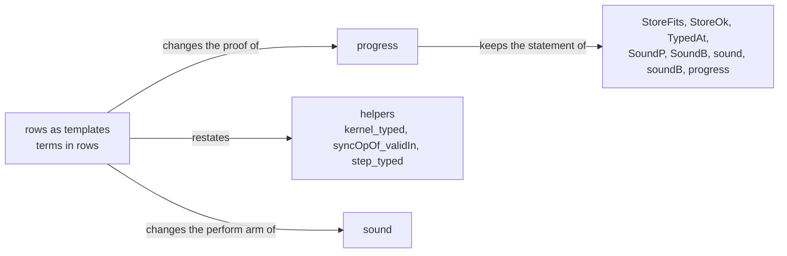
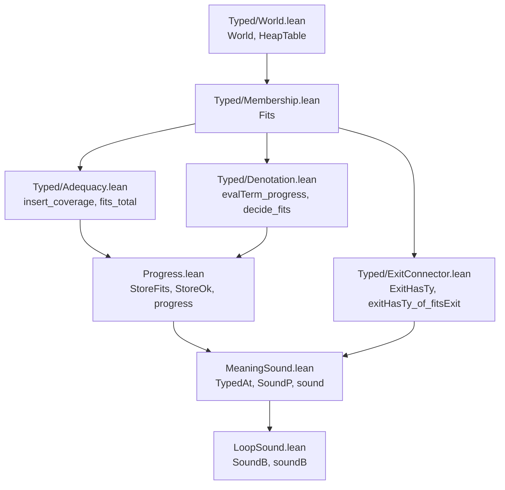

# 2026-10-04 seat T1 design: the straight theorems at the typed world

Status: research note (history, not authority). Base: `54701843`, branch `seat/t1`.

**Outcome (phase 2).** The receipt `docs/research/2026-10-04-seat-T1-receipt.md` records what
landed. The rulings changed P1 in one place: `Denote.StoreFits` extends the cell columns that the
typed state shares (`Typed.CellsTyped`). Each native row is proved once, on those columns
(`Typed.CellImplements`).

**The one thing to know first.** The restated invariant types the environment, the answers and
the cells with `Fits` at a world. Its cell column is the typed state's own strong column, not the
coarse `HeapTable`. Today's `progress` cannot keep a store-level statement through T3, so it is
proposed as the lemma of the `perform` node (decision D2).

## Question

Slice T1 of the state plan (`docs/research/2026-10-04-claude-lead/state-any-type-plan.md` §3) is
ruled as row 209. It restates `sound`, `soundB` and `progress` over the typed world's per-cell
table, keeps their generality, and deletes `HeapNat`. This note answers the brief's phase 1: the
consumers, the dependency test, and the restated statements with their placement.

## What was read or run

| Item | Evidence word |
| --- | --- |
| The plan's §1, §3 (T1, T3), §5; rows 42, 43, 96, 209; FR-03 of the 2026-09-21 foundations review; the monitor's finding `t1-requires-scope-check-not-only-acyclicity` | reading |
| `MeaningSound.lean`, `LoopSound.lean`, `Progress.lean`, `SoundAnySignature.lean`, `TypedRun.lean`; `Typed/World.lean`, `Typed/Membership.lean`, `Typed/Adequacy.lean`, `Typed/Denotation.lean`, `Typed/Results.lean`, `Typed/ExitConnector.lean` | reading |
| Every use of the restated declarations in `src`, `Test`, `tools`, `generated` and the authority documents (`grep`) | tested |
| The dependency test, `ProofGraph.reachedAxioms` with fresh memos (scratch `T1Deps.lean`) | tested |
| The import graph with the `Typed/World.lean` → `Progress.lean` edge removed (scratch `imports.py`) | tested |
| `#print axioms` of the 40 lemmas the restatement reuses (scratch `T1Axioms.lean`) | tested |
| A prototype of the restated statements (scratch `T1Proto.lean`) | tested |

Copies of `T1Deps.lean` and `T1Proto.lean` sit in `docs/research/2026-10-04-seat-T1/`. Replay
each with `lake env lean` at the worktree root, under the shared lock. Phase 2 force-adds
`T1Deps.lean` only: the prototype holds `sorry` bodies, and the landing supersedes it.

## Findings

### F1. The consumers (brief step 1)

| Declaration | Consumers, by name and file |
| --- | --- |
| `sound` | `meaning_typed`, `meaning_never_wrong`, `meaning_stores` (`MeaningSound.lean`); `soundB_leaf` (`LoopSound.lean`); axiom prints in `Test/Program/MeaningSoundContract.lean` and `Test/Program/MapTyping.lean` |
| `soundB` | `meaningB_never_wrong`, `meaningB_typed`, `meaningB_stores` (`LoopSound.lean`); axiom print in `Test/Program/LoopSoundContract.lean` |
| `progress` | the `perform` arm of `sound` (`MeaningSound.lean`); nothing else |
| `TypedAt` and its fields `fits`, `valid`, `wf`, `heap` | `TypedAt.push`, `TypedAt.later`, `TypedAt.bound`, `TypedAt.empty`, `sound` (`MeaningSound.lean`); `soundB_leaf`, `soundB` (`LoopSound.lean`) |
| `SoundP` and its fields `independent`, `exit`, `le`, `wf`, `heap` | `SoundP.pure`, `SoundP.widen`, `SoundP.bind`, `Sound`, `sound` and the three corollaries (`MeaningSound.lean`); `SoundB.of_sound` (`LoopSound.lean`) |
| `StoreOk` and its fields `le`, `wf`, `heap` | `SoundB`, `SoundB.pure`, `SoundB.of_sound`, `SoundB.thenB`, `iter_soundB`, `soundB`, `meaningB_stores` (`LoopSound.lean`); nothing else |
| `Stores.HeapNat` | `instDecidableHeapNat`, `Stores.empty_heapNat`, `step_typed`, `answer_typed`, `step_heapNat`, `progress` (`Progress.lean`); `TypedAt`, `SoundP`, `TypedAt.push`, `TypedAt.later`, `SoundP.pure`, `meaning_stores` (`MeaningSound.lean`); `StoreOk`, `SoundB.pure`, `iter_soundB`, `meaningB_stores` (`LoopSound.lean`); `heapNat_iff`, `heapNotMonotone` and the `Effect4.TypedState` attribute list (`Typed/World.lean`); two docstrings (`Typed/Vocabulary.lean`); `#guard`s (`Test/Program/ProgressContract.lean`); items 32, 33, 35 and two register lines (`Test/contracts/program-denotation.contract.md`); `E4-PROGRESS-CE-001` and `-002` (`Test/Counterexamples/REGISTER.md`); R4's open part (`tools/Tools/SemanticsRegistry.lean`, projected into `generated/semantics.md`); row 42's text (`docs/core/decisions.md`, the coordinator's) |
| `FnName.total_hasTy_nat` and its three siblings | `NativeOp.kernel_typed` (`Progress.lean`); four lines of `Test/fixtures/proof-style/baseline.tsv` |
| `Val.hasTy_cell_refTy`, `Val.hasTy_promise_deferredTy`, `Val.hasTy_scopeHandle_scope`, `Val.hasTy_tuple_snd` | `NativeOp.kernel_typed` and `step_typed` (`Progress.lean`) only |
| `evalTerm_validIn`, `Decision.decide_validIn` (with `validIn_list_mem` inside it) | `sound` (`MeaningSound.lean`) and `soundB` (`LoopSound.lean`); axiom prints in `Test/Program/TupleHandles.lean`, `MapTyping.lean`, `RecordOperations.lean`; one sentence of `docs/core/semantics.md` §2.2 |
| `evalTerms_validIn`, `NativeAtom.eval_validIn`, `Lit.toVal_validIn`, `valOfErr_validIn`, `asList?_validIn`, `validIn_list_of_mem` | no consumer in `src` today; `NativeAtom.eval_validIn` has an axiom print in `Test/Program/MapTyping.lean` |
| Statements that keep their text and whose proofs pass through the above | `meaning_typed`, `run_typed`, `meaning_never_wrong` (`MeaningSound.lean`); `meaningB_typed`, `meaningB_never_wrong` (`LoopSound.lean`); `meaning_typed_app`, `run_typed_app`, `meaningB_typed_app` (`SoundAnySignature.lean`); `TypedProgram.run_sound`, `run_sound_of_agreement`, `run_soundB` (`TypedRun.lean`); the claims `straight-meaning-typed` and `sound-at-app-signature`; R1's top nodes |
| Not consumers | `run_eq_meaning` and `loopAgreement` (F2); `exits_hasTy` and `root_exit_hasTy` (`Typed/Results.lean`), which read only `ExitHasTy` through `exitHasTy_of_fitsExit` |

### F2. The dependency test (brief step 2)

The walk is `ProofGraph.reachedAxioms env root stop` with a fresh memo per root. The stop predicate
names `Denote.sound`, `Denote.soundB` and `Program.progress`, so each is a leaf that the walk
reports and does not enter. Tested at `54701843`:

| Root | `sound` reached | `soundB` reached | `progress` reached | Other leaves |
| --- | --- | --- | --- | --- |
| `run_eq_meaning` (`Agreement/Machine.lean`) | no | no | no | `propext`, `Quot.sound` |
| `loopAgreement` (`Agreement/Loop.lean`) | no | no | no | `propext`, `Quot.sound` |
| control: `meaning_typed` | yes | no | no | `propext`, `Quot.sound` |
| control: `meaningB_typed` | no | yes | no | `propext`, `Quot.sound` |
| control: `meaning_typed`, stop at `progress` alone | — | — | yes | `propext`, `Quot.sound` |

With the three theorems as stops, `progress` is reachable only through `sound`, a stop leaf. The
third control therefore stops at `progress` alone, and the walk finds it.

A second walk stops at every declaration of the three modules `MeaningSound`, `LoopSound` and
`Progress`. `run_eq_meaning` and `loopAgreement` reach none of them, and the control
`meaning_typed` reaches five. Over whole modules, none of the 137 declarations of
`Agreement/Loop.lean` and none of the 663 of `Agreement/Machine.lean` reaches one.

Two consequences:

- Both equal-observation theorems are independent of the three theorems, so the restatement
  cannot break them. The import graph agrees: `Typed/Validity.lean` imports `RuntimeR.lean`, which
  imports `Agreement/Machine.lean`, so the typed state sits above `run_eq_meaning`.
- `Agreement/Loop.lean` imports `LoopSound.lean` and uses none of it. After T1 that import would
  make the loop agreement rebuild behind the typed state (D4).

### F3. The coarse column cannot carry T3's reads

`HeapCell` (`Typed/World.lean`) types a stored value with `ValueOk`, which is `Val.hasTy` at the
world's allocation table. `Val.hasTy`'s `refOf` arm accepts every cell handle (row 44, DI-17).
Take a world whose cell 1 is declared at `refOf nat` and holds `Val.cell ⟨2⟩`, with cell 2
declared at `string`. `HeapTable` holds there, while `Fits w (Val.cell ⟨2⟩) (refOf nat)` is
`RefDeclared w ⟨2⟩ nat`, which fails. At T3 a program that reads cell 1 and then reads the answer
at `Ref<number>` would answer a string at `number`. An invariant over the coarse column is
therefore not inductive once rows read nested handles (reading; D8 proposes the world as a red
control). The plan's route 2 named `HeapCell` and `HeapTable`; this note reuses the strong column
instead, which `heapTable_of_fits` (`Typed/Membership.lean`) takes to the coarse one.

### F4. The typed state already proves every world-level lemma the arms need

| Arm or step | Lemma, file | Axioms (tested) |
| --- | --- | --- |
| a term evaluates and fits | `evalTerm_progress` (`Typed/Denotation.lean`) | `propext`, `Quot.sound` |
| a cause evaluates, fits and is shape-free | `causeOf_progress` (`Typed/Denotation.lean`) | the same |
| a decision decides and its binder fits | `decide_fits`, `BoundFits` (`Typed/Denotation.lean`) | the same |
| the environment grows and moves | `envTyped_nil`, `envTyped_append` (`Typed/Denotation.lean`); `envTyped_mono` (`Typed/Residual.lean`) | the same |
| an exit widens, moves and combines | `exitOk_widen`, `exitOk_restore` (`Typed/Seq.lean`); `strongExit_mono` (`Typed/Residual.lean`); `fitsExit_subN` (`Typed/Membership.lean`) | the same |
| a cell read at its declaration | `fits_refTy_inv`, `fits_deferredTy_inv` (`Typed/Denotation.lean`); `fits_subN` (`Typed/Membership.lean`) | the same |
| the heap rows as one kernel | `indexed_ref_step_preserves` (`Laws/Machine/RefKernel.lean`), FR-03's index-aware adapter | the same |
| allocation | `refMake_extension`, `deferredMake_extension` (`Typed/World.lean`); `insert_coverage` (`Typed/Adequacy.lean`) | at most `propext`, `Quot.sound` |
| the function names on numbers | `fits_total`, `fits_partialUpdate`, `modify_nat`, `modifySome_nat` (`Typed/Adequacy.lean`) | the same |
| a completion | `complete_cellAt`, `complete_cells_length` (`Typed/Adequacy.lean`) | `propext` |
| validity from membership | `fits_live`, `live_validIn` (`Typed/Membership.lean`) | `propext`, `Quot.sound` |

No new judgment is needed. The restatement composes these with the machine's step lemmas
(`syncOpStep_le`, `syncOpStep_wf`, `syncOpStep_externals`, `syncOpStep_isSome_of_valid`).

## Proposals (not rulings)

### P1. The restated statements

Lean elaborates every statement below in the prototype (tested). The prototype proves
`StoreOk.refl`, `StoreOk.trans`, `TypedAt.later`, `TypedAt.push`, `SoundP.pure`, `SoundP.widen`,
`SoundP.bind`, `TypedAt.empty`, `runP_externals`, the world move `StoreFits.restate` and the
heap-row step `kernel_step`. Its only `sorry`s are the bodies of `sound`, `soundB`, `iter_soundB`
and `progress`. From their statements it proves `meaning_typed` with its current text, and the
restated `meaning_stores` and `meaningB_stores`.

```lean
namespace Effect4.Program.Denote

/-- The store half at a world: the world declares exactly the allocated cells and Deferred
cells, every cell's value fits its declared type (the typed state's strong column), and the
store is well-formed. -/
structure StoreFits (w : Typed.World) : Prop where
  heap : ∀ key, (w.Ρ key).isSome = true ↔ key.index < w.state.refs.length
  promises : ∀ key, (w.«Π» key).isSome = true ↔ key.index < w.state.deferreds.cells.length
  values : Typed.Columns.Stores_refs
    (fun w key v => ∀ ty, w.Ρ key = some ty → Typed.Fits w v ty) w w.state.refs
  wf : w.state.WF

/-- After a run: a later world in the host order whose store fits again. -/
structure StoreOk (w w' : Typed.World) : Prop where
  le : w.leHost w'
  store : StoreFits w'

/-- What a run keeps: the environment fits its types at the world, and the store fits. -/
structure TypedAt (tys : TyEnv) (env : List Val) (w : Typed.World) : Prop where
  fits : Typed.EnvTyped w tys env
  store : StoreFits w

/-- Two programs run alike from a world, and the run reaches a later world over the stores it
leaves, whose store fits, at which its exit fits the type with no shape defect (`ExitOk`). -/
structure SoundP (pw pd : Effects.Program StoreSig ExitV) (w : Typed.World) (answer error : Ty) :
    Prop where
  independent : runP pw w.state = runP pd w.state
  reaches : ∃ w', w'.state = (runP pd w.state).2 ∧ StoreOk w w' ∧
    Typed.ExitOk w' ⟨answer, error, Env.Requirement.empty⟩ (runP pd w.state).1

abbrev Sound (bad : ExitV) (e : NativeEff) (env : List Val) (w : Typed.World) (t : EffTy) : Prop :=
  SoundP (denoteWith bad e env) (denote e env) w t.answer t.error

structure SoundB (pw pd : Effects.Program StoreSig (Option ExitV)) (w : Typed.World)
    (answer error : Ty) : Prop where
  independent : runP pw w.state = runP pd w.state
  reaches : ∃ w', w'.state = (runP pd w.state).2 ∧ StoreOk w w' ∧
    ∀ ex, (runP pd w.state).1 = some ex → Typed.ExitOk w' ⟨answer, error, Env.Requirement.empty⟩ ex

theorem sound (bad : ExitV) : ∀ (e : NativeEff) (tys : TyEnv) (env : List Val) (w : Typed.World)
    (t : EffTy), Straight e = true → effTy nativeSignature tys e = some t →
    TypedAt tys env w → Sound bad e env w t

theorem soundB (bad : ExitV) (k : Nat) : ∀ (e : NativeEff) (tys : TyEnv) (env : List Val)
    (w : Typed.World) (t : EffTy), Looped e = true → effTy nativeSignature tys e = some t →
    TypedAt tys env w → SoundB (denoteBWith bad k e env) (denoteB k e env) w t.answer t.error

theorem iter_soundB {fw fd : Val → Effects.Program StoreSig (Option ExitV ⊕ Val)}
    {answer error : Ty} (Inv : Val → Typed.World → Prop) (hinv : ∀ c w, Inv c w → StoreFits w)
    (hstep : ∀ c w, Inv c w → runP (fw c) w.state = runP (fd c) w.state ∧
      ∃ w', w'.state = (runP (fd c) w.state).2 ∧ StoreOk w w' ∧
        (∀ ex, (runP (fd c) w.state).1 = .inl (some ex) →
          Typed.ExitOk w' ⟨answer, error, Env.Requirement.empty⟩ ex) ∧
        (∀ c', (runP (fd c) w.state).1 = .inr c' → Inv c' w')) :
    ∀ (k : Nat) (c : Val) (w : Typed.World), Inv c w →
      SoundB (Option.join <$> iter fw k c) (Option.join <$> iter fd k c) w answer error

/-- Every program of the store signature keeps the external allocations (new). -/
theorem runP_externals {A : Type} :
    ∀ (p : Effects.Program StoreSig A) (s : Stores), (runP p s).2.externals = s.externals

theorem meaning_stores (e : NativeEff) (t : EffTy) (hs : Straight e = true)
    (hty : effTy nativeSignature [] e = some t) :
    ∃ w, w.state = (meaning e [] Stores.empty).2 ∧ StoreFits w

theorem meaningB_stores (k : Nat) (e : NativeEff) (t : EffTy) (hl : Looped e = true)
    (hty : effTy nativeSignature [] e = some t) :
    ∃ w, w.state = (meaningB k e [] Stores.empty).2 ∧ StoreFits w

end Effect4.Program.Denote

namespace Effect4.Program

/-- A typed `sync` node denotes one store operation, which steps from a world whose store fits
to an answer of the node's type, at a later world whose store fits again. -/
theorem progress (op : NativeOp) (r : Term) (tys : TyEnv) (env : List Val) (w : Typed.World)
    (t : EffTy) (hkind : (NativeOp.row op).kind = .sync)
    (hty : effTy nativeSignature tys (.perform op r) = some t)
    (henv : Typed.EnvTyped w tys env) (store : Denote.StoreFits w) :
    ∃ o w' a, Denote.denote (.perform op r) env =
        Effects.Program.bind (Effects.Program.perform (S := Denote.StoreSig) o)
          (fun v => pure (Exit.success v)) ∧
      syncOpStep o w.state = some (w'.state, a) ∧ Denote.StoreOk w w' ∧
      Typed.Fits w' a t.answer

end Effect4.Program
```

These keep their text: `meaning_typed`, `meaning_never_wrong`, `run_typed`, `meaningB_typed`,
`meaningB_never_wrong`, the three `_app` theorems and the three `TypedProgram` theorems. The
corollaries start at `initialWorld t` (`Typed/Validity.lean`), whose state is `Stores.empty`. They
reach `ExitHasTy` through `exitHasTy_of_fitsExit`. Its two premises are `runP_externals` (the
allocation table stays empty) and `live_validIn` with the store half's coverage (a success is
valid).

The generality the monitor asked for stays: `sound` and `soundB` quantify over every typed
environment and every world whose store fits, not over closed programs. `SoundP` keeps
independence of the wrong-shape exit, the store order (the host order contains `Stores.le`) and
well-formedness (`StoreFits.wf`).

### P2. Which judgment types what, and why

- The environment: `EnvTyped w tys env` (`Typed/Admission.lean`), the typed state's environment
  judgment, pointwise `Fits`. A handle in scope then carries its declaration:
  `Fits w (Val.cell k) (refOf A)` is `RefDeclared w k A`.
- The answers and the exits: `ExitOk` (`Typed/Admission.lean`), R9's exit judgment. It is
  `FitsExit` with the shape-defect exclusion. The binders need it: `catchCause` binds a cause at
  `causeOf e` and `onExit` binds the reified exit at `exitOf a e`. `Fits` reads both arms through
  the cause's fit and its shape.
- The cells: the table `Ρ` with the strong column, every stored value fitting its declared type.
  This clause is `StoreTyped.values` (`Typed/Adequacy.lean`) and the generated column at
  `(preds root).HeapCell` (`Typed/Assembly.lean`), so it introduces no third membership judgment.
- `Val.hasTy` remains only in `ExitHasTy`, the public conclusion. `fits_hasTy` relates it to `Fits`.

The reason is row 44: `Val.hasTy` is coarse at handles, so only the world's tables say what a
handle holds. `Fits` at a world is row 96's production judgment.

### P3. A cell read at its declared type

`refGet`'s request `Val.cell k` fits the row's request type. Today that type is the spelling
`Ref.Ref<number>`, which `HandleFits` reads as `RefDeclared w k nat` (row 96 D2). So the world
declares `k` at some `t'` with `Equiv t' nat`. `StoreFits.heap` puts `k` below the heap's length,
so the read is not a frontier. `StoreFits.values` gives `Fits w a t'` for the value `a` in the
cell, and `fits_subN` with the first half of `Equiv` gives `Fits w a nat`. `fits_mono` carries the
answer to the later world. At T3 the request type is `refOf A`, and the same steps give
`Fits w a A`. This is the typed state's `refRead_nat` (`Typed/Denotation.lean`) at the instance.

The twelve heap rows share one proof:

1. The restated table `NativeOp.kernel_typed` gives each row's cell `t'` and says its kernel
   keeps `Fits w · t'` and answers in the row's answer type.
2. `indexed_ref_step_preserves` types the new heap index by index.
3. `StoreFits.restate` moves to the world over the new store. Its host order holds because every
   stored value fits strongly, so the coarse `CellCompatible` follows by `fits_hasTy`.

The prototype proves steps 2 and 3 as `kernel_step` (tested).

### P4. How `refMake` extends the table

1. The fresh key is `⟨w.state.refs.length⟩`. `StoreFits.heap` leaves `w.Ρ` undeclared there.
2. The new world is `w.addRef s' ⟨len⟩ A`, where `A` is the cell type of `t.answer`. Today
   `t.answer` is the spelling `Ref.Ref<number>`, read at `nat`; at T3 it is `refOf A`.
3. `refMake_extension` (`Typed/World.lean`) gives `w.le (w.addRef …)`. The externals are unchanged
   (`syncOpStep_externals`), so the host order holds.
4. `insert_coverage` (`Typed/Adequacy.lean`) extends the coverage. Old values move by `fits_mono`;
   the new cell holds the request, which fits `A`.
5. The answer fits: `RefDeclared (w.addRef …) ⟨len⟩ A` holds by `insert_here` and `Equiv A A`.

`deferredMake` is the same with `w.addPromise` at `(nat, nat)` today and at its type arguments at
T3.

### P5. What `Ρ ≡ nat` gives for today's closed rows

- `HandleFits` reads the cell spelling as a declaration at `nat`, and `refMake` declares every new
  cell there. So every world that today's rows reach from `initialWorld` declares every allocated
  cell at `nat`.
- On such a world `StoreFits.values` says every cell holds a number: the old `HeapNat`, with
  coverage. The deleted `heapNat_iff` states the coarse half of this under the premise `Ρ ≡ nat`.
- The restated theorems also quantify over worlds that declare cells at other types. Today's rows
  cannot touch those cells, because a request must fit `Ref.Ref<number>`.
- A world over `E4-PROGRESS-CE-001`'s heap `[Val.bool true]` has `StoreFits` only if it declares
  cell 0 at a type that `Val.bool true` fits. `Val.cell ⟨0⟩` then does not fit `Ref.Ref<number>`,
  so no typed program reads it.
- No public statement needs to stay number-only. `meaning_stores` and `meaningB_stores` restate per
  cell, and `heapNat_iff` loses its last consumer.

### P6. What T3 changes



The diagram shows which of T1's declarations T3 touches and how; it claims nothing about T3's proofs.

- The rows become templates. The proof of `progress` replaces the closed-row reduction
  (`rowTy_closed_some`, `nativeSignature_row_closed`) by the template match.
- A term row needs the environment, so `syncOpOf` or its successor takes it, and `denote`'s
  `perform` arm with it. The internal helpers `NativeOp.kernel_typed`, `syncOpOf_validIn` and
  `step_typed` are restated, and the `perform` arm of `sound` splits on the new decode.
- `refMake` declares at the instance (P4), and `Deferred.make` at its type arguments.
- No restated statement changes. `StoreFits`, `StoreOk`, `TypedAt`, `SoundP`, `SoundB`, `sound`,
  `soundB`, `iter_soundB`, `progress` and the corollaries mention no row, no `syncOpOf` and no
  `FnName`.
- If the proof of `progress` does not follow at T3, T3 lands it as a planned goal with this
  statement, placed per row 207. T4 proves it beside the `Typed/Adequacy.lean` rows.
- The store half types no Deferred completion. A row that answers a completion's value (DI-97's
  `poll`) would add the promise column then; T3 adds none.

The confirmation is by reading the plan's T2 and T3 text. Today the statements are tested to
elaborate only.

### P7. Module plan, files and deletions

The diagram shows the import order after the change; an edge is an import, direct or through other
modules. It claims no proof.



`Typed/World.lean` stops importing `Progress.lean`. With that edge removed, no typed-state module
reaches `Progress.lean`, `MeaningSound.lean` or `LoopSound.lean` (tested on the import graph).

The cost is layering. The straight theorems then sit above `Typed/Denotation.lean`, which holds
M5's arms. Under the planned imports, the import closure of `MeaningSound.lean` grows from 154 to
212 `Effect4` modules, with no cycle (tested with the import script). The term, cause and decision
lemmas of `Typed/Denotation.lean` read no `TypedProg`, so a later slice could move them lower; T1
does not.

| File | Change |
| --- | --- |
| `src/Effect4/Laws/Program/Progress.lean` | defines `StoreFits` and `StoreOk` (moved from `LoopSound.lean`, namespace `Denote` kept); restates `NativeOp.kernel_typed`, `syncOpOf_validIn`, `step_typed`, `progress`; adds `StoreFits.restate`, `kernel_step` |
| `src/Effect4/Laws/Program/MeaningSound.lean` | restates `TypedAt`, `SoundP`, `Sound`, `sound` and its lemmas, `meaning_stores`; adds `runP_externals`; keeps `denoteWith` |
| `src/Effect4/Laws/Program/LoopSound.lean` | restates `SoundB`, `iter_soundB`, `soundB`, `meaningB_stores` |
| `src/Effect4/Laws/Program/Typed/World.lean` | drops the `Progress` import; deletes `heapNat_iff`; restates `heapNotMonotone` (D5) |
| `src/Effect4/Laws/Program/Typed/ExitConnector.lean` | receives `ExitHasTy` and drops its `MeaningSound` import (D3) |
| `src/Effect4/Laws/Program/Typed/Vocabulary.lean` | two docstrings (D4) |
| `src/Effect4/Laws/Program/Agreement/Loop.lean` | drops the unused `LoopSound` import (D4) |
| `Test/Program/ProgressContract.lean` | the `HeapNat` guards become numeric guards on today's stores and the two register rows at worlds; the D8 red control; an ascription of `progress`'s statement, which the file's header promises and does not have |
| `Test/Program/MeaningSoundContract.lean`, `LoopSoundContract.lean` | kept; rebuilt |
| `Test/Program/TupleHandles.lean`, `MapTyping.lean`, `RecordOperations.lean` | axiom prints of deleted declarations go (D6) |
| `Test/contracts/program-denotation.contract.md` | items 32–35 and the two register lines restated |
| `Test/Counterexamples/REGISTER.md` | `E4-PROGRESS-CE-001` and `-002` restated in place |
| `tools/Tools/SemanticsRegistry.lean`, `generated/semantics.md` | R4's open part on the straight theorems goes |
| `docs/core/semantics.md` | one sentence of §2.2 (D4, D6) |

Deleted: `Stores.HeapNat`, `instDecidableHeapNat`, `Stores.empty_heapNat`, the four
`FnName.*_hasTy_nat`, `Val.hasTy_cell_refTy`, `Val.hasTy_promise_deferredTy`,
`Val.hasTy_scopeHandle_scope`, `Val.hasTy_tuple_snd`, `answer_typed` and `step_heapNat`
(`Progress.lean`); `hasTy_of_sub_normalize` (`LoopSound.lean`); `heapNat_iff` (`Typed/World.lean`).
Also deleted when the build finds no other consumer: `ExitHasTy.widen`, `ExitHasTy.later`,
`exitOk_fail`, `reify_ok`, `restore_ok`, `causeAdmits_of_forall`, `causeAdmits_combine`
(`MeaningSound.lean`), and the validity family under D6.

### P8. Placement

`sound` and `soundB`:

- Concept: `residual-program-typing`; property: the fundamental property of the meaning on
  `Straight` and `Looped`, serving `store-typing`'s cell column.
- Question: claim `straight-meaning-typed` (role `fundamentalProperty`, pointer `meaning_typed`)
  and `sound-at-app-signature` (role `compatibility`, pointer `run_typed_app`), as their
  decomposition. Consumers: the corollaries in P1.
- Reach: the checker's judgment `effTy nativeSignature` on the fragments `Straight` and `Looped`.
  The hypotheses are an environment typed by `EnvTyped` at a world whose store fits. The
  observation is `runP` of `denote` and `denoteWith`, exit and stores, at every budget for
  `soundB`. Bounds: rows 42, 43, 96, 209; `E4-PROGRESS-CE-001`, `-002`.
- Does not establish: the machine, which `run_eq_meaning` and `loopAgreement` relate. Neither
  fragment holds host rows, services or the asynchronous rows. Deferred completions stay untyped,
  and no template row exists before T3.
- Unlocks: R4's open part 2, so T3 needs no second restatement; R1 through the `_app` theorems.

`progress`:

- Concept: `residual-program-typing`; property: compatibility of the `perform` rule, serving
  `store-typing`'s `store-safety` (absent in the registry, row 139).
- Question: a step of claim `straight-meaning-typed`; consumer: the `perform` arm of `sound`.
- Reach: the native `sync` rows at the built-in signature; every world whose store fits; every
  environment `EnvTyped` at it; the step relation `syncOpStep`. It states progress of `syncOpStep`
  at a typed node (no frontier) and preservation of `StoreFits` along it.
- Does not establish: concurrency (one store step is atomic in the model only); the asynchronous
  and host rows; anything about the frame machine.
- Unlocks: the T3-stable interface of the store rows for the meaning (P6).

The internal helpers (`NativeOp.kernel_typed`, `syncOpOf_validIn`, `step_typed`,
`StoreFits.restate`, `kernel_step`):

- Concept: `store-typing`; property: the store half kept by one store step.
- Question: steps of `progress`; consumer: `progress`.
- Reach: one `syncOpStep` from a world whose store fits, at a request that fits the row's request
  type. For `restate` the step keeps the declarations instead.
- Does not establish: anything at T3's rows; T3 restates them.
- Unlocks: `progress`.

`meaning_stores`, `meaningB_stores` and `runP_externals`:

- Concept: `store-typing` for the first two, `residual-program-typing` for the third.
- Question: corollaries of `sound` and `soundB`; `runP_externals` is a step of
  `straight-meaning-typed`, consumed by `meaning_typed` and `meaningB_typed`.
- Reach: closed programs from `Stores.empty`; for `runP_externals`, every program of the store
  signature from every store.
- Does not establish: that a cell's declared type is unique to the run; the world is existential.
- Unlocks: deletion of the last number-only public statement.

No planned goal is expected. If a proof does not follow at once in phase 2, the goal carries its
placement as `@[semantics "<concept>" (requirement := R4)] proof_goal …` (row 207), and the receipt
lists it.

### P9. Decisions for the coordinator

| Id | Question | Options | Recommendation |
| --- | --- | --- | --- |
| D1 | The store half | (a) `StoreFits`: coverage, the strong column, `WF`; the heap rows by the kernel route. (b) `StoreTyped root w` with `w.state.WF`: a source parameter on `TypedAt`, `SoundP`, `sound`, `soundB` and `progress`; `progress` then follows from `syncRow_typed`, `storeStep_typed` and the `…_implements` theorem of each row's store operation, so T4 proves each row once | (a): it is what row 209 names, it reads no source, and it does not narrow the hypothesis; (b) narrows it (closed scopes' exits shape-free, the memo table typed against the source) |
| D2 | The form of `progress` | (a) the `perform` node (P1). (b) store-level at the checker's row judgment: closer to today's shape, but T3 restates it, because `syncOpOf` and the row judgment take the environment for term rows | (a): it survives T3 |
| D3 | The home of `ExitHasTy` | (a) move it to `Typed/ExitConnector.lean`, which `MeaningSound.lean` then imports, so the corollaries use `exitHasTy_of_fitsExit`. (b) repeat the connector's argument in `MeaningSound.lean`: no file outside the brief | (a): one connector |
| D4 | Files outside the brief's list | `Typed/ExitConnector.lean` (D3); `Typed/Vocabulary.lean` (two docstrings name `HeapNat`); `Agreement/Loop.lean` (an unused import, F2); `docs/core/semantics.md` (one sentence names `evalTerm_validIn` as a step of `sound`); the three tests of D6; `Test/fixtures/proof-style/baseline.tsv` if the ratchet asks. `Typed/World.lean` is implied by `heapNat_iff` | approve each, or strike it |
| D5 | `heapNotMonotone` | restate it over `HeapTable` with its name: store growth alone does not keep the cell column, beside `world_order_refuses`; or delete it with `HeapNat` | restate: it is the red control for `CellCompatible` in `World.le` |
| D6 | The raw-handle validity family of F1 (nine lemmas in `MeaningSound.lean`) | delete it with the three tests' axiom prints and the semantics sentence; or keep it without a consumer | delete: `live_validIn` supersedes it in `sound` and `soundB`, and six of the nine have no consumer today |
| D7 | Route 1 | add the closed-program exit corollary from `exits_hasTy`; or add nothing | nothing: `root_exit_hasTy` already states it on every fragment, and a transport to the meaning would cost `run_eq_meaning`'s replay and lose the stores and the independence |
| D8 | The red control of F3 | a fixture in `Test/Program/ProgressContract.lean`: a world where `HeapTable` holds and the strong column fails | add it |

No decisions row is proposed; row 209 covers the slice.

## What this does not establish

- Phase 2 owes the proofs of `sound`, `soundB` and `progress`; the prototype states them only.
- The T3 claim of P6 is by reading the plan; T3's design may differ.
- The dependency test is a finite walk of the environment at `54701843`; it says nothing about
  later commits.
- Nothing here concerns concurrency, the frame machine, host rows, services, Deferred completion
  typing or R1 beyond service declarations at fresh codes.
- An invariant is not progress of the machine. The restated `progress` speaks of `syncOpStep` at
  one typed node only.
