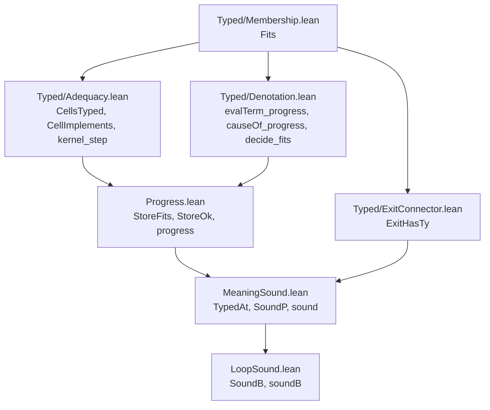

# 2026-10-04 seat T1 receipt: the straight theorems at the typed world

Status: receipt (history, not authority). Branch `seat/t1`, worktree
`/Users/pooks/Dev/lean4-effect4-t1`. Brief: the coordinator's seat T1 brief, with its phase 2
rulings on D1–D8. Design note: `docs/research/2026-10-04-seat-T1-design.md`.

**The one thing to know before merging.** `Typed.StoreTyped` now extends `Typed.CellsTyped`
(`src/Effect4/Laws/Program/Typed/Adequacy.lean`). A flat anonymous constructor of `StoreTyped`
no longer elaborates. Nest the cell columns: `⟨⟨heap, promises, values⟩, scopeExits, memo,
memoTable⟩`. Projections such as `store.heap` are unchanged. Seat E1 edits `valOfErr_validIn` and
`causeAdmits_of_forall` in `src/Effect4/Laws/Program/MeaningSound.lean`, and this branch deletes
both. Resolve that conflict by the deletion. The `fail` arm of `sound` reads
`Typed.valOfErr_errOf_fits` and cases on no `Err` constructor, so E1's payload arm needs no edit
here.

## Base and head

| Item | Commit |
| --- | --- |
| Branch creation | `54701843` |
| Base of phase 2 | `2531127d`: `refactor/phase1-phase3`, merged by fast-forward |
| The restatement | `194928f8` |
| This receipt | the commit after `194928f8` |

## What landed

Decisions row 209 is implemented. `sound`, `soundB` and `progress` keep their names. They are
restated over the typed world: the environment fits at a world (`Typed.EnvTyped`), and the store
fits (`Denote.StoreFits`). `Stores.HeapNat`, `step_heapNat` and the four `FnName.*_hasTy_nat` are
deleted, with every lemma the restatement supersedes. No planned goal was added.

The diagram shows the import order after the change. An edge is an import, direct or through
other modules. It claims no proof.



| Ruling | What landed |
| --- | --- |
| D1 (a), refined | `Typed.CellsTyped` holds the three cell columns once. `Typed.StoreTyped` and `Denote.StoreFits` extend it, so no column is duplicated and no field correspondence is owed. |
| D1, the row step | `Typed.CellImplements` is a row's step on the cell columns. Each native `sync` row has one instance; the twelve heap kernels are `kernel_step` over the table `kernel_typed`. |
| D1, one proof per row | `CellImplements.implements` reads an instance on the typed state. The nineteen native-row `*_implements` theorems are now its one-line instances, with their statements kept. |
| D1, the cap | The refactor needed eight proof edits, under the cap of about a dozen: the six `*_world` lemmas of `Typed/Adequacy.lean`, one constructor in `Typed/Assembly.lean` and one in `Test/Program/MemoTable.lean`. No projection changed. |
| D2 | `progress` is stated at the `perform` node. It names no row, no decoder and no function name. |
| D3 | `Denote.ExitHasTy` moved to `src/Effect4/Laws/Program/Typed/ExitConnector.lean`, which imports `Typed/Membership.lean` only. |
| D4 | Every listed file. `Test/fixtures/proof-style/baseline.tsv` lost four rows, by `make record-proof-style`. |
| D5 | `heapNotMonotone` is restated over `HeapTable` (`src/Effect4/Laws/Program/Typed/World.lean`). |
| D6 | The raw-handle validity family is deleted, with the axiom prints in three batteries and the sentence of `docs/core/semantics.md` §2.2. |
| D7 | Nothing added. `root_exit_hasTy` (`src/Effect4/Laws/Program/Typed/Results.lean`) already states the closed-program corollary. |
| D8 | `coarseWorld` in `Test/Program/ProgressContract.lean`: the coarse column holds there, and the cell columns fail. |

Beyond the listed files, the build asked for three edits. `Test/Program/TupleHandles.lean` and
`Test/Program/RecordOperations.lean` now import `Effect4.Laws.Program.Handles.Term` themselves.
They had reached it through `MeaningSound.lean`, which no longer imports it. Two docstrings of
`Typed/Membership.lean` named `StoreTyped.heap`, which is now `CellsTyped.heap`.

The layering cost is as ruled. The import closure of `MeaningSound.lean` grew from 156 to 212
`Effect4` modules; that of `LoopSound.lean` from 157 to 213. `Agreement/Loop.lean` dropped its
unused `LoopSound.lean` import, and its closure shrank from 170 to 142 (tested with the import
script of the design note).

## Changed files

| File | Change |
| --- | --- |
| `src/Effect4/Laws/Program/Typed/Adequacy.lean` | `CellsTyped`; `StoreTyped` extends it; `CellImplements` and its native instances; `kernel_step`, `kernel_typed`; `CellImplements.implements`; the nineteen native `*_implements` re-derived |
| `src/Effect4/Laws/Program/Progress.lean` | `Denote.StoreFits`, `Denote.StoreOk`, `StoreFits.step`, `NativeOp.syncOpOf_cellImplements`, `progress` |
| `src/Effect4/Laws/Program/MeaningSound.lean` | `TypedAt`, `SoundP`, `sound` and the corollaries at the typed world; `runP_externals`, `exitHasTy_of_reaches` |
| `src/Effect4/Laws/Program/LoopSound.lean` | `SoundB`, `iter_soundB`, `soundB` and the corollaries at the typed world |
| `src/Effect4/Laws/Program/Typed/ExitConnector.lean` | receives `Denote.ExitHasTy` (D3) |
| `src/Effect4/Laws/Program/Typed/World.lean` | drops the `Progress.lean` import; deletes `heapNat_iff`; restates `heapNotMonotone` (D5) |
| `src/Effect4/Laws/Program/Typed/Assembly.lean` | one nested constructor (D1) |
| `src/Effect4/Laws/Program/Typed/Vocabulary.lean`, `Typed/Membership.lean` | docstrings |
| `src/Effect4/Laws/Program/Agreement/Loop.lean` | drops the unused `LoopSound.lean` import |
| `Test/Program/ProgressContract.lean` | numeric guards in place of `HeapNat`; the two register rows as theorems at worlds; `coarseWorld` (D8); `progress` ascribed |
| `Test/Program/MeaningSoundContract.lean`, `Test/Program/LoopSoundContract.lean` | the restated statements ascribed; `meaning_stores`'s axiom print |
| `Test/Program/MemoTable.lean` | one nested constructor (D1) |
| `Test/Program/TupleHandles.lean`, `Test/Program/MapTyping.lean`, `Test/Program/RecordOperations.lean` | deleted declarations' axiom prints removed; two imports |
| `Test/fixtures/proof-style/baseline.tsv` | four stale rows of the deleted `FnName.*_hasTy_nat` removed by the recorder |
| `Test/contracts/program-denotation.contract.md` | items 32–35 and the two register lines restated |
| `Test/Counterexamples/REGISTER.md` | `E4-PROGRESS-CE-001` and `E4-PROGRESS-CE-002` restated in place |
| `tools/Tools/SemanticsRegistry.lean`, `generated/semantics.md` | R4's open part on `sound`, `soundB` and `progress` removed; the report regenerated |
| `docs/core/semantics.md` | one sentence of §2.2 (D6) |
| `docs/research/2026-10-04-seat-T1-design.md`, `docs/research/2026-10-04-seat-T1/T1Deps.lean`, this receipt | force-added |

## Declarations

Deleted: 31 declarations, every one without a consumer after the restatement.

| File | Deleted |
| --- | --- |
| `src/Effect4/Laws/Program/Progress.lean` (namespace `Effect4.Program`) | `Stores.HeapNat`, `instDecidableHeapNat`, `Stores.empty_heapNat`; the four `FnName.*_hasTy_nat`; `Val.hasTy_cell_refTy`, `Val.hasTy_promise_deferredTy`, `Val.hasTy_scopeHandle_scope`, `Val.hasTy_tuple_snd`; `NativeOp.kernel_typed`, `step_typed`, `answer_typed`, `step_heapNat`, `syncOpOf_validIn` |
| `src/Effect4/Laws/Program/MeaningSound.lean` (namespace `Effect4.Program.Denote`) | `ExitHasTy.widen`, `ExitHasTy.later`, `causeAdmits_of_forall`, `causeAdmits_combine`; the validity family `evalTerm_validIn`, `evalTerms_validIn`, `Decision.decide_validIn`, `validIn_list_mem`, `NativeAtom.eval_validIn`, `Lit.toVal_validIn`, `valOfErr_validIn`, `asList?_validIn`, `validIn_list_of_mem` |
| `src/Effect4/Laws/Program/LoopSound.lean` | `hasTy_of_sub_normalize` |
| `src/Effect4/Laws/Program/Typed/World.lean` | `heapNat_iff` |

Moved: `Denote.ExitHasTy` to `Typed/ExitConnector.lean`; `Denote.StoreOk` from `LoopSound.lean`
to `Progress.lean`. `NativeOp.kernel_typed` is restated as `Typed.kernel_typed`
(`Typed/Adequacy.lean`).

| Kind | Declarations |
| --- | --- |
| Restated in place, name kept | `progress`; `TypedAt` with `later`, `push`, `bound`, `empty`; `SoundP` with `pure`, `widen`, `bind`; `Sound`; `exitOk_fail`, `reify_ok`, `restore_ok`; `sound`; `meaning_stores`; `SoundB` with `pure`, `widen`, `of_sound`, `thenB`; `iter_soundB`; `soundB`; `meaningB_stores`; `heapNotMonotone` |
| Statement unchanged | `meaning_typed`, `meaning_never_wrong`, `run_typed`, `meaningB_typed`, `meaningB_never_wrong`; the nineteen native `*_implements`; the `*_world` lemmas |
| New in `Progress.lean` | `Denote.StoreFits`, `StoreFits.step`, `StoreOk.refl`, `StoreOk.trans`, `NativeOp.syncOpOf_cellImplements` |
| New in `MeaningSound.lean` | `TypedAt.eval`, `runP_perform_step`, `runP_externals`, `StoreFits.initial`, `exitHasTy_of_reaches` |
| New in `Typed/Adequacy.lean` | `CellsTyped` with `fits_validIn`, `restate`, `complete`, `addRef`, `promise_fresh`, `addPromise`; `StoreTyped.step`; `CellImplements` with `implements`; `kernel_step`, `kernel_typed`, `kernel_cellImplements`; seven `*_cellImplements` |
| New in the battery | `bool_cell_not_ref`, `ce001_columns`, `ce002_answer`, `coarseWorld`, `coarseWorld_heapTable`, `coarseWorld_not_cells` |

## Commands and results

Every Lean command ran under `/Users/pooks/Dev/lean4-effect4/scratch/lean-slot.sh` at the
worktree root.

| Command | Result | Evidence |
| --- | --- | --- |
| `lake build Effect4.Laws.Program.MeaningSound` | three elaboration errors repaired (an implicit exit type, a reified-exit cast, a widening's middle type); then green, 420 jobs | tested |
| `lake build Effect4.Laws.Program.LoopSound` | green, 421 jobs | tested |
| `lake build Effect4.Laws.Program.Typed.Adequacy` | green, 411 jobs, after the per-row re-derivation and again after the allocation repair below | tested |
| `lake build Effect4.Laws` | green, 625 jobs | tested |
| `lake env lean -DwarningAsError=true` on `ProgressContract`, `MeaningSoundContract`, `LoopSoundContract`, `MemoTable`, `TupleHandles`, `MapTyping`, `RecordOperations` (`Test/Program/`) | exit 0 each. `TupleHandles` and `RecordOperations` first failed on the raw-handle names; their own import repaired them | tested |
| `make gen-semantics`, first run | the ratchet refused four stale baseline rows, those of the deleted `FnName.*_hasTy_nat` | tested |
| `make record-proof-style` | 1945 uses and 60 unread commands recorded; the baseline diff is the four rows | stamped |
| `make gen-semantics` | `lake build` green, 895 jobs, with the gates of `Test/All.lean`; `generated/semantics.md` regenerated | stamped |
| `make gen-semantics`, twice after one Laws edit | the first run keeps the old report and the second regenerates it, byte for byte equal to the committed file (`cmp`) | reproduced |
| `lake env lean -DwarningAsError=true Test/All.lean` | exit 0; the gate lines are below | tested |
| `make check-proof-style` | exit 0: 1945 recorded uses and 60 unread commands in 1198 entries | tested |
| `make check-docs` | PASS: every path, link, citation and make target in 72 documents resolves | tested |
| `lake env lean` on a scratch file of 41 `#print axioms` | the block below | proved |
| `python3 scripts/check-language.py --show` on the three edited documents | no finding on an edited line; findings 69 to 69, 39 to 37, 15 to 15 | tested |
| `git diff 2531127d..194928f8`, searched for `proof_goal` and `sorry` | no match | tested |
| the import script of the design note | the closures quoted under "What landed" | tested |
| `lake env lean docs/research/2026-10-04-seat-T1/T1Deps.lean`, on the final tree | `run_eq_meaning` and `loopAgreement` reach none of `sound`, `soundB`, `progress`, and no declaration of their three modules | reproduced |

The gate lines, as `lake env lean -DwarningAsError=true Test/All.lean` printed them:

```text
Effect4 library-root gate: 158 API/utility modules, 273 Laws-only modules; every library source is reachable; Effect4 never reaches Laws
Effect4 module and axiom gate: checked 656 modules and 80146 declarations; [...] semantic/test axioms are [propext, Quot.sound]; exact implementation boundary (17 module(s), 23 declaration(s)) additionally allows Classical.choice
Effect4 goal gate: 13 planned goal(s), each a theorem whose body is `sorry` outside the Effect4 root; 7 declaration(s) rest on goals; no other declaration reaches sorryAx
```

**The allocation repair.** The first regeneration showed `deliver_preserves` and
`loop_preserves` no longer reaching `deferredMake_extension` and `memoBuild_extension`, two of
R4's top nodes. `CellsTyped.addPromise` had called `promise_extension` directly. It now takes the
allocation's world order as a premise, which `deferredMake_extension` and `memoBuild_extension`
supply. The report again lists both under the two theorems, as at the base.

**A Makefile finding.** `$(GEN)/semantics` reads the trace `$(LAWS)` before its order-only
prerequisite `build` rebuilds it. After a Laws edit the first `make gen-semantics` keeps the old
report, and a second run regenerates it (reproduced twice). The fix is the coordinator's: the
rule's inputs or a second make invocation.

## Axiom output

Printed by `#print axioms` on the final tree (41 declarations; scratch `T1Axioms2.lean`):

```text
[propext, Quot.sound]: sound, soundB, progress, meaning_typed, meaning_never_wrong,
  meaning_stores, run_typed, meaning_typed_app, run_typed_app, meaningB_typed_app,
  meaningB_typed, meaningB_stores, meaningB_never_wrong, iter_soundB,
  TypedProgram.run_soundB, StoreFits.step, NativeOp.syncOpOf_cellImplements, kernel_step,
  kernel_typed, kernel_cellImplements, CellImplements.implements, refModify_implements,
  refUpdateSomeAndGet_implements, refMake_implements, deferredMake_implements,
  deferredCompleteWith_implements, scopeMake_implements, clockNow_implements,
  memoBuild_implements, memoBuild_world, deferredMake_world, refMake_world,
  CellsTyped.addPromise, CellsTyped.promise_fresh, storeTyped_of_typedState, storeStep_typed,
  deliver_preserves, loop_preserves, runP_externals, exitHasTy_of_reaches
[propext]: heapNotMonotone
```

The battery `Test/Program/ProgressContract.lean` pins its own theorems with `#guard_msgs`:
`ce001_columns`, `ce002_answer` and `coarseWorld_not_cells` at `[propext, Quot.sound]`,
`coarseWorld_heapTable` at `[propext]`, and `progress` at `[propext, Quot.sound]`.

## Placement of the landed theorems

Each row gives the concept of `docs/core/semantics.md`, the question with its consumer, the reach,
the limit and what it unlocks.

| Theorem, file | Concept and property | Claim and consumer | Reach | Does not establish | Unlocks |
| --- | --- | --- | --- | --- | --- |
| `progress`, `Progress.lean` | `residual-program-typing`: progress and preservation at a `sync` node, serving `store-typing` | a step of `straight-meaning-typed` (pointer `Denote.meaning_typed`); consumer: `Denote.sound`'s `perform` arm | `effTy nativeSignature` at the node; a `sync` row; `Typed.EnvTyped w tys env`; `Denote.StoreFits w`; rows 209, 96 D2, 136 | async, program and host rows; template rows | T3 changes its proof, not its statement |
| `Denote.sound`, `MeaningSound.lean` | `residual-program-typing`: soundness of the meaning relative to `effTy` | step of `straight-meaning-typed`; consumers: `meaning_typed`, `meaning_never_wrong`, `meaning_stores`, `soundB`'s leaves | `Straight`; any world whose store fits; any environment typed there; observation: the exit and stores of `runP` | loops, host rows, liveness; the machine is `run_typed`'s, through `run_eq_meaning` | `sound-at-app-signature` (R1) on the new invariant |
| `Denote.soundB`, `LoopSound.lean` | the same, at a budget | `sound-at-app-signature` through `meaningB_typed_app`; consumers: the three `meaningB_*` corollaries | `Looped`, every budget | termination | R1 |
| `meaning_stores`, `meaningB_stores` | `store-typing`: the store after a run | restated corollaries; consumers: the contract batteries | from `Stores.empty` at `Typed.initialWorld` | that a machine reaches the world | — |
| `Typed.CellsTyped` and its lemmas, `StoreTyped.step`, `Typed/Adequacy.lean` | `store-typing`: the cell columns, defined once (row 209) | consumers: `StoreTyped`, `Denote.StoreFits`, every `*_world` lemma | any world | the typed state's scope and memo clauses | T4 reuses one column |
| `kernel_step`, `kernel_typed`, `kernel_cellImplements`, seven `*_cellImplements` | `store-typing`: handler adequacy on the cell columns (row 136) | consumers: `NativeOp.syncOpOf_cellImplements`, then `progress`; `CellImplements.implements`, then `storeStep_typed` (M6) | native `sync` rows; function-name rows at cells declared equivalent to `nat` | template rows; machine command preservation | T3 restates `kernel_typed` only |
| `CellImplements.implements` | `store-typing`: adequacy on the typed state | consumers: the nineteen native `*_implements` | steps that add no memo layer cell | `memoBuild`, which keeps `memoBuild_world` | one proof per native row |
| `heapNotMonotone`, `Typed/World.lean` | `store-typing`: the world order's red control | the bank `Effect4.TypedState` lists it | `worldGood`, `worldBad` | — | — |
| `ce001_columns`, `ce002_answer`, `coarseWorld_heapTable`, `coarseWorld_not_cells` | `store-typing`: register rows and finding F3 | `E4-PROGRESS-CE-001`, `E4-PROGRESS-CE-002`; D8 | the named stores and worlds | — | keeps the strong column necessary |

## What this does not establish

- Template rows: today every native row is closed. The function-name rows read cells declared
  equivalent to `nat` (`storePre`, decisions row 96 D2). T3 restates `kernel_typed`'s table.
- Async, program and host rows: `progress` covers `sync` rows only, and `Straight` and `Looped`
  admit no other `perform`.
- Machine store safety: the claim `store-safety` stays absent (decisions row 139).
- Liveness or termination: `soundB` holds at every budget, and an unfinished run has no exit.
- The machine-level command clauses still prove their own store steps (cleanup candidate 1).

## Open obligations

- No planned goal was added. The goal gate counts 13 planned goals, on which 7 declarations rest.
- R4 keeps four open parts: the scope check of operation data (T0), the store running terms (T2–T3),
  rows as templates (T3) and the faces (T5).

## Cleanup candidates

1. A third copy of the native rows. `Typed/Commands/Clauses/StoreRef.lean`, `StoreDeferred.lean`
   and `Typed/Commands/Evaluate.lean` prove the machine's store commands row by row through
   `poke_world`, `cell_readable` and `nat_cell`. They could read `CellImplements` through one
   machine-level bridge.
2. The coordinator's: move the term, cause and decision lemmas of `Typed/Denotation.lean` below
   M5's arms. `Progress.lean` and `MeaningSound.lean` would then import less.
3. `NativeAtom.isSome_validIn` and `NativeAtom.getOrElse_validIn` (`Progress.lean`) had no consumer
   at the base and have none now. They belong to the deleted validity family in spirit.
4. Authority text that names deleted or moved declarations: decisions row 42 (`HeapNat`,
   `answer_typed`), row 76 (`NativeOp.kernel_typed`, `step_typed`) and `docs/STATE.md`'s tier 3
   history (`step_typed`). The rows are the coordinator's file.

## Proposals

- Row 209, status: landed at `194928f8`, with the D1 refinement as built (`CellsTyped` shared,
  `CellImplements` per row, `CellImplements.implements` on the typed state).
- R4's `top` could add `Effect4.Program.Typed.kernel_step` (a heap kernel at any cell type keeps
  the cell columns) and `Effect4.Program.Denote.sound`. The coordinator decides; this branch adds
  neither.

## Evidence bounds

No evidence is host-only. The batteries' guards are finite probes over first-order stores. The
theorems are universal over worlds, environments and budgets, inside the stated fragments.
