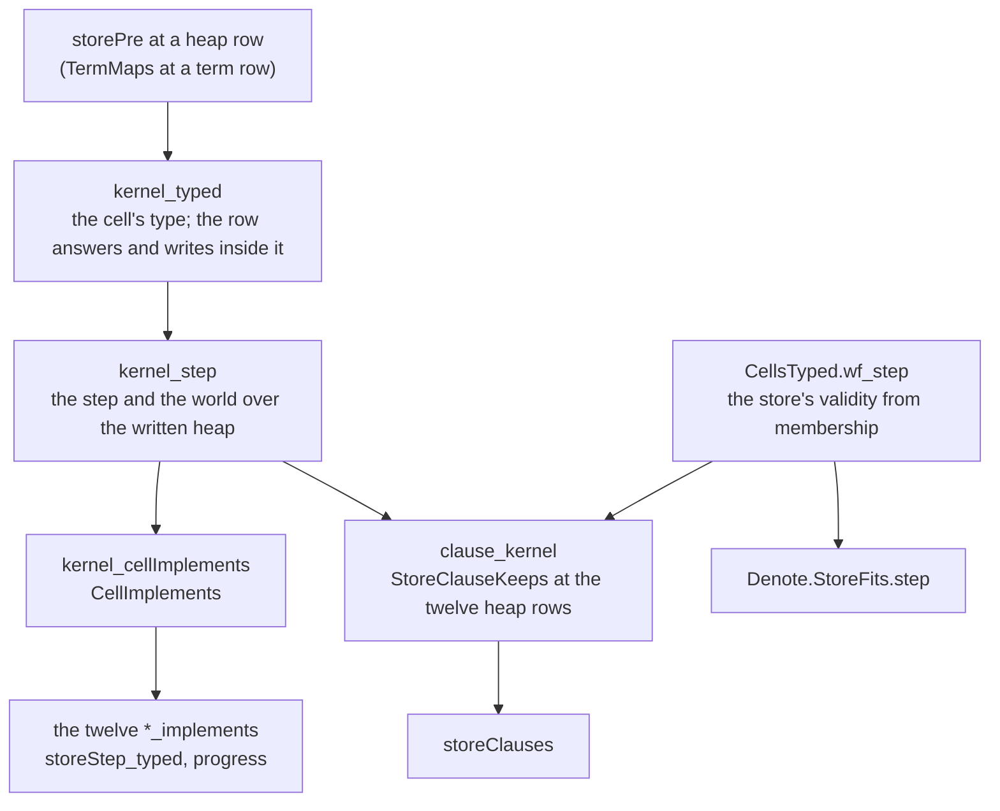

# 2026-10-04 seat T2 design: the store runs binder terms

Status: research note (history, not authority). Base: `69686dd6`, branch `seat/t2`, worktree
`/Users/pooks/Dev/lean4-effect4-t2`. Phase 1 of the seat T2 brief. The coordinator ruled D1–D10
and phase 2 landed on `c58bcc43`: `docs/research/2026-10-04-seat-T2-receipt.md` records what
landed and where it departs from this note. The probes replay at `69686dd6` only.

**The one thing to know first.** The connector holds on numbers, not on every value. Today a
function name answers a non-number unchanged (the last arm of `FnName.total`). No term can do
that, because every atom that reads a number refuses any other value. After T2, a read-modify-write
row on a non-number cell is a frontier where today it answers the value unchanged. No admitted
replay of a checked program meets such a cell (F3). The ill-typed control `refModify_bool_answer`
(`Test/Program/ProtocolPosts.lean`) does, and it changes.

The cost to know second: the store laws need the law that terms mint no handle frames, and that
law sits above them. The slice moves it below them, with its names kept (F4).

## Question

Slice T2 of the state plan (`docs/research/2026-10-04-claude-lead/state-any-type-plan.md` §3)
makes the store run binder terms instead of function names (row 43). It must keep behaviour
through an agreement connector. This note answers the brief's phase 1:

- items 1–7 as found in the code, and the two measurements;
- the restated store protocol and the connector;
- the placement of every new theorem, and what T3 then changes.

## What was read or run

| Item | Evidence word |
| --- | --- |
| The state plan §1, T0, T1, T2, T3; the 2026-09-18 plan §2b and §2d (N1, N5, N6); the audit's obligations `state-binder-and-capture` and `state-step-preservation`; seat T1's design note and receipt | reading |
| `Machine/Stores.lean`, `Machine/Term.lean`, `Program/Native.lean`; `Laws/Machine/RefKernel.lean`, `StoresLaws.lean`, `Handles.lean`; `Typed/Residual.lean`, `Typed/Adequacy.lean`, `Typed/Denotation.lean`, `Typed/Membership.lean`; `Progress.lean`; `Commands/Clauses/StoreRef.lean`, `Clauses/Store.lean`, `Clauses/All.lean`, `Commands/Evaluate.lean`; `Laws/Program/Handles/Term.lean` | reading |
| The vendored `Ref.ts` bodies of the eight rows | reading |
| `ocaml/gen/roots.json`, `ocaml/engine/externs.txt`, `ocaml/engine/tools/api_engine_prelude.ml`, the four closure manifests | reading |
| Source sites of the eight rows and the four interpretations (`sites.py`) | tested |
| The environment census of the same (`FnNameCensus.lean`) | tested |
| Import closures before and after (`imports.py`) | tested |
| A prototype of the lowering, the agreements, the premise and its discharges (`T2Proto.lean`), with `#print axioms` | tested |
| `scripts/check-conservativity.sh 69686dd6` on the clean tree, and `--self-test` | tested |
| The mirror census at the base (`tools/Conform/Cli/Audit.lean --config tools/Conform/Effect4/audit.json`) | tested |
| What `(a) => a + 1` answers on `true` under node v22.23.2 | tested (finite probe) |

The four probes sit in `docs/research/2026-10-04-seat-T2/`. Replay each from the worktree root
under the shared lock: `lake env lean <file>` for the two Lean files, `python3 <file>` for the
two scripts. The prototype edits no tree file; phase 2 supersedes it.

## Findings

### F1. Where the function names enter (measurement 1)

The eight rows' `FnName` field enters through `SyncOp`, `refStep` and the four interpretations
`FnName.total`, `partialUpdate`, `modify` and `modifySome`. `NativeOp` keeps its field in this
slice, so the program wire, the faces, the generator and the corpus do not move.

The source sites outside `NativeOp` are tested with `sites.py`. Its false positives were removed
by reading: `NativeOp`'s own constructors, `opV` in `src/OCaml5/Eff/Goldens.lean`, `genOp` in
`Test/Program/Gen.lean`, and two docstrings of `Typed/Adequacy.lean`.

| File | Declarations that name a row with its function or an interpretation |
| --- | --- |
| `src/Effect4/Machine/Stores.lean` | 14: `SyncOp`; the four interpretations; `refStep`; the census witnesses `refStep_update`, `refStep_update_applies_once`, `refStep_modify`, `refStep_modifySome_none`, `refStep_modifySome_eq_modify`, `refStep_updateSomeAndGet_some`, `refStep_updateSomeAndGet_none`, `updateSomeAndGet_ne_getAndUpdateSome` |
| `src/Effect4/Program/Native.lean` | 1: `NativeOp.syncOpOf` |
| `src/Effect4/Laws/Machine/RefKernel.lean` | 2: `SyncOp.refKernel`, `refStep_eq_refStepOf` |
| `src/Effect4/Laws/Machine/StoresLaws.lean` | 8: `SyncOp.validIn`, `SyncOp.validIn_mono`, `syncOpStep_isSome_of_valid`, `SyncOp.refKernel_validIn`, the four `FnName.*_validIn` |
| `src/Effect4/Laws/Machine/Handles.lean` | 6: `SyncOp.keys`, `SyncOp.refKernel_keys`, the four `FnName.*_keys` |
| `src/Effect4/Laws/Machine/Witnesses.lean` | 4: `w7Update`, `w7ModifySome`, `w7UpdateSomeAndGet`, `w7GetAndUpdateSome` |
| `src/Effect4/Laws/Program/Typed/Residual.lean` | 3: `storePre`, `storePost`, `storePre_mono` |
| `src/Effect4/Laws/Program/Typed/Adequacy.lean` | 14: `kernel_typed`, `fits_total`, `fits_partialUpdate`, `modify_nat`, `modifySome_nat`, `nat_cell`, the eight rows' `*_implements` |
| `src/Effect4/Laws/Program/Typed/Denotation.lean` | 1: `syncRow_typed` |
| `src/Effect4/Laws/Program/Typed/Commands/Clauses/StoreRef.lean` | 8: `clause_refUpdate` and its seven siblings |
| `src/Effect4/Laws/Program/Typed/Commands/Clauses/All.lean` | 1: `storeClauses` |
| `Test/Program/ProtocolPosts.lean` | 11 and one `example`: `oldStorePre`, `oldStorePost`, nine of the `Modify` section |
| `Test/Program/ProgressContract.lean` | 2 (`s1upd`, `s1mod`) and 6 `#guard`s |
| `Test/Program/TypedContract.lean` | 8 `#guard`s |
| `Test/Machine/Runtime/StoresLawsContract.lean` | 4 `#guard`s |
| `Test/Counterexamples/Machine/Semantics/TrivialPosts.lean` | 2: `modifyCode`, `modify_typed` |
| `Test/Counterexamples/Machine/Semantics/ValueMembership.lean` | 2: the local `storePre` and `storePost` |
| `Test/Program/AdmissionCensus.lean` | 1: `storeAnswer` |

In sum: 62 declarations in 11 `src` files, and 18 declarations, one `example` and 18 `#guard`s
in 7 `Test` files.

The environment census over `Effect4`, `Effect4.Laws` and `Test.All` (tested with
`FnNameCensus.lean`, auxiliary names folded into their parents) finds 110 declarations in 25
modules. It counts more because a whole-type case split names every constructor in its compiled
matcher: `syncOpStep_le`, for example, names no row in its source.

Outside Lean, the rows enter the OCaml estate through `sh_ref_step` in
`ocaml/engine/tools/api_engine_prelude.ml`, the `refStep` row of `ocaml/engine/externs.txt`, and
four roots of `ocaml/gen/roots.json` (F8).

### F2. One name has four meanings, so the connector is four lowerings

A name's meaning depends on the row that runs it. `refUpdate` and its two siblings run
`FnName.total`, the three `Some` rows run `partialUpdate`, `refModify` runs `modify` and
`refModifySome` runs `modifySome`. Every name occurs at every row (`NativeOp.all`,
`src/Effect4/Program/Native.lean`). So one `FnName.term` cannot serve: `incr` must answer a
number at `refUpdate`, an option at `refUpdateSome` and a pair at `refModify`.

The connector is one lowering per shape. Each term reads the cell's value at level 0, with the
environment `[]`. The shapes are rc.112's four function types (`Ref.ts`, the eight bodies):

| Name | `updateTerm`, `A → A` | `updateSomeTerm`, `A → Option<A>` | `modifyTerm`, `A → [B, A]` | `modifySomeTerm`, `A → [B, Option<A>]` |
| --- | --- | --- | --- | --- |
| `incr` | `succ(a)` | `some(succ(a))` | `pair(a, succ(a))` | `pair(a, some(succ(a)))` |
| `double` | `mul(a, 2)` | `some(mul(a, 2))` | `pair(a, mul(a, 2))` | `pair(a, some(mul(a, 2)))` |
| `takeAndBump` | `succ(a)` | `some(succ(a))` | `pair(a, succ(a))` | `pair(a, some(succ(a)))` |
| `zeroWhenPositive` | `a` | `ite(lt(0, a), some(0), none())` | `pair(a, a)` | `pair(a, some(a))` |
| `noChange` | `a` | `none()` | `pair(a, a)` | `pair(a, none())` |

On every number each term evaluates to the image of the name's answer. The prototype proves it
by `rfl` after a case on the name, and on the number for `zeroWhenPositive` (tested, axioms
`[propext]`).

The table also answers finding F3 of the truth harness (`harness/truth/prelude.ts`): it names the
right lambda for each pair of row and name. T5 can print these terms as TypeScript lambdas.

### F3. The agreement holds on numbers only

No term answers a non-number unchanged where the name computes on numbers. Every atom that reads a
number refuses another value (the last arm of `NativeAtom.eval`, `src/Effect4/Machine/Term.lean`).
`evalTerm` evaluates every argument before the atom (`evalTerms`), so `ite` cannot guard one. An
atom that would do it is an alphabet append under DI-47, outside this slice (D1).

The red controls, tested by `rfl` in the prototype:

| Value | The name today | The term after T2 |
| --- | --- | --- |
| `FnName.total .incr (.bool true)` | `.bool true` | `evalTerm [.bool true] (updateTerm .incr) = none` |
| `FnName.modify .incr (.bool true)` | `(.bool true, .bool true)` | `evalTerm [.bool true] (modifyTerm .incr) = none` |
| `FnName.partialUpdate .zeroWhenPositive (.bool true)` | `none`: the cell is left | `evalTerm [.bool true] (updateSomeTerm .zeroWhenPositive) = none`: a frontier |
| `FnName.total .noChange (.bool true)` | `.bool true` | `some (.bool true)`: the identity names agree everywhere |

No admitted replay of a checked program reaches such a cell:

- a request that fits `Ref.Ref<number>` names a cell declared equivalent to `nat`
  (`fits_refTy_inv`, `src/Effect4/Laws/Program/Typed/Denotation.lean`);
- at a world whose cell columns are typed, that cell holds a number (`nat_cell`,
  `src/Effect4/Laws/Program/Typed/Adequacy.lean`);
- `reachable_typed` (`src/Effect4/Laws/Program/Typed/Commands/Clauses/All.lean`) keeps the typed
  state, cell columns included, on every admitted replay. T2 keeps that theorem (P7).

The old answer was a totalization of the model, not a transcription. Under node v22.23.2,
`(a) => a + 1` answers `2` on `true` and `"x1"` on `"x"` (tested, finite probe). So on a
non-number neither the old Lean answer nor the frontier is rc.112's answer.

What moves: `refModify_bool_answer` in `Test/Program/ProtocolPosts.lean` steps `refModify` with
`incr` on a `bool` cell. Today it answers `Val.bool true`; after T2 the step is `none`.
`refModifySome_bool_answer` uses `noChange`, whose term `pair(a, none())` evaluates on any value,
so it keeps its answer. No committed run output is predicted to move: the truth lane and the
host corpus run admitted programs only. Phase 2 checks this by regeneration.

### F4. The law that terms mint no handle frames sits above the store laws

Two machine laws read the heap rows through one table, `SyncOp.refKernel`:

- the store's validity (`syncOpStep_wf`, contract item 15; `syncOpStep_answer_valid`, item 16)
  reads `SyncOp.refKernel_validIn` (`src/Effect4/Laws/Machine/StoresLaws.lean`);
- the handle invariant reads `SyncOp.refKernel_keys` through `refStep_keys`
  (`src/Effect4/Laws/Machine/Handles.lean`).

Today each row of both reads a fact about one interpretation (`FnName.total_validIn`,
`FnName.total_keys` and their siblings). A term row needs instead that a term's value carries only
the handle frames of its environment: `RawHandles.evalTerm_handles`
(`src/Effect4/Laws/Program/Handles/Term.lean`). That module imports `Handles/Alphabet.lean`, which
imports `Laws/Machine/Handles.lean`, which imports `StoresLaws.lean`. A direct import is a cycle
(tested on the import graph). The layering agrees: `Laws/Machine` is height 2 and
`Laws/Program` height 3 (`tools/Tools/ArchitectureRoles.lean`).

The law's own subject is `src/Effect4/Machine/Term.lean`, and its dependencies sit at Machine
height or below, with four exceptions in two groups:

- `Typed.zipNames_columns` and `Typed.recordParts?_eq_some`
  (`src/Effect4/Laws/Program/Typed/RecordValues.lean`), two lemmas about
  `src/Effect4/Machine/Record.lean`'s definitions;
- `evalTerm_app` and `evalTerms_cons` (`src/Effect4/Laws/Program/Typed.lean`), two `rfl`
  equations, replaced by their unfolding.

The proposal moves the raw-handle law, unchanged, into a new module
`src/Effect4/Laws/Machine/TermHandles.lean`, which `RefKernel.lean` imports. The moved
declarations keep their names:

- `RawHandles.lit_toVal_handles`, `valOfErr_handles`, `queryTag_handles`, `queryError_handles`,
  `handles_list`, `asList_handles`, `nativeAtom_handles`, `evalTerm_handles`, `evalTerms_handles`;
- `RecordHandles.build`, `read` and `set`, with their four private helpers;
- `Val.tupleAt?_mem` and `tupleAt_handles`;
- `Typed.zipNames_columns` and `Typed.recordParts?_eq_some`.

`Handles/Term.lean` and `Typed/RecordValues.lean` import the new module, so no consumer changes a
name.

Measured import closures (tested with `imports.py`, `Effect4` modules):

| Module | Before | After |
| --- | --- | --- |
| `Effect4.Machine.Stores` | 21 | 27: `Machine.Term`, `Machine.Record`, `Machine.Map`, `Data.FieldOrder`, `Program.TyCore`, `Program.TyEq` |
| `Effect4.Laws.Machine.StoresLaws` | 29 | 38, and the new module |
| `Effect4.Laws.Machine.Handles` | 34 | 41, and the new module |

Seat E1 changes `valOfErr`, which `valOfErr_handles` and `queryError_handles` read. If E1 edits
those two lemmas, the merge applies E1's edit in the new module.

### F5. A valid operation can now stop at a term

`syncOpStep_isSome_of_valid` (contract item 14) says that every valid operation steps. Validity
reads keys and argument values only, and a term that refuses the value read is a frontier at a
valid operation. Validity cannot include the term's success: the value read changes along the
store order, so `SyncOp.validIn_mono` (item 13) would fail.

The proposal adds one premise, stated over the heap table: every kernel row answers on the value
its cell holds. The premise is vacuous off the heap rows, and holds by `rfl` at the four rows that
carry no term. The theorem has no consumer in `src`. The packet names it without its statement,
and `E4-STORES-CE-001` keeps its text.

`SyncOp.validIn` of a term row asks for the cell in range and every environment value valid
(`Val.validInList`), so `SyncOp.validIn_mono` keeps its proof shape.

### F6. The typed state needs a semantic premise, closed under later worlds

Today `storePre` asks a function-name row only for a declared cell (`refModify` asks for a cell
declared equivalent to `nat`, row 136). `fits_total` then keeps any type, because the name is the
identity off numbers. A term keeps no type in general, so the row's precondition says it does:

- the term at its environment maps the cell's type `A` into the row's result type `R`;
- `R` is `A` for the three update rows, `option A` for the three `Some` rows, `prod B A` for
  `refModify` and `prod B (option A)` for `refModifySome`;
- `B` is the certificate of `refModify` and `refModifySome`, so `B` may differ from `A`.

The map must hold at every later world. `storePre_mono` needs the precondition closed under
`leHost`, and a single-world statement is not. At a world with no cell, no value fits
`refOf nat`, so the single-world premise holds of every term. At a later world that declares cell
0 at `nat`, the term `lit "x"` with `R = nat` fails it. The red control lands with the slice.

The quantified form is ATTAPL §6.7's monotone logical relation at a function type, in Ahmed's
unary form (2004, §2.2.5). It is closed by `leHost_trans` (`TermMaps.mono`, tested). The term is
first-order data, so `Fits` gains no arrow clause (row 163). T3 discharges the premise from the
term's typing through `evalTerm_progress` at every later world.

A two-element tuple normalizes as a product (`Ty.normalize_tuple_pair`,
`src/Effect4/Program/Ty.lean`), so `prod B A` is rc.112's `readonly [B, A]`.

### F7. The machine-level copies, and one bridge for them

`StoreRef.lean` restates each heap row by hand: it computes the step from the name and types it
through `poke_world`, `cell_readable`, `nat_cell`, `fits_total` and `modify_nat`. The eight term
rows must be restated anyway. One bridge restates all twelve heap rows from the two lemmas the
cell columns already use:



The diagram shows which lemma reads which; it claims no proof.

- `CellImplements` hides its world, so the bridge reads `kernel_step`. `kernel_step` names its
  world, the old one with the written heap, so the fiber and token tables hold by `rfl`.
- The new store's validity comes from membership (`CellsTyped.fits_validIn`), not from
  `SyncOp.validIn`. A term row's environment is not in its precondition. The same argument is
  `Denote.StoreFits.step` (`src/Effect4/Laws/Program/Progress.lean`); it becomes
  `CellsTyped.wf_step`, and both read it.
- Deleted with the bridge: the eleven per-row clauses of `StoreRef.lean`, `nat_cell` and
  `cell_live`. The bridge also covers `refGet`, so `clause_refGet`
  (`src/Effect4/Laws/Program/Typed/Commands/Evaluate.lean`) can go (D5).

`StoreRef.lean` is written by hand; no generator writes its clauses.

### F8. The OCaml estate and the closures (measurement 2)

The engine does not run the generated `refStep`. `ocaml/engine/externs.txt` maps it to
`sh_ref_step` in `ocaml/engine/tools/api_engine_prelude.ml`, a hand transcription arm for arm. The
row hands the shim the generated `fn_name_total`, `fn_name_partial_update`, `fn_name_modify` and
`fn_name_modify_some`. Those four are roots of `api_engine.ml` in `ocaml/gen/roots.json` for that
reason only. No other hand-written OCaml names a `SyncOp` constructor (tested by grep).

After T2 the shim transcribes the term arms, and the row hands it `program_eval_term` instead. That
function takes the environment carrier `val_ E.t`; the shim builds it with `E.of_list` (the
`PENV` signature has it). The four roots go, and nothing else calls the four functions.

The closures today (read from `ocaml/gen/closure-*.tsv`, header lines excluded):

| Artifact | Rows | `Ty.*` rows | Store rows |
| --- | --- | --- | --- |
| `fibers_gen.ml` | 203 | 0 | none |
| `machine_gen.ml` | 38 | 0 | none |
| `api_gen.ml` | 756 | 32 | `syncOpStep`, `refStep`, `syncOpOf`, the four interpretations; `evalTerm`, `evalTerms` |
| `api_engine.ml` | 750 | 32 | `syncOpStep`, `syncOpOf`, the four interpretations; `evalTerm`, `evalTerms` (`refStep` is the shim) |

Measured today: the two generic closures reach no store row and no `Ty` declaration, and the two
API closures already hold 32 `Ty` declarations. Predicted for T2: `Ty` enters no closure it is not
already in. T2's runtime additions reach `evalTerm`, which is present, and the four lowerings,
which build `app`, `var` and `lit` terms and no record. The predicted closure diff:

- the four interpretations leave both API closures;
- the four lowerings enter both;
- the two decoders enter `api_gen.ml`, unless the compiler inlines them.

Phase 2 measures the diff and explains each entrant.

`Machine/Stores.lean`'s import closure gains `Program.TyCore` and `Program.TyEq` through
`Machine/Term.lean`. `docs/ARCHITECTURE.md` allows exactly these two below `Program`.

### F9. Compatibility

- `SyncOp` is on no gated alphabet: `tools/Effect4Gen/wire-tags.json`, the three manifests, the
  frozen families and the policy file name it nowhere (tested by grep). `mirrors.json` has no
  `SyncOp` or `FnName` row.
- `scripts/check-conservativity.sh 69686dd6` on the clean tree passes 4 of 4 clauses (tested):
  334 byte vectors, 22 tag families, 875 verdict rows, no generated change.
- `--self-test`, the first step of `make check-conservativity`, exits 1 at the base. Control G1
  finds its anchor `deferredOf var unknown` not exactly once in `ocaml/goldens/eff/manifest.txt`.
  The defect is older than T2.
- The mirror census at the base: 273 subjects, 266 pass, 0 refused, 4 counterexample, 3
  unresolved, exit 2 (tested). The four counterexamples are the frozen baseline against `Eff`,
  `Term` and `Ty`. Phase 2 compares against these numbers.
- The position census pin (`Test/Audit/PositionCensus.lean`: 85 positions, 88 rows) should not
  move. `SyncOp`'s value fields today (`refSet.value`, `refMake.initial`) have no row there, so the
  census does not reach `SyncOp`.

### F10. The census rows

Four rows cite six witnesses by name in `Test/Audit/RuntimeCoverage.lean`: `ref.update`,
`ref.modify`, `ref.modify-some-no-reread` and `ref.update-some-and-get-reread`. The proposal keeps
the names and restates each statement over the term row, general in the term where the statement
allows. `Test/Audit/RuntimeCoverage.lean` then needs no edit, and the join moves no number.

### F11. One gate reads differently from the brief

`SyncOp` is not a family of the case-site policy (`tools/Conform/Effect4/cases-policy.json`). Its
nine families are `Ty`, `Eff`, `NativeOp`, `RowKind`, `RowShape`, `Registration`, `Lit`, `Term`
and `CauseTerm`. `make check-cases` still runs: `syncOpOf`'s `NativeOp` site keeps its arms, and no
core declaration gains a `Term` case site, since the lowerings build terms.

## Proposals

### P1. The machine (`src/Effect4/Machine/Stores.lean`)

```lean
public import Effect4.Machine.Term

inductive SyncOp
  -- …the other arms unchanged
  /-- `Ref.update` (`Ref.ts:1273-1276`): answers `undefined`. `f` is a binder term evaluated at
  `env ++ [current]` (row 43). -/
  | refUpdate (cell : RefKey) (f : Term) (env : List Val)
  | refGetAndUpdate (cell : RefKey) (f : Term) (env : List Val)
  | refUpdateAndGet (cell : RefKey) (f : Term) (env : List Val)
  | refUpdateSome (cell : RefKey) (f : Term) (env : List Val)
  | refGetAndUpdateSome (cell : RefKey) (f : Term) (env : List Val)
  | refUpdateSomeAndGet (cell : RefKey) (f : Term) (env : List Val)
  | refModify (cell : RefKey) (f : Term) (env : List Val)
  | refModifySome (cell : RefKey) (f : Term) (env : List Val)

namespace Val
/-- The writer of an option at the carrier's `some`/`none` frames. -/
def ofOption : Option Val → Val
  | some a => Store.Val.some a
  | none => Store.Val.none
/-- Its reader: any other value is no option (retraction and exactness proved beside it). -/
def option? : Val → Option (Option Val)
  | Store.Val.some a => some (some a)
  | Store.Val.none => some none
  | _ => none
/-- A two-element tuple, read with the data wave's tuple image (`Program.Val.tuple?`). -/
def tuple2? (v : Val) : Option (Val × Val) :=
  match Program.Val.tuple? v with
  | some [b, a] => some (b, a)
  | _ => none
end Val

def refStep : SyncOp → RefHeap → Option (Val × RefHeap)
  -- …the five arms without a term unchanged
  | SyncOp.refUpdate cell f env, heap => (refPeek heap cell).bind fun a =>
      (evalTerm (env ++ [a]) f).map fun a' => (Val.unit, refPoke heap cell a')
  | SyncOp.refGetAndUpdate cell f env, heap => (refPeek heap cell).bind fun a =>
      (evalTerm (env ++ [a]) f).map fun a' => (a, refPoke heap cell a')
  | SyncOp.refUpdateAndGet cell f env, heap => (refPeek heap cell).bind fun a =>
      (evalTerm (env ++ [a]) f).map fun a' => (a', refPoke heap cell a')
  | SyncOp.refUpdateSome cell f env, heap => (refPeek heap cell).bind fun a =>
      ((evalTerm (env ++ [a]) f).bind Val.option?).map fun next =>
        (Val.unit, match next with | some a' => refPoke heap cell a' | none => heap)
  | SyncOp.refGetAndUpdateSome cell f env, heap => (refPeek heap cell).bind fun a =>
      ((evalTerm (env ++ [a]) f).bind Val.option?).map fun next =>
        (a, match next with | some a' => refPoke heap cell a' | none => heap)
  | SyncOp.refUpdateSomeAndGet cell f env, heap => (refPeek heap cell).bind fun a =>
      ((evalTerm (env ++ [a]) f).bind Val.option?).bind fun next =>
        match next with
        | some a' => (refPeek (refPoke heap cell a') cell).map fun fresh =>
            (fresh, refPoke heap cell a')
        | none => some (a, heap)
  | SyncOp.refModify cell f env, heap => (refPeek heap cell).bind fun a =>
      ((evalTerm (env ++ [a]) f).bind Val.tuple2?).map fun r => (r.1, refPoke heap cell r.2)
  | SyncOp.refModifySome cell f env, heap => (refPeek heap cell).bind fun a =>
      ((evalTerm (env ++ [a]) f).bind Val.tuple2?).bind fun r =>
        (Val.option? r.2).map fun next => (r.1, refPoke heap cell (next.getD a))
```

Each row stays one store step, so a yield cannot fall between the read and the write. A term that
does not evaluate, or answers the wrong shape, makes the step `none`: a frontier, as a dangling
key is.

The decoders read two images. `Val.option?` reads the carrier's option frames, the frames
`Store.Image.option` writes. `Val.tuple2?` is the data wave's tuple image `Program.Val.tuple?` at
arity two, the frame `Store.Image.tuple2` writes. The separation gates at the foot of
`Machine/Stores.lean` keep holding: `Term` and `List Val` are first-order data with decidable
equality.

Beside `FnName`, its four lowerings (F2) and the value-level agreements, each by `rfl`:

```lean
theorem FnName.updateTerm_agrees (f : FnName) (n : Nat) :
    evalTerm [.nat n] f.updateTerm = some (f.total (.nat n))
theorem FnName.updateSomeTerm_agrees (f : FnName) (n : Nat) :
    evalTerm [.nat n] f.updateSomeTerm = some (Val.ofOption (f.partialUpdate (.nat n)))
theorem FnName.modifyTerm_agrees (f : FnName) (n : Nat) :
    evalTerm [.nat n] f.modifyTerm =
      some (Program.Val.tuple [(f.modify (.nat n)).1, (f.modify (.nat n)).2])
theorem FnName.modifySomeTerm_agrees (f : FnName) (n : Nat) :
    evalTerm [.nat n] f.modifySomeTerm =
      some (Program.Val.tuple [(f.modifySome (.nat n)).1, Val.ofOption (f.modifySome (.nat n)).2])
```

`FnName` and its four interpretations stay in `Machine/Stores.lean` until T3, as the connector's
left side. The runtime no longer calls the interpretations.

### P2. The native lowering (`src/Effect4/Program/Native.lean`)

```lean
  | refUpdate f, Val.cell ⟨k⟩ => some (SyncOp.refUpdate ⟨k⟩ f.updateTerm [])
  | refGetAndUpdate f, Val.cell ⟨k⟩ => some (SyncOp.refGetAndUpdate ⟨k⟩ f.updateTerm [])
  | refUpdateAndGet f, Val.cell ⟨k⟩ => some (SyncOp.refUpdateAndGet ⟨k⟩ f.updateTerm [])
  | refUpdateSome f, Val.cell ⟨k⟩ => some (SyncOp.refUpdateSome ⟨k⟩ f.updateSomeTerm [])
  | refGetAndUpdateSome f, Val.cell ⟨k⟩ =>
    some (SyncOp.refGetAndUpdateSome ⟨k⟩ f.updateSomeTerm [])
  | refUpdateSomeAndGet f, Val.cell ⟨k⟩ =>
    some (SyncOp.refUpdateSomeAndGet ⟨k⟩ f.updateSomeTerm [])
  | refModify f, Val.cell ⟨k⟩ => some (SyncOp.refModify ⟨k⟩ f.modifyTerm [])
  | refModifySome f, Val.cell ⟨k⟩ => some (SyncOp.refModifySome ⟨k⟩ f.modifySomeTerm [])
```

The match keeps its arms, so the `NativeOp` case site of `syncOpOf` does not change (F11).

### P3. The heap table and the containment law

In `src/Effect4/Laws/Machine/RefKernel.lean`:

```lean
/-- A term row's heap kernel: the term at `env ++ [a]`, its answer decoded in the row's shape,
then the row's answer and write-back. -/
def termKernel {D : Type} (decode : Val → Option D) (arrange : Val → D → Val × Option Val)
    (f : Term) (env : List Val) : RefKernel :=
  fun a => ((evalTerm (env ++ [a]) f).bind decode).map (arrange a)

-- the eight arms of `SyncOp.refKernel`
  | .refUpdate cell f env => some (cell, termKernel some (fun _ a' => (Val.unit, some a')) f env)
  | .refGetAndUpdate cell f env => some (cell, termKernel some (fun a a' => (a, some a')) f env)
  | .refUpdateAndGet cell f env => some (cell, termKernel some (fun _ a' => (a', some a')) f env)
  | .refUpdateSome cell f env => some (cell, termKernel Val.option? (fun _ o => (Val.unit, o)) f env)
  | .refGetAndUpdateSome cell f env => some (cell, termKernel Val.option? (fun a o => (a, o)) f env)
  | .refUpdateSomeAndGet cell f env =>
    some (cell, termKernel Val.option? (fun a o => (o.getD a, o)) f env)
  | .refModify cell f env => some (cell, termKernel Val.tuple2? (fun _ r => (r.1, some r.2)) f env)
  | .refModifySome cell f env =>
    some (cell, termKernel (fun v => (Val.tuple2? v).bind fun r => (Val.option? r.2).map (r.1, ·))
      (fun a r => (r.1, some (r.2.getD a))) f env)
```

`refStep_eq_refStepOf` keeps its statement; its proof unfolds the new arms. One new lemma,
`SyncOp.refKernel_handles`, bounds what every heap row answers and writes. Its handle frames are
those of the value read and of the operation's own data: its cell, its written value, its
environment. The lemma reads `RawHandles.evalTerm_handles` at the term rows.
`SyncOp.refKernel_validIn` and `SyncOp.refKernel_keys` become its corollaries, and the eight
`FnName.*_validIn` and `FnName.*_keys` go. `SyncOp.keys` of a term row is
`Handle.cell cell :: Val.keysList env`.

### P4. The store protocol (`src/Effect4/Laws/Program/Typed/Residual.lean`)

```lean
/-- **A binder term maps one type into another**: at every later world, a value that fits `A`
runs the term at `env ++ [a]` to a value that fits `R`. The unary Kripke relation at a function
type; the term is first-order data, so `Fits` has no arrow clause. -/
def TermMaps (w : World) (f : Term) (env : List Val) (A R : Ty) : Prop :=
  ∀ w', w.leHost w' → ∀ a, Fits w' a A → ∃ r, evalTerm (env ++ [a]) f = some r ∧ Fits w' r R

theorem TermMaps.mono {w w' : World} {f : Term} {env : List Val} {A R : Ty}
    (ord : w.leHost w') (h : TermMaps w f env A R) : TermMaps w' f env A R

def StoreCert : SyncOp → Type
  | .refMake _ | .memoGet _ _ | .refModify _ _ _ | .refModifySome _ _ _ => Ty
  | .deferredMake | .memoBuild _ _ => Ty × Ty
  | _ => PUnit

-- storePre, the eight arms
  | .refUpdate cell f env | .refGetAndUpdate cell f env | .refUpdateAndGet cell f env =>
    ∃ ty, w.Ρ cell = some ty ∧ TermMaps w f env ty ty
  | .refUpdateSome cell f env | .refGetAndUpdateSome cell f env
  | .refUpdateSomeAndGet cell f env =>
    ∃ ty, w.Ρ cell = some ty ∧ TermMaps w f env ty (.option ty)
  | .refModify cell f env => ∃ ty, w.Ρ cell = some ty ∧ TermMaps w f env ty (.prod cert ty)
  | .refModifySome cell f env =>
    ∃ ty, w.Ρ cell = some ty ∧ TermMaps w f env ty (.prod cert (.option ty))

-- storePost, the eight arms
  | .refUpdate _ _ _ | .refUpdateSome _ _ _ => ans = Val.unit
  | .refGetAndUpdate cell _ _ | .refGetAndUpdateSome cell _ _ =>
    ∃ ty, w'.Ρ cell = some ty ∧ Fits w' ans ty
  | .refUpdateAndGet cell _ _ | .refUpdateSomeAndGet cell _ _ =>
    ∃ ty, w'.Ρ cell = some ty ∧ Fits w' ans ty
  | .refModify _ _ _ | .refModifySome _ _ _ => Fits w' ans cert
```

Row 136's `nat`-only precondition and postcondition for `refModify` and `refModifySome` go.
`storePre_mono`'s eight arms read `TermMaps.mono` and the table's extension.
`storePre_rows_append` keeps its wildcard arm.

### P5. The adequacy and the discharge

In `src/Effect4/Laws/Program/Typed/Adequacy.lean`:

- `termKernel_typed`, one lemma for every term kernel (tested in the prototype as
  `termKernel_keeps`). Its premises are `TermMaps w f env t R`, a decoding fact at `R` and an
  arrangement fact. It gives `kernel_typed`'s two conclusions: the row answers on every value
  that fits `t`, and keeps `t` in the cell.
- Four decoding facts, one per shape: the term's value itself, `Val.option?` at `option t`
  (`fits_option_inv`), `Val.tuple2?` at `prod b t` (`fits_prod_iff`), and both at
  `prod b (option t)`.
- `kernel_typed`'s eight term arms, each `termKernel_typed` with its shape's fact. `CellImplements`
  and `kernel_cellImplements` keep their statements. The eight `*_implements` keep their
  statements with `(f : Term) (env : List Val)` for `(f : FnName)`.

In `src/Effect4/Laws/Program/Typed/Denotation.lean`, which does not reach `Typed/Adequacy.lean`:

- `fits_total`, `fits_partialUpdate`, `modify_nat` and `modifySome_nat` move here. After T2
  their only consumers are the four discharges.
- The four discharges, one per shape (tested in the prototype):

```lean
theorem FnName.updateTerm_maps {w : World} {t : Ty} (equiv : Equiv t .nat) (f : FnName) :
    TermMaps w f.updateTerm [] t t
theorem FnName.updateSomeTerm_maps {w : World} {t : Ty} (equiv : Equiv t .nat) (f : FnName) :
    TermMaps w f.updateSomeTerm [] t (.option t)
theorem FnName.modifyTerm_maps {w : World} {t : Ty} (equiv : Equiv t .nat) (f : FnName) :
    TermMaps w f.modifyTerm [] t (.prod .nat t)
theorem FnName.modifySomeTerm_maps {w : World} {t : Ty} (equiv : Equiv t .nat) (f : FnName) :
    TermMaps w f.modifySomeTerm [] t (.prod .nat (.option t))
```

- `syncRow_typed`'s eight arms pass `⟨t', hlookup, FnName.*_maps hequiv f⟩`. `refModify` and
  `refModifySome` pass the certificate `.nat`, the row's answer column, so their posts give
  `Fits w' ans .nat` directly.

### P6. The connector (`src/Effect4/Laws/Program/Progress.lean`)

```lean
/-- The read-modify-write rows' heap kernels at a function name, as the store ran them before it
took terms (`git:69686dd6:src/Effect4/Laws/Machine/RefKernel.lean`). Deleted with `FnName` at T3. -/
def NativeOp.fnKernel : NativeOp → Option RefKernel
  | .refUpdate f => some fun a => some (Val.unit, some (f.total a))
  | .refGetAndUpdate f => some fun a => some (a, some (f.total a))
  | .refUpdateAndGet f => some fun a => some (f.total a, some (f.total a))
  | .refUpdateSome f => some fun a => some (Val.unit, f.partialUpdate a)
  | .refGetAndUpdateSome f => some fun a => some (a, f.partialUpdate a)
  | .refUpdateSomeAndGet f => some fun a => some ((f.partialUpdate a).getD a, f.partialUpdate a)
  | .refModify f => some fun a => some ((f.modify a).1, some (f.modify a).2)
  | .refModifySome f => some fun a => some ((f.modifySome a).1, some ((f.modifySome a).2.getD a))
  | _ => none

/-- **The cutover's connector**: a read-modify-write row, lowered through its name's binder term,
runs on every number the heap kernel the name ran. -/
@[semantics "translation-simulation" (requirement := R4)]
theorem kernel_term_agrees {op : NativeOp} {k : RefKernel} (hk : op.fnKernel = some k)
    (cell : RefKey) :
    ∃ o k', op.syncOpOf (Val.cell cell) = some o ∧ o.refKernel = some (cell, k') ∧
      ∀ n, k' (.nat n) = k (.nat n)
```

It is one theorem over the eight rows and the five names. Its proof cases on the row and rewrites
by the four agreements and the decoders' retractions. The case-site audit walks the core only, so
`fnKernel`'s `NativeOp` match needs no policy row.

### P7. The bridge

```lean
-- `kernel_step` names its world: the old world over the written heap
theorem kernel_step … :
    ∃ c r, refPeek w.state.refs cell = some c ∧ k c = some r ∧
      syncOpStep o w.state = some ({ w.state with refs := refWriteBack w.state.refs cell r.2 }, r.1) ∧
      w.leHost (writeWorld w cell r.2) ∧ CellsTyped (writeWorld w cell r.2) ∧ Q (writeWorld w cell r.2) r.1

theorem CellsTyped.wf_step {w w' : World} {o : SyncOp} {st' : Stores} {a : Val}
    (wf : w.state.WF) (step : syncOpStep o w.state = some (st', a)) (hstate : w'.state = st')
    (cells : CellsTyped w') : st'.WF

/-- **The twelve heap rows keep `I`**, one clause from their table. -/
theorem clause_kernel (root : ProgramSource) (rootTy : EffTy) {o : SyncOp} {cell : RefKey}
    {k : RefKernel} (hk : o.refKernel = some (cell, k)) : StoreClauseKeeps root rootTy o
```

Here `writeWorld w cell next` is `{ w with state := { w.state with refs := refWriteBack w.state.refs cell next } }`.
`clause_kernel` assembles `Evaluating.store_kept` from three facts:

- the deferred, scope, memo and timer columns are the old ones;
- the answer is in the post at every certificate the precondition admits (`kernel_typed` per
  certificate);
- the store's validity comes from `CellsTyped.wf_step`.

`storeClauses` sends each heap row to it.

### P8. The OCaml estate

- `ocaml/engine/tools/api_engine_prelude.ml`: `sh_ref_step eval_term op heap` transcribes P1 arm
  for arm. It runs `eval_term (E.of_list (env @ [a])) f` and reads `Val_some`, `Val_none` and
  `Val_list [b; a]` as P1's decoders do.
- `ocaml/engine/externs.txt`: `fn Effect4.Machine.refStep 2 sh_ref_step program_eval_term`.
- `ocaml/gen/roots.json`: the four `FnName` roots of `api_engine.ml` go.
- `make gen-lcnf` regenerates `ocaml/gen/api_gen.ml`, `ocaml/engine/api_engine.ml` and their
  closure manifests, in the order of `docs/GENERATED.md`. The other groups are regenerated in
  verify mode, and any that moves is committed. The prediction is that none moves.
- `make check-ocaml` runs the engine's tests, the three-engine differential over the corpus and
  the seam check.

### P9. The census witnesses (`src/Effect4/Machine/Stores.lean`)

The six census witnesses and two more theorems of the same rows keep their names and tags:

- `refStep_update`, `refStep_modify` and `refStep_modifySome_eq_modify` state the step at any term
  and environment, from the value read.
- `refStep_modifySome_none` holds at any term that answers `[b, none]`: the cell is written back
  with the value read.
- `refStep_updateSomeAndGet_some` holds at any term that answers `some a'`: the answer is a fresh
  read after the write.
- `refStep_update_applies_once`, `refStep_updateSomeAndGet_none` and
  `updateSomeAndGet_ne_getAndUpdateSome` use the lowering's images of today's names.

### P10. Tests and red controls

| File | Change |
| --- | --- |
| `Test/Program/ProtocolPosts.lean` | `oldStorePre` and `oldStorePost` patterns gain the environment. The `Modify` section restated: the old precondition admits a `bool` cell where the machine now stops (`refModify_bool_frontier`); the new precondition refuses that cell; the new post admits the answer at its certificate. New: the single-world premise is not closed under `leHost` (F6's red control), and `pair(lit "s", a)` answers a `string` at certificate `string` while it stores a `nat` (B differs from A) |
| `Test/Program/ProgressContract.lean` | `s1upd`, `s1mod` and six guards through the lowering; beside the names' guards, F3's red controls |
| `Test/Machine/Runtime/StoresLawsContract.lean` | four guards through the lowering; the atomicity control: a split read and write loses an intervening write, while one `refModify` step admits none |
| `Test/Program/TypedContract.lean` | eight guards through the lowering |
| `Test/Counterexamples/Machine/Semantics/TrivialPosts.lean` | `modifyCode` carries a term; `modify_typed` reads the discharge |
| `Test/Counterexamples/Machine/Semantics/ValueMembership.lean`, `Test/Program/AdmissionCensus.lean` | patterns gain the environment |
| `Test/fixtures/proof-style/baseline.tsv` | recorded again by `make record-proof-style` |

### P11. The semantics registry and the documents

- `tools/Tools/SemanticsRegistry.lean`: R4's open part on the store running binder terms is
  restated. It then says that `FnName` retires at T3 and that the store runs `FnName`'s lowering
  since T2 (row 43).
- Proposed claim `term-maps-mono`: concept `store-typing`, role `monotonicity`, pointer
  `TermMaps.mono` (D8).
- `docs/core/semantics.md` §2.1: one required-property line, `term-maps`.
- `generated/semantics.md`: `make gen-semantics`.
- `Test/Counterexamples/REGISTER.md`: `E4-TYPED-CE-013`'s `Modify` evidence restated in place.

## Placement

`FnName.updateTerm_agrees` and its three siblings:

- Concept `translation-simulation`; two spellings of one row, equal on every number.
- Question: a step of R4's open part "the store runs binder terms". Consumers:
  `kernel_term_agrees` and the four `FnName.*_maps`.
- Reach: every name, every number, the environment `[]`.
- Does not establish: anything on a non-number (F3). T3 deletes them.
- Unlocks: R4's open part, the cutover.

`kernel_term_agrees`, with `NativeOp.fnKernel`:

- Concept `translation-simulation`, role `simulation`; tagged as a node of R4 (row 207).
- Question: the cutover's connector. Consumer: the cutover itself; the restated census instances
  rest on the same agreements.
- Reach: the eight rows, the five names, a cell that holds a number.
- Does not establish: an equal-observation theorem over whole runs. The regenerated goldens are
  reproduced evidence, not a theorem. Non-number cells stop.
- Unlocks: T3, which deletes it with `FnName`.

`TermMaps` and `TermMaps.mono`:

- Concept `store-typing`; the function-type form of `fits-mono`. Proposed claim `term-maps-mono`.
- Consumers: `storePre_mono`, hence `typedProg_mono`, M5 and M6; `kernel_typed`.
- Reach: every world, term, environment and pair of types.
- Does not establish: any typing of terms (T3); it adds no arrow clause to `Fits`.
- Unlocks: R4's open part on binder terms, at the store; T3's discharge from typing.

`termKernel_typed`, the four decoding facts and `kernel_typed`'s term arms:

- Concept `store-typing`; handler adequacy, a step of `store-safety` (absent, row 139).
- Consumers: `kernel_cellImplements`, the eight `*_implements`, `storeStep_typed` (M6), `progress`
  (`straight-meaning-typed`) and `clause_kernel`.
- Reach: a cell declared at `t` and a row whose precondition holds, at that world.
- Does not establish: concurrency; one store step is atomic in the model only.
- Unlocks: R4's open part on binder terms; M6 at the term rows.

The four `FnName.*_maps`:

- Concept `store-typing`; a step of `denote-typed` (M5).
- Consumer: `syncRow_typed`.
- Reach: a cell declared equivalent to `nat`, every world after.
- Does not establish: any other cell type. T3 replaces them by the discharge from typing.
- Unlocks: M5 unchanged across the cutover.

`SyncOp.refKernel_handles`, with `refKernel_validIn` and `refKernel_keys` restated:

- Concept `reactive-scheduling` (machine invariants).
- Consumers: `refStep_valid`, hence `syncOpStep_wf` (item 15); `refStep_keys`, hence the handle
  invariant and `m7-exit-handles-valid`.
- Reach: every heap row, every term, every environment.
- Does not establish: that a term evaluates.
- Unlocks: the term rows in every machine invariant without a typing premise.

The moved raw-handle law keeps its statements and placement. Its new consumer is
`SyncOp.refKernel_handles`.

`syncOpStep_isSome_of_valid`, restated:

- Concept `reactive-scheduling`; contract item 14. No consumer in `src`.
- Reach: valid operations whose heap row answers on the cell's value.
- Does not establish: that a term row steps.

`kernel_step` with its world named, `CellsTyped.wf_step` and `clause_kernel`:

- Concept `reactive-scheduling` for the clause and `store-typing` for `wf_step`.
- Claims `step-deliver-preserves` and `step-loop-preserves` (M6).
- Consumers: `storeClauses`; `Denote.StoreFits.step`.
- Reach: the twelve heap rows.
- Does not establish: the other store rows.
- Unlocks: the one bridge T1 asked for; T4 proves template rows once there.

The six census witnesses keep their rows and their tags. They witness the transcribed `Ref.ts`
lines, not rc.112 beyond them.

No planned goal is expected. If a proof does not follow in phase 2, it lands as
`@[semantics "<concept>" (requirement := R4)] proof_goal …` (row 207), and the receipt lists it.

## What T3 then changes

- `NativeOp`'s eight rows carry `(f : Term)`. `syncOpOf` takes the node's environment and builds
  `SyncOp.refUpdate cell f env`. `FnName`, its interpretations, the lowerings, the agreements,
  `fnKernel`, `kernel_term_agrees`, the four discharges and the four moved `FnName` facts go.
- `syncRow_typed` discharges `TermMaps` from the term's typing at `tys ++ [A]`: one lemma over
  `evalTerm_progress` and `envTyped_mono`. `refModify` binds `B` from the term's type through
  `matchTemplate`.
- The engine's `SyncOp` environment becomes the point environment `E.t`. That needs a carrier row
  for the constructor argument in `ocaml/engine/externs.txt`, and `E.snoc env a` in the shim.
- A term row's validity reads the environment's validity, which the handle invariant already gives
  for a point's environment.
- `ScopedOp NativeOp` checks each term at `n + 1` (seat T0).
- The concrete census instances move from the lowering's images to literal terms.
- A pair term types as `prod`; T3's match must read the normalized product.

## Files that change

Generated files are marked (gen); their producer runs, never a hand edit.

| File | Change |
| --- | --- |
| `src/Effect4/Machine/Stores.lean` | P1, P9; module docstring |
| `src/Effect4/Program/Native.lean` | P2; module docstring |
| `src/Effect4/Laws/Machine/TermHandles.lean` | new: the moved law (F4) |
| `src/Effect4/Laws/Program/Handles/Term.lean` | the moved declarations leave; imports the new module |
| `src/Effect4/Laws/Program/Typed/RecordValues.lean` | two lemmas leave; imports the new module |
| `src/Effect4/Laws/Machine/RefKernel.lean` | P3 |
| `src/Effect4/Laws/Machine/StoresLaws.lean` | F5; P3's corollary; four `FnName.*_validIn` deleted |
| `src/Effect4/Laws/Machine/Handles.lean` | `SyncOp.keys`; P3's corollary; four `FnName.*_keys` deleted |
| `src/Effect4/Laws/Machine/Witnesses.lean` | the four W7 operations through the lowering |
| `src/Effect4/Laws/Program/Typed/Residual.lean` | P4 |
| `src/Effect4/Laws/Program/Typed/Adequacy.lean` | P5, P7; `nat_cell` deleted; four facts moved out |
| `src/Effect4/Laws/Program/Typed/Denotation.lean` | P5 |
| `src/Effect4/Laws/Program/Progress.lean` | P6; `Denote.StoreFits.step` reads `CellsTyped.wf_step` |
| `src/Effect4/Laws/Program/Typed/Commands/Clauses/StoreRef.lean` | P7; eleven clauses and `cell_live` deleted |
| `src/Effect4/Laws/Program/Typed/Commands/Clauses/All.lean` | `storeClauses` dispatch |
| `src/Effect4/Laws/Program/Typed/Commands/Evaluate.lean` | `clause_refGet` deleted (D5, option b) |
| the seven `Test` files of P10 | P10 |
| `Test/fixtures/proof-style/baseline.tsv` | `make record-proof-style` |
| `Test/Counterexamples/REGISTER.md` | `E4-TYPED-CE-013`'s `Modify` evidence |
| `Test/contracts/program-denotation.contract.md` | item 14's premise (D4) |
| `tools/Tools/SemanticsRegistry.lean`, `docs/core/semantics.md` | P11 |
| `generated/semantics.md` | (gen) `make gen-semantics` |
| `ocaml/engine/tools/api_engine_prelude.ml`, `ocaml/engine/externs.txt`, `ocaml/gen/roots.json` | P8 |
| `ocaml/gen/api_gen.ml`, `ocaml/engine/api_engine.ml`, `ocaml/gen/closure-api_gen.tsv`, `ocaml/gen/closure-api_engine.tsv` | (gen) `make gen-lcnf` |
| this note, `docs/research/2026-10-04-seat-T2/`, the receipt | force-added |

Predicted not to change:

- `Test/Audit/RuntimeCoverage.lean`;
- the derived group, `src/Effect4/Store/Domain/Derived/Program.lean` included, since `FnName` and
  `NativeOp` keep their constructors;
- the eff, wire and CAS goldens, `generated/corpus-index.tsv` and the truth corpus.

Phase 2 checks each by its producer's verify mode.

## Decisions for the coordinator

| Id | Question | Options | Recommendation |
| --- | --- | --- | --- |
| D1 | The connector's domain | (a) agreement on every number; a run that updates a non-number cell stops there; (b) append a guarded atom or a lazy conditional so that a term can return a non-number unchanged: an alphabet append under DI-47 | (a). No admitted replay of a checked program reaches such a cell, and rc.112 does not return it unchanged either (F3) |
| D2 | Terms mint no handle frames | (a) move the raw-handle law and its two record lemmas into `Laws/Machine/TermHandles.lean`, names kept; (b) add a containment premise to `syncOpStep_wf`, `refStep_valid`, `refStep_keys` and their callers | (a): one law at its subject's height, no premise to thread |
| D3 | The lowering | one lowering per shape (F2) | the only form that keeps the eight rows' meanings |
| D4 | Contract item 14 | (a) `syncOpStep_isSome_of_valid` gains the heap table's premise; (b) validity includes the term's success, which breaks item 13 | (a) |
| D5 | The machine-level clauses | (a) `clause_kernel` for the twelve heap rows, `kernel_step` naming its world, validity from membership; delete the eleven clauses, `nat_cell` and `cell_live`; (b) as (a), and delete `clause_refGet` in `Commands/Evaluate.lean`; (c) restate the eight term clauses one by one | (b) if no other seat holds `Commands/Evaluate.lean`, else (a) |
| D6 | The premise's form | (a) `TermMaps` at every later world; (b) at one world, which `storePre_mono` refuses (F6) | (a), with the red control |
| D7 | Homes | the agreements in `Machine/Stores.lean`; `fnKernel` and `kernel_term_agrees` in `Progress.lean`; the discharges and the four moved facts in `Typed/Denotation.lean` | as proposed |
| D8 | The semantics registry and the documents | R4's open part restated; `kernel_term_agrees` tagged; claim `term-maps-mono` added or not; the `term-maps` line in `docs/core/semantics.md` | all four |
| D9 | The `Modify` controls | restate the `Modify` section of `Test/Program/ProtocolPosts.lean` and `E4-TYPED-CE-013`'s evidence in place | restate |
| D10 | Files outside the brief's list | `Handles/Term.lean`, `Typed/RecordValues.lean` (D2); `Progress.lean` (D7); `Commands/Evaluate.lean` (D5); the `Test` files; the register; the contract packet (D4); `docs/core/semantics.md` and the registry (D8); the proof-style baseline | approve each, or strike it |

No decisions row is proposed; row 43 covers the slice. If D1 is ruled (a), its frontier could be
recorded under row 43 by the coordinator.

## Merge notes

- Seat E1's changes reach the same lcnf outputs. Merge one branch, then regenerate the lcnf group
  on the merged tree; never merge two generated `api_engine.ml` by hand.
- Seat E1's edits to `valOfErr_handles` or `queryError_handles` go to the new module (F4).
- No root import changes: the new module is reached through `RefKernel.lean`, and no new battery
  is needed.

## What this does not establish

- Phase 2 owes every proof. The prototype proves the agreements, the premise's monotonicity, the
  four discharges and the generic term-kernel lemma; it states the rest only.
- Behaviour on a non-number cell changes (F3). Runs stay unchanged for checked programs only.
  Phase 2's evidence for that is the regenerated outputs, a finite check.
- Concurrency: one store step is atomic in the model, by construction. That says nothing about
  rc.112's scheduler.
- Term typing and template rows are T3's. `TermMaps` is semantic and states no typing judgment.
- The OCaml shim is a hand transcription, tested by the differential, not proved.
- The census numbers of F1 and F8 are measurements at `69686dd6`.
