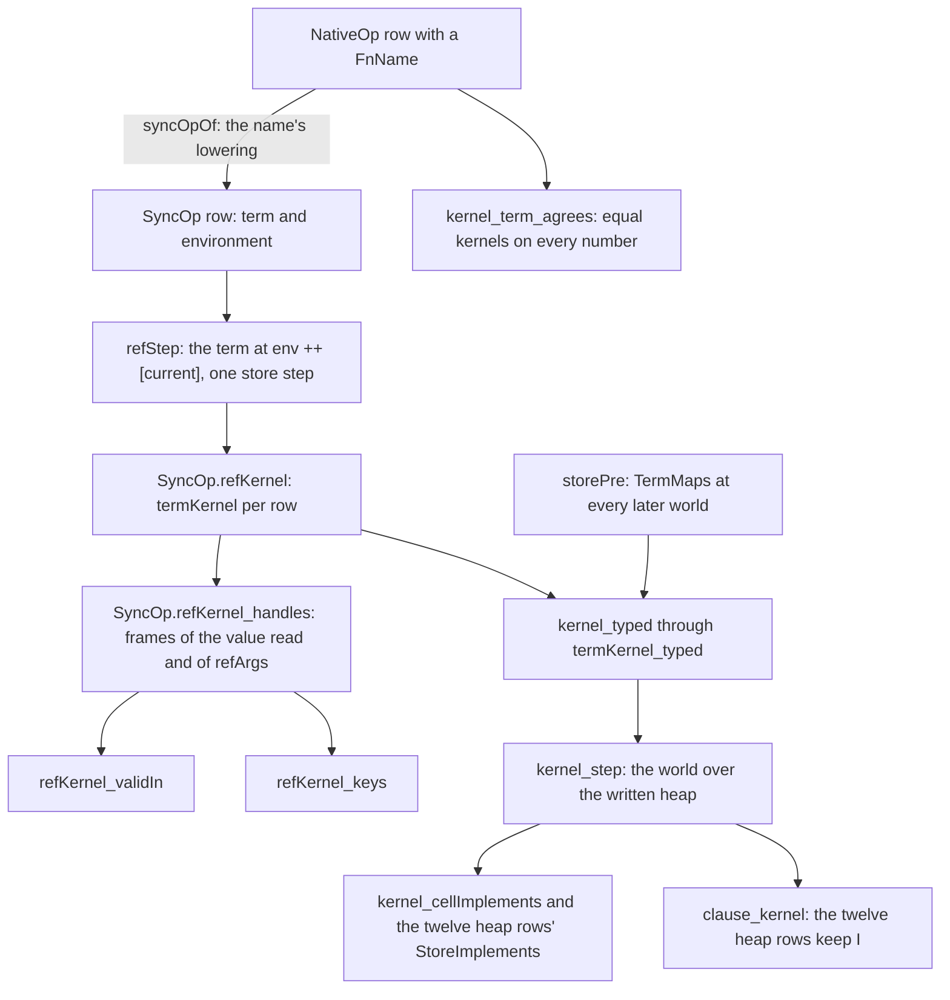

# 2026-10-04 seat T2 receipt: the store runs binder terms

Status: receipt (history, not authority). Seat T2, phase 2 of the brief, slice T2 of the state
plan (`docs/research/2026-10-04-claude-lead/state-any-type-plan.md` §3), decisions row 43. The
design note is `docs/research/2026-10-04-seat-T2-design.md`; its probes are under
`docs/research/2026-10-04-seat-T2/`.

## The one thing to know before merging

A read-modify-write row on a cell that holds no number is now a frontier. Before T2 the function
name answered such a value unchanged. This is ruling D1: the connector `kernel_term_agrees` holds
on every number. The coordinator records the frontier under row 43. Every gate the brief names
passes, and no committed run output moved except the lcnf group and the semantics report.

## Base and head

| Item | Commit |
| --- | --- |
| Base | `c58bcc43` (`refactor/phase1-phase3` after seat E1, merged by fast-forward) |
| The raw-handle law moved (ruling D2) | `0957dced` |
| The slice | `2c86aa08` |
| Head | the commit that adds this receipt, the design note and its probes |

The gates ran on the tree of `2c86aa08`. The receipt commit adds Markdown and probe files under
`docs/research/` only, and no gate reads them.

## What landed



The diagram shows which declaration reads which; it claims no proof.

- **The machine** (`src/Effect4/Machine/Stores.lean`). The eight read-modify-write rows of
  `SyncOp` carry `(f : Program.Term) (env : List Val)`. `refStep` evaluates the term at
  `env ++ [a]` inside the row's one store step.
- **The decoders.** A `Some` row reads its term's answer with `Store.Image.ofOption
  Store.Image.ident`. `modify` reads with `Store.Image.ofTuple2 Store.Image.ident
  Store.Image.ident`. `modifySome` reads with `Store.Image.ofTuple2 Store.Image.ident
  (Store.Image.option Store.Image.ident)`. These are the carrier's exact images, so no second
  reader of these frames exists (the coordinator's refinement).
- **The lowering**, one term per shape: `FnName.updateTerm`, `updateSomeTerm`, `modifyTerm` and
  `modifySomeTerm`, beside `FnName`. `NativeOp.syncOpOf` hands the store the lowering at the
  environment `[]`. `NativeOp` keeps its names, so the wire, the faces and the corpus do not move.
- **The agreements**, by `rfl` on every number: `FnName.updateTerm_agrees` and its three siblings.
  The connector `kernel_term_agrees` (`src/Effect4/Laws/Program/Progress.lean`) compares the
  lowered row's heap kernel with the name's old kernel (`NativeOp.fnKernel`) on every number.
- **The containment law** (`src/Effect4/Laws/Machine/RefKernel.lean`). `SyncOp.refKernel_handles`
  bounds the frames every heap row answers and writes by those of the value read and of the
  row's own values (`SyncOp.refArgs`). `RefKernel.Frames.keeps` passes every frames-decided
  property (`FramesClosed`) through such a kernel. Validity (`SyncOp.refKernel_validIn`) and key
  containment (`SyncOp.refKernel_keys`) are one-line corollaries, with no case on the row.
- **Contract item 14** (`syncOpStep_isSome_of_valid`) gains the heap table's premise (ruling D4).
- **The store protocol** (`src/Effect4/Laws/Program/Typed/Residual.lean`). `TermMaps` is the
  term's map from the cell's type into the row's result type at every later world (ruling D6).
  `TermMaps.mono` closes it under `leHost`. `refModify` and `refModifySome` take a certificate
  `B`, the answer type, and their post is `Fits w' ans B`.
- **The adequacy.** One lemma types the eight term rows (`termKernel_typed`), with three decoding
  facts (`decode_option`, `decode_pair`, `decode_pairOption`). The names' lowerings discharge the
  demand at a cell declared equivalent to `nat` (`updateTerm_maps` and its three siblings).
- **The bridge** (ruling D5 (b)). `kernel_step` names its world (`writeWorld`), and
  `CellsTyped.wf_step` reads the new store's validity off membership. `clause_kernel` keeps `I`
  at the twelve heap rows, and `storeClauses` sends each of them there.
- **The OCaml estate.** `sh_ref_step` transcribes the term arms and takes `program_eval_term`.
  The four `FnName` roots left `ocaml/gen/roots.json`. `make gen-lcnf` regenerated
  `api_gen.ml`, `api_engine.ml` and their closures.

Deleted, as superseded: the eight `FnName.*_validIn` and `FnName.*_keys`, `nat_cell`,
`cell_live`, `cell_readable`, the eleven per-row clauses of `StoreRef.lean` and `clause_refGet`.
Moved with their names kept (ruling D2): the raw-handle law and two record-frame lemmas, into
`src/Effect4/Laws/Machine/TermHandles.lean`, with E1's payload arm of `valOfErr_handles`. Moved
the same way (ruling D7): the four `FnName` value facts, into
`src/Effect4/Laws/Program/Typed/Denotation.lean`.

## Where the landing departs from the design note

1. The decoders reuse the carrier's images (the refinement). `Val.option?`, `Val.tuple2?` and
   `Val.ofOption` were not written. `modifySome` decodes with one image, the pair over the option.
2. The containment law is generic. `SyncOp.refArgs`, `RefKernel.Frames`, `FramesClosed` and
   `RefKernel.Frames.keeps` are new, so the two corollaries need no case on the row.
3. `Val.keys_subset_of_handles` (`src/Effect4/Laws/Machine/Handles.lean`) replaces two identical
   private helpers of `src/Effect4/Laws/Program/Handles/Term.lean`.
4. The discharges are `Typed.updateTerm_maps` and its siblings, not `FnName.updateTerm_maps`.
5. Three census witnesses hold at any term, not at the lowering's image.
   `refStep_modifySome_none` holds at any term that answers `[b, none]`.
   `refStep_updateSomeAndGet_none` holds at any term that answers `none`.
   `refStep_modifySome_eq_modify` equates the step with every `modify` whose term answers the
   derived pair.
6. `kernel_step` answers the value read and the kernel's answer, so each certificate's post is
   read once (`clause_kernel`). Its `Q` and `Qmono` parameters are gone.
7. The moved law's last `sub_tac` call names `List.flatMap_cons`, `List.flatMap_nil` and
   `List.append_nil`: `keys_norm` gains them only in `Laws/Machine/Handles.lean`, above the move.
8. One file outside D10's list changed: `Test/Program/ReadOnlyStoreClauses.lean`, a docstring
   that named `clause_refGet`.
9. `poke_world` (`Typed/Adequacy.lean`) and `Evaluating.store_restated`
   (`Typed/Commands/Clauses/Store.lean`) now have no consumer. They stay, because a docstring of
   `Clauses/Store.lean`, a file outside the list, names `poke_world`. Recommendation: delete both.

## Changed files

| File | Change |
| --- | --- |
| `src/Effect4/Machine/Stores.lean` | the rows, `refStep`, the lowerings, the agreements, the census witnesses |
| `src/Effect4/Program/Native.lean` | `syncOpOf` hands the lowerings; module docstring |
| `src/Effect4/Laws/Machine/TermHandles.lean` | new: the moved raw-handle law |
| `src/Effect4/Laws/Program/Handles/Term.lean` | the moved declarations leave; the two private helpers go |
| `src/Effect4/Laws/Program/Typed/RecordValues.lean` | two lemmas leave |
| `src/Effect4/Laws/Machine/RefKernel.lean` | `termKernel`, the term arms, the containment law |
| `src/Effect4/Laws/Machine/StoresLaws.lean` | validity of a term row, item 14's premise, the corollary |
| `src/Effect4/Laws/Machine/Handles.lean` | the keys of a term row, `Val.keys_subset_of_handles`, the corollary |
| `src/Effect4/Laws/Machine/Witnesses.lean` | the W7 operations run the lowerings |
| `src/Effect4/Laws/Program/Typed/Residual.lean` | `TermMaps`, `TermMaps.mono`, the protocol |
| `src/Effect4/Laws/Program/Typed/Adequacy.lean` | `CellsTyped.wf_step`, `writeWorld`, `kernel_step`, `termKernel_typed`, the decoders, `kernel_typed` |
| `src/Effect4/Laws/Program/Typed/Denotation.lean` | the moved value facts, the four discharges, `syncRow_typed` |
| `src/Effect4/Laws/Program/Progress.lean` | `NativeOp.fnKernel`, `kernel_term_agrees`, `StoreFits.step` |
| `src/Effect4/Laws/Program/Typed/Commands/Clauses/StoreRef.lean` | `clause_kernel` |
| `src/Effect4/Laws/Program/Typed/Commands/Clauses/All.lean` | `storeClauses` dispatch |
| `src/Effect4/Laws/Program/Typed/Commands/Evaluate.lean` | `clause_refGet` deleted |
| `Test/Program/ProtocolPosts.lean` | the `Modify` section restated, new controls |
| `Test/Program/ProgressContract.lean` | sequences through the lowering, the connector ascribed, D1's red controls |
| `Test/Machine/Runtime/StoresLawsContract.lean` | guards through the lowering, the atomicity probe, the term frontier |
| `Test/Program/TypedContract.lean`, `Test/Program/AdmissionCensus.lean` | guards and patterns |
| `Test/Counterexamples/Machine/Semantics/TrivialPosts.lean`, `ValueMembership.lean` | `modify_typed` reads the discharge; patterns |
| `Test/Program/ReadOnlyStoreClauses.lean` | a docstring |
| `Test/Counterexamples/REGISTER.md` | `E4-TYPED-CE-013`'s `Modify` evidence restated |
| `Test/contracts/program-denotation.contract.md` | item 14's premise |
| `Test/fixtures/proof-style/baseline.tsv` | recorded again: 10 entries removed or lowered, none added |
| `tools/Tools/SemanticsRegistry.lean` | R4's open part restated; claim `term-maps-mono` |
| `docs/core/semantics.md` | §2.1: the `term-maps-mono` property line |
| `generated/semantics.md` | (gen) `make gen-semantics` |
| `ocaml/engine/tools/api_engine_prelude.ml`, `ocaml/engine/externs.txt`, `ocaml/gen/roots.json` | the shim, its row, the roots |
| `ocaml/gen/api_gen.ml`, `ocaml/engine/api_engine.ml`, `ocaml/gen/closure-api_gen.tsv`, `ocaml/gen/closure-api_engine.tsv` | (gen) `make gen-lcnf` |

## Commands and results

Every Lean command ran under `/Users/pooks/Dev/lean4-effect4/scratch/lean-slot.sh`, two threads.

| Command | Result |
| --- | --- |
| narrow builds after each step: `lake build` of `Effect4.Laws.Machine.TermHandles`, `Handles.Term`, `Typed.RecordValues` and their direct importers; then `Machine.Stores`, `Program.Native`, `Laws.Machine.RefKernel`, `StoresLaws`, `Handles`, `Witnesses`, `Typed.Residual`, `Typed.Adequacy`, `Typed.Denotation`, `Laws.Program.Progress`, `Typed.Commands.Clauses.All` | each exit 0 after its fixes |
| `lake env lean -DwarningAsError=true` on the five direct test importers of the move and on each edited battery | exit 0 each |
| `lake build` | 899 jobs, exit 0 (the final run, on `2c86aa08`) |
| `lake env lean -DwarningAsError=true Test/All.lean` | exit 0, the three gate lines below |
| `make record-proof-style`, then `make check-proof-style` | 1921 recorded uses and 60 unread commands in 1184 entries; exit 0 |
| `python3 scripts/generate.py --all --output-dir <scratch>` (variances, derived, eff, wire, cas, ts, readme) | `PASS generate`, exit 0: no committed output differs |
| `make gen-lcnf` | exit 0; `fibers_gen.ml` and `machine_gen.ml` unchanged; the API closures as below |
| `make check-ocaml` | exit 0; 485 programs, 3064 tapes, 0 divergences over three engines; `gen-check: PASS` (C1–C4 ok) |
| `make check-cases` | `conform cases: PASS` |
| `make check-docs` | `PASS check-docs`: 72 documents resolve |
| `make gen-semantics`, then `make check-semantics` | report regenerated and committed; 34 report refusals and 18 register controls PASS |
| `make check-truth` (`ts/eff/node_modules` cloned copy-on-write from the main checkout) | `PASS: 36 programs agree on exits, schedules and sync exits; 1 signed divergence(s)` (U-01) |
| `scripts/check-conservativity.sh c58bcc43 HEAD` | `PASS (4 of 4 clauses pass)`, exit 0: 334 byte vectors, 0 changed; 22 tag families, 0 appended; 875 verdict rows; C5 records the five generated files |
| `scripts/check-conservativity.sh --self-test` | exit 1, pre-existing: control G1's anchor `deferredOf var unknown` is not exactly once in `ocaml/goldens/eff/manifest.txt` |
| the mirror census, `lake env lean -M4096 --run tools/Conform/Cli/Audit.lean --config tools/Conform/Effect4/audit.json` | head: 276/276 subjects, 269 pass, 0 refused, 4 counterexample, 3 unresolved, exit 2. Base `c58bcc43`, measured by a detached checkout: the same numbers and the same rows; only `scan.constants` (31250 to 31255) and `scan.withMonoCode` (5797 to 5801) moved |
| `lake build Tools OCaml5 Conform Effect4Gen`, before each census run | exit 1 on 20 `Effect4Gen.guards.*` snippet modules at head and at base, pre-existing |
| `python3 scripts/check-language.py --show` on the three edited documents, against their base versions | no new finding |
| the position census pin, `Test/Audit/PositionCensus.lean` in the build | 86 positions from 4 roots, 89 source rows: the base's pin, unchanged. The brief's 85 and 88 were counted at `69686dd6` |
| `Test/Audit/RuntimeCoverage.lean` in the build | unedited: the census witnesses kept their names, and the join moved no number |

The three gate lines:

```text
Effect4 library-root gate: 160 API/utility modules, 274 Laws-only modules; every library source is reachable; Effect4 never reaches Laws
Effect4 module and axiom gate: checked 660 modules and 80896 declarations … semantic/test axioms are [propext, Quot.sound]; exact implementation boundary (17 module(s), 23 declaration(s)) additionally allows Classical.choice
Effect4 goal gate: 13 planned goal(s), each a theorem whose body is `sorry` outside the Effect4 root; 7 declaration(s) rest on goals; no other declaration reaches sorryAx
```

Seat E1's receipt reports 273 Laws-only modules, 659 modules and 80770 declarations at its head.
The new module is `Laws/Machine/TermHandles.lean`. No planned goal was added or proved.

The closure diff of `make gen-lcnf`, rows without the header line:

| Artifact | Base | Head | Leaves | Enters |
| --- | --- | --- | --- | --- |
| `fibers_gen.ml` | 203 | 203 | — | — |
| `machine_gen.ml` | 38 | 38 | — | — |
| `api_gen.ml` | 763 | 764 | `FnName.total`, `partialUpdate`, `modify`, `modifySome` | the four lowerings; `Store.Image.ofTuple2._redArg` |
| `api_engine.ml` | 757 | 757 | the four interpretations | the four lowerings (`refStep` is the shim) |

No `Ty` declaration entered a closure: `api_gen.ml` holds 32, as at the base. The option decoder
`Store.Image.ofOption` was in both API closures already.

## Axiom output

A probe file printed the axioms of 103 new, changed or moved declarations: every one listed below
and the restated `Modify` controls of `Test/Program/ProtocolPosts.lean`. All 103 are at
`[propext, Quot.sound]` or below: 78 at both and 25 at `[propext]` alone. The 25 at `[propext]`:

- the four agreements and the eight census witnesses of `Stores.lean`;
- `recordParts?_eq_some`, `lit_toVal_handles`, `valOfErr_handles` and `handles_list`;
- `RefKernel.Frames.keeps`, `ofOption_ident_handles` and `ofTuple2_ident_handles`;
- `modify_nat`, `modifySome_nat` and `kernel_term_agrees`;
- three controls: `refModify_bool_frontier`, `refModifySome_bool_answer` and
  `modify_other_type_step`.

The probe is `docs/research/2026-10-04-seat-T2/Axioms.lean`. Replay it at `2c86aa08` with
`lake env lean docs/research/2026-10-04-seat-T2/Axioms.lean` under the shared lock. The axiom
gate of `Test/All.lean` checks every declaration of every module at `[propext, Quot.sound]`.

## Placement of the landed theorems

Each entry gives the concept, the question and its consumers, the reach, what it does not
establish, and what it unlocks.

`FnName.updateTerm_agrees`, `updateSomeTerm_agrees`, `modifyTerm_agrees`,
`modifySomeTerm_agrees` (`src/Effect4/Machine/Stores.lean`):

- Concept `translation-simulation`: two spellings of one row, equal on every number.
- Question: steps of R4's open part on binder terms. Consumers: `kernel_term_agrees`, the four
  discharges.
- Reach: every name and every number, at the environment `[]`.
- Not established: anything on a value that is not a number (ruling D1).
- Unlocks: the cutover. T3 deletes them with `FnName`.

`kernel_term_agrees` with `NativeOp.fnKernel` (`src/Effect4/Laws/Program/Progress.lean`):

- Concept `translation-simulation`, tagged as a node of R4 (decisions row 207).
- Question: the cutover's connector. Consumer: the cutover; the restated census witnesses rest on
  the same agreements.
- Reach: the eight rows, the five names, a cell that holds a number.
- Not established: an equal-observation theorem over whole runs. The differential and the truth
  lane are tested, finite evidence. A cell that holds no number stops.
- Unlocks: T3, which deletes it with `FnName`.

`TermMaps` and `TermMaps.mono` (`src/Effect4/Laws/Program/Typed/Residual.lean`):

- Concept `store-typing`; claim `term-maps-mono` (role monotonicity), tagged at R4.
- Consumers: `storePre_mono`, hence the program judgment's monotonicity (M5, M6), and
  `kernel_typed`.
- Reach: every world, term, environment and pair of types.
- Not established: any typing of terms (T3); `Fits` gains no arrow clause (row 163).
- Unlocks: R4's open part on binder terms at the store; T3's discharge from typing.

`termKernel_typed`, `decode_option`, `decode_pair`, `decode_pairOption` and `kernel_typed`
(`src/Effect4/Laws/Program/Typed/Adequacy.lean`):

- Concept `store-typing`: handler adequacy, a step of `store-safety` (absent, row 139).
- Consumers: `kernel_cellImplements`, the twelve heap rows' `StoreImplements`, `storeStep_typed`
  (M6), `progress` and `clause_kernel`.
- Reach: a cell declared at `t` and a row whose pre holds at that world.
- Not established: concurrency. One store step is atomic in the model only.
- Unlocks: M6 at the term rows, at any cell type.

`updateTerm_maps`, `updateSomeTerm_maps`, `modifyTerm_maps`, `modifySomeTerm_maps`, with
`nat_of_equiv` and `fits_toOption` (`src/Effect4/Laws/Program/Typed/Denotation.lean`):

- Concept `store-typing`: steps of `denote-typed` (M5).
- Consumers: `syncRow_typed`, and `modify_typed` in a battery.
- Reach: a cell declared equivalent to `nat`, and every later world.
- Not established: any other cell type. T3 replaces them by the discharge from typing.
- Unlocks: M5 unchanged across the cutover.

`SyncOp.refKernel_handles`, `RefKernel.Frames.keeps`, `termKernel_frames`, and the corollaries
`refKernel_validIn` and `refKernel_keys` with their `FramesClosed` facts:

- Concept `reactive-scheduling`: machine invariants.
- Consumers: `refStep_valid`, hence `syncOpStep_wf` (item 15); `refStep_keys`, hence the handle
  invariant.
- Reach: every heap row, every term and every environment, with no typing premise.
- Not established: that a term evaluates.
- Unlocks: the term rows in every machine invariant.

`syncOpStep_isSome_of_valid`, restated, with `syncOpStep_isSome_of_kernel`:

- Concept `reactive-scheduling`; contract item 14. No consumer in `src`.
- Reach: valid operations whose heap row's kernel answers on the cell's value.
- Not established: that a term row steps.

`kernel_step`, `CellsTyped.wf_step` and `clause_kernel`:

- Concepts `reactive-scheduling` (the clause) and `store-typing` (`wf_step`); claims
  `step-deliver-preserves` and `step-loop-preserves` (M6).
- Consumers: `storeClauses`; `Denote.StoreFits.step` reads `wf_step`.
- Reach: the twelve heap rows.
- Not established: the other store rows.
- Unlocks: one bridge for the heap rows; T4 proves template rows there.

The moved raw-handle law keeps its statements and placement; its new consumer is
`SyncOp.refKernel_handles`. The census witnesses keep their rows and their tags.

## Open obligations

- T3: `NativeOp`'s rows carry terms, and `syncRow_typed` discharges `TermMaps` from the term's
  typing. `FnName`, the lowerings, the agreements, `fnKernel`, `kernel_term_agrees`, the four
  discharges and the four moved value facts then go.
- D1's frontier, for the coordinator to record under row 43.
- `poke_world` and `Evaluating.store_restated` have no consumer (departure 9).
- R4 stays open; its first open part is restated in the semantics registry.

No decisions row is proposed: row 43 covers the slice.

## Pre-existing reds

- `scripts/check-conservativity.sh --self-test`, control G1's anchor (as at the base).
- `lake build Effect4Gen`: 20 guard snippet modules under `tools/Effect4Gen/guards/` do not
  build (as at the base).
- The cross face of `dune test engine` reports `DIFFERS pAcquire` and `DIFFERS pProvide`
  against `harness/truth/corpus.json`, reported and not gated. Neither program runs a
  read-modify-write row: `pAcquire` runs `Ref.make`, `set` and `get`, and `pProvide` runs no
  `Ref`. That T2 does not cause them is assumed; it was not re-measured at the base.

## Evidence that is bounded or host-only

- The connector holds on numbers only (proved). Behaviour on a cell that holds no number changed.
- The three-engine differential is tested: 485 programs, 3064 tapes, 0 divergences. The OCaml
  shim is a hand transcription, tested by that differential, not proved.
- The truth lane is tested: 37 programs against rc.112 under the pinned host, five of them
  running `Ref.update`.
- The atomicity guards of `Test/Machine/Runtime/StoresLawsContract.lean` are a finite probe.
- The phase-1 probes replay at `69686dd6` only; phase 2 supersedes them.
