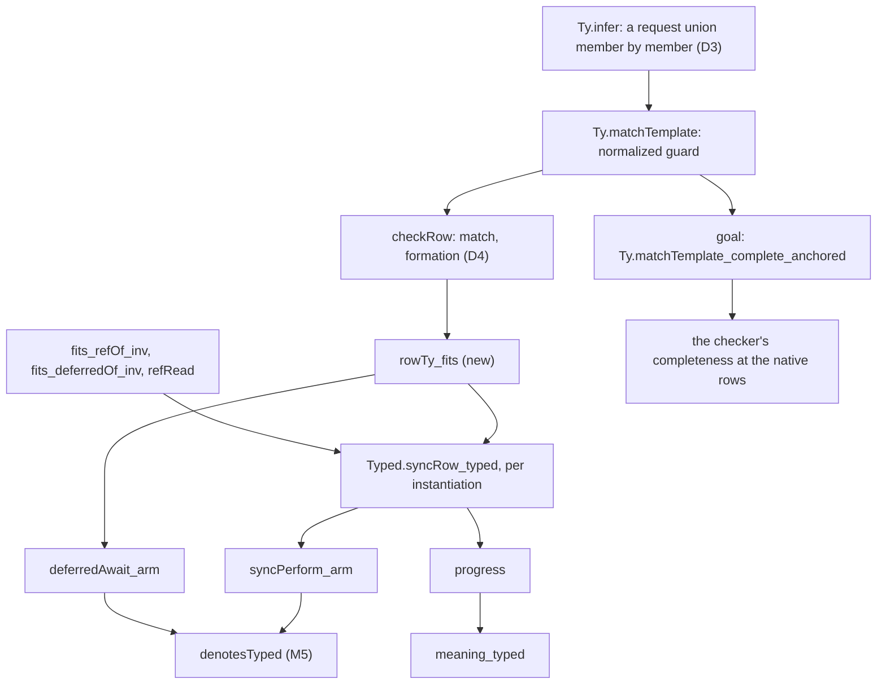

# 2026-10-04 seat T3a design: the Ref and Deferred rows as templates

Status: research note (history, not authority). Base: `a917b768` (`refactor/phase1-phase3` after
seat E2). Branch `seat/t3a`, fast-forwarded from `b1c80550` with no commit of this seat; worktree
`/Users/pooks/Dev/lean4-effect4-t3a`. Phase 1 of the seat T3a brief: slice T3a of the state plan
(`docs/research/2026-10-04-claude-lead/state-any-type-plan.md` §3), decisions rows 42, 155 (a),
183 and 209. No tree file changed. The probes sit in `docs/research/2026-10-04-seat-T3a/`.

**The one thing to know first.** Three findings change the brief's plan, and each needs a ruling
before phase 2.

1. `Deferred.make`'s type arguments change the program wire. `NativeOp.deferredMake` is wire tag
   13 with no field, and the tag rules refuse a re-typed constructor. The proposal retires tag 13
   and appends `deferredMakeOf (value error : Ty)` at tag 23 (D1). T3b's eight rows meet the same
   rule.
2. The anchored completeness, as the brief states it, is false for today's match (proved,
   `completeAnchored_refuted`). `Ty.normalize` distributes a product over a union, so
   `Ref.set(cell, x)` with a union-typed `x` reaches `Ty.infer` as a union, against which it binds
   nothing. p5's `Entry` cell meets it. The proposal repairs `infer` and lands the theorem as a
   placed goal (D3).
3. `Deferred.fail` at an error type outside the error alphabet would make M5 false, because
   `errOf` answers `boom` there. The proposal makes a deferred's error column a formation rule, so
   the checker refuses such a type where it is formed (D4).

## Question

Slice T3a turns the `Ref` rows without a function and the six `Deferred` rows into templates over
their type parameters. It gives `Deferred.make` its type arguments. The handle judgments, the
collision checks, the match, rows 155 and 183, the typed state and the faces move with it. The
eight read-modify-write rows stay closed at `refOf nat` for T3b. This note answers the brief's
phase 1:

- items 1–11 as found in the code, with the consumers measured by declaration and file;
- the restated statements as Lean, the goals and the placement of each theorem;
- every file that changes, the decisions, and the plan against E2's merged face.

## What was read or run

| Item | Evidence word |
| --- | --- |
| The state plan in full; the 2026-09-18 rows 42–43 plan §1, §2b, §2d; the type-algebra research note §3; decisions rows 42, 43, 55, 96, 120, 155, 183, 193, 203, 204, 207, 208, 209 | reading |
| Seats T0, T1, T2, E1 and E2: receipts and design notes; the faces contract's amendment at `26fbc785` | reading |
| The monitor's audit, obligation `state-declared-instance` and its controls | reading |
| At `a917b768`: `Program/Native.lean`, `Ty.lean`, `Typed.lean`, `Columns.lean`, `Table.lean`, `SigApp.lean`, `Formation.lean`, `Checker.lean`, `Typing/Rules.lean`; `Codegen/Read.lean`, `PrintLeaf.lean`, `Templates.lean`, `Types.lean`, `Classes.lean`, `ClassTable.lean`; `Laws/Program/Template.lean`, `TypeAlgebra.lean`, `Typed.lean`, `Typed/Membership.lean`, `Typed/Denotation.lean`, `Typed/Residual.lean`, `Typed/Adequacy.lean`, `Progress.lean`, `SoundAnySignature.lean`, `Signature.lean`; `Laws/Codegen/ReadLeaf.lean`, `ReadPrint.lean` | reading |
| The generators and faces: `tools/Drivers/TsGen.lean`, `tools/Tools/RowTypes.lean`, `tools/Effect4Gen/Rows.lean`, `src/OCaml5/Eff/Emit.lean`, `src/OCaml5/Tools/EffGen.lean`, `ts/eff/read.ts`, `ts/eff/profile.gen.ts`, `tools/target/rows.ts` | reading |
| The wire-tag rules (`tools/Effect4Gen/wire-tags.json`) and the conservativity clauses (`scripts/lib/conservativity.py`) | reading |
| `Census.lean`: every declaration of the `Effect4` and `Test` roots that names a listed constant | tested |
| `CorpusMoves.lean`: the corpus programs refused at a row T3a templates, and the admitted ones that name an old spelling | tested |
| `GoldenMoves.lean`: the OCaml golden programs that perform `Deferred.make`, name an old spelling or are refused at such a row | tested |
| `Anchored.lean`: the match counterexample, a scratch repair, p5's `Entry` cell, a `never` request | tested |
| `Statements.lean`: the restated `syncRow_typed`, the inversions, the read at the instance, the refutation of the brief's statement, and the face facts | proved (5 theorems, `[propext, Quot.sound]`); tested (guards) |
| OCaml consumers of the generated native table (`grep` under `ocaml/`) | tested |

Replay each probe from the worktree root under the shared lock:
`lake env lean -M8192 docs/research/2026-10-04-seat-T3a/<name>.lean`. `GoldenMoves.lean` needs
`lake build OCaml5.Eff.Goldens` first. Each output is `<name>.out` beside its probe. Every probe ran
at `b1c80550` and again at `a917b768`, with the same results. The `Entry` and `never` cases of
`Anchored.lean` ran at `a917b768` only.

## Findings

### F1. The consumers (measurement)

The census reads each declaration's type and value. It folds auxiliary declarations (matchers,
equation lemmas, `_f`, `_unsafe_rec`) into their parent, and counts the parent in its own module.
A declaration that only unfolds a constant by `decide` or `rfl` names none and is not counted.

| Constant | Count | Declarations, by file |
| --- | --- | --- |
| `NativeOp.refTy` | 12 in 9 modules | `NativeOp.row`, `nativeServiceTypes` (`Program/Native.lean`); `Val.hasTy_refTy_inv`, `syncOpOf_isSome` (`Laws/Program/Typed.lean`); `fits_refTy_inv`, `syncRow_typed` (`Typed/Denotation.lean`); Test: `ExternalContract.table`, `ReadContract.nativeServiceTy_profile`, `HostHandleForgery.internalTypes`, `AuthorContract.TheRef`, `ProgressContract.bool_cell_not_ref`, `SignatureControls.cellRow` |
| `NativeOp.deferredTy` | 6 in 4 | `NativeOp.row`; `Val.hasTy_deferredTy_inv`, `syncOpOf_isSome`; `fits_deferredTy_inv`, `syncRow_typed`; `HostHandleForgery.internalTypes` |
| `NativeOp.refTarget` | 32 in 12 | `Val.hasTy` (with `_f`, `_unsafe_rec`), `internalHandleTargets` (`Program/Typed.lean`); `NativeOp.refTy`; `Val.hasTy.alg`, `.hom` (`Laws/Program/Folds/Ty.lean`); `Val.hasTy_admitsExtend` (`Laws/Program/Admits.lean`); `externalValue_typed` (`Laws/Program/Admit.lean`); `HandleFits`, `fits_context_inv`, `fits_handle_fresh`, `fits_scope_inv`, `handleFits_map`, `handle_fits_hasTy`, `live_handle` (`Typed/Membership.lean`); `fits_memoMap_inv` (`Typed/LayerArm.lean`); the four handle inversions; `syncRow_typed`; Test: `FitsOrder.Reviewed.HandleFits`, eight of `ValueMembership`, `InvocationContract.requestFor` |
| `NativeOp.deferredTarget` | 25 in 11 | the same, less `refTy`, six of `ValueMembership` and `InvocationContract.requestFor`, plus `deferredTy` |
| `NativeOp.deferredTypeArgs` | 1 in 1 | `NativeOp.row` |
| `NativeOp.all` | 15 in 8 | `nativeSpell` (`Codegen/Read.lean`); `Table.lawful`, `builtinLookup_none` (`Program/Table.lean`); `rowChecks` (`Program/SigApp.lean`); `NativeOp.all_complete`, `NativeOp.external_not_mem_all`, `lawfulTable_member`, `nativeLawful`, `nativeRowOf_mem_all`, `nativeRow_hygiene` (`Laws/Codegen/ReadLeaf.lean`); `lawful_rowNamesSafe` (`Laws/Api/ModuleReadable.lean`); `Authoring.build_table_lawful` (`Laws/Program/Author.lean`); `LawfulSig.registered`, `LawfulSig.tableLawful` (`Laws/Program/Signature.lean`); `hostRow_valueVars` (`Typed/Denotation.lean`) |

Outside the Lean environment (tested by `grep`), these hand enumerations and spellings read the
same facts:

- `Tools.TsGen.allNativeOps` and its constructor guard (`tools/Drivers/TsGen.lean`);
- `Tools.RowTypes.nativeOps` (`tools/Tools/RowTypes.lean`);
- `OCaml5.Eff.allOps`, and `emitNative`'s `ref_ty` and `deferred_ty` (`src/OCaml5/Eff/Emit.lean`);
- `EffGen`'s constructor classes (`src/OCaml5/Tools/EffGen.lean`);
- the authoring generator's loop (`tools/Effect4Gen/Rows.lean`);
- `refT` (`tools/Tools/TyVectors.lean`) and the foreign corpus (`tools/Drivers/ForeignCorpus.lean`);
- the target lane's spelling map (`tools/target/rows.ts`).

A field on `deferredMake` reaches 166 declarations in 60 modules, most of them compiled whole-type
case splits. The hand edits are the pattern sites the compiler lists.

### F2. The wire refuses a re-typed constructor

`NativeOp.deferredMake` is `ctor 13 []` in the canonical bytes (`NativeOpC`,
`src/Effect4/Store/Domain/Derived/Program.lean`). The rules of `tools/Effect4Gen/wire-tags.json`
give a tag once and never declare a retired name again. C2 of the conservativity check refuses a
re-typed constructor: "an existing constructor is neither moved nor re-typed". So
`deferredMake (value error : Ty)` in place is refused (reading). The rule's route is a retirement
and an append.

The vectors that move (tested, `GoldenMoves.lean`):

- `pAwait`, `pCallback` and `pOps` perform `Deferred.make`: `ocaml/eff/goldens/*.bin`, `*.json`,
  and `ocaml/goldens/eff/pAwait.hex`;
- `pAcquire`'s checked answer is `handle "Ref.Ref<number>"`, so `pAcquire.ty` becomes `refOf nat`;
- `ocaml/eff/goldens/coverage.txt` loses its `Effect4.Program.NativeOp.deferredMake` row. C3
  refuses a count-table row that leaves, and has no rule for a retirement (reading).

T3b's eight rows change their field from `FnName` to `Term` at the same arity, under the same rule.

### F3. The anchored completeness is false for today's match

`checkRow` matches the normal request against the normal template (`Program/Typing/Rules.lean`).
`Ty.normalize` distributes a product over a union member, so the request of `Ref.set(cell, x)`
with `cell : Ref<string>` and `x : "a" | "b"` normalizes to a union of two products. `Ty.infer` has
no arm for a request union against a product template. It binds nothing, the parameter instantiates
at `never`, and the guard refuses. The substitution `[(0, string)]` puts the request under the
instance (tested, `Anchored.lean`).

`completeAnchored_refuted` (`Statements.lean`) proves the brief's statement false with today's
`infer`, by the kernel: the template is admissible and anchored, the request is normal, a
substitution exists, and `Ty.matchTemplate` answers `none`.

The shape is not academic. p5's `Entry` is a union of two tagged records. Writing an `Entry`-typed
value into an `Entry` cell is refused the same way (tested). `Deferred.fail` with a union-typed
value meets it (tested), and `Deferred.succeed` has the same request shape (reading).

A scratch repair infers a request union member by member, from the left, and leaves every other arm
alone. It finds the substitution in all three cases, keeps `Ref<number> | Ref<string>` against
`Ref<A>` refused, and is subsumption on a closed template (tested). A `never` request still matches
with the parameter at `never` (tested), so a dead branch gains no refusal.

### F4. `Deferred.fail` outside the error alphabet makes M5 false

`syncOpOf` will decode the failed value through `errOf` (`src/Effect4/Machine/Term.lean`). `errOf`
answers `boom` for a value outside the admitted alphabet, and `valOfErr boom` is `none`. The cause
then fits no error column, and the completion's precondition (`storePre`'s `ExitOk` arm,
`Typed/Residual.lean`) fails. A checked `Deferred.fail` on a `Deferred<A, boolean>` would have no
typed denotation (reading). `Typed.valOfErr_errOf_fits` needs `admittedErrTy E`
(`Typed/Denotation.lean`), and no world column carries it (`CellsTyped`, `Typed/Adequacy.lean`).

### F5. A parameter inside `Deferred.make`'s type arguments is instantiated at `never`

`checkRow` instantiates a row's columns at the match, and `Ty.instantiate` answers `never` at an
unbound parameter (`Program/Ty.lean`). `deferredMakeOf (.var 0) .nat` has a `unit` request, so its
answer `deferredOf (var 0) nat` types as `deferredOf never nat` (reading). The wire and the
authoring surface can build it; no reader yields one. `Row.wellScoped` refuses such a row only at
table admission (`rowChecks`). A check on the bindings instead of the template would refuse every
`never` request, which the template match accepts with the parameter at `never` (F3's last test).

### F6. Two committed corpus verdicts move

Of the corpus (400 generated programs and the wire corpus), 27 are refused with `requestNotSubtype`
at a row T3a templates. The template accepts the request in two (tested, `CorpusMoves.lean`):

| Program | Row | Request | Path |
| --- | --- | --- | --- |
| `g158` | `refMake` | `string` | `[0, 0, 0]` |
| `g277` | `refMake` | `Exit.Exit<never, number>` | `[0, 0, 1, 0, 0, 0, 0]` |

Their rows of `generated/corpus-index.tsv` move: the reason and path at least, the verdict if
nothing later refuses. No admitted corpus program names `Ref.Ref<number>` or
`Deferred.Deferred<number, number>` in an annotation or in its checked type (tested), so no admitted
program moves. No golden verdict moves (tested). C3 refuses a changed verdict row (reading).

### F7. Every list cell of the rc.112 texts writes `Ref.make<T>`

The reference texts (`Test/Dogfood/rc112/`) write `Ref.make<ReadonlyArray<string>>([])` (p3's log),
`Ref.make<ReadonlyArray<number>>([])` and `Ref.make<ReadonlyArray<Listener>>([])` (p5), and
`Ref.make<Account>(…)` and `Ref.make<Window>(…)`. Request inference types `[]` at `never[]` (`nil`
answers `list never`). Invariance (row 55) then refuses every write of a non-empty list (reading). A
record term carries its declared fields, so p4's and p5's record cells type at the record with no
type argument. T3b's terms do not change this.

### F8. The faces: only `Deferred.make`'s type arguments depend on the instance

- Every `Ref` row prints and reads at every instance. `Ref.make(x)` carries no type argument, and
  the readers read no type except a row's type arguments (reading).
- The type projection of today's instances is today's spelling (tested):
  `ofTy (refOf nat) = parseLegacy "Ref.Ref<number>"`, and the same for the deferred. So the code-7
  service type, which four truth programs print (`Context.Service<"k6_7", Ref.Ref<number>>`), and
  every declaration type print as today.
- The external-handle reservation must stay. An external handle spelled `Ref.Ref<number>` would
  print as a cell's type. The reservation is by exact string, so an external `Ref.Ref<string>` prints
  as `refOf string`'s type: a gap older than T3a and wider after it.
- E2's class-field reader (`Classes.readTy`) accepts a reading only when printing gives the spelling
  back (`readClassDecl`). T5 can read `Deferred.make<A, E>()`'s type arguments the same way.
- An operation's own types are not program annotations (`Formation.programAnnotations` reads
  `.op` as nothing). Admission's formation and `int` scans, and E2's class table
  (`ClassTable.moduleClasses`), do not see `Deferred.make`'s type arguments (reading).

### F9. The typed state: what breaks, and what holds at the base

What breaks when the rows become templates:

- `NativeOp.row_closed` turns false. Its consumers are `nativeSignature_row_closed` (then
  `progress`), `builtinPerform_inv` (then `syncPerform_arm`, `deferredAwait_arm`, `sleep_arm`), and
  the vacuous `row_templateAdmissible` and `row_wellScoped`.
- `rowTy_closed_some` stays true for closed rows. `progress` and `builtinPerform_inv` stop using it.
- `syncRow_typed` states its post at `(NativeOp.row op).answer`, a template.
- `fits_refTy_inv`, `fits_deferredTy_inv`, `Val.hasTy_refTy_inv`, `Val.hasTy_deferredTy_inv` and
  `refRead_nat` read the retired spellings.
- `syncOpOf_isSome` (contract item 8) becomes vacuous at `refMake`: `Val.hasTy v (var 0)` is false.

What holds at the base (proved, `Statements.lean`, at `[propext, Quot.sound]`):

- `syncRow_typed_at`, the restatement per instantiation, follows from today's theorem by the closed
  reduction;
- `fits_refOf_inv`, `fits_deferredOf_inv` and `refRead`, which states `refRead_nat` at any instance.

`syncRow_typed` feeds the M5 claim `denote-typed` (`Typed.denotesTyped`) through
`syncPerform_arm`, and `straight-meaning-typed` through `progress`. A planned goal there would make
M5, M6 and M7 proved modulo it (D9).

### F10. Rows 155 and 183 as found

- **Row 155.** `admitColumn` (`Program/Columns.lean`) reads `inhabited`, whose `ty_var` is `false`.
  `inhabited_iff_fits` (`Typed/Membership.lean`) needs it: a parameter has no member. So the row
  check needs its own fold, and the program columns keep `admitColumn`. No proof reads `rowChecks`'
  column entries (tested by `grep`).
- **Row 183.** `bitEntry` (`Typed/Residual.lean`) compares the certificate with the raw template
  columns. `external_arm` (`Typed/Denotation.lean`) certifies at the template and bridges through
  `fits_instantiate`. `Test/Program/TypedProgRows.lean` pins `bitEntry`'s shape.

### F11. The acceptance programs

| Program | What T3a admits | What still waits |
| --- | --- | --- |
| p4 | the `Window` record in one `Ref`, read and written by `Ref.get` and `Ref.set` | the atomic decision: `Ref.modify` with a term (T3b); `Effect.all` (DI-89) |
| p5 | the `Account` record in one `Ref`: the record term types `history: []` at its declared field | the listeners (code, R7); `int` (row 121); `Effect.callback`; the `seen` list cell (F7) |
| p3 | the gate, `Deferred<void>` as `deferredMakeOf unit never`, in the checker and the machine | its printing (T5: the face refuses another instance by name); the log, `Ref.make<ReadonlyArray<string>>([])` (F7, D6); appends with a term (T3b); the queue (DI-11) |

### F12. Cleanup owed to this file set

`NativeAtom.isSome_validIn` and `NativeAtom.getOrElse_validIn` (`Laws/Program/Progress.lean`) have
no consumer (tested). T1's receipt leaves them to the next slice that touches the file, which T3a
does. T2's `poke_world` and `Evaluating.store_restated` sit in files T3a does not touch; T3b takes
them.

## Proposals (not rulings)

The diagram shows the proof chain T3a restates. An arrow reads "is read by". It claims no proof.



### P1. The templated rows (item 1)

| Row | Request | Answer | Error |
| --- | --- | --- | --- |
| `refMake` | `var 0` | `refOf (var 0)` | `never` |
| `refGet` | `refOf (var 0)` | `var 0` | `never` |
| `refSet` | `prod (refOf (var 0)) (var 0)` | `refOf (var 0)` (DI-98, the cell) | `never` |
| `refGetAndSet`, `refSetAndGet` | `prod (refOf (var 0)) (var 0)` | `var 0` | `never` |
| `deferredMakeOf value error` | `unit` | `deferredOf value error` | `never` |
| `deferredIsDone`, `deferredPoll` | `deferredOf (var 0) (var 1)` | `bool` (DI-97 for `poll`) | `never` |
| `deferredSucceed` | `prod (deferredOf (var 0) (var 1)) (var 0)` | `bool` | `never` |
| `deferredFail` | `prod (deferredOf (var 0) (var 1)) (var 1)` | `bool` | `never` |
| `deferredAwait` | `deferredOf (var 0) (var 1)` | `var 0` | `var 1` |
| the eight read-modify-write rows | `refOf nat` | `unit` or `nat`, as today | `never` |

Every parameter of a request first occurs as the direct argument of `refOf` or `deferredOf`, except
`refMake`'s bare parameter, which the match binds at once (tested: `anchored` guards). Variance
stays invariant at both handles (row 55, `Ty.sub`). `refTy`, `deferredTy`, `refTarget` and
`deferredTarget` are deleted. `deferredTypeArgs` becomes a function of the instance (P2).

### P2. `Deferred.make`'s type arguments (item 2)

```lean
inductive NativeOp
  -- … every other constructor as today, `deferredMake` removed (wire tag 13 retired)
  | external (index : Nat)
  /-- `Deferred.make<A, E>()` (`vendor/effect-4.0.0-rc.112/src/Deferred.ts:171`) with its type
  arguments: the request fixes no parameter, so the operation carries them (decisions row 42). -/
  | deferredMakeOf (value error : Ty)
deriving DecidableEq

/-- The type arguments `Deferred.make` prints with, as legacy target spellings, until T5 derives
them from the instance. Only today's instance has a spelling the readers read back. Another
instance carries the empty spelling, which no reading parses (`parseLegacy_empty`), so the printer
refuses the row by name (`PrintRefusal.typeSpelling "Deferred.make"`) and no reader yields it. -/
def deferredTypeArgs (value error : Ty) : List String :=
  if value = .nat ∧ error = .nat then ["number", "number"] else [""]
```

The constructor is appended last. The OCaml layout pin (`ocaml/engine/e4_program_layout.ml`)
re-cuts with the LCNF group; `make check-ocaml` verifies it in phase 2.

- **Authoring.** The generated wrapper takes the constructor's parameters, as it does for
  `Ref.update f` and `Scope.make strategy`: `Deferred.make (value error : Ty) : Src NativeOp`. A
  program cannot be authored without them.
- **Reading.** `nativeSpell` answers the key's representative, `deferredMakeOf .nat .nat` (P6), and
  `readRowCall` compares the call's type arguments with the row's. `Deferred.make<number, number>()`
  reads. `Deferred.make()` and `Deferred.make<string, number>()` refuse with
  `ReadRefusal.arity "Deferred.make"`.
- **Printing.** Today's instance prints `Deferred.make<number, number>()`. Another instance refuses
  with `PrintRefusal.typeSpelling "Deferred.make"`, never a default.
- **Red controls.** `Deferred.make()` refused by the reader (`E4-CHECK-CE-013`, re-pinned);
  `Deferred.make<string, number>()` refused by the reader; `Api.print` of a
  `deferredMakeOf .string .nat` program refused by name; the checker admits that program at
  `deferredOf string nat` (the checker is not the face).

### P3. The read-modify-write rows stay closed (item 3)

They keep their `FnName` and their names, at `refOf nat` instead of `handle "Ref.Ref<number>"`.
`kernel_term_agrees` and the four discharges are unchanged. T3b gives them terms.

### P4. The decoder (item 4)

```lean
def syncOpOf : NativeOp → Val → Option SyncOp
  | refMake, v => some (SyncOp.refMake v)
  -- … `refGet` to `refModifySome`, `deferredIsDone`, `deferredPoll`: as today
  | deferredSucceed, .list [Val.promise ⟨k⟩, v] =>
    some (SyncOp.deferredCompleteWith ⟨k⟩ (Completion.ofExit (Exit.success v)))
  | deferredFail, .list [Val.promise ⟨k⟩, v] =>
    some (SyncOp.deferredCompleteWith ⟨k⟩ (Completion.ofExit (Exit.failure (Cause.fail (errOf v)))))
  | deferredMakeOf _ _, Val.unit => some SyncOp.deferredMake
  | scopeMake strategy, Val.unit => some (SyncOp.scopeMake strategy)
  | clockNow, Val.unit => some SyncOp.clockNow
  | _, _ => none
```

`errOf` is E1's carrier: a number is `tag`, a string `text`, a tagged pair `tagged`, a tagged
payload record `payload`. The machine already takes any value at `SyncOp.refMake` and any exit at
a completion. `ProgressContract`'s pin `syncOpOf .refMake (Val.bool true) = none` turns: the decoder
answers the store operation, and a non-cell request to `Ref.get` stays the red control.

### P5. The handle judgments (item 5)

```lean
-- `Val.hasTy`'s `.handle target` and `.app name _` arms (`Program/Typed.lean`): a cell or a
-- promise fits no spelling; it fits `refOf _` or `deferredOf _ _`, coarse as today (row 44)
      | some .scope => target == Ty.scopeTarget
      | some .memoMap => target == Ty.memoMapTarget
      | some .external => externalHandleTarget target && allocated[index]? == some target
      | _ => false

/-- The spellings an external handle may not take: the printed types of today's native
instances (`refOf nat`, `deferredOf nat nat`; their connector to `Ty.render` is a `#guard` beside
this list) and the internal kinds' targets. An external handle spelled so would print as a native
handle's type. Literals, so the proofs that decide membership in this list stay as they are. -/
def internalHandleTargets : List String :=
  ["Ref.Ref<number>", "Deferred.Deferred<number, number>", Ty.scopeTarget, Ty.contextTarget,
    Ty.memoMapTarget]

-- `Typed/Membership.lean`: row 96 D2 retires
def HandleFits (w : World) (kind : UInt8) (index : Nat) (target : String) : Prop :=
  match HandleKind.ofByte? kind with
  | some .scope => target = Ty.scopeTarget ∧ ScopeLive w index
  | some .memoMap => target = Ty.memoMapTarget ∧ MemoLive w ⟨index⟩
  | some .external => externalHandleTarget target = true ∧
      w.state.externals.allocated[index]? = some target
  | _ => False

def FlatFits (w : World) (v : Val) : Ty → Prop
  -- … the five arms of today
  | .refOf t => match v with | Value.cell index => RefDeclared w ⟨index⟩ t | _ => False
  | _ => False

def nativeServiceTypes : List (Nat × Ty) :=
  [(4, .nat), (5, .bool), (6, .unit), (7, .refOf .nat), (8, NativeOp.sqlTy), (9, NativeOp.kvTy)]
-- `flatCarrierAlg.ty_refOf _ := true` (`Program/SigApp.lean`): membership at `refOf t` reads the
-- table, with no recursion into `t`
```

`internalHandleTargets` keeps today's strings, so no external admission moves.

### P6. Collisions by spelling key (item 6)

```lean
/-- One native operation per spelling key (`rowKey`): every operation whose row carries no type
argument, each read-modify-write row at each name, and `Deferred.make` at the instance the faces
spell until T5. Each tool enumeration reads this list. -/
def NativeOp.spelled : List NativeOp := …   -- 55 entries, `deferredMakeOf .nat .nat` in place

/-- The built-in spelling keys (`Program/Table.lean`). -/
def nativeKeys : List (String × List String) := NativeOp.spelled.map (rowKey ∘ NativeOp.row)

/-- Every built-in operation's key is a built-in key: a row's key does not depend on the type
arguments its operation carries. -/
theorem NativeOp.rowKey_mem (op : NativeOp) (h : ∀ i, op ≠ .external i) :
    rowKey op.row ∈ nativeKeys
```

- `rowChecks`' `builtinCollision` and `Table.lawful` read `nativeKeys.contains (rowKey r)`.
- `nativeSpell` finds the key's representative in `NativeOp.spelled`.
- `NativeOp.all`, `fnNames`, `NativeOp.all_complete`, `NativeOp.external_not_mem_all` and
  `nativeRowOf_mem_all` are deleted. `lawfulTable_member`, `nativeLawful` and `nativeRow_hygiene`
  read `nativeKeys` and `NativeOp.rowKey_mem`.
- The authoring generator, `Tools.TsGen.allNativeOps`, `Tools.RowTypes.nativeOps` and
  `OCaml5.Eff.allOps` read `NativeOp.spelled`, so three hand copies go (D8).

### P7. The match (item 7)

```lean
-- `Ty.infer` (`Program/Ty.lean`), after the `.var` and union-template arms: a request union is
-- inferred member by member, as `Ty.sub` reads a union on the left
  | t, .union c d => infer (infer σ t c join) t d join

def matchTemplate (σ : Subst) (template request : Ty) (join : Bool := false) : Option Subst :=
  let σ' := infer σ template request join
  if sub request (instantiate σ' template).normalize then some σ' else none
```

The new arm recurses with the template fixed, so `infer` takes a measure on the sum of the two
sizes. `infer_closed` and `infer_widensSub` gain one case. `matchTemplate_sound` concludes at the
normalized instance; its consumers read `hasTy_normalize` or `fits_normalize` once.

```lean
-- `Laws/Program/Template.lean`
/-- A template's parameter occurrences in `infer`'s order, each flagged when it is the direct
argument of an invariant handle (`refOf`, `deferredOf`): a fold over `Ty`. -/
def Ty.paramOccurrences : Ty → List (Nat × Bool)

/-- Every parameter's first occurrence is flagged. -/
def Ty.anchored (t : Ty) : Bool

@[semantics "subtyping-algebra" (requirement := R4)]
proof_goal Ty.matchTemplate_complete_anchored {t r : Ty} {τ : Ty.Subst}
    (hadm : t.templateAdmissible = true) (hanch : t.anchored = true) (hr : Ty.Normal r)
    (hτ : Ty.sub r (t.instantiate τ).normalize = true) :
    ∃ σ, Ty.matchTemplate [] t r = some σ
```

The proof is an induction on the template. At an anchor, the two directions of an invariant
comparison and antisymmetry on normal forms force the binding (`sub_antisymm_normal`). I expect it
not to follow at once, so it lands as the placed goal.

### P8. Rows 155 and 183 (item 8)

```lean
/-- Inhabitance at a row column (decisions row 155 (a)): a template parameter reads as
inhabited, so a row column is checked at its instances, which the program's own columns check. -/
def rowColumnInhabitedAlg : TyAlgebra (fun _ => Bool) := { inhabitedAlg with ty_var := fun _ => true }

def admitRowColumn (t : Ty) : Bool := t.normalize == .never || cata_ty rowColumnInhabitedAlg t
-- `rowChecks`' three `emptyColumn` checks read `admitRowColumn`; program columns keep `admitColumn`

/-- **Row 183's host-row entry**: the operation is in the source signature's domain, and the
row's instance at some request type is below the certificate. -/
def bitEntry (root : ProgramSource) (op : NativeOp) (cert : EffTy) : Prop :=
  root.signature.dom op = true ∧
    ∃ reqTy t, rowTy (root.signature.rowOf op) reqTy = some t ∧
      t.answer.sub cert.answer = true ∧ t.error.sub cert.error = true
```

`external_arm` certifies at the checked instance and meets `bitEntry` by reflexivity, with no
bridge. `bitEntry` stays free of the world, so `asyncPre_mono` and `asyncPre_rows_append` keep their
proofs. `bitEntry_rows_append` re-reads `rowTy` at an unchanged row. The row-116 battery restates its
pins. D2's bridge lemmas (`fits_instantiate`, `valueVars_normalize`, `valueVars_of_noInternalHandle`)
are deleted if the build finds no consumer.

### P9. The typed state (item 9)

```lean
-- `Typed/Denotation.lean`: one generic step for every row
/-- **A checked row use places the request's values under the instance**. -/
theorem rowTy_fits {row : Row} {reqTy : Ty} {t : EffTy} (h : rowTy row reqTy = some t)
    (w : World) (v : Val) (hv : Fits w v reqTy) :
    ∃ σ, Fits w v (row.request.normalize.instantiate σ) ∧
      t.answer = (row.answer.instantiate σ).normalize ∧
      t.error = (row.error.instantiate σ).normalize ∧
      Formation.Formed (Formation.instantiatedSites row σ)

/-- **The store rows, per instantiation**: the node's checked instance types the store
operation. -/
@[semantics "residual-program-typing" (requirement := R4)]
theorem syncRow_typed (root : ProgramSource) {w : World} {req : Env.Requirement}
    (op : NativeOp) (hk : NativeOp.kind op = .sync) {reqTy : Ty} {t : EffTy}
    (hrow : rowTy (NativeOp.row op).normalizeTypes reqTy = some t)
    (v : Val) (hfit : Fits w v reqTy) :
    ∃ o, NativeOp.syncOpOf op v = some o ∧
      TypedProg root w ⟨t.answer, t.error, req⟩ (.vis (.inl o) fun ans => .pure (.success ans))

theorem fits_refOf_inv {w : World} {v : Val} {A : Ty} (h : Fits w v (.refOf A)) :
    ∃ k, v = Val.cell k ∧ RefDeclared w k A
theorem fits_deferredOf_inv {w : World} {v : Val} {A E : Ty} (h : Fits w v (.deferredOf A E)) :
    ∃ k, v = Val.promise k ∧ PromiseDeclared w k A E
theorem refRead {w : World} {key : RefKey} {A ty : Ty} {ans : Val}
    (hdecl : RefDeclared w key A) (hlookup : w.Ρ key = some ty) (hfit : Fits w ans ty) :
    Fits w ans A

theorem builtinPerform_inv {op : NativeOp} {r : Term} {q : Point} {t : EffTy}
    (hk : NativeOp.kind op ≠ .program)
    (hat : Node.at_ (.eff root.program) q.path = some (.eff (.perform op r)))
    (hpt : PointTyped root w q t) :
    ∃ v reqTy, evalTerm q.env r = some v ∧ Fits w v reqTy ∧
      rowTy (NativeOp.row op).normalizeTypes reqTy = some t

theorem Val.hasTy_refOf_inv {v : Val} {A : Ty} (h : Val.hasTy v (.refOf A) = true) :
    ∃ k, v = Val.cell k
theorem Val.hasTy_deferredOf_inv {v : Val} {A E : Ty} (h : Val.hasTy v (.deferredOf A E) = true) :
    ∃ k, v = Val.promise k
theorem syncOpOf_isSome (op : NativeOp) (σ : Ty.Subst) (v : Val)
    (hv : Val.hasTy v ((NativeOp.row op).request.instantiate σ) = true)
    (hk : (NativeOp.row op).kind = .sync) : (NativeOp.syncOpOf op v).isSome = true

-- `Laws/Program/Template.lean`: the siblings of the deleted `NativeOp.row_closed`, no longer vacuous
def NativeOp.typeArgsClosed : NativeOp → Bool
  | .deferredMakeOf value error => value.closed && error.closed
  | _ => true
theorem NativeOp.row_templateAdmissible (op : NativeOp) (h : op.typeArgsClosed = true) :
    (NativeOp.row op).request.templateAdmissible = true ∧
      (NativeOp.row op).answer.templateAdmissible = true ∧
      (NativeOp.row op).error.templateAdmissible = true
theorem NativeOp.row_wellScoped (op : NativeOp) (h : op.typeArgsClosed = true) :
    (NativeOp.row op).wellScoped = true
```

How the arms of `syncRow_typed` go. Each obtains the substitution from `rowTy_fits` and reads the
instance by `simp only [Ty.instantiate]`:

- the `Ref` rows run today's proof with `A` in place of `nat`, through `fits_refOf_inv` and
  `refRead`;
- `deferredMakeOf` certifies at the instance's columns, so a parameter inside a type argument (F5)
  still types;
- `deferredSucceed` meets `ExitOk` at the declared columns through `Equiv`;
- `deferredFail` reads `admittedErrTy E` from the formation evidence (D4), then
  `valOfErr_errOf_fits`;
- the eight read-modify-write rows run today's proof at `refOf nat`.

`progress`, `syncPerform_arm`, `deferredAwait_arm` and `inlineYield_typed` keep their statements
and read the restated lemmas. `NativeOp.syncOpOf_cellImplements` re-numbers its cases.

The deferred error rule (D4), in `Program/Formation.lean`:

```lean
def HeadFormed (template : Bool) : Ty → Prop
  | .record fields => (fields.map Prod.fst).Nodup
  | .map key _ => key.normalize = .string ∨ (template = true ∧ key.closed = false)
  -- a deferred fails only with a value the error alphabet carries (decisions rows 42, 120)
  | .deferredOf _ error => admittedErrTy error = true ∨ (template = true ∧ error.closed = false)
  | _ => True

inductive FormationReason where
  | repeatedField (name : String)
  | mapKey
  | deferredError   -- appended
```

`checkRow` checks the instantiated columns with this rule, so `Deferred.make<A, boolean>()` and
every later use of such a type refuse with
`instantiatedFormation "deferredMakeOf" ⟨…, deferredOf A boolean, deferredError⟩`. Admission refuses
the type in a program annotation and in a supplied row. Today every deferred is `(nat, nat)`, so no
verdict moves (tested: no corpus program names another deferred type).

### P10. The faces until T5 (item 10)

| Face | Change |
| --- | --- |
| Printed TypeScript | Unchanged for every program today's checker admits: predicted from F6 and F8 (tested), reproduced in phase 2 by regeneration. New: `Ref` rows print at every instance; `Deferred.make` at another instance refuses as `PrintRefusal.typeSpelling "Deferred.make"` |
| The Lean reader (`Codegen/Read.lean`) | `nativeSpell` reads `NativeOp.spelled`. `LawfulSpelling.spell_row` gains the premise that the row's head reads back: `rowHeadReadable row := row.shape == .value \|\| (rowTypeArgs row).isSome`. Its five uses in `Laws/Codegen/ReadLeaf.lean` discharge it from the `rowTypeArgs` fact or the value shape they already hold |
| The printer (`PrintLeaf`, `Templates`, `Print`, `Classes`, `ClassTable`) | No edit: `printRowHead` already refuses a row whose type arguments do not parse |
| The TypeScript reader (`ts/eff/read.ts`) | No edit: it reads `e.op` from the regenerated profile, now `deferredMakeOf` at `(nat, nat)` |
| (gen) `ts/eff/profile.gen.ts`, `eff.gen.ts`, `json.gen.ts`, `wire.gen.ts` | The `NativeOp` schema's new constructor; the rows' templates; code 7 at `refOf nat`, rendered `Ref.Ref<number>` |
| (gen) the OCaml `eff` group | `native_op`'s constructor; `all_ops` over `NativeOp.spelled`; `row_of`, `ref_ty` and `deferred_ty` deleted (no consumer, tested; D8) |
| (gen) the LCNF group | `native_op` gains `Ty` fields in `api_gen.ml` and `api_engine.ml`; the closures move; `Ty` is already in both API closures |
| (gen) the goldens | `pAwait`, `pCallback`, `pOps` (`.bin`, `.json`); `goldens/eff/pAwait.hex`; `pAcquire.ty`; `coverage.txt`; the three manifests and `wire-tags.txt`. Verdicts unchanged |
| (gen) `generated/row-types.tsv` | The native rows' templates, rendered at the probes `"p0"`, `"p1"` as the atoms' are (D10 proposes the same in `tools/target/rows.ts`) |
| The truth harness | No predicted change; `make check-truth` regenerates and compares |

### P11. The acceptance programs (item 11)

Each battery pins what F11's table says, with its `stage` and the README row moved by the
measurement:

- p4 and p5: the refused part "the … record in one Ref" moves to `built`, with a record cell
  read and written.
- p3: a refused part for the log at `Ref<never[]>` refusing its append, and the gate built at
  `Deferred<void, never>` and refused by the printer by name.

The program stages (`admitted`, `answer`, `printed`, `readBack`) do not move: each battery's
program keeps today's instances, so it still prints and reads back.

### P12. The registry and the documents

- `tools/Tools/SemanticsRegistry.lean`: R4's open parts restated (the read-modify-write terms,
  T3b; the type-argument faces and `Ref.make<A>`, T5); a new claim `template-match-anchored`
  (`subtyping-algebra`, role `decidability`, pointer the goal); `raw-formation`'s title names the
  deferred error column.
- `docs/core/semantics.md`: §2.2's reference read names `fits_refOf_inv` and `refRead`; §2.6 gains
  the property line of the new claim and restates `raw-formation`'s.
- (gen) `generated/semantics.md` by `make gen-semantics`.
- `Test/contracts/program-denotation.contract.md` item 8 restated per instance.
- `Test/Counterexamples/REGISTER.md`: `E4-CHECK-CE-018`, the match refusing a union request under a
  product template, with `completeAnchored_refuted`'s fixture as evidence and the `infer` arm as its
  repair; `E4-CHECK-CE-013`'s evidence re-pinned.

## The goals and the placement of each theorem

Expected planned goals: `Ty.matchTemplate_complete_anchored`, and `Typed.syncRow_typed` only if D9
rules (b).

| Theorem (file) | Concept, property | Claim, requirement | Consumer | Reach | Does not establish | Unlocks |
| --- | --- | --- | --- | --- | --- | --- |
| `Ty.matchTemplate_complete_anchored` (goal, `Laws/Program/Template.lean`) | `subtyping-algebra`: the match decides membership in some instance (its soundness half is `matchTemplate_sound`) | new `template-match-anchored`, R4 | the checker's completeness at the native rows | admissible, anchored templates; normal requests | completeness where a parameter first occurs covariantly; a union template | template rows with no silent refusal |
| `rowTy_fits` (new, `Typed/Denotation.lean`) | `residual-program-typing`: inversion of the row rule | step of `denote-typed` (M5), R4 | `syncRow_typed`, `deferredAwait_arm`, `progress` | every row, request type and world | anything about a row's post | one decomposition for every template row |
| `Typed.syncRow_typed` (restated; `Typed/Denotation.lean`) | `residual-program-typing`, serving `store-typing` | step of `denote-typed` and `straight-meaning-typed`; R4 | `syncPerform_arm`, `inlineYield_typed`, `progress` | native `sync` rows; every instance the checker admits; every world | host rows (R6); the asynchronous rows | M5–M7 at non-number state |
| `builtinPerform_inv` (restated) | `residual-program-typing`: inversion | step of `denote-typed` | `syncPerform_arm`, `deferredAwait_arm`, `sleep_arm` | built-in rows | the row's post | the arms at templates |
| `fits_refOf_inv`, `fits_deferredOf_inv`, `refRead` (restated, renamed) | `store-typing`: the reference read (TAPL §13.4's store typing, as §2.2 adapts it) | steps of `denote-typed` | `syncRow_typed`, `deferredAwait_arm`, `inlineYield_typed` | every world and declared type | liveness beyond the declaration | the read at any instance |
| `Val.hasTy_refOf_inv`, `Val.hasTy_deferredOf_inv`, `syncOpOf_isSome` (restated) | `residual-program-typing` | contract item 8 | the contract packet | every instance | that the store operation steps | — |
| `NativeOp.row_templateAdmissible`, `NativeOp.row_wellScoped` (restated) | `subtyping-algebra`: the template profile | R4 | the goal's hypothesis at the native rows | operations with closed type arguments | completeness | the profile `rowChecks` asks of supplied rows, held by the native table |
| `NativeOp.rowKey_mem` (new) | `translation-simulation`: the reader's spelling inverse | step of `read_print` and `read_exact` (R8) | `nativeLawful`, `lawfulTable_member` | every built-in operation | anything about type arguments | collisions without enumeration |
| `bitEntry`'s restatement with `bitEntry_rows_append` and `external_arm` | `residual-program-typing` | `denote-typed`'s host arm, row 183 | M5, the row-116 battery | host rows at any template | host-correspondence (R6) | a host answer at a template row admissible by membership |
| the `HandleFits` and `FlatFits` lemmas (re-proved) | `store-typing` | `fits-mono`, `fits-subn`, `fits-normalize` | their consumers | every world | — | row 96 D2 retired |

## Files that change

Generated files are marked (gen); their producer writes them, never a hand edit.

| File | Change |
| --- | --- |
| `src/Effect4/Program/Native.lean` | P1, P2, P4, P5's service table, P6's `NativeOp.spelled`; the five spellings and `NativeOp.all` deleted |
| `src/Effect4/Program/Ty.lean` | P7: the `infer` arm and the guard |
| `src/Effect4/Program/Typed.lean` | P5: `Val.hasTy`'s two arms, `internalHandleTargets` |
| `src/Effect4/Program/Columns.lean` | P8: `admitRowColumn` |
| `src/Effect4/Program/SigApp.lean` | P6 and P8: `rowChecks`; `flatCarrierAlg` |
| `src/Effect4/Program/Table.lean` | P6: `nativeKeys`, `Table.lawful`, `builtinLookup_none` |
| `src/Effect4/Program/Formation.lean` | P9: D4's arm and reason |
| `src/Effect4/Store/Domain/ProgramWire.lean` | `pAwait` at `deferredMakeOf .nat .nat` |
| `src/Effect4/Codegen/Read.lean` (E2's file, merged) | P10: `nativeSpell`, `rowHeadReadable`, `LawfulSpelling.spell_row` |
| (gen) `src/Effect4/Store/Domain/Derived/Program.lean`, `src/Effect4/Api/RefusalsDerived.lean`, `src/Effect4/Program/Authoring/Rows.lean`, `src/Effect4/Laws/Program/Authoring/Rows.lean` | the derived, Refusals, `Rows` and `RowsLaws` groups |
| `src/Effect4/Laws/Program/Template.lean`, `TypeAlgebra.lean` | P7, P9: the match laws, the siblings, the goal |
| `src/Effect4/Laws/Program/Typed.lean` | P9: the inversions, `syncOpOf_isSome`, the atoms' use of the guard |
| `src/Effect4/Laws/Program/Typed/Membership.lean`, `Typed/LayerArm.lean`, `Admit.lean`, `Admits.lean`, `Folds/Ty.lean` | P5: the handle and flat lemmas; `fold_of` re-derives `Val.hasTy.alg` |
| `src/Effect4/Laws/Program/Typed/Denotation.lean` | P9 and P8: the restatements, `rowTy_fits`, `external_arm`, `serviceTy_flat` |
| `src/Effect4/Laws/Program/Typed/Residual.lean` | P8: `bitEntry`, `bitEntry_rows_append` |
| `src/Effect4/Laws/Program/Progress.lean` | `progress`'s proof; `syncOpOf_cellImplements`; F12's two deletions |
| `src/Effect4/Laws/Program/Signature.lean`, `Author.lean`, `Laws/Codegen/ReadLeaf.lean`, `Laws/Api/ModuleReadable.lean` | P6: the key-based proofs; `spell_row`'s premise |
| the pattern sites the compiler lists for `deferredMakeOf` | mechanical |
| `Test/Program/TypedContract.lean`, `ProgressContract.lean`, `InvocationContract.lean`, `SignatureControls.lean`, `TypeAlgebraContract.lean`, `TypedProgRows.lean`, `AuthorContract.lean`, `AuthoringContract.lean`, `AdmissionColumns.lean`, `Gen.lean`, and the 19 files naming `.deferredMake` | restated pins and P2's, P3's and F3's red controls |
| `Test/Api/ExternalContract.lean`, `AcquireHandleContract.lean`, `PackagesContract.lean`; `Test/Codegen/ReadContract.lean`, `PrintContract.lean`; `Test/Counterexamples/Machine/Semantics/ValueMembership.lean`, `FitsOrder.lean`; `Test/Counterexamples/Machine/Runtime/HostHandleForgery.lean` | the retired names read as literals or `refOf nat` |
| `Test/Dogfood/P3WorkerQueue.lean`, `P4RateLimiter.lean`, `P5LedgerService.lean`, `README.md` | P11 |
| `Test/fixtures/baseline/66ee4657-supplement-v1.policy.json` | the addition, the retirement, the vector migrations (a review event) |
| `Test/fixtures/proof-style/baseline.tsv` | `make record-proof-style` |
| `Test/contracts/program-denotation.contract.md`, `Test/Counterexamples/REGISTER.md` | P12 |
| `tools/Effect4Gen/wire-tags.json` | tag 13 retired, `deferredMakeOf` at 23 |
| `tools/Conform/Effect4/cases-policy.json` | the `NativeOp` covers name `deferredMakeOf`; the `Ty` and `Formation.HeadFormed` sites |
| `tools/Drivers/TsGen.lean`, `tools/Tools/RowTypes.lean`, `tools/Tools/TyVectors.lean`, `tools/Drivers/ForeignCorpus.lean`, `tools/Effect4Gen/Rows.lean`, `tools/Effect4Gen/manifest.json`, `tools/Effect4Gen/guards/rows.lean`, `rowslaws.lean`, `program.lean` | the enumerations, the op's JSON, the guards |
| `src/OCaml5/Eff/Emit.lean`, `Goldens.lean`, `src/OCaml5/Tools/EffGen.lean` | the OCaml emitter, the goldens' programs, the constructor classes |
| `ocaml/engine/e4_program.ml`, `ocaml/gen/api_check.ml`, `ocaml/engine/test/test_engine.ml`, `ocaml/eff/README.md` | the hand mirrors |
| (gen) `ocaml/eff/*`, `ocaml/goldens/eff/*`, `ocaml/engine/e4_program_layout.*`, `ocaml/gen/api_gen.ml`, `ocaml/engine/api_engine.ml`, `ocaml/gen/closure-api_*.tsv`, `ts/eff/{eff,json,wire,profile}.gen.ts`, `generated/row-types.tsv`, `generated/corpus-index.tsv`, `generated/semantics.md` | regenerated |
| `tools/Tools/SemanticsRegistry.lean`, `docs/core/semantics.md` | P12 |
| `tools/target/rows.ts` (optional, D10) | the spelling map; type arguments at native subjects |
| this note, the probes, the receipt | force-added |

## Decisions for the coordinator

| Id | Question | Options | Recommendation |
| --- | --- | --- | --- |
| D1 | The wire of `Deferred.make`'s type arguments (F2) | (a) retire `deferredMake` (tag 13) and append `deferredMakeOf (value error : Ty)` (tag 23), the policy naming both and the migrated vectors; (b) re-type tag 13 in place, amending the tag rules and C2 | (a), with the name `deferredMakeOf` (it mirrors `Ty.deferredOf`). Rule T3b's eight rows the same way now: their change is same-arity, where the rule's protection matters most |
| D2 | The conservativity gate on a slice that is not an append (F2, F6) | (a) record C3's refusal lines (`g158`, `g277`, the `deferredMake` coverage row) in the receipt as declared moves, with the corpus-index diff as DI-60's review; (b) amend `scripts/lib/conservativity.py` so C3's count tables honour a named retirement and a policy key names verdict moves, with controls | (b), granted to this seat: T3b's retirements need the same rule. Else (a) |
| D3 | The match (F3) | (a) the `infer` arm for a request union, the normalized guard, the anchored completeness as a placed goal; (b) the same arm in `checkRow` only, leaving the atoms' `infer`; (c) no repair, the goal excluding requests whose normal form is a union above an anchor | (a): the general fix; the guard stays the law, so soundness holds. Phase 2 measures the corpus verdicts, since the atoms share `infer` |
| D4 | Where `Deferred.fail`'s error column is admitted (F4) | (a) a formation rule on `deferredOf`'s error column, `FormationReason.deferredError` appended; (b) a per-operation instance check in the checker (a `Signature` field, `HasTy.perform`'s premise, the inversions); (c) refuse at `Deferred.make` and add a world column of admitted errors (`CellsTyped`) | (a): one rule on the type former, checked wherever a type is formed, read by `syncRow_typed` from `rowTy` |
| D5 | A template parameter inside `Deferred.make`'s type arguments (F5) | (a) accept in T3a: the instance holds `never` there, as every unbound parameter does, and the typed state certifies at the instance; at T5 make operation data a program annotation (formation refusing a parameter, the `int` scan, E2's class table); (b) `checkRow` refuses a row that is not well scoped, reported as `outsideDomain`; (c) `nativeSignature.dom` refuses it, costing `nativeSignature_dom_sync` and `looped_sigProgram` | (a): no face yields one, and the general rule needs F8's annotation route, which T5's class table needs anyway. Never a check on the bindings, which refuses dead branches |
| D6 | `Ref.make<A>` (F7) | (a) append `refMakeOf (value : Ty)` now, its face refused until T5, with an authoring name to choose (it shares `Ref.make`'s spelling); (b) at T5, with the type-argument faces | (b). p3's log and p5's `seen` wait on it; p4's and p5's record cells do not |
| D7 | The face's refusal of `Deferred.make` at another instance | (a) the empty spelling in the row's type arguments (P2) and `spell_row`'s premise (P10): no printer edit; (b) a `Signature` field of printable operations, read by `rowPrint` and `rowDom` | (a) |
| D8 | Collisions and the enumerations | `NativeOp.spelled` and `nativeKeys` (P6); the three tool copies read the list; the OCaml `row_of`, `ref_ty` and `deferred_ty` deleted | all three |
| D9 | `syncRow_typed` restated (F9) | (a) proved in T3a; (b) a placed goal for T4 | (a), given D4 (a) or (b): it feeds M5–M7, which (b) would leave proved modulo it. The proof is today's per row at the instance |
| D10 | Files outside the brief's list | `Program/Formation.lean` (D4); `Program/Columns.lean`, `SigApp.lean`, `Table.lean`; the `Test` files of the file table; the policy file and `wire-tags.json` (D1); `scripts/lib/conservativity.py` (D2 (b)); `tools/target/rows.ts` (optional); `docs/core/semantics.md` and the registry | approve each, or strike it |
| D11 | Where the new red controls live | (a) in existing batteries (`TypedContract`, `ProgressContract`, `ReadContract`, `PrintContract`); (b) a new battery, with an anchor in `Test/All.lean` | (a): no root import edit |

Proposed decisions rows (for the receipt; the register is the coordinator's):

- the wire route for an operation's new fields (D1), covering T3b;
- a deferred's error column as a formation rule (D4), under rows 42 and 120;
- operation data as a program annotation at T5 (D5, F8);
- `Ref.make<A>` with T5's type-argument faces (D6);
- reserving the `Ref.` and `Deferred.` names from external handle targets, at T5 (F8).

## Merge plan against E2's files

E2 merged at `a917b768`, and this note is written against it. T3a merges the branch's later head
before phase 2 changes code.

- **Read.lean.** T3a edits `nativeSpell`, adds `rowHeadReadable` beside `requestReadable`, and
  gives `LawfulSpelling.spell_row` its premise. The reader's `classes` argument is untouched.
- **ReadLeaf.lean.** T3a edits `nativeLawful`, the key lemmas and the five `spell_row` uses. Each use
  already holds the `rowTypeArgs` fact or the value shape.
- **The printer files** (`PrintLeaf`, `Templates`, `Print`, `Classes`, `ClassTable`), `ts/eff/read.ts`
  and the truth prelude: no edit.
- **TsGen.lean.** E2 edited `emitTypeProjectionCases` and the template classifier. T3a edits
  `allNativeOps`, `opJs` and the constructor guard.
- **The generated groups and the policy file.** Regenerate after any merge; never hand-merge a
  generated file. The policy file is a review event: merge its lists by union.

## What this does not establish

- Phase 2 owes every proof. The probes prove five theorems at the base, at closed rows, and test the
  rest on finite inputs.
- The repaired match's completeness is a goal. The tests cover the native templates' shapes only.
- The corpus moves are candidates. Phase 2 measures each new verdict with the whole checker.
- The faces are unchanged for today's instances by a finite measurement. No theorem covers another
  instance until T5.
- Concurrency, host rows at templates (R6), functions as values and `Deferred.completeWith` stay
  outside, as the state plan's §4 says.
- An admitted program at non-number state that cannot print is not a face; T5 owns that.
